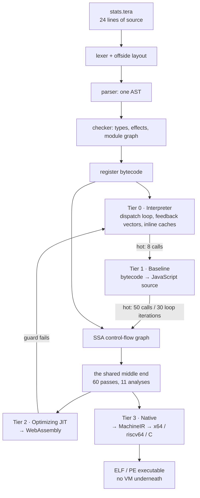

# The tera engine

A book about how a language actually runs.

`tera` is a small language with an unusually large engine behind it: **four execution
tiers that must all agree on what a program means.** The same twenty-four lines of source
are interpreted, then compiled to JavaScript, then compiled to WebAssembly, then compiled
to a standalone native executable — and all four must print the same thing.

This book follows one program through all of it.

> **Status.** Every chapter file in this book is currently an **outline**: thesis,
> handovers, verified source anchors, section list, and commands that reproduce the
> chapter's central claim. The prose is not written yet. See [Conventions](CONVENTIONS.md)
> for the rules the prose will follow.

## Why this book exists

The engine has a hard no-comment rule. Measured across `src/`:

| | |
| --- | --- |
| TypeScript files | 468 |
| Lines of source | 120,822 |
| **Comment lines** | **26** |
| Test files | 408 |

There is no other prose documentation — no README, no design docs, no architecture notes.
Every decision, invariant, and known limitation lives in the code and in the tests. So this
book is the engine's **only comment layer**, and it is written to be checkable: claims cite
tests by their exact titles, and every chapter ends with commands you can run.

## The four tiers on one page



The two roads out of the middle end are the book's structural hinge. The JIT may **guess**,
because it can always deoptimize back into the interpreter. The native compiler may **not**,
because there is nothing to fall back to — so where the JIT inserts a guard, the native
compiler must either prove the fact or refuse the program.

Those thresholds are real, from `src/runtime/tiering/defaults.ts`:

```
baselineThreshold:  8      calls before tier 1
jitThreshold:      50      calls before tier 2
loopOsrThreshold:  30      loop iterations before entering a running loop
maxDeoptCount:      3      bailouts before a function stops being optimized
```

## Two answers, one program

The book opens with a program the four tiers do **not** agree about:

```
fn drain(q: int[]) -> int:
  total = 0
  while q.length > 0:
    a = q.shift()
    b = q.shift()
    total += a + b
  return total
```

The interpreter runs it and prints `10`. The native compiler refuses it:

```
tera compile: 6:18 Operator '+' cannot be applied to 'int' and 'int | undefined' (the value may be absent: guard it before use, or spell a fallback with ??)
```

`while q.length > 0` proves the *first* `shift()` returns a value. It proves nothing about
the second. The interpreter never has to ask; the compiler cannot avoid asking. Chapter 1
opens on this, and chapter 13 pays it off.

## How to read it

Start at chapter 1 and keep going — the book is one journey and each chapter opens with the
artifact the previous one produced. If you want a shorter route:

- **Front end only** — how source becomes a checked tree.
  Chapters 1–3, 4–16, 73–75.
- **The JIT road** — how a running program gets faster, and how speculation is undone safely.
  Chapters 1–3, 17–24, 33–40, 41–54, 80.
- **The AOT road** — how the same graph becomes a native binary with no VM under it.
  Chapters 1–3, 9–16, 38–50, 55–72, 81.

Full table of contents: [SUMMARY.md](SUMMARY.md).

## Running everything yourself

The book assumes a built engine:

```bash
npm install && npm run build
```

Then every listing in the book comes from a file in [`example/`](example/README.md):

```bash
node dist/cli.js docs/example/stats.tera
```

The CLI is a d8-style shell — it will show you every stage:

```bash
node dist/cli.js --print-ast docs/example/stats.tera
node dist/cli.js --print-bytecode docs/example/stats.tera
node dist/cli.js --print-ir docs/example/stats.tera
node dist/cli.js --trace docs/example/stats-deopt.tera
node dist/cli.js compile docs/example/stats.tera -o stats.exe
```

## What this book does not cover

Named here so the gaps are visible rather than quietly closed:

- **The web tools** beyond the compiler visualizer (chapter 76): `tools/notebook`,
  `tools/editor` and `tools/ui` internals, and the `.tenb` notebook format.
- **The chart library's statistics** — described as the shape of a domain bridge in
  chapter 28, never derived.
- **The sibling packages** `mlfw`, `query_engine`, `quantc`, `reactive` and the
  `peta`/`petahub` package manager. They appear only where a value crosses into them,
  described by interface.
- **The VS Code extension** beyond its debug-adapter worker (chapter 75).
- **A builtin-by-builtin reference.** `data/tera-language-spec.ts` is 8,251 lines; it is
  taught as a mechanism — one source of truth feeding the checker, the REPL, the editor and
  the syntax grammar — and cited, never reproduced.
- **riscv64 instruction encoding and Mach-O output**, because neither exists: riscv64's
  `McTarget.encode()` throws, and `CONTAINERS.macho` is null. Chapters 72 and 82 name both
  as declared-but-unbuilt.
- **Benchmarking as a discipline.** There is no benchmark harness in this tree, so the book
  reports the measurements the project actually recorded, with their caveats, and adds no
  methodology chapter.
- **Security, sandboxing and concurrency.** The engine has no story here by construction —
  the AOT import table actively refuses to bind `CreateThread`, `pthread_create` and
  `clone`. Chapter 81 states that as a design boundary.
- **Formal semantics and type-soundness proofs.** Where the book names prior art — V8's
  Ignition, Sparkplug and TurboFan, Wimmer's linear scan, Cooper–Harvey–Kennedy dominators,
  Clinger, fdlibm, LLVM's pass manager and `-opt-bisect-limit` — it does so to place a
  technique, not to survey the field.
