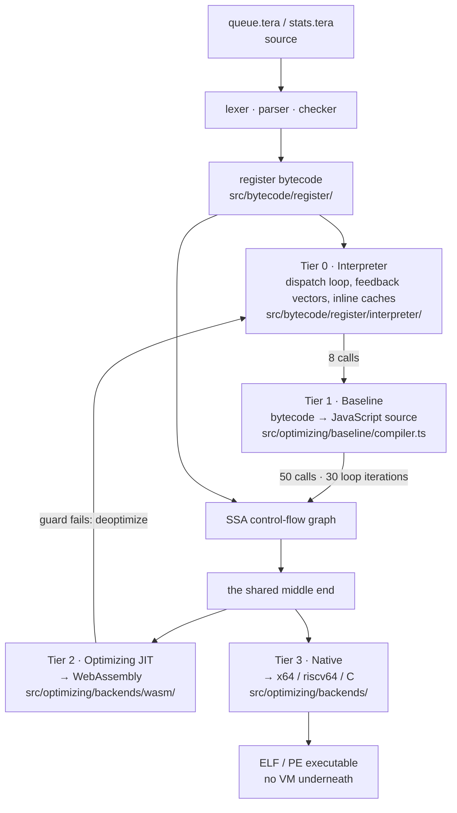

# 1. Two Answers, One Program   ⟨I · B · J · N⟩

Here is a nine-line program. One of tera's four machines runs it and prints `10`. Another
reads it, declines to produce a binary at all, and explains why in one sentence. Neither
machine is broken. They disagree because one of them is *allowed to find out* and the other
one has to *know in advance*, and the thing they disagree about is a single fact: how many
elements are left in an array after you have taken one out of it.

That is the whole subject of this book, and it is visible before any machinery. tera has
four execution tiers — a register bytecode interpreter, a baseline compiler that emits
JavaScript, an optimizing JIT that emits WebAssembly, and an ahead-of-time compiler that
emits a standalone ELF or PE executable — and they share one bytecode, one object model and
one set of type facts. What they are obliged to share is the *answer*. Every one of the
remaining eighty-two chapters is, at bottom, about how that obligation is kept, and about
the two places it is legitimately allowed to break: the JIT may guess, because a wrong guess
can be undone; the native compiler may not, because there is nothing underneath it to fall
back into.

This chapter shows you the disagreement, walks the exact analysis that produces it, and then
hands you the instruments the rest of the book uses to check itself: the tier badge on every
heading, the five honesty markers, the `differential()` helper, and a "Verify it yourself"
block whose commands were all run before they were written down.

**What arrived.** Nothing. This is the first chapter. You can program; you have never built
a compiler. Nothing in this book assumes you know what SSA, a basic block, a dominator, a
lattice or a relocation is — each of those gets a short primer at the exact point it is
first needed, and never before. What you do need is a terminal with the engine built
(`npm install && npm run build`), because every claim here is a command you can run.

## The cold open

The program is in the tree, at `docs/example/queue.tera`. It drains a queue two elements at
a time.

```
fn drain(q: int[]) -> int:
  total = 0
  while q.length > 0:
    a = q.shift()
    b = q.shift()
    total += a + b
  return total

print(drain([1, 2, 3, 4]))
```
— `docs/example/queue.tera:1-9`

`shift()` removes the first element of an array and answers it. `q.length > 0` is the
guard. Four elements, two taken per turn, two turns: `1 + 2` then `3 + 4`, so `10`.

Run it:

```
$ node dist/cli.js docs/example/queue.tera
10
```

Now ask the same engine to produce a native executable from it:

```
$ node dist/cli.js compile docs/example/queue.tera -o /tmp/queue.exe
tera compile: 6:18 Operator '+' cannot be applied to 'int' and 'int | undefined' (the value may be absent: guard it before use, or spell a fallback with ??)
$ echo $?
1
```

No file is written at `/tmp/queue.exe`. The compiler did not crash, did not time out, and
did not emit a binary that prints something else. It refused, named the line and column,
named both operand types, and told you the two ways out.

The same gate can be opened by hand on the interpreter's own road, without asking for a
binary at all:

```
$ node dist/cli.js --typecheck strict docs/example/queue.tera
6:18 Operator '+' cannot be applied to 'int' and 'int | undefined' (the value may be absent: guard it before use, or spell a fallback with ??)
$ echo $?
1
```

Identical sentence, different prefix. A third route, `tera check`, reaches the same checker
by a different path and decorates the sentence with an absolute path:

```
$ node dist/cli.js check docs/example/queue.tera
C:\Users\slexi\Documents\tera\docs\example\queue.tera:6:18: error: Operator '+' cannot be applied to 'int' and 'int | undefined' (the value may be absent: guard it before use, or spell a fallback with ??)
```

One sentence, three prefixes. This book quotes refusals verbatim
(`docs/CONVENTIONS.md` rule 5) because in an engine with 26 comment lines in 120,822, the
user-facing sentence is the most accurate specification of a limit that exists. Note that
the sentence is a single line; where `docs/README.md` wraps it across two, that is the
README's width, not the compiler's output.

Everything in a grey box in this book was run. If a command in a "Verify it yourself" block
does not do what the chapter says, the chapter is stale, and finding that out by running it
is the point.

## What `shift()` answers

`q` is declared `int[]`. So why is anything in this program typed `int | undefined`?

Because `shift()` is a **partial operation**: there are inputs for which it has no answer.
An empty array has no first element. Something has to come back anyway, and tera's checker
says so out loud.

> **New idea. Partial operation, and the honest type for one.** An operation is *total* when
> it has an answer for every input of its declared type, and *partial* when it does not.
> `length` is total on any array. `shift()` is not: on an empty array there is no first
> element to hand back. A language has three choices. It can invent an answer (return `0`,
> or `""`), which turns an empty queue into a plausible-looking wrong number that nothing
> will ever flag. It can trap, which converts every take into a possible crash and forces a
> check the caller usually cannot express. Or it can widen the answer's *type* to include
> the absence — `int | undefined` — and require the caller to deal with it. The third choice
> is the only one where the compiler can tell you, at compile time, that you forgot.
> A type shaped like "a value, or nothing" is often called an **option type**; tera spells
> it as an ordinary union with `undefined` in it.

The type is not written in the language spec — `data/tera-language-spec.ts` declares
`shift`'s return as `"any"`. It is manufactured by the checker, from the array's element
type, in one line:

```ts
  if (property === "pop" || property === "shift") return signature(`${owner}.${property}`, [], unionType([element, "undefined"]));
```
— `src/frontend/checker/infer.ts:669`

`element` for `q: int[]` is `int`, so `shift()` on `q` answers `int | undefined`, and `pop()`
does the same. That is where the `undefined` in the refusal comes from, and it is where the
`int` on the other side of the `+` did *not* come from — because for `a`, something removed
it.

What a *correct* drain does once it reaches a binary is pinned:
`[t: tests/e2e/optimizing/aot/drain-absence.test.ts > "answers undefined only after the last element is taken the way the interpreter does"]`
compiles `xs: int[] = [1, 2]` followed by three `pop()`s to a real PE executable, runs it,
and compares its output to the interpreter's, character for character. So the absence is not
a checker fiction that the backends quietly paper over: a native binary really does answer
`undefined` for the third pop, and really does agree with the interpreter about when.

## What a guard proves

`while q.length > 0` is doing real work. It is why `a` is `int` and not `int | undefined`.
The question is why it stops working one line later.

> **New idea. A flow fact.** Type checking is usually thought of as "this name has this
> type", fixed for the name's whole life. But a test in the source can make a *narrower*
> statement true at a particular place: after `if x != null`, `x` is not null — inside that
> branch, and nowhere else. A fact like that is a **flow fact**, and making the checker
> believe it is called **narrowing**. The hard part is never establishing the fact. It is
> knowing where it stops holding. "True here" and "true from here on" are different claims,
> and confusing them is how a checker becomes unsound.

tera's answer is unusually literal: it does not track a boolean "this array is non-empty".
It tracks *a number* — how many elements the guard proved were there — and every take spends
one.

The arithmetic that turns a test into a number is 62 lines in `src/core/indexing.ts`, and it
is shared with the optimizer:

```ts
const PROVEN_COUNT: ReadonlyMap<string, (bound: number) => number> = new Map([
  [">", (bound: number) => bound + ONE_COUNT],
  [">=", (bound: number) => bound],
  ["==", (bound: number) => bound],
  ["===", (bound: number) => bound],
  ["loose==", (bound: number) => bound],
  ["!=", (bound: number) => (bound === NO_COUNT ? ONE_COUNT : NO_COUNT)],
  ["!==", (bound: number) => (bound === NO_COUNT ? ONE_COUNT : NO_COUNT)],
  ["loose!=", (bound: number) => (bound === NO_COUNT ? ONE_COUNT : NO_COUNT)],
]);

export function provenCount(op: string, bound: number, negated = false): number {
  const read = negated ? COMPLEMENT.get(op) : op;
  const proven = read === undefined ? NO_COUNT : PROVEN_COUNT.get(read)?.(bound) ?? NO_COUNT;
  return Math.max(NO_COUNT, proven);
}
```
— `src/core/indexing.ts:44-59`

For `q.length > 0`, that is `provenCount(">", 0)` — the `>` entry, `bound + 1` — which is
`1`. One element, proven. Not "non-empty". *One.* `>= 2` would prove two, `== 3` would prove
three, and an operator not in the table proves nothing at all
`[t: tests/core/indexing.test.ts > "counts one more than a bound the count must exceed"]`.
The `COMPLEMENT` map handles the other arm: on the `else` side of `if q.length > 0`, the
checker reads `<=` instead
`[t: tests/core/indexing.test.ts > "reads a negated test as its complement"]`.

The model of what *changes* a length is two lines:

```ts
export const TAKES_ONE_ELEMENT: ReadonlySet<string> = new Set<string>(["pop", "shift"]);
export const ADDS_ONE_ELEMENT: ReadonlySet<string> = new Set<string>(["push", "unshift"]);
```
— `src/core/indexing.ts:61-62`

Everything else is in `src/frontend/checker/length-bounds.ts`, whose only export is
`provenTakes(body)`. It walks the program keeping a map from array name to remaining proven
count, and the two moves that matter are these:

```ts
    const call = memberCall(node);
    if (call === null) return;
    if (TAKES_ONE_ELEMENT.has(call.member)) return this.takes(node.callee as ASTNode, call.held);
    if (ADDS_ONE_ELEMENT.has(call.member)) this.adds(call.held);
  }

  private takes(callee: ASTNode, held: string): void {
    this.taken.add(held);
    const left = this.counts.get(held);
    if (left === undefined) return;
    if (left >= HOLDS_ONE) this.proven.add(callee);
    this.write(held, Math.max(NOTHING, left - ONE_ELEMENT));
  }

  private adds(held: string): void {
    const left = this.counts.get(held);
    if (left === undefined) return;
    this.write(held, left + ONE_ELEMENT);
  }
```
— `src/frontend/checker/length-bounds.ts:215-233`

Now walk `queue.tera` line by line. The `while` test writes `q → 1`. Line 4's `q.shift()`
reaches `takes()`: `left` is `1`, which is `>= HOLDS_ONE`, so that call node is added to
`proven`, and the count is written down to `0`. Line 5's `q.shift()` reaches `takes()`
again: `left` is now `0`, which is not `>= HOLDS_ONE`, so nothing is added to `proven` and
the count stays at `0`. Line 6 then asks for `a + b`. `a` came from a proven call, so the
`undefined` is stripped and it is `int`. `b` did not, so it is still `int | undefined`. The
`+` has no meaning for those two, and the checker says so at 6:18.

That exact shape is a unit test:
`[t: tests/frontend/checker/length-bounds.test.ts > "proves the first take and refuses the next"]`
asserts that only line 3 of its source ends up in the proven set. Raise the guard and the
budget rises with it —
`[t: tests/frontend/checker/length-bounds.test.ts > "proves as many takes as the guard counted"]`
gives `>= 2` three takes to spend on and asserts exactly two come back proven. Put an
element back and it repays the debt:
`[t: tests/frontend/checker/length-bounds.test.ts > "counts a put back towards the take that follows it"]`
has a `push` between two `shift`s and both are proven.

The rest of the file is about where the count must be thrown away. Two tables decide it.
`CARRIES_ITS_OWN_SCOPE` covers function, model and class bodies; `RUNS_REPEATEDLY` covers
`for` and any block whose `testRole` is `"loop"`:

```ts
  private statement(node: SemanticNode): void {
    const scoped = CARRIES_ITS_OWN_SCOPE.get(node.kind);
    if (scoped) return this.deferred(node, scoped(node));
    const repeated = RUNS_REPEATEDLY.get(node.kind)?.(node) ?? null;
    if (repeated) {
      for (const held of repeated.entered) this.expression(held);
      return this.forget(this.apart(() => {
        if (repeated.test) this.expression(repeated.test);
        this.guarded(repeated.test, false);
        this.statements(repeated.body);
      }));
    }
    for (const held of ownExpressions(node)) this.expression(held);
    if (node.kind === "Block") this.entered(node);
  }
```
— `src/frontend/checker/length-bounds.ts:138-152`

`apart()` swaps in an empty count map, runs the region, and swaps the real one back — so a
loop body starts from zero every time, and its guard is re-read from inside. That is why
`queue.tera`'s `while` still proves the first `shift()`: the test is applied *within* the
isolated region. And `forget()` then discards every array the region touched, so nothing a
loop did leaks into the statements after it. The same isolation is why a take inside a
nested function proves nothing at all — the function may run later, or never
`[t: tests/frontend/checker/length-bounds.test.ts > "proves nothing about a take inside a nested function"]` —
and why a take the loop may repeat proves nothing about itself
`[t: tests/frontend/checker/length-bounds.test.ts > "a take a loop may repeat" > "proves nothing about the take itself"]`.

Branches merge with `leastRemaining`, which is a `Math.min`, because the count is a *lower*
bound: if one arm leaves two and the other leaves one, what is proven after the merge is
one.

The whole analysis runs once, over the whole program body, at bind time —
`provenTakes: provenTakes(program.body)` at `src/frontend/checker/binder.ts:323`, stored on
`BoundProgram.provenTakes` (`binder.ts:34`). It is a fact about the *shape of the source*,
not about a scope. And the consumer is a single conditional:

```ts
function inferCall(node: ASTNode, bound: BoundProgram, scope: Scope): TypeName {
  const comprehension = arrayComprehensionType(node, bound, scope);
  if (comprehension) return comprehension;
  const sig = callSignatureForCallee(node.callee as ASTNode, bound, scope);
  if (!sig) return "unknown";
  const instantiated = instantiateForCall(sig, node.args as ASTNode[], bound, scope, typeArgsOf(node.callee as ASTNode));
  if (instantiated.async) return promiseType(instantiated.returns, bound.env);
  if (instantiated.generator) return yieldedType(instantiated.returns);
  const answered = chosenArgumentType(node, bound, scope) ?? instantiated.returns;
  return bound.provenTakes.has(node.callee as ASTNode)
    ? removeNullish(answered, bound.env)
    : answered;
}
```
— `src/frontend/checker/infer.ts:399-411`

One ternary, and it is the entire narrowing. `provenTakes` is a set of AST *nodes* — call
sites, not names — so membership is decided per call, which is precisely what "the first one
but not the second" requires.

The refusal sentence names its own two exits, and both are pinned:
`[t: tests/frontend/checker/type-checker.test.ts > "stays quiet once a length test has ruled the absence out"]`
covers the guard, and
`[t: tests/frontend/checker/type-checker.test.ts > "stays quiet once a fallback spells what an empty collection answers"]`
covers `?? 0`. The advice is not glued to every diagnostic either —
`[t: tests/frontend/checker/type-checker.test.ts > "leaves a mismatch that absence does not explain without the advice"]`
asserts a plain type mismatch does not get it.

## Why the obvious design fails

*(Why the obvious design fails.)*

Counting is not the design a reader reaches for first. The obvious design is a boolean.
`q.length > 0` is true, so mark `q` as non-empty; when you see `q.shift()` on an array
marked non-empty, strip the `undefined`. It fits in twenty lines, it handles the common
case, and it is exactly what this engine did between 2026-09-02 and 2026-09-07.

The flag lived on `Binding`, the record a name resolves to, as `filled?: boolean`. The guard
wrote it into the narrowed child scope, and the call site read it:

```ts
function takesFromFilled(callee: ASTNode, scope: Scope): boolean {
  if (callee.type !== NodeType.MemberExpression) return false;
  if (!TAKES_ONE.has(memberName(callee))) return false;
  const name = subjectName(callee.object as ASTNode);
  return name !== null && lookup(scope, name)?.filled === true;
}
```
— `src/frontend/checker/infer.ts` at commit `851e025`; deleted in `11021f9`

Read `takesFromFilled` and ask what clears the flag. Nothing does. `narrowScope` sets
`filled: true` when it sees the guard, and no other code path in the checker ever sets it
back. In particular, the one operation that certainly falsifies it — a `shift()` that
consumes the element the guard proved — does not touch it, because the flag is written by
the *narrowing* machinery and read by the *inference* machinery, and neither owns the
transition between them.

So the second `shift()` in `queue.tera` looked up `q`, found `filled === true` still sitting
there, and stripped the `undefined`. The checker typed `b` as `int`, saw `a + b` as
`int + int`, and passed the program. Whatever came next believed it.

The fix was not to add a kill: "clear `filled` on take" is one line, and it is still wrong
the moment a guard proves two elements and the code takes two, because a boolean cannot tell
`>= 1` from `>= 2`. The fix was to change what is carried. Commit `11021f9` deleted the
field, added the 290 lines of `src/frontend/checker/length-bounds.ts`, and replaced the flag
with a count that every take spends and every put repays. `Binding` no longer has a `filled`
field at all — `src/frontend/checker/type-system.ts:26-36` — and the deletion is committed,
not pending. The regression tests are the thirty in
`tests/frontend/checker/length-bounds.test.ts`, of which
`[t: tests/frontend/checker/length-bounds.test.ts > "proves the first take and refuses the next"]`
is the one that fails against the old design.

The general rule, which is the only reason this story is in the book: **a refinement about
mutable state must name what falsifies it.** If you cannot say, at the moment you record the
fact, which operations kill it, you have not recorded a fact — you have recorded a hope. And
where the state is *quantitative*, the refinement has to be quantitative too: carry the
quantity, and spend it.

## Two answers, then and now

With the sticky boolean in place, `queue.tera` with an odd-length argument produced two
different answers from one program. `drain([1, 2, 3])` takes `1` and `2`, then loops again
because the length is still `1`, takes `3`, and finds nothing for `b`. The interpreter,
which never asks a type question, added `3` to nothing and printed `NaN`. The native
compiler had been told by the checker that `b` was `int`, emitted integer arithmetic, and
printed `0`. Same source, same engine, two answers.

**That divergence is not reproducible on this tree, and this chapter must say so in the same
breath it tells the story** (`docs/CONVENTIONS.md` rule 7 — this book may be the comment
layer the codebase lacks, but it may not become a second source of truth). Today the odd
program is refused by exactly the same sentence as the even one:

```
$ node dist/cli.js compile queue-odd.tera -o queue-odd.exe
tera compile: 6:18 Operator '+' cannot be applied to 'int' and 'int | undefined' (the value may be absent: guard it before use, or spell a fallback with ??)
```

The interpreter still prints `NaN`, because the interpreter does not type-check anything.
That is not a disagreement; that is the interpreter being the tier that finds out.

A book about agreement should be able to show you a live disagreement, though, and there is
one — through a different door in the same wall.

> **Broken.** `TAKES_ONE_ELEMENT` and `ADDS_ONE_ELEMENT` in `src/core/indexing.ts:61-62`
> model `pop`, `shift`, `push` and `unshift` and nothing else. But
> `data/tera-language-spec.ts:6650` also declares `splice(start, count?, ...items)`, which
> sits immediately after `unshift` in the same array surface, changes a length, and is fully
> lowered by the optimizer at `src/optimizing/passes/array-methods.ts:1336`. It is in
> neither table. So a `splice` that empties an array is invisible to the length-bounds
> analysis, which goes on believing the guard's count.
>
> Measured on this tree, 2026-09-07. A five-line function — `if q.length > 0:` then
> `q.splice(0, 1)`, then `a = q.shift()`, then `return a + 1`, with a fallthrough
> `return 0`, called as `drain([5])` — prints `NaN` from the interpreter and `0` from the
> native binary it compiles to, and `tera check` accepts it in silence and exits 0. That is
> the `Binding.filled` divergence exactly, arriving through `splice` instead of through a
> second `shift`.
>
> Fixing it costs a `provenCount`-style transfer rule for `splice`: the second argument is a
> delete count and the rest arguments are inserts, so the net change is
> `items.length - count`. It also costs a decision about what to do when either is not a
> literal — almost certainly proving nothing, the way `provenCount` already treats an
> operator it does not recognise.

The reproducer is deliberately *not* in `docs/example/`. Convention 1 says every listing in
this book comes from a file in the tree that a test runs; a program whose whole purpose is
to produce two answers cannot be pinned to one expected output, so it stays out of the
example set and lives only in this callout and in "Verify it yourself" below.

That gap has a name of its own, because the analysis is only as exact as the tables are
complete:

> **Unenforced.** Nothing checks that `TAKES_ONE_ELEMENT ∪ ADDS_ONE_ELEMENT` is the complete
> set of length-changing array members. The transfer function's soundness rests entirely on
> that closure. Grepping the tree, the two constants are imported by exactly three files —
> `src/frontend/checker/length-bounds.ts:2`, `src/optimizing/passes/array-shapes.ts:67` and
> `src/optimizing/passes/class-member-lowering.ts:69` — and by no test at all; the closest
> test file, `tests/core/indexing.test.ts`, imports only `normalizeIndex`, `provenCount` and
> `resolveSlice`. There is no `satisfies` constraint tying either set to the array surface in
> `data/tera-language-spec.ts`. The `splice` item above is what that gap costs, and it will
> cost the same again for the next length-changing member anyone adds.

One more historical item belongs here, because this chapter introduces the example set and a
reader may have seen older notes. `docs/example/labeled.tera` uses `continue outer`, and it
used to loop forever. It does not now: it prints `1`, `2`, `3`, `5`, `6`, `7` on six lines
and exits 0
`[t: tests/e2e/docs/book-examples.test.ts > "labeled.tera resumes the outer loop instead of restarting the program"]`.
The fix was to stop letting a labeled statement patch a jump target it does not own: the
label is registered in `_pendingLoopLabels`
(`src/bytecode/register/compiler/statements.ts:668-689`) and `enterLoop`
(`src/bytecode/register/compiler/helpers.ts:131-145`) hands it to the loop context that owns
the latch. It is told as engineering in `[Ch 19 § the-bug]`; it is named here
only so you can run the file without worrying.

## The four machines

Four machines execute tera. They are not four projects; they are four back ends on one
front end.



> **New idea. Tier, threshold, back edge.** A **tier** is one of several machines that can
> run the same program, ordered by how much work they spend compiling it before it runs. The
> interpreter starts instantly and runs slowly; the native compiler spends the most and
> produces the fastest code. Moving a function from one tier to the next is called *tiering
> up*, and it is triggered by a **threshold** — a count the runtime keeps and compares.
> A **back edge** is a jump backwards in the program, which is what a loop is made of; the
> runtime counts those separately, because a function called once but looping a million
> times is hot even though its call count says otherwise.

The thresholds are not folklore. They are a frozen object:

```ts
export const DEFAULT_TIERING_POLICY: TieringThresholds = Object.freeze({
  baselineThreshold: 8,
  jitThreshold: 50,
  loopOsrThreshold: 30,
  maxDeoptCount: 3,
```
— `src/runtime/tiering/defaults.ts:13-17`

Eight calls to reach the baseline compiler; fifty to reach the optimizing JIT; thirty loop
iterations to enter a loop that is *already running*; three bailouts before a function is
given up on as un-optimizable.

Tier 1 is worth one sentence now because it surprises people. The baseline compiler does not
emit machine code. It emits **JavaScript source text**, and hands it to the host:

```ts
      const fn = new Function("args", "tv", "$", "pc", "env", body) as (
```
— `src/optimizing/baseline/compiler.ts:86`

`body` is a string the compiler built. The host's own JIT compiles it. This is the whole of
tier 1's strategy: get out of the dispatch loop without building a compiler, by borrowing
one.

## What they share

The four machines share more than they differ by, and the list is what makes this book's
structure possible.

They share **one bytecode**. The interpreter executes it, the baseline compiler translates
it, and both compiling tiers build their graph from it. There is no second front end for the
native road.

They share **one object model** — the same hidden classes, the same tagged values, the same
elements kinds — even where the AOT road later flattens all of it into static layouts. Where
that flattening makes a word mean two different things, `docs/GLOSSARY.md` gives both
meanings; *map* alone names a hidden class in the interpreter, a class-table entry in AOT,
and the `Map` collection in the language.

They share **one set of type facts**, produced once by the checker. `provenTakes` is
computed at bind time and consulted by inference; the same `TAKES_ONE_ELEMENT` table that
the checker uses in `length-bounds.ts` is imported by two optimizer passes. A fact
established in the front end is not re-derived downstream.

And they share **one middle end**: one SSA graph, one pass pipeline, one set of analyses.
The JIT and the native compiler diverge only after it.

That last one is why this book is in pipeline order rather than one part per engine. An
engine-per-engine book would describe the same forty passes four times, or describe them
once and cross-reference three times. Pipeline order pays a different cost — it is harder to
answer "which of the four does this constrain?" — and the tier badge on every heading is
what buys that back.

## The hinge

What the four must agree on is the **answer**. Not the timing, not the code, not the
memory layout: the value the program produces and the text it prints. The interpreter is the
oracle; every other tier is measured against it.

The asymmetry sits one level down, in what each tier is allowed to assume while producing
that answer.

> **New idea. Speculation versus proof.** A compiler can go fast in two ways. It can
> **prove** a fact — establish, by analysis, that the fact holds for every possible
> execution — and then compile code that depends on it. Or it can **speculate**: guess that
> the fact holds, compile code that depends on it, and insert a **guard** that checks the
> guess at run time. Speculation is enormously more powerful, because most facts that are
> *true* are not *provable* from the source. But it only works if you have somewhere to go
> when the guard fails.

The JIT has somewhere to go. When a guard fails, it abandons the optimized code mid-flight
and resumes in the interpreter from a reconstructed frame — deoptimization,
`[Ch 54 § deoptimizing-out-of-wasm]`. So the JIT is licensed to guess: it may compile
`total += this.values[i]` as an unchecked double addition on the strength of having seen
doubles the last fifty times, because a `Series` full of strings will merely be slow, not
wrong.

The native compiler has nowhere to go. There is no interpreter in the binary, no frame to
rebuild, no bytecode to resume into. It is the same graph, produced by the same passes, with
no way out — `[Ch 55 § the-same-graph-with-no-way-out]`. So where the JIT inserts a guard,
the native compiler must do one of two things: prove the fact, or refuse.

> **New idea. Refusal as an answer.** A compiler that says "no" is not a compiler that
> failed. It is a compiler that declined to produce a binary it could not stand behind, and
> said which line and which fact stopped it. The alternative is not "a compiler that
> succeeds" — the alternative is a binary that prints `0` where the interpreter printed
> `NaN`. `queue.tera`'s refusal is the first-class version of that answer, and
> `[Ch 81 § refusal-as-a-first-class-answer]` is where it becomes a design position rather
> than an incident.

Refusal has two grains. `queue.tera` is refused whole: the checker produces a diagnostic and
nothing is emitted. `docs/example/stats-refused.tera` is declined *per function* — the
backend skips what it cannot lower, names the reason, and only fails if the entry point
depended on it:

```
$ node dist/cli.js compile docs/example/stats-refused.tera -o /tmp/sr.exe
tera compile: warning: skipped 'describe' (x64-windows backend cannot emit: function returns a string but its return type is not a string)
tera compile: warning: skipped 'tera_program' (calls unavailable function describe)
tera compile: x64-windows backend cannot emit: entry function tera_program could not be lowered to native code: it calls describe, skipped because x64-windows backend cannot emit: function returns a string but its return type is not a string
```

`[t: tests/e2e/docs/book-examples.test.ts > "stats-refused.tera runs in the interpreter but is declined by the backend"]`
pins both halves: the interpreter prints its two lines, and the compile names that sentence.

## The instrument   ⟨I · B · J⟩

The book's evidence base is one helper. `differential()` in `tests/helpers/tiers.ts` runs a
source at several tier configurations and asserts they all answer the same thing. Two
hundred and eight calls to it across thirty-three test files are what stands behind every
"the tiers agree" claim in the remaining chapters.

The configurations are thresholds, not switches:

```ts
const TIERS = {
  oracle: { osr: false, tieringPolicy: { jitThreshold: 1e12, baselineThreshold: 1e12 } },
  baseline: { osr: false, tieringPolicy: { jitThreshold: 1e12, baselineThreshold: 3 } },
  jit: { osr: false, tieringPolicy: { jitThreshold: 30, baselineThreshold: 3 } },
  osr: { tieringPolicy: { jitThreshold: 30, baselineThreshold: 3 } },
  eager: { tieringPolicy: { jitThreshold: 3, baselineThreshold: 2, loopOsrThreshold: 3 } },
  baselineOsr: { tieringPolicy: { jitThreshold: 1e12, baselineThreshold: 3 } },
  production: {},
} as const;
```
— `tests/helpers/tiers.ts:10-18`

`oracle` does not *disable* the compilers. It sets their thresholds to `1e12`, so nothing
ever gets hot enough to reach them. `eager` does the reverse: three calls to the JIT, two to
the baseline, three loop iterations to on-stack replacement, so a test can reach tier 2 in a
handful of iterations instead of fifty. That framing matters, because it means every tier is
exercised through the *real* tiering policy rather than through a test-only code path.

The helper's most instructive line is a refusal of its own:

```ts
const PRINTS_INSTEAD_OF_ANSWERING =
  "differential compares what a program answers, not what it printed; end the source with the " +
  "value itself rather than a print, or the tiers are compared as undefined === undefined";

const answersNothingVisible = (source: string): boolean => {
  const lines = source.split(String.fromCharCode(10)).filter((line) => line.trim().length > 0);
  return lines[lines.length - 1]?.trimStart().startsWith("print(") === true;
};
```
— `tests/helpers/tiers.ts:35-42`

Thrown at `tests/helpers/tiers.ts:48`, before any engine is constructed. The reason is worth
sitting with. `print(...)` evaluates to nothing, so a source ending in a `print` answers
`undefined` at every tier — and `expect(undefined).toEqual(undefined)` passes no matter how
badly a tier miscompiled the program. A helper that compared stdout instead would be a
different, weaker instrument; this one insists on the value, and refuses sources that cannot
supply it.

> **New idea. Differential testing.** The ordinary way to test a compiler is a golden file:
> run the program, compare the output to a recorded expectation. That catches regressions
> against yesterday, but it says nothing about whether four machines agree *today*, and it
> requires someone to have written down the right answer. Differential testing compares the
> implementations against each other. The interpreter is the definition of the answer, and
> every other tier is asserted equal to it — so a test can be written without knowing what a
> program prints, and a bug that makes one tier disagree fails immediately, no matter which
> tier is wrong.

Two caveats, because the instrument is narrower than its name.

The method name is misleading and this book keeps it anyway (`docs/CONVENTIONS.md` rule 4):
`differential()` calls `engine.runNative(source)`, but `Engine.runNative`
(`src/api/engine.ts:1523`) has nothing to do with the native back end. It runs the source
and converts the result to a host JavaScript value via `taggedToNative`. "Native" there
means *the host's* native values.

Which brings the second caveat: **`differential()` covers three of the four machines.** Its
seven tiers are all interpreter, baseline, JIT and OSR configurations. The fourth machine has
a separate instrument — `peAgrees` in `tests/helpers/aot-agreement.ts:32-37` compiles the
source to a real PE executable, runs it, and compares its *stdout* to the interpreter's,
which is exactly the comparison `differential()` refuses to make. Twenty-four test files use
it, all of them under `tests/e2e/optimizing/aot/`. The two instruments are complementary and their union is the book's evidence base, but no
single helper compares all four at once, and the claim "all four tiers agree on
`stats.tera`" is `[unpinned]` — `differential()` throws on `stats.tera`'s source, whose last
line is `print(report(throughput))`, and no other test pins multi-tier agreement on that file.

What *is* pinned about the example set is narrower and worth knowing precisely:
`[t: tests/e2e/docs/book-examples.test.ts > "covers every example file, so a new one cannot be added untested"]`
guarantees no ninth variation can be added without an expected output, and each file gets a
generated `"<file>.tera prints what the book says it prints"` — but those run a single
default-configuration engine, once. They pin the answer, not the agreement.

You can still watch the tiers agree from the command line. `queue.tera` cannot show it,
which is worth stating plainly rather than implying otherwise: `--no-opt` and `--always-opt`
both print `10`, but `--always-opt --trace-opt` emits no `[JIT]` line at all, because `drain`
is called exactly once and `--always-opt` still needs two calls to reach the baseline
(`src/cli/main.ts:54-57`). `stats.tera` does show it:

```
$ node dist/cli.js --opt-threshold 1 --baseline-threshold 1 --trace-opt docs/example/stats.tera 2>&1 \
    | grep -E "Wasm module compiled|Wasm installed|not compilable|mean="
[JIT] Compiling "report": Wasm module compiled: 419 bytes, 1 blocks
[JIT] Compiling "report": Wasm installed in 9.48ms
[JIT] Compiling "label": Wasm: graph not compilable: property access on this receiver
[JIT] Compiling "mean": Wasm: graph not compilable: property access on this receiver
latency mean=15.70
throughput mean=898.19
```

The filter is not cosmetic and the chapter will not pretend otherwise: the unfiltered command
prints forty lines — bailouts, inlining decisions, LICM hoists, cooldowns — and the four that
carry this claim are buried in them. Run it without the pipe to see the rest. The
installation figure is wall-clock time from one run on one machine and varies run to run;
nothing in this book depends on it.

`report` really is compiled to WebAssembly and installed; `label` and `mean` are refused by
the wasm back end and fall back to the baseline; and the two lines of output are identical to
the interpreter's. Three tiers, one answer, in one command — and a fourth refusal, printed
rather than hidden, which is `[Ch 3 § forms-11-and-12-two-legalizations]`'s subject.

## The gate   ⟨N⟩

Refusal happens in one place, and the mechanism is smaller than it looks. `Engine.compileInRuntime`
takes an `aot` flag, and its first line does the whole thing:

```ts
    const mode = aot ? STRICT_TYPECHECK : this.typecheckMode;
```
— `src/api/engine.ts:1187`

Whatever the caller configured, the AOT road runs the checker in strict mode. Eighteen lines
later, strict mode is what turns a diagnostic into a thrown error rather than a stored one:

```ts
    if (mode === STRICT_TYPECHECK && this.diagnostics.length > 0) {
      throw new TypecheckError(this.diagnostics);
    }
```
— `src/api/engine.ts:1205-1207`

That exact pair appears twice in the file — again at `src/api/engine.ts:1426-1427`, inside
`loadModuleGraph`, which is the door `compileAotModule` uses for a multi-file program.
`compileAot` (`:944`) and `compileAotModule` (`:1001`) are the two entrances, and they reach
one gate each.

The override is not advisory. `tests/helpers/aot-agreement.ts:6` constructs its engines with
`{ typecheck: "off" }` and then calls `compileAot` anyway — and gets strict checking,
because `aot` is `true`. There is no way to ask for a native binary and skip the checker.

`--typecheck strict` on the run path reaches the same throw through
`this.typecheckMode`, which is why it prints the same sentence. `tera check` does **not** go
through the Engine at all: `runCheck` (`src/cli/main.ts:141-155`) never constructs one. It
builds the module graph itself and calls `checkModuleGraph(graph, { ...options, mode: "strict" })`
directly (`src/cli/main.ts:134`), reporting each diagnostic through `reportDiagnostic`
(`:118-121`) and returning a failure exit code. So: two doors reach the Engine's gate, and a
third route reaches the same checker in the same mode by a separate path. All three print the
same sentence and exit 1.

The default mode is neither of those. It is `warn` — and warn mode is where a diagnostic
goes to die:

> **Never runs.** `Engine.diagnostics` (`src/api/engine.ts:713`) in the default `warn` mode.
> The checker runs, produces the diagnostic, and stores it on the field at
> `src/api/engine.ts:1200`. Nothing in `src/` ever reads it again except the two strict-mode
> throws at `:1205-1206` and `:1426-1427`. Verified: `node dist/cli.js --typecheck warn
> docs/example/queue.tera` prints `10`, exits 0, and says not one word about the absence.
> The only reader anywhere in the tree is a test
> `[t: tests/e2e/language/types.test.ts > "supports off, warn, and strict modes"]`.
> (`src/cli/main.ts:134` does loop over diagnostics, but those come from a fresh
> `checkModuleGraph` call inside `runCheck` — a different object — so the field itself is
> still unread.) Reporting it costs one loop in `src/cli/main.ts`'s `runProgram` and a
> decision about whether a warning should change the exit code.

## How to read this book

Six conventions carry most of the weight, and all six are visible on this page.

**Tier badges.** `⟨I · B · J · N⟩` on every chapter heading — interpreter, baseline, JIT,
native — and on any section that binds fewer than all four. `§ the-gate` above carries
`⟨N⟩`, because the forced strict check belongs to the native road; `§ the-instrument`
carries `⟨I · B · J⟩`, because `differential()` does not reach the fourth machine. In
pipeline order the badge is the fastest answer to "does this constrain the tier I care
about?"

**The five honesty markers.** `> **Dead.**` (present, unreachable). `> **Never runs.**`
(reachable, nothing calls it). `> **Broken.**` (present, gives a wrong answer).
`> **Measured worse.**` (complete, correct, tested, and switched off because the numbers said
so). `> **Unfinished.**` (present, incomplete). Plus `> **Unenforced.**` for an invariant
nothing checks. Each names a file and a symbol and says what finishing it would cost, and
each is copied by hand into `docs/appendix/d-inventory.md`. This chapter contributes three.
The markers are not a disclaimer section at the back; they sit at the point in the prose
where you would otherwise believe the wrong thing.

**Verify it yourself.** Every chapter ends with three to six exact commands that reproduce
its central claim. This is the book's defence against rot: the engine changes, the prose does
not, and the only reliable way to discover that is to run the chapter. Where a claim cannot
be reproduced from a command — because it needs a test harness, or a divergence that has
since closed — the chapter says so in one sentence rather than quietly asserting it.

**Excerpts are capped at 20 lines** and always captioned with file and line range on the line
after the fence. Longer code is described and linked, never pasted. Short excerpts are what
make a stale quote cheap to re-check, and a wrong line range is the most likely defect in a
book like this.

**Behavioural claims carry a verbatim test title**, in the form
`[t: tests/path/file.test.ts > "the exact title"]`. In a codebase with 26 comment lines, a
test title *is* the design document. A claim with no test is marked `[unpinned]` — as the
four-tier agreement claim was, two sections ago — rather than asserted with confidence it has
not earned.

**Cross-references are by number and slug**: `[Ch 54 § deoptimizing-out-of-wasm]`, never "see
above". Chapters must survive reordering and must be readable out of sequence, because most
readers will not go in sequence.

The book is one journey and each chapter opens with the artifact the previous one produced,
so start here and keep going. Three shorter routes exist, from `docs/README.md:99-104`:

- **Front end only** — how source becomes a checked tree. Chapters 1–3, 4–16, 73–75.
- **The JIT road** — how a running program gets faster, and how speculation is undone
  safely. Chapters 1–3, 17–24, 33–40, 41–54, 80.
- **The AOT road** — how the same graph becomes a native binary with no VM under it.
  Chapters 1–3, 9–16, 38–50, 55–72, 81.

All three start here, because all three need the same three things: a program, a reason to
care whether the machines agree about it, and the instruments to check.

## What leaves

Three things go forward to `[Ch 2 § what-leaves]` and then to every part after it.

**A program the four machines do not agree about.** `docs/example/queue.tera`, nine lines, in
the tree, run by `tests/e2e/docs/book-examples.test.ts`. It prints `10` from the interpreter
and is refused by `tera compile` with a sentence naming line 6, column 18, and both operand
types. The mechanism behind that refusal — one flow fact about an array's length, spent by
the first `shift()` and unavailable to the second — is `[Ch 13 § spending-and-refunding]`'s
subject. The refusal itself becomes a contract in `[Ch 80 § the-agreement-contract]` and a
design position in `[Ch 81 § refusal-as-a-first-class-answer]`.

**A map of the four machines** and what they share: one register bytecode, one object model,
one set of type facts computed once in the front end, and one middle end that both compiling
tiers run before they diverge. With the real thresholds on it — 8 calls to the baseline, 50
to the JIT, 30 loop iterations to OSR, 3 deoptimizations before a function is given up on —
and the hinge those two roads turn on: the JIT may guess because a failed guess deoptimizes
into the interpreter; the native compiler may not, because there is nothing under it.

**The instruments.** `differential()` and its seven threshold configurations, along with the
fact that it covers three machines and `peAgrees` covers the fourth. The tier badge. The five
honesty markers plus `> **Unenforced.**`. The verbatim-test-title rule and its `[unpinned]`
escape hatch. "Verify it yourself" as the anti-rot mechanism.

Chapter 2 takes the reader who now knows the stakes and teaches them the language — colon
and indent blocks, `name: type = value` with no binding keyword, `fn` and `class` and
`interface`, `for x of` against `for k in`, slices and `@` — as far as `stats.tera` and its
seven variations need and no further, so that chapter 3 can show one line of that program in
fourteen representations without stopping to explain the source.

## Verify it yourself

```bash
# the interpreter answers
node dist/cli.js docs/example/queue.tera

# the same gate the compiler uses, opened by hand on the run path
node dist/cli.js --typecheck strict docs/example/queue.tera; echo "exit=$?"

# ahead of time: the same sentence, and no binary at /tmp/queue.exe
node dist/cli.js compile docs/example/queue.tera -o /tmp/queue.exe; echo "exit=$?"
ls /tmp/queue.exe

# the default mode stores the diagnostic and prints nothing about it
node dist/cli.js --typecheck warn docs/example/queue.tera; echo "exit=$?"

# three tiers, one answer: report reaches wasm, label and mean are refused and fall back.
# Drop the pipe to see all forty trace lines.
node dist/cli.js --opt-threshold 1 --baseline-threshold 1 --trace-opt docs/example/stats.tera 2>&1 \
  | grep -E "Wasm module compiled|Wasm installed|not compilable|mean="

# a program that does compile, cross-built to a Linux ELF from any host
node dist/cli.js compile docs/example/stats.tera --target x64 --platform linux -o /tmp/stats-linux
file /tmp/stats-linux

# the transfer function, one take at a time (30 tests)
npx vitest run --project unit tests/frontend/checker/length-bounds.test.ts

# every example file prints what this book says it prints (13 tests)
npx vitest run --project e2e tests/e2e/docs/book-examples.test.ts
```

The `> **Broken.**` splice divergence needs a file that is deliberately not in the tree.
Save these eight lines as `splice.tera` somewhere outside the repository — with your editor,
not with a shell heredoc, which eats backslashes — and run the three commands after it:

```
fn drain(q: int[]) -> int:
  if q.length > 0:
    q.splice(0, 1)
    a = q.shift()
    return a + 1
  return 0

print(drain([5]))
```

```bash
node dist/cli.js splice.tera            # NaN, exit 0
node dist/cli.js check splice.tera      # prints nothing, exit 0
node dist/cli.js compile splice.tera -o splice.exe && ./splice.exe   # 0, exit 0
```

`NaN` from the interpreter, `0` from the binary, silence from the checker.

## Tests that pin this

- `tests/e2e/docs/book-examples.test.ts` > `"queue.tera runs in the interpreter but is refused ahead of time"`
  — the cold open itself: asserts the printed `10` and that the refusal contains
  `Operator '+' cannot be applied to 'int' and 'int | undefined'`.
- `tests/e2e/docs/book-examples.test.ts` > `"stats-refused.tera runs in the interpreter but is declined by the backend"`
  — refusal at the other grain: a per-function decline naming
  `function returns a string but its return type is not a string`.
- `tests/e2e/docs/book-examples.test.ts` > `"covers every example file, so a new one cannot be added untested"`
  — the guarantee that no chapter can quietly add a ninth variation.
- `tests/e2e/docs/book-examples.test.ts` > `"stats.tera is the twenty-four lines the book claims"`
  — the running example's length, asserted directly.
- `tests/e2e/docs/book-examples.test.ts` > `"labeled.tera resumes the outer loop instead of restarting the program"`
  — runs the file and asserts it prints `1`, `2`, `3`, `5`, `6`, `7` on six lines.
- `tests/frontend/checker/length-bounds.test.ts` > `"proves the first take and refuses the next"`
  — the exact `queue.tera` shape, asserting only the first `shift()` is proven. This is the
  regression test for the `Binding.filled` design.
- `tests/frontend/checker/length-bounds.test.ts` > `"counts a put back towards the take that follows it"`
  — a `push` between two `shift`s repays what the first spent, and both are proven.
- `tests/frontend/checker/length-bounds.test.ts` > `"proves as many takes as the guard counted"`
  — `>= 2` licenses exactly two takes out of three.
- `tests/frontend/checker/length-bounds.test.ts` > `"proves nothing about a take inside a nested function"`
  — why `CARRIES_ITS_OWN_SCOPE` and `apart()` exist.
- `tests/frontend/checker/length-bounds.test.ts` > `"a take a loop may repeat"` > `"proves nothing about the take itself"`
  — why `RUNS_REPEATEDLY` exists.
- `tests/core/indexing.test.ts` > `"counts one more than a bound the count must exceed"`
  — `provenCount(">", 0)` is `1`.
- `tests/core/indexing.test.ts` > `"reads a negated test as its complement"`
  — the refuted arm goes through `COMPLEMENT`.
- `tests/frontend/checker/type-checker.test.ts` > `"stays quiet once a length test has ruled the absence out"`
  and > `"stays quiet once a fallback spells what an empty collection answers"`
  — the two ways out that the refusal sentence names.
- `tests/frontend/checker/type-checker.test.ts` > `"leaves a mismatch that absence does not explain without the advice"`
  — the absence advice is not appended to every diagnostic.
- `tests/e2e/optimizing/aot/drain-absence.test.ts` > `"answers undefined only after the last element is taken the way the interpreter does"`
  and > `"keeps a shift-driven queue answering every element the way the interpreter does"`
  — what a *correct* drain does inside a real PE binary, compared against the interpreter.
- `tests/e2e/language/types.test.ts` > `"supports off, warn, and strict modes"`
  — the only reader of `Engine.diagnostics` in warn mode anywhere in the tree.
- The claim that all four tiers agree on `stats.tera` is `[unpinned]`: `differential()`
  refuses that source, and no other test compares more than one tier on it.
- The `splice` divergence is `[unpinned]`: no test in the tree covers a length-changing
  member outside `TAKES_ONE_ELEMENT` and `ADDS_ONE_ELEMENT`.
