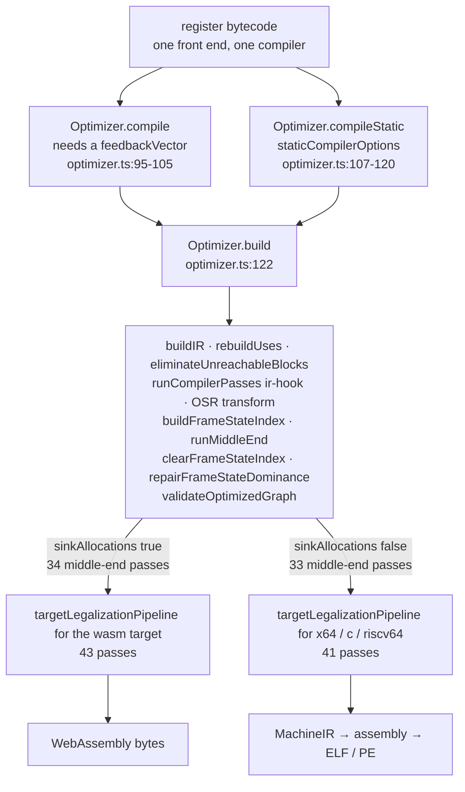

# 3. One program, fourteen forms   ⟨I · B · J · N⟩

This is the book's map. One line of `docs/example/stats.tera` —

```
      total += this.values[i]
```
— `docs/example/stats.tera:10`, the loop body of `Series.mean()`

— is shown here in every representation the engine builds for it, in the order the engine
builds them, each one captioned with the chapter that explains it. Fourteen forms, one
line, one page each.

The chapter exists because this book is in pipeline order. That order is the right one —
four machines share a front end, a bytecode and a middle end, and describing those three
things once instead of four times is the only reason the book fits in 83 chapters — but it
has a cost. A reader who opens at chapter 48 and meets `v3 = Phi v0, v13` has no way back
to the page where a phi was introduced, because there is no such page: the concept was
taught wherever it was first needed. This chapter is the index that closes that gap. It is
organized by *artifact*, not by topic. You come here with a shape you do not recognise, you
find the shape, and the caption tells you which chapter owns it.

Everything on the following pages was produced by a command, and every command is printed
next to its output. Where a form has no command — four of the fourteen do not — the page
says so, names the symbol that produces the form internally, and says what a flag would
cost. That is not a stylistic choice. A book that hand-draws a representation is a book
whose representations drift silently away from the engine, and this engine has 26 comment
lines in 120,822: there is no second source of truth to catch it.

**What arrived.** From `[Ch 2 § what-leaves]`: enough tera to read every listing in the rest
of the book. Colon-and-indent blocks and the three layout tokens behind them; `name: type =
value` and bare `name = value` with no binding keyword; `fn` with an arrow return type;
`class` with visibility and accessors, and the fact that a class is a shape rather than a
name; annotations carried as text; four loop forms; one-subscript member access versus the
`IndexExpression` a slice produces; the `snake_case` builtin method names. And the example
set: `docs/example/stats.tera`, twenty-four lines, plus seven named variations, pinned by a
test that enumerates the directory
`[t: tests/e2e/docs/book-examples.test.ts > "covers every example file, so a new one cannot be added untested"]`.
The reader can read the source. Nothing after this point stops to explain it.

## Why more than one form

> **New idea. Intermediate representation.** A compiler almost never translates source
> directly into its output. It builds a sequence of intermediate forms, each one a complete
> description of the same program in a different shape, and each shape chosen to make one
> specific question easy to answer. The forms are not stages of decay from a rich source to
> a poor machine language; they are different *indexings* of the same facts. "Which
> instruction writes this value?" is one lookup in SSA and a whole analysis in bytecode.
> "What comes next?" is one increment in bytecode and a graph walk in SSA. A compiler with
> one representation is a compiler that answers half its questions the slow way.

The argument for tera's fourteen forms is not a textbook argument; it is visible in what
the four machines each need from `Series.mean()`.

The **interpreter** needs to execute the method one operation at a time, with the ability to
stop between any two of them — for a garbage collection, for a tiering decision, for a
debugger breakpoint. That wants a flat, numbered, position-addressable list. It gets
bytecode.

The **baseline compiler** needs to turn the same method into JavaScript source in a single
forward pass, with no analysis at all, because the whole point of tier 1 is to arrive
quickly. It also gets bytecode, and reads it once.

The **optimizing JIT** needs to ask "what does this value depend on, and what depends on
it?" thousands of times while it rewrites the method against measured facts. That wants
explicit def-use edges and single assignment. It gets an SSA control-flow graph.

The **native compiler** needs to prove, without any measured facts at all, that every
operation left in the method can be emitted by a specific instruction set — and where it
cannot prove that, to rewrite the operation into ones it can. It gets the same SSA graph,
then a target-legalized version of it, then MachineIR, then assembly, then bytes.

No single form serves those four readers. The bytecode that makes the interpreter's inner
loop a switch makes the optimizer's dependency question a data-flow analysis. The SSA graph
that makes the optimizer's question a pointer chase cannot be single-stepped. So the engine
builds both, from one source of truth, and the forms below are what that costs.

One rule governs this chapter, and it is the rule that keeps the map honest: **every form
shown is one the engine actually builds, and every one carries the command that produced it
or an explicit note that it has none.**

## Forms 1 to 3: text to tree

**Form 1 — source text.** The line as it is in the file, with six spaces of leading
indentation that are not decoration:

```
      total += this.values[i]
```
— `docs/example/stats.tera:10`

Explained in `[Ch 2 § statstera-line-by-line]`.

**Form 2 — the token stream.** The lexer turns the file into tokens, and three of the kinds
it produces correspond to no characters at all. Blocks in tera are made of columns
(`[Ch 2 § blocks-are-indentation]`), so somebody has to convert columns into structure
before the parser sees anything, and in tera that somebody is the lexer.

There is **no CLI flag** for this form. The lexer's entry point is exported from the package,
though, so the output below is real: `tokenize`, from the package's `./frontend` export
(`dist/index.frontend.js`), run over `docs/example/stats.tera` and filtered to lines 10
through 12.

```
 10:  7  Indent
 10:  7  Identifier  total
 10: 13  Punctuator  +=
 10: 16  Keyword     this
 10: 20  Punctuator  .
 10: 21  Identifier  values
 10: 27  Punctuator  [
 10: 28  Identifier  i
 10: 29  Punctuator  ]
 10: 30  Newline
 11:  7  Identifier  i
 11:  9  Punctuator  +=
 11: 12  Number      1
 11: 13  Newline
 12:  5  Dedent
 12:  5  Keyword     return
```

Three of those tokens are manufactured. The `Indent` at 10:7 was emitted because line 9
ended in a colon and line 10 is further right; the `Dedent` at 12:5 because line 12 moved
back left; the `Newline` at the end of each logical line because the lexer decided the line
was over. No character in the file produced any of them. They are the block structure,
written down as tokens so the parser can read an ordinary delimited stream
`[t: tests/frontend/lexer.test.ts > "emits layout tokens for indentation blocks"]`.

The token kinds are `[Ch 4 § eleven-kinds-and-four-fields]`; the indent stack that
manufactures the three layout kinds, and the one program shape it gets wrong, are
`[Ch 5 § the-indent-stack]` and `[Ch 5 § the-program-that-indents-but-does-not-nest]`.

**Form 3 — the abstract syntax tree.** `--print-ast` prints the tree the parser built.
Our line, on its own, so that the shape is visible:

```
$ node dist/cli.js --print-ast -e 'total += this.values[i]'
Program
  body: [1]
    ExpressionStatement
      expression: CompoundAssignmentExpression  op="+"
        target: Identifier  name="total"
        value: MemberExpression  computed=true
          object: MemberExpression  property="values" computed=false
            object: ThisExpression
          property: Identifier  name="i"
Cannot read properties of undefined (reading 'values')
```

The dump is printed before anything runs, so the trailing error is expected and the exit
status is 1. Two things in that tree matter later. `+=` is its own node kind,
`CompoundAssignmentExpression`, not sugar the parser expanded into `total = total + …` —
keeping it whole is what lets the bytecode compiler emit one read of `total` instead of two
(`[Ch 18 § member-and-index-access]`). And `this.values[i]` is two nested
`MemberExpression`s, the outer one `computed=true`; a single subscript is a member access,
and only a slice or a multi-dimensional index becomes the separate `IndexExpression` node
(`[Ch 2 § indexing-slices-and-matmul]`).

The line is shown alone because `--print-ast` will not show it in place. `stats.tera:10`
lives inside a class method, and:

> **Broken.** `--print-ast` does not render class methods as trees.
> `ClassDeclaration.methods` is an array of plain records — `{name, func, kind, static,
> visibility, …}` — with no `type` field, so `isNode()` in
> `src/frontend/ast-text.ts:3-10` rejects each one and `render` falls through to
> `formatScalar` (`:16-21`), which is `JSON.stringify`. The result is that
> `node dist/cli.js --print-ast docs/example/stats.tera` prints a proper tree for `report`,
> for the constructor, and for the module body, and prints the whole of `mean` and the whole
> of `label` as two single lines of JSON — 1,820 and 910 characters, at dump lines 25 and 26.
> Fixing it costs either a `type` field on the method record or a special case for `methods`
> in `render` (`src/frontend/ast-text.ts:33-69`); the tree walk itself is correct and would
> not change. Until then, the chapter that owns the tree, `[Ch 7 § the-open-record]`, is also
> the chapter that explains why the dumper cannot see half of it.

## Forms 4 and 5: the second tree

The parser's tree is not the tree the checker walks. There is a second one.

**Form 4 — the semantic AST.** `src/frontend/checker/semantic-ast.ts` declares a union of
exactly thirteen node kinds — `TypeAlias`, `Interface`, `Function`, `Model`, `Class`,
`Block`, `Jump`, `For`, `Var`, `Destructure`, `Return`, `Expr`, `Import` (`:185-198`) — and
`lowerToSemanticProgram` (`src/frontend/checker/semantic-lowering.ts:83-85`) rewrites the
parser's several dozen node types into them.

There is **no CLI flag** for this form, and unlike the token stream it is not reachable from
the package's exports either: `lowerToSemanticProgram` is exported from `src/` and imported
only by the checker, the binder and two tests. The dump below was produced by building that
module directly and printing `kind` plus `name` and `testRole` for every node of
`stats.tera`:

```
Class  name="Series"
  Function  name="constructor"
    Expr
    Expr
  Function  name="mean"
    Var  name="total"
    Var  name="i"
    Block  testRole="loop"
      Expr
      Expr
    Return
  Function  name="label"
    Return
Function  name="report"
  Return
Var  name="latency"
Var  name="throughput"
Expr
Expr
```

That is the whole program in nineteen lines, and the compression is the point. `while` has
become a `Block` whose `testRole` is `"loop"`; an `if` would become a `Block` whose
`testRole` is `"guard"`; a `switch` becomes one `Block` with a nested `Block` per case
`[t: tests/frontend/checker/semantic-lowering.test.ts > "lowers a switch to a single block"]`.
Our line, `total += this.values[i]`, is one `Expr`. Everything the checker's analyses care
about — does this construct repeat, does this construct narrow, what expressions does it
own — is now a property of a single node kind instead of a case in a switch over the
parser's node types.

That is why the second tree exists. The analyses share walkers: `branchChain`
(`semantic-ast.ts:208`), `alwaysExits` (`:228`) and `ownExpressions` (`:249`) are written
once against thirteen kinds. `provenTakes` from `[Ch 1 § what-a-guard-proves]` — the analysis
that decides whether `q.shift()` may return `undefined` — walks this shape, which is why its
`RUNS_REPEATEDLY` table (`src/frontend/checker/length-bounds.ts:55-61`) is a two-entry map
keyed on `kind`, one entry for `For` and one for a `Block` whose `testRole` says loop, rather
than a syntactic case analysis. The
distinction between a guard and a loop is one field:
`[t: tests/frontend/checker/semantic-lowering.test.ts > "marks a while condition as a loop, which no guard narrowing follows"]`.
The thirteen kinds and the flag are `[Ch 8 § the-collapse]`.

**Form 5 — the parser's tree, after the checker writes back into it.** The two trees are not
independent. When the checker learns a type the parser could not know, it does not record it
in a side table; it *mutates the parser's node*:

```ts
    if (!isUnwrittenType(existing.type) || isUntypedName(contextual)) {
      adopted.push(existing);
      continue;
    }
    adopted.push({ ...existing, type: contextual });
    changed = true;
  }
  if (changed && adopted.length === (declared ?? adopted).length) node._paramInfo = adopted;
  if (!isUntypedName(returns) && typeof node._returnType !== "string") node._returnType = returns!;
}
```
— `src/frontend/ast/index.ts:315-324`

`adoptContextualSignature` fills `_paramInfo` and `_returnType` **only where the parser left
them unwritten** (`isUnwrittenType`), so the two producers never fight over a node. The
reader is `declaredParamInfo` (`:296-298`), and the bytecode compiler and the native
compiler both go through it. A type discovered by the front end therefore arrives at the
back end on an AST node, not through a channel of its own.

This form does have a command, but only on one of the CLI's two paths, and the difference is
worth seeing. `--print-ast` given a **file** prints `record.ast` for each module in
`graph.initOrder` (`src/cli/main.ts:174-176`) — after `loadModuleGraph` has checked it.
`--print-ast` given `-e` prints `engine.parseSource(...)` (`src/cli/main.ts:194-196`) — a
fresh parse that has never been checked. The same source through the two doors:

```
$ node dist/cli.js --print-ast -e 'fn apply(f: fn(float) -> float, x: float) -> float:
  return f(x)

print(apply((v) => v * 2.0, 3.0))' | grep -A7 Arrow
              ArrowFunctionExpression  isExpression=true
                params: [1]
                  "v"
                body: BinaryExpression  op="*"
                  left: Identifier  name="v"
                  right: Literal  value=2 kind="number"
                _paramInfo: [1]
                  any  name="v" optional=false line=4 column=14
```

and the same four lines saved to a file:

```
$ node dist/cli.js --print-ast ctx.tera | grep -A7 Arrow
              ArrowFunctionExpression  isExpression=true _returnType="float"
                params: [1]
                  "v"
                body: BinaryExpression  op="*"
                  left: Identifier  name="v"
                  right: Literal  value=2 kind="number"
                _paramInfo: [1]
                  float  name="v" optional=false line=4 column=14
```

`-e` prints `any` for `v` and no return type. The file prints `float` for both, because the
checker read the contextual signature off `apply`'s declared `fn(float) -> float` parameter
and wrote it onto the arrow. That is form 5, and the write-back is
`[Ch 7 § the-tree-is-mutated-after-parsing]`; the inference that produces the type is
`[Ch 11 § where-a-context-comes-from]`.

The example set cannot show it. `grep -n "=>" docs/example/*.tera` returns nothing: there is
no lambda in any of the eight files, and `adoptContextualSignature` is only ever called on a
function expression in argument position (`src/frontend/checker/type-checker.ts:847`, `:860`)
or on a comprehension's arrow (`:364`). For `stats.tera` specifically, **form 5 is
byte-identical to form 3** — every parameter and every return type in the file is declared,
so there is nothing left for the checker to write. That is a fact about the running example,
not about the mechanism, and it is why the demonstration above uses four lines outside the
example set (`docs/CONVENTIONS.md` rule 2).

## Form 6: bytecode   ⟨I · B · J · N⟩

`--print-bytecode` prints the disassembly of every function as it is compiled, filtered by
`--filter`:

```
$ node dist/cli.js --print-bytecode --filter mean docs/example/stats.tera
=== mean (params=0, locals=2, registers=5, constants=4) ===
Constants:
  [0] 0
  [1] "values"
  [2] "length"
  [3] 1
Locals: r0=total, r1=i
Instructions:
     0  LdaConst [0] (0)
     1  Star r0
...
    15  LdaThis
    16  Star r4
    17  LdaNamedProperty r4 [1] (values) r4
    18  Star r3
    19  Ldar r1
    20  Star r4
    21  LdaKeyedProperty r3 r4 r5
    22  Star r2
    23  Ldar r0
    24  Add r2 r6
    25  Star r0
```

Instructions 15 to 25 are `total += this.values[i]`. There is a constant pool, a named local
table (`r0=total, r1=i`) and one distinguished register that never appears in the operands:

> **New idea. Register machine, and the accumulator.** A *stack machine* keeps operands on
> an implicit stack — `push a; push b; add` — so instructions are tiny and every value moves
> twice. A *register machine* names its operands — `add r1, r2` — so instructions are wider
> and values stay put. tera's is a register machine with one extra piece: an **accumulator**,
> a distinguished register that is the implicit destination of every load and the implicit
> left operand of every binary operation. `Ldar r1` means "accumulator ← r1"; `Star r0`
> means "r0 ← accumulator"; `Add r2` means "accumulator ← accumulator + r2". The
> accumulator is why most instructions name one register instead of three. Why this design
> and not the other is `[Ch 17 § three-machine-shapes]`.

Read instructions 15 to 25 with that in mind. 15–18 load `this`, read `.values` off it, and
park the array in `r3`. 19–20 copy `i` into `r4`. 21 reads the element. 22 parks it in `r2`.
23 loads `total` into the accumulator, 24 adds `r2` to it, and 25 writes it back to `r0`.

Instruction 21 is the bridge to the next form, and reading it correctly requires knowing
something the dump does not tell you.

> **Broken.** `RegisterCompiledFunction.disassemble()`
> (`src/bytecode/register/ops/bytecode.ts:599-657`) prints every operand it does not
> special-case as `r<n>`. It special-cases only three groups: the constant index of
> `ROP_LDA_CONST`, of `ROP_LDA_GLOBAL` / `ROP_STA_GLOBAL` / `ROP_CALL_INTRINSIC`, and the
> name index of `ROP_LDA_PROP` / `ROP_STA_PROP` / `ROP_DEFINE_CLASS_MEMBER`. Everything else
> gets the register prefix whether it is a register or not. So in the dump above, the `r5` in
> `LdaKeyedProperty r3 r4 r5` is **feedback slot 5**, not register 5; the trailing `r4` in
> `LdaNamedProperty r4 [1] (values) r4` is **feedback slot 4** while the leading one really is
> register 4; the `r6` in `Add r2 r6` is **feedback slot 6**; the `r32` in
> `JumpIfFalse r32 r3` is **jump target 32** and the `r3` beside it is the branch's feedback
> slot; and `Jump r4` jumps to instruction 4. The
> function declares `registers=5`, so `r5` and `r6` name registers that do not exist. The
> operand roles are not guessed anywhere else in the engine — the baseline compiler reads
> them positionally and correctly, emitting `$.gi(r[3],r[4],5)` for instruction 21 — so
> fixing the dump costs an operand-role table beside `ROPCODE_NAMES` and one lookup in the
> loop. Nothing pins the current output: the two tests that call `disassemble()` assert only
> that opcode names and local names appear
> `[t: tests/bytecode/register/ops/bytecode.test.ts > "produces readable output with constants, locals, and instructions"]`.

The name is misleading too, and this book keeps it (`docs/CONVENTIONS.md` rule 4): the
opcode is `ROP_LDA_INDEX = 0x09` and `ROPCODE_NAMES` renders it as `LdaKeyedProperty`
(`src/bytecode/register/ops/bytecode.ts:26`, `:216`).

What matters for the next page is that instruction 21 carries a feedback slot at all. One
opcode, one site, one slot: the interpreter has somewhere to write down what it saw there.
The bytecode is `[Ch 17 § three-machine-shapes]` and `[Ch 18 § the-protocol-in-one-page]`.

## Form 7: what the interpreter learned   ⟨I · B · J⟩

A feedback vector is not a profile counter. It does not record how often a site ran. It
records *what shapes arrived there*, per site, and it moves each site along a four-state
lattice as the answer gets worse:

```ts
export const IC_UNINITIALIZED = "uninitialized";
export const IC_MONOMORPHIC = "monomorphic";
export const IC_POLYMORPHIC = "polymorphic";
export const IC_MEGAMORPHIC = "megamorphic";
```
— `src/feedback/vector/index.ts:18-21`

Six kinds of site are tracked — `property`, `binary_op`, `unary_op`, `call`, `allocation`,
`branch` (`:11-16`) — and the lattice is one-way. `LATTICE_ORDER` (`:26-31`) numbers the
four states 0 to 3 and `_advanceLattice` moves only upward
`[t: tests/feedback/vector.test.ts > "cannot go backwards from polymorphic to monomorphic"]`.
A site that has seen one shape is `monomorphic` and the JIT may compile a direct access
guarded on that shape; a site that has seen more than four is `megamorphic` and there is
nothing useful to say about it
`[t: tests/feedback/vector.test.ts > "transitions to megamorphic after >4 unique classes"]`.

`--trace-feedback` prints a line every time a site advances. On the spine:

```
$ node dist/cli.js --trace-feedback docs/example/stats.tera
[FB] Slot #0: property — uninitialized → monomorphic
...
[FB] Slot #0: binary_op — uninitialized → monomorphic
[FB] Slot #0: binary_op — monomorphic → polymorphic
[FB] Slot #0: property — uninitialized → monomorphic
...
latency mean=15.70
throughput mean=898.19
```

Twenty-seven `[FB]` lines in all, and exactly one of them is a monomorphic→polymorphic
transition, on a site of kind `binary_op`. Run the same flag on
`docs/example/stats-poly.tera` — which defines a second class with the same members and
passes both to one untyped `fn report(s)` — and there are forty-one lines with **three**
transitions: the `binary_op` again, plus a `property` and a `call`. The two extra ones are
printed after `latency mean=15.70` and before `baseline mean=10.00`, which places them in
the second `report(...)` call, the one where a `Constant` arrives at a site that had only
ever seen a `Series`.

Those two numbers — 27 lines and one transition against 41 and three — are the observable
content of this flag, and the position of a line relative to the program's own output is the
only way to tell *where* a transition happened. That is not a stylistic limit:

> **Broken.** `--trace-feedback` labels every line `Slot #0`.
> `src/feedback/vector/index.ts:189` is
> `tracer.feedbackRecord(0, this.kind, ...)` — a hardcoded literal `0` where the slot index
> belongs. `Tracer.feedbackRecord` (`src/core/tracing/index.ts:222-225`) formats it as
> `Slot #${slotId}`, so every line in every run of every program says `Slot #0`. No site, no
> bytecode offset, no function name and no hidden class is printed. "The same site went
> polymorphic" is therefore **not** observable from the flag: what you can see is the
> aggregate — how many sites advanced, of which kinds, and how many reached `polymorphic`.
> The slot index is available at the call site; `FeedbackSlot` simply does not carry its own
> index. Fixing it costs one field on the slot, set where slots are created, and one
> argument at the single call site.

> **Never runs.** `Tracer.feedbackTransition` (`src/core/tracing/index.ts:227-229`) — the
> method that would print `Slot #n: monomorphic → polymorphic` with a real slot number — has
> zero callers anywhere in `src/` or `tests/`. It is the fix for the item above, already
> written, and nothing invokes it.

The vector and its lattice are `[Ch 33 § the-lattice]`; the caches that consume it, one per
site, are `[Ch 34 § the-five-caches-behind-one-site]`. The two budgets a hot function is
measured against — `INVOCATION_COUNT_FOR_OPTIMIZATION = 3000` and `DEFAULT_LOOP_BUDGET =
1000`, `src/feedback/vector/index.ts:778-779` — are `[Ch 35 § the-budget-is-not-a-counter]`.

## Form 8: JavaScript   ⟨B⟩

Tier 1 does not emit machine code. It emits a JavaScript **source string** and hands it to
the host:

```ts
      const fn = new Function("args", "tv", "$", "pc", "env", body) as (
```
— `src/optimizing/baseline/compiler.ts:86`

There is **no CLI flag** for `body`. `BaselineCompiler.generateBody` returns the string,
`compile` passes it straight into `new Function`, and no code path anywhere prints it. The
excerpt below was produced by constructing an `Engine` with an `onCompile` hook — the same
hook `--print-bytecode` uses — and calling `generateBody` on `mean`'s compiled function.
This is the middle of a body just over fifty lines long:

```js
case 19:acc=r[1];
case 20:r[4]=acc;
case 21:acc=$.gi(r[3],r[4],5);
case 22:r[2]=acc;
case 23:acc=r[0];
case 24:t=r[2];if((acc&15)===0&&(t&15)===0){t2=acc+t;if(t2>=-17179869184&&t2<=17179869168)acc=t2;else acc=$.add(acc,t,6);}else{acc=$.add(acc,t,6);}
case 25:r[0]=acc;
```

Read it against form 6 and the strategy is obvious. Each bytecode instruction becomes one
`case` in a `switch` inside a `while(1)`, with no `break` between cases, so straight-line
code falls through exactly as the interpreter's program counter would advance
`[t: tests/optimizing/baseline/compiler.test.ts > "generates switch/case dispatch loop"]`.
A jump becomes `pc = n; continue L`
`[t: tests/optimizing/baseline/compiler.test.ts > "emits jump as pc assignment + continue"]`.
The accumulator becomes a local `var acc`, and the register file becomes a real array `r`.

The baseline is not a code generator in the usual sense. It is a **specializer**: it takes
the interpreter's dispatch loop and unrolls it for one function, turning a switch executed
once per instruction into a switch the host's own JIT can flatten. Everything it emits still
calls back into the runtime — `$.gi` is the keyed load, `$.add` is the generic add — except
where a tag check makes a fast path safe. Instruction 24 is exactly that: `(acc & 15) === 0`
tests both operands for the small-integer tag, adds them with plain `+`, range-checks the
result, and falls back to `$.add` otherwise
`[t: tests/optimizing/baseline/compiler.test.ts > "emits SMI fast path for ADD with tag check"]`.
Note the third argument to `$.add`: `6`, the feedback slot from form 6, still being fed even
in compiled code.

Tier 1 declines rather than emitting something it cannot get right, and it declines in three
ways. An empty body, or one longer than `MAX_BASELINE_INSTRUCTIONS`. Any function containing
`ROP_TRY_START`, `ROP_TRY_END` or `ROP_THROW`
`[t: tests/optimizing/baseline/compiler.test.ts > "rejects functions containing try/throw"]`.
And any function containing one of five further opcodes — `ROP_CALL_SPREAD`,
`ROP_REST_ARGS`, `ROP_SPREAD_ARRAY`, `ROP_DEFINE_ACCESSOR` and `ROP_ASSERT_CLASS_CONTRACTS`
(`src/optimizing/baseline/compiler.ts:70-80`). Four of those five are spread, rest and
accessor opcodes; the fifth, `ROP_ASSERT_CLASS_CONTRACTS`, is neither.

> **Unenforced.** Two of the five opcodes in that second decline list are covered by no test.
> `[t: tests/optimizing/baseline/compiler.test.ts > "rejects functions containing spread/rest/defineAccessor"]`
> loops over exactly three of them — `ROP_CALL_SPREAD`, `ROP_REST_ARGS`,
> `ROP_DEFINE_ACCESSOR` (`tests/optimizing/baseline/compiler.test.ts:89-97`). Nothing
> anywhere asserts that `ROP_SPREAD_ARRAY` or `ROP_ASSERT_CLASS_CONTRACTS` makes the baseline
> decline, so deleting either from the check would leave the suite green and hand tier 1 a
> function it cannot compile correctly. Closing it costs two entries in that loop.

The full account is `[Ch 36 § the-five-refusals]`; the dispatch loop's shape is
`[Ch 36 § goto-in-a-language-without-goto]`.

## Forms 9 and 10: SSA   ⟨J · N⟩

This is the form the rest of the book lives in.

> **New idea. Basic block and control-flow graph.** A **basic block** is a run of
> instructions with one entry at the top and one exit at the bottom: once you are in it, you
> execute all of it. A **control-flow graph** is those blocks plus the edges between them —
> every jump becomes an edge, and the shape of the program's control flow becomes a shape
> you can walk. In the dump below the blocks are `B0` through `B3`, and each one names its
> successors and predecessors: `B3 loop-header succs=B2,B1 preds=B0,B2` is the loop's test,
> entered either from the pre-header `B0` or from the body `B2`, and leaving either into the
> body or out to `B1`.

> **New idea. SSA and the phi node.** In **static single assignment** form, every value is
> written exactly once. `total` is assigned twice in the source — once before the loop and
> once inside it — so in SSA it becomes two different values, and something has to say which
> one is current at the top of the loop. That something is a **phi node**: a pseudo-operation
> at a merge point whose inputs are lined up with the block's predecessors. `v3 = Phi v0,
> v13` in the dump below reads "at the top of `B3`, `total` is `v0` if we arrived from `B0`,
> and `v13` if we arrived from `B2`". The alignment is the whole content of a phi — the
> `n`th input belongs to the `n`th predecessor, and that correspondence is an invariant the
> printer, the parser and every pass must preserve
> `[t: tests/optimizing/ir/text.test.ts > "keeps phi inputs aligned with the predecessor order"]`.
> Why a phi is not a copy, and what breaks when the alignment slips, is `[Ch 38 § canonical-phi-ssa]`.

**Form 9 — the graph as built.** `--print-ir` prints it, and the flags are not optional:

```
$ node dist/cli.js --print-ir --opt-threshold 1 --baseline-threshold 1 --filter mean docs/example/stats.tera
fn mean params=0 {
  B0 succs=B3 preds=:
    v0 = Constant [value=0]
    v1 = Constant [value=0]
    v14 = Constant [value=1]
    v2 = Jump [targetBlock=3]
  B1 succs= preds=B3:
    v24 = GenericGetProp v23 [propName="values"] !fs
    v25 = GenericGetProp v24 [propName="length"] !fs
    v26 = GenericDiv v3, v25
    v27 = Return v26
  B2 succs=B3 preds=B3:
    v11 = GenericGetProp v10 [propName="values"] !fs
    v12 = GenericGetIndex v11, v4 !fs
    v13 = GenericAdd v3, v12
    v15 = Float64Add v4, v14
    v22 = Jump [targetBlock=3]
  B3 loop-header succs=B2,B1 preds=B0,B2:
    v3 = Phi v0, v13 [index=0]
    v4 = Phi v1, v15 [index=1]
    v8 = GenericCompare v4, v7 [op="<"]
    v9 = Branch v8 [trueBlock=2, falseBlock=1]
}
```

(The `graph [...]` attribute line, three `Constant` nodes and two `GenericGetProp` nodes are
elided for width; the command prints all of them.)

Our line is `B2`: read `.values`, index it, add. Three `Generic*` opcodes, meaning "do
whatever the runtime would do", because nothing has told the graph what these values are
yet. `v15 = Float64Add v4, v14` — the `i += 1` on the next source line — is *already* typed,
because both its inputs trace back to numeric constants and the builder could see that
without help. The difference between `v13` and `v15` in this dump is exactly the work the
middle end has left to do. The `!fs` marks a node that carries a **frame state** — a
description of the
interpreter frame that would exist if this operation deoptimized
`[t: tests/optimizing/ir/text.test.ts > "marks a node that carries a frame state"]`, the
subject of `[Ch 40 § what-a-frame-state-holds]`.

The printed form is not a debug string. `printIR` and `parseIR`
(`src/optimizing/ir/text.ts:141`, `:314`) round-trip
`[t: tests/optimizing/ir/text.test.ts > "round-trips a printed function unchanged"]`, which
is what lets a pass's test fixture be a paste of a real dump
`[t: tests/optimizing/ir/text.test.ts > "survives a graph the IR factories built the usual way"]`.
The textual form is `[Ch 38 § the-textual-form]`; how the graph is built from bytecode in one
walk, and how a loop header gets its phis before its back edge exists, is
`[Ch 39 § the-problem-a-loop-header-has]`.

The thresholds are load-bearing:

> **Unfinished.** `--print-ir` is wired to `EngineOptions.onOptimize`
> (`src/cli/main.ts:92-95`), which fires only when a function actually reaches the optimizing
> tier. `stats.tera` at the default `jitThreshold: 50` never does. So
> `node dist/cli.js --print-ir docs/example/stats.tera` prints
> `latency mean=15.70` / `throughput mean=898.19`, exits 0, and emits **no IR and no
> diagnostic** — the flag was accepted, nothing ever reached the tier it hooks, and nothing
> said so. The same trap applies to `--print-bytecode` with a `--filter` that matches no
> function. Closing it costs one counter in `buildEngineOptions` and one line printed at exit
> when it is still zero.

**Form 10 — the same graph after the middle end.** `--print-after-all` dumps the graph after
every pass. It is a `compile` flag, not a run flag
`[t: tests/cli/args.test.ts > "rejects a flag that belongs to another command"]`, so this is
the ahead-of-time road, where the method is called `Series.mean` — it becomes the symbol
`Series_mean` further down, once it has to be a name a linker could hold. The last
middle-end dump:

```
*** IR after #32 dead-code-elimination-after-unreachable [unchanged, nodes 20 -> 20 (+0), invalidated nothing] ***
fn Series.mean params=1 {
  v0 = Parameter [index=0]
  B2 succs=B3 preds=B3:
    v10 = GenericGetProp v0 [propName="values"] !fs
    v11 = GenericGetIndex v10, v5 !fs
    v12 = Float64Add v4, v11 [noOverflow=true]
    v14 = Float64Add v5, v13
    v21 = Jump [targetBlock=3]
  B3 loop-header succs=B2,B1 preds=B0,B2:
    v4 = Phi v1, v12 [index=0]
    v5 = Phi v2, v14 [index=1]
    v8 = Int32Compare v5, v7 [op="<", noOverflow=true]
    v9 = Branch v8 [trueBlock=2, falseBlock=1]
}
```

(`B0`, `B1` and the `graph [...]` attribute line elided, on the same terms as form 9.)

Three things to look at in a diff of two IR dumps, and all three are here. **Node count
falls**: the graph entered the middle end with 26 nodes and leaves with 20. **Phis
disappear**: the builder gave `B3` five phis, and three of them — the ones covering
interpreter registers nothing reads across the back edge — are gone. **`Generic*` opcodes
become typed ones**: `GenericAdd` is now `Float64Add [noOverflow=true]`, `GenericCompare` is
`Int32Compare`, and `GenericDiv` in `B1` is `Float64Div`. Each of those is a promise that
this operation cannot be anything else, and on this road it is a promise that had to be
*proved*, because there is no feedback vector and no guard to fall out of.

`GenericGetProp` and `GenericGetIndex` are still generic. They are lowered later, by the
target pipeline, not by the shared middle end — which is the next section's subject. The
pass manager that runs all of this is `[Ch 41 § the-pass-manager]`, and Part VII is the
passes one at a time.

## The fork   ⟨J · N⟩

Both compiling roads enter one method.



`Optimizer.build` (`src/optimizing/optimizer.ts:122`) is the fork, and it is a private
method with two public doors. `compile()` (`:95-105`) is the speculative one; its first act
is to read `compiledFn.feedbackVector` and `throw new Error("Cannot optimize without
feedback")` if there is none. `compileStatic()` (`:107-120`) passes `null` for the feedback
and wraps the options in `staticCompilerOptions`, which is two fields:

```ts
export function staticCompilerOptions(
  base: CompilerOptions = compilerOptions("speed"),
): CompilerOptions {
  return { ...base, sinkAllocations: false, deoptimizes: false };
}
```
— `src/optimizing/optimizer.ts:36-40`

`deoptimizes: false` is the hinge from `[Ch 1 § the-hinge]`, now attached to a graph you can
see. It says: this compilation has nowhere to fall back to. Every place the JIT would insert
a guard and a frame state, this road must instead prove the fact or refuse the function.

Between the two doors and the two backends, `build()` runs ten steps in a fixed order
(`optimizer.ts:157-199`): `buildIR`, `rebuildUses`, `eliminateUnreachableBlocks`, the user
IR-extension hook `runCompilerPasses("ir", graph)` at `:169`, the optional OSR transform,
`buildFrameStateIndex`, `runMiddleEnd`, then `clearFrameStateIndex` (`:190`) and
`repairFrameStateDominance` (`:192`), then `validateOptimizedGraph`. Both roads run all ten.

The pass arithmetic is worth stating precisely, because it is easy to get wrong and this
book quotes it in three places.

- `middleEndPhases(options)` in `src/optimizing/pipeline.ts` holds **34** `step(...)`
  passes across three phases — `high-level-optimization`, `canonicalization`,
  `late-optimization` — from `parameter-type-guards` to
  `dead-code-elimination-after-unreachable`.
- One of them, `allocation-sinking` (`pipeline.ts:195-197`), is wrapped in
  `enabledPasses(options.sinkAllocations, …)`. `sinkAllocations` defaults to `true`
  (`src/optimizing/options.ts:124`) and `staticCompilerOptions` sets it to `false`. **The JIT
  road runs 34 middle-end passes; the AOT road runs 33.**
- `targetLegalizationPipeline(target, options)` in `src/optimizing/target/legalization.ts`
  returns **41** passes for a target without the `tagged-values` capability — x64, C,
  riscv64 — and **43** for one with it, because `representation-selection` and
  `representation-check` are spliced in at `:400` behind `tagged`. The only target that
  declares `tagged-values` is wasm (`src/optimizing/backends/wasm/target.ts:7`).
- `--print-after-all` on `tera compile --target c` prints **72** distinct pass names: one
  `ir-builder` (dumped as pass `#-1`, before any pass has run, from `pipeline.ts:324-339`),
  plus 33 middle-end names, plus 41 legalization names, minus the three names that appear on
  both lists — `type-narrowing`, `builtin-method-lowering` and `dead-code-elimination`.

Two notes for anyone reading the source. `legalization.ts` contains **zero** `step(` calls:
its passes are object literals with a `name:` field, so grepping for `step(` there finds
nothing and the file looks empty of passes. And `docs/README.md`'s overview diagram still
says "60 passes, 11 analyses"; that number matches neither road and should be reconciled
against the two measured above.

Which leaves the actual answer to "where do the roads part?". They part inside one function,
on one capability set. `targetLegalizationPipeline` has exactly three call sites — the C
backend (`backends/c/backend.ts:76`), the wasm backend (`backends/wasm/backend.ts:26`), and
the shared MachineIR backend that x64 and riscv64 both go through
(`machine/backend.ts:315`) — and each passes a different `TargetModel`. The pipeline it
returns differs by what that target declares it can do. There is no second compiler.

## Forms 11 and 12: two legalizations   ⟨J · N⟩

> **New idea. Legalization.** A target cannot emit every operation an IR can express. wasm
> has no instruction for "read a property off an object of unknown shape"; x64 has no
> instruction for "concatenate two strings". Legalization is the pass sequence that rewrites
> those operations into ones the target *can* emit — expanding them into calls, into
> multi-instruction sequences, or into other IR nodes — and then checks that nothing
> unemittable is left. The crucial part is the second half. An operation the legalizer cannot
> rewrite is not silently emitted as something approximate; it stops the compilation and
> names itself (`[Ch 51 § refusal-is-an-outcome]`).

**Form 11 — legalized for wasm.** For `stats.tera` this form exists for exactly one
function, and it is not the one this book follows:

```
$ node dist/cli.js --opt-threshold 1 --baseline-threshold 1 --trace-opt docs/example/stats.tera
[JIT] Compiling "report": CFG built: 1 blocks, 2 frame states
[JIT] Compiling "report": Wasm module compiled: 419 bytes, 1 blocks
[JIT] Compiling "report": Runtime stubs lowered: 2
[JIT] Compiling "report": Wasm installed in 10.72ms
[JIT] Compiling "label": Wasm: graph not compilable: property access on this receiver
[JIT] Compiling "label": Baseline compiled: 26 bytecodes
[JIT] Compiling "mean": LICM: hoisted Constant v14 from B2 to pre-header B0
[JIT] Compiling "mean": CFG built: 4 blocks, 6 frame states
[JIT] Compiling "mean": Wasm: graph not compilable: property access on this receiver
[JIT] Compiling "mean": Baseline compiled: 43 bytecodes
```

(Abridged. The full command prints 38 `[JIT]` lines: the module body's bailouts and inline
decisions first, then two further LICM hoists in `mean` and the type-narrowing remarks, then
each function's `Wasm compilation skipped — cooldown` line before it falls back to tier 1.)

> **Unfinished.** The wasm JIT cannot compile `Series.mean()`, the method this book follows.
> The refusal is `unsupported("property access on this receiver")` at
> `src/optimizing/backends/wasm/codegen.ts:476-477`, reached when
> `READS_A_RECEIVER.has(node.type)` and `holdsTheReceiver(node.inputs[0])`; the sibling
> refusal `"handing back this receiver"` is three lines below at `:479-480`. The refusal is
> structural — it is a property of the graph's shape, not of how hot the function got, so no
> threshold and no number of calls changes it.
> Only `report`, which takes its receiver as an ordinary parameter, reaches wasm, at 419
> bytes and one block. So form 11 on this page is `report`'s, and this chapter shows the
> running line's wasm nowhere, because there is none. Finishing it costs a representation for
> a receiver in the wasm object layout, which is the same work
> `[Ch 53 § the-boundary-is-the-wall]` measures as marshalling cost.

Note also what the flag does and does not give you: the module's **size** and **block count**
are printed, but the bytes are not. `wasmBytes` is a local in `codegen.ts` and there is no
sink for it. The five sections a tera-produced wasm module contains, and the instruction
encoding, are `[Ch 52 § five-sections]`; what else the backend refuses is
`[Ch 52 § what-is-refused]`.

**Form 12 — legalized for x64, as MachineIR.** Below the SSA graph there is one more
target-independent layer: instructions with opcodes, operands and widths, but with
*virtual* registers — as many as the function needs — before an allocator assigns real ones.

There is **no CLI flag** for it. `printMachineFunction`
(`src/optimizing/machine/print.ts`) and `formatMachineTrace`
(`src/optimizing/machine/trace.ts:15-20`) both exist and are tested; they are driven by
`CompilerOptions.machineTracer`, which defaults to `null` (`src/optimizing/options.ts:126`)
and which no flag in `src/cli/spec.ts` sets. The dump below was produced by passing a
`machineTracer` through `Engine.compileAot`'s `compilerOptions` field. It is the loop body
block of `Series_mean` immediately after instruction selection:

```
*** machine after #0 instruction-selection [Series_mean, pre-allocation] ***
.LSeries_mean_4: -> .LSeries_mean_3
  movq v29:8, 16(v17)
  movq v30:8, 0(%rsp)
  movq 32(v30), v29:8
  movslq v31:8, v23:4
  addsd v32:8, v0:8, 8(v29, v31, 8)
  movl v33:4, $1
  cvtsi2sdl v34:8, v33:4
  addsd v35:8, v1:8, v34:8
```

`v29` is the elements pointer, `v31` is the index widened to 64 bits, and
`addsd v32:8, v0:8, 8(v29, v31, 8)` is `total += this.values[i]` — a scaled-index memory
operand feeding a double add, three operands wide because MachineIR is still
three-address at this point. `%rsp` is already physical, because the stack pointer is never
allocatable. `v0` and `v1` are the two loop-carried values that were phis in form 9 — the
block ends by copying into them (`movsd v1:8, v35:8`, `movsd v0:8, v32:8`), because a phi
becomes a copy on each incoming edge once there is no SSA left to express it
(`[Ch 64 § phis-become-copies]`).

The pipeline runs six traced stages — instruction-selection, scheduling,
two-address-lowering, register-allocation, frame-code, peephole
(`src/optimizing/machine/pipeline.ts:30-70`) — and the trace format is pinned
`[t: tests/optimizing/machine/trace.test.ts > "reports every stage boundary in the order the pipeline runs them"]`,
`[t: tests/optimizing/machine/trace.test.ts > "renders a header naming the stage and a body of real instructions"]`.
Instruction selection is `[Ch 64 § machineir-and-instruction-selection]`; the allocator that
turns `v29` into a real register is `[Ch 66 § the-scan]`.

## Forms 13 and 14: bytes   ⟨N⟩

**Form 13 — x64 assembly text.** `compile --emit source --target x64` writes it. One
correction to how that command reads: **`-o` names a directory, not a file.** The compiler
creates it and writes two files inside.

```
$ node dist/cli.js compile docs/example/stats.tera --target x64 --platform linux --emit source -o /tmp/stats-asm
tera compile: wrote /tmp/stats-asm
$ ls /tmp/stats-asm
stats.h
stats.s
```

(`wrote` echoes the path the tool resolved, so on a Windows host that line prints the
absolute form of `/tmp`.)

`--platform linux` is not optional if you want to read the output as this book prints it.
With no `--platform`, the emitted `.s` carries the host's object-format directives; on a
Windows host that means `.def Series_mean; .scl 2; .type 32; .endef` beside every symbol,
and the Win64 calling convention's callee-saved set in every prologue. The loop body,
built for Linux:

```
.LSeries_mean_4:
	.loc 1 11 7
	movl $1, %eax
	cvtsi2sdl %eax, %xmm0
	movq 16(%r12), %rax
	movq 0(%rsp), %rcx
	movq %rax, 32(%rcx)
	.loc 1 10 7
	movslq %r15d, %rcx
	movsd 16(%rsp), %xmm14
	movsd %xmm14, %xmm1
	addsd 8(%rax,%rcx,8), %xmm1
	movsd 8(%rsp), %xmm14
	movsd %xmm14, %xmm2
	.loc 1 11 7
	addsd %xmm0, %xmm2
	.loc 1 9 5
```
— `stats.s` from the command above, function `Series_mean`, block `.LSeries_mean_4`

That is form 12 with the virtual registers resolved: `v31` became `%rcx`, `v29` became
`%rax`, and `addsd v32:8, v0:8, 8(v29, v31, 8)` became
`addsd 8(%rax,%rcx,8), %xmm1` — a two-operand instruction, because the two-address lowering
stage ran in between
`[t: tests/optimizing/backends/x64/assembly.test.ts > "uses a scaled index addressing mode for element access"]`.
`X64AssemblyWriter.registerText` (`src/optimizing/backends/x64/assembly.ts:25-31`) throws
`"virtual register survived to assembly emission"` if any `v` is left: the last verifier
before bytes.

The `.loc 1 10 7` directives are the reason a debugger can put you back on
`stats.tera:10`. Each one is file 1, line 10, column 7 — the exact position of `total` in
the source — and they interleave with `.loc 1 11 7` because the scheduler moved the `i += 1`
increment's instructions in among the addition's. `[Ch 71 § debug-line-as-a-program]` is what
those become in DWARF; `annotateCfi` and the `.cfi_*` brackets around the same function are
`[Ch 71 § cfi-directives]` and are pinned by
`[t: tests/optimizing/backends/x64/assembly.test.ts > "describes its prologue with call frame directives"]`.

**Form 14 — the bytes in an executable.** The same compile without `--emit source` writes a
finished binary, and on the x64 backend the engine writes it itself rather than calling a
linker:

```
$ node dist/cli.js compile docs/example/stats.tera --target x64 --platform linux -o /tmp/stats-linux
tera compile: wrote /tmp/stats-linux
$ file /tmp/stats-linux
/tmp/stats-linux: ELF 64-bit LSB executable, x86-64, version 1 (SYSV), statically linked, no section header
```

397,492 bytes, and `file`'s last clause is the interesting one. There is **no section
header table**. A section header table is what `objdump`, `nm` and `readelf -S` read; an
ELF loader does not need it, because loading is driven by the *program* header table, which
this file does have (seven entries, per the `e_phnum` field at offset 0x38). So the binary
runs and is opaque to the ordinary object-inspection tools. That is a deliberate trade —
`[Ch 70 § an-executable-with-no-section-table]` is where it is argued — and it is why this
page inspects the file by searching for known bytes instead:

```
0005cf7d  49 63 cf f2 44 0f 10 74 24 10 f2 41 0f 10 ce f2 0f 58 4c c8 08
```

Twenty-one bytes at file offset 0x5cf7d. Split them by instruction and form 13 is still
there: `49 63 cf` is `movslq %r15d, %rcx`; `f2 44 0f 10 74 24 10` is
`movsd 16(%rsp), %xmm14`; `f2 41 0f 10 ce` is `movsd %xmm14, %xmm1`; and
`f2 0f 58 4c c8 08` is `addsd 8(%rax,%rcx,8), %xmm1` — `c8` is the SIB byte encoding
`(%rax, %rcx, 8)`, base plus index scaled by eight, and `08` is the displacement into the
elements buffer. That last instruction is `total += this.values[i]`, fourteen forms later,
in six bytes.

> **New idea. Symbol and relocation.** When a compiler emits `call Series_mean` it does not
> know what address `Series_mean` will have — that is decided when everything is laid out
> together. So it emits a placeholder and records a **relocation**: "at this offset, once you
> know where the **symbol** `Series_mean` lives, write its address here". Normally a linker
> resolves them. On this road there is no linker: `writeDirect` in `src/cli/compile.ts` lays
> the sections out, computes the addresses, and applies its own relocations. `[Ch 70 §
> object-files]` and `[Ch 69 § fixups]` are where that happens.

## Where you are

The map, with the command for each form and the chapter that owns it.

| # | Form | Produced by | Explained in |
| --- | --- | --- | --- |
| 1 | source text | the file | Ch 2 |
| 2 | token stream, with manufactured `Indent` / `Dedent` / `Newline` | *no CLI flag* — `tokenize`, from the `./frontend` export | Ch 4, 5 |
| 3 | AST, as the parser built it | `--print-ast` | Ch 6, 7 |
| 4 | semantic AST, thirteen kinds | *no CLI flag and no package export* — `lowerToSemanticProgram` | Ch 8 |
| 5 | the same AST after the checker writes back | `--print-ast` **on a file** (not `-e`) | Ch 9, 11 |
| 6 | register bytecode | `--print-bytecode` | Ch 17, 18 |
| 7 | feedback vector | `--trace-feedback` (aggregate only; every line says `Slot #0`) | Ch 33, 34 |
| 8 | generated baseline JavaScript | *no CLI flag* — `BaselineCompiler.generateBody` | Ch 36 |
| 9 | SSA control-flow graph, as built | `--print-ir` (thresholds required) | Ch 38, 39 |
| 10 | the same graph after the middle end | `compile --print-after-all` | Ch 41–50 |
| 11 | legalized for wasm | `--trace-opt` (size and block count; not the bytes) | Ch 51, 52 |
| 12 | legalized for x64, as MachineIR | *no CLI flag* — `CompilerOptions.machineTracer` | Ch 64, 66 |
| 13 | x64 assembly text | `compile --emit source --target x64` (writes a directory) | Ch 69 |
| 14 | bytes inside an ELF or PE executable | `compile --target x64 --platform linux` | Ch 70, 71 |

This table is the book's index **by artifact**. The table of contents indexes by topic, and
that is the wrong index for the commonest question a reader of a compiler book actually has,
which is "what is this thing on my screen?" A reader lost in Part VII should come back here,
find the shape, and take the chapter number.

> **Unfinished.** Four of the fourteen forms have no CLI flag at all: the token stream (form
> 2), the semantic AST (form 4), the generated baseline JavaScript (form 8) and MachineIR
> (form 12). Two more are only partly reachable: form 7 prints `Slot #0` for every site, and
> form 11 prints a size but not the bytes. The producing symbol exists in every case —
> `tokenize`, `lowerToSemanticProgram`, `BaselineCompiler.generateBody`,
> `printMachineFunction` — so each costs one entry in the flag table in `src/cli/spec.ts`
> and one sink. `[Ch 73 § the-shell]` describes this CLI as a d8-style shell that will show
> you every stage; on this axis it is four flags short of the claim.

## What leaves

A map, and the vocabulary attached to it. Every later part of this book is one arrow on the
diagram in `§ the-fork`, and every name a later chapter uses for a shape has now been
attached to a picture the reader has seen: **token**, and the three layout kinds that come
from no characters; **AST**, and the fact that the checker writes back into it; **semantic
AST**, thirteen kinds; **bytecode**, a register machine with an accumulator, and the
feedback slot riding on an operand; **feedback vector**, a four-state lattice per site;
**SSA**, **basic block**, **control-flow graph** and **phi**; **legalization**;
**MachineIR** and its virtual registers; **symbol** and **relocation**.

And the fork itself, drawn once. Both compiling roads go through `Optimizer.build`; the JIT
arrives via `compile()` carrying a feedback vector, the native compiler via `compileStatic()`
carrying `deoptimizes: false`; they share `buildIR` and the middle end (34 passes on the JIT
road, 33 on the AOT road); they part at `targetLegalizationPipeline`, which is one function
whose content is decided by the target's capability set — 43 passes for wasm, 41 for x64, C
and riscv64.

`[Ch 4 § characters-to-tokens]` starts at the first character of `stats.tera` and builds form
2. It assumes nothing this part did not establish: a program, a reason to care whether four
machines agree about it, a reader who can read tera, and — from this chapter — a place to
look up any shape the rest of the book puts on the screen.

## Verify it yourself

```bash
# form 3 — the tree the parser built. Class methods are records with no node tag, so
# from line 25 the dump is one JSON line per method rather than a tree.
node dist/cli.js --print-ast docs/example/stats.tera | head -24

# form 3, the running line on its own (exits 1: the dump prints before the program runs)
node dist/cli.js --print-ast -e 'total += this.values[i]'

# form 6 — the bytecode of the method this book follows
node dist/cli.js --print-bytecode --filter mean docs/example/stats.tera

# form 7 — 27 [FB] lines with one mono->poly transition, against 41 with three
node dist/cli.js --trace-feedback docs/example/stats.tera | grep -c FB
node dist/cli.js --trace-feedback docs/example/stats-poly.tera | grep -c FB
node dist/cli.js --trace-feedback docs/example/stats-poly.tera | grep "monomorphic → polymorphic"

# form 9 — the SSA graph, phis and all. The thresholds are required: at the defaults
# nothing tiers up and this flag prints no IR and no diagnostic.
node dist/cli.js --print-ir --opt-threshold 1 --baseline-threshold 1 --filter mean docs/example/stats.tera
node dist/cli.js --print-ir docs/example/stats.tera            # prints the output and nothing else

# form 11 — which functions reach wasm, and which are refused
node dist/cli.js --opt-threshold 1 --baseline-threshold 1 --trace-opt docs/example/stats.tera

# form 10 — every pass on the AOT road; 72 distinct names
node dist/cli.js compile docs/example/stats.tera --emit source --target c -o /tmp/stats-c --print-after-all \
  | grep -o '^\*\*\* IR after #[-0-9]* [a-z0-9-]*' | awk '{print $NF}' | sort -u | wc -l

# forms 13 and 14 — assembly text (into a DIRECTORY), then a real ELF
node dist/cli.js compile docs/example/stats.tera --target x64 --platform linux --emit source -o /tmp/stats-asm
ls /tmp/stats-asm
node dist/cli.js compile docs/example/stats.tera --target x64 --platform linux -o /tmp/stats-linux
file /tmp/stats-linux
```

Forms 2, 4, 8 and 12 have no command; the honesty item in `§ where-you-are` names the symbol
that produces each and what a flag would cost.

## Tests that pin this

- `tests/frontend/lexer.test.ts` > `"emits layout tokens for indentation blocks"` — form 2:
  the three manufactured token kinds.
- `tests/frontend/checker/semantic-lowering.test.ts` > `"lowers a switch to a single block"`
  and > `"marks a while condition as a loop, which no guard narrowing follows"` — form 4:
  many syntactic shapes collapse into `Block`, and `testRole` is what tells a loop from a
  guard.
- `tests/optimizing/ir/text.test.ts` > `"names every value and lists inputs in order"`,
  > `"marks a node that carries a frame state"`,
  > `"marks a loop header and lists both edge directions"` — exactly the three things the
  form-9 excerpt asks the reader to read.
- `tests/optimizing/ir/text.test.ts` > `"round-trips a printed function unchanged"` and
  > `"keeps phi inputs aligned with the predecessor order"` — the printed IR is a real form,
  not a debug string: it parses back, and a phi's input order is part of it.
- `tests/optimizing/ir/text.test.ts` > `"survives a graph the IR factories built the usual way"`
  — the text form is usable as a pass fixture.
- `tests/feedback/vector.test.ts` > `"transitions monomorphic -> polymorphic on second class"`,
  > `"transitions to megamorphic after >4 unique classes"`,
  > `"cannot go backwards from polymorphic to monomorphic"` — form 7's lattice, which the
  flag's output cannot show you per site.
- `tests/optimizing/baseline/compiler.test.ts` > `"generates switch/case dispatch loop"`,
  > `"emits jump as pc assignment + continue"`,
  > `"emits conditional branch for JUMP_IF_FALSE"`,
  > `"emits SMI fast path for ADD with tag check"`,
  > `"emits return acc for ROP_RETURN"` — the shape of form 8, which has no command.
- `tests/optimizing/baseline/compiler.test.ts` > `"rejects functions containing try/throw"`
  and > `"rejects functions containing spread/rest/defineAccessor"` — what tier 1 declines.
  The second test loops over three of the five opcodes in that check; `ROP_SPREAD_ARRAY` and
  `ROP_ASSERT_CLASS_CONTRACTS` are in the code and in no test.
- `tests/optimizing/baseline/compiler.test.ts` > `"compiles simple return-constant function and returns callable with _isBaseline flag"`
  and > `"creates fast-call variants (_call0, _call1, _call2, _call3)"` — what `new Function`
  hands back.
- `tests/optimizing/machine/trace.test.ts` > `"reports every stage boundary in the order the pipeline runs them"`,
  > `"labels each record with the symbol it belongs to and its allocation phase"`,
  > `"renders a header naming the stage and a body of real instructions"` — form 12's only
  observable surface.
- `tests/optimizing/backends/x64/assembly.test.ts` > `"uses a scaled index addressing mode for element access"`
  — the `this.values[i]` of form 13.
- `tests/optimizing/backends/x64/assembly.test.ts` > `"describes its prologue with call frame directives"`
  and > `"follows the object format of the target it was built for"` — forms 13 and 14.
- `tests/cli/args.test.ts` > `"rejects a flag that belongs to another command"` — why
  `--print-after-all` appears in this chapter only under `compile`, and `--print-bytecode`
  only under `run`.
- `tests/e2e/docs/book-examples.test.ts` > `"stats.tera is the twenty-four lines the book claims"`
  — the source of all fourteen forms cannot drift.
- `[unpinned]` — nothing asserts the disassembler's operand rendering. The two tests that
  call `disassemble()` check that opcode names, constants and local names appear
  `[t: tests/bytecode/register/ops/bytecode.test.ts > "produces readable output with constants, locals, and instructions"]`,
  so `r5` standing for feedback slot 5 and `r32` standing for jump target 32 are unenforced
  either way.
- `[unpinned]` — nothing asserts that `--print-ast` renders a class method, that
  `--trace-feedback` names a slot, or that a dump flag reports having matched nothing.
