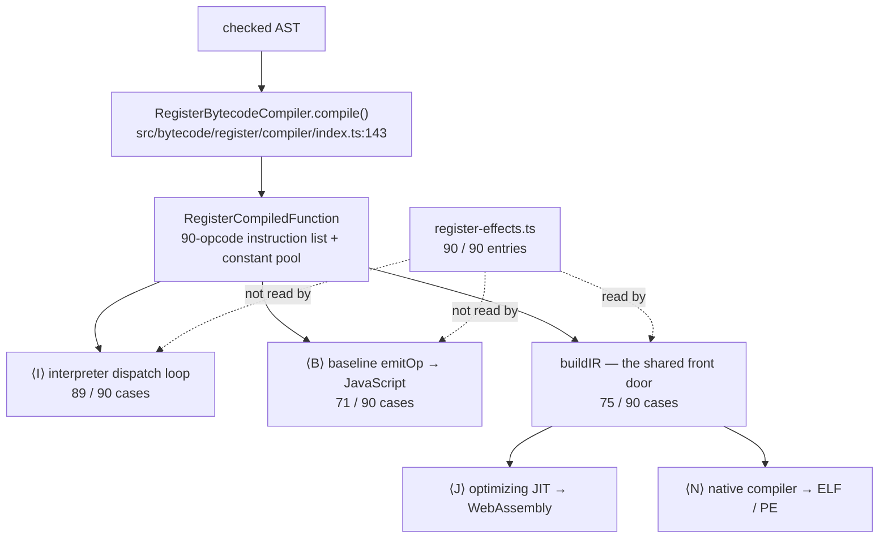

# 17. Why a register machine, and which one   ⟨I · B · J · N⟩

Stack machine or register machine is the famous question, and this engine answers it with
a third thing: an accumulator machine, where one distinguished value is implicit in almost
every instruction and never appears as an operand. That answer matters, but it is not the
thing this chapter is really about.

What this chapter settles is that the instruction set is a **contract**. Ninety `ROP_*`
constants are not the interpreter's private encoding that three other tiers happen to
reuse. They are the last artifact all four machines share. Every one of them must have a
`case` in the interpreter's dispatch loop, or the program dies at run time; a `case` in the
baseline compiler's emitter, or the whole enclosing function silently declines to tier up
([Ch 27]); and a `case` in the SSA builder, or neither the WebAssembly JIT nor the native
compiler can look at that function at all. Adding a ninety-first opcode is a four-way
commitment, and the numbers at the end of this chapter show that the tree has not kept all
four in step.

There is a second, sharper fact underneath. An instruction here is an opcode plus an
untyped `number[]`. Nothing in the type system distinguishes a register index from a
constant-pool index from a feedback slot from a jump target — they are all just numbers,
and the disassembler prints most of them with an `r` in front. One table,
`register-effects.ts`, is the only machine-readable statement of which position means what.
Four files read it. The interpreter and the baseline compiler do not.

**What arrived.** From [Ch 16 § what-leaves]: an AST, unchanged by the checker. For three
tiers the checker only printed advice to stderr; for the fourth it either passed the same
tree through or raised a `TypecheckError` and produced no binary. Either way the bytecode
compiler receives a plain tree and does not know which mode produced it — the checker is
not in its input path. Between the checker and here, `Engine.compileInRuntime` walks the
tree twice more: `runCompilerPasses("ast", …)`, then `analyzeEffects(parsed)`, then
`runCompilerPasses("semantic", …)` (`src/api/engine.ts:1209-1210`). What survives of Part II
is deliberately small, and it survives as **text**: `_paramInfo` and `_returnType` strings,
and one boolean, `node.implicitAwait`, which [Ch 14 § one-flag-one-byte] earned and
which this part spends. Nothing about registers exists yet.

## What a bytecode is, and why one exists here

The source text of `docs/example/stats.tera` is never executed. Nothing walks the AST and
evaluates it either. Between the tree and the running program there is one more form — a
flat, numbered list of instructions produced once per function and then executed, compiled,
or optimized as many times as the program needs.

> **New idea. Bytecode and a virtual machine.**
> A *bytecode* is an instruction set invented for a machine that does not exist in
> hardware. A *virtual machine* is the program that executes it: a loop that fetches the
> next instruction, switches on its opcode, does the work, and advances. The advantage over
> walking the tree directly is that the shape of the work is fixed before execution begins.
> A tree walk re-decides at every node what kind of node it is looking at; a bytecode
> interpreter decided that once, when it compiled.

Compile `Series.mean` and the first thing printed is a header:

```
=== mean (params=0, locals=2, registers=5, constants=4) ===
Constants:
  [0] 0
  [1] "values"
  [2] "length"
  [3] 1
Locals: r0=total, r1=i
```
— output of `node dist/cli.js --print-bytecode --filter mean docs/example/stats.tera`

Those four numbers are exactly what a call frame needs before a single instruction runs.
`params=0` says how many arguments arrive (`mean` takes none; `this` is not a parameter).
`locals=2` says how many of the registers have source-level names — `total` and `i`.
`registers=5` is the size of the register array to allocate: five slots, `r0` through `r4`,
sized once and never grown. `constants=4` is the length of the constant pool, a per-function
array of every literal value the code refers to; an instruction that needs the number `1`
carries the *index* 3 and reads `constants[3]`.

The `--print-bytecode` flag is a four-line hook, not a subsystem. `buildEngineOptions`
installs an `onCompile` callback that disassembles every function the compiler produces:

```ts
  if (config.printBytecode) {
    options.onCompile = (fn: RegisterCompiledFunction) => {
      if (matchesFilter(config.filter, fn.name)) console.log(fn.disassemble());
    };
  }
```
— src/cli/main.ts:88-92

`matchesFilter` (`src/cli/main.ts:44-47`) is a plain substring test — `name.includes(filter)`
— which is why `--filter mean` also prints nothing else in `stats.tera` but `--filter scale`
on `stats-closure.tera` prints both `scaler` and `scale`.

## Three machine shapes

Before naming the choice, the design space. Take `a + b`, where both operands are already
somewhere in the frame.

A **stack machine** has no operands at all. Values live on a push-down stack, and every
instruction consumes from the top and pushes back:

```
LoadLocal a
LoadLocal b
Add
```

Three instructions, each of them tiny — `Add` needs no operands whatsoever, because its
inputs are wherever the stack top happens to be. This is what the JVM and CPython do. The
cost is that the stack top is a moving target: to reason about what `Add` adds you must
simulate the whole stack from the start of the basic block.

A **register machine** names everything. Locals live in a flat, indexed array, and each
instruction says where its inputs and its output are:

```
Add r3, r1, r2
```

One instruction instead of three. Every value has a stable name, so an optimizer can look at
`Add r3, r1, r2` in isolation and know what it computes. The cost is encoding size: the
instruction carries three operands, and *every* arithmetic instruction has to.

An **accumulator machine** is the middle. There is a register file, but there is also one
distinguished value — the accumulator — that operators read and write implicitly.

> **New idea. The accumulator.**
> One value the machine holds outside the register file, which almost every instruction
> either reads or writes without naming it. `LdaX` ("load accumulator from X") writes it;
> `Star r` ("store accumulator to register") copies it out; `Ldar r` ("load accumulator from
> register") copies one back in. A binary operator takes its *left* operand from the
> accumulator, its *right* operand from the one register it names, and writes the result
> back to the accumulator. The accumulator is never an operand, because it is never a
> choice.

The same addition in this engine:

```
Ldar r1
Add r2, fb
```

Two instructions, and `Add` carries one register plus a feedback slot instead of three
registers. That is the shape of every arithmetic and comparison instruction in the
instruction set. In the real listing for `mean`, `i < this.values.length` compiles to
instructions 4 through 13:

```
     4  Ldar r1
     5  Star r2
     6  LdaThis
     7  Star r4
     8  LdaNamedProperty r4 [1] (values) r0
     9  Star r3
    10  LdaNamedProperty r3 [2] (length) r1
    11  Star r3
    12  Ldar r2
    13  TestLessThan r3 r2
```
— output of `--print-bytecode --filter mean docs/example/stats.tera`

Read it as: park `i` in `r2`; walk `this.values.length` into the accumulator, parking it in
`r3`; bring `i` back into the accumulator; compare against `r3`. Five of those ten
instructions — 5, 7, 9, 11 and 12 — are `Star` or `Ldar`, and exist only because there is
one accumulator and three values in flight. That is the rent. [Ch 18 § what-a-plus-b-costs] counts
them exactly; [Ch 39] is where they disappear.

## Why the obvious design fails

A reader who has decided registers beat stacks will reach for the pure three-address form —
`Add dst, lhs, rhs` — and it is a defensible design. It is what the middle end's own IR
looks like, and it is what MachineIR looks like ([Ch 51]). The question is what it would
cost *this* tree, which has three consumers downstream of the opcode set and only one of
them is an optimizer.

Two costs are concrete.

First, every value-producing opcode grows a destination operand. There are roughly thirty
arithmetic, comparison and bitwise opcodes; each would carry one more number, and every
producer in `expressions.ts` would have to choose a destination register for it. Today the
producer does not choose: the result goes to the accumulator, and the *consumer* decides
whether to `Star` it somewhere.

Second, and this is the one that actually decides it, the baseline compiler emits JavaScript
source text. Each opcode is a `case` returning a string that gets concatenated into a
generated function body ([Ch 26]). With an accumulator, that string is one line:

```ts
      case bytecode.ROP_BITAND:
        return `t=r[${o[0]}];acc=$.bitand(acc,t,${o[1]});`;
```
— src/optimizing/baseline/compiler.ts:387-388

`acc` is a JavaScript local in the generated function, so the accumulator costs nothing to
model — it is a variable. A three-address form would make it `r[${o[2]}]=$.bitand(r[${o[1]}],r[${o[0]}],…)`,
which is not much worse to write but is meaningfully worse to run: every intermediate goes
through an array index instead of a local, and there are 71 of these cases to keep
consistent.

So the trade, honestly stated. What the accumulator buys is a smaller encoding and an
emitter where the common case is one line and one JavaScript local. What it costs is shuffle
traffic: `Star` and `Ldar` instructions that exist only to move a value out of the
accumulator's way and back. Those are real instructions that the interpreter really
executes and the baseline compiler really emits. They are not real work for the two
optimizing tiers, because the SSA builder interprets them at build time into value edges
rather than emitting anything for them — which is why [Ch 18]'s central measurement is
"four shuffle instructions per binary operator" and [Ch 39]'s is "and then they are gone".

## `RegisterInstruction`: an opcode and an untyped `number[]` {#an-opcode-and-an-untyped-number-array}

This is the most consequential representational fact in the part, and it is nine lines
long:

```ts
export class RegisterInstruction {
  opcode: RegisterOpcode;
  operands: RegisterOperand[];

  constructor(opcode: RegisterOpcode, ...operands: RegisterOperand[]) {
    this.opcode = opcode;
    this.operands = operands;
  }
```
— src/bytecode/register/ops/bytecode.ts:303-310

with `export type RegisterOperand = number;` at line 124. Nothing in the type system
distinguishes a register index from a constant-pool index from a feedback slot from a jump
target. They are all `number`. An instruction is a JavaScript object holding a
variable-length array of them.

The disassembler makes this visible in the least flattering way possible. It special-cases
four opcode/position pairs — the constant index of `LdaConst`, the name index of
`LdaGlobal`/`StaGlobal`/`CallIntrinsic`, and operand 1 of `LdaNamedProperty`/
`StaNamedProperty`/`DefineClassMember` — and then gives up:

```ts
        } else {
          parts.push(`r${op}`);
        }
```
— src/bytecode/register/ops/bytecode.ts:648-650

Every operand that is not one of those four gets an `r`. So one screenful of `mean` contains
all of the following, and only one of them is a register:

| printed | opcode | operand | what the number actually is |
| --- | --- | --- | --- |
| `LdaNamedProperty r4 [1] (values) r0` | `ROP_LDA_PROP` | trailing `r0` | feedback slot 0 |
| `JumpIfFalse r32 r3` | `ROP_JUMP_IF_FALSE` | `r32` | instruction index 32 |
| `JumpIfFalse r32 r3` | `ROP_JUMP_IF_FALSE` | `r3` | feedback slot 3 |
| `Jump r4` | `ROP_JUMP` | `r4` | instruction index 4 |
| `Add r2 r6` | `ROP_ADD` | `r2` | register 2 — the right operand |
| `Add r2 r6` | `ROP_ADD` | `r6` | feedback slot 6 |

`mean` has five registers. There is no `r32`. The `r4` on instruction 31 is the loop header,
not a register — and `mean` does happen to have an `r4`, which makes it worse, not better.
`CreateArray r4 r5` in the module's top-level code is an argument *window*: base `r4`,
count 5 — the second number is not a register at all.

That is the whole argument, and it is why the next section exists.

## A tour of the 90 opcodes by family

Appendix A is the table. What follows is the shape of the set, family by family, with what
each family's existence implies. All ninety constants are declared in one run at
`src/bytecode/register/ops/bytecode.ts:16-121`, numbered `0x01` through `0x92` with gaps at
family boundaries, and all ninety have a mnemonic in `ROPCODE_NAMES` (`:203-294`).

**Loads and stores** — `LdaConst`, `Ldar`, `Star`, `Mov`, `LdaGlobal`, `StaGlobal`, plus the
zero-operand constant loads `LdaUndefined`, `LdaNull`, `LdaTrue`, `LdaFalse`, `LdaThis`.
Six of these exist purely because the accumulator does: `Ldar` and `Star` are the shuffle
pair, and `LdaTrue`/`LdaFalse`/`LdaNull`/`LdaUndefined` are constant loads that avoid a
constant-pool round trip for the four values every program uses.

**Property and index** — `LdaNamedProperty`/`StaNamedProperty` take a constant-pool index
for the name; `LdaKeyedProperty`/`StaKeyedProperty` take a second register for a computed
key; `DefineClassMember` installs a method on a prototype; `LdaKeyedSlice` implements tera's
`a[i, 1:2:3]` slice syntax and is the only opcode in the set with variable arity.
`DeleteProperty` and `StaComputedProperty` fill in the corners. That there are *two* forms
of every property access — named and keyed — is the first appearance of a split that runs
all the way to the native backend: a name known at compile time can become an offset; a key
computed at run time cannot.

**Arithmetic and comparison** — `Add`, `Sub`, `Mul`, `Div`, `Mod`, `Exp`, `MatMul`, the six
bitwise operators, `Negate`, `LogicalNot`, `BitwiseNot`, and the comparisons
`TestLessThan` … `TestGreaterThanOrEqual`. Note that there are two equalities:
`TestEqual`/`TestNotEqual` for `===`/`!==` and `TestLooseEqual`/`TestLooseNotEqual` for
`==`/`!=`. Both are in the set, both have interpreter cases, and [Ch 25] is where the
difference is paid for.

One opcode in this family has no built-in meaning at all. `ROP_MATMUL` is tera's `@`
operator, and its interpreter case is:

```ts
            case bytecode.ROP_MATMUL: {
              const { left, right } = getBinaryOperands(
                frame,
                operands,
                compiledFn,
              );
              frame.acc = applyBinaryOverload("matmul", left, right, this);
              break;
            }
```
— src/bytecode/register/interpreter/index.ts:1563-1571

There is no fallback. If no library has registered a `matmul` overload for the operand
types, `applyBinaryOverload` answers `null` and that `null` becomes the accumulator.
Compare `ROP_DIV`, ten lines below at `:1573-1587`, which tries the same overload, takes it
if it exists, and otherwise falls back to
`mkNumber(this.toNumberValue(left) / this.toNumberValue(right))`. `@` is an operator
deliberately reserved for whatever a library defines it to be — the one place in the
instruction set where the engine declines to have an opinion. It is how `mlfw` and
`query_engine` express tensor and frame products across the boundary ([Ch 76]).

**Control** — `Jump`, `JumpIfTrue`, `JumpIfFalse`, `Return`, `Throw`, `TryStart`, `TryEnd`.
Seven opcodes for all of control flow, because there are no structured constructs in the
instruction set: `while`, `for`, `if`, `switch` and labelled statements all become jumps.
[Ch 19] is entirely about operand 0 of the first three and of `TryStart`.

**Calls** — nine of them: `Call`, `CallMethod`, `Construct`, `CallNamed`, `CallMethodNamed`,
`CallWithSpread`, `CallSpreadNamed`, `CallMethodSpreadNamed`, `CallIntrinsic`. Three
independent binary choices — receiver or no receiver, named arguments or not, spread or not
— do not quite give eight, because the compiler collapses two of the spread cases onto
`CallWithSpread`. The reason the set cannot be smaller is arity: a plain call knows its
argument count at compile time and passes a contiguous window, a spread call does not and
must build an array first, and named arguments need a *second* window plus a names array in
the constant pool. [Ch 18 § the-six-call-forms] walks the dispatch that chooses between
them.

**Allocation** — `CreateObject`, `CreateArray`, `NewRegex`, `ArrayPush`. Three ways to make
a fresh heap value and one to grow one.

**Closures** — `LdaUpvalue`, `StaUpvalue`, `MakeClosure`, `CloseUpvalues`. A language with
no `let` and no `const` keyword still needs to say which variables escape into an inner
function; these four are how ([Ch 20]).

**Iteration and suspension** — `GetIterator`, `IterNext`, `IterDone`, `IterValue`, `Await`,
`Yield`. Four opcodes for the iterator protocol rather than one `ForOf`, because the loop
that uses them is built out of jumps like every other loop. `Await` and `Yield` are the two
points at which a frame can stop and be resumed ([Ch 30]).

**Classes** — `SetPrototype`, `DefineAccessor`, `AssertClassContracts`. The third is the
odd one: it is a run-time check that a class satisfies the interfaces it claims, emitted
because tera's interfaces are structural ([Ch 12]) and the check has to happen somewhere.

**Spread and rest** — `RestArgs`, `SpreadArray`, `CopyProperties`, `ArrayRest`,
`ObjectRest`, `LoadArguments`. Six opcodes that exist because destructuring and spread are
lowered into instruction sequences rather than into calls.

**And one that nothing emits.** `ROP_TEST_FEEDBACK`, `0x55`, mnemonic `TestFeedback`.

> **Dead.** `ROP_TEST_FEEDBACK` (`src/bytecode/register/ops/bytecode.ts:76`) has a name in
> `ROPCODE_NAMES` (`:254`), an `ACCUMULATOR_ONLY` entry in `REGISTER_EFFECTS`
> (`src/bytecode/register/ops/register-effects.ts:181`), and a `case` in the baseline
> compiler that returns the empty string (`src/optimizing/baseline/compiler.ts:384-385`).
> Nothing emits it: `grep -rn ROP_TEST_FEEDBACK src/` returns those four lines and nothing
> else, and in particular nothing under `src/bytecode/register/compiler/`. The interpreter
> has no `case` for it, so were one ever to appear it would fall through to the `default:`
> at `src/bytecode/register/interpreter/index.ts:2449-2454` and raise
> `Unknown register opcode 0x55 (TestFeedback) at pc=… in "…"`. Cost of finishing: either
> delete four lines across three files, or decide what it was for and give it a producer.

## The Ignition lineage, and four deliberate divergences

The mnemonics are not invented. `Ldar`, `Star`, `LdaConst`, `LdaNamedProperty`,
`StaKeyedProperty`, `TestLessThan`, `Construct`, `Exp` are V8's Ignition spellings, and the
accumulator-plus-register-file design is Ignition's design. This is on purpose and it is
worth naming: a reader who knows V8 can read a tera listing immediately, and a reader who
learns to read a tera listing here can go and read V8's.

Four places it diverges, each with the evidence and each with a consequence.

**An instruction is an object, not a byte in a stream.** `RegisterInstruction` holds a
JavaScript array of numbers. There is no operand encoding, no instruction stream, and no
byte at all — the word "bytecode" is inherited, not literal. `instructions` is a plain
`RegisterInstruction[]`, indexed by instruction number rather than by byte offset.

**Therefore no `Wide` / `ExtraWide` prefixes.** Ignition needs prefix opcodes because an
operand is one byte and a function can have more than 256 registers. Verified: the string
`Wide` does not occur anywhere in `bytecode.ts` (`grep -c Wide` returns `0`), and there are
no prefix opcodes among the ninety.

**Therefore no operand-size scaling.** An operand is a JavaScript number. Register 65,536
and register 3 cost exactly the same to encode, so the compiler never has to think about
register pressure for encoding reasons. [Ch 18 § why-alloccontiguous-has-to-cheat] shows the
consequence: `registerCount` grows freely and nothing ever compacts it.

**Jump targets are absolute instruction indices, not relative offsets.** The producer writes
the target directly into operand 0:

```ts
  patchJump(instrIndex: number, target: number): void {
    this.instructions[instrIndex]!.operands[0] = target;
  }
```
— src/bytecode/register/ops/bytecode.ts:595-597

and the interpreter assigns it directly:

```ts
            case bytecode.ROP_JUMP: {
              const target = operands[0];
              if (target < frame.pc) {
                loopCounter++;
                const osr = this.onBackEdge(compiledFn, frame, target, loopCounter);
                if (osr !== null) return osr;
              }
              frame.pc = target;
              continue;
            }
```
— src/bytecode/register/interpreter/index.ts:1775-1784

Never `pc +=`. Note also `target < frame.pc`: absolute targets make "is this a back edge?"
a one-comparison test, which is what drives on-stack replacement ([Ch 37]).

What the four divergences buy is a representation you can print, splice and rewrite: the
inliner literally copies a callee's instruction array into a caller's and renumbers
([Ch 45]), which would be a serialization problem in a byte stream. What they cost is a
serialized bytecode, an on-disk code cache, and one whole class of bug — an instruction
whose operand 0 was never filled in is not malformed, because `0` is a perfectly good
instruction index. [Ch 19] is that bug.

## `RegisterCompiledFunction` is two things at once

The output of the bytecode compiler is one object per function, and it wears two hats that
have nothing to do with each other.

As a **compilation unit** it carries `instructions`, `constants`, `localNames`,
`localTypes`, `localBindingKinds`, `uninitializedLocalSlots`, `registerCount`, `paramCount`,
`localCount`, `feedbackSlotCount`, `upvalues`, `sourceMap` and `declaredSignature` — a
complete, self-contained description of one function's code
(`src/bytecode/register/ops/bytecode.ts:388-455`).

As a **tiering record** it carries `invocationCount`, `baselineCode`, `optimizedCode`,
`osrCache`, `deoptCount`, `dependencyDeoptCount`, `compileFailureCount`,
`optimizationCooldownUntil`, `lastCompileFailureReason`, `version`, `disableOptimization`,
`optimizedDependencies`, `codeAge` and `lastExecutionTime`. Every one of those is empty or
zero when this part finishes; Part V fills them in.

Putting both on one object is not tidiness, it is a design decision with a visible
consequence. Because tiering state lives on the compilation unit, **anything that can tier
up must be a separate compilation unit** — and an inner function, a class method and a
static-field initializer all can. So they are not stored in a side table keyed by name.
They are stored in the *constant pool* of their enclosing function, as ordinary constants
that happen to be `RegisterCompiledFunction` objects. The `<script>` listing for
`stats.tera` shows four of them:

```
Constants:
  [0] <function report>
  [2] <function Series>
  [5] <function mean>
  [7] <function label>
```
— output of `--print-bytecode --filter '<script>' docs/example/stats.tera` (constant pool, non-function entries elided)

which the disassembler renders specially because the constant is an object rather than a
value.

That in turn explains the one asymmetry in `addConstant`:

```ts
  addConstant(value: RegisterConstant): number {
    if (typeof value !== "object" || value === null) {
      const existing = this._constantIndex.get(value);
      if (existing !== undefined) return existing;
    }
    const idx = this.constants.length;
    this.constants.push(value);
    if (typeof value !== "object" || value === null) {
      this._constantIndex.set(value, idx);
    }
    return idx;
  }
```
— src/bytecode/register/ops/bytecode.ts:527-538

Primitives are deduplicated through `_constantIndex`: `mean` uses the literal `0` twice and
gets one slot for it. Objects are deliberately *not* deduplicated, and the guard is written
twice to make sure of it. Two textually identical inner functions therefore get two constant
slots, two `RegisterCompiledFunction` objects, and two independent tiering records — which
is correct, because they will be called from different places with different feedback.
[t: tests/bytecode/register/ops/bytecode.test.ts > "deduplicates primitive constants, returns same index"]
and
[t: tests/bytecode/register/ops/bytecode.test.ts > "does NOT deduplicate object constants (each gets new slot)"]
pin both halves.

## Identity: `id`, and the allocator that hands it out

Every `RegisterCompiledFunction` gets a small integer `id` at construction. It is not
cosmetic: `getICKey` builds the string the inline caches of [Ch 34] are keyed by out of it.

```ts
  getICKey(funcName: string | null | undefined, fbSlotIdx: number): string {
    if (!this._icKeys) {
      this._icKeys = new Array(this.feedbackSlotCount);
      for (let i = 0; i < this.feedbackSlotCount; i++) {
        this._icKeys[i] = (funcName || "<anonymous>") + "#" + this.id + ":" + i;
      }
    }
    return this._icKeys[fbSlotIdx]!;
  }
```
— src/bytecode/register/ops/bytecode.ts:517-525

`"mean#5:0"` names one feedback site in one function. Two engines running in one process
must not collide on that string, so the counter cannot simply be a module-level variable —
and yet it also cannot be threaded as a parameter, because `RegisterCompiledFunction` is
constructed in dozens of places. The compromise is an **ambient allocator**:
`CompiledFunctionIdAllocator` (`:319-333`) is an object with a `next()`, and
`withCompiledFunctionIdAllocator(allocator, run)` (`:339-350`) installs one for the duration
of a callback. `Engine` uses it once, at `src/api/engine.ts:828`, wrapping the compile of a
whole program so every function in that program draws from the same per-engine counter.

The constructor then has to keep a legacy class-level counter and the default allocator in
step, which produces the strangest eleven lines in the file:

```ts
  constructor(name: string | null = null, paramCount = 0) {
    if (
      activeCompiledFunctionIdAllocator === defaultCompiledFunctionIdAllocator &&
      RegisterCompiledFunction.nextId !== defaultCompiledFunctionIdAllocator.nextId
    ) {
      defaultCompiledFunctionIdAllocator.nextId = RegisterCompiledFunction.nextId;
    }
    this.id = activeCompiledFunctionIdAllocator.next();
    if (activeCompiledFunctionIdAllocator === defaultCompiledFunctionIdAllocator) {
      RegisterCompiledFunction.nextId = defaultCompiledFunctionIdAllocator.nextId;
    }
```
— src/bytecode/register/ops/bytecode.ts:457-467

`static nextId` is writable from tests and from older call sites; the two `if`s mirror it
into and out of the default allocator so that whichever one you set, the other agrees.
[t: tests/bytecode/register/ops/bytecode.test.ts > "generates and caches IC keys per feedback slot"]

Two more ambients are installed the same way, by `compile()` itself rather than by the
engine: `withCompiledFunctionModuleSpec` and `withCompiledFunctionSourceName`
(`src/bytecode/register/compiler/index.ts:148-149`), so that every function created anywhere
inside one compile inherits the module and file it came from without either being passed
down through twenty call frames.

## The effects table {#the-effects-table}

Operands are untyped numbers. Something has to say which positions are registers.
`src/bytecode/register/ops/register-effects.ts` is that something, and it is the payload of
this chapter.

The shape of an answer is six fields:

```ts
export interface RegisterEffects {
  readonly reads: readonly number[];
  readonly writes: readonly number[];
  readonly windows: readonly RegisterWindow[];
  readonly readsFrom: number;
  readonly capturesLocals: boolean;
  readonly control: ControlEffect;
}
```
— src/bytecode/register/ops/register-effects.ts:25-32

`reads` and `writes` list *operand positions* whose value is a register index. `windows`
describes a contiguous run: `{ base, count }` are two operand positions, and the registers
touched are `operands[base]` through `operands[base] + operands[count] - 1`. `readsFrom` is
the index at which a variable-length tail of registers begins, defaulting to `Infinity`.
`capturesLocals` marks the one opcode whose register uses are not in its operands at all.
`control` is one of `"next" | "jump" | "branch" | "terminate" | "enter-handler" |
"leave-handler"`.

Almost every opcode is then one of seven named shapes:

```ts
const ACCUMULATOR_ONLY = effects();
const READS_FIRST = effects({ reads: [0] });
const READS_FIRST_TWO = effects({ reads: [0, 1] });
const LOADS_FIRST = effects({ writes: [0] });
const MOVES_FIRST_TO_SECOND = effects({ reads: [0], writes: [1] });
const READS_CALLEE_AND_ARGUMENTS = effects({
  reads: [0],
  windows: [{ base: 1, count: 2 }],
});
const READS_CALLEE_AND_NAMED_ARGUMENTS = effects({
  reads: [0],
  windows: [
    { base: 1, count: 2 },
    { base: 3, count: 5 },
  ],
});
```
— src/bytecode/register/ops/register-effects.ts:57-72

Each of those encodes a real fact about a family.

`ACCUMULATOR_ONLY` — no operand is a register. `LdaConst`'s operand is a constant index;
`LdaGlobal`'s is a name index; `Negate`'s is a feedback slot. All three answer the same
empty set.

`READS_FIRST` is the important one, and it is what every binary operator gets. `ROP_ADD`'s
operands are `(rightRegister, feedbackSlot)`. `reads: [0]` says operand 0 is a register and
operand 1 is not — so the trailing feedback slot is not mistaken for a register.
`readsOf(ROP_ADD, 4, 9)` is `[4]`, not `[4, 9]`
[t: tests/bytecode/register/ops/register-effects.test.ts > "skips the feedback slot that trails a binary operand"].
That single fact is what keeps `Add r2 r6` in `mean` from making the liveness analysis
believe register 6 is live.

`LOADS_FIRST` is `Star`: operand 0 is a register that is *written*, never read. It is one of
only two opcodes in the whole table with a non-empty `writes`.

`MOVES_FIRST_TO_SECOND` is `Mov`, the other one — read operand 0, write operand 1.

`READS_CALLEE_AND_ARGUMENTS` is the argument window. `ROP_CALL`'s operands are
`(callee, firstArg, argCount, feedbackSlot)`, so `reads: [0]` names the callee register and
`windows: [{base: 1, count: 2}]` says "start at the register named by operand 1 and take as
many as operand 2 says". `readsOf(ROP_CALL, 1, 5, 3, 0)` is `[1, 5, 6, 7]` — four registers
from four operands, but not the same four
[t: tests/bytecode/register/ops/register-effects.test.ts > "expands the argument window of a call"].

`READS_CALLEE_AND_NAMED_ARGUMENTS` is the same thing twice, for the call forms that carry a
positional window *and* a named window
[t: tests/bytecode/register/ops/register-effects.test.ts > "expands both windows of a call with named arguments"].

Two opcodes escape the named shapes entirely. `ROP_LDA_KEYED_SLICE` gets
`effects({ reads: [0], readsFrom: 2 })` (`:94`) because tera's slice syntax compiles to an
object register, a constant-pool descriptor, and *however many* bound registers the
subscript needed — the one variable-arity opcode in the set, and the only reason `readsFrom`
exists
[t: tests/bytecode/register/ops/register-effects.test.ts > "reads every trailing index register of a keyed slice"].
And `ROP_MAKE_CLOSURE` gets `effects({ capturesLocals: true })` (`:171`), because its single
operand is a constant-pool index and the registers it really reads are described by the
*callee's* `upvalues` array. `closureCapturedSlots` (`:280-294`) is the function that goes
and looks.

The whole thing collapses into one traversal:

```ts
export function forEachRegisterRead(
  instruction: RegisterInstructionLike,
  visit: (slot: number) => void,
): void {
  const effect = registerEffectsOf(instruction.opcode);
  if (!effect) return;
  const operands = instruction.operands;
  for (const index of effect.reads) visitOperandSlot(operands, index, visit);
  for (const window of effect.windows) {
    const base = operands[window.base];
    const count = operands[window.count];
    if (base === undefined || count === undefined) continue;
    for (let offset = 0; offset < count; offset++) visit(base + offset);
  }
  for (let index = effect.readsFrom; index < operands.length; index++) {
    visitOperandSlot(operands, index, visit);
  }
}
```
— src/bytecode/register/ops/register-effects.ts:219-236

Three loops, in the order `reads`, then `windows`, then the `readsFrom` tail. An opcode
outside the set answers `null` and contributes nothing rather than being guessed at
[t: tests/bytecode/register/ops/register-effects.test.ts > "reports no effects for an opcode outside the instruction set"].

Control targets are handled separately, and by two functions over the same operand position.
`CONTROL_TARGET_OPERAND` is `0` (`:23`), and both `jumpTargetOf` and `handlerTargetOf` read
`operands[0]` — but the first accepts only `"jump"` and `"branch"`, and the second only
`"enter-handler"`. Asking for a jump target on a `TryStart` answers `null`, which is what
stops a `try` from being wired into the control-flow graph as an ordinary branch
[t: tests/bytecode/register/ops/register-effects.test.ts > "keeps the handler of a try apart from the target of a jump"].

> **Unfinished.** `RegisterEffects.writes` is populated for exactly two opcodes:
> `ROP_STAR` via `LOADS_FIRST` and `ROP_MOV` via `MOVES_FIRST_TO_SECOND`. Every other
> value-producing opcode writes the accumulator, and the table has no field for that —
> there is no `writesAccumulator`. `register-liveness.ts` therefore cannot ask the table
> about accumulator liveness and does not try; it tracks the accumulator by other means.
> This is a stated limit rather than a bug: the table describes the register file, and the
> accumulator is deliberately not in the register file. Cost of finishing: one boolean
> field and ninety entries to audit.

## Who actually reads the table — and who does not   ⟨— · — · J · N⟩

This is the chapter's sharpest honesty item, and it is a one-line grep.

```
$ grep -rn "register-effects" src/ --include=*.ts | grep -v "ops/register-effects.ts:"
src/optimizing/builder/inline.ts:3:      import { jumpTargetOf } …
src/optimizing/builder/ir-builder.ts:204:        import { closureCaptures, closureCapturedSlots, handlerTargetOf, jumpTargetOf } …
src/optimizing/builder/register-liveness.ts:9:  import { closureCapturedSlots, controlEffectOf, forEachRegisterRead, forEachRegisterWrite, jumpTargetOf, registerEffectsOf } …
src/optimizing/builder/throw-recovery.ts:7:    import { controlEffectOf, handlerTargetOf, jumpTargetOf, … } …
```

Four files. All four are under `src/optimizing/builder/`. That is the shared middle end's
front door — the code that turns a `RegisterCompiledFunction` into an SSA graph — and it
serves both ⟨J⟩ and ⟨N⟩.

The interpreter imports nothing from it. The baseline compiler imports nothing from it.
Both read operand positions by hand, in their own `switch` statements: the interpreter
because it is a dispatch loop and reading `operands[1]` inline is the loop, the baseline
compiler because it is building a string and the operand positions are literal text inside
that string (`o[0]`, `o[1]`).

So the table is not "the specification of the instruction set". It is the specification the
*optimizer* uses, and the other two tiers hold the same specification twice more, informally.

> **Unenforced.** Nothing checks that the interpreter's hand-written operand reads agree
> with `REGISTER_EFFECTS`. `forEachRegisterRead` says `ROP_CALL` reads
> `operands[1] … operands[1] + operands[2] - 1`;
> `src/bytecode/register/interpreter/index.ts` re-derives the same window by hand; changing
> one is not a type error in the other. The 26 tests in
> `tests/bytecode/register/ops/register-effects.test.ts` pin the table against itself and
> never against the interpreter. Cost of enforcing: a differential test that runs each
> opcode through both and compares the touched-slot sets — or moving the interpreter onto
> the table, which is the real fix and a much larger one.

## The invariant tests are the design document

Three invariants, each stated as invariant, enforcement, test. Two of the three have no
enforcement at all beyond the test, which is worth knowing before you add an opcode.

**Every declared opcode is modelled.** The enforcement is a runtime scan: the test iterates
`Object.entries(ops)`, keeps the exports whose names begin with `ROP_`, and asserts that
`registerEffectsOf` answers non-`null` for each. This is a real completeness check that the
type system cannot express — `REGISTER_EFFECTS` is a `Map` keyed by `number`, and there is
no TypeScript construction that says "keyed by every export of that module matching a
prefix". Measured: ninety declared constants, ninety entries in the map, ninety names in
`ROPCODE_NAMES`.
[t: tests/bytecode/register/ops/register-effects.test.ts > "models every opcode the instruction set declares"]

**A control target is never also a register.** Operand 0 of `Jump`, `JumpIfTrue`,
`JumpIfFalse` and `TryStart` is an instruction index, so no `reads` or `writes` entry and no
window may name position 0 for those opcodes. Nothing enforces this at run time; the effect
entries for those four are simply written with an empty `reads`. A single careless
`READS_FIRST` on a jump would make the liveness analysis believe register 32 is live in a
five-register function — which is precisely the `JumpIfFalse r32 r3` from `mean`.
[t: tests/bytecode/register/ops/register-effects.test.ts > "never reads or writes the operand that carries a control target"]

**No opcode both reads and writes the same operand index.** A convention, not a mechanism.
It exists because a slot that is both read and written at one instruction would make the
liveness question order-dependent, and nothing in `forEachRegisterRead` /
`forEachRegisterWrite` imposes an order.
[t: tests/bytecode/register/ops/register-effects.test.ts > "gives no opcode both a read and a write of the same operand"]

Read that list again with the zero-comment rule in mind. In a tree with 26 comment lines,
these three test titles *are* the operand-role specification. There is nowhere else it is
written down.

## The coverage matrix

The contract, measured. Every number below was produced by counting distinct `case`
constants in one file:

| | count | how |
| --- | --- | --- |
| declared `ROP_*` constants | **90** | `grep -c "^export const ROP_" src/bytecode/register/ops/bytecode.ts` |
| entries in `ROPCODE_NAMES` | **90** | one mnemonic per constant |
| entries in `REGISTER_EFFECTS` | **90** | the completeness test above |
| ⟨I⟩ interpreter `case`s | **89** | `src/bytecode/register/interpreter/index.ts` |
| ⟨B⟩ baseline `emitOp` `case`s | **71** | `src/optimizing/baseline/compiler.ts` |
| ⟨J·N⟩ `ir-builder` `case`s | **75** | `src/optimizing/builder/ir-builder.ts` |

The one opcode the interpreter is missing is `ROP_TEST_FEEDBACK`, which nothing emits — so
that gap is closed by the dead entry above, not by a hazard.

The other two gaps are load-bearing. The nineteen opcodes with no baseline case make
`emitOp` return `null`, which makes `generateBody` return `null`, which declines the entire
enclosing function from tier 1 — a function containing one `ROP_REST_ARGS` never gets
baseline-compiled at all. [Ch 27] names all nineteen. The fifteen with no `ir-builder` case
are worse: they pin a function to tier 0 permanently, because both the JIT and the native
compiler enter through the same `buildIR` (`src/optimizing/builder/ir-builder.ts:304`,
called from `src/optimizing/optimizer.ts:156`). One opcode nobody can lower is one function
nobody can optimize.

And one opcode is in the other direction — four consumers and no producer.

> **Never runs.** `ROP_MOV` (`0x04`, mnemonic `Mov`). Four files handle it:
> `src/bytecode/register/interpreter/index.ts:1430`,
> `src/optimizing/baseline/compiler.ts:198-199`,
> `src/optimizing/builder/ir-builder.ts:649`, and `src/optimizing/builder/inline.ts:406`.
> Nothing emits it: `ROP_MOV` does not occur anywhere under
> `src/bytecode/register/compiler/`. The inliner's branch is doubly unreachable — it
> consumes `Mov` while splicing a callee's instructions, and no callee can contain one.
> Its `MOVES_FIRST_TO_SECOND` effect is nonetheless pinned by a test, which is the only
> reason register-to-register move semantics are written down anywhere in this engine
> [t: tests/bytecode/register/ops/register-effects.test.ts > "separates the source and destination of a move"].
> Cost of finishing: nothing, if the intent is that [Ch 18]'s `Ldar r; Star r'` pair is
> always used instead — but then say so and delete the four consumers.

Here is the fan-out the numbers describe:



## What leaves

The vocabulary the next three chapters emit into. Ninety `ROP_*` constants with ninety
mnemonics, numbered `0x01`–`0x92`. `RegisterInstruction`: one opcode plus an untyped
`number[]`, where nothing distinguishes a register from a constant index from a feedback
slot from a jump target. `RegisterCompiledFunction`: simultaneously the unit of compilation
and the unit of tiering, with inner functions living in its own constant pool so that each
one can tier independently, and with primitives deduplicated in that pool while objects are
not. And `register-effects.ts`, the one machine-readable statement of what each operand
position means, read by four files in the shared middle end and by neither of the two tiers
that execute bytecode directly.

Nothing has been emitted yet. [Ch 18 § the-protocol-in-one-page] takes this vocabulary and
starts producing instructions with it, beginning with the rule that makes the whole set
work: exactly one value is implicit, and a register exists only to hold something while the
accumulator is busy.

## Verify it yourself

```bash
# The chapter's whole argument about untyped operands, in one screenful:
# instruction 8's trailing r0 is feedback slot 0, instruction 14's r32 is
# instruction index 32 in a function with five registers.
node dist/cli.js --print-bytecode --filter mean docs/example/stats.tera

# The smallest proof that operand positions are conventions. `report` is
# `return s.label()`, and instruction 5 prints `CallMethod r1 r0 r0 r1`:
# the second r0 is an argument-window base that means nothing, because the
# third operand — the count — is 0.
node dist/cli.js --print-bytecode --filter report docs/example/stats.tera

# Inner functions live in the enclosing function's constant pool, so that each
# has its own tiering record. Four of them here: report, Series, mean, label.
# Also: `CreateArray r4 r5` at instruction 26 is a window — base r4, count 5.
node dist/cli.js --print-bytecode --filter '<script>' docs/example/stats.tera
```

```bash
# The completeness invariant and the operand-role specification. 26 tests.
npx vitest run --project unit tests/bytecode/register/ops/register-effects.test.ts

# The constant-pool asymmetry and the IC key format. 11 tests.
npx vitest run --project unit tests/bytecode/register/ops/bytecode.test.ts
```

Both test files pass together in well under a second:

```
 Test Files  2 passed (2)
      Tests  37 passed (37)
```

The coverage matrix is reproducible directly:

```bash
grep -c "^export const ROP_" src/bytecode/register/ops/bytecode.ts
for f in src/bytecode/register/interpreter/index.ts \
         src/optimizing/baseline/compiler.ts \
         src/optimizing/builder/ir-builder.ts; do
  echo -n "$f : "
  grep -oE "case (bytecode\.|ops\.)?ROP_[A-Z_0-9]+" "$f" \
    | sed -E 's/case (bytecode\.|ops\.)?//' | sort -u | wc -l
done
```

which prints `90`, then `89`, `71`, `75`.

## Tests that pin this

- `tests/bytecode/register/ops/register-effects.test.ts > "models every opcode the instruction set declares"`
  — the completeness invariant, enforced by scanning `Object.entries(ops)` at run time
  because no type can express it.
- `tests/bytecode/register/ops/register-effects.test.ts > "skips the feedback slot that trails a binary operand"`
  — `readsOf(ROP_ADD, 4, 9)` is `[4]`. The trailing operand is not a register.
- `tests/bytecode/register/ops/register-effects.test.ts > "expands the argument window of a call"`
  — `readsOf(ROP_CALL, 1, 5, 3, 0)` is `[1, 5, 6, 7]`: base plus count, not four operands.
- `tests/bytecode/register/ops/register-effects.test.ts > "expands both windows of a call with named arguments"`
  — the two-window form.
- `tests/bytecode/register/ops/register-effects.test.ts > "reads every trailing index register of a keyed slice"`
  — the `readsFrom` mechanism, for the one variable-arity opcode.
- `tests/bytecode/register/ops/register-effects.test.ts > "separates the source and destination of a move"`
  — the only written-down semantics `ROP_MOV` has.
- `tests/bytecode/register/ops/register-effects.test.ts > "treats a store into a register as a write only"`
  — `LOADS_FIRST`, for `Star`.
- `tests/bytecode/register/ops/register-effects.test.ts > "never reads or writes the operand that carries a control target"`
  — enforced only by this test.
- `tests/bytecode/register/ops/register-effects.test.ts > "gives no opcode both a read and a write of the same operand"`
  — likewise.
- `tests/bytecode/register/ops/register-effects.test.ts > "keeps the handler of a try apart from the target of a jump"`
  — why `jumpTargetOf` and `handlerTargetOf` are two functions over the same operand 0.
- `tests/bytecode/register/ops/register-effects.test.ts > "collects the outer locals a closure captures"`
  — `capturesLocals`, whose register uses are not in the operands at all.
- `tests/bytecode/register/ops/register-effects.test.ts > "reports no effects for an opcode outside the instruction set"`
  — the table answers `null` rather than guessing.
- `tests/bytecode/register/ops/bytecode.test.ts > "deduplicates primitive constants, returns same index"`
- `tests/bytecode/register/ops/bytecode.test.ts > "does NOT deduplicate object constants (each gets new slot)"`
  — the asymmetry that gives every inner function its own tiering record.
- `tests/bytecode/register/ops/bytecode.test.ts > "generates and caches IC keys per feedback slot"`
  — the `"name#id:slot"` format the inline caches of [Ch 34] are keyed by.
- `tests/bytecode/register/ops/bytecode.test.ts > "patchJump updates operand[0] of target instruction"`
  — absolute targets, written straight into operand 0.
- `tests/bytecode/register/ops/bytecode.test.ts > "produces readable output with constants, locals, and instructions"`
  — the disassembler, which is the format every listing in this book is quoted from.
- `tests/bytecode/register/compiler.test.ts > "returns readable disassembly string"`
  — the same, through the real compiler rather than a hand-built function.
