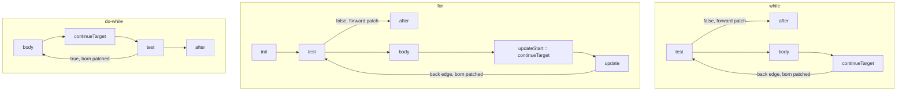

# 19. The Jump Nobody Patched   ⟨I · B · J · N⟩

A compiler that emits instructions in one forward pass has a problem the first time it
meets an `if`. It must emit "jump past the body" before it has emitted the body, which
means it must write down a destination it does not yet know. The classical answer is to
write a placeholder, remember where the placeholder is, and come back later to overwrite
it. That is backpatching, it is sixty years old, and it works.

It also fails silently, and this chapter is about why. In this bytecode a jump target is an
absolute instruction index, and the placeholder the compiler writes is `0`. Instruction 0
is a real instruction. So a jump that nobody ever patched is not malformed and cannot be
detected as malformed: it is a perfectly well-formed instruction that sends control to the
first instruction of the function. There is no verifier in this tier, no assertion at the
end of `compile()`, and no way to tell a placeholder from a legitimate target by looking at
it — `tests/bytecode/register/compiler.test.ts > "back-jump points to loop start"` asserts
that a `while true` at script scope produces a back edge whose target is exactly `0`. The
book's own example program, `docs/example/labeled.tera`, spent part of its life printing
`1 2` forever because of one such jump, and the fix that closed it produced a rule worth
more than the fix: **a jump can only be patched by the construct that owns its target.**

The example set cannot reach everything this chapter covers. None of the eight files in
`docs/example/` contains a `switch` or a `try`, so those two lowerings are read from source
and demonstrated with the exact program text that
`tests/e2e/language/control-flow.test.ts` compiles, disassembled here. Everything else —
`if`, `while`, `for`, `for-of`, the labelled `continue` — comes from `stats.tera` and
`labeled.tera` directly.

**What arrived.** From [Ch 18]: straight-line instruction sequences for expressions, built
on the accumulator protocol — one implicit value that every opcode reads or writes, with
`Ldar` and `Star` shuffling values in and out of registers around it. Those sequences
contain no jumps except the ones `&&`, `||`, `?:`, `??` and `?.` emit and patch entirely
within themselves. They also leave two side effects on the `RegisterCompiledFunction`: a
`registerCount` high-water mark that will size the interpreter's register array, and a
numbered sequence of feedback slots appended as trailing operands. This chapter adds the
control flow that connects those straight lines to each other.

## The problem, stated once

Consider what `compileIfStatement` has to do. It is handed an AST node with a `test`, a
`consequent` and possibly an `alternate`. It compiles the test, which leaves a value in the
accumulator. Now it needs an instruction that means "if that value is false, skip the
consequent". The consequent has not been compiled yet. Its length is not a property of the
AST — it depends on how many instructions the expression compiler happens to emit for
whatever is inside, which depends on register pressure, on constant folding, on nested
control flow. The only way to know is to compile it.

Backward jumps have no such problem. When a `while` loop emits its back edge, the loop's
first instruction is already in the array and its index is known. That asymmetry — forward
targets unknown, backward targets known — is the entire shape of this chapter.

> **New idea.** *Backpatching.* Emit the jump with a placeholder in its target operand.
> Remember the *index of the instruction you just emitted*. Compile whatever comes next.
> When you reach the point the jump should land on, go back and overwrite that operand with
> the current instruction count. The technique needs exactly two things from the emitter: a
> way to learn the index of an instruction as you emit it, and a way to write to an
> instruction after the fact.

The alternative — a second pass — would buy real things. It would let the compiler emit
symbolic labels, resolve them all at once, and then check that every label was defined. It
would also let the instruction encoding use relative offsets, which is what a bytecode with
a variable-width encoding would need. tera's encoding is a fixed-shape `number[]` per
instruction and its targets are absolute, so a second pass would buy only the checking. It
was not written. The consequences of not writing it are the second half of this chapter.

## The two lines that implement it

Both requirements are met by two lines in `src/bytecode/register/ops/bytecode.ts`. `emit`
appends and returns the index it appended at:

```ts
  emit(opcode: RegisterOpcode, ...operands: RegisterOperand[]): number {
    const instr = new RegisterInstruction(opcode, ...operands);
    this.instructions.push(instr);
    const pc = this.instructions.length - 1;
```

— `src/bytecode/register/ops/bytecode.ts:569-572`

and `patchJump` writes operand 0 of whatever index it is handed:

```ts
  patchJump(instrIndex: number, target: number): void {
    this.instructions[instrIndex]!.operands[0] = target;
  }
```

— `src/bytecode/register/ops/bytecode.ts:595-597`

That is the whole mechanism. Two tests pin it, and between them they describe the entire
contract: `tests/bytecode/register/ops/bytecode.test.ts > "emit appends instruction and
returns its index"` and `tests/bytecode/register/ops/bytecode.test.ts > "patchJump updates
operand[0] of target instruction"`.

Read `patchJump` again with an adversarial eye. It does not check that
`instructions[instrIndex]` is a jump. It does not check that the opcode has a control
effect at all — hand it the index of an `Add` and it will overwrite the register the `Add`
reads. It does not check whether that operand has been written before, so patching the same
jump twice is silent. And, most importantly for what follows, nothing anywhere counts how
many jumps were emitted with a placeholder against how many were patched. `patchJump` is an
array store with a good name.

The return value of `emit` is equally unpoliced. Every caller that emits a forward jump is
expected to keep the returned index and use it later. Nothing obliges it to. A caller that
drops the number on the floor produces a jump that no one can ever patch, because the only
handle on it has been lost — and produces it without a warning, a type error, or a
diagnostic.

## Absolute targets, and what a back edge is

[Ch 17] noted that this instruction set stores jump targets as absolute instruction
indices, which is a divergence from the byte-offset encodings most register bytecodes use.
Here is what that buys and what it costs.

It buys the idiom that appears in every lowering in the compiler:
`this.func.patchJump(j, this.func.instructions.length)` — "patch this jump to the next
instruction that will be emitted". Because `instructions.length` is the index the next
`emit` will return, the compiler never has to compute a distance. It also buys a trivially
readable disassembly, and a downstream consumer that can find control flow by reading one
operand.

That consumer is `src/bytecode/register/ops/register-effects.ts`, the table [Ch 17 §
the-effects-table] introduced. It declares six control effects —

```ts
export type ControlEffect =
  | "next"
  | "jump"
  | "branch"
  | "terminate"
  | "enter-handler"
  | "leave-handler";

const CONTROL_TARGET_OPERAND = 0;
```

— `src/bytecode/register/ops/register-effects.ts:15-23`

— and then two functions that read a target out of an instruction, both of which go through
one helper that first asks the table what kind of control the opcode has and refuses if it
is the wrong kind. `jumpTargetOf` accepts `"jump"` and `"branch"`; `handlerTargetOf`
accepts only `"enter-handler"`. The separation is deliberate and pinned:
`tests/bytecode/register/ops/register-effects.test.ts > "keeps the handler of a try apart
from the target of a jump"` asserts that each function returns `null` for the other's
opcode. Four opcodes carry a target in operand 0 — `ROP_JUMP`, `ROP_JUMP_IF_TRUE`,
`ROP_JUMP_IF_FALSE` and `ROP_TRY_START` — and this table is the only machine-readable
statement of that fact.

The pay-off for absolute targets shows up in the interpreter, in three cases that are the
same ten lines with a different condition in front:

```ts
            case bytecode.ROP_JUMP: {
              const target = operands[0];
              if (target < frame.pc) {
                loopCounter++;
                const osr = this.onBackEdge(compiledFn, frame, target, loopCounter);
                if (osr !== null) return osr;
              }
              frame.pc = target;
              continue;
            }
```

— `src/bytecode/register/interpreter/index.ts:1775-1784`

> **New idea.** *Back edge.* An edge in a program's control flow that goes backwards — from
> an instruction to one that precedes it. Every loop has one; nothing that is not a loop
> does. Engines care because a back edge is the cheapest possible signal that code is being
> executed repeatedly, and repetition is the only reason to spend time compiling something.

Because targets are absolute indices into one array, "is this a back edge" is the
arithmetic comparison `target < frame.pc` and nothing else. No dominator computation, no
loop-nesting analysis, not even a control-flow graph — just two numbers. That single
comparison, at `src/bytecode/register/interpreter/index.ts:1777` and twice more in the two
conditional-jump cases, is what increments `loopCounter` and calls `onBackEdge`, which is
[Ch 35 § one-hook-two-jobs]'s tiering trigger and [Ch 37 § the-poll]'s on-stack-replacement
poll. The entire "this function is hot" machinery of the engine hangs off it.

And here is the cost, which is this chapter's subject. The placeholder the compiler writes
into that operand is `0`, and `0` is a legal target. An unpatched forward jump does not
crash, does not raise, and does not even look wrong: it looks like a back edge to the
beginning of the function. It will be counted as a back edge. It will drive tiering. It
will send control to instruction 0 forever.

## `if` and `if/else`

The two smallest shapes fit in one excerpt and demonstrate the whole idiom:

```ts
  compileIfStatement(node) {
    this.compileExpression(expressionNode(node.test, "if test"));
    const jumpToElse = this.func.emit(bytecode.ROP_JUMP_IF_FALSE, 0, this.func.allocFeedbackSlot());
    this.compileStatement(singleStatement(node.consequent, "if consequent"));

    if (node.alternate) {
      const jumpToEnd = this.func.emit(bytecode.ROP_JUMP, 0);
      this.func.patchJump(jumpToElse, this.func.instructions.length);
      this.compileStatement(singleStatement(node.alternate, "if alternate"));
      this.func.patchJump(jumpToEnd, this.func.instructions.length);
    } else {
      this.func.patchJump(jumpToElse, this.func.instructions.length);
    }
  },
```

— `src/bytecode/register/compiler/statements.ts:326-339`

One patch when there is no `else`, two when there is. The ordering in the `else` branch is
the only subtle part: `jumpToEnd` is emitted *before* `jumpToElse` is patched, so that the
`else` target lands after the jump that skips the else, not on it. Get those two statements
the wrong way round and the `if` arm falls straight into the `else` arm. Both shapes are
pinned — `tests/bytecode/register/compiler.test.ts > "compiles if without else"`,
`> "compiles if-else"`, and `> "patches jump targets correctly for if-else"`, the last of
which asserts on the actual operand values rather than just the presence of the opcodes.

Note the third argument to the `ROP_JUMP_IF_FALSE` emit: `this.func.allocFeedbackSlot()`.
A conditional jump is a feedback site. Operand 0 is the target and operand 1 is a slot
number, and the two live in the same untyped `number[]`. The interpreter types that slot as
a branch slot when it builds the feedback vector — `src/bytecode/register/interpreter/index.ts:890-898`
— and `hotSuccessorOf` in the SSA builder reads `operands[1]` back out to decide which
successor block to lay out first (`src/optimizing/builder/ir-builder.ts:232-244`,
[Ch 39 § branch-bias-steers-block-order]). Nothing enforces that operand 1 of a conditional
jump is a feedback slot rather than a register; three files agree by inspection. That is
the same `> **Unenforced.**` seam [Ch 17] opened, now with a second reader.

> **Unfinished.** The interpreter *types* a branch slot but never *writes* one.
> `FeedbackSlot.recordBranch` (`src/feedback/vector/index.ts:259-267`) has exactly one
> caller in `src/`: `BaselineRuntime.branch` (`src/optimizing/baseline/runtime.ts:774-779`).
> The interpreter's `ROP_JUMP_IF_FALSE` and `ROP_JUMP_IF_TRUE` cases (1786-1798, 1800-1812)
> do not touch the vector. So a function that reaches the JIT without ever running in
> baseline has `getBranchBias()` answering `"unknown"` for every branch, and `hotSuccessorOf`
> returns `null`. Cost of fixing: one call in each of the two interpreter cases.
> [Ch 33 § two-writers-one-vector] takes this up in full.

## `while`, `for`, `do-while`

Three loop shapes, one page. `compileWhileStatement` is the reference version and is
exactly twenty lines:

```ts
  compileWhileStatement(node) {
    const iterationScopeBase = this.func.registerCount;
    const body = singleStatement(node.body, "while body");
    const mayCapture = this._bodyMayCapture(body);
    const loop = enterLoop(this);

    const loopStart = this.func.instructions.length;
    this.compileExpression(expressionNode(node.test, "while test"));
    const jumpToEnd = this.func.emit(bytecode.ROP_JUMP_IF_FALSE, 0, this.func.allocFeedbackSlot());
    this.compileStatement(body);

    const continueTarget = this.func.instructions.length;
    if (mayCapture) {
      this.func.emit(bytecode.ROP_CLOSE_UPVALUES, iterationScopeBase);
    }
    this.func.emit(bytecode.ROP_JUMP, loopStart);
    const endTarget = this.func.instructions.length;
    this.func.patchJump(jumpToEnd, endTarget);
    exitLoop(this, loop, continueTarget, endTarget);
  },
```

— `src/bytecode/register/compiler/statements.ts:385-404`

`loopStart` is captured before the test is compiled, so the back edge at the bottom is born
with its target already correct. The exit jump is the only forward jump, patched once at
`endTarget`. `mean` in `stats.tera` is exactly this shape:

```
    12  Ldar r2
    13  TestLessThan r3 r2
    14  JumpIfFalse r32 r3
    15  LdaThis
    ...
    31  Jump r4
    32  Ldar r0
```

— `node dist/cli.js --print-bytecode --filter mean docs/example/stats.tera`

Instruction 14 was emitted with target `0` and patched to `32` when the loop finished;
instruction 31 was emitted with `4` already in it. And `4 < 31`, which is what makes it a
back edge to the interpreter and what makes `mean` a candidate for tiering up.

A note on reading these listings, because it will otherwise mislead you all chapter.
`disassemble` prints every operand it has no special case for as `r` followed by the number
(`src/bytecode/register/ops/bytecode.ts:648-649`). So `JumpIfFalse r32 r3` is *not* two
registers: it is target 32 and feedback slot 3. `Jump r4` is target 4. `Add r2 r6` is
register 2 and feedback slot 6. Operand meaning comes from `register-effects.ts`, never
from the printed text.

`compileForStatement` (406-453) differs in exactly one respect that matters here: it
records `updateStart` after the body and passes *that* as the continue target, so a
`continue` still runs the loop's update expression before jumping back. `compileDoWhileStatement`
is the odd one:

```ts
  compileDoWhileStatement(node) {
    const loop = enterLoop(this);

    const loopStart = this.func.instructions.length;
    this.compileStatement(singleStatement(node.body, "do-while body"));
    const continueTarget = this.func.instructions.length;
    this.compileExpression(expressionNode(node.test, "do-while test"));
    this.func.emit(bytecode.ROP_JUMP_IF_TRUE, loopStart, this.func.allocFeedbackSlot());
    const endTarget = this.func.instructions.length;
    exitLoop(this, loop, continueTarget, endTarget);
  },
```

— `src/bytecode/register/compiler/statements.ts:642-652`

There is no forward jump at all. The test is at the bottom, so the only jump the shape
needs is the back edge, and `loopStart` is known before it is emitted. This is the one loop
instruction in the compiler that is born patched, and you can see it:

```
    17  TestLessThan r2 r2
    18  JumpIfTrue r2 r3
    19  LdaUndefined
```

— a `do:` / `while (i < 3)` loop in a scratch file, disassembled with `--print-bytecode`

Target 2, written at emit time. This is the one listing in the chapter that comes from
neither `docs/example/` nor `tests/`: no file in either writes a `do:` loop in tera source.
The only `do-while` test in the tree, `tests/bytecode/register/compiler.test.ts > "emits
body before condition check"`, builds the AST by hand and asserts on opcode order. The gap
matters — [Ch 20 § close-upvalues] shows a closure bug that lives exactly there.



Three shapes, one difference that matters to a programmer: where `continue` lands.

## `_breakJumps` / `_continueJumps`: save, swap, restore {#breakjumps-continuejumps-save-swap-restore}

A `break` does not know which loop it belongs to. It is compiled by
`compileBreakStatement`, deep inside whatever statement nesting the source has, and all it
can do is emit a jump and push its index somewhere the loop will find it. That somewhere is
one of two arrays on the compiler object, and the discipline that keeps them straight is
one function pair.

```ts
export function enterLoop(compiler: LoopJumpOwner): LoopContext {
  const loop: LoopContext = {
    breakJumps: [],
    continueJumps: [],
    outerBreak: compiler._breakJumps,
    outerContinue: compiler._continueJumps,
  };
  compiler._breakJumps = loop.breakJumps;
  compiler._continueJumps = loop.continueJumps;
  for (const label of compiler._pendingLoopLabels) {
    compiler._labeledContinues[label] = loop.continueJumps;
  }
  compiler._pendingLoopLabels = [];
  return loop;
}
```

— `src/bytecode/register/compiler/helpers.ts:131-145`

```ts
export function exitLoop(
  compiler: LoopJumpOwner,
  loop: LoopContext,
  continueTarget: number,
  endTarget: number,
): void {
  for (const jump of loop.breakJumps) compiler.func.patchJump(jump, endTarget);
  for (const jump of loop.continueJumps) compiler.func.patchJump(jump, continueTarget);
  compiler._breakJumps = loop.outerBreak;
  compiler._continueJumps = loop.outerContinue;
}
```

— `src/bytecode/register/compiler/helpers.ts:147-157`

This is the same explicit save/restore discipline [Ch 18 § four-mixins-over-one-mutable-object] found around nested
functions, applied to control flow: the compiler has no context object and no stack of
them, so state that must be scoped is stashed in a local, overwritten, and put back. Five
loop lowerings call this pair and no others do — `compileWhileStatement` (385),
`compileForStatement` (406), `compileDoWhileStatement` (642) in `statements.ts`, and
`compileForInStatement` (1238) and `compileForOfStatement` (1335) in `functions.ts`.

`compileBreakStatement` and `compileContinueStatement` are the producers:

```ts
  compileContinueStatement(node) {
    if (
      node.label &&
      this._labeledContinues &&
      this._labeledContinues[node.label]
    ) {
      this._labeledContinues[node.label].push(
        this.func.emit(bytecode.ROP_JUMP, 0),
      );
    } else if (this._continueJumps) {
      this._continueJumps.push(this.func.emit(bytecode.ROP_JUMP, 0));
    }
  },
```

— `src/bytecode/register/compiler/statements.ts:654-666`

`compileBreakStatement` (551-559) is the same shape with `_labeledBreaks` and
`_breakJumps`. Both emit `ROP_JUMP` with the placeholder and hand the index to a list they
do not own. The unlabelled case is pinned only weakly:
`tests/bytecode/register/compiler.test.ts > "compiles break in while loop"` and
`> "compiles continue in while loop"` both assert that a `ROP_JUMP` was emitted and say
nothing about its target.

One asymmetry matters later. `compileSwitchStatement` also scopes `break`, but it does it
by hand:

```ts
    const outerBreakJumps = this._breakJumps;
    const breakJumps: number[] = [];
    this._breakJumps = breakJumps;
```

— `src/bytecode/register/compiler/statements.ts:495-497`

It swaps `_breakJumps` and leaves `_continueJumps` alone, because a `continue` written
inside a `switch` belongs to the enclosing *loop*, not to the switch. That is correct, and
it is also the reason `switch` cannot simply call `enterLoop`.

> **Unfinished.** Both statements fall through silently when no list is present.
> `_breakJumps` and `_continueJumps` are initialised to `null`
> (`src/bytecode/register/compiler/index.ts:67-68`), and `enterLoop`/`exitLoop` restore
> `null` when the outermost loop exits — so at script scope the `else if` guard is false and
> a `break` outside any loop emits **nothing at all**. Verified:
> `node dist/cli.js -e 'print(1)⏎break⏎print(2)'` compiles to eleven instructions with no
> `Jump` among them, prints `1` then `2`, and exits 0. The checker may reject the shape
> earlier ([Ch 13]); the bytecode compiler does not. Cost of fixing: one `throw` in each of
> two `else` branches. [unpinned]

## `switch` is linear compare-and-dispatch

`compileSwitchStatement` (490-549) is worth reading for what it is *not*. There is no jump
table, no binary search over case values, no hashing and no dense-range check. It emits, in
source order, one `TestEqual` plus one `JumpIfTrue` per case, all comparing against the
discriminant parked in a register; then an unconditional jump for the default; then every
case body laid out contiguously so that fall-through costs nothing; then it patches each
dispatch jump to the body it selected. Dispatch is therefore O(number of cases): finding
the last case of a twenty-case switch executes forty instructions of comparison first.
Nothing here has been measured, so that is a statement about instruction counts and not
about time.

`docs/example/` has no `switch`. This is the program
`tests/e2e/language/control-flow.test.ts > "runs an offside switch with case and default"`
compiles, disassembled:

```
     0  Ldar r0
     1  Star r1
     2  Ldar r1
     3  LdaConst [0] (1)
     4  Star r2
     5  Ldar r1
     6  TestEqual r2 r0
     7  JumpIfTrue r15 r1
     8  Ldar r1
     9  LdaConst [1] (2)
    10  Star r2
    11  Ldar r1
    12  TestEqual r2 r2
    13  JumpIfTrue r17 r3
    14  Jump r19
    15  LdaConst [2] ("one")
    16  Return
    17  LdaConst [3] ("two")
    18  Return
    19  LdaConst [4] ("other")
    20  Return
```

— `name`, the eight-line `switch` written at `tests/e2e/language/control-flow.test.ts:61-70`,
disassembled with `node dist/cli.js --print-bytecode --filter name`

Three forward jumps, all emitted with `0` and all patched: 7 to 15, 13 to 17, and the
default jump at 14 to 19. Two feedback slots per case — one for the equality test, one for
the branch — so slots 0 through 3 are consumed before a single case body runs. The `default`
case is not compiled where it appears; `defaultIndex` is recorded during the dispatch pass
and used only when the trailing `Jump` is patched, which is why a `default` written first
still runs last.

## `try` / `catch` / `finally`, and the two nested handlers

`compileTryStatement` (561-635) has two branches, and the difference between them is the
most instructive thing in the method. Without a finalizer it emits one `ROP_TRY_START`
whose operand 0 — a handler target, not a jump target, which is why `register-effects.ts`
gives it its own `"enter-handler"` effect — is patched to the catch body. With a finalizer
it emits **two**:

```ts
      this._finallyBlocks.push({ body: blockBody(finalizer.body) });

      const outerTryStart = this.func.emit(bytecode.ROP_TRY_START, 0);
      const innerTryStart = this.func.emit(bytecode.ROP_TRY_START, 0);
      this.compileStatements(blockBody(node.block?.body));
```

— `src/bytecode/register/compiler/statements.ts:568-572`

The inner handler catches what the `try` block throws and runs the `catch` body. The outer
handler catches what the *catch body* throws — and what the try block throws when there is
no catch body at all, in which case the compiler emits a bare `ROP_THROW` at line 590 to
re-raise it. The outer handler's job is to run the finalizer and then rethrow, which it
does by parking the exception in a temp register, compiling the finalizer's statements
again, reloading the exception and throwing it.

That "again" is the design. There is no subroutine-call opcode in this instruction set and
no `ROP_FINALLY_RETURN`, so the only way to make a finalizer run on every path out of the
block is to compile its body once per path. `docs/example/` has no `try`; this is the
program `tests/e2e/language/control-flow.test.ts:143-150` compiles, disassembled:

```
     2  TryStart r20
     3  TryStart r8
     4  LdaConst [2] ("x")
     5  Throw
     6  TryEnd
     7  Jump r11
     8  Star r0
     9  LdaConst [3] (3)
    10  StaGlobal [1] (out)
    11  TryEnd
    12  LdaGlobal [1] (out)        <- finalizer, copy 1: normal completion
    ...
    18  StaGlobal [1] (out)
    19  Jump r30
    20  Star r3
    21  LdaGlobal [1] (out)        <- copy 2: the exceptional path
    ...
    27  StaGlobal [1] (out)
    28  Ldar r3
    29  Throw
    30  LdaGlobal [1] (out)
```

— `node dist/cli.js --print-bytecode` on a file holding those eight lines; instructions 0-1
and the six-instruction interiors of the two finalizer copies are elided.

Two `TryStart`s, and their targets — 20 for the outer, 8 for the inner — are the only two
handler patches in the function; every other forward jump here is an ordinary `Jump`. The
finalizer's body, `out = out + 1`, appears twice: once at 12-18 for the path where the
`catch` completed normally, once at 21-27 for the path where the catch body itself threw.
Add a `return` inside the `try` and a third copy appears, which is the subject of the next
section. `tests/e2e/language/control-flow.test.ts > "catches thrown values and always runs
finally"` pins the observable answer, `4`.

> **Unfinished.** The no-finalizer branch's `handler === undefined` case — a `try` with
> neither `catch` nor `finally` — emits a `ROP_TRY_START` whose handler target is patched to
> the instruction immediately after the block (632-633), so the exception is swallowed and
> execution continues. The finalizer branch treats the same shape correctly, emitting an
> explicit `ROP_THROW` (590). Two branches, two answers. In practice the parser refuses the
> shape first — `try:` with no arm reports `[Parser] Missing catch or finally after try at
> 3:1` and exits 1 (`src/frontend/parser/index.ts:1837`) — so the branch is reachable only
> by handing the compiler an AST directly. Cost of fixing: copy line 590. [unpinned]

> **Dead.** `compileTryStatement` computes `const hasFinally = !!finalizer` and
> `const hasCatch = !!handler` at `src/bytecode/register/compiler/statements.ts:564-565` and
> never reads either. Cost of removing: two lines.

## `return` unwinds by hand

`compileReturnStatement` is where the cost of having no finalizer-subroutine is paid in
full, and it is also the clearest single statement of the trade:

```ts
  compileReturnStatement(node) {
    if (node.argument) {
      this.compileExpression(node.argument);
    } else {
      this.func.emit(bytecode.ROP_LDA_UNDEFINED);
    }
    if (this._finallyBlocks.length > 0) {
      var retReg = this.temps.alloc();
      this.func.emit(bytecode.ROP_STAR, retReg);
      var saved = this._finallyBlocks;
      for (var i = saved.length - 1; i >= 0; i--) {
        this.func.emit(bytecode.ROP_TRY_END);
        this._finallyBlocks = saved.slice(0, i);
        this.compileStatements(saved[i].body);
      }
      this._finallyBlocks = saved;
      this.func.emit(bytecode.ROP_LDA_REG, retReg);
      this.temps.free(retReg);
    }
    this.func.emit(bytecode.ROP_RETURN);
  },
```

— `src/bytecode/register/compiler/statements.ts:455-475`

The return value goes into a temp because compiling the finalizers will clobber the
accumulator. Then the pending finalizers are walked *backwards* — innermost first, which is
the order they must run in — each preceded by a `ROP_TRY_END` that pops one handler off the
interpreter's handler stack. The subtle line is
`this._finallyBlocks = saved.slice(0, i)`: before compiling finalizer *i*, the list is
truncated to everything outside it, so a `return` written *inside* a finalizer does not
re-emit the finalizers it is already running. Without that line, a `return` in a `finally`
inside another `finally` would compile to an unbounded expansion.

Note what this means for the shape of the emitted code: `return` inside a `try/finally` is
not a single instruction, and the number of instructions it becomes depends on how deeply
nested it is. Everything downstream that reasons about function exits — the CFG builder of
[Ch 38 § what-a-register-cannot-tell-you], the inliner, the frame-state machinery — sees
several `Return` instructions where the source had one.

## `_bodyMayCapture` decides whether a loop needs `CloseUpvalues` {#body-may-capture}

Both `compileWhileStatement` and `compileForStatement` open by reading
`this.func.registerCount` into `iterationScopeBase` and asking `_bodyMayCapture(body)`. The
analysis (341-383) is a recursive structural walk with one job: does this subtree contain a
node whose type is `FunctionExpression`, `ArrowFunctionExpression`, `FunctionDeclaration`,
`LazyFunctionDeclaration` or `"GeneratorFunctionDeclaration"`? It walks every key of every
node, skipping only `type` and its own memo field, and it memoises the answer onto the AST
node as `_mayCapture` so a nested loop does not re-walk its body once per enclosing level.

If the answer is yes, the loop emits one extra instruction at its continue target:
`ROP_CLOSE_UPVALUES iterationScopeBase`. Because `iterationScopeBase` was read *before* the
loop was compiled, every register the body allocates is at or above it, and the operand
therefore names the whole set of per-iteration slots in one number.

That is all this chapter needs to say about it: one instruction, one operand, emitted on a
structural test. What the instruction *means* — why a loop body is not a fresh scope unless
something explicitly ends it, and what happens to a closure created in a loop that does not
emit it — is [Ch 20 § close-upvalues], which has the two-answer example.

## The bug {#the-bug}

Here is `labeled.tera`, all seven lines:

```
rows = [[1, 2, 0], [3, 0, 4], [5, 6, 7]]

outer: for r of rows:
  for v of r:
    if v == 0:
      continue outer
    print(v)
```

— `docs/example/labeled.tera`

It prints `1`, `2`, `3`, `5`, `6`, `7` on six lines and exits 0. The relevant window of its
`<script>` disassembly:

```
    55  TestLooseEqual r4 r2
    56  JumpIfFalse r58 r3
    57  Jump r64
    58  LdaGlobal [9] (print)
    59  Star r3
```

— `node dist/cli.js --print-bytecode --filter '<script>' docs/example/labeled.tera`

Instruction 57 is `continue outer`. Instruction 64 is `Jump r29`, the outer `for-of`'s back
edge, and 29 is `Ldar r15` — the instruction that reloads the outer iterator before
stepping it. So `continue outer` lands on the outer loop's latch, which steps the outer
iterator and re-enters. That is the right answer.

The symptom, before the fix, was that instruction 57 read `Jump r0`. Instruction 0 of
`<script>` is `LdaConst [0] (1)`, the first instruction of the program — the beginning of
building `rows`. So `continue outer` re-entered neither loop. It restarted the entire
script, rebuilt `rows`, walked into the first row, printed `1` and `2`, hit the zero, and
jumped to instruction 0 again. The program printed `1 2 1 2 1 2` forever. And because `0 <
57`, the interpreter counted every one of those jumps as a back edge, so the hang also
drove `loopCounter` and tried to tier the script up.

The mechanism was one missing loop. The previous `compileLabeledStatement` initialised both
lists —

```ts
    this._labeledBreaks[label] = [];
    this._labeledContinues[label] = [];

    this.compileStatement(singleStatement(node.body, "labeled body"));

    const afterLabel = this.func.instructions.length;
    for (const jump of this._labeledBreaks[label] ?? []) {
      this.func.patchJump(jump, afterLabel);
    }
    delete this._labeledBreaks[label];
    delete this._labeledContinues[label];
```

— the version replaced in commit `11021f9`, from `git show 11021f9 -- src/bytecode/register/compiler/statements.ts`

— `compileBreakStatement` and `compileContinueStatement` both pushed placeholder-jump
indices into them, and then the label patched **only** the breaks and deleted both lists.
Every labelled `continue` kept its placeholder. `break outer` was correct throughout; only
`continue` was affected, which is why the shape survived in the tree at all —
`tests/e2e/language/control-flow.test.ts > "runs labeled indentation blocks with labeled
break"` passed the whole time.

The general rule this half produces is worth stating before the fix: **a placeholder that is
indistinguishable from a valid value cannot fail loudly.** The compiler had all the
information needed to notice — it created the list, it watched jumps go into it, it deleted
it non-empty — and noticed nothing, because there was no step at which the absence of a
patch was represented as anything.

## Why the one-line fix is wrong *(Why the obvious design fails)*

The obvious patch is to mirror the break loop:

```ts
    for (const jump of this._labeledContinues[label] ?? []) {
      this.func.patchJump(jump, ???);
    }
```

and the question marks are the reason it cannot work. A labelled `break` lands *after the
labelled statement*, and the labelled statement knows where that is: it is
`this.func.instructions.length` at the moment the label finishes compiling. A labelled
`continue` lands on the labelled **loop's** continue point, and every loop shape puts that
somewhere different:

| loop | continue target | where it comes from |
| --- | --- | --- |
| `while` | after the body, before the back edge | `continueTarget`, `statements.ts:396` |
| `for` | after the body, before the update | `updateStart`, `statements.ts:440` |
| `do-while` | after the body, before the test | `continueTarget`, `statements.ts:647` |
| `for-in` | after the body, before the index increment | `continueTarget`, `functions.ts:1313` |
| `for-of` | after the body, before the back edge | `continueTarget`, `functions.ts:1396` |

`compileLabeledStatement` sees none of these. It is handed a node, it compiles it, and by
the time control returns to it the loop lowering has finished and thrown its locals away.
It does not know which of the five shapes it wrapped, and even if it did, it has no access
to the instruction index that shape computed. There is no number for it to write.

That produces the chapter's real rule, and it is the stronger of the two: **a jump can only
be patched by the construct that owns its target.** A labelled statement owns a label. It
owns the instruction after itself, which is why the break half always worked. It does not
own a latch.

Four e2e tests exist precisely because the five continue targets differ, and they are the
argument against the one-line fix in executable form:
`tests/e2e/language/control-flow.test.ts > "resumes the labeled for-of from inside a nested
loop"`, `> "resumes the labeled while from inside a nested loop"`, `> "resumes the labeled
loop written as an indentation block"`, and `> "runs the loop's update before resuming a
labeled for"` — the last of which asserts the output `0 1 2 3`, which is only correct if the
labelled `continue` landed at `updateStart` and ran `i = i + 1`.

## The fix: the label is handed to the loop {#the-fix}

The current `compileLabeledStatement` is twenty-two lines, two over the excerpt rule, and it
splits cleanly into two halves that now differ in kind. The first half sets up and does not
resolve:

```ts
  compileLabeledStatement(node) {
    const label = requiredLabel(node, "labeled statement");
    const body = singleStatement(node.body, "labeled body");
    const unboundContinues: number[] = [];
    const outerPending = this._pendingLoopLabels;
    this._labeledBreaks[label] = [];
    this._labeledContinues[label] = unboundContinues;
    this._pendingLoopLabels = labelsLoop(body) ? [...outerPending, label] : [];

    this.compileStatement(body);
```

— `src/bytecode/register/compiler/statements.ts:668-677`

`_labeledContinues[label]` is set to a *sentinel* array — an array this method holds a
reference to and will recognise later. The label is appended to `_pendingLoopLabels`, but
only if `labelsLoop(body)` (84-99) says the label actually wraps a loop; that helper walks
down through nested `LabeledStatement`s and through single-statement `BlockStatement`s,
which is what makes the indentation-block form

```
outer:
  for i of [1, 2, 3]:
```

count as labelling a loop. If it does not name a loop, `_pendingLoopLabels` is cleared
rather than extended, which is deliberate: an unrelated inner loop must not inherit the
label.

`enterLoop` — the function every loop lowering already called — does the handover. Its
three lines are already quoted above: it drains `_pendingLoopLabels` and points
`_labeledContinues[label]` at the loop's own `continueJumps` array. From that moment
`compileContinueStatement` pushes a labelled continue straight into the loop's list, and
`exitLoop` patches it alongside the unlabelled ones, to the target only the loop knew.

The second half is unchanged for breaks and, for continues, does something new:

```ts
    this._pendingLoopLabels = outerPending;
    const afterLabel = this.func.instructions.length;
    for (const jump of this._labeledBreaks[label]) {
      this.func.patchJump(jump, afterLabel);
    }
    if (this._labeledContinues[label] === unboundContinues && unboundContinues.length > 0) {
      throw new Error(`[RegCompiler] Label '${label}' does not name a loop`);
    }
    delete this._labeledBreaks[label];
    delete this._labeledContinues[label];
  },
```

— `src/bytecode/register/compiler/statements.ts:679-689`

Two consequences are worth drawing out. First, the label never computes a target. It
delegates ownership of the jumps to whoever owns the target, and that is the whole content
of the fix — the diff that introduced it moved fifteen lines of hand-rolled save/swap/restore
out of five loop lowerings into `enterLoop`/`exitLoop`, and the labelled-continue handover
came along for free once there was one place where "a loop begins" was written down.

Second, the sentinel makes the failure case *detectable*. If `_labeledContinues[label]` is
still the identical array this method created, no loop ever claimed the label; if it is also
non-empty, some `continue` pushed a jump into it that nothing will ever patch. That is
exactly the condition the old code could not express, and it now throws:

```
$ node dist/cli.js -e 'lbl: if true:
  continue lbl'
[RegCompiler] Label 'lbl' does not name a loop
```

A silent hang became a compile error. Note the identity comparison rather than a length or a
flag: it is the one test that distinguishes "no loop took this label" from "a loop took it
and patched everything", and it costs nothing because the sentinel already had to exist.

## The regression tests

Five tests pin this, and they pin five different things.

That the labelled continue lands on the *outer* latch, in a `while` and in a `for-of`:
`tests/bytecode/register/compiler.test.ts > "backpatches labeled continue in a while loop to
the outer loop latch"` and `> "backpatches labeled continue in a for loop to the outer loop
latch"`. Both find the jump indices in the compiled function, take the first as the labelled
continue and the last as the outer latch, and assert
`insAt(func, labeledContinue).operands[0]` equals `outerLatch`.

That its target is *past* the inner latch rather than equal to it:
`tests/bytecode/register/compiler.test.ts > "sends labeled continue past the inner loop
rather than to the inner latch"`, which asserts
`insAt(func, labeledContinue).operands[0]` is strictly greater than the inner loop's latch
index. This is the assertion a naive fix fails: patching labelled continues to whatever
continue target happens to be current when the label finishes would land them on the inner
loop.

That a label naming no loop is refused: `tests/bytecode/register/compiler.test.ts >
"rejects a labeled continue whose label does not name a loop"`, and the same title again in
`tests/e2e/language/control-flow.test.ts`, one asserting on the thrown message from the
compiler and one from a full run.

That the unlabelled case was not stolen by the handover:
`tests/e2e/language/control-flow.test.ts > "keeps unlabeled continue bound to the innermost
loop"`.

And that the program answers: `tests/e2e/docs/book-examples.test.ts > "labeled.tera resumes
the outer loop instead of restarting the program"`, which reads the file, asserts it still
contains `continue outer`, runs it, and expects `["1","2","3","5","6","7"]`. The variation
that once had to be quarantined is now checked like every other one.

One detail in the first of those tests deserves attention, because it is the best evidence
in the tree for the next section. Before asserting the labelled continue's target, it
asserts `insAt(func, outerLatch).operands[0]` is `0` — the outer loop of a
`while cond: for v of inner: continue outer` at script scope starts at instruction 0, so its
back edge legitimately targets zero. The legitimate target and the unpatched placeholder are
the same number, asserted in the same test that proves the illegitimate one is gone.

## The verifier that does not exist {#the-verifier-that-does-not-exist}

The fix above closed the hole for exactly one shape, by hand, at the one site that could see
it. Nothing generalises it. Every other jump in the compiler is still emitted with a
placeholder that nothing counts.

> **Unenforced.** Nothing checks that every emitted jump was patched. `patchJump`
> (`src/bytecode/register/ops/bytecode.ts:595-597`) is an array store with no bookkeeping;
> `emit` (569-582) returns an index nobody is obliged to use; and `compile()`
> (`src/bytecode/register/compiler/index.ts:143-175`) returns the `RegisterCompiledFunction`
> without inspecting the instruction list. This is the enforcement gap that made the
> labelled-`continue` bug a silent hang instead of a compile error ([Ch 19 § the-bug]).

The invariant is one sentence: *no reachable `Jump`, `JumpIfTrue`, `JumpIfFalse` or
`TryStart` may still hold its placeholder.* It is not checkable as written, because `0` is a
legal target and `tests/bytecode/register/compiler.test.ts > "back-jump points to loop
start"` exists to say so. Any check has to be structural rather than value-based, and there
are two shapes it could take.

The first is a distinguishable placeholder. Emit forward jumps with `-1` instead of `0`,
and assert at the end of `compile()` that no instruction with a control effect of `"jump"`,
`"branch"` or `"enter-handler"` still holds it. `register-effects.ts` already knows which
opcodes those are and which operand to look at, so the assertion is a loop over the
instruction array and a table lookup. The cost is that `-1` must not reach the interpreter
if the assertion is ever disabled, and that every existing test asserting on a placeholder
value would need updating.

The second is bookkeeping. Give `RegisterCompiledFunction` a `pendingJumps: Set<number>`;
have the emit-with-placeholder path add to it and `patchJump` delete from it; assert it is
empty at the end of `compile()`. This catches the double-patch case too, and it needs no
change to the encoding — but it needs a second emit entry point, because `emit` is also
used for the born-patched `do-while` back edge and for jumps whose target is known.

Either is perhaps thirty lines. The reason to write one is not this bug, which is fixed. It
is that this tier is the one every other tier reads from. The instruction list produced
here is the input to the interpreter's dispatch loop, to the baseline compiler's generated
JavaScript, and to the SSA builder that both the WebAssembly JIT and the native compiler
stand on. An engine that runs an SSA verifier after every optimizer pass and a MachineIR
verifier over its register allocator's output ([Ch 78]) runs no verifier at all over the
representation all four of its machines start from.

## What leaves

A complete control-flow shape, expressed as absolute instruction indices in operand 0 of
four opcodes: `Jump`, `JumpIfTrue`, `JumpIfFalse` and `TryStart`. Loops, conditionals,
`switch`, `try`/`catch`/`finally`, `break`, `continue` and labelled statements have all been
flattened into one numbered array; nothing in it says "loop", "block" or "handler". A back
edge is a jump whose target is numerically smaller than its own index, and that arithmetic
is the only structure left. `register-effects.ts` is the sole machine-readable description
of which operand holds a target and what kind of target it is.

Two things ride along that this chapter emitted but did not explain.
`ROP_CLOSE_UPVALUES iterationScopeBase`, emitted at the continue target of a `while`, `for`,
`for-in` or `for-of` whose body contains a function, and the feedback slot in operand 1 of
every conditional jump.

[Ch 20 § no-binding-keywords] takes the object from here and fills in everything about
naming: what `x = 1` means when the language has no binding keywords, how a captured
variable becomes an upvalue cell, what `ROP_CLOSE_UPVALUES` actually does to those cells
([Ch 20 § close-upvalues]), and how a `class` — one AST node — becomes a constructor
function, two prototype links, one closure per method and a throwaway function per static
field. What leaves *that* chapter is the finished `RegisterCompiledFunction` this part owes
Part IV.

## Verify it yourself

```bash
# The program answers, on six lines, and exits 0.
node dist/cli.js docs/example/labeled.tera

# The jump that used to point at instruction 0 now points at the outer latch.
node dist/cli.js --print-bytecode --filter '<script>' docs/example/labeled.tera > labeled.txt 2>&1
grep -n -B2 -A2 'Jump r64' labeled.txt

# The control: a plain `while` patching correctly. Instruction 14 is JumpIfFalse
# to 32 (forward, patched); instruction 31 is Jump to 4 (backward, born patched).
node dist/cli.js --print-bytecode --filter mean docs/example/stats.tera

# A label that names no loop is now a compile error, not an unpatchable jump.
node dist/cli.js -e 'lbl: if true:
  continue lbl'

# The regression tests.
npx vitest run --project unit tests/bytecode/register/compiler.test.ts
npx vitest run --project e2e tests/e2e/language/control-flow.test.ts
```

The first prints `1`, `2`, `3`, `5`, `6`, `7`, one per line. The second and third print

```
70-    55  TestLooseEqual r4 r2
71-    56  JumpIfFalse r58 r3
72:    57  Jump r64
73-    58  LdaGlobal [9] (print)
74-    59  Star r3
```

The fourth prints `[RegCompiler] Label 'lbl' does not name a loop` and exits 1. The two test
commands pass 67 and 29 tests respectively.

## Tests that pin this

- `tests/bytecode/register/ops/bytecode.test.ts > "emit appends instruction and returns its index"`
- `tests/bytecode/register/ops/bytecode.test.ts > "patchJump updates operand[0] of target instruction"`
  — the whole mechanism, in two tests.
- `tests/bytecode/register/compiler.test.ts > "compiles if without else"`
- `tests/bytecode/register/compiler.test.ts > "compiles if-else"`
- `tests/bytecode/register/compiler.test.ts > "patches jump targets correctly for if-else"`
- `tests/bytecode/register/compiler.test.ts > "patches jump target correctly for &&"`
  — the short-circuit jump [Ch 18] emitted and patched for itself.
- `tests/bytecode/register/compiler.test.ts > "ternary emits both branches with correct jump structure"`
- `tests/bytecode/register/compiler.test.ts > "emits loop structure with condition check and back-jump"`
- `tests/bytecode/register/compiler.test.ts > "back-jump points to loop start"`
  — and note what it asserts: `operands[0]` is `0`. The legitimate target and the unpatched
  placeholder are the same number. This is the best evidence in the tree that the missing
  verifier cannot be value-based.
- `tests/bytecode/register/compiler.test.ts > "compiles for loop with init, test, update"`
- `tests/bytecode/register/compiler.test.ts > "emits body before condition check"`
  — do-while, and the only `do-while` test in the tree.
- `tests/bytecode/register/compiler.test.ts > "compiles break in while loop"`
- `tests/bytecode/register/compiler.test.ts > "compiles continue in while loop"`
  — note the coverage shape: both assert only that a `Jump` was emitted, never that it was
  patched. The four below are the ones that assert a target.
- `tests/bytecode/register/compiler.test.ts > "backpatches labeled continue in a while loop to the outer loop latch"`
- `tests/bytecode/register/compiler.test.ts > "backpatches labeled continue in a for loop to the outer loop latch"`
- `tests/bytecode/register/compiler.test.ts > "sends labeled continue past the inner loop rather than to the inner latch"`
  — the one a naive fix fails: it asserts the labelled continue's target is strictly greater
  than the inner loop's latch.
- `tests/bytecode/register/compiler.test.ts > "rejects a labeled continue whose label does not name a loop"`
  — the sentinel path, now a compile error rather than an unpatchable jump.
- `tests/bytecode/register/ops/register-effects.test.ts > "sends an unconditional jump to its target and nowhere else"`
- `tests/bytecode/register/ops/register-effects.test.ts > "names the target of either conditional jump"`
- `tests/bytecode/register/ops/register-effects.test.ts > "ends the path at a return and at a throw alike"`
- `tests/bytecode/register/ops/register-effects.test.ts > "opens a handler at a try and closes it at its end"`
- `tests/bytecode/register/ops/register-effects.test.ts > "keeps the handler of a try apart from the target of a jump"`
  — a `TryStart` target is not a jump target and the table says so.
- `tests/e2e/language/control-flow.test.ts > "runs Python-style if, while, for-of, and for-in blocks"`
- `tests/e2e/language/control-flow.test.ts > "runs an offside switch with case and default"`
- `tests/e2e/language/control-flow.test.ts > "still accepts a parenthesised switch discriminant"`
- `tests/e2e/language/control-flow.test.ts > "catches thrown values and always runs finally"`
- `tests/e2e/language/control-flow.test.ts > "runs labeled indentation blocks with labeled break"`
  — the labelled `break` half, which always worked.
- `tests/e2e/language/control-flow.test.ts > "resumes the labeled for-of from inside a nested loop"`
- `tests/e2e/language/control-flow.test.ts > "resumes the labeled while from inside a nested loop"`
- `tests/e2e/language/control-flow.test.ts > "resumes the labeled loop written as an indentation block"`
- `tests/e2e/language/control-flow.test.ts > "runs the loop's update before resuming a labeled for"`
  — the four loop shapes whose continue targets differ, which is why the label could not
  compute any of them.
- `tests/e2e/language/control-flow.test.ts > "keeps unlabeled continue bound to the innermost loop"`
  — the handover must not steal the unlabelled case.
- `tests/e2e/language/control-flow.test.ts > "rejects a labeled continue whose label does not name a loop"`
- `tests/e2e/docs/book-examples.test.ts > "labeled.tera resumes the outer loop instead of restarting the program"`
  — the example suite runs the file and expects `["1","2","3","5","6","7"]`.
