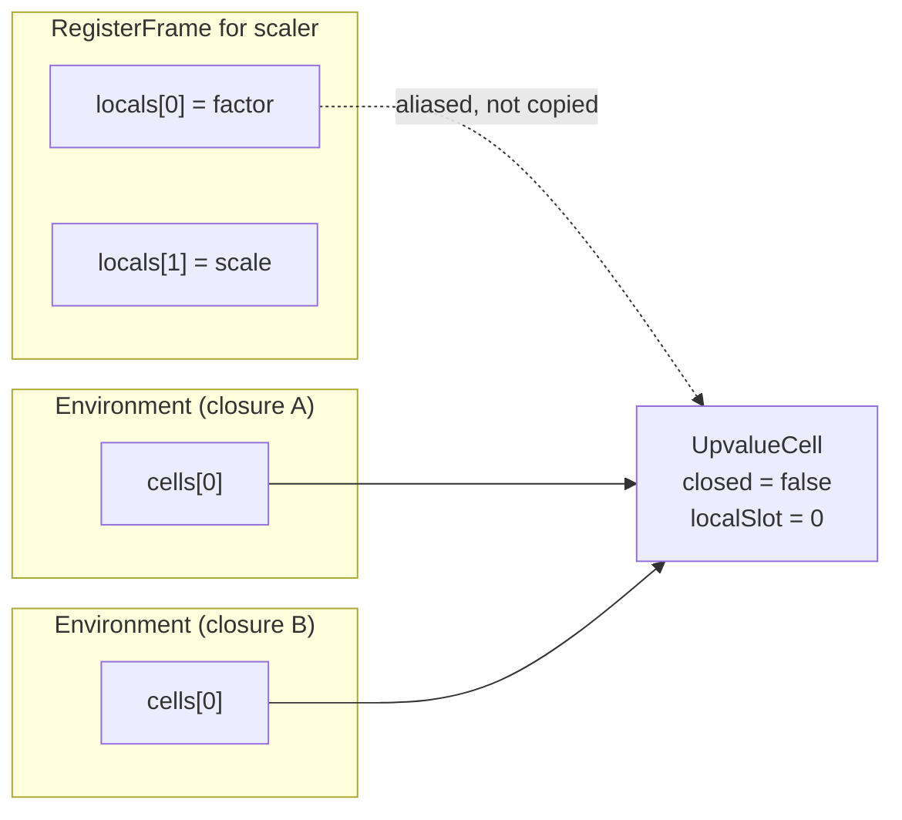

# 20. Scopes, closures, and classes in bytecode   ⟨I · B · J · N⟩

tera has no binding keywords. You do not write `let`, `const` or `var` — the lexer refuses
all three (`src/frontend/lexer/index.ts:35`) — and a variable comes into existence by being
assigned to. So `x = 1` is either the birth of a new local or a write to something that
already exists somewhere else, and nothing in the syntax says which. The bytecode compiler
has to decide before it emits a single instruction, because the two answers are different
opcodes and it only gets one pass. That decision is four analysis passes over the function
body, run in a fixed order, before code generation starts.

The other half of this chapter is the widest lowering in the compiler. A `class` looks like
one declaration. It becomes a constructor function that is often synthesised out of nothing,
two separate prototype links, one closure per method, a throwaway zero-argument function per
static field that is called immediately and discarded, and — for a class that says
`implements` — a run-time structural check. Four opcodes in the whole instruction set are
class-specific, and one of them is literally the ordinary property-store handler with a flag
turned off. Everything else about a class is rewriting.

Both halves meet in one object. What this chapter finishes is the
`RegisterCompiledFunction` that Part III owes Part IV.

**What arrived.** From [Ch 19 § the-verifier-that-does-not-exist]: a complete control-flow
shape, expressed only as absolute instruction indices in operand 0 of `Jump`, `JumpIfTrue`,
`JumpIfFalse` and `TryStart`. Loops, conditionals, `switch`, `try`/`catch`/`finally`,
`break`, `continue` and labelled statements have all been flattened into one numbered array
in which nothing says "loop", "block" or "handler". Two things rode along that [Ch 19]
emitted without explaining: the feedback slot in operand 1 of every conditional jump, which
is [Ch 33]'s subject, and `ROP_CLOSE_UPVALUES iterationScopeBase`, emitted at the continue
target of a `while`, `for`, `for-in` or `for-of` whose body contains a function.
[Ch 19 § body-may-capture] handed the semantics of that one instruction here, and
[§ close-upvalues](#close-upvalues) is where it is paid off.

A note on reading the listings, carried over from [Ch 19]: `disassemble` prints every
operand it has no special case for as `r` followed by the number
(`src/bytecode/register/ops/bytecode.ts:648-649`). So `DefineClassMember r1 [8] (label) r2`
is a target register, a constant index, and a *feedback slot*, not three registers. Operand
meaning comes from `register-effects.ts`, never from the printed text.

## No binding keywords

> **New idea. Binding, scope, scope chain.** A **binding** is the association between a name
> and a storage location. A **scope** is a region of the program in which a set of bindings
> is visible. Because scopes nest, a name is looked up by walking outward from the innermost
> scope to the outermost — that walk is the **scope chain**, and a language is *lexically
> scoped* when the chain is determined by where the code is written rather than by who
> called whom at run time. tera is lexically scoped, like almost every language you have
> used; the alternative, dynamic scope, would make `factor` in a returned inner function
> mean whatever the *caller* happened to call `factor`, which is why nobody does it.

A tera declaration is `name: type = value`, or bare `name = value` with the type inferred.
There is no keyword to key on. Grammatically, `total = 0` in a function body and `total = 0`
where `total` is a global are the same node: an `AssignmentExpression` whose target is an
`Identifier`. The compiler that has to turn one of them into a register write and the other
into a global-cell write is `compileAssignment`, and its first eight lines are the whole
problem:

```ts
  compileAssignment(node: CompilerNode) {
    const target = node.target;

    if (target.type === NodeType.Identifier) {
      if (this.scope.isConst(target.name)) {
        throw new Error(`Assignment to constant variable '${target.name}'`);
      }
      this.compileExpression(requireAssignmentValue(node));

      const resolved = this.scope.resolve(target.name);
      if (resolved !== null) {
        this.emitStoreAcc(resolved);
      } else {
        const nameIdx = this.globalNameIndex(target.name);
        this.func.emit(bytecode.ROP_STA_GLOBAL, nameIdx);
      }
```
— `src/bytecode/register/compiler/expressions.ts:445-460`

`this.scope.resolve(target.name)` answers with a slot or with `null`, and `null` means
`ROP_STA_GLOBAL`. That instruction is emitted into an array, and the array has already been
appended to. There is no second pass, no relocation table, no symbolic name that could be
resolved later — [Ch 19] established that this compiler emits forward and comes back only to
patch operand 0 of a jump. A `StaGlobal` cannot be turned into a `Star` after the fact.

So the answer has to be right the first time, which means the scope has to already contain
every local the body will introduce *before* the body is compiled. That is what
`_prepareFunctionBody` is for.
[t: tests/bytecode/register/compiler.test.ts > "emits LDA_GLOBAL for unresolved identifier"]
and [t: tests/bytecode/register/compiler.test.ts > "emits LDA_REG for local variable"] pin
the two outcomes of that one conditional.

## Four phases before any code

`_prepareFunctionBody` is six lines and its content is entirely the order:

```ts
  _prepareFunctionBody(this: ScopeCompiler, statements: ASTNode[]) {
    this._hoistVars(statements);
    this._prescanLocals(statements);
    this._declareImplicitLocals(statements);
    this._emitHoistedFunctionDeclarations(statements);
  },
```
— `src/bytecode/register/compiler/scope.ts:391-396`

Every one of the five function compilers calls it before compiling a body
(`functions.ts:787`, `854`, `909`, `1077`, and `index.ts:158` for `<script>`), and the
ordering is a design, not an accident.

> **New idea. Hoisting.** A declaration is **hoisted** when the binding it creates exists
> from the start of its enclosing region rather than from the point where the declaration is
> written. It is what makes a function callable above its own definition, and it is the
> reason a compiler that emits in one pass can resolve a name to a slot the source has not
> yet mentioned.

**Phase 1, `_hoistVars`** (299) and its worker `_hoistVarsFromNode` (305-362) is a
structural walk. It recurses into `BlockStatement`, both arms of an `if`, `while` and `for`
bodies, `for-in`/`for-of` bodies, a `try`'s block, its handler's body and its finalizer, and
every statement of every `switch` case, declaring each `var` it finds in the *function's*
slot table no matter how deep it sat. That is `var` semantics: function-scoped, visible
everywhere in the function.

**Phase 2, `_prescanLocals`** (186) and `_prescanStatement` (216-297) is an 82-line switch
that runs over the statement list at *one level only*. It does not recurse into blocks. It
declares `let` and `const` names, destructured names from array and object patterns,
`catch` parameters, and the loop binding of a `for`, `for-in` or `for-of`. It also declares
the synthetic locals the iteration lowerings need and cannot get any other way: three for
`for-in` — `_keys$`, `_i$`, `_len$` — and two for `for-of` — `_iter$`, `_iterResult$`.

The asymmetry between phases 1 and 2 is exactly the difference between the two binding
scopes. `var` is function-scoped, so its pre-pass recurses into every nested statement.
`let` is block-scoped, so its pre-pass deliberately does not — and blocks get their own,
narrower prescan when they are compiled:

```ts
  compileBlock(node) {
    this.scope = new Scope(this.scope);
    const body = blockBody(node.body);
    this._prescanBlockScopedLocals(body);
    this._emitHoistedFunctionDeclarations(body);
    this.compileStatements(body);
    if (this.scope.parent) this.scope = this.scope.parent;
  },
```
— `src/bytecode/register/compiler/statements.ts:477-484`

A fresh `Scope`, a second prescan restricted to `let` / `const` / destructuring / function
declarations (`_prescanBlockScopedLocals`, 192-214), and the parent restored on the way out.
[t: tests/bytecode/register/compiler.test.ts > "creates new scope for block statements"] and
[t: tests/bytecode/register/compiler.test.ts > "outer variable accessible in inner block"]
pin both halves of that.

**Phase 3, `_declareImplicitLocals`**, is the analysis this chapter is named for and gets
its own section below.

**Phase 4, `_emitHoistedFunctionDeclarations`** (364-378), is the only phase that *emits*.
It walks the statement list, marks each `FunctionDeclaration` and `LazyFunctionDeclaration`
with `_hoisted = true`, and compiles it there and then. That is why a call to a function
declared later in the same body resolves: the closure has already been built and stored into
its slot by the time any other statement runs. It has to come fourth, because compiling a
function declaration runs `Scope.resolve` against the enclosing scope, and phases 1-3 are
what make that scope complete.

## Assigned minus escaped

Phase 3 is nine lines:

```ts
  _declareImplicitLocals(this: ScopeCompiler, statements: ASTNode[]) {
    if (this.scope.isScript) return;
    const scan: ImplicitScan = { assigned: new Set(), escaped: new Set() };
    scanImplicitBindings(statements, scan);
    for (const name of scan.assigned) {
      if (this.scope.locals.has(name)) continue;
      if (this.scope.resolve(name)) continue;
      this._declareLocal(name, "var");
    }
  },
```
— `src/bytecode/register/compiler/scope.ts:380-389`

Collect two sets of names, subtract, and declare the difference as function-local `var`s —
but only for names that are neither already a local of this scope nor resolvable through the
scope chain. Those two `continue`s are what makes an outer binding always win: a bare `x = 1`
inside a function that already captures an `x` writes the captured one, and never shadows it.

The scan is a generic walk with two stopping conditions:

```ts
function scanImplicitBindings(value: RuntimeValue, scan: ImplicitScan): void {
  if (Array.isArray(value)) {
    for (const item of value) scanImplicitBindings(item, scan);
    return;
  }
  if (!value || typeof value !== "object") return;
  if (!isNode(value)) {
    for (const key of Object.keys(value)) {
      scanImplicitBindings((value as Record<string, RuntimeValue>)[key], scan);
    }
    return;
  }
  if (NESTED_SCOPE_TYPES.has(value.type)) return;
```
— `src/bytecode/register/compiler/scope.ts:75-87`

followed by the read side, seven lines that are the only place `escaped` is written:

```ts
  if (value.type === NodeType.Identifier) {
    const name = value.name;
    if (typeof name === "string" && !scan.assigned.has(name)) {
      scan.escaped.add(name);
    }
    return;
  }
```
— `src/bytecode/register/compiler/scope.ts:89-95`

and, fourteen lines later, the write side, which the next section reads in full. The walk
descends into arrays, into plain objects that are not AST nodes, and into every key of every
node. `NESTED_SCOPE_TYPES` (64-71) is the first stopping condition:
`FunctionDeclaration`, `LazyFunctionDeclaration`, `FunctionExpression`,
`ArrowFunctionExpression`, `ClassDeclaration` and `ModelDeclaration`. Reaching one of those
returns immediately, so an inner function's body is invisible to the enclosing function's
scan — which is correct, because an inner function's assignments are the inner function's
business, and its *reads* are handled by capture rather than by declaration.

A word on the name `escaped`, because the book fixes terminology by `docs/GLOSSARY.md`
(convention 18) and the glossary already spends that word: **escape analysis** there is the
optimizer's, at `src/optimizing/passes/escape-analysis.ts`, and it proves that an *object*
never outlives its function. `scan.escaped` is unrelated. It holds names that were *read*
somewhere in the body, and its job is to disqualify them from becoming new bindings. The
code's name wins (convention 4), but the two senses have nothing to do with each other.

## The one continue

The correctness of the whole analysis is one line in the middle of the walk:

```ts
  for (const key of Object.keys(value)) {
    if (key === "type") continue;
    if (writesIdentifier && key === "target") continue;
    scanImplicitBindings(value[key], scan);
  }

  if (writesIdentifier) {
    const name = (target as ASTNode).name as string;
    if (!scan.escaped.has(name)) scan.assigned.add(name);
  }
```
— `src/bytecode/register/compiler/scope.ts:104-113`

`writesIdentifier` is true when the node is an `AssignmentExpression` whose target is a bare
`Identifier`. When it is, line 106 skips the `target` key — the assignment's *left* side —
and recurses into everything else, including `value`, the right-hand side.

Walk two programs through it.

`x = 1` inside a function. `target` is skipped, so the left `x` never reaches the
`Identifier` case and never lands in `escaped`. The right side is a literal. Then line 112
asks whether `escaped` has `x`; it does not; `x` joins `assigned`. Phase 3 declares it, and
`x = 1` compiles to `Star`.

`x = x + 1` inside a function. The loop over keys runs *before* the write is recorded, so
the right-hand `x` is visited first. It reaches the `Identifier` case with `scan.assigned`
still empty, and lands in `escaped`. Only then does line 112 run — and `!scan.escaped.has(x)`
is false, so `x` is *not* added to `assigned`. Phase 3 never sees it. `Scope.resolve` answers
`null`, `compileAssignment` emits `ROP_STA_GLOBAL`, and the write goes to the global cell the
read was always going to come from.

That is the whole rule, and it is worth stating in general: **a name that is read before it
is written cannot be a new binding.** If it could, `x = x + 1` in a function would declare a
fresh local, read it as the sentinel `undefined`, add one, and store `NaN` — silently
shadowing a perfectly good global with garbage. The entire implementation of the rule is one
`continue` and one negated `has`.

The same asymmetry appears from the other side in the `Identifier` case at line 91:
`if (typeof name === "string" && !scan.assigned.has(name))`. A read that comes *after* a
write in the same body does not disqualify the binding, because by then the name is already
in `assigned`. Read-then-write goes global; write-then-read stays local. Source order
decides, and the walk visits in source order.

## Script scope is different *(Why the obvious design fails)*

The very first line of `_declareImplicitLocals` is `if (this.scope.isScript) return;`. At the
top level, none of this happens. `_prescanStatement`'s `VarDeclaration` case routes to
`_addHoistedVar` when `this.scope.isScript` (229-234) rather than allocating a slot, and
`compileLetDeclaration` short-circuits:

```ts
  compileLetDeclaration(node) {
    const name = requiredName(node, "declaration");
    const isScriptVar = this.scope.isInScriptScope() && node.type === NodeType.VarDeclaration;

    if (isScriptVar) {
      if (node.init === null || node.init === undefined) return;
      this.compileExpression(expressionNode(node.init, "var initializer"));
      const nameIdx = this.globalNameIndex(name);
      this.func.emit(bytecode.ROP_STA_GLOBAL, nameIdx);
      return;
    }
```
— `src/bytecode/register/compiler/statements.ts:283-293`

So at the top level *every* bare assignment is a global-cell write, and you can see it in the
spine. `latency = Series(...)` and `throughput = Series(...)` in `stats.tera` compile to
`StaGlobal [9] (latency)` at instruction 29 and `StaGlobal [15] (throughput)` further down —
never to a `Star`, even though `<script>` has nineteen registers available and nothing else
is using them. [t: tests/bytecode/register/compiler.test.ts > "script-scope var uses global
cells not locals"] pins it.

The obvious alternative is to make script-scope bindings registers too. Reading one would be
an array index rather than a map lookup, and `<script>` is a function like any other, so the
machinery already exists. It fails on three things the engine actually does.

The REPL evaluates each entered line as a *fresh* `<script>`. A binding held in that script's
register file would evaporate when the line finished, so `x = 1` followed by `print(x)` on the
next line would print nothing. Modules share one global-cell namespace, which is how a
`declaration graph` and an `execution graph` stay separable ([Ch 15 § two-edge-sets]) —
a module's top-level name has to be addressable by another module's code, and a register in a frame that
has already returned is not addressable by anybody. And `--expose-gc` and the debugger both
address top-level names by string, which a register file cannot answer.

The run-time half of the carve-out is not bytecode at all. `hoistedVarNames` is a plain
string list on the compiled function, and the interpreter walks it before instruction 0:

```ts
    if (compiledFn.hoistedVarNames) {
      for (const name of compiledFn.hoistedVarNames) {
        if (!this.globalCells.has(name)) {
          this.globalCells.write(name, mkUndefined());
        }
      }
    }
```
— `src/bytecode/register/interpreter/index.ts:927-933`

Empty cells, pre-created, so a `LdaGlobal` for a name whose declaration has not run yet finds
`undefined` rather than a missing-cell error. That is hoisting implemented as a list plus a
loop, with no instruction to represent it.

## Resolve and the boundary

`Scope.resolve` is twenty-one lines of a 113-line class (`helpers.ts:159-271`), and it is
the only place in the compiler where a closure is created:

```ts
  resolve(name: string): ScopeResolution | null {
    if (this.locals.has(name)) {
      const binding = this.bindings.get(name);
      return {
        type: "local",
        slot: this.locals.get(name)!,
        kind: binding?.kind || "let",
        scope: this,
      };
    }
    if (this.parent) {
      const result = this.parent.resolve(name);
      if (result && this.isFunctionBoundary) {
        if (result.type === "local" || result.type === "upvalue") {
          return this.captureUpvalue(name, result);
        }
      }
      return result;
    }
    return null;
```
— `src/bytecode/register/compiler/helpers.ts:194-213`; the method's closing brace is line 214

Three moves. Own locals answer `{type: "local", slot}`. Otherwise ask the parent. And then
the one conditional that makes closures exist: if the parent answered *and this scope is a
function boundary*, convert the answer into an upvalue.

> **New idea. Capture and upvalue.** When an inner function mentions a name belonging to an
> enclosing function, it **captures** it. The captured variable cannot simply be read out of
> the enclosing function's register file, because the inner function may run after that
> function has returned and its registers are gone. So the compiler gives the inner function
> its own numbered list of captured variables — an **upvalue** list — and the inner function
> refers to them by index rather than by name. `LdaUpvalue 0` means "the first thing I
> captured", and what that index points at is decided when the closure is built, not when it
> runs.

`isFunctionBoundary` is set at exactly five sites in `functions.ts` and nowhere else in the
tree: `776` (function declaration), `838` (function expression), `895` (arrow function),
`1069` (class method) and `1125` (static-field initializer). That is the whole list. A
`Scope` created by `compileBlock` or by `compileForStatement` leaves the flag `false`, so it
is *transparent* to capture — a name resolved through a block scope comes back as a plain
`local` and is read with `Ldar`. Only crossing into a function turns a resolution into an
upvalue. All three behaviours are pinned:
[t: tests/bytecode/register/compiler/helpers.test.ts > "captures local from outer scope as
upvalue when crossing function boundary"],
[t: tests/bytecode/register/compiler/helpers.test.ts > "does NOT capture as upvalue when no
function boundary"], and — for the plain walk —
[t: tests/bytecode/register/compiler/helpers.test.ts > "resolves through parent scope chain"].

`captureUpvalue` (216-232) is bookkeeping: consult `upvalueMap`, and if the name is already
captured return the existing index; otherwise push
`{name, outerType, outerSlot, kind}` onto `this.upvalues`, record the index, and return
`{type: "upvalue", slot: idx}`.
[t: tests/bytecode/register/compiler/helpers.test.ts > "reuses same upvalue slot for repeated
captures of same variable"] pins the dedupe.

The recursion is what makes deep nesting work, and it is easy to miss. `this.parent.resolve`
is a *full* resolve, so a middle function that is itself a boundary captures on the way past.
The answer that comes back to the innermost function can therefore already be
`{type: "upvalue"}` — which is why the descriptor records `outerType`. `"local"` means "slot
N of the frame that is building me"; `"upvalue"` means "cell N of the *closure* that is
building me". Two different sources, one field to tell them apart.

## Four lines of codegen

Almost none of this reaches the instruction stream. The entire translation from a
`ScopeResolution` to an opcode is two four-line functions:

```ts
  emitLoadToAcc(resolved: ScopeResolution) {
    if (resolved.type === "local") {
      this.func.emit(bytecode.ROP_LDA_REG, resolved.slot);
    } else if (resolved.type === "upvalue") {
      this.func.emit(bytecode.ROP_LDA_UPVALUE, resolved.slot);
    }
  },

  emitStoreAcc(resolved: ScopeResolution) {
    if (resolved.type === "local") {
      this.func.emit(bytecode.ROP_STAR, resolved.slot);
    } else if (resolved.type === "upvalue") {
      this.func.emit(bytecode.ROP_STA_UPVALUE, resolved.slot);
    }
  },
```
— `src/bytecode/register/compiler/expressions.ts:315-329`

`Ldar` / `Star` for a local, `LdaUpvalue` / `StaUpvalue` for a capture, and nothing else. The
scope chain, the boundaries, the recursion — all of it collapses into one bit of information
carried in the choice of opcode and one small integer.

There is one more decision, and it is the same one line in five places. Every function
compiler ends by copying its inner scope's upvalue list onto the compiled function and then
branching on whether that list is empty:

```ts
    innerFunc.upvalues = innerScope.upvalues;
    ...
    const constIdx = outerFunc.addConstant(innerFunc);

    if (innerFunc.upvalues.length > 0) {
      outerFunc.emit(bytecode.ROP_MAKE_CLOSURE, constIdx);
    } else {
      outerFunc.emit(bytecode.ROP_LDA_CONST, constIdx);
    }
```
— `src/bytecode/register/compiler/functions.ts:800-813`

and again at `872-876` (function expression), `928-932` (arrow), `1100` (method, written as a
ternary) and `1136` (static-field initializer).

The consequence is worth stating plainly: **a function with no captures is a constant.** It
goes into the constant pool once and every evaluation of the declaration loads the same
object. A function *with* captures is built at run time, once per evaluation, because its
cell vector depends on which frame is executing.

You can see both in the tree. `report` in `stats.tera` captures nothing, so
`<script>` instruction 0 is `LdaConst [0] (<function report>)`. And `scaler` in
`stats-closure.tera` — four instructions, all of them — is the other case:

```
=== scaler (params=1, locals=2, registers=2, constants=1) ===
Constants:
  [0] <function scale>
Locals: r0=factor, r1=scale
Instructions:
     0  MakeClosure r0
     1  Star r1
     2  Ldar r1
     3  Return
```
— `node dist/cli.js --print-bytecode --filter scaler docs/example/stats-closure.tera`

`scale` reads `factor`, `factor` is `scaler`'s parameter in `r0`, and `scale`'s own scope is
a function boundary — so `Scope.resolve("factor")` crossed one boundary once, pushed one
descriptor, and the emitter chose `MakeClosure` over `LdaConst`. That single opcode is the
entire visible consequence. The two halves are pinned separately:
[t: tests/bytecode/register/compiler.test.ts > "compiles function declaration without
upvalues as LDA_CONST"] and
[t: tests/bytecode/register/compiler.test.ts > "compiles function declaration with upvalue as
MAKE_CLOSURE"].

One neighbouring detail lives in the same place. A *named* function expression gets a slot
for its own name inside its own scope (`functions.ts:846-850`), recorded as
`innerFunc.selfBindingSlot`, so `fn f() ... f()` inside the expression refers to itself
rather than to whatever the enclosing scope calls `f`
[t: tests/bytecode/register/compiler.test.ts > "compiles named function expression"].

## Open cells alias the frame

The run-time half is the smallest file in the chapter. Fifty-seven lines, two classes, and
the whole closure model is three branches on one boolean. `UpvalueCell` (8-41) carries four
fields — `frame`, `localSlot`, `closed`, `closedValue` — and three methods:

```ts
  get(): RegisterValue | null {
    if (this.closed) return this.closedValue;
    return this.frame!.locals[this.localSlot];
  }

  set(value: TaggedValue): void {
    if (this.closed) {
      this.closedValue = value;
    } else {
      this.frame!.locals[this.localSlot] = value;
    }
  }

  close(): void {
    if (!this.closed) {
      this.closedValue = this.frame!.locals[this.localSlot];
      this.closed = true;
      this.frame = null;
    }
  }
```
— `src/runtime/intrinsics/environment.ts:21-40`

A cell is **open** or **closed**. Open means `get` and `set` index straight into
`frame.locals[slot]` — the frame's own register array, aliased, not copied. The closure and
the still-running function are looking at one variable, and a write through either is visible
to the other
[t: tests/runtime/intrinsics/environment.test.ts > "writes to frame locals when open"].
Closed means `close()` copied the current value into `closedValue` and set `frame = null`, so
the cell owns the value and the frame can be collected
[t: tests/runtime/intrinsics/environment.test.ts > "close captures current value and detaches
from frame"].

`Environment` (43-57) is a `UpvalueCell[]` with `getUpvalue` / `setUpvalue` doing nothing but
indexing. `ROP_LDA_UPVALUE 0` is `frame.closureEnv.getUpvalue(0)`.

Cells are created by the frame that owns the slot, and there is exactly one per slot:

```ts
  getOrCreateUpvalueCell(localSlot: number): UpvalueCell {
    if (!this.openUpvalues) {
      this.openUpvalues = new Map();
    }
    this.hasUpvalues = true;
    if (this.openUpvalues.has(localSlot)) {
      return this.openUpvalues.get(localSlot)!;
    }
    const cell = new UpvalueCell(this, localSlot);
    this.openUpvalues.set(localSlot, cell);
    return cell;
  }
```
— `src/bytecode/register/interpreter/frame.ts:111-122`

Line 115 does more than it looks. `hasUpvalues` is one of two booleans that gate
`RegisterFrame.directRegisters` (82-85), which answers the raw register array only when
`!this.hasUpvalues && !this.hasTDZ`. Once any cell is created, that getter answers `null` for
the rest of the frame's life, and every register access goes through the `getReg`/`setReg`
redirect instead — [Ch 21 § directregisters-the-invariant-the-compiled-tiers-rely-on] is
where that has consequences. One closure, one frame, permanently off `directRegisters`.

And `ROP_MAKE_CLOSURE` is where the descriptor list becomes a cell vector:

```ts
            case bytecode.ROP_MAKE_CLOSURE: {
              const constIdx = operands[0];
              const innerFunc = constantCompiledFunction(compiledFn, constIdx, "MakeClosure");
              const cells = [];
              for (let i = 0; i < innerFunc.upvalues.length; i++) {
                const upval = innerFunc.upvalues[i];
                ...
                if (upval.outerType === "local") {
                  cells.push(frame.getOrCreateUpvalueCell(upval.outerSlot));
                } else if (upval.outerType === "upvalue") {
                  ...
                  const cell = frame.closureEnv.cells[upval.outerSlot];
                  ...
                  cells.push(cell);
                }
              }
              const env = new Environment(cells);
              const closure = new JSFunction(innerFunc, innerFunc.name ?? undefined, env);
              frame.acc = mkFunction(closure);
```
— `src/bytecode/register/interpreter/index.ts:2117-2145`, four throw statements elided

`"local"` asks the *current* frame for a cell; `"upvalue"` copies a cell **pointer** out of
`frame.closureEnv.cells`. Copying the pointer rather than the value is what keeps sibling
closures in step: two inner functions over the same outer variable get the same
`UpvalueCell` object, so a write through one is a read through the other
[t: tests/runtime/intrinsics/environment.test.ts > "two cells sharing same frame slot see each
other's writes when open"].



> **Unenforced.** `UpvalueDescriptor`
> (`src/bytecode/register/ops/bytecode.ts:182-188`) declares all five of its fields optional
> — `name?`, `index?`, `isLocal?`, `outerType?`, `outerSlot?` — while `captureUpvalue`
> (`helpers.ts:216-232`) always writes exactly four of them and never `index` or `isLocal`.
> Nothing checks the shape at construction. The interpreter re-validates it at *every*
> `ROP_MAKE_CLOSURE` instead, throwing `VMReferenceError` four different ways
> (`index.ts:2124, 2127, 2133, 2137`) for states the compiler cannot produce. Two dead
> fields and four run-time checks are the price of a type that permits a state the producer
> never builds. Cost of enforcing: make the four written fields required and delete the two
> others; the throws then become unreachable and can go too.

## Close upvalues {#close-upvalues}

Now [Ch 19]'s deferred instruction. `ROP_CLOSE_UPVALUES` in the interpreter is two lines —
`if (frame.hasUpvalues) frame.closeUpvaluesFrom(operands[0]);`
(`index.ts:1770-1773`) — and the work is on the frame:

```ts
  closeUpvaluesFrom(baseSlot: number): void {
    if (!this.openUpvalues) return;
    for (const [slot, cell] of this.openUpvalues) {
      if (slot >= baseSlot) {
        cell.close();
        this.openUpvalues.delete(slot);
      }
    }
    if (this.openUpvalues.size === 0) this.hasUpvalues = false;
  }
```
— `src/bytecode/register/interpreter/frame.ts:131-140`

Close **and delete** every open cell at or above `baseSlot`. The deletion is the point:
`getOrCreateUpvalueCell` will make a *fresh* cell the next time that slot is captured,
because the map no longer has one.

Where `baseSlot` comes from is [Ch 19]'s `iterationScopeBase`, read from
`this.func.registerCount` *before* the loop body is compiled (`statements.ts:386` for `while`,
`410` for `for`). Every register the body allocates is therefore at or above it, and one
number names the whole per-iteration slot set.

`docs/example/` has no program that creates a closure inside a loop, so this is the one place
in the chapter that needs a scratch file. Save these sixteen lines outside the repository —
with an editor, not a shell heredoc, which eats backslashes:

```
fn make() -> int[]:
  fns = []
  i = 0
  while i < 3:
    n: int = i
    fn answer() -> int:
      return n
    fns.push(answer)
    i += 1
  return fns

made = make()
k = 0
while k < 3:
  print(made[k]())
  k += 1
```

It prints `0`, `1`, `2` on three lines. `make` disassembles to:

```
Locals: r0=fns, r1=i, , , r4=n, r5=answer
    10  JumpIfFalse r30 r1
    11  MakeClosure r2
    12  Star r5
    13  Ldar r1
    14  Star r4
    ...
    28  CloseUpvalues r2
    29  Jump r4
    30  Ldar r0
```
— `node dist/cli.js --print-bytecode --filter make closure-loop.tera`, constant pool and
instructions 0-9, 15-27 and 31 elided

Read it instruction by instruction. `iterationScopeBase` was `2`, because `fns` and `i` were
the only locals when the `while` began — that is the `r2` in `CloseUpvalues r2`, an operand
that is a slot index, not a register operand in the ordinary sense. `MakeClosure` at 11 runs
*before* `n` is written, and asks the frame for a cell aliasing `r4`, which sets
`hasUpvalues`. `Star r4` at 14 is then no longer a plain array store: `setReg` sees
`openUpvalues.has(4)` and writes through the cell instead. So the closure created at 11
observes the value stored at 14 — one variable, seen two ways. Then `CloseUpvalues r2` at 28
finds slot 4 ≥ 2, snapshots the current value into `closedValue`, nulls the frame pointer and
removes the entry. The next iteration's `MakeClosure` finds nothing for slot 4 and builds a
fresh cell. Three iterations, three cells, three answers.

Now take the same body and write the loop the other way — `do:` … `while (i < 3)`, with
nothing else changed. It prints `2`, `2`, `2`.

> **Broken.** `compileDoWhileStatement`
> (`src/bytecode/register/compiler/statements.ts:642-652`) never calls `_bodyMayCapture` and
> never emits `ROP_CLOSE_UPVALUES`. It does not even read an `iterationScopeBase`, so it has
> nothing to pass one. Every closure created in a `do:` / `while (…)` body therefore shares
> one `UpvalueCell` per slot with every other iteration, and they all see the last value
> written. Measured on this tree, 2026-09-08: the `while` form above prints `0 1 2` on three
> lines and the byte-identical `do` form prints `2 2 2`;
> `node dist/cli.js --print-bytecode --filter make` on the `do` form finds zero
> `CloseUpvalues`. `while`, `for`, `for-in` and `for-of` are all correct. Cost of fixing:
> four lines copied verbatim from `compileWhileStatement` (386, 396-399) — read
> `this.func.registerCount` before the body, call `_bodyMayCapture`, emit the instruction at
> `continueTarget`. There is no test anywhere in the tree covering a closure created in a
> `do-while` body;
> [t: tests/bytecode/register/compiler.test.ts > "emits body before condition check"] is the
> only `do-while` test and it asserts on jump structure only. [unpinned]

Two loop shapes, one body, two answers — which is the cleanest available proof of what the
instruction does, and it produces a rule: **a loop body is a scope only if something
explicitly ends it.** Nothing about the register allocation, the AST, or the block structure
makes an iteration a fresh scope. One instruction does, and a shape that forgets to emit it
is not malformed — it is a correct program with different semantics.

> **Unfinished.** `compileForInStatement` (`functions.ts:1313-1316`) and
> `compileForOfStatement` (`1396-1399`) close upvalues over **`varSlot` only** — the loop
> variable — where `compileWhileStatement` and `compileForStatement` close everything at or
> above `iterationScopeBase`. A binding declared *inside* a `for-of` body and captured by a
> closure is therefore not closed per iteration, and behaves like the `do-while` case. Both
> also skip the instruction entirely when `node.kind === "var"`, which is correct for `var`
> semantics and undetectable from the bytecode afterwards. Cost of fixing: the same four
> lines as above, replacing `varSlot` with a base read before the body. [unpinned]

## TDZ is a value, not a flag

`Ldar` on a slot whose declaration has not run yet has to answer something. `setLocalBindingKind`
decides which slots that question applies to:

```ts
  setLocalBindingKind(slot: number, kind: LocalBindingKind): void {
    this.localBindingKinds[slot] = kind;
    if (kind === "let" || kind === "const" || kind === "class") {
      this.uninitializedLocalSlots.add(slot);
    }
  }
```
— `src/bytecode/register/ops/bytecode.ts:554-559`

> **New idea. The temporal dead zone.** A hoisted binding exists from the top of its scope,
> but a `let`-style binding is not supposed to be *readable* until its declaration has
> actually run. The window between the two is the **temporal dead zone**, and reading a name
> inside it is an error rather than an `undefined`. It is the difference between "this name
> does not exist yet" and "this name exists and holds nothing", and the second is what makes
> a typo produce `NaN` three functions later instead of an exception at the point of the bug.

The frame constructor implements it by filling those registers with a singleton object rather
than with the tagged `undefined` everything else gets:

```ts
    this.registers = new Array<RegisterValue>(regCount).fill(CODE_UNDEFINED);
    this.hasTDZ = compiledFn.uninitializedLocalSlots?.size > 0;
    if (this.hasTDZ) {
      for (const slot of compiledFn.uninitializedLocalSlots) {
        this.registers[slot] = TDZ_UNINITIALIZED;
      }
    }
```
— `src/bytecode/register/interpreter/frame.ts:62-68`

`TDZ_UNINITIALIZED` is `{ kind: "tdz-uninitialized" }`, one object, module-level (`frame.ts:16`).
A sentinel rather than a per-slot flag, and the choice buys two things. The check rides along
on a read that had to happen anyway — `getReg` was already fetching `registers[idx]`, and
comparing it against one object is the whole test. And `hasTDZ`, computed once at
construction, lets a function with no lexical declarations skip the comparison entirely; it
is the second of the two booleans gating `directRegisters`.

The cost is the interesting half. Because the sentinel is an object and every other register
value is a number, `RegisterValue` is declared as `TaggedValue | TDZUninitialized`
(`frame.ts:8`) — and *every* consumer of a register has to be able to see a value that is not
a tagged value. `getReg` handles it (87-101), `UpvalueCell.get` propagates it, and anything
that reaches into `frame.registers` directly does not.
[t: tests/bytecode/register/interpreter/frame.test.ts > "marks uninitializedLocalSlots with
TDZ sentinel"] and
[t: tests/bytecode/register/interpreter/frame.test.ts > "getReg throws on TDZ-uninitialized
slot"] pin the mechanism from both ends.

> **Unenforced.** Nothing checks that a slot in `uninitializedLocalSlots` is written before it
> is read on every path — that is exactly what the sentinel exists to discover at run time.
> The consequence worth naming is downstream: the sentinel is not a `TaggedValue`, so any
> tier that reads registers without going through `RegisterFrame.getReg` sees an object of a
> type it has no case for. `getReg` and `UpvalueCell.get` handle it;
> [Ch 37 § two-readers-one-contract] shows the OSR argument reader taking registers straight out of
> the array.

> **Never runs.** `LocalBindingKind` includes `"class"`
> (`src/bytecode/register/ops/bytecode.ts:166`) and `setLocalBindingKind` gives it the same
> TDZ registration as `let` and `const`. Both `_declareLocal` signatures declare the kind
> (`functions.ts:645`, `statements.ts:161`) — but no call site anywhere in `src/` passes
> `"class"`. A class binding at function scope is created by `addLocal` + `scope.define`
> directly (`functions.ts:977-982`), which records the kind `"temp"` and never enters
> `uninitializedLocalSlots`. So a class name has no temporal dead zone, and the branch that
> would give it one is unreachable. Cost of removing: three lines. Cost of *using* it: one
> call site, plus a decision about whether the synthesised `_superClass$<Name>` slots should
> be in the TDZ too.

## A class is a desugaring

> **New idea. Desugaring.** A source construct that has no instruction of its own, and is
> instead rewritten into constructs that do. The reader writes one thing; the compiler emits
> several, all of which the language could already express. Nothing new reaches the machine —
> which is why a desugared feature costs nothing downstream, and why a bug in the rewriting is
> invisible in the instruction set.

Four opcodes in the entire ninety-opcode set are class-specific: `ROP_SET_PROTO` (0x85),
`ROP_DEFINE_ACCESSOR` (0x86), `ROP_DEFINE_CLASS_MEMBER` (0x0b) and
`ROP_ASSERT_CLASS_CONTRACTS` (0x91). And one of those four is not really class-specific at
all:

```ts
            case bytecode.ROP_DEFINE_CLASS_MEMBER: {
              handleStaProp(this, frame, operands, compiledFn, funcName, false);
              break;
            }
```
— `src/bytecode/register/interpreter/index.ts:1470-1473`

`handleStaProp` is the ordinary property-store handler, the one `ROP_STA_PROP` uses three
cases earlier. The only difference is the trailing `false`, which is
`handleStaProp`'s `enforceAccess` parameter (`handlers.ts:297`): defining a class member
skips the visibility check that a user-written property store performs. Same opcode body,
same feedback slot, same inline cache — one flag apart.

> **New idea. Prototype.** A **prototype** is a link from one object to another object,
> followed when a property is not found on the first. It is not a type and it is not a class:
> it is a pointer, and it can be changed. A method call on an instance finds the function by
> walking that link. [Ch 23 § hidden-classes-what-an-object-is] shows what a prototype is
> *made of* here — the hidden class's identity includes it, which is why changing one is
> not free.

Everything else about a class is rewriting, and it lives in `compileClassDeclaration`
(`functions.ts:968-1152`) — 185 lines, the second-longest method in the bytecode compiler
after `compileCallExpression`'s 249, and the one that turns a single AST node into the
widest set of opcodes.

## The constructor comes first

The order inside those 185 lines cannot be permuted, and it is worth reading as six steps.

**A superclass gets a local slot of its own.** When `node.superClass` is set:

```ts
      superClassReg = this.func.addLocal(superClassBinding(node.name));
      (this.func.classBindingSlots ??= []).push(superClassReg);
      this.temps.freeTemps = this.temps.freeTemps.filter(
        (r: number) => r !== superClassReg,
      );
      this.scope.define(superClassBinding(node.name), superClassReg);
```
— `src/bytecode/register/compiler/functions.ts:977-982`

`superClassBinding("Derived")` is `"_superClass$Derived"` (`src/core/class-member.ts:22-26`)
— a name no tera source can spell. The slot is pushed onto `func.classBindingSlots` and then
removed from the temp allocator's free list *by hand*, so nothing can reuse it for a
scratch value later in the class body. This is the binding `compileSuperCall`
(`functions.ts:1154-1236`, the resolve at `:1162`) and `super.m()`
(`emitLoadSuperPrototypeProperty`, `expressions.ts:129-140`) resolve against; the class value
is then loaded and `Star`ed into it. [Ch 39] shows the SSA builder reading
`classBindingSlots` back out (`src/optimizing/builder/ir-builder.ts:328`) to recover what the
name meant.

**The constructor node is synthesised if the source has none.** `node.constructor` is used
when present; otherwise one of three factories runs — `forwardingConstructorOf` (237),
`gatheringForwarderOf` (268), `emptyConstructorOf` (299-306). Then `injectInstanceFields`
(503) prepends the class's instance-field initializers to whatever body resulted, a dozen
`_class*` annotations are hung on the node (1004-1015), and it is handed to
`compileFunctionDeclaration` like any other function (1017). That is the load-bearing
sentence of this section: **the class *is* that function.** There is no class object, no
separate class opcode, no third kind of callable. `Series` in `stats.tera` is a
`RegisterCompiledFunction` named `Series`, stored in a global cell named `Series`, and
`Series("latency", [...])` is an ordinary call
[t: tests/e2e/language/classes.test.ts > "constructs instances without new"].

**The class value is read back.** `loadClassValue()` (1019-1026) resolves the class name — a
register if it resolves, a global cell otherwise — and `LdaProp "prototype"` gets the
prototype object. Both go into temps:

```
     2  LdaConst [2] (<function Series>)
     3  StaGlobal [3] (Series)
     4  LdaGlobal [3] (Series)
     5  Star r0
     6  LdaNamedProperty r0 [4] (prototype) r0
     7  Star r1
     8  LdaConst [5] (<function mean>)
     9  DefineClassMember r1 [6] (mean) r1
    10  LdaConst [7] (<function label>)
    11  DefineClassMember r1 [8] (label) r2
```
— `node dist/cli.js --print-bytecode --filter '<script>' docs/example/stats.tera`, showing
instructions 2-11 of 65; the twenty-one-entry constant pool and the rest of the stream elided

Ten instructions for the whole of `class Series`. Instruction 2 loads the constructor
function — a constant, because the constructor captures nothing — and stores it under the
class's name. Instructions 4-7 read it back and park the class in `r0` and its prototype in
`r1`. Instructions 8-11 attach the two methods. `LdaConst` for each method, because neither
captures; `r1` as the target, because neither is `static`; and the trailing operand is a
feedback slot, not a register.

The ordering is forced. The prototype cannot be read before the constructor function exists,
methods cannot be attached before the prototype is in a register, and — because the
constructor's compilation runs `_prepareFunctionBody` and thus `Scope.resolve` — the
superclass binding has to be defined before the constructor is compiled, not after.

## Set proto twice

Inheritance is two links, not one:

```ts
    if (node.superClass) {
      this.func.emit(bytecode.ROP_LDA_REG, superClassReg);
      const superCtorReg = this.temps.alloc();
      this.func.emit(bytecode.ROP_STAR, superCtorReg);
      this.func.emit(bytecode.ROP_LDA_PROP, superCtorReg, prototypeNameIdx, this.func.allocFeedbackSlot());
      const superProtoReg = this.temps.alloc();
      this.func.emit(bytecode.ROP_STAR, superProtoReg);
      this.func.emit(bytecode.ROP_SET_PROTO, prototypeReg, superProtoReg);
      this.func.emit(bytecode.ROP_SET_PROTO, classReg, superCtorReg);
      this.temps.free(superProtoReg);
      this.temps.free(superCtorReg);
    }
```
— `src/bytecode/register/compiler/functions.ts:1036-1047`

The first `SET_PROTO` links `Derived.prototype` to `Base.prototype`, which is how an instance
of `Derived` finds a method defined on `Base`
[t: tests/e2e/language/classes.test.ts > "supports inheritance, super calls, and method
override"]. The second links `Derived` itself to `Base` — the *constructor* chain — which is
how a static member declared on `Base` is reachable as `Derived.thing`
[t: tests/e2e/language/classes.test.ts > "inherits static members through the constructor
chain"]. Two entirely different lookups, and forgetting either one produces a program that
mostly works.

One opcode implements both, and it picks which by looking at the tags of its operands:

```ts
            case bytecode.ROP_SET_PROTO: {
              const objReg = operands[0];
              const protoReg = operands[1];
              const obj = frame.getReg(objReg);
              const proto = frame.getReg(protoReg);
              if (isObject(obj) && isObject(proto)) {
                getPayload(obj).setPrototype(getPayload(proto));
              } else if (isFunction(obj) && isFunction(proto)) {
                setFunctionStaticBase(obj, proto);
              }
              break;
            }
```
— `src/bytecode/register/interpreter/index.ts:1986-1997`

Object/object calls `setPrototype`, which mutates a hidden class ([Ch 23]). Function/function
calls `setFunctionStaticBase`, an unrelated mechanism on the function payload. And there is a
silent third arm: if neither pair matches — a function and an object, say — the instruction
does nothing at all. No throw, no diagnostic, no trace line. The compiler only ever emits the
two matching shapes, so this is not reachable from tera source today; it is another instance
of the pattern [Ch 19] named, where a well-formed instruction with a state the producer never
builds simply has no effect.

## Methods, accessors, and static fields

The method loop (1049-1113) is the five-site closure story again, applied per member. Each
method gets a fresh `Scope` with `isFunctionBoundary = true` (1068-1069), so a method may
capture from the enclosing scope, and the emitter runs the same one-line test:

```ts
      outerFunc.emit(methodFunc.upvalues.length > 0 ? bytecode.ROP_MAKE_CLOSURE : bytecode.ROP_LDA_CONST, constIdx);
```
— `src/bytecode/register/compiler/functions.ts:1100`

Then the attachment splits three ways. `targetReg` is `classReg` for a `static` member and
`prototypeReg` otherwise — that one ternary at 1051 is the whole of "static members live on
the class, instance members on the prototype"
[t: tests/e2e/language/classes.test.ts > "keeps static members off instances and instance
members off the class"]. And getters and setters take a different opcode:

```ts
      if (method.kind === "get" || method.kind === "set") {
        const fnReg = this.temps.alloc();
        outerFunc.emit(bytecode.ROP_STAR, fnReg);
        const getterReg = method.kind === "get" ? fnReg : -1;
        const setterReg = method.kind === "set" ? fnReg : -1;
        outerFunc.emit(bytecode.ROP_DEFINE_ACCESSOR, targetReg, methodNameIdx, getterReg, setterReg);
        this.temps.free(fnReg);
      } else {
        outerFunc.emit(bytecode.ROP_DEFINE_CLASS_MEMBER, targetReg, methodNameIdx, outerFunc.allocFeedbackSlot());
      }
```
— `src/bytecode/register/compiler/functions.ts:1103-1112`

`-1` for the half that is absent. A getter and a setter of the same name are two separate
instructions, each supplying one side and passing `-1` for the other, which the handler reads
as "leave this half alone"
[t: tests/e2e/language/classes.test.ts > "supports static getters and setters on the class"].

Then the strangest lowering in the file. A **static field initializer becomes a
zero-argument function**:

```ts
      const initializerFunc = new bytecode.RegisterCompiledFunction(`${node.name}.${field.name}$init`, 0);
      ...
      this.compileExpression(fieldInitializer(field));
      initializerFunc.emit(bytecode.ROP_RETURN);
      initializerFunc.upvalues = this.scope.upvalues;
      ...
      const initIdx = this.func.addConstant(initializerFunc);
      this.func.emit(initializerFunc.upvalues.length > 0 ? bytecode.ROP_MAKE_CLOSURE : bytecode.ROP_LDA_CONST, initIdx);
      const initReg = this.temps.alloc();
      this.func.emit(bytecode.ROP_STAR, initReg);
      this.func.emit(bytecode.ROP_CALL, initReg, 0, 0, this.func.allocFeedbackSlot());
      this.temps.free(initReg);
      const fieldNameIdx = this.func.addConstant(field.name);
      this.func.emit(bytecode.ROP_DEFINE_CLASS_MEMBER, classReg, fieldNameIdx, this.func.allocFeedbackSlot());
```
— `src/bytecode/register/compiler/functions.ts:1121-1142`, declarations and save/restore elided

A `RegisterCompiledFunction` named `Class.field$init` goes into the constant pool, is loaded,
parked in a temp, `CALL`ed with zero arguments, and the result is stored with
`DEFINE_CLASS_MEMBER`. The function exists for one call and is then reachable only from the
constant pool.

The reason is that the initializer expression needs its own scope. It may reference the class
being defined, it may be a private call that only the class body is allowed to make
[t: tests/e2e/language/classes.test.ts > "runs private constructor calls from static field
initializers"], and it must not leak temporaries into the enclosing `<script>`. The compiler
has exactly one mechanism for "an expression with its own scope, evaluated once", and that
mechanism is a function. So it builds one.

Last in the sequence, a class that declares `implements` gets a run-time check:

```ts
    if (contracts.length) {
      const contractsIdx = this.func.addConstant(contracts);
      this.func.emit(bytecode.ROP_ASSERT_CLASS_CONTRACTS, classReg, contractsIdx);
    }
```
— `src/bytecode/register/compiler/functions.ts:1145-1148`

The constant is an array of `RuntimeInterfaceContract` objects, and the interpreter
(2004-2014) hands the class payload and the contracts to `assertClassImplementsRuntime`. It
is a *structural* check — it asks whether the members are there, not whether the class named
the interface — which is [Ch 12 § abstract-and-implements] arriving in the instruction
stream, and it fires even with type checking off
[t: tests/e2e/language/classes.test.ts > "enforces implemented interface contracts at runtime
without typecheck"].

## Four instructions the interpreter can skip

The chapter closes with the compiler's own output being read back as a *pattern*.

`analyzeConstructor` (`helpers.ts:36-99`) walks a constructor's instructions four at a time,
looking for exactly `LdaThis`, `Star`, one of six loads (`LdaReg`, `LdaConst`,
`LdaUndefined`, `LdaNull`, `LdaTrue`, `LdaFalse`), and `StaNamedProperty` — and requires the
run to terminate with `LdaUndefined`, `Return` at `pc + 2 === instrs.length`. It also refuses
a duplicate field name (92) and a non-string property constant. Anything else — a computed
name, arithmetic, a call, a conditional — returns `null` for the whole function, not for the
one field.

`Series` matches, twice over:

```
=== Series (params=2, locals=2, registers=3, constants=2) ===
Instructions:
     0  LdaThis
     1  Star r2
     2  Ldar r0
     3  StaNamedProperty r2 [0] (name) r0
     4  LdaThis
     5  Star r2
     6  Ldar r1
     7  StaNamedProperty r2 [1] (values) r1
     8  LdaUndefined
     9  Return
```
— `node dist/cli.js --print-bytecode --filter Series docs/example/stats.tera`, constant pool
and `Locals:` line elided

Two four-instruction runs, then the required tail. The result is two `SimpleConstructorField`
records: `{name: "name", source: {kind: "local", index: 0}}` and `{name: "values", source:
{kind: "local", index: 1}}`.

The pay-off is `getConstructorStub` (`interpreter/index.ts:1280-1341`). Given a recognised
constructor, it builds a shape object once, reads each field's offset out of the resulting
hidden class, and then compiles a closure that allocates a fresh object, presizes its slots
against that hidden class, and stores the fields by offset. The constructor's bytecode never
runs. Construction becomes an allocation and two stores, with no frame, no dispatch loop and
no property-name lookup.

`analyzeSimpleConstructor` (101-114) is the memoising wrapper, and its cache uses two
distinguishable empty states: `compiledFn.simpleConstructorInfo === undefined` means "nobody
has asked", and `null` means "asked, and refused"
[t: tests/bytecode/register/compiler/helpers.test.ts > "caches result on
compiledFn.simpleConstructorInfo"]. That field is then read by four unrelated consumers: the
interpreter's construct path (`index.ts:567` and `:1141`, deciding whether an
undefined `this` means a construction), `getConstructorStub` itself (`:1286`),
`BaselineRuntime`'s `isConstructorLike` (`src/optimizing/baseline/runtime.ts:165-176`), and
the SSA builder's inliner, which uses the field layout to inline a construction as raw stores
(`src/optimizing/builder/ir-builder.ts:1885-1887`).

Invariant, enforcement, test, in that order. The invariant is that the stub and the
constructor's bytecode produce the same object. What enforces it is *partial*: a fifth
consumer, `Engine.verifyClassShape` (`src/api/engine.ts:1168-1178`), compares the recognised
field list against the AOT class table's shape for that class and throws a
`BackendLoweringError` on disagreement — but it runs only on the native road, only for a
`classMemberKind === "constructor"` function, and it compares *field names*, not values or
order of effects.

> **Unenforced.** Nothing checks that `getConstructorStub`'s closure and the constructor's
> own bytecode produce the same object on the interpreter road. `Engine.verifyClassShape`
> (`src/api/engine.ts:1168-1178`) checks field *names* against the AOT class table and only
> when compiling ahead of time; the five `analyzeSimpleConstructor` unit tests in
> `tests/bytecode/register/compiler/helpers.test.ts` pin the *recogniser* — which shapes are
> accepted and which return `null` — and none of them constructs an object twice and compares.
> The agreement is maintained by the recogniser being narrow: any instruction it does not
> expect fails the whole function. Cost of closing it: one differential test that constructs
> through the stub and through the bytecode and compares the resulting object's own
> properties.

## What the example cannot reach

Part III's opener asked this chapter to state a limit once, and here it is.
`docs/example/*.tera` contains no class inheritance, no static field, no `interface`
implementation, no generator and no `switch`. So [§ set-proto-twice](#set-proto-twice) and
the static-field and `implements` halves of
[§ methods-accessors-and-static-fields](#methods-accessors-and-static-fields) are described
from source and pinned to `tests/e2e/language/classes.test.ts`, not disassembled from the
spine. And `docs/example/` has no program that builds a closure inside a loop, which is why
[§ close-upvalues](#close-upvalues) uses a scratch file — a file whose whole purpose is to
produce two different answers from one body cannot be added to the example set, because
[t: tests/e2e/docs/book-examples.test.ts > "covers every example file, so a new one cannot be
added untested"] requires every file there to have one expected output.

Everything else in this chapter — the four phases, assigned-minus-escaped, the boundary,
`MakeClosure` versus `LdaConst`, the cells, the constructor pattern and the ten instructions
of `class Series` — comes from `stats.tera` and `stats-closure.tera` directly.

## What leaves

A finished `RegisterCompiledFunction`. Beyond the instruction list of [Ch 18] and the control
flow of [Ch 19], it now carries everything a name needs:

`localNames` and `localBindingKinds` — one of `temp` / `var` / `let` / `const` / `class`, of
which `class` is never written. `uninitializedLocalSlots`, the set the frame constructor
reads to place `TDZ_UNINITIALIZED` sentinels. `upvalues`, an `UpvalueDescriptor[]` naming,
per captured variable, whether it comes from the enclosing frame's registers (`outerType:
"local"`) or from the enclosing closure's cell vector (`outerType: "upvalue"`).
`hoistedVarNames`, the script-scope names the interpreter turns into empty global cells before
instruction 0. `classBindingSlots` and `selfBindingSlot`. And, nested inside the constant
pool, one more `RegisterCompiledFunction` per inner function, per class method, and per
static-field initializer — each of which carries all of the above for itself.

Alongside it, three run-time facts that no instruction states. A function whose `upvalues` is
empty is a constant and is shared by every evaluation of its declaration; one whose `upvalues`
is not empty is built fresh by `ROP_MAKE_CLOSURE`. An `UpvalueCell` aliases a live frame slot
until something closes it, and the only thing that closes it mid-function is
`ROP_CLOSE_UPVALUES`, which four of the five loop shapes emit. And a constructor whose
instructions match one narrow four-at-a-time pattern will not be executed at all — the
interpreter builds a closure that allocates and stores by offset instead.

Part III is finished. [Ch 21 § the-dispatch-loop-runframe-in-fifteen-lines] takes this
object, builds a `RegisterFrame` around it, and starts executing — which is where `getReg`'s upvalue redirect, the `hasTDZ`
check and `directRegisters` stop being descriptions and start costing something on every
instruction.

## Verify it yourself

```bash
# The class body: ten instructions, two DefineClassMembers, no class opcode of its own.
node dist/cli.js --print-bytecode --filter '<script>' docs/example/stats.tera

# The recognised constructor pattern: two four-instruction runs, then LdaUndefined/Return.
node dist/cli.js --print-bytecode --filter Series docs/example/stats.tera

# One boundary crossed once: MakeClosure instead of LdaConst.
node dist/cli.js --print-bytecode --filter scaler docs/example/stats-closure.tera

# Script scope: every top-level assignment is a StaGlobal, never a Star.
node dist/cli.js --print-bytecode --filter '<script>' docs/example/stats.tera | grep StaGlobal

# The scope chain, the cells, and the TDZ sentinel, as units (40 tests).
npx vitest run --project unit tests/bytecode/register/compiler/helpers.test.ts \
  tests/bytecode/register/interpreter/frame.test.ts \
  tests/runtime/intrinsics/environment.test.ts

# Inheritance, static members, accessors, interface contracts (35 tests).
npx vitest run --project e2e tests/e2e/language/classes.test.ts
```

The two test commands pass 40 and 35 tests respectively.

The `> **Broken.**` `do-while` item needs two files that are deliberately not in the tree,
because neither can be given a single expected output the example suite would accept. Save
the sixteen lines from [§ close-upvalues](#close-upvalues) as `closure-loop.tera` somewhere
outside the repository, then copy it to `closure-dowhile.tera` and replace
`while i < 3:` with `do:` and put `while (i < 3)` after the loop body, at the loop's own
indentation. Then:

```bash
node dist/cli.js closure-loop.tera        # 0, 1, 2 on three lines
node dist/cli.js closure-dowhile.tera     # 2, 2, 2 on three lines
node dist/cli.js --print-bytecode --filter make closure-loop.tera | grep -c CloseUpvalues
node dist/cli.js --print-bytecode --filter make closure-dowhile.tera | grep -c CloseUpvalues
```

The last two print `1` and `0`.

## Tests that pin this

- `tests/bytecode/register/compiler/helpers.test.ts > "resolves locally defined variables"`
- `tests/bytecode/register/compiler/helpers.test.ts > "resolves through parent scope chain"`
- `tests/bytecode/register/compiler/helpers.test.ts > "returns null for undeclared variables"`
  — the resolution that becomes `ROP_STA_GLOBAL`.
- `tests/bytecode/register/compiler/helpers.test.ts > "child shadows parent with same name"`
- `tests/bytecode/register/compiler/helpers.test.ts > "defineVar sets kind to var"`
- `tests/bytecode/register/compiler/helpers.test.ts > "defineConst sets kind to const and marks constSlots"`
- `tests/bytecode/register/compiler/helpers.test.ts > "defineFunction sets kind to function"`
- `tests/bytecode/register/compiler/helpers.test.ts > "returns true for const-declared variables"`
- `tests/bytecode/register/compiler/helpers.test.ts > "returns false for let/var-declared variables"`
- `tests/bytecode/register/compiler/helpers.test.ts > "captures local from outer scope as upvalue when crossing function boundary"`
- `tests/bytecode/register/compiler/helpers.test.ts > "reuses same upvalue slot for repeated captures of same variable"`
- `tests/bytecode/register/compiler/helpers.test.ts > "does NOT capture as upvalue when no function boundary"`
  — the three that pin § resolve-and-the-boundary exactly.
- `tests/bytecode/register/compiler/helpers.test.ts > "detects simple constructor with field assignments from params"`
- `tests/bytecode/register/compiler/helpers.test.ts > "detects constructor with constant field initializer"`
- `tests/bytecode/register/compiler/helpers.test.ts > "returns null for empty constructor"`
- `tests/bytecode/register/compiler/helpers.test.ts > "returns null for constructor with non-simple patterns (e.g. ADD)"`
- `tests/bytecode/register/compiler/helpers.test.ts > "caches result on compiledFn.simpleConstructorInfo"`
  — the five that pin the recogniser, and no more than the recogniser.
- `tests/runtime/intrinsics/environment.test.ts > "reads from frame locals when open"`
- `tests/runtime/intrinsics/environment.test.ts > "writes to frame locals when open"`
- `tests/runtime/intrinsics/environment.test.ts > "close captures current value and detaches from frame"`
- `tests/runtime/intrinsics/environment.test.ts > "set after close writes to closedValue, not frame"`
- `tests/runtime/intrinsics/environment.test.ts > "close is idempotent"`
- `tests/runtime/intrinsics/environment.test.ts > "two cells sharing same frame slot see each other's writes when open"`
- `tests/runtime/intrinsics/environment.test.ts > "closing one cell doesn't affect another on same slot"`
  — the sharing invariant § open-cells-alias-the-frame stands on.
- `tests/runtime/intrinsics/environment.test.ts > "getUpvalue and setUpvalue delegate to cells"`
- `tests/bytecode/register/interpreter/frame.test.ts > "isTDZUninitialized identifies the sentinel"`
- `tests/bytecode/register/interpreter/frame.test.ts > "throwIfTDZ throws for uninitialized, passes through otherwise"`
- `tests/bytecode/register/interpreter/frame.test.ts > "marks uninitializedLocalSlots with TDZ sentinel"`
- `tests/bytecode/register/interpreter/frame.test.ts > "getReg throws on TDZ-uninitialized slot"`
- `tests/bytecode/register/interpreter/frame.test.ts > "getOrCreateUpvalueCell creates cell, getReg/setReg use it"`
- `tests/bytecode/register/interpreter/frame.test.ts > "getOrCreateUpvalueCell returns same cell for same slot"`
- `tests/bytecode/register/interpreter/frame.test.ts > "closeUpvalues captures values and detaches from frame"`
- `tests/bytecode/register/compiler.test.ts > "compiles function declaration without upvalues as LDA_CONST"`
- `tests/bytecode/register/compiler.test.ts > "compiles function declaration with upvalue as MAKE_CLOSURE"`
  — the two halves of § four-lines-of-codegen.
- `tests/bytecode/register/compiler.test.ts > "creates inner function as constant"`
- `tests/bytecode/register/compiler.test.ts > "compiles named function expression"`
  — `selfBindingSlot`.
- `tests/bytecode/register/compiler.test.ts > "binding kind recorded correctly per declaration type"`
- `tests/bytecode/register/compiler.test.ts > "script-scope var uses global cells not locals"`
  — § script-scope-is-different, pinned.
- `tests/bytecode/register/compiler.test.ts > "emits LDA_GLOBAL for unresolved identifier"`
- `tests/bytecode/register/compiler.test.ts > "emits LDA_REG for local variable"`
- `tests/bytecode/register/compiler.test.ts > "throws on assignment to const"`
  — and note how it has to be written: `ConstDeclaration` is built by hand from the AST
  factory, because the parser never produces one: `const` is a reserved word the lexer
  refuses (`src/frontend/lexer/index.ts:35`).
- `tests/bytecode/register/compiler.test.ts > "creates new scope for block statements"`
- `tests/bytecode/register/compiler.test.ts > "outer variable accessible in inner block"`
- `tests/e2e/language/functions.test.ts > "runs recursion, closures, and arrow functions"`
- `tests/e2e/language/classes.test.ts > "constructs instances without new"`
- `tests/e2e/language/classes.test.ts > "initializes string literal fields in simple constructors"`
- `tests/e2e/language/classes.test.ts > "supports inheritance, super calls, and method override"`
- `tests/e2e/language/classes.test.ts > "inherits static members through the constructor chain"`
  — the second `SET_PROTO`.
- `tests/e2e/language/classes.test.ts > "keeps static members off instances and instance members off the class"`
- `tests/e2e/language/classes.test.ts > "supports static getters and setters on the class"`
  — `DEFINE_ACCESSOR` with one half `-1`.
- `tests/e2e/language/classes.test.ts > "runs private constructor calls from static field initializers"`
  — the static-field-initializer-as-function lowering.
- `tests/e2e/language/classes.test.ts > "allows keyword-named static class members"`
- `tests/e2e/language/classes.test.ts > "keeps instances independent"`
- `tests/e2e/language/classes.test.ts > "enforces implemented interface contracts at runtime without typecheck"`
- `tests/e2e/language/classes.test.ts > "runs classes that declare interface implementations"`
  — `ASSERT_CLASS_CONTRACTS`.
- `tests/e2e/language/classes.test.ts > "guards abstract class construction at runtime without typecheck"`
- `tests/e2e/docs/book-examples.test.ts > "covers every example file, so a new one cannot be added untested"`
  — the test a `stats-closure-loop.tera` variation would have to satisfy, and cannot.
- The `do-while` closure divergence is `[unpinned]`: no test in the tree creates a closure
  inside a `do-while` body. The narrower `for-in` / `for-of` `varSlot` gap is `[unpinned]`
  for the same reason.
