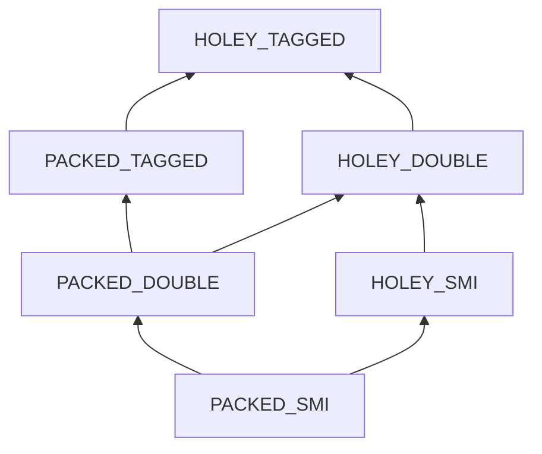

# 23. Objects: hidden classes and elements kinds   ⟨I · B · J · ~~N~~⟩

An object in this engine carries no property names at run time. Open a `Series` instance
in memory and you will find a pointer to a shared descriptor, an array of values, and
nothing that spells `"name"` or `"values"` anywhere. The names live once, in a *map* — a
`HiddenClass` — that every object built the same way borrows from a tree the whole process
shares. Reading `this.values` becomes `slots[1]`, and the `1` is a number a compiler can
learn.

That trade is the foundation of everything Part V does. It also has a consequence that
looks like a detail and is not: **the prototype is baked into map identity**. A map is not
"the names this object has"; it is "the names this object has, on this prototype". Two
objects with identical field lists and different prototypes get different maps, never share
a cache entry, and never dispatch to each other's methods. Get that wrong and every inline
cache in the engine becomes a source of wrong answers rather than fast ones.

Arrays go further. A `JSArray` has a hidden class too, but only for its *named*
properties. Its elements have no names, no descriptors and no offsets — just a flat
JavaScript array and one string, the `elementsKind`, that summarises what has been stored
in it so far. That string moves in one direction only, and it is a dependency key for the
whole program at once.

**What arrived.** From [Ch 22]: two of the fifteen tag codes opened, `CODE_OBJECT` and
`CODE_ARRAY`, whose payloads are a `JSObject` and a `JSArray` fetched out of the
`ValueHeap` by `getPayload` — a `Map` lookup, not a pointer dereference. Object identity is
already settled: `objectHeapIds` guarantees the same payload always yields the same tagged
value, so this chapter can say "the same object" without qualification. `strictEqual`
arrived with it, and is the predicate the inline caches and `index_of` will use.

## Hidden classes — what an object is

`JSObject` declares six fields, and then a run of optional ones that are not properties at
all:

```ts
export class JSObject {
  hiddenClass: HiddenClass;
  slots: StoredPropertyValue[];
  overflowProperties: Map<string, StoredPropertyValue> | null;
  constructorRef: TaggedValue | RuntimeFunctionPayload | null;
  symbolProperties: Map<HeapPayload, TaggedValue> | null;
  gcHeader: GCObject["gcHeader"] | null;
```

— `src/objects/heap/js-object.ts:92-98`

Read that list for what is *missing*. There is no `properties: Map<string, value>`. There
is no name in it anywhere. `slots` is a bare array of values; `hiddenClass` is the only
thing that can say which index means which name. Two `Series` instances therefore cost two
`slots` arrays of length two, and share one description of what those two positions mean.

> **New idea.** *Hidden class* (also *map*, also *shape*). Instead of storing a name→value
> table on every object, store the names once in a descriptor and let every object of the
> same shape point at it. The object keeps only the values, in a fixed order the descriptor
> defines. The saving is not just memory: a property read becomes an array index, and an
> array index is a number that generated code can bake in.

The book uses all three words for the same thing, because the engine does. The class is
`HiddenClass`; the tracer prints `HC0`, `HC89`; the `--trace` category is
`hidden-class` and prints `[HC]` and `[HIDDEN-CLASS]` lines; the glossary entry is
"hidden class / shape / map". What none of these name is a *class-table entry*, which is
the ahead-of-time compiler's static layout for a class and has no runtime shape at all
([Ch 57]); [GLOSSARY](../GLOSSARY.md) keeps the four apart deliberately, and this chapter
never uses "map" for the collection type `Map`.

Four fields on `HiddenClass` matter more than the other eighteen, because they are the four
that [Ch 24] and [Ch 34] re-check on every single cache hit:

| field | what it is | why a cache reads it |
| --- | --- | --- |
| `id` | a process-unique integer, from `registry.allocateHiddenClassId()` | the cache key: "last time the receiver was HC89" |
| `version` | bumped by `invalidate()` | says the shape's *descriptors* changed under a stable id |
| `isDeprecated` | set by `deprecate()` | says instances of this map must migrate before use |
| `protoObject` | the prototype, inherited from the parent map | says whose methods this shape dispatches to |

That is the contract this chapter owes forward. An inline-cache handler in [Ch 34] is
allowed to be four comparisons long precisely because those four fields exist and are
maintained here; everything else in this chapter is about keeping them honest.

Running the spine program with the tracer on shows the whole of what `stats.tera` does to
the map tree:

```
[HC] Transition: HC0 --"mean"--> HC85
[HC] Transition: HC85 --"label"--> HC86
[HIDDEN-CLASS] HC0 --proto--> HC87
[HC] Transition: HC87 --"name"--> HC88
[HC] Transition: HC88 --"values"--> HC89
```

— `node dist/cli.js --trace docs/example/stats.tera | grep -E '^\[HC\]|^\[HIDDEN-CLASS\]'`

Five lines, for a program that constructs two objects and reads their fields six times.
`--stats` on the same run reports `"hc_transitions": 88` — those are the *process's*
transitions, 83 of which belong to engine setup before the tracer is armed. The program
itself makes five. Read the two numbers together or you will believe `stats.tera` builds
88 maps.

## The transition tree

A map is never edited. Adding a property produces a *different* map, and the edge is
remembered on the parent so the next object that adds the same name to the same shape lands
on the same child:

```ts
  transition(propertyName: string): HiddenClass | null {
    if (this.integrityLevel !== INTEGRITY_NONE) {
      return null;
    }

    if (this.transitions.has(propertyName)) {
      return this.transitions.get(propertyName)!;
    }

    const newClass = new HiddenClass(
      this,
      TRANSITION_ADD,
      propertyName,
      this.propertyCount,
    );
    this.transitions.set(propertyName, newClass);
    this.checkStability();
```

— `src/objects/maps/hidden-class.ts:483-499`

Three things happen in seventeen lines. The integrity level is consulted first and can
refuse outright (§ integrity-levels). The `transitions` map is a memo: if this parent has
already been asked for this name, the answer is the *same object* as last time. Otherwise a
child is constructed with the parent as its back pointer, the new property's offset set to
the parent's current `propertyCount`, and the edge is cached. The tracer line is emitted
after `checkStability`, which is why every `[HC] Transition:` line you see is a *first*
occurrence.

> **New idea.** *Memoised edge.* The `transitions` map turns "build a shape" into "walk a
> path". The first `Series` pays for two `new HiddenClass` allocations; the second walks
> `HC87 → HC88 → HC89` by two `Map.get` calls and allocates nothing. This is why the trace
> above has five lines and not ten: the second instance fires no transition at all.

The five lines also show two disjoint chains. `HC0 --"mean"--> HC85 --"label"--> HC86` is
the `Series` *prototype object* gaining its two methods. Then `HC0 --proto--> HC87` forks a
map whose `protoObject` is that prototype, and `HC87 --"name"--> HC88 --"values"--> HC89`
is the shape an *instance* walks in its constructor. Every property inline cache in
`stats.tera` resolves against `HC89`, for both instances, which is the whole point:
`--stats` reports `"ic_hits": 30`.

Because offsets are assigned in arrival order, **order is part of identity**. An object
that sets `a` then `b` and an object that sets `b` then `a` reach different maps with
different offsets, and share no cache entry, even though a programmer would call them the
same shape
[t: tests/objects/heap/js-object.test.ts > "objects with same property order share hidden class"]
[t: tests/objects/heap/js-object.test.ts > "different property order produces different hidden class"].
That is a real cost, and it is why a constructor that assigns its fields in a fixed order
is worth more here than it looks.

The tree cannot grow without limit. `checkStability` counts transitions out of a map and
degrades it in two steps: past `MAX_TRANSITIONS_BEFORE_UNSTABLE = 32` the map stops being
`isStable`, and past twice that it deprecates itself.

```ts
  checkStability(): void {
    this.totalTransitionCount++;
    if (this.totalTransitionCount > MAX_TRANSITIONS_BEFORE_UNSTABLE) {
      this.isStable = false;
      if (
        this.totalTransitionCount > MAX_TRANSITIONS_BEFORE_UNSTABLE * 2 &&
        !this.isDeprecated
      ) {
        this.deprecate("excessive-transitions");
      }
    }
  }
```

— `src/objects/maps/hidden-class.ts:470-481`

The invariant is "a map with more than 64 children is not worth caching against", the
enforcement is those two `if`s, and the tests are
[t: tests/objects/maps/hidden-class.test.ts > "marks parent unstable after exceeding transition threshold"],
[t: tests/objects/maps/hidden-class.test.ts > "stays stable below transition threshold"] and
[t: tests/objects/maps/hidden-class.test.ts > "excessive transitions trigger deprecation on the transitioning HC"].

> **Dead.** `HiddenClass.tryDeprecate` (`hidden-class.ts:458-468`), and with it the
> `deprecationCount` field and `MAX_DEPRECATIONS_BEFORE_FREEZE = 5`
> (`hidden-class.ts:21`). No caller in `src/`, `tools/` or `tests/`. Those three symbols
> describe a "five deprecations, then freeze" policy that the engine does not run:
> `checkStability` deprecates directly at `MAX_TRANSITIONS_BEFORE_UNSTABLE * 2`. Finishing
> it means deciding which of the two policies is wanted and deleting the other; keeping
> both is what makes the constant misleading.

> **Dead.** `HiddenClass.markUnstable` (370-373) has no caller either. `checkStability`
> sets `isStable = false` inline, so the `this.version++` that `markUnstable` performs
> never happens on that path — a map that goes unstable does *not* invalidate the caches
> keyed on it, which is correct (nothing about its descriptors changed) but is only
> correct by accident of the dead function not being called. `HiddenClass.getStatistics`
> (896-914) and `getTransitionMetadataPath` (738-752) are dead in the same way: both
> compute a view of the tree that nothing anywhere asks for.

## The shared descriptor map

These are the hardest twenty lines in the file, and every "the map says offset 1" claim in
Part V rests on them. On an **add** transition the child does not copy the parent's
descriptors. It takes the parent's descriptor map *by reference*:

```ts
      if (transitionType === TRANSITION_ADD && transitionKey !== null) {
        const desc = new PropertyDescriptor(offset, "data", true, true, true);
        desc.order = parent.propertyCount;
        if (!parent._sharedExtended) {
          this._descMap = parent._descMap;
          this._descMap.set(transitionKey, desc);
          parent._sharedExtended = true;
        } else {
          this._descMap = new Map();
          for (const [k, d] of parent._descMap) {
            if (d.order < parent.propertyCount) this._descMap.set(k, d);
          }
          this._descMap.set(transitionKey, desc);
        }
        this.propertyCount = parent.propertyCount + 1;
      } else {
```

— `src/objects/maps/hidden-class.ts:318-333`

The first branch writes the child's new descriptor **into the parent's own map object**.
After it runs, `parent._descMap === child._descMap`, and the parent's table now contains an
entry for a property the parent does not have.

That is safe because of one invariant, stated nowhere in the source and enforced in exactly
one place:

> A descriptor belongs to a map only if `desc.order < map.propertyCount`.

```ts
  _ownEntries(): Array<[string, PropertyDescriptor]> {
    const out: Array<[string, PropertyDescriptor]> = [];
    for (const [name, d] of this._descMap) {
      if (d.order < this.propertyCount) out.push([name, d]);
    }
    return out;
  }
```

— `src/objects/maps/hidden-class.ts:350-356`

`_ownEntries` is the truncation. Every consumer that asks a map what it holds —
`properties` (358-360), `getPropertyNames` (715-717) and `lookupProperty` (705-709) — goes
through it, so the parent sees its own prefix and the child sees one more entry, out of one
shared table. `order` starts equal to `offset` (`PropertyDescriptor`'s constructor, line
172) and is set explicitly to `parent.propertyCount` on the line above the fork; it is a
*sequence number in the shared table*, and it is what makes truncation possible at all.

> **New idea.** *Structural sharing.* Two data structures that are mostly the same can
> alias the common part instead of copying it, provided each one carries enough information
> to know where its own view ends. Here the shared part is the descriptor table and the
> "where my view ends" is `propertyCount`. A linear chain of *n* properties therefore costs
> *n* small `HiddenClass` objects and **one** descriptor table, not *n* tables of average
> size *n*/2.

The second branch is the fork. `_sharedExtended` records that a parent has already given
its table away once. The second child of the same parent finds the flag set, allocates a
real `Map`, and copies — filtered by the same `order < parent.propertyCount` test, so it
copies the parent's prefix and not the first child's extra entry. Sibling shapes diverge at
the cost of one copy each, and only from the point they diverge.

Four tests pin this, and if this section is wrong they are the ones that say so:
[t: tests/objects/maps/hidden-class.test.ts > "an intermediate class does not see properties added by its descendants"],
[t: tests/objects/maps/hidden-class.test.ts > "sibling branches from a shared prefix do not leak properties"],
[t: tests/objects/maps/hidden-class.test.ts > "a forked branch preserves the shared-prefix offsets"],
[t: tests/objects/maps/hidden-class.test.ts > "keeps a long linear chain consistent"].

> **Dead.** `class DescriptorArray` (`hidden-class.ts:198-247`) is a complete, versioned,
> cloneable, iterable descriptor collection with no consumer in `src/` at all. The real
> storage is the plain `_descMap: Map<string, PropertyDescriptor>` above. It has its own
> `describe` block in `tests/objects/maps/hidden-class.test.ts:39`, so it is maintained
> without being used. Finishing it means either routing `_descMap` through it — which would
> at last give the `descriptorVersion` field on `HiddenClass` a real owner — or deleting
> both it and its tests.

## Offsets, back pointers, and delete

`parent` is the back pointer. Every map except the root has one, and `getRoot` and
`getTransitionPath` walk it upward to reconstruct how a shape was built. The tree is
therefore navigable in both directions: down by name through `transitions`, up by
`parent`.

Offsets are handed out as `this.propertyCount` at add time and never move afterwards. That
"never" has exactly one exception, and it is expensive.

`HiddenClass.deleteProperty` (585-620) refuses non-configurable properties, memoises the
result in a *separate* table (`deleteTransitions`, so a delete edge cannot be confused with
an add edge), and constructs the child through the **non**-add branch of the constructor —
which clones every descriptor rather than sharing. Then it renumbers:

```ts
    const remaining = [...newClass._descMap.entries()].sort(
      (a, b) => a[1].order - b[1].order,
    );
    let nextOffset = 0;
    for (const [, d] of remaining) {
      d.offset = nextOffset;
      d.order = nextOffset;
      nextOffset++;
    }
```

— `src/objects/maps/hidden-class.ts:602-610`

Survivors are re-sorted by their old `order` and given a dense `0..n-1` for both `offset`
and `order`. Nothing is left holey; the shape after a delete is indistinguishable from a
shape that never had the deleted property, except that it is reached by a different path.

The cost lands on the instance. `JSObject.deleteProperty` (353-406) cannot just splice its
`slots`: the child map's offsets are new, so it snapshots the old slots and the old
overflow table, empties both, and re-reads every surviving value at its *old* offset before
writing it at its *new* one. And `oldHC.invalidate("delete:x")` bumps `version` and the
`prototypeValidityCell`, so every inline cache anywhere in the program that was keyed on
that map now misses.

State it plainly: **delete is not a property operation in this engine, it is a reshape.**
It allocates a map, rebuilds a slots array, and invalidates a version. The tests are
[t: tests/objects/maps/hidden-class.test.ts > "deleteProperty removes property and reindexes offsets"],
[t: tests/objects/maps/hidden-class.test.ts > "deleteProperty returns null for non-configurable"] and
[t: tests/objects/maps/hidden-class.test.ts > "deleteProperty on missing property returns self"].

## Prototype is part of map identity

`protoObject` is a field on the map, not on the object, and every child inherits it from
its parent at construction (`this.protoObject = parent ? parent.protoObject : null`, line
291). Changing a prototype is therefore a *transition*, with its own memo table keyed by
the prototype object itself:

```ts
  transitionToPrototype(proto: JSObject | null): HiddenClass {
    if (proto) proto.hiddenClass.isPrototypeMap = true;
    if (this.protoObject === proto) return this;

    const cached = this.prototypeTransitions.get(proto);
    if (cached) return cached;

    const newClass = new HiddenClass(this, TRANSITION_PROTOTYPE, null, 0);
    newClass.protoObject = proto;
    newClass.instanceType = this.instanceType;
    newClass.prototypeValidityCell = { version: 0 };
    this.prototypeTransitions.set(proto, newClass);
    this.checkStability();
```

— `src/objects/maps/hidden-class.ts:506-518`

Three consequences follow, in order.

**One.** Two objects with the same property names and different prototypes get different
maps, and therefore never share an inline-cache entry
[t: tests/objects/maps/hidden-class.test.ts > "separates identical shapes carrying different prototypes"].
Conversely, instances of the same constructor share one map, which is why `stats.tera`'s
two `Series` both land on `HC89`
[t: tests/objects/maps/hidden-class.test.ts > "shares one map across instances of the same prototype and shape"].
The prototype rides through later property transitions unchanged
[t: tests/objects/maps/hidden-class.test.ts > "carries the prototype through later property transitions"],
and asking for the prototype a map already holds returns the map itself, allocating nothing
[t: tests/objects/maps/hidden-class.test.ts > "returns the same map when transitioning to the prototype already held"].

**Two.** A map re-prototyped *after* it has properties keeps every descriptor, because
`TRANSITION_PROTOTYPE` is not `TRANSITION_ADD` and so takes the constructor's cloning
branch (334-344), which copies `parent._ownEntries()` and renumbers `order` from zero. The
worked example below is exactly this case
[t: tests/objects/maps/hidden-class.test.ts > "preserves descriptors when the prototype changes after properties exist"].

**Three.** The new map gets a **fresh** `prototypeValidityCell` (line 516), while an
ordinary add-transition child *shares* the parent's (line 316). That asymmetry is the whole
design.

> **New idea.** *Validity cell.* Walking a prototype chain to check "has anything on it
> changed?" costs a loop. Instead, every map on a chain points at one shared counter
> object; a change bumps the counter once, and a cache that recorded the old number knows
> in one integer compare that something, somewhere on that chain, moved. It is a
> coarse answer — the cache cannot tell *what* changed — traded for a constant-time check.

`invalidate` bumps both `version` and `prototypeValidityCell.version` and reports both to
the dependency registry:

```ts
  invalidate(reason: string): void {
    const oldVersion = this.version;
    const oldProtoVersion = this.prototypeValidityCell.version;
    this.version++;
    this.prototypeValidityCell.version++;
    this.isStable = false;
    dependencyRegistry.invalidate(DEP_MAP, this.id, oldVersion, reason);
    dependencyRegistry.invalidate(
      DEP_PROTO_VALIDITY,
      this.id,
      oldProtoVersion,
      reason,
    );
```

— `src/objects/maps/hidden-class.ts:375-387`

`JSObject.invalidatePrototypeDependents` (216-226) is the other bumper, called from
`setProperty` when a store lands on an object that other maps use as a prototype. There is
an asymmetry worth naming: `setPropertyByOffset` (504-521) — the path an inline-cache
handler takes — only invalidates when `hiddenClass.isPrototypeMap` is set, and that flag is
set in exactly one place, the first line of `transitionToPrototype` above. So an object
becomes "a prototype" the moment somebody transitions a map onto it, and not before.

## Why the obvious design fails — a prototype pointer per object

Here is the design a reader would write first, and it is not a strawman: put `prototype` on
the object as an ordinary field and let the map describe names only. It is smaller —
one pointer per object instead of a map fork per prototype. It makes
`Object.setPrototypeOf` O(1) with no allocation. And every textbook description of hidden
classes talks only about field layout, so it feels like the faithful version.

It is wrong, and the program that breaks it is four lines of class declaration:

```
class A:
  constructor(n):
    this.n = n
  v():
    return 1
class B extends A:
  constructor(n):
    super(n)
  v():
    return 2
a = A(5)
b = B(9)
before = a.v()
Object.setPrototypeOf(a, Object.getPrototypeOf(b))
print(a.n * 100 + before * 10 + a.v())
```

`A` instances and `B` instances have *identical shapes*: one property, `n`, at offset 0.
Under the counterfactual design they would share one map. An inline cache at the `.v()`
call site would record "map M ⇒ this method", and it would be right for `a` and wrong for
`b`, because the thing that distinguishes them — the prototype — was not part of the key.
The cache would hand `b.v()` the method it cached for `a`. That failure is silent: no
crash, no type error, just `1` where `2` belongs.

Under the actual design the map fork carries the prototype, so `a` and `b` never collide,
and re-prototyping `a` produces a new map with `n`'s descriptor preserved:

```
$ node dist/cli.js /tmp/reproto.tera
512
$ node dist/cli.js --trace /tmp/reproto.tera | grep proto
[HIDDEN-CLASS] HC0 --proto--> HC86
[HIDDEN-CLASS] HC0 --proto--> HC89
[HIDDEN-CLASS] HC88 --proto--> HC91
```

`HC88 --proto--> HC91` is a *populated* map forking on the prototype — `a` already had `n`
when its prototype was replaced, and `n`'s descriptor was carried across. The answer
decodes as `a.n * 100 = 500` (the value survived), `before * 10 = 10` (the old dispatch was
`A.v`), and `a.v() = 2` (the new dispatch is `B.v`). The end-to-end test is
[t: tests/e2e/language/classes.test.ts > "reroutes dispatch when the prototype is replaced on a populated instance"];
the unit test that fails under the counterfactual is
[t: tests/objects/maps/hidden-class.test.ts > "separates identical shapes carrying different prototypes"].

The general rule the book reuses in [Ch 57], where the ahead-of-time compiler has to build
dispatch cones with no runtime map at all: **whatever dispatch is keyed on must be part of
the key.** A cache that omits a discriminator is not a smaller cache, it is a wrong one.

## Ten in-object slots

`MAX_IN_OBJECT_PROPERTIES = 10` (`js-object.ts:38`). Offsets 0 through 9 live in the flat
`slots` array. Offset 10 and up live in `overflowProperties`, a
`Map<string, StoredPropertyValue>` that is `null` on a fresh object and stays `null` until
the first overflow
[t: tests/objects/heap/js-object.test.ts > "overflowProperties is null on fresh object"]
[t: tests/objects/heap/js-object.test.ts > "overflowProperties stays null with fewer than 10 properties"]
[t: tests/objects/heap/js-object.test.ts > "overflowProperties created lazily when exceeding 10 slots"]
[t: tests/objects/heap/js-object.test.ts > "first 10 properties stored in slots, rest in overflow"].

The important part is what does *not* fork. The hidden class keeps assigning offsets past
ten exactly as before — `propertyCount` does not stop at ten, and neither does `offset`. The
*descriptor* is uniform; only the *storage* has two cases. So `getPropertyByOffset` has two
branches, and so does every other reader:

```ts
  getPropertyByOffset(offset: number): TaggedValue | undefined {
    if (offset < MAX_IN_OBJECT_PROPERTIES) {
      return dataValue(this.slots[offset]);
    }
```

— `src/objects/heap/js-object.ts:490-492`

That is one of **eleven** places in `js-object.ts` that spell `offset < MAX_IN_OBJECT_PROPERTIES`
by hand, with no shared helper between them. An inline-cache handler in [Ch 34] must know
which side of ten its cached offset falls on, because the two sides are read by different
code.

> **Unenforced.** The eleven comparisons are duplicated, and one place breaks the pattern:
> `JSObject.lookupPrototypeChain` (`js-object.ts:180`) tests
> `desc.offset < current.slots.length` rather than against the constant. That is only
> equivalent while `slots` is never longer than ten — which `recordConstruction`'s trim
> currently guarantees — and while an overflow entry is never host-`undefined`, which
> `migrateInstance:268` can violate for a name the old map did not carry, since it writes
> `value = undefined` into `overflowProperties` in that case. The constant is also declared
> a second time in `js-array.ts:38`. No test distinguishes the two conditions, and nothing
> in the source states that they must agree. Fixing it is one exported predicate and eleven
> call-site edits.

## Accessors share the slot

`StoredPropertyValue` is a three-way union, and that is a design decision with reach:

```ts
export type StoredPropertyValue = TaggedValue | AccessorPair | undefined;

function isAccessorPair(value: StoredPropertyValue): value is AccessorPair {
  return value instanceof AccessorPair;
}

function dataValue(value: StoredPropertyValue): TaggedValue | undefined {
  return isAccessorPair(value) ? undefined : value;
}
```

— `src/objects/heap/js-object.ts:72-80`

A getter/setter pair is stored **in the same slot** a data property would use, and the only
thing that says which it is, is the descriptor's `kind`. There is no separate accessor
table and no second array.

`dataValue` is the filter that makes that liveable. It strips `AccessorPair` to `undefined`
so `getProperty` can keep its `TaggedValue | undefined` return type without lying, and it
is applied at every read site in the file. Three consequences follow:

- `getProperty` on an accessor answers `undefined`, not the pair and not the getter's
  result. Anything that wants the accessor must ask the *descriptor*, not the slot
  [t: tests/objects/heap/js-object.test.ts > "hides accessor pairs from getProperty, which reads data only"].
- `visitReferences` skips accessor slots, so a getter closure is **not** traced as a
  reference from the object it lives on. That is a root-set fact, and [Ch 32] is where it
  is paid for.
- [Ch 24]'s `handleLdaProp` must test `desc.kind === "accessor"` *before* it consults the
  inline cache — because the slot it would read holds an `AccessorPair`, and the cache has
  no way to know.

## Integrity levels

`preventExtensions`, `seal` and `freeze` are, on the map side, real edges on the transition
tree. `transitionToPreventExtensions` (622-643) forks a child with
`integrityLevel = INTEGRITY_PREVENTEXTENSIONS`; `transitionToSealed` (645-670) chains
through it first and then marks every descriptor non-configurable; `transitionToFrozen`
(672-703) chains through both and marks data descriptors non-writable as well. Each caches
its result in `integrityTransitions`, so repeating the call returns the same map
[t: tests/objects/maps/hidden-class.test.ts > "repeated integrity call returns same cached transition"].
And `transition()` reads `integrityLevel` as a hard stop, as its first four lines show
above: a frozen map returns `null` rather than a child, so `JSObject.setProperty` returns
`false` and the store does nothing
[t: tests/objects/maps/hidden-class.test.ts > "preventExtensions blocks new transitions"]
[t: tests/objects/maps/hidden-class.test.ts > "seal makes all properties non-configurable"]
[t: tests/objects/maps/hidden-class.test.ts > "freeze makes all data properties non-writable and non-configurable"]
[t: tests/objects/maps/hidden-class.test.ts > "freeze chains through preventExtensions and sealed"].

It is a careful, complete design. **None of it is reachable from tera source.**

> **Never runs.** `JSObject.freeze()`, `JSObject.seal()` and `JSObject.preventExtensions()`
> (`src/objects/heap/js-object.ts:547-569`) have no caller anywhere in `src/`. The tera
> builtins reach the same words by a different route: `Object.freeze`
> (`src/runtime/builtins/index.ts:813-822`) sets a boolean `_frozen` on the payload,
> `Object.seal` (831-840) sets `_sealed` and `_nonExtensible`, and
> `Object.preventExtensions` (850-857) sets `_nonExtensible`. Consequently
> `HiddenClass.transitionToPreventExtensions`, `transitionToSealed`, `transitionToFrozen`,
> the `integrityTransitions` table, the `INTEGRITY_*` levels and the `integrityLevel` guard
> at the top of `transition()` are exercised only from
> `tests/objects/maps/hidden-class.test.ts:216-257` and
> `tests/objects/heap/js-object.test.ts:257-274`. Finishing it is three lines — have the
> builtins call the `JSObject` methods — plus deciding what `Object.isExtensible` (859-865)
> should read, since it currently reads the flags.

The two mechanisms do not agree, and the disagreement is observable:

```
$ node dist/cli.js /tmp/frozen.tera
1
true
undefined
```

The program is `o = { x: 1 }`, `Object.freeze(o)`, `o.x = 2`, `print(o.x)`,
`print(Object.is_frozen(o))`, `delete o.x`, `print(o.x)`. The store is refused — that is
the `1` — because `handleStaProp` checks the `_frozen` boolean. The object reports itself
frozen. And then the delete succeeds anyway.

> **Broken.** `delete o.x` succeeds on a frozen object.
> `handleDeleteProp` (`src/bytecode/register/interpreter/handlers.ts:689-709`) routes to
> `runtimeDeleteProperty`, which consults `desc.configurable` — and the descriptor is still
> configurable, because no integrity transition ever ran to mark it otherwise. The boolean
> and the descriptor are two answers to one question and only one of them is on the delete
> path. `handleDeleteProp` also discards the boolean `runtimeDeleteProperty` returns and
> unconditionally answers `true`, so a program cannot detect the failure either way
> ([Ch 24 § store-is-not-load] names that second half). `[unpinned]` — no test covers
> freeze-then-delete.

The general rule: **two mechanisms for one property is one mechanism too many**, and the
tell is that only one of them is on the read path. When you find a boolean beside a
descriptor field that means the same thing, the boolean is what the fast path checks and
the descriptor is what everything else checks, and they will diverge.

## Slack tracking

An object built by a constructor grows its `slots` array one `push` at a time as fields are
assigned. Doing that on every instance is repeated work with a knowable answer, so the
constructor learns:

```ts
  if (!ctor) return;
  if (ctor.slackCounter === undefined) {
    ctor.slackCounter = SLACK_TRACKING_CALL_COUNT;
    ctor.slackExpectedProperties = 0;
    ctor.slackTrackingComplete = false;
  }
  const count = obj.hiddenClass.propertyCount;
  const inObjectUsed =
    count < MAX_IN_OBJECT_PROPERTIES ? count : MAX_IN_OBJECT_PROPERTIES;
  if (!ctor.slackTrackingComplete) {
    const expected = ctor.slackExpectedProperties ?? 0;
    if (inObjectUsed > expected) {
      ctor.slackExpectedProperties = inObjectUsed;
    }
    ctor.slackCounter--;
    if (ctor.slackCounter <= 0) ctor.slackTrackingComplete = true;
  }
  if (obj.slots.length > inObjectUsed) obj.slots.length = inObjectUsed;
}
```

— `src/objects/heap/js-object.ts:600-617`, the body of
`recordConstruction(ctor, obj)`

`SLACK_TRACKING_CALL_COUNT = 7`. The first seven constructions *teach* the constructor the
high-water mark of in-object properties its instances end up with; `presizeInstanceSlots`
(586-594), called from `allocateInstance` in the factory, then sizes a later instance's
`slots` in one assignment before any field is stored. The last line trims every instance,
learning or not, down to what it actually used — so an object that took the pre-sized path
and used fewer fields does not carry the slack.

Two bounds. `inObjectUsed` is capped at ten, so a wide object learns ten and stops
[t: tests/objects/heap/js-object.test.ts > "caps the learned count at the in-object limit for wide objects"].
And the counter freezes: after seven constructions the expected count never moves again,
even if the eighth instance is wider
[t: tests/objects/heap/js-object.test.ts > "freezes tracking after the construction-count threshold"].
The other four of the six tests cover learning, pre-sizing, trimming and the fact that
values survive both
[t: tests/objects/heap/js-object.test.ts > "learns the expected in-object property count from constructions"]
[t: tests/objects/heap/js-object.test.ts > "pre-sizes a later instance to the learned count before any property is set"]
[t: tests/objects/heap/js-object.test.ts > "trims slack from an instance that uses fewer properties than learned"]
[t: tests/objects/heap/js-object.test.ts > "preserves property values across pre-size and trim"].

What this buys is not measured — there is no benchmark harness in this tree — but it is
describable: fewer array growth steps per construction, and `stats.tera` builds only two
`Series`, so it never leaves the learning phase.

## Deprecation and migration

A map that transitions past 64 children deprecates itself and builds a *migration target*:
a fresh chain, rooted at a parentless map, replaying the deprecated map's property list in
`order` with each descriptor's attributes copied across (`_buildMigrationTarget`, 409-451).
Two maps therefore agree on names and attributes and need not agree on offsets, because the
new chain starts from zero.

The cache for those targets is keyed twice: `migrationTargetCache` is a
`Map<JSObject | null, Map<string, HiddenClass>>` — prototype first, then a string built
from every descriptor's `name:kind:writable:enumerable:configurable` plus the integrity
level. Two deprecated maps with the same fields and different prototypes get different
targets, which is [§ prototype-is-part-of-map-identity] holding at one more site.

Instances migrate **lazily**. `deprecate` does not touch a single object; it registers the
target in `registry.deprecatedMaps` and returns. The next `storedProperty`, `setProperty`
or `lookupPrototypeChain` that sees `isDeprecated` calls `migrateInstance`, and only then
does the object pay
[t: tests/objects/heap/js-object.test.ts > "deprecated hidden class triggers migration on getProperty"].

The detail that makes migration correct is easy to miss:

```ts
    for (const [name, newDesc] of targetHC.properties) {
      const oldDesc = oldHC.lookupProperty(name);
      let value: TaggedValue | undefined = undefined;

      if (oldDesc) {
        if (
          oldDesc.offset < MAX_IN_OBJECT_PROPERTIES &&
          oldDesc.offset < oldSlots.length
        ) {
          value = dataValue(oldSlots[oldDesc.offset]);
        } else {
          value = dataValue(oldOverflow.get(name));
        }
      }
```

— `src/objects/heap/js-object.ts:246-259`

It copies **by name**, not by index. Each name's *old* offset is looked up in the *old*
map, the value is read there, and it is written at the *new* map's offset. Copying
`slots` positionally would be shorter and would be wrong the first time a target chain
assigns a different order
[t: tests/objects/heap/js-object.test.ts > "migration preserves all property values"].

The observable is in `--stats`, and for the spine program both counters are zero:

```
  "deprecatedMaps": 0,
  "migrations": {
    "totalMigrations": 0
  },
```

— `node dist/cli.js --stats docs/example/stats.tera`

`stats.tera` cannot reach deprecation: it would need a single map to sprout 65 children,
and the program builds five maps in total. The machinery is pinned by unit tests
[t: tests/objects/maps/hidden-class.test.ts > "deprecate builds migration target with same properties"]
[t: tests/objects/maps/hidden-class.test.ts > "deprecate is idempotent"]
[t: tests/objects/maps/hidden-class.test.ts > "migration target preserves integrity level"]
[t: tests/objects/maps/hidden-class.test.ts > "deprecated map is findable via global helpers"]
and by nothing end to end.

> **Dead.** `HiddenClass.dump` (847-894), `collectTransitionTree` (773-778) and
> `_buildTreeLines` (780-821) render the transition tree as indented text and have **no
> caller anywhere** — not in `src/`, not in `tools/`, not in `tests/`. (`dump` calls
> `collectTransitionTree`, which is the only reference either has.) Nothing in the CLI or
> the tracer can print a transition tree, which is the one diagnostic this chapter most
> wants and cannot show; the `[HC] Transition:` lines are the closest available view, and
> they are a log of edges rather than a picture of the tree. Finishing it is a `--print-maps`
> flag and one call site.

## Elements kinds — six points and a one-way join

An array has none of the above for its contents. `JSArray` holds
`elements: Array<TaggedValue | undefined>`, a `hiddenClass` and `slots` for its *named*
properties, and one string:

```ts
export class JSArray {
  elements: Array<TaggedValue | undefined>;
  elementsKind: ElementsKindName;
  hiddenClass: HiddenClass;
  slots: Array<TaggedValue | undefined>;
  overflowProperties: Map<string, TaggedValue | undefined>;
  symbolProperties: Map<HeapPayload, TaggedValue> | null;
  gcHeader: GCObject["gcHeader"] | null;
```

— `src/objects/heap/js-array.ts:47-53`

`elementsKind` is a summary of everything ever stored: three value grades crossed with
packed-or-holey.



> **New idea.** *Lattice* and *monotone join*. A lattice is a set of abstract facts ordered
> from precise to vague, with a *join* operation that answers "what is the most precise
> fact still true of both of these?". Here the six kinds are the facts, "less precise" is
> upward in the diagram, and `mergeElementsKind` is the join. The property that matters is
> **monotonicity**: the join can only ever move up the diagram, never down. That is what
> makes it terminate — an array can be promoted at most twice on the value axis and once on
> the holey axis before it reaches the top — and it is the shape [Ch 33]'s feedback
> lattice and [Ch 43]'s type inference both reuse.

The join is three `if`s and no loop:

```ts
  const holey = makesHole || isHoleyElementsKind(currentKind);
  const valueKind = classifyElementValue(value);

  if (
    currentKind === PACKED_TAGGED ||
    currentKind === HOLEY_TAGGED ||
    valueKind === VALUE_TAGGED
  ) {
    return holey ? HOLEY_TAGGED : PACKED_TAGGED;
  }

  if (
    currentKind === PACKED_DOUBLE ||
    currentKind === HOLEY_DOUBLE ||
    valueKind === VALUE_DOUBLE
  ) {
    return holey ? HOLEY_DOUBLE : PACKED_DOUBLE;
  }

  return holey ? HOLEY_SMI : PACKED_SMI;
```

— `src/objects/elements/elements-kind.ts:48-67`

Read the tests for the two asymmetries that make it a lattice rather than a classifier.
**TAGGED never downgrades**: once any non-numeric value has been stored, storing a hundred
integers afterwards does not take the array back to SMI, because `currentKind ===
PACKED_TAGGED` is the *first* disjunct
[t: tests/objects/elements/elements-kind.test.ts > "never downgrades from TAGGED"]
[t: tests/objects/elements/elements-kind.test.ts > "never downgrades from DOUBLE to SMI"].
**Holey is sticky**: `holey` is `makesHole || isHoleyElementsKind(currentKind)`, so once
true it stays true forever, and nothing in the file ever un-holeys an array
[t: tests/objects/elements/elements-kind.test.ts > "holey is sticky even without makesHole"]
[t: tests/objects/elements/elements-kind.test.ts > "makesHole flag transitions packed to holey"]
[t: tests/objects/elements/elements-kind.test.ts > "holey + type promotion combines both"].

> **New idea.** *Hole.* A hole is an index that has never been written — not a slot
> containing `undefined`, but a slot that is not there. The two look the same when you read
> them (both answer `undefined`) and are different when you enumerate: `keys()` skips holes
> and lists explicit `undefined` elements
> [t: tests/objects/heap/js-array.test.ts > "skips holes but keeps explicit undefined elements"].
> Holes are why the lattice has six points instead of three: a compiler that knows an array
> is packed can index it without a presence check.

Holes are made in exactly two ways. `setIndex` computes `makesHole = index > oldLength` —
*strictly* greater, so writing at exactly `length` appends and creates nothing — and
`setLength` growing an array pushes `undefined` and calls `makeHoleyElementsKind` directly
(155-174)
[t: tests/objects/heap/js-array.test.ts > "getIndex/setIndex round-trip, fills holes with undefined"]
[t: tests/objects/heap/js-array.test.ts > "extends with undefined when new length is longer"].
Note also what `setIndex` does with a negative index first: it wraps, `index +=
this.elements.length`, which is the Python-style convention [Ch 26] develops.

Two operations create no hole and change no kind at all: `pop` and `shift`. They shrink
`elements` and leave `elementsKind` exactly where it was — a fact [Ch 13]'s length-bounds
analysis and [Ch 49]'s speculation both lean on.

`inferElementsKind` (70-79) is the same join folded over a whole array, used by the
`JSArray` constructor, and it treats a host-`undefined` element as a hole rather than as a
tagged value
[t: tests/objects/elements/elements-kind.test.ts > "empty array -> PACKED_SMI"]
[t: tests/objects/elements/elements-kind.test.ts > "mixed smi and double -> PACKED_DOUBLE"]
[t: tests/objects/elements/elements-kind.test.ts > "any tagged value -> PACKED_TAGGED"]
[t: tests/objects/elements/elements-kind.test.ts > "undefined holes transition to holey"].

## Where elements kind is invalidated

Five sites mutate `elementsKind`, and all five do the same thing when it moves:

| site | lines | what promotes the kind |
| --- | --- | --- |
| `setIndex` | 119-130 | the stored value, plus `makesHole` |
| `setLength` | 160-169 | growing past the current length |
| `push` | 178-194 | any of the pushed values |
| `unshift` | 208-225 | any of the unshifted values |
| `splice` | 250-259 | any of the inserted items |

```ts
    const oldKind = this.elementsKind;
    this.elementsKind = mergeElementsKind(this.elementsKind, value, makesHole);
    if (oldKind !== this.elementsKind) {
      dependencyRegistry.invalidate(
        DEP_ELEMENTS_KIND,
        oldKind,
        null,
        `elements-kind:${oldKind}->${this.elementsKind}`,
      );
    }
```

— `src/objects/heap/js-array.ts:121-130`

Look hard at the second argument. It is `oldKind` — a *string* — and the third is `null`,
the version. `dependencyKey` (`src/deopt/dependencies.ts:44-53`) composes those into
`"elements-kind:PACKED_DOUBLE"`. **The dependency key is the kind name, not the array.**

There is no array identity in that key anywhere. One string pushed into one `float[]`
therefore invalidates every optimized function in the program that assumed
`PACKED_DOUBLE` — for *any* array, including arrays the function never saw. `stats-deopt.tera`
shows the whole cycle in two trace lines:

```
[DEOPT] Dependency registered: total_of -> elements-kind:PACKED_DOUBLE
[DEOPT] DEOPT "total_of": elements-kind-check-failed at bytecode:8
```

— `node dist/cli.js --trace docs/example/stats-deopt.tera | grep -E 'DEOPT|elements-kind'`

`total_of` is compiled after 200 calls over a packed-double array and registers the
dependency; the last two lines of the program build a second array containing a string,
`mergeElementsKind` promotes it to `PACKED_TAGGED`, and the registry deoptimizes every
holder of the `PACKED_DOUBLE` key.

The trade is deliberate. A per-array key would need a stable array identity in the
dependency table, a write barrier on the kind field, and per-object bookkeeping the
collector would have to understand. A per-kind key needs one string and one `Map.get`, at
the price of collateral deopts — functions abandoned because an unrelated array changed
shape. [Ch 54] is where that bill is itemised.

> `DEP_ELEMENTS_KIND`'s coarse keying — the fact that *one* array's promotion invalidates
> *every* function that assumed the kind — has no unit test. It is observable only end to
> end, through `stats-deopt.tera`. `[unpinned]`

## Arrays are not objects

`JSArray` has a `hiddenClass`, and the fact that it does is the most misleading thing in
this chapter, so here is precisely what it is for.

Named properties on an array go through the map, exactly as on an object:
`setProperty` (454-489) transitions, assigns an offset, and stores into `slots` or
`overflowProperties`
[t: tests/objects/heap/js-array.test.ts > "setProperty/getProperty for non-length named props via hidden class transitions"].
Everything else bypasses it:

- **`length` never reaches the map.** `getProperty`'s first line is
  `if (name === "length") return this.elements.length;` (`js-array.ts:443`), and
  `setProperty`'s first branch routes to `setLength`. The map is not consulted, and
  `keys()` does not list `length`
  [t: tests/objects/heap/js-array.test.ts > "does not list length as a key"].
- **Indices never reach the map.** `getIndex` / `setIndex` address `elements` directly.
  There is no descriptor for element 3 and no offset to cache.
- **There is no prototype chain.** `JSArray` has no `protoObject` and no `prototype`
  field. Its methods come from `builtinPrototypes.arrayPrototype` by an entirely different
  route, which is [Ch 25]'s subject.

> **Unenforced.** `JSArray.getProperty("length")` returns a raw host `number`, not a
> `TaggedValue`; the declared return type `TaggedValue | number | undefined`
> (`js-array.ts:442`) says so out loud. Both current callers — `memberLookupValue`'s
> `arrayMember` and `runtimeGetProperty` — happen to intercept `"length"` before they get
> there, so the untagged value never escapes into the tagged world. That is coincidence,
> not construction: a third caller would ship a bare `5` where `getTag(5)` answers
> `"double"`. Fixing it is one `mkNumber` and a narrowed return type.

So the handover to [Ch 24] has two halves, and they must not be confused. `this.values` is
an object property access: it ends in a map, an offset, and something an inline cache can
remember. `values.length` is not, and cannot be — there is no map to key on and no offset
to record. It has to be answered somewhere else entirely, and that somewhere is [Ch 25].

## What leaves

Two payload classes, opened. A `JSObject` carrying a `HiddenClass` with an `id`, a
`version`, an `isDeprecated` flag, a `protoObject` and a `prototypeValidityCell` shared
with its add-transition children; a flat `slots: StoredPropertyValue[]` addressed by
integer offset, with `overflowProperties` holding anything from offset ten up; `AccessorPair`
sharing those slots with data values, distinguished only by the descriptor's `kind`; and
`lookupPrototypeChain` returning `{found, value, owner, descriptor, depth}` — with `owner`
and `depth` separate, which [Ch 24 § accessors-before-the-cache] needs so a getter can be
called on the receiver rather than on the object that declared it.

A `JSArray` carrying `elements`, an `elementsKind` from a six-point lattice that only ever
widens, and a `hiddenClass` that answers for its named properties and for nothing else.
Chapter 24 receives the explicit warning that goes with it: a `JSArray` is not a `JSObject`
and cannot answer `length` through a map.

Two dependency keys leave with them, both load-bearing for [Ch 54]: `DEP_MAP`, keyed by map
id *and* version, and `DEP_ELEMENTS_KIND`, keyed by the kind name alone and therefore
speaking for every array in the program at once.

[Ch 24 § lda-prop-the-sequence-in-order] takes all of it and asks the next question: given this object model,
what exactly happens, in what order, when the bytecode says `LdaNamedProperty`.

## Verify it yourself

```bash
# The five map transitions stats.tera actually makes — two on the prototype,
# one prototype fork, two on the instance shape.
node dist/cli.js --trace docs/example/stats.tera | grep -E '^\[HC\]|^\[HIDDEN-CLASS\]'

# The process-wide counters, which are much larger. 83 of the 88 are engine setup.
node dist/cli.js --stats docs/example/stats.tera | grep -E 'hc_transitions|ic_hits|deprecatedMaps'

# The prototype is part of map identity: a populated map forks on re-prototyping,
# keeps its descriptors, and reroutes dispatch. Answers 512.
printf 'class A:\n  constructor(n):\n    this.n = n\n  v():\n    return 1\nclass B extends A:\n  constructor(n):\n    super(n)\n  v():\n    return 2\na = A(5)\nb = B(9)\nbefore = a.v()\nObject.setPrototypeOf(a, Object.getPrototypeOf(b))\nprint(a.n * 100 + before * 10 + a.v())\n' > /tmp/reproto.tera
node dist/cli.js /tmp/reproto.tera
node dist/cli.js --trace /tmp/reproto.tera | grep proto

# Two mechanisms for one property: the store is refused, the object reports frozen,
# and the delete succeeds anyway. Prints 1 / true / undefined.
printf 'o = { x: 1 }\nObject.freeze(o)\no.x = 2\nprint(o.x)\nprint(Object.is_frozen(o))\ndelete o.x\nprint(o.x)\n' > /tmp/frozen.tera
node dist/cli.js /tmp/frozen.tera

# The elements-kind dependency, registered and then broken by an unrelated array.
node dist/cli.js --trace docs/example/stats-deopt.tera | grep -E 'DEOPT|elements-kind'

# The object model's own tests: 141 of them, four files.
npx vitest run --project unit tests/objects/maps/hidden-class.test.ts tests/objects/heap/js-object.test.ts tests/objects/heap/js-array.test.ts tests/objects/elements/elements-kind.test.ts
```

The last command reports `Test Files 4 passed (4)` / `Tests 141 passed (141)`.

There is one probe this chapter runs that is a bug report rather than a demonstration:

```bash
# getInitialMap's pseudo-transition key collides with a real property name.
printf 'm = Map()\nm.set(1, 2)\no = {}\no["@@JS_MAP"] = 7\nprint(o["@@JS_MAP"])\nprint(o.size)\n' > /tmp/collide.tera
node dist/cli.js /tmp/collide.tera; echo "exit=$?"
```

```
undefined
Cannot read properties of undefined (reading 'size')
exit=1
```

> **Broken.** `HiddenClassRegistry.getInitialMap` (`hidden-class.ts:92-99`) stores its
> pseudo-transition under the key `` `@@${instanceType}` `` in `root.transitions` — the
> same table ordinary property names transition through. A plain object that gains a
> property literally named `@@JS_MAP`, after any `Map` has been constructed, therefore
> transitions to the `Map` instance's initial map. The assigned value is silently dropped
> (that map's `propertyCount` is 0, so `lookupProperty` refuses the name and `setProperty`
> returns `false`), and the object now claims `instanceType === "JS_MAP"`, so
> [Ch 24 § exotic-fast-paths]'s `size` branch dereferences a missing `_mapData` and the
> process exits 1 with a raw host message. Finishing it costs a separate `Map` for
> instance-type edges, or a key character the lexer cannot produce. `[unpinned]`

## Tests that pin this

- `tests/objects/maps/hidden-class.test.ts` > `"transition creates child with new property"`,
  `"same property name reuses existing transition"`,
  `"different properties create different children"`,
  `"chained transitions accumulate properties"`,
  `"property offsets increment sequentially"` — the tree and its memoised edges.
- `tests/objects/maps/hidden-class.test.ts` > `"an intermediate class does not see properties added by its descendants"`,
  `"sibling branches from a shared prefix do not leak properties"`,
  `"a forked branch preserves the shared-prefix offsets"`,
  `"keeps a long linear chain consistent"` — the shared `_descMap` and the
  `order < propertyCount` truncation. If § the-shared-descriptor-map is wrong, these are the
  tests that say so.
- `tests/objects/maps/hidden-class.test.ts` > `"deleteProperty removes property and reindexes offsets"`,
  `"deleteProperty returns null for non-configurable"`,
  `"deleteProperty on missing property returns self"` — delete as a reshape.
- `tests/objects/maps/hidden-class.test.ts` > `"separates identical shapes carrying different prototypes"`
  — the counterfactual's failing test — with
  `"shares one map across instances of the same prototype and shape"`,
  `"carries the prototype through later property transitions"`,
  `"preserves descriptors when the prototype changes after properties exist"`,
  `"returns the same map when transitioning to the prototype already held"`.
- `tests/objects/maps/hidden-class.test.ts` > `"marks parent unstable after exceeding transition threshold"`,
  `"single transition does not mark parent unstable"`,
  `"stays stable below transition threshold"`,
  `"excessive transitions trigger deprecation on the transitioning HC"`,
  `"deprecate builds migration target with same properties"`,
  `"deprecate is idempotent"`, `"migration target preserves integrity level"`,
  `"deprecated map is findable via global helpers"` — stability and deprecation.
- `tests/objects/maps/hidden-class.test.ts` > `"preventExtensions blocks new transitions"`,
  `"seal makes all properties non-configurable"`,
  `"freeze makes all data properties non-writable and non-configurable"`,
  `"freeze chains through preventExtensions and sealed"`,
  `"repeated integrity call returns same cached transition"` — the integrity machinery, and
  the only place in the tree where it runs.
- `tests/objects/heap/js-object.test.ts` > `"objects with same property order share hidden class"`,
  `"different property order produces different hidden class"` — order is identity.
- `tests/objects/heap/js-object.test.ts` > `"first 10 properties stored in slots, rest in overflow"`,
  `"overflowProperties is null on fresh object"`,
  `"overflowProperties stays null with fewer than 10 properties"`,
  `"overflowProperties created lazily when exceeding 10 slots"`,
  `"pre-allocates slots array from hidden class propertyCount"` — the ten-slot split.
- `tests/objects/heap/js-object.test.ts` > `"learns the expected in-object property count from constructions"`,
  `"pre-sizes a later instance to the learned count before any property is set"`,
  `"freezes tracking after the construction-count threshold"`,
  `"trims slack from an instance that uses fewer properties than learned"`,
  `"preserves property values across pre-size and trim"`,
  `"caps the learned count at the in-object limit for wide objects"` — slack tracking, all
  six.
- `tests/objects/heap/js-object.test.ts` > `"hides accessor pairs from getProperty, which reads data only"`
  — the `dataValue` filter.
- `tests/objects/heap/js-object.test.ts` > `"deprecated hidden class triggers migration on getProperty"`,
  `"migration preserves all property values"` — lazy migration, copied by name.
- `tests/objects/heap/js-object.test.ts` > `"skip invalidation for fresh single-object hidden class"`,
  `"invalidates when hidden class has enough remaining objects"` — the `oldHC.objectCount > 1`
  guard in `setProperty`, which is why a constructor's own field stores do not invalidate
  anything.
- `tests/objects/heap/js-object.test.ts` > `"lookupPrototypeChain finds inherited property"`,
  `"own property shadows prototype property"`, `"multi-level prototype chain"`.
- `tests/objects/elements/elements-kind.test.ts` > `"never downgrades from TAGGED"`,
  `"never downgrades from DOUBLE to SMI"`, `"holey is sticky even without makesHole"`,
  `"makesHole flag transitions packed to holey"`,
  `"holey + type promotion combines both"` — the one-way join, stated five ways.
- `tests/objects/elements/elements-kind.test.ts` > `"empty array -> PACKED_SMI"`,
  `"mixed smi and double -> PACKED_DOUBLE"`, `"any tagged value -> PACKED_TAGGED"`,
  `"undefined holes transition to holey"` — `inferElementsKind`.
- `tests/objects/heap/js-array.test.ts` > `"getIndex/setIndex round-trip, fills holes with undefined"`,
  `"extends with undefined when new length is longer"`,
  `"skips holes but keeps explicit undefined elements"`,
  `"does not list length as a key"`,
  `"setProperty/getProperty for non-length named props via hidden class transitions"` —
  arrays, including the two ways to make a hole and the one thing the map still answers.
- `tests/e2e/language/classes.test.ts` > `"reroutes dispatch when the prototype is replaced on a populated instance"`
  — the worked example, and the source of the number 512.
- `DEP_ELEMENTS_KIND`'s coarse keying, the freeze-then-delete defect, and the `@@JS_MAP`
  key collision are all `[unpinned]`.
