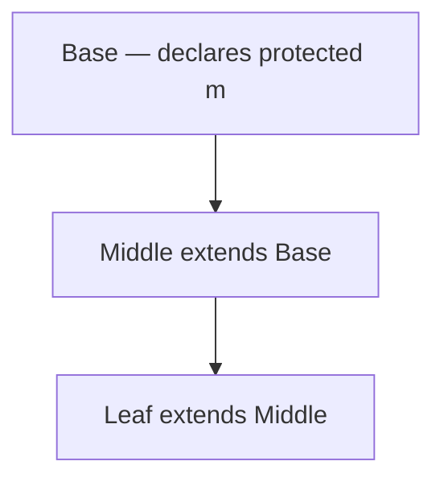

# 24. Property access, end to end   ⟨I · B · ~~J~~ · ~~N~~⟩

`obj.name` is not a lookup. It is a fixed sequence of thirteen steps, and the order of
those steps is not a performance decision — it is the semantics. A getter must be *called*,
not read. A proxy must answer from its trap, not from its target. A `private` field must be
refused. `map.size` is not a property at all. Each of those facts is one step in
`handleLdaProp`, and each of them can change the answer.

The inline cache is step ten. Everything before it exists to decide whether step ten is
even allowed to run. That inversion — most of the fast path spent proving the fast path
applies — is what makes the cached handler in [Ch 34] able to be four integer comparisons
long. A cache may only memoise a decision that has already been made; the twelve steps
around it are the decision.

This chapter walks the sequence once in order, then walks the running example's
`this.values.length` through it twice — because that one source expression compiles to two
`LdaNamedProperty` instructions, and they take completely different routes through the same
handler. The first ends in a map, an offset and a cache entry. The second falls out of the
bottom of the function without touching any of it.

**What arrived.** From [Ch 23 § arrays-are-not-objects]: a `JSObject` whose `HiddenClass`
carries an `id`, a `version`, an `isDeprecated` flag, a `protoObject` and a
`prototypeValidityCell` shared with its add-transition children; a flat `slots` array
addressed by integer offset, with `overflowProperties` holding anything from offset ten up;
`AccessorPair` sharing those slots with data values, distinguished only by the descriptor's
`kind`; and `lookupPrototypeChain` returning `{found, value, owner, descriptor, depth}`,
with `owner` and `depth` reported separately. And the explicit warning that a `JSArray` is
*not* a `JSObject` and cannot answer `length` this way. From [Ch 21], the ten opcodes lifted
out of the dispatch switch into `handlers.ts`, named but not opened.

## `lda-prop` — the sequence, in order

`handleLdaProp` runs from `src/bytecode/register/interpreter/handlers.ts:177` to `:288`.
It has no helper functions of its own and no early abstraction; read top to bottom, the
function *is* the specification of what a property read means in this engine. Numbered as
they appear:

| # | line | step |
| --- | --- | --- |
| 1 | 184-188 | read the receiver register; resolve the name from the constant pool |
| 2 | 190 | `throwIfNullish` |
| 3 | 192-194 | if the receiver is not an object, record its tag as a primitive receiver |
| 4 | 196-198 | proxy? — hand the whole access to `runtimeGetProperty` |
| 5 | 200-202 | object? — `assertObjectMemberAccess` |
| 6 | 204-212 | own accessor? — call the getter, return |
| 7 | 213-227 | prototype-chain accessor? — call the getter, return |
| 8 | 229-233 | `size` on a `Map` or `Set` |
| 9 | 235-248 | string-wrapper `length` and integer index |
| 10 | 250-252 | `ic.lookup(jsObj, propName)` |
| 11 | 254-259 | `recordPropertyFeedback` |
| 12 | 261-278 | on a hit, the cached value; on a miss, `getProperty` then `lookupPrototypeChain` |
| 13 | 280-289 | not an object at all — the array-`length` feedback record, then `memberLookupValue` |

Twelve of the thirteen steps exist to decide whether step 10 is allowed. Steps 6, 7, 8 and
9 all `return` before reaching it; steps 2, 4 and 5 divert or abort; step 3 records
something a cache could never hold; step 13 is the receiver kinds the cache does not
understand at all. The cache and its feedback record — steps 10, 11 and 12 — are the only
part of the function that assumes it is looking at an ordinary data property on an ordinary
object.

That is why the rest of this chapter is organised as "the things that come before the
cache", and why it ends with what one access leaves behind rather than with how the cache
works. [Ch 34] is the cache.

## Why the obvious design fails — cache first, correct later

The design a reader proposes on first hearing is: check the inline cache first. It is the
fast path; the whole point of a cache is not to do the slow work. Fall back to the long
sequence only on a miss.

Break it four ways, each with a program that already runs in this tree.

**A getter would be read instead of called.** A class accessor stores an `AccessorPair` in
the same slot a data property would use ([Ch 23 § accessors-share-the-slot]). A cache
keyed on "map 87, offset 0" would find the pair and hand it back as a value. The program
would receive a function object where it expected an integer. `handleLdaProp` avoids this
by testing `desc.kind === "accessor"` at step 6, before the cache exists — and the miss
path at step 12 filters the pair out a second time, `!(cached instanceof AccessorPair)`,
because a stale entry could still hold one.

**A proxy would answer from its target.** `isJSProxyValue` is step 4, and it hands the
entire access away. A cache consulted first would find the *target's* map and the target's
offset and return the target's value, silently skipping the `get` trap the program wrote.
There is no way to repair that after the fact: the trap may compute an answer that exists
nowhere in memory.

**A `private` member would be readable from outside its class.** `assertObjectMemberAccess`
is step 5. It throws. A cache hit would return the value and never ask.

**`map.size` would resolve to whatever `size` a user once stored.** `size` on a `Map` is
not a property at all — step 8 reads `jsObj._mapData!.size`, a *host* `Map`'s size, from a
field that has no descriptor and no offset. A cache keyed on the map's shape would answer
from `slots` and be wrong in a way no amount of version-checking could detect, because
nothing about the shape changed.

The rule: **a cache may only memoise a decision that has already been made.** Everything
that can change the decision must run first. This is why the fast path in this engine is
thirteen steps long, and it is also why [Ch 34]'s handlers can be as small as they are —
by the time one is consulted, "this is an ordinary data property on an ordinary object with
this prototype" is already established, and the handler only has to check that it still is.

## Nullish first

Step 2 is the only step that can run before the receiver's kind is known, because it is the
only question that has the same answer for every kind.

```ts
function throwNullishAccess(
  isNullObj: boolean,
  propName: string,
  write: boolean,
): never {
  const typeName = isNullObj ? "null" : "undefined";
  const verb = write ? "set" : "read";
  const gerund = write ? "setting" : "reading";
  throw new VMTypeError(`Cannot ${verb} properties of ${typeName} (${gerund} '${propName}')`);
}

function throwIfNullish(obj: TaggedValue, propName: string, write = false): void {
  if (isNull(obj) || isUndefinedVal(obj)) {
    throwNullishAccess(isNull(obj), propName, write);
  }
}
```

— `src/bytecode/register/interpreter/handlers.ts:149-164`

The message is composed from two booleans, so one factory covers four sentences: read or
write, `null` or `undefined`. [Ch 22]'s two absence values are *merged* in the predicate —
`isNull(obj) || isUndefinedVal(obj)`, one branch — and *distinguished* in the text, because
`isNull(obj)` is passed separately to pick the type name. That is the right split: the
engine does not care which absence it is, and the programmer reading the error does.

Reading `x.foo` where `x` is `undefined` prints:

```
Cannot read properties of undefined (reading 'foo')
```

`throwIfNullishKey` (166-175) is the same check for a computed key `o[k]`, and it renders
the key with `toDisplayString` when it is not already a string, so the message names what
the program actually wrote.

## Accessors before the cache

Steps 6 and 7 are nearly identical, and the difference between them is the whole reason
`lookupPrototypeChain` reports `owner` and `depth` separately from `value`:

```ts
    const accDesc = jsObj.hiddenClass.lookupProperty(propName);
    if (accDesc && accDesc.kind === "accessor") {
      const pair = jsObj.storedProperty(propName);
      if (pair instanceof AccessorPair && pair.get) {
        return interp.callFunctionValue(pair.get, [], obj);
      } else {
        return mkUndefined();
      }
    }
```

— `src/bytecode/register/interpreter/handlers.ts:204-212`

Step 7 (213-227) repeats it against `jsObj.lookupPrototypeChain(propName)` — which is where
a class getter actually lives, since accessors are declared on the prototype, not on the
instance. Both call `interp.callFunctionValue(pair.get, [], obj)`.

> **New idea.** *Receiver versus owner.* The access started at `obj`; the getter was found
> on some object further up the prototype chain. The getter must be invoked with `obj` as
> `this`, not with the object that declared it — otherwise a getter that reads `this.v`
> would read the prototype's `v` instead of the instance's, and every subclass would see
> the base class's fields. The third argument to `callFunctionValue` above is `obj`, the
> receiver, in both branches. `lookupPrototypeChain` returns `owner` precisely so the two
> can be kept apart.

Two consequences travel forward.

**An accessor with no getter answers `undefined` rather than throwing.** The `else` branch
above is `mkUndefined()`. A write-only property reads as absent.

**An accessor site is never cached and never profiled.** Both branches `return` before step
10, so `ic.lookup` is never reached. And `recordPropertyFeedback` bails out independently,
in both of its own branches:

```ts
  const info = jsObj.hiddenClass.lookupProperty(propName);
  if (info) {
    if (info.kind === "accessor") return;
```

— `src/bytecode/register/interpreter/handlers.ts:126-128`; the prototype-side twin is at
`:138`

So the feedback slot for an accessor site stays `uninitialized` for the life of the
process.

> **Unfinished.** Accessor properties are outside the feedback and inline-cache system
> entirely. `handleLdaProp:205-227` returns from both accessor branches before `ic.lookup`,
> and `recordPropertyFeedback` (`handlers.ts:128`, `:138`) returns early on
> `kind === "accessor"` in both of its branches. There is no accessor handler among the
> five property-handler kinds in `src/feedback/ic/index.ts:42-47` — `LoadFieldHandler`,
> `ProtoLoadFieldHandler`, `StoreFieldHandler`, `TransitionStoreHandler`,
> `MissingPropertyHandler`. Consequently a getter can never be inlined or speculated on by
> [Ch 49]. Finishing it means a handler that caches *which getter* rather than which
> offset, plus a dependency on the accessor's map so redefining it invalidates the entry.

Reproducing that costs one class:

```
class Cell:
  public constructor(v: int):
    this.v = v
  public get doubled() -> int:
    return this.v * 2
c = Cell(21)
print(c.doubled)
print(c.v)
```

```
$ node dist/cli.js --trace /tmp/accessor.tera | grep -E '^\[IC\]|^\[FB\]'
[FB] Slot #0: call — uninitialized → monomorphic
[IC] Site #1311578855: uninitialized → monomorphic (map=HC87, offset=0)
[FB] Slot #0: property — uninitialized → monomorphic
[FB] Slot #0: binary_op — uninitialized → monomorphic
[FB] Slot #0: call — uninitialized → monomorphic
[IC] Site #3818079681: uninitialized → monomorphic (map=HC87, offset=0)
[FB] Slot #0: property — uninitialized → monomorphic
[FB] Slot #0: call — uninitialized → monomorphic
```

Two `[IC]` lines and two `[FB] … property` lines, and neither pair belongs to
`c.doubled`. Both are at `map=HC87, offset=0`, which is `v`: the first is the `this.v`
read *inside* the getter, the second is the direct `c.v` on the last line. The read of
`doubled` itself left no trace at all. `[unpinned]` — no test covers the absence.

> **Broken.** The `Slot #0` in every `[FB]` line above is a literal zero, not the slot
> index. `FeedbackSlot._advanceLattice` passes a hardcoded `0` to `tracer.feedbackRecord`
> (`src/feedback/vector/index.ts:189`), so no site, offset or owning function is printed
> and "the same site went polymorphic" cannot be read off the flag — only "some site of
> this kind did". The `[IC]` lines carry a real site key and are the usable half. Fixing it
> is threading the real slot index through that one call.

## Exotic fast paths

Steps 8 and 9 are three special cases, all keyed on `hiddenClass.instanceType`, all before
the cache.

> **New idea.** *Exotic object.* The ECMAScript term for an object whose property access
> does not mean "look in the slots". A `Map`'s `size`, a proxy's every property, a
> function's `name` — each is computed rather than stored. The engine's directory for them
> is `src/objects/exotic/`, so the book uses the specification's word.

`size` on `INSTANCE_TYPE_MAP` reads `jsObj._mapData!.size` and on `INSTANCE_TYPE_SET` reads
`jsObj._setData!.size` (229-233) — a host `Map`'s size, not a property, with no descriptor
and no offset. `length` and integer indices on `INSTANCE_TYPE_STRING_WRAPPER` read
`_primitiveValue` through `stringCharAt` (235-248), which brings [Ch 26]'s negative-index
convention forward: `stringCharAt` accepts `-1` and means the last character.

They live here, in the interpreter handler, rather than in [Ch 25]'s member-lookup table,
for one structural reason: **the receiver is a `JSObject`**. `isObject(obj)` is true, so
control never reaches step 13, and the table indexed by tag code would never see it. A
boxed string is an object as far as the tag is concerned; only `instanceType` says
otherwise.

> **Dead.** `handlers.ts:38-39` imports `INSTANCE_TYPE_NUMBER_WRAPPER` and
> `INSTANCE_TYPE_BOOLEAN_WRAPPER`. Neither appears anywhere else in the file — the only
> `instanceType` comparisons are `INSTANCE_TYPE_MAP` (231), `INSTANCE_TYPE_SET` (232) and
> `INSTANCE_TYPE_STRING_WRAPPER` (237). Those two wrappers are built by `boxPrimitive`
> (`src/bytecode/register/interpreter/index.ts:260`) and get their members from their
> prototypes by the ordinary route, so nothing is broken; the imports are the residue of a
> symmetry that was never built. Deleting them costs two lines.

## Proxies and symbol keys

Step 4 is checked *fourth*, before the object branch, and it does not do part of the work
— it hands the entire access to `runtimeGetProperty` and returns.

`runtimeGetProperty` (`src/objects/exotic/proxy-ops.ts:362-477`) is a second, independent
implementation of the same ordering: symbol key, then proxy, then object, then array, then
string, then function. What the two share is `ordinaryGetObject` (221-252), which re-does
the visibility check, the own-accessor test and the prototype-chain accessor test — and
which takes `taggedReceiver` as a *separate* parameter from `obj` for exactly the
receiver-versus-owner reason above.

What only the generic implementation has:

- **Symbol keys.** `isSymbol(key)` is its first test, and it routes to
  `getSymbolProperty` on the object or array payload. `handleLdaProp` never sees a symbol,
  because `constantPropertyName` stringifies the constant.
- **`get`-trap invariant checks.** After calling a `get` trap, `targetOwnDataInvariant`
  (53-…) asks whether the target has a non-configurable own property of that name, and if
  it does, the trap's answer is checked against it. Returning something other than the
  target's value for a non-configurable, non-writable data property throws verbatim:
  `'get' on proxy: property 'x' is a read-only and non-configurable data property on the
  proxy target but the proxy did not return its actual value`.
- **Recursion through `proxy.target`** with `originalReceiver` preserved, so a proxy
  wrapping a proxy wrapping an object still reports the outermost receiver to every trap
  [t: tests/objects/exotic/proxy-ops.test.ts > "get on proxy without trap falls through to target"].
- **The `obj._index` hook**, a host-installed integer indexer that `handleLdaProp` does not
  consult.

Symbol properties are a **third storage class**, beside `slots` and `overflowProperties`:

```ts
export function readSymbolProperty(
  owner: SymbolKeyed,
  taggedSym: TaggedValue,
): TaggedValue | undefined {
  if (!owner.symbolProperties) return undefined;
  return owner.symbolProperties.get(getPayload(taggedSym));
}
```

— `src/objects/heap/symbol-properties.ts:7-13`

The map is keyed by `getPayload(taggedSym)` — the `JSSymbol` object itself, so two symbols
with the same description are different keys — and it lives on the *instance*.

> **Unenforced.** Symbol-keyed properties bypass the hidden class completely. They cause no
> transition, appear in no `getOwnPropertyNames`, have no descriptor, no offset and no map
> version, and can therefore never be inline-cached. Nothing in the source states that
> invariant; it is visible only as the *absence* of a `symbolProperties` field from
> `HiddenClass` and the presence of one on `JSObject` and `JSArray`. `[unpinned]`

> **Unenforced.** `handleLdaProp` and `runtimeGetProperty` are two independent
> implementations of one ordering, and nothing checks that they stay in step. They already
> differ: the generic one has symbol keys, the invariant checks and the `_index` hook and
> returns `mkUndefined()` for a nullish receiver instead of throwing; the handler has the
> string-wrapper fast path, the feedback records and the inline cache. Because step 4
> delegates, a single access can traverse both. The only thing keeping them agreeing is
> `tests/e2e/optimizing/member-access.test.ts`'s cross-tier differential.

Proxies proper — the full trap protocol, `has`, `ownKeys`, `defineProperty` — are
[Ch 26]'s subject.

## Visibility at every site

Step 5 runs on **every** object property read, before anything is looked up:

```ts
export function assertObjectMemberAccess(
  receiver: RuntimeObjectLike,
  owner: RuntimeObjectLike | null,
  propName: string,
  interpreter?: unknown,
): void {
  const access = instanceMemberAccess(receiver, owner, propName);
  if (!access || memberAccessAllowed(access, objectConstructor(receiver), interpreter)) return;
  throwAccess(access, propName);
}
```

— `src/runtime/class-access.ts:53-62`

`instanceMemberAccess` delegates to `findMemberAccess`, which climbs the constructor's
`staticBase` chain looking for the name in `classInstanceMemberVisibility` (115-127). A
member declared `private` five classes up is still found, because the walk does not stop at
the first class — it stops at the first class whose visibility table mentions the name.

`memberAccessAllowed` is where the interesting question is asked:

```ts
  if (access.visibility === "public") return true;
  const caller = currentClassOwnerName(interpreter);
  if (!caller) return false;
  if (access.visibility === "private") return caller === access.ownerName;
  return caller === access.ownerName || lineageIncludesBeforeOwner(targetCtor, caller, access.ownerName);
```

— `src/runtime/class-access.ts:134-138`

`currentClassOwnerName(interpreter)` asks *the interpreter* which class is currently
executing. That is the only available static information at run time, and it is how a
method of the owning class is distinguished from an outside caller. If there is no such
class — top-level code, the REPL — `caller` is null and every non-public member is refused.

`protected` is the subtle case, and `lineageIncludesBeforeOwner` (154-166) is its rule:



Reading `m` on a `Leaf` receiver from inside `Middle` is allowed: the walk over the
receiver's `staticBase` chain runs `Leaf → Middle → Base`, sees the caller `Middle` before
it reaches the owner `Base`, and returns `sawCaller`. Reading it from a class that is *not*
on that chain fails, because the loop reaches `Base` with `sawCaller` still false. The
initial `sawCaller = callerName === ownerName` covers the owning class reading its own
member on a subclass receiver.

Why re-check at run time when the type checker already rejects it statically? Because the
checker is not the only way in. `--eval`, the REPL, a host embedder calling into the engine,
and a computed key `o[name]` where `name` is not a literal all reach the same handler with
no static information at all. The refusal is verbatim:

```
$ node dist/cli.js /tmp/private.tera
7
Cannot access private member 'secret' of 'Box'
```

The `7` is `b.peek()`, which is allowed because the caller is `Box`; the next line is
`b.secret` from top level, which exits 1. The end-to-end tests cover the whole lineage
walk, and one of them checks that the guard survives the tier the access is running in
[t: tests/e2e/optimizing/member-access.test.ts > "keeps private instance reads guarded after warmup"]
[t: tests/e2e/language/classes.test.ts > "initializes and guards private instance fields"]
[t: tests/e2e/language/classes.test.ts > "allows protected subclass access and rejects external access"].

## Functions are not objects

A `TaggedValue` with `CODE_FUNCTION` has a `RuntimeFunctionPayload`, not a `JSObject`.
`isObject` is false, so none of steps 5 through 12 applies, and the access falls to step 13
and out through `memberLookupValue` to `functionMemberValue`
(`src/objects/exotic/function-members.ts:112-138`) — a different protocol entirely.

It begins with `resolveFunctionSlot`:

```ts
function resolveFunctionSlot(fn: RuntimeFunctionPayload, propName: string): FunctionSlot | null {
  for (let current: RuntimeFunctionPayload | null | undefined = fn; current; current = current.staticBase) {
    if (hasOwn(current.accessors, propName)) return { kind: "accessor", accessor: current.accessors![propName], owner: current };
    if (hasOwn(current.properties, propName)) return { kind: "data", value: current.properties![propName], owner: current };
  }
  return null;
}
```

— `src/objects/exotic/function-members.ts:33-39`

That walk *is* static-member inheritance: a static field or static getter declared on a
base class is found on the derived constructor because `staticBase` links them
[t: tests/e2e/language/classes.test.ts > "inherits static members through the constructor chain"].
Accessors are checked before data at each level, so a static getter shadows a same-named
static field on the same class.

Only if the walk finds nothing do the synthesised members run, in this order (126-136):
`call`, `apply` and `bind`; then `name`; then `length` from `functionArity`; then
`prototype`, created lazily on first read and back-linked through `constructorRef`.

The ordering rule that falls out is worth stating: **an own property always wins over a
synthesised one**
[t: tests/e2e/optimizing/member-access.test.ts > "keeps a user-set own property winning over a builtin member"].
A program that assigns `f.name = "x"` gets `"x"` back, because `resolveFunctionSlot` looked
first.

Two details worth one sentence each. `makeFunctionMethod` (53-101) builds a **fresh**
function object for `call`, `apply` or `bind` on every access. And a bound function's
`construct` deliberately ignores its own `this` and calls the target with `mkUndefined()`
(91-97), so `new (f.bind(x))()` does not smuggle `x` in as the receiver.

> **Unfinished.** Because `makeFunctionMethod` runs on every access, `f.call` allocates a
> `RuntimeFunctionPayload` and a `ValueHeap` slot each time it is read, and `f.call ===
> f.call` is false. Memoising the three on the payload beside `properties` would cost one
> lazy field; nothing currently does. `[unpinned]`

## The second hop — `this.values.length`

Line 9 of the running example is `while i < this.values.length`. One expression, two
`LdaNamedProperty` instructions:

```
     8  LdaNamedProperty r4 [1] (values) r0
    10  LdaNamedProperty r3 [2] (length) r1
```

— `node dist/cli.js --print-bytecode --filter mean docs/example/stats.tera`

Same opcode, same handler, two completely different routes.

**First hop.** `this` is a `Series` instance, so `isObject` is true and steps 5 through 12
all run. Visibility passes; there is no accessor named `values`; the instance type is
`JS_OBJECT`, so steps 8 and 9 do not fire; `ic.lookup` runs against `HC89` and, first time
round, misses; `recordPropertyFeedback` writes `(89, version, 1, 0)` into the feedback
slot; the miss path reads `jsObj.getProperty("values")` and returns it. The trace shows
the cache entry being created and then hit:

```
[IC] Site #2846148340: uninitialized → monomorphic (map=HC89, offset=1)
...
[IC] Site #2846148340: HIT monomorphic (map=HC89)
```

That is the `this.values` in the loop condition. The body's `this.values` is a *different*
site — `#2960664944`, same map, same offset — because a site is a `(function, feedback
slot)` pair and not a `(map, name)` pair. `mean` reads `this.values` three times and owns
three cache entries.

**Second hop.** The receiver is now a `JSArray`. `isObject(obj)` is false, so *every*
object branch — 5 through 12 — is skipped in one test. The only thing that happens before
the fall-through is:

```ts
  if (isArray(obj) && propName === "length" && compiledFn.feedbackVector) {
    compiledFn.feedbackVector
      .getSlot(fbSlotIdx)
      ?.recordArrayLengthAccess(true, getPayload(obj).getElementsKind());
  }
```

— `src/bytecode/register/interpreter/handlers.ts:280-284`

That is [Ch 23]'s elements kind entering the feedback vector, and it is the exact fact
`stats-deopt.tera` later invalidates ([Ch 23 § where-elements-kind-is-invalidated]). No
map, no offset, no IC entry. Then line 286: `memberLookupValue(obj, propName, interp)`,
with nothing behind it.

An array's `length` is answered by nobody in this chapter.

One note on the disassembly above. The trailing `r0` and `r1` on those two lines are
**feedback slot indices, not registers**. The disassembler prefixes every operand it does
not specially format with `r` (`src/bytecode/register/ops/bytecode.ts:649`), and the same
wart makes `JumpIfFalse r32 r3` print a jump *target* as `r32`. Said once, per
[Conventions § 4](../CONVENTIONS.md); the tool's output is quoted as it prints. `[unpinned]`
— nothing tests the disassembler's operand formatting.

## Store is not load

`handleStaProp` (291-373) shares the prefix and then diverges. Same steps 1 and 2
(`throwIfNullish(obj, propName, true)` — the `write` flag that changes the message from
"read" to "set"), same proxy hand-off, same visibility check, same accessor branches, same
`getICKey` and feedback record. Three things are different, and one whole tail is new.

**The integrity flags are checked here and nowhere else on the object path:**

```ts
    if (jsObj._frozen) return;
    if (
      (jsObj._sealed || jsObj._nonExtensible) &&
      !jsObj.hiddenClass.lookupProperty(propName)
    )
      return;
```

— `src/bytecode/register/interpreter/handlers.ts:317-322`

A frozen object silently drops the store. A sealed one drops only stores that would *add* a
property. [Ch 23 § integrity-levels] explains why these are booleans on the payload rather
than the map's `integrityLevel`, and what the mismatch costs.

**`ic.lookupForWrite(jsObj, propName, value)`** replaces `ic.lookup`. Its interesting case
is the *transitioning* store — the store that adds a property and therefore moves the
object to a different map. That is why the handler kinds in [Ch 34] include a
`TransitionStoreHandler` separate from `StoreFieldHandler`.

**`enforceAccess`** is a sixth parameter, defaulting true, and step 5 is guarded by it
(`:315`). A constructor initialising its own `private` fields passes `false`.

Then the tail `handleLdaProp` does not have. Where a load falls out to
`memberLookupValue`, a store dispatches on receiver kind inline (357-373): an array routes
`length` to `setLength`, an integer name to `setIndex` and anything else to `setProperty`;
a function goes to `setFunctionMember`; a regex accepts exactly `lastIndex` and nothing
else.

> **Broken.** `handleDeleteProp` (`handlers.ts:689-709`) discards the boolean
> `runtimeDeleteProperty` returns and unconditionally answers `mkBool(true)`, so `delete
> o.x` reports success even when the property is non-configurable and the delete did not
> happen. It also never checks `_frozen` or `_sealed`, which is the second half of the
> frozen-object defect in [Ch 23 § integrity-levels]. Fixing it is one `return` line; the
> reason to name it here is that this is the access site, and the access site is where this
> book has agreed such rules live. `[unpinned]`

> **Unenforced.** `InterpreterLike` (`handlers.ts:77-101`) is a hand-written structural copy
> of the twelve interpreter members these handlers use — `callFunctionValue`,
> `constructFunctionValue`, `execute`, `runFrame`, `initFeedbackVector`,
> `getConstructorStub`, `_lookupBuiltinPrototype`, `icManager`, `builtinPrototypes`,
> `microtaskQueue`, `suspendedFrames`, `exceptionToValue`. It is not derived from
> `RegisterInterpreter` and there is no `satisfies` clause linking them, so the two can
> drift until a call fails at run time. [Ch 21] names this as the price of lifting the ten
> opcodes out of the dispatch switch; this is the chapter that spends it.

## `property-access` — what one access leaves behind

An object access leaves two records, at two different addresses, and every later part of
the book reads one or the other.

**The feedback slot.** `recordPropertyAccess(hiddenClassId, offset, mapVersion,
protoDepth)` (`src/feedback/vector/index.ts:202`) appends to four parallel arrays — `maps`,
`mapVersions`, `offsets`, `protoDepths` — one entry per distinct map the site has seen, and
advances a lattice `uninitialized → monomorphic → polymorphic → megamorphic` as it goes.
`protoDepth` is `0` for an own property and `protoResult_.depth` for an inherited one, so
the tuple records not just where the value is but how far up it was found.

**The inline cache entry**, under a key `getICKey` memoises per function
(`src/bytecode/register/ops/bytecode.ts:517-525`):
`(funcName || "<anonymous>") + "#" + this.id + ":" + i` — so `mean#7:1`. The key is built
once per function and reused for every execution, which is why one site's history
accumulates across calls rather than restarting.

Both move together. `stats-poly.tera` introduces a second class with the same member names,
which drives one site off monomorphic in a single pair of trace lines:

```
[IC] Site #2944030887: monomorphic → polymorphic (map=HC92, offset=1)
[FB] Slot #0: property — monomorphic → polymorphic
```

— `node dist/cli.js --trace docs/example/stats-poly.tera | grep polymorphic`

Site `#2944030887` is the same site that was `(map=HC89, offset=1)` in `stats.tera` — but it
is not one of `mean`'s reads. It is `report`'s `s.label`: the one site in the program whose
receiver is a function parameter, and therefore the only one either program can hand two
different maps. In `stats.tera` it sees `Series` twice and stays monomorphic; in
`stats-poly.tera` the second call passes a `Constant`, whose instance map is `HC92`, and
whose prototype also carries `label` at offset 1. Same offset, different map — which is
exactly the case a polymorphic cache exists for, and exactly the case a single-entry cache
would thrash on. `mean`'s three `this.values` sites never move: every receiver they ever see
is a `Series`.

Three destinations, and this chapter stops at the handover to each: [Ch 33] reads the slot
and explains the lattice, [Ch 34] explains the handler installed at step 10, [Ch 49]
speculates on the four-tuple, and [Ch 54] is what happens when the speculation turns out to
be wrong.

And one thing is deliberately *not* resolved. Every receiver that is not a `JSObject` —
array, string, number, function, promise, generator — left this chapter through one
unresolved call at line 286, with nothing behind it.

## What leaves

Two things, and [Ch 25] takes only the second.

First, for a `JSObject` receiver: a resolved `TaggedValue`, plus a filled `FeedbackSlot`
carrying `(mapId, version, offset, protoDepth)` in four parallel arrays, plus a warm
`InlineCache` entry under the site key `funcName#fnId:slot`. That pair is the entire input
to [Ch 33] and [Ch 34], and [Ch 54] is what happens when it lies. It is also the pair that
does *not* exist for an accessor site, a symbol key or a proxy — three receivers that
travel the same handler and leave no cacheable record.

Second, for every receiver that is not a `JSObject`: a single unresolved call,
`memberLookupValue(obj, propName, interp)`, sitting at `handlers.ts:286` as the last
statement before the return. The same call appears at `:426` for a computed string key, at
`src/optimizing/baseline/runtime.ts:338` for the baseline tier, and inside
`getRuntimeProperty` (`src/runtime/value-semantics.ts:41-50`) for everything else. Three
tiers, one function, and [Ch 25 § memberlookups-a-jump-table] opens it.

## Verify it yourself

```bash
# One source expression, two LdaNamedProperty instructions — lines 8 and 10.
node dist/cli.js --print-bytecode --filter mean docs/example/stats.tera

# The object hop leaves an [IC] line; the array hop leaves nothing.
node dist/cli.js --trace docs/example/stats.tera | grep -E '^\[IC\]' | head -8

# A second class with the same member names drives one site polymorphic.
node dist/cli.js --trace docs/example/stats-poly.tera | grep -E 'polymorphic' | head -6

# A getter is called, not cached: no [IC] or [FB] record for c.doubled itself.
printf 'class Cell:\n  public constructor(v: int):\n    this.v = v\n  public get doubled() -> int:\n    return this.v * 2\nc = Cell(21)\nprint(c.doubled)\nprint(c.v)\n' > /tmp/accessor.tera
node dist/cli.js --trace /tmp/accessor.tera | grep -E '^\[IC\]|^\[FB\]'

# Visibility is checked at the access site, not only by the checker. Prints 7, then exits 1.
printf 'class Box:\n  private secret: int = 7\n  public peek() -> int:\n    return this.secret\nb = Box()\nprint(b.peek())\nprint(b.secret)\n' > /tmp/private.tera
node dist/cli.js /tmp/private.tera; echo "exit=$?"

# The generic protocol and the cache's own state machine.
npx vitest run --project unit tests/objects/exotic/proxy-ops.test.ts tests/feedback/ic.test.ts
```

The private-member run prints `7` and then
`Cannot access private member 'secret' of 'Box'`, exit 1. The last command reports
`Test Files 2 passed (2)` / `Tests 80 passed (80)`.

## Tests that pin this

- `tests/objects/exotic/proxy-ops.test.ts` > `"reads named properties from plain object"`,
  `"returns undefined for missing property"`, `"reads array index from tagged array"`,
  `"reads .length from array"`, `"reads string .length"`,
  `"reads string character by index"`,
  `"reads function .prototype (auto-creates if missing)"` — the generic protocol's branch
  order, one test per branch, including the lazily created `prototype`.
- `tests/objects/exotic/proxy-ops.test.ts` > `"isJSProxyValue detects proxy-wrapped objects"`,
  `"get on proxy without trap falls through to target"`,
  `"has on proxy without trap falls through to target"`,
  `"set on proxy without trap falls through to target"`,
  `"delete on proxy without trap falls through to target"`,
  `"ownKeys on proxy without trap falls through to target"` — the recursion through
  `proxy.target`.
- `tests/objects/exotic/proxy-ops.test.ts` > `"sets named property on plain object"`,
  `"sets array element by index"`, `"sets array length to truncate"` — the store side.
- `tests/feedback/ic.test.ts` > `"matches when hcId, version match and not deprecated"`,
  `"misses on different hcId"`, `"misses on different version"`, `"misses on deprecated"`,
  `"executes by reading property at offset"` — what the handler installed at step 10
  re-checks. [Ch 34] develops these.
- `tests/feedback/ic.test.ts` > `"matches when receiver and proto pass all checks"`,
  `"misses a same-map receiver whose prototype differs"`,
  `"misses when an intermediate prototype link is replaced"`,
  `"misses when proto validity version changes"`, `"misses when proto deprecated"` —
  `ProtoLoadFieldHandler`, i.e. a cached `protoDepth > 0` access.
- `tests/feedback/ic.test.ts` > `"always returns undefined"`,
  `"misses a same-map receiver carrying a different prototype"`,
  `"misses when the prototype later gains properties"` — `MissingPropertyHandler`: absence
  is cached too, and is the harder claim to keep sound.
- `tests/feedback/ic.test.ts` > `"transitions uninitialized -> monomorphic -> polymorphic on different objects"`,
  `"hits on monomorphic fast path"`, `"hits on polymorphic path"`,
  `"transitions to megamorphic after 8 unique classes"` — the state machine behind the
  `[IC] Site …` trace lines.
- `tests/e2e/optimizing/member-access.test.ts` > `"reads .length (arity) and .name, including on a returned closure"`,
  `"invokes a function via .call and .apply"`,
  `"keeps a user-set own property winning over a builtin member"` — the function-member
  protocol, and the own-property-wins ordering, checked against every tier.
- `tests/e2e/optimizing/member-access.test.ts` > `"keeps private instance reads guarded after warmup"`
  — visibility survives the tier the access is running in, which is the reason the check is
  at the access site rather than in the checker alone.
- `tests/e2e/optimizing/member-access.test.ts` > `"reads length, a character, and a method via a computed key"`,
  `"keeps optional computed access short-circuiting on nullish"`,
  `"indexes a string with a negative (python-style) index"`,
  `"resolves computed string keys on a hot (compiled) call"`,
  `"calls a string method on the string, not on undefined"`,
  `"short-circuits to null on a nullish receiver"`,
  `"calls a method on an object receiver"` — the string-wrapper and optional-access paths,
  and the receiver-preservation rule.
- `tests/e2e/language/classes.test.ts` > `"initializes and guards private instance fields"`,
  `"guards private methods while allowing owner calls"`,
  `"allows protected subclass access and rejects external access"`,
  `"guards private and protected static members"`,
  `"inherits static members through the constructor chain"`,
  `"keeps static members off instances and instance members off the class"` —
  `class-access.ts`'s lineage walk, including the `protected` rule.
- No test pins the accessor-sites-are-never-cached behaviour, the hardcoded `Slot #0` in
  the `[FB]` trace lines, the `f.call !== f.call` allocation, the symbol-keys-bypass-the-map
  invariant, or the disassembler's `r` prefix on feedback-slot operands. `[unpinned]`
