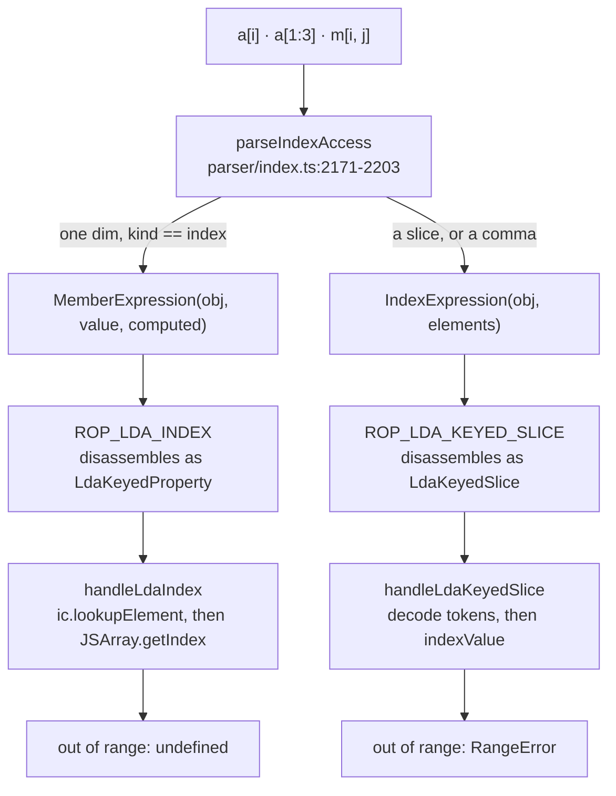

# 26. Indexing, classes, and the objects that are not objects   ⟨I · B · J · N⟩

`a[-1]` answers the last element. `a[99]` answers `undefined`. `m[5, 0]` throws
`Index 5 is out of bounds for array of length 2`. All three are subscripts, all three go
through the same sixty-two lines of arithmetic, and two of them disagree about what
out-of-range means. The disagreement is not a bug and it is not an accident: the two
syntaxes become two different opcodes, decided by the *parser*, and each opcode carries its
own policy. Sharing arithmetic is not sharing policy, and this chapter is largely about the
gap between those two things.

The same gap runs through the rest of the chapter. tera has classes with `private`,
`protected`, `abstract` and static inheritance, and at run time a class is a function
payload with six extra fields whose comparisons all bottom out in a **string**. Two classes
that share a name share visibility, across module boundaries, today, reproducibly. And it
has three kinds of object that are not really objects — a proxy, a collection, a primitive
wrapper — each of which opts out of the hidden-class machinery of [Ch 23 § hidden-classes-what-an-object-is]
by a different route, and one of which, `EphemeronHashTable`, does not implement the
algorithm its name claims.

`docs/example/stats.tera` reaches exactly one line of this. Its `mean` loop compiles
`this.values[i]` to a single `LdaKeyedProperty`, and that is the whole of the spine's
involvement: no slice, no multi-dimensional index, no `Map`, no `WeakMap`, no proxy, no
private member, no static. [Part IV § what-the-running-example-cannot-reach-here] warned that
this chapter would be in that position. Per [Conventions § 2] it says so here rather than
contriving a ninth variation file: everything below the first section is demonstrated with
short purpose-built probes, run outside the repository, and each one is printed in full so
you can retype it.

**What arrived.** From [Ch 25 § what-leaves]: `memberLookupValue`'s three-valued contract —
`null` for "not my kind", `mkUndefined()` for "mine and genuinely absent", a `TaggedValue`
for everything else — and, crucially, the receivers it *declines*. A plain `JSObject`,
`null` and `undefined` are holes in `MEMBER_LOOKUPS`, and `getRuntimeProperty`
(`src/runtime/value-semantics.ts:41-50`) discharges that decline by calling
`proxyRuntimeGetProperty`. Chapter 25 resolved members by **name**. Everything in this
chapter is reached by something that is not a name: a subscript, a class lineage, or a hook
that replaces the hidden class entirely.

## Indexing: two subscripts, one file

`src/core/indexing.ts` is sixty-two lines and imports nothing. That is unusual enough in a
468-file tree to be worth stating plainly: it is the only module in the indexing story with
no dependencies at all, which is exactly why eight other files can import it. The
interpreter's handlers take it (`src/bytecode/register/interpreter/handlers.ts:58`), the
runtime indexer takes it (`src/runtime/indexing.ts:11`), the checker's length analysis
takes it (`src/frontend/checker/length-bounds.ts:2`), the host bridge's tensor hook takes
its `IndexDim` type (`src/runtime/domain/indexing.ts:3`), `JSObject` takes the same type
inline to declare a hook field (`src/objects/heap/js-object.ts:105`), and three optimizer
passes take it — `array-methods.ts:35`, `array-shapes.ts:67`,
`class-member-lowering.ts:69`.

Two of its exports do all the work:

```ts
export function resolveSlice(
  dim: { start: number | null; stop: number | null; step: number },
  length: number,
): SliceBounds {
  let start = dim.start ?? 0;
  let stop = dim.stop ?? length;
  const step = dim.step;
  if (!Number.isInteger(start) || !Number.isInteger(stop) || !Number.isInteger(step)) {
    throw new RangeError("Slice bounds must be integers");
  }
  if (step <= 0) throw new RangeError("Slice step must be a positive integer");
  if (start < 0) start += length;
  if (stop < 0) stop += length;
  return { start, stop, step };
}

export function normalizeIndex(value: number, length: number): number {
  if (!Number.isInteger(value)) throw new RangeError("Index must be an integer");
  return value < 0 ? value + length : value;
}
```
— `src/core/indexing.ts:7-26`

> **New idea. Normalising an index.** A subscript in this language may be negative, and a
> negative subscript counts from the end: `a[-1]` is the last element. Turning `-1` into
> `length - 1` is called **normalising**. The interesting design question is what to do when
> normalising does not help — `a[-99]` on a three-element array normalises to `-96`, which
> is still not a position. There are two answers. *Clamping* pins the result into
> `0 .. length`, which is what a slice wants: `a[0:99]` should give you the whole array, not
> an error. *Reporting* hands the out-of-range number back and lets the caller decide, which
> is what an index wants, because `a[99]` and `a[2]` are different questions with different
> right answers. `normalizeIndex` does the second. It is three lines, and the third of them
> is the entire policy decision: add the length to a negative, and return whatever that
> gives you.

`normalizeIndex(-5, 4)` is `-1` and `normalizeIndex(9, 4)` is `9`
[t: `tests/core/indexing.test.ts` > "returns an out-of-range result rather than clamping"].
Neither is a valid position; both are handed back. The one thing it does refuse is a
non-integer, and it refuses it by throwing rather than by truncating
[t: `tests/core/indexing.test.ts` > "rejects a non-integer index"].

## Where the policies diverge

The fork happens before either of those functions runs, in the parser, and it is four
lines:

```ts
    if (dims.length === 1 && dims[0].kind === "index") {
      return MemberExpression(obj, dims[0].value, true);
    }
```
— `src/frontend/parser/index.ts:2194-2196`

`parseIndexAccess` (`:2171-2203`) has already collected every dimension between the
brackets into a list of `{kind:"index"}` and `{kind:"slice"}` records. If there is exactly
one and it is a plain index, the whole thing collapses into an ordinary computed
`MemberExpression` — the same node `o[key]` produces — and the `IndexExpression` node is
never built. Anything else, a slice or a comma, builds `IndexExpression`.

Two nodes, two opcodes, two runtime paths, two policies:



> Naming note, per [Conventions § 4]. That one opcode has three names in the tree. The
> constant is `ROP_LDA_INDEX = 0x09` (`src/bytecode/register/ops/bytecode.ts:26`), the
> disassembler prints it as `LdaKeyedProperty` (`:216`), and the handler is called
> `handleLdaIndex` (`src/bytecode/register/interpreter/handlers.ts:376`). Nothing is wrong
> with any of them; they are just three names for the same instruction, and a reader who
> greps for one will not find the others. The code's names win, so this book uses whichever
> one the file under discussion uses, and says which file.

The compiler for the slice branch, `compileIndexExpression`
(`src/bytecode/register/compiler/expressions.ts:812-845`), does something worth seeing. It
cannot pass a variable-length list of dimension shapes in operands, so it encodes the
*shape* as a constant-pool string array and passes only the bound values in registers. Each
index dimension contributes the token `"i"`; each slice contributes `s` followed by three
presence bits for start, stop and step. `m[0:2, 1]` becomes the constant `["s110","i"]` —
a slice with a start and a stop and no step, then an index — and three registers holding
`0`, `2` and `1`:

```
  [14] ["s110","i"]
...
    51  LdaConst [13] (0)
    52  Star r7
    53  LdaConst [7] (2)
    54  Star r12
    55  LdaConst [5] (1)
    56  Star r13
    57  LdaKeyedSlice r6 r14 r7 r12 r13
```
— `node dist/cli.js --print-bytecode` on the four-line probe in "Verify it yourself"

`handleLdaKeyedSlice` (`handlers.ts:436-458`) reads the token array back out of the
constant pool, pulls one register per presence bit, rebuilds `IndexDim[]`, and calls
`indexValue`. The plain-index path never reaches `indexValue` at all: `handleLdaIndex`
(`:376-434`) goes to the inline cache's `lookupElement` and, behind it, to
`JSArray.getIndex`, which answers `undefined` for anything it cannot find.

So the central table of this chapter is three rows and it is decided by punctuation:

| expression | node | opcode | out of range |
| --- | --- | --- | --- |
| `a[-1]` | `MemberExpression` | `LdaKeyedProperty` | `30` — normalised, found |
| `a[99]` | `MemberExpression` | `LdaKeyedProperty` | `undefined`, exit 0 |
| `m[5, 0]` | `IndexExpression` | `LdaKeyedSlice` | `Index 5 is out of bounds for array of length 2`, exit 1 |

There is no flag, no mode and no configuration behind that. Adding a comma to a subscript
changes what an out-of-range read does.

## Slices clamp, indices do not

Inside the throwing path, the two dimension kinds are still not treated alike, and the
difference is the clamp the primer named:

```ts
  for (const dim of dims) {
    if (!isArray(current)) throw new VMTypeError("Too many indices for array");
    const arr = getPayload(current);
    const length = arr.getLength();
    if (dim.kind === "slice") {
      const { start, stop, step } = resolveSlice(dim, length);
      const out: Array<TaggedValue | undefined> = [];
      for (let i = Math.max(0, start); i < Math.min(length, stop); i += step) out.push(arr.getIndex(i));
      current = mkArray(createJSArray(out));
    } else {
      const index = normalizeIndex(dim.value, length);
      if (index < 0 || index >= length) {
        throw new RangeError(`Index ${dim.value} is out of bounds for array of length ${length}`);
      }
      current = arr.getIndex(index) ?? mkUndefined();
    }
  }
```
— `src/runtime/indexing.ts:19-35`

`resolveSlice` normalises and hands back raw bounds, exactly as `normalizeIndex` does. The
clamp lives here, in the loop header: `Math.max(0, start)` and `Math.min(length, stop)`. A
slice that runs off either end simply yields fewer elements
[t: `tests/runtime/indexing.test.ts` > "clamps a slice that runs past the end"], and a slice
whose bounds cross yields an empty array rather than an error
[t: `tests/runtime/indexing.test.ts` > "yields an empty array when the range is inverted"].
The index branch, four lines below, does the opposite: it tests the normalised value
against the range and throws.

That means every `RangeError` `resolveSlice` itself raises is about the slice's *shape* and
never about its range. There are two messages covering three conditions. A non-integer
start, a non-integer stop and a non-integer *step* all produce
`Slice bounds must be integers` — the step is checked by the bounds test, which is worth
knowing because the message does not say so
[t: `tests/core/indexing.test.ts` > "rejects a non-integer bound"]. A step of zero or less
produces `Slice step must be a positive integer`
[t: `tests/core/indexing.test.ts` > "rejects a zero or negative step"]. There is no
backwards slice in this language; a negative step is refused rather than reversed.

`indexString` (`src/runtime/indexing.ts:39-59`) is the same function over characters, with
one consequence that surprises people: because a single character is still a string, the
descent does not stop
[t: `tests/runtime/indexing.test.ts` > "keeps descending because a single character is still a string"],
and `"abc"[0, 0]` is legal while `"abc"[0, 1]` throws
[t: `tests/runtime/indexing.test.ts` > "rejects an index past the end of a character reached by descending"].

## Multi-dimensional means left to right, not per axis

`m[0:2, 1]` looks like numpy. It is not numpy.

```
$ node dist/cli.js idx.tera
30
undefined
[3, 4]
```

with `m = [[1, 2], [3, 4], [5, 6]]`. A numpy reader expects `m[0:2, 1]` to take rows 0 and 1
and then column 1 of each, giving `[2, 4]`. tera gives `[3, 4]`, which is `m[0:2][1]` — the
slice produces a two-element array of rows, and the index then selects the second *row*.

The mechanism is the `current` variable in the excerpt above. `indexArray` does not carry an
axis; it carries a value, and each dimension replaces it. Dimension *k* is applied to
whatever dimension *k-1* produced. This is pinned twice, once for pure indices
[t: `tests/runtime/indexing.test.ts` > "descends dimensions left to right"] and once for the
mixed case
[t: `tests/runtime/indexing.test.ts` > "applies a slice then an index to the sliced result"].
Slicing also copies: the result is a fresh `JSArray`, not a view
[t: `tests/runtime/indexing.test.ts` > "returns a fresh array rather than aliasing the source"],
so nothing that reads a slice can write through it.

[Conventions § 4] applies to the reading, not just to names: the syntax invites an
interpretation the code does not implement, and the code wins. The reason it is worth
labouring is that the *other* implementation of this hook is per-axis. A host object may
carry an `_indexND` field, and `indexValue` will hand it the whole `IndexDim[]`:

```ts
export function indexValue(obj: TaggedValue, dims: readonly IndexDim[]): TaggedValue {
  if (isArray(obj)) return indexArray(obj, dims);
  if (isString(obj)) return indexString(obj, dims);
  if (isObject(obj)) {
    const indexer = getPayload(obj)._indexND;
    if (indexer) return indexer(dims);
  }
  throw new VMTypeError("Indexing expects a Tensor, array, or string");
}
```
— `src/runtime/indexing.ts:61-69`

`src/runtime/domain/indexing.ts` supplies that hook for the tensor type the sibling package
`mlfw` provides. Per [Conventions § 19] the package itself is out of scope and appears here
only at its interface, which is exactly this: a function from `IndexDim[]` to a value,
installed on a side field of a `JSObject`. But its `indexTensor` (`:26-49`) keeps an `axis`
counter and advances it once per dimension, so for a tensor receiver `t[0:2, 1]` really
does mean rows-then-column. One syntax, two meanings, chosen by the receiver's kind. The
hook is pinned
[t: `tests/runtime/indexing.test.ts` > "delegates to the _indexND hook and forwards the dimensions"],
and an object without one is refused rather than silently answering `undefined`
[t: `tests/runtime/indexing.test.ts` > "rejects an object without an indexing hook"].

## The third implementation of the same idea — and the fourth, and the fifth

"The arithmetic is shared" is the tidy version of this chapter's first section. The honest
version is that `normalizeIndex` is one of five places in `src/` that add a length to a
negative subscript, and they do not agree about what happens next.

```ts
  getIndex(index: number): TaggedValue | undefined {
    if (index >= 0 && index < this.elements.length) {
      return this.elements[index];
    }
    if (index < 0) {
      const wrapped = this.elements.length + index;
      if (wrapped >= 0) return this.elements[wrapped];
    }
    return undefined;
  }

  setIndex(index: number, value: TaggedValue): void {
    if (index < 0) {
      index += this.elements.length;
      if (index < 0) return;
    }
```
— `src/objects/heap/js-array.ts:103-118`

`JSArray.getIndex` is the second implementation, and it is the one the `LdaKeyedProperty`
path actually reaches. It wraps negatives with its own arithmetic, does not check that the
subscript is an integer, and answers `undefined` where `normalizeIndex`'s caller throws.
`setIndex` is the third, and it is the one with teeth: a subscript that is *still* negative
after wrapping causes an early `return`. The write is dropped. No exception, no diagnostic,
no change to the array:

```
$ node dist/cli.js idx3.tera
undefined
[10, 20, 30]
[10, 20, 99]
```

Line 2 of that probe is `a[-99]`, which reads `undefined`. Line 3 is `a[-99] = 7`, and line
4 prints the array unchanged. Line 5 is `a[-1] = 99`, which works, because `-1` wraps into
range. The same subscript on the slice path would have thrown.

> **Unfinished.** `src/objects/heap/js-array.ts:115-118`. `JSArray.setIndex` returns
> silently when an index is still negative after wrapping — a dropped write with no
> diagnostic, where `indexValue`'s index branch (`src/runtime/indexing.ts:29-32`) would have
> raised `Index -99 is out of bounds for array of length 3`. Finishing it costs a decision
> about which policy a keyed *store* should follow, and then either a throw here or a range
> check at the two `ROP_STA_INDEX` call sites. Nothing in `tests/` covers the dropped write.
> `[unpinned]`

The fourth is `stringCharAt` (`src/core/value/index.ts:816-818`), one line, which wraps and
answers `undefined` with no integer check at all. The fifth is `selectAxis`
(`src/runtime/domain/indexing.ts:17-24`), which wraps against a tensor's per-axis size,
checks the integer itself, and returns `undefined` so that its caller can throw a
*different* out-of-bounds message naming the dimension.

Five implementations, three out-of-range answers — throw, `undefined`, silently drop — and
one shared helper that only two of them call. That is the shape of the whole chapter in
miniature: the arithmetic is genuinely shared and the policy genuinely is not, and reading
`src/core/indexing.ts` alone will not tell you what `a[99]` does.

## `provenCount`: the same file, a compile-time question

One export in that file is not about running the program at all.

`provenCount(op, bound, negated)` answers a question no interpreter ever asks: given a test
like `q.length > 0`, how many elements does it *prove* are there? It is a `ReadonlyMap` from
operator to a function of the bound — `>` gives `bound + 1`, `>=` and the three equalities
give `bound`, the three inequalities give one or nothing — plus a `COMPLEMENT` map
(`:28-39`) so the refuted arm of a branch can be read as its opposite operator rather than
needing eight more entries. An operator not in the table proves nothing
[t: `tests/core/indexing.test.ts` > "counts nothing from an operator it does not know"].

It lives here because two very different consumers need the same answer.
`src/frontend/checker/length-bounds.ts:94` uses it to decide whether `q.shift()` under a
guard may have its `undefined` stripped — the analysis behind this book's cold open, worked
line by line in [Ch 13 § spending-and-refunding]. And
`src/optimizing/passes/array-methods.ts:678-679` uses it on an SSA graph, asking the same
question of an `IR` comparison instead of an AST node, to decide whether an array method
call can be lowered without a bounds check. Two roads, one table. A fact established in the
front end is not re-derived downstream.

The companion constants are the other half of the same idea and the other half of its
limitation:

```ts
export const TAKES_ONE_ELEMENT: ReadonlySet<string> = new Set<string>(["pop", "shift"]);
export const ADDS_ONE_ELEMENT: ReadonlySet<string> = new Set<string>(["push", "unshift"]);
```
— `src/core/indexing.ts:61-62`

Four names. `splice` is not among them, and [Ch 1 § two-answers-then-and-now] shows what
that costs.

## Classes, at run time, are four fields and a name

After the checker is finished there is no class table. There is no class object in any
registry, nothing indexed by class name, and no runtime type. A class is a
`RuntimeFunctionPayload` — the same record a plain function gets — with a handful of extra
optional fields filled in (`src/core/value/index.ts:186-213`):

| field | holds |
| --- | --- |
| `classOwnerName` | the string every visibility comparison is made against |
| `staticBase` | the payload of the base class, or absent |
| `classInstanceMemberVisibility` | `Record<string, "public" \| "private" \| "protected">` |
| `classStaticMemberVisibility` | the same, for statics |
| `classConstructorVisibility` | one visibility for the constructor |
| `classAbstract` | a boolean |

Statics are ordinary own properties of that payload, in `properties` and `accessors`, and
static inheritance is a walk up `staticBase` — which [Ch 24 § functions-are-not-objects]
already met, in `resolveFunctionSlot`. `staticBase` is written exactly once in the tree, by
`setFunctionStaticBase` (`src/objects/exotic/function-members.ts:176-178`), at
class-declaration time.

The second `staticBase` walk is the one this chapter owns. It looks for a *visibility*
rather than a *value*:

```ts
function findMemberAccess(
  ctor: RuntimeFunctionPayload | null,
  propName: string,
  tableName: "classInstanceMemberVisibility" | "classStaticMemberVisibility",
): MemberAccess | null {
  for (let current = ctor; current; current = current.staticBase ?? null) {
    const table = current[tableName];
    const visibility = table?.[propName];
    if (!visibility) continue;
    return { owner: current, ownerName: ownerNameOf(current), visibility };
  }
  return null;
}
```
— `src/runtime/class-access.ts:115-127`

One loop serves both instance members and statics; the only difference is which of the two
tables it reads, and the caller picks that by passing a key name. The walk does not stop at
the first class — it stops at the first class whose table mentions the name, so a member
declared `private` five levels up is still found, and `owner` comes back as the class that
declared it rather than the class you asked about.

`src/runtime/class-access.ts` is 181 lines and that is the entire runtime class model.
Three entry points assert — `assertConstructorAccess`, `assertObjectMemberAccess` and
`assertFunctionMemberAccess`, all three ending in the same `throwAccess` — and four more ask
the same questions without throwing — `canAccessObjectMember`, `canAccessFunctionMember`,
`hasRestrictedObjectMember`, `hasRestrictedFunctionMember` (`:75-103`). That second set
exists for introspection: the REPL's completer and `Object.keys`-style enumeration need to
know whether a member *would* be refused without provoking the refusal.

## Private is owner-only; protected is a lineage walk

[Ch 24 § visibility-at-every-site] walked `memberAccessAllowed` on the instance-read path,
where it is step 5 of thirteen. It is worth re-reading the same eleven lines here because
three other doors reach them, and because the last line is where the next section starts:

```ts
function memberAccessAllowed(
  access: MemberAccess,
  targetCtor: RuntimeFunctionPayload | null,
  interpreter?: unknown,
): boolean {
  if (access.visibility === "public") return true;
  const caller = currentClassOwnerName(interpreter);
  if (!caller) return false;
  if (access.visibility === "private") return caller === access.ownerName;
  return caller === access.ownerName || lineageIncludesBeforeOwner(targetCtor, caller, access.ownerName);
}
```
— `src/runtime/class-access.ts:129-139`

`if (!caller) return false` is the fail-closed default: top-level code, `--eval` and the
REPL have no current class, so every non-public member is refused from outside. `private`
is then a single string equality against the *declaring* class.

`protected` is `lineageIncludesBeforeOwner` (`:154-166`), and the "before the owner" clause
does real work that a two-class example cannot show. Walking the *receiver's* `staticBase`
chain from most-derived to base, the caller's name must be seen at or before the owner's.
Two sibling classes inheriting the same protected member are therefore not allowed to read
it on each other:

```
$ node dist/cli.js prot.tera
4
Cannot access protected member 'code' of 'Base'
```

The probe declares `Base` with `protected code = 4`, then `Left` and `Right` both extending
it, and `Left.peek(other)` returning `other.code`. `Left().peek(Left())` prints `4`; the
walk over the receiver's chain is `Left → Base`, `Left` is seen first, and the owner `Base`
is reached with `sawCaller` true. `Left().peek(Right())` walks `Right → Base`, never sees
`Left`, and reaches the owner with `sawCaller` false. That is the same rule C++ and C# call
"protected access through your own type or a derived one", implemented as a four-line loop
over a linked list of payloads
[t: `tests/e2e/language/classes.test.ts` > "allows protected subclass access and rejects external access"].

The same rules hold once the access is running in a compiled tier
[t: `tests/e2e/optimizing/member-access.test.ts` > "keeps private instance reads guarded after warmup"],
which matters because the guard is a runtime call and a compiled tier could have inlined
past it.

There is one asymmetry between reading and writing, and it is not in `class-access.ts` at
all. A private *instance* field is guarded on both sides, because `handleStaProp` calls
`assertObjectMemberAccess` the same way `handleLdaProp` does. A private *static* is guarded
only on the read:

```
$ node dist/cli.js stat.tera
5
99
```

The probe is four lines of class — `private static key = 5` and a `static read()` returning
`Vault.key` — then `print(Vault.read())`, then `Vault.key = 99` from top level, then
`print(Vault.read())` again. Reading `Vault.key` from outside throws
`Cannot access private member 'key' of 'Vault'`. Assigning to it does not.

> **Unenforced.** `setFunctionMember` (`src/objects/exotic/function-members.ts:140-157`)
> calls `assertFunctionMemberAccess` only when `resolveFunctionSlot` found an **accessor**
> slot. For a data slot — every static field — it falls through to
> `fn.properties[propName] = value` with no check at all, so a `private static` or
> `protected static` field can be overwritten by any code that can name the class, and the
> owning class's own reader then returns the outsider's value. The read path is guarded
> (`functionMemberValue`, `:118-120`) and the write path is not. Fixing it costs moving the
> assert above the `slot?.kind === "accessor"` test, plus a decision about
> `enforceAccess = false`, the parameter class-declaration code uses to install members in
> the first place. Nothing in `tests/` writes to a restricted static.

## Nominality is a string comparison

Every comparison in the previous two sections is a string comparison, and here is the
function all of them bottom out in:

```ts
function ownerNameOf(ctor: RuntimeFunctionPayload): string {
  return ctor.classOwnerName || ctor.name || "<anonymous>";
}
```
— `src/runtime/class-access.ts:175-177`

> **New idea. Nominality versus structure.** A type system is **nominal** when two types are
> the same only if they were *declared* the same — `class Point` in one file and
> `class Point` in another are different types, because identity comes from the declaration
> site. It is **structural** when two types are the same if they have the same members,
> regardless of where they were written. The distinction usually shows up in assignability,
> but it shows up here in a sharper form: to enforce `private`, a runtime has to answer "is
> the class currently executing *the same class* that declared this member?" — and that is a
> question about identity. tera answers it by comparing names.

Which means two classes with the same name are the same owner. This is not a thought
experiment:

```
$ node dist/cli.js main.tera
9
```

`main.tera` declares `class Vault` with `private key = 5` and a method `peek(v)` returning
`v.key`. `other.tera` declares a *different* `class Vault`, with `private key = 9`, and
exports a factory. The main module's `Vault` reads the other module's private field and
prints `9`, because `currentClassOwnerName` said `"Vault"` and `access.ownerName` said
`"Vault"`.

> **Unenforced.** Class visibility is decided by string comparison of `ownerNameOf`
> (`src/runtime/class-access.ts:175-177`). Two classes with the same `classOwnerName` — in
> different modules, both anonymous, or one shadowing the other — are the same owner for
> `private` and the same waypoint for `protected`. Nothing checks owner-name uniqueness:
> `classOwnerName` is a plain optional string on the payload, the module graph
> ([Ch 15 § one-file-one-record]) does not qualify it, and no `satisfies` constraint or test asserts
> that two classes cannot collide. Fixing it costs a stable per-declaration identity — a
> module-qualified name, or an id allocated at class-declaration time — threaded through
> `classOwnerName`, `currentClassOwnerName` and both visibility tables. The reproducer above
> runs today and exits 0.

The absence of runtime nominality is not local to this file. It is the same decision the
checker makes in [Ch 12 § new-idea-a-shape], where a type is a normalized string
and type equality is string equality, and it is the reason the native compiler's dispatch
cones have to be **structural** ([Ch 57 § structural-dispatch]): with no runtime type to
switch on, the only thing an AOT binary can dispatch against is the *shape* of the
receiver. One design decision, three consequences, and this one is a hazard.

## Abstract is refused before visibility

`assertConstructorAccess` is the fourth door into the same model, and the order of its
first two statements is a small design position:

```ts
export function assertConstructorAccess(callee: RuntimeFunctionPayload, interpreter?: unknown): void {
  if (callee.classAbstract) {
    throw new VMTypeError(`Cannot instantiate abstract class '${ownerNameOf(callee)}'`);
  }
  const visibility = callee.classConstructorVisibility ?? DEFAULT_CLASS_VISIBILITY;
  if (visibility === "public") return;
  const ownerName = ownerNameOf(callee);
  if (constructorAccessAllowed(visibility, ownerName, interpreter)) return;
  throw new VMTypeError(`Cannot access ${visibility} constructor '${ownerName}'`);
}
```
— `src/runtime/class-access.ts:42-51`

Abstract is checked first, so an abstract class with a `private constructor` reports that it
is abstract rather than that its constructor is private. That is the more useful of the two
sentences: the constructor's visibility is irrelevant, because no visibility would make the
call legal.

The whole thing runs with the type checker switched off
[t: `tests/e2e/language/classes.test.ts` > "guards abstract class construction at runtime without typecheck"],
whose body constructs `new Engine({ typecheck: "off" })` explicitly and still expects
`Cannot instantiate abstract class 'Exporter'`. Two other tests in the same file do the
same for unimplemented abstract members and for interface contracts. This is the pattern
[Ch 24 § visibility-at-every-site] named: the checker is not the only way in, so anything
the checker refuses statically is also refused dynamically.

`constructorAccessAllowed` (`:141-152`) differs from `memberAccessAllowed` in one way. It
walks `lineageIncludes` (`:168-173`), which asks only whether the caller's own constructor
chain contains the owner — not "at or before". There is no receiver yet when you are
constructing one, so there is no chain to be positioned in.

## The proxy opts out of maps

A proxy has no hidden class. What it has is a module-level object literal that answers
`null` to everything:

```ts
export const PROXY_HIDDEN_CLASS: ProxyHiddenClass = {
  id: -100,
  version: 0,
  isDeprecated: false,
  properties: new Map(),
  lookupProperty() {
    return null;
  },
  hasProperty() {
    return false;
  },
  incrementObjectCount() {},
  decrementObjectCount() {},
};
```
— `src/objects/exotic/js-proxy.ts:17-30`

> Naming note, per [Conventions § 4]. `PROXY_HIDDEN_CLASS` is not a hidden class. It is not
> produced by the transition tree of [Ch 23 § the-transition-tree], it is never registered
> with the hidden-class registry, it has no `objectCount` field, and its `id` is a hardcoded
> `-100` chosen to be outside the registry's numbering. Every proxy in the process shares
> this one object. The name misleads; the code's name wins, and this book keeps it.

Three consequences follow, and the first is the one that matters for the tiers.

An inline cache's whole claim is "this map id, this offset" ([Ch 24 § lda-prop-the-sequence-in-order] and [Ch 34]). Every
proxy in the process has map id `-100`, so an IC keyed on map identity would be
simultaneously a hit for every proxy and correct for none — a trap on one proxy would be
served by the cached result of a trap on another. The engine avoids that not by teaching the
IC about proxies but by checking earlier. `isJSProxyValue(obj)` appears at
`src/bytecode/register/interpreter/handlers.ts:196`, `:308`, `:395` and `:481` — the load,
store, keyed-load and keyed-store handlers — and in each case it is *before* the `isObject`
branch that does the visibility check, the accessor check and the cache lookup. The proxy
returns out through `runtimeGetProperty` and never touches feedback.

Second: because `incrementObjectCount()` is a no-op and the object is not in the registry,
proxy instances are invisible to every map statistic and every `--trace-maps` dump.

Third: `isJSProxyObject` has a duck-typed escape hatch (`:64-69`) — it accepts a real
`JSProxy` *or* any payload whose `isProxy` field is `true`. That is what lets a host-supplied
object present itself as a proxy, and it is the same structural-probe weakness
[Ch 25 § the-coroutine-exception] flagged for interpreters: anything with the right field
passes.

Trap dispatch itself is in `src/objects/exotic/proxy-ops.ts`, 765 lines, and the fall-through
behaviour is well covered — five tests assert that a missing trap reaches the target
unchanged, one per operation
[t: `tests/objects/exotic/proxy-ops.test.ts` > "get on proxy without trap falls through to target"].
What is thinner is the spec's *invariant* verification, which exists to stop a trap from
lying about a non-configurable property on the target:

> **Unfinished.** `src/objects/exotic/proxy-ops.ts` dispatches nine traps — `apply`
> (`:179`), `construct` (`:196`), `get` (`:372`, `:400`), `set` (`:489`, `:520`), `has`
> (`:569`, `:588`), `deleteProperty` (`:631`, `:650`), `ownKeys` (`:682`),
> `getOwnPropertyDescriptor` (`:717`) and `defineProperty` (`:742`) — and implements four
> invariant checks across three of them: two for `get` (`:414`, `:421`), one for `has`
> (`:599`), one for `deleteProperty` (`:661`). The other six dispatch their traps with no
> verification, and `getPrototypeOf` has no trap dispatch at all. Each missing check
> is roughly the shape of the four that exist — read the target's own descriptor, compare it
> to what the trap returned, throw a verbatim message if they disagree — so the cost is
> mechanical rather than deep. The four that exist are unpinned in `tests/`; the file's
> proxy tests cover fall-through, not invariants. `[unpinned]`

## Collections opt out by a side field   ⟨I · B · J⟩

`Map`, `Set`, `WeakMap` and the three primitive wrappers take a different exit. They *are*
ordinary `JSObject`s, with real hidden classes from the real registry. What distinguishes
them is which *initial* map they start from, and where the payload actually lives:

```ts
export function createJSWeakMap(): CollectionObject {
  const obj = new JSObject(
    getInitialMap(INSTANCE_TYPE_WEAKMAP),
  ) as CollectionObject;
  obj._weakMapData = new EphemeronHashTable();
  if (_gc) _gc.allocate(obj);
  return obj;
}
```
— `src/objects/heap/factory.ts:102-109`

`createJSMap`, `createJSSet` and `createJSPrimitiveWrapper` (`:88-119`) have the identical
two-line shape: one `getInitialMap(INSTANCE_TYPE_*)`, one side field. `getInitialMap`
(`src/objects/maps/hidden-class.ts:92-99, 952-954`) caches one hidden class per instance
type and hangs it off the root under a `@@<type>` transition key, so all `Map`s share a map
and no `Map` can ever be confused with a `Set`.

This choice costs nothing from one specific budget. [Ch 22 § tagged-values] established
that a value's kind is four bits, and four bits are a finite budget — sixteen codes, of
which fifteen are already spent ([Ch 22 § four-bits-inside-a-double]), leaving exactly one.
Distinguishing six more kinds would therefore have meant widening the tag, because there
are not six codes left to spend. Hidden-class identity already distinguishes objects that
were built differently, so the engine reuses it and spends nothing.

The cost is that the payload is now somewhere the general machinery does not look. Every
consumer that walks an object generically has to know these field names by hand, and the
garbage collector is one of those consumers:

```ts
    if (p._primitiveValue !== undefined) seedTagged(p._primitiveValue);
    if (p._mapData && typeof p._mapData.iterateEntries === "function") {
      for (const [k, val] of p._mapData.iterateEntries()) { seedTagged(k); seedTagged(val); }
    }
    if (p._setData && typeof p._setData.iterateValues === "function") {
      for (const k of p._setData.iterateValues()) seedTagged(k);
    }
    
    
```
— `src/gc/roots.ts:197-205`

Three branches, hand-written, and then two blank lines where the fourth would go.

> **Unenforced.** `src/gc/roots.ts:197-203` seeds `_primitiveValue`, `_mapData` and
> `_setData` by name, and the `PayloadLike` type it reads them through (`:62-64`) names
> exactly those three. `CollectionObject` (`src/objects/heap/factory.ts:26-31`) has a
> fourth, `_weakMapData`. Nothing derives this list from `factory.ts`, and nothing fails
> when they drift: a new exotic with a new side field is simply invisible to the collector
> until someone remembers to add a branch. [Ch 32 § what-none-of-them-follow] shows the same
> hand-maintained-subset shape twice more in the same file. A `satisfies` constraint tying
> `PayloadLike`'s collection fields to `CollectionObject`'s would close it.

The fourth tier does none of this. There is no `JSObject` and no hidden class in an AOT
binary, so `Map` and `Set` are compiled instead as generated tera source — a hash table
written in the language itself and linked into the program
([Ch 60 § prelude-one-collections]). The badge on this section is
`⟨I · B · J⟩` for that reason.

## `OrderedHashMap`: insertion order is array order

`OrderedHashTable` (`src/objects/heap/js-collections.ts:88-164`) is five parallel
structures: `_keys` and (in the map subclass) `_values` as plain arrays, `_chains` as an
array of next-indices, `_deleted` as an array of booleans, and `_buckets` as an
`Int32Array` of chain heads. Insertion appends; `_link` (`:148-157`) pushes onto `_keys` and
splices the new index onto the front of its bucket's chain. Iteration is a `for` loop over
`_keys` in index order, skipping tombstones:

```ts
  delete(key: TaggedValue): boolean {
    const idx = this._findEntry(key);
    if (idx === -1) return false;
    this._deleted[idx] = true;
    this.size--;
    this._nDeleted++;
    return true;
  }
```
— `src/objects/heap/js-collections.ts:125-132`

So insertion order *is* array order, and it is preserved without a second data structure —
no linked list of entries, no ordering field. The price is that `delete` never removes
anything. It sets a flag, decrements `size`, increments `_nDeleted`, and leaves the key in
place. `iterateKeys` (`:159-163`) skips it, so iteration is correct; but iteration *cost* is
proportional to how many entries the table has ever held, not to `size`. A table that has
had a million keys inserted and deleted still walks a million slots.

The counterweight is that tombstones count against the load factor —
`_isOverloaded` (`:144-146`) is `size + _nDeleted + 1 > _bucketCount * 0.75` — so enough
deletions eventually trip a `_rehash` (`:169-178` for the map, `:214` for the set), which is
the only thing in the file that ever reclaims a tombstone. It does so by allocating fresh
arrays and re-inserting every non-deleted entry, which is why a key that is deleted and then
re-inserted comes back at the *end* of the order:

```
$ node dist/cli.js ord.tera
b
c
a
3
```

The probe inserts `a`, `b`, `c`, deletes `a`, re-inserts it, and iterates. `a` is now last,
because `_link` appended it to `_keys`. That matches the collection's specified behaviour
and is the visible consequence of the representation
[t: `tests/runtime/intrinsics/collection-methods.test.ts` > "entries yields [key, value] pairs in insertion order"].
`Set` shares the base class and therefore the ordering, and its `keys` is an alias of
`values`
[t: `tests/runtime/intrinsics/collection-methods.test.ts` > "values and keys yield same sequence (Set spec)"].

## WeakMaps: `EphemeronHashTable` is not an ephemeron table

`WeakMap` uses a different table, and the difference is not the hashing.

> **New idea. Weak references and ephemerons.** A **strong** reference keeps its target
> alive: if the collector can reach an object, the object survives. A **weak** reference does
> not — it names an object without protecting it, and reads as absent once the object is
> collected. A `WeakMap` needs something stronger than a weak reference and weaker than a
> strong one. Its *key* must be weak, so that putting an object in a `WeakMap` does not stop
> it being collected. But its *value* must be kept alive **while the key is alive** — that
> is the whole point of attaching data to an object you do not own. A pair with that rule is
> called an **ephemeron**, and it cannot be resolved by a single marking pass. Marking the
> value requires knowing the key is live; but the key may only be reachable *through another
> entry's value*, which you have not marked yet. The only correct algorithm is a
> **fixpoint**: sweep the table marking values whose keys are already marked, and repeat
> until a whole sweep adds no new marks.

`EphemeronHashTable` (`src/objects/heap/js-collections.ts:249-357`) implements none of that.
It is an open-addressed table with linear probing over three parallel arrays — an
`Int32Array` `_heapIds`, and ordinary `Array`s `_keys` and `_vals` — probed by a
Knuth-multiplicative hash of a single number:

```ts
  set(key: TaggedValue, value: TaggedValue): void {
    if (!isObject(key)) throw new TypeError("Invalid value used as weak map key");
    const id = getHeapId(key);
    if (id <= 0) throw new TypeError("Invalid value used as weak map key");
    if ((this._size + this._nDeleted + 1) > this._capacity * EPH_LOAD_FACTOR) {
      this._rehash();
    }
    const { idx, found } = this._probe(id);
    if (idx === -1) {
      this._rehash();
      return this.set(key, value);
    }
    if (!found) this._size++;
    this._heapIds[idx] = id;
    this._keys[idx] = key;
    this._vals[idx] = value;
  }
```
— `src/objects/heap/js-collections.ts:319-335`

`_keys[idx] = key` and `_vals[idx] = value` are the two lines to read. Both arrays are
ordinary strong JavaScript arrays holding ordinary `TaggedValue` numbers, and neither is
seeded by `src/gc/roots.ts` — that is what the two blank lines in the previous section are.

> **Broken.** `src/objects/heap/js-collections.ts:249-357`. `EphemeronHashTable` implements
> no ephemeron algorithm. Its `_keys` and `_vals` are plain arrays, and `markReachableHeapIds`
> (`src/gc/roots.ts:109-226`) never walks `_weakMapData`, so **neither** half of the
> ephemeron rule holds. A value is not kept alive by a live key: put an object in a
> `WeakMap`, keep the key in a global, drop every other reference to the value, and the
> value's heap payload is reachable from nothing the collector follows. And an entry is
> never reclaimed when its key dies: `_size`, `_heapIds`, `_keys` and `_vals` are untouched
> by any collection, so a long-lived `WeakMap` grows monotonically. The name is [Conventions
> § 4]'s canonical case — it describes an algorithm the file does not contain. Fixing it
> costs a marking fixpoint hooked into [Ch 31 § marking] (sketched in the next section) plus
> registration of every live table with the collector so entries can be cleared on sweep.
> There is no test: `tests/runtime/intrinsics/collection-methods.test.ts` exercises
> `WEAKMAP_METHODS` for four cases and none of them collects anything. `[unpinned]`

That is what is wrong. It is worth being equally precise about what is **not** wrong,
because an earlier reading of this file got it backwards. `getHeapId`
(`src/core/value/index.ts:1055-1060`) is `(v - code) * TAG_SHIFT_DIV`, which recovers the
`id` a value was stamped with in `ValueHeap.heapValue` — and that id comes from
`nextHeapPayloadId++` (`:292, :353`), a module-level counter that is never decremented and
that even `resetHeapPayloads` (`:536-550`) leaves alone. What `ValueHeap` recycles is the
*array index* into `heapPayloads`, through `heapFreeList` (`:355-357`, `:501`, `:525`);
`heapIndices` maps a monotonic id to a recyclable slot. So a heap id is a stable identity
that no sweep hands out twice, exactly as `docs/GLOSSARY.md` says under **handle**. An
earlier draft of this chapter recorded a second `> **Broken.**` here — that keying on
`getHeapId` lets a new object collide with a dead entry and read another object's value.
It does not. That entry is closed, and it belongs in
[`appendix/d-inventory.md` § Closed] rather than deleted — it is not there yet — because the
reason it was wrong is reusable: **an integer that indexes storage and an integer that names
an object are different integers, even when the same function computes both.**

One narrower gap survives that correction:

> **Unenforced.** `_heapIds` is an `Int32Array` (`js-collections.ts:251`) while
> `nextHeapPayloadId` is an unbounded JavaScript number. A heap id past 2^31 is truncated on
> storage and can be stored as a negative — including as `EPH_DELETED = -1` or
> `EPH_EMPTY = 0` (`:246-247`), the two sentinels. Nothing checks the bound. That needs
> upwards of two billion heap allocations in one process to reach, so it has never fired;
> the cost of closing it is a `Float64Array` for `_heapIds`, or a range assertion in `set`.

## What a fixpoint would cost

The algorithm the name promises is not exotic, and the machinery it needs already exists in
this engine.

A correct ephemeron pass runs *inside* marking, not before or after it. [Ch 31 § marking]
describes the worklist: a set of grey objects, popped one at a time, each one's references
pushed. The ephemeron rule adds a second phase after that worklist drains:

1. Register every live `EphemeronHashTable` with the collector when it is allocated, so the
   marker has a list of them. `createJSWeakMap` (`factory.ts:102-109`) already calls
   `_gc.allocate(obj)`, so the hook point exists.
2. Drain the ordinary worklist as today.
3. For each registered table, walk its occupied slots. For any slot whose *key* is marked,
   push its *value* onto the worklist. Record whether anything was pushed.
4. If anything was pushed, drain the worklist again and repeat from 3. Otherwise stop.
5. After the fixpoint, walk the tables once more and clear every slot whose key is still
   unmarked — writing `EPH_DELETED` into `_heapIds` and `undefined` into `_keys` and
   `_vals`, and decrementing `_size`.

Step 4 is the fixpoint, and it is why "just add `_weakMapData` to the root walk" is not the
fix. Seeding the table as a root would make `WeakMap` a strong map — every key immortal,
which is worse than the current behaviour, not better. Skipping it entirely is what happens
today.

The termination argument is the one every marking loop uses: each iteration either marks at
least one previously-unmarked object or stops, and the number of objects is finite, so the
loop runs at most once per object. In practice it converges in one or two passes, because
chains of weak-map-value-holds-next-key are rare; the cost is a full scan of every table per
iteration.

One thing has to change before any of that can be written. Step 3 asks "is this key
marked?", and marking is expressed over `GCObject` payloads, while `_heapIds` stores an
integer. `_keys[idx]` does hold the tagged value, so the payload is recoverable through
`getPayload` — but then the probe's identity (`_heapIds`) and the marker's identity
(`_keys`) are two representations of the same key that nothing keeps in step. The honest
first move is to make the table key on the payload object it is already storing, and keep
the integer only as the hash.

## What leaves

The **completed read surface**. Chapter 24 answered a named member on a `JSObject`; chapter
25 answered a named member on everything else; this chapter answered everything reached by
something other than a name. A subscript, in either of its two forms, with the opcode fork
decided in the parser and the two out-of-range policies that follow from it. A slice, which
clamps. A multi-dimensional subscript, which descends left to right for an array and
per-axis for a host tensor. A private or protected member, reached through two `staticBase`
walks and decided by a string. A static, which is an own property of the class payload. A
proxy trap, which is checked before the inline cache at all four access handlers. A `Map`
entry, ordered by array position, and a `WeakMap` entry, which is not weak.

Two further things go forward that are not reads at all. The **class model** — six optional
fields on a `RuntimeFunctionPayload` and one string — is what [Ch 57 § structural-dispatch]
has to replace when there is no runtime type left to ask. And the **side-field pattern**,
where a payload lives somewhere the general machinery has to be told about by hand, is what
[Ch 31 § marking] and [Ch 32 § what-none-of-them-follow] inherit as a list of names nothing
derives.

[Ch 27 § eleven-opcodes-which-are-twelve] receives that completed surface and turns to the
two things that make a read *not return*: a throw and an iterator. It also finds something
in this chapter's account that this chapter had no way to see — one of the opcodes above is
in `INTERPRETER_ONLY_OPS`, and a function that contains it never leaves tier zero.

## Verify it yourself

Four of these use probes rather than `docs/example/*.tera`, because the spine does not reach
them. Write them with an editor, outside the repository — a shell heredoc will eat the
backslashes in nothing here, but the module probe needs two files in one directory.

```bash
# The spine's whole involvement: one keyed load, no slice.
node dist/cli.js --print-bytecode --filter mean docs/example/stats.tera | grep Keyed
```

```
    21  LdaKeyedProperty r3 r4 r5
```

`idx.tera` — the three policies, and the constant that encodes a slice:

```
a = [10, 20, 30]
print(a[-1])
print(a[99])
m = [[1, 2], [3, 4], [5, 6]]
print(m[0:2, 1])
```

```bash
node dist/cli.js idx.tera
node dist/cli.js --print-bytecode idx.tera | grep -E 'LdaKeyedSlice|s110'
```

```
30
undefined
[3, 4]
  [14] ["s110","i"]
    57  LdaKeyedSlice r6 r14 r7 r12 r13
```

`idx2.tera` — the same read on the other path, two lines:

```
m = [[1, 2], [3, 4]]
print(m[5, 0])
```

```bash
node dist/cli.js idx2.tera; echo "exit=$?"
```

```
Index 5 is out of bounds for array of length 2
exit=1
```

`idx3.tera` — the dropped write:

```
a = [10, 20, 30]
print(a[-99])
a[-99] = 7
print(a)
a[-1] = 99
print(a)
```

```bash
node dist/cli.js idx3.tera; echo "exit=$?"
```

```
undefined
[10, 20, 30]
[10, 20, 99]
exit=0
```

`prot.tera` — protected is a lineage walk, not a family membership test:

```
class Base:
  protected code = 4

class Left extends Base:
  peek(other):
    return other.code

class Right extends Base:
  hello():
    return 1

print(Left().peek(Left()))
print(Left().peek(Right()))
```

```bash
node dist/cli.js prot.tera; echo "exit=$?"
```

```
4
Cannot access protected member 'code' of 'Base'
exit=1
```

`stat.tera` — a private static is guarded on read and not on write:

```
class Vault:
  private static key = 5
  static read():
    return Vault.key

print(Vault.read())
Vault.key = 99
print(Vault.read())
```

```bash
node dist/cli.js stat.tera; echo "exit=$?"
```

```
5
99
exit=0
```

The nominality hazard needs two files in one directory. `other.tera`:

```
class Vault:
  private key = 9

fn makeVault() -> Vault:
  return Vault()
```

`main.tera`:

```
from other import makeVault

class Vault:
  private key = 5
  peek(v):
    return v.key

print(Vault().peek(makeVault()))
```

```bash
node dist/cli.js main.tera
```

```
9
```

`ord.tera` — a deleted key comes back at the end:

```
m = Map()
m.set("a", 1)
m.set("b", 2)
m.set("c", 3)
m.delete("a")
m.set("a", 9)
for k of m.keys():
  print(k)
print(m.size)
```

```bash
node dist/cli.js ord.tera
```

```
b
c
a
3
```

```bash
# The two blank lines where _weakMapData would be seeded.
sed -n '197,206p' src/gc/roots.ts
```

```bash
# The shared arithmetic and the two runtime paths over it (43 tests).
npx vitest run --project unit tests/core/indexing.test.ts tests/runtime/indexing.test.ts
```

```
 Test Files  2 passed (2)
      Tests  43 passed (43)
```

```bash
# The three collections, including the four WeakMap cases that never collect (22 tests).
npx vitest run --project unit tests/runtime/intrinsics/collection-methods.test.ts

# Visibility, statics, abstract, and inheritance, end to end (35 tests).
npx vitest run --project e2e tests/e2e/language/classes.test.ts
```

```
 Test Files  1 passed (1)
      Tests  22 passed (22)

 Test Files  1 passed (1)
      Tests  35 passed (35)
```

## Tests that pin this

- `tests/core/indexing.test.ts` > `"core indexing"` > `"normalizeIndex"` >
  `"counts a negative index from the end"`, `"returns an out-of-range result rather than clamping"`,
  `"rejects a non-integer index"` — the three-line policy: wrap, do not clamp, refuse a
  non-integer.
- `tests/core/indexing.test.ts` > `"core indexing"` > `"resolveSlice"` >
  `"defaults an absent start to 0 and an absent stop to the length"`,
  `"counts a negative start from the end"`,
  `"leaves a negative bound negative when it underflows the length"`,
  `"rejects a non-integer bound"`, `"rejects a zero or negative step"` — note that the third
  of these is the one proving `resolveSlice` does *not* clamp, and the fourth covers a
  non-integer step under the *bounds* message.
- `tests/core/indexing.test.ts` > `"core indexing"` > `"provenCount"` >
  `"counts one more than a bound the count must exceed"`,
  `"counts the bound itself when the count may equal it"`,
  `"reads a negated test as its complement"`,
  `"counts nothing from an operator it does not know"` — the compile-time export, pinned in
  the same file as the runtime ones.
- `tests/runtime/indexing.test.ts` > `"indexValue"` > `"arrays"` >
  `"counts a negative index from the end"`, `"clamps a slice that runs past the end"`,
  `"yields an empty array when the range is inverted"`,
  `"descends dimensions left to right"`,
  `"applies a slice then an index to the sliced result"`,
  `"returns a fresh array rather than aliasing the source"`,
  `"rejects an out-of-bounds index"`, `"rejects more indices than dimensions"` — the
  throwing path, including the two tests that pin the non-numpy reading.
- `tests/runtime/indexing.test.ts` > `"indexValue"` > `"strings"` >
  `"keeps descending because a single character is still a string"`,
  `"rejects an index past the end of a character reached by descending"`.
- `tests/runtime/indexing.test.ts` > `"indexValue"` > `"host objects"` >
  `"delegates to the _indexND hook and forwards the dimensions"`,
  `"rejects an object without an indexing hook"` — the boundary [Conventions § 19] draws
  around the sibling packages, from this side of it.
- `tests/e2e/language/classes.test.ts` > `"Tera classes"` >
  `"initializes and guards private instance fields"`,
  `"guards private methods while allowing owner calls"`,
  `"allows protected subclass access and rejects external access"`,
  `"guards private constructors but allows owner factories"`,
  `"guards private and protected static members"`,
  `"inherits static members through the constructor chain"`,
  `"keeps static members off instances and instance members off the class"`,
  `"guards abstract class construction at runtime without typecheck"` — the eight that cover
  `class-access.ts`. The last one constructs its engine with `{ typecheck: "off" }`
  explicitly.
- `tests/e2e/optimizing/member-access.test.ts` >
  `"restricted class member access agrees across tiers"` >
  `"keeps private instance reads guarded after warmup"` — the same rules once the access is
  running in baseline and JIT code.
- `tests/e2e/optimizing/member-access.test.ts` >
  `"computed string-key access matches dot access on a string"` >
  `"indexes a string with a negative (python-style) index"` — negative wrapping through the
  compiled tiers.
- `tests/e2e/optimizing/generator-members-tiers.test.ts` >
  `"members of a receiver the compiled lookup has to branch for"` >
  `"yields an element a negative subscript reached"`.
- `tests/objects/exotic/proxy-ops.test.ts` > `"Proxy integration"` >
  `"get on proxy without trap falls through to target"`,
  `"has on proxy without trap falls through to target"`,
  `"set on proxy without trap falls through to target"`,
  `"delete on proxy without trap falls through to target"`,
  `"ownKeys on proxy without trap falls through to target"` — fall-through, five ways. The
  four implemented invariant checks are `[unpinned]`.
- `tests/runtime/intrinsics/collection-methods.test.ts` > `"MAP_METHODS"` >
  `"CRUD operations"` > `"set/get/has/delete lifecycle"`,
  `"delete returns false for non-existent key"`; > `"iterators"` >
  `"entries yields [key, value] pairs in insertion order"` — the tombstone is invisible from
  outside, which is the point.
- `tests/runtime/intrinsics/collection-methods.test.ts` > `"SET_METHODS"` > `"iterators"` >
  `"values and keys yield same sequence (Set spec)"`.
- `tests/runtime/intrinsics/collection-methods.test.ts` > `"WEAKMAP_METHODS"` >
  `"set/get/has/delete lifecycle with object keys"`,
  `"throws TypeError on non-object key"`, `"different object keys are independent"`,
  `"get returns undefined for missing key"`. What is *not* here is the whole subject of
  [Ch 26 § weakmaps-ephemeronhashtable-is-not-an-ephemeron-table]: no test in the tree
  collects a key and reads the table back, and no test
  checks that a value survives its key. The ephemeron behaviour is `[unpinned]`. The last
  title also asserts `toBe(mkNull())`, which is the opposite of what it says;
  [Ch 28 § where-tera-deliberately-is-not-javascript] owns that naming defect.
- The dropped write in `JSArray.setIndex`, the four proxy invariant checks, the unguarded
  static write, and the cross-module owner-name collision are all `[unpinned]` — each is
  reproducible from a probe above and none has a regression test.
