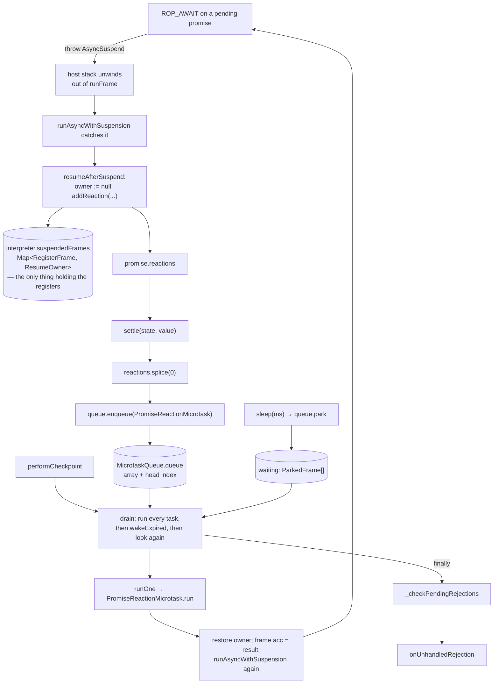

# 30. Async at run time: promises, microtasks, and a suspended frame   ⟨I⟩

`runFrame` is a synchronous `while` loop inside a synchronous host function ([Ch 21 § the-dispatch-loop-runframe-in-fifteen-lines]).
It has a program counter, a register file and no way to stop halfway. So when a tera
function reaches `await` on a value that has not settled yet, there is nowhere to *pause*.
What actually happens is that the frame is thrown out of the loop — on the host's exception
mechanism, because that is the only thing that unwinds a `while` from the inside — and the
host stack it was running on unwinds all the way back to whoever called it. The interpreter
loop is gone. The JavaScript stack that held it is gone.

The `RegisterFrame` object is not gone, because two things still point at it: a closure
registered as a reaction on the promise being awaited, and an entry in
`interpreter.suspendedFrames`, a `Map` whose keys are frames. That `Map` is the whole
lifeline. Every local variable of a half-finished async function — `values`, `total`, `i`
in `stats-async.tera`'s `mean_of` — lives in that frame's register array, and the only
reason the collector does not sweep the objects those registers point at is that
`forEachRootFrame` iterates the `Map` (`src/gc/roots.ts:35`). A frame that falls out of the
`Map` while its await is outstanding is a use-after-free waiting for a scavenge.

This chapter is interpreter-only, and not by accident. `ROP_AWAIT` is the first member of
`INTERPRETER_ONLY_OPS`, and `requiresInterpreterOnly` returns `true` for *any*
`compiledFn.isAsync`, whether the function awaits anything or not — so no async function in
this book ever reaches the baseline compiler or the JIT. `stats.tera` has no `async` at all,
so the whole chapter runs on `docs/example/stats-async.tera`, and the parts even that file
cannot reach — a parked timer, a thenable, a rejection nobody caught — are shown on a
purpose-built probe and on `tests/e2e/language/unhandled-rejection.test.ts`.

**What arrived.** From [Ch 29 § what-leaves]: a constructed `Engine` holding a
`MicrotaskQueue` (built at `src/api/engine.ts:775-777` with `options.microtaskPolicy ||
MicrotaskPolicy.AUTO`); a `hostAsyncBinding()` whose `queue` field is that queue and whose
`drain` field is `engine.drainMicrotasks()`, reachable from host code through
`captureHostReentry()`; and `microtaskQueue.setUnhandledRejectionReporter(...)` already
wired to whatever the caller passed as `onUnhandledRejection`, with the `TaggedValue`
conversion happening inside `runInRuntime`. From [Ch 27 § eleven-opcodes-which-are-twelve]: `ROP_AWAIT`
in the pinning set.

## What await is not

Here is the entire compiled surface of `await` in `mean_of`:

```
$ node dist/cli.js --print-bytecode --filter mean_of docs/example/stats-async.tera
=== mean_of (params=1, locals=4, registers=7, constants=4) ===
...
Locals: r0=name, r1=values, r2=total, r3=i
Instructions:
     0  LdaGlobal [0] (load)
     1  Star r4
     2  Ldar r0
     3  Star r5
     4  Call r4 r5 r1 r0
     5  Await
     6  Star r1
```

One opcode. `values = await load(name)` compiles to an ordinary call followed by `Await`
followed by a store — the same three instructions a synchronous call would produce, plus
one. There is no state machine in the bytecode, no split into a resume block, no
continuation object. Everything in this chapter happens inside that opcode's `case`, which
is twenty-three lines long.

The mechanism that gets the frame out is a class with two fields and no base:

```ts
export class AsyncSuspend {
  frame: AsyncFrameLike;
  pendingPromise: TaggedValue;

  constructor(frame: AsyncFrameLike, pendingPromise: TaggedValue) {
    this.frame = frame;
    this.pendingPromise = pendingPromise;
  }
}
```
— `src/bytecode/register/interpreter/helpers.ts:146-154`

It does not extend `Error`. It is not an error. It travels on `throw` because `throw` is
the only construct in JavaScript that exits a `while` loop from arbitrary depth and unwinds
every intermediate frame on the way out — and every intermediate frame here is a helper
function of the interpreter, not user code.

> **New idea. Coroutine and suspension.** An ordinary function has one entry and one exit:
> you call it, it runs to completion, it returns. A **coroutine** may suspend in the middle
> and be resumed later, from the same point, with its locals intact. The state that must
> survive the suspension is the *activation record* — program counter, registers, operand
> stack — and the only real question in implementing coroutines is where you put it. Some
> languages give each coroutine its own machine stack. Some rewrite the function body into
> a state machine so the locals become fields of a heap object. tera does neither: the
> activation record is already a heap object (`RegisterFrame`, [Ch 21 § the-frame-is-thirteen-fields]), so
> suspending is just a matter of not losing the pointer to it.

> **New idea. Exception as control flow.** Most languages' exception machinery is used for
> errors, but the mechanism itself is neutral: it unwinds the stack to a handler and carries
> a value. Using it to implement a non-error transfer — a suspension, a generator yield, an
> early exit from a deep recursion — is an old technique, and the cost is that a `catch (e)`
> anywhere in between will see something it did not expect. tera pays this: every
> `catch` in the interpreter that might sit under an `await` has to re-throw anything that
> is not the kind of value it handles. `runAsyncWithSuspension` is the one place that
> deliberately catches `AsyncSuspend`, and `runGeneratorFrame`
> (`helpers.ts:127-144`) is the same pattern for `GeneratorSuspend`.

## Why the obvious design fails

The design a reader reaches for is to make `runFrame` an `async function` and write `await`
in the interpreter. Then `ROP_AWAIT` is one line — `frame.acc = await hostPromise` — and
there is no suspension machinery at all.

Two things break.

**Every tera call becomes a promise.** `runFrame` is called for every interpreted function
invocation, and in `stats.tera` — twenty-four lines, four functions, no `async` anywhere —
every one of them is synchronous. If `runFrame` returns a promise, every call site inside
the interpreter has to `await` it, which means every one of them yields to the microtask
queue, which means the ordering of a program with no `async` in it becomes observable and
different. The calls that suspend would impose their calling convention on the ones that do
not.

**The baseline tier cannot follow.** The baseline compiler emits plain JavaScript function
bodies and compiles a tera call as a direct JavaScript call ([Ch 36 § why-emit-source]).
A direct call cannot `await` its callee unless the caller is itself `async`, which would
mean every baseline-compiled function is `async` — which reintroduces the first problem in
the tier that exists precisely to stop going through the dispatch loop.

The price tera pays instead is stated in one function:

```ts
export function requiresInterpreterOnly(compiledFn: RegisterCompiledFunction): boolean {
  return (
    compiledFn.isAsync ||
    compiledFn.instructions.some((instr) =>
      INTERPRETER_ONLY_OPS.has(instr.opcode),
    )
  );
}
```
— `src/bytecode/register/interpreter/helpers.ts:82-89`

The first disjunct is unconditional. An `async fn` never leaves tier zero, whether it
awaits or not — `load` in `stats-async.tera` contains no `Await` at all and is still pinned,
because it is declared `async`. That is a real cost, and [Ch 27 § eleven-opcodes-which-are-twelve]
argues about how large it is. What it buys is that the interpreter's suspension machinery
never has to have a counterpart in three other backends.

## The five branches of Await

```ts
            case bytecode.ROP_AWAIT: {
              const promiseVal = frame.acc;
              if (!isPromise(promiseVal)) break;
              if (compiledFn.explicitAsync) {
                throw new AsyncSuspend(frame, promiseVal);
              }
              const p = getPayload(promiseVal);
              if (p.state === PROMISE_FULFILLED) {
                frame.acc = p.result;
              } else if (p.state === PROMISE_REJECTED) {
                this.microtaskQueue.trackHandle(p);
                throw new RegisterException(p.result);
              } else if (frame.suspendable) {
                throw new AsyncSuspend(frame, promiseVal);
              } else {
```
— `src/bytecode/register/interpreter/index.ts:2235-2249`

Read in order.

**Not a promise.** `await 3` falls through unchanged: the accumulator already holds the
value, so the opcode is a no-op. This is why awaiting a non-promise in tera does not cost a
microtask turn, which is a deliberate divergence from JavaScript's `await`.

**`explicitAsync`.** A function the *user* wrote `async` on suspends unconditionally, even
if the promise has already settled. `explicitAsync` is set by the bytecode compiler from
the AST node (`src/bytecode/register/compiler/functions.ts:769`) and is distinct from
`isAsync`, which the effect analysis may also infer ([Ch 14 § where-async-comes-from-at-all]). The
distinction matters because it makes ordering observable: a user who wrote `async` gets
JavaScript's ordering guarantee — the code after the `await` runs in a later microtask —
even when there was nothing to wait for.

**Already fulfilled.** For an *inferred*-async function, an already-settled promise is
unwrapped in place: `frame.acc = p.result` and the loop continues. No suspension, no
microtask, no observable yield.

**Already rejected.** `trackHandle(p)` first — that is the rejection bookkeeping claiming
the promise as *observed*, and [Ch 30 § who-owns-a-rejection] is where it pays off — and then a
`RegisterException` carrying the reason, which the frame's own `try`/`catch` machinery
([Ch 27 § unwinding-and-two-designs-for-it]) handles like any other throw.

**Pending, and suspendable.** `frame.suspendable` is set in the frame's constructor from
`compiledFn.isAsync || compiledFn.isGenerator`
(`src/bytecode/register/interpreter/frame.ts:60`), and is also forced to `true` at
`interpreter/index.ts:1060` for a top-level execution, which is how top-level `await` works.
This is the branch the chapter is about.

The fifth case is pending and *not* suspendable, and its message is the most precise
statement of the effect-inference contract in the tree:

```ts
                throw new VMTypeError(
                  `'${compiledFn.name || "<anonymous>"}' awaited a pending value but was not inferred as async. ` +
                    `This is an effect-inference gap: the call site could not be resolved to a known callee. ` +
                    `Mark the function 'async' explicitly, or await the value in the caller.`,
                );
```
— `src/bytecode/register/interpreter/index.ts:2250-2254`

It names the analysis that failed, why it failed, and both workarounds. Nothing in `tests/`
asserts this text. `[unpinned]`

## One rule about state

`JSPromise` is the whole promise implementation and it is fifty-eight lines
(`src/runtime/async/promise.ts:65-122`), with seven fields: `queue`, `state`, `result`,
`reactions`, and two that are never used (see the `> **Dead.**` item below).

> **New idea. A one-way state machine.** A promise is in exactly one of three states —
> `pending`, `fulfilled`, `rejected` — and the only legal transitions are `pending →
> fulfilled` and `pending → rejected`. There is no way back and no way sideways. Everything
> a promise library has to guarantee follows from that: a callback fires at most once,
> a resolved value never changes, and two racing settlers cannot interleave.

One method enforces it:

```ts
  settle(state: PromiseState, value: TaggedValue): void {
    if (this.state !== PROMISE_PENDING) return;
    this.state = state;
    this.result = value;
    const reactions = this.reactions.splice(0);
    for (const reaction of reactions) {
      this.queue.enqueue(
        new PromiseReactionMicrotask(reaction, this, state, value),
      );
    }
  }
```
— `src/runtime/async/promise.ts:95-105`

The invariant is *state leaves `pending` exactly once*. The enforcement is the first line —
and the fact that `fulfill` and `reject` are the only two callers, and both go through it.
The tests are three, one per illegal transition:
`[t: tests/runtime/async/promise.test.ts > "settle is idempotent — second fulfill is ignored"]`,
`[t: tests/runtime/async/promise.test.ts > "settle is idempotent — reject after fulfill is ignored"]`,
`[t: tests/runtime/async/promise.test.ts > "settle is idempotent — fulfill after reject is ignored"]`.

The `splice(0)` on line 99 is the detail worth stopping on. It empties the reaction list
*before* enqueueing anything. A reaction that runs during the drain and adds another
reaction to this same promise must attach to the queue — because by then the promise is
settled, and `addReaction`'s settled branch enqueues immediately — not to a list that is
about to be iterated again. Emptying first makes the two paths disjoint.
`[t: tests/runtime/async/promise.test.ts > "reactions list is cleared after settle"]`.

`reject` adds one thing on top:

```ts
  reject(reason: TaggedValue): void {
    if (this.state !== PROMISE_PENDING) return;
    const hadReactions = this.reactions.length > 0;
    this.settle(PROMISE_REJECTED, reason);
    if (!hadReactions) {
      this.queue.trackRejection(this, reason);
    }
  }
```
— `src/runtime/async/promise.ts:86-93`

`hadReactions` is read *before* `settle` empties the list. That ordering is the entire
rejection-ownership decision, and [Ch 30 § who-owns-a-rejection] returns to it.

> **Dead.** `JSPromise.asyncFunctionName` and `JSPromise.resumePc`
> (`src/runtime/async/promise.ts:70-71`, initialised to `null` and `-1` at `:78-79`) are
> never written or read anywhere in `src/` or `tests/` — `grep -rn "asyncFunctionName\|resumePc"`
> over both directories returns exactly those four lines. They read as a fossil of a design
> in which the *promise* remembered where to resume; what shipped is `AsyncSuspend` carrying
> the `RegisterFrame` itself, which needs neither. Deleting them costs two lines.

## A reaction never runs synchronously

```ts
  addReaction(reaction: PromiseReaction): void {
    if (this.state === PROMISE_PENDING) {
      this.reactions.push(reaction);
      return;
    }
    const state = this.state;
    const result = this.result;
    this.queue.enqueue(
      new PromiseReactionMicrotask(reaction, this, state, result),
    );

    if (state === PROMISE_REJECTED) {
      this.queue.trackHandle(this);
    }
  }
```
— `src/runtime/async/promise.ts:107-121`

Two branches, and neither of them calls `reaction(...)`. Pending pushes onto the list;
settled enqueues a `PromiseReactionMicrotask`. The reaction is invoked in exactly one place
in the tree — `PromiseReactionMicrotask.run` (`src/runtime/microtasks/microtask.ts:102-104`)
— and the only way to get there is through the queue.

The invariant is: **no promise callback ever runs on the stack that settled the promise.**
The enforcement is structural rather than a check — there is no code path from `settle` or
`addReaction` to `reaction(...)` that does not pass through `queue.enqueue`. The tests are
`[t: tests/runtime/async/promise.test.ts > "reactions added before settle fire on settle via microtask"]`
and `[t: tests/runtime/async/promise.test.ts > "reactions added after settle fire immediately via microtask"]`
— note that the second one's "immediately" means *immediately enqueued*, and the test
asserts the callback has not run until the queue is drained.

> **New idea. A job queue, and why it is not a thread.** A **microtask** is a unit of work
> the runtime promises to run *later, but before anything else*. The queue is drained to
> empty at well-defined points, and nothing else runs while it drains. That is what makes
> promise callbacks safe without locks: they never interleave with the code that scheduled
> them, and they never interleave with each other. It is cooperative scheduling with one
> worker, not concurrency.

Here is the cycle the rest of the chapter fills in:



## Resolving with a promise

`resolvePromise` (`src/runtime/async/promise.ts:161-203`) is what
`PromiseCapability.resolve` calls, and it has three cases:

```ts
  if (isObject(value)) {
    const payload = getPayload(value) as ObjectPayload;
    const then = payload.getProperty("then");
    if (then !== undefined && isFunction(then)) {
      queue.enqueue(
        new PromiseResolveThenableMicrotask(promise, value, then, interpreter),
      );
      return;
    }
  }
  promise.fulfill(value);
```
— `src/runtime/async/promise.ts:192-203`

The case above these (`:167-191`) is `isPromise(value)`, which synthesises a `Promise.then`
function over the inner promise's `addReaction` and enqueues the same
`PromiseResolveThenableMicrotask`. So two of the three cases are the same case: **resolving
with a promise, or with any object that has a callable `then`, is adoption, and adoption
costs a microtask turn.** Only the third — a plain value — calls `fulfill` directly.

That is why `await` of an already-resolved promise still yields in an `explicitAsync`
function: resolving the outer promise with the inner one schedules a thenable job, the
thenable job attaches a reaction, and the reaction is itself a microtask.
`[t: tests/runtime/async/promise.test.ts > "non-promise non-thenable fulfills directly"]`
and `[t: tests/runtime/async/promise.test.ts > "promise value enqueues thenable resolution"]`
pin the two sides.

## The alreadyResolved latch

A thenable is arbitrary user code. It is handed a `resolve` and a `reject` function and it
may call both, or one twice, or one after throwing. `PromiseResolveThenableMicrotask.run`
makes the first call win, with a boolean:

```ts
  run(interpreter?: MicrotaskInterpreter | null): void {
    const interp = interpreter || this._interpreter;
    let alreadyResolved = false;
    const resolveFn = mkFunction({
      name: "Thenable.resolve",
      call: (args: TaggedValue[]) => {
        if (alreadyResolved) return mkUndefined();
        alreadyResolved = true;
        this.promiseToResolve.fulfill(
          args[0] === undefined ? mkUndefined() : args[0],
        );
        return mkUndefined();
      },
    });
```
— `src/runtime/microtasks/microtask.ts:126-139`

`rejectFn` (`:140-150`) closes over the same boolean. Note that the latch is set *before*
`fulfill` is called, and that it is what makes the first call win — not `settle`'s state
check. The difference is observable: `settle` would also ignore the second call, but only
after the second call had already been routed into a promise; the latch stops it at the
function boundary, so a thenable that calls `resolve(a)` then `reject(b)` never reaches the
rejection bookkeeping with `b` at all.

> **Broken.** `PromiseResolveThenableMicrotask.run`'s `catch`
> (`src/runtime/microtasks/microtask.ts:166-168`) does
> `this.promiseToResolve.reject(mkUndefined())` — it discards the thrown value. A thenable
> whose `then` throws rejects the adopting promise with `undefined` instead of the reason,
> and the same loss happens at `:163` when `then` turns out not to be callable after all.
> The fix is `errorToTaggedValue(asThrownValue(e))`, which the async path already uses at
> `helpers.ts:200`. `[unpinned]` — no test covers a throwing `then`.

## The queue is an array with a head index

`MicrotaskQueue` (`src/runtime/microtasks/microtask.ts:227-456`) has thirteen fields. Two of
them are the queue: an array, and an index into it.

```ts
  runOne(interpreter?: MicrotaskInterpreter | null): boolean {
    if (this.head >= this.queue.length) return false;
    const microtask = this.queue[this.head];
    if (!microtask) return false;
    this.queue[this.head] = undefined;
    this.head++;
    tracer.log(
      "microtask",
      `Run: ${microtask.type}${microtask.label ? ` (${microtask.label})` : ""}`,
    );
    microtask.run(interpreter);
    this.stats.executed++;
    if (this.head >= this.queue.length) {
      this.queue.length = 0;
      this.head = 0;
    }
    return true;
  }
```
— `src/runtime/microtasks/microtask.ts:285-302`

`enqueue` pushes. `runOne` reads the slot at `head`, writes `undefined` back into it,
advances `head`, and — when `head` has caught up with `length` — resets both. Nothing is
ever shifted, so both operations are constant time regardless of queue length, and the
backing array is reclaimed exactly when the queue fully empties. Writing `undefined` back
matters for a different reason: the array is a GC root (`src/gc/roots.ts:164-175` walks
every task in it), so leaving a run task in the slot would keep its captured values alive
until the next full drain.

`[t: tests/runtime/microtasks/microtask-queue.test.ts > "compacts the backing array after a full drain"]`
and
`[t: tests/runtime/microtasks/microtask-queue.test.ts > "preserves FIFO order across repeated drain/enqueue cycles"]`
pin the two halves.

## Two phases, one budget, one guard

```ts
  drain(interpreter?: MicrotaskInterpreter | null, limit = 10000): void {
    if (this.running) return;
    if (this.suppressionDepth > 0) return;

    this.running = true;
    this.nestingDepth++;
    try {
      let count = 0;
      for (;;) {
        while (this.head < this.queue.length) {
          if (count++ >= limit) {
            throw new Error("Microtask queue limit exceeded");
          }
          this.runOne(interpreter);
        }
        if (this.waiting.length === 0) break;
        this.wakeExpired();
      }
```
— `src/runtime/microtasks/microtask.ts:332-349`

`if (this.running) return` is a **reentrancy guard**: a microtask that itself calls `drain`
— which is easy, since any host callback can — gets a no-op, not a recursion. The outer
`drain` is already going to run whatever the inner one would have run, because the inner
one's enqueues land in the same array.
`[t: tests/runtime/microtasks/microtask-queue.test.ts > "nested drain is a no-op while already running"]`.

The loop is two phases. Run every microtask; then, only when the microtask queue is empty,
wake the earliest expired timers; then look for microtasks again, because a waking frame
almost always enqueues one. It terminates when the microtask queue is empty *and* nothing
is parked.
`[t: tests/runtime/microtasks/microtask-queue.test.ts > "runs work a waking frame enqueues before it stops"]`.

And the tail:

```ts
    } finally {
      this.nestingDepth--;
      this.running = false;
      this._checkPendingRejections();
    }
```
— `src/runtime/microtasks/microtask.ts:350-354`

**Unhandled rejections are decided when the queue goes quiet**, not when a promise rejects.
That single placement is what makes the nine e2e cases come out the way they do.

> **Unenforced.** `drain`'s ten-thousand-task budget throws a bare
> `new Error("Microtask queue limit exceeded")` (`src/runtime/microtasks/microtask.ts:342-344`)
> with no promise, no function name and no bytecode offset — the same class of context-free
> failure as the host `RangeError` in [Ch 21 § host-recursion-a-tera-call-is-a-host-js-call]. The behaviour is pinned by
> `[t: tests/runtime/microtasks/microtask-queue.test.ts > "drain throws when limit exceeded"]`;
> nothing pins the message being useful. Fixing it means threading the currently-running
> `Microtask`'s `type` and `label` into the throw, which `runOne` already has in hand.

`performCheckpoint` (`:357-367`) is the ordinary entry: it bumps a counter, logs, and calls
`drain` — unless the policy says otherwise.

> **Never runs.** `MicrotaskPolicy.EXPLICIT` and `MicrotaskPolicy.SCOPED`
> (`src/runtime/microtasks/microtask.ts:11-15`) are reachable only through
> `EngineOptions.microtaskPolicy` (`src/api/engine.ts:115`, read at `:776`) or
> `Engine.setMicrotaskPolicy` (`:1574-1576`). No CLI flag sets either, `hostEngineOptions()`
> does not, and a `grep -rn "MicrotaskPolicy.EXPLICIT\|MicrotaskPolicy.SCOPED"` over
> `src/` and `tests/` finds construction sites only in
> `tests/runtime/microtasks/microtask-queue.test.ts`. So `performCheckpoint`'s two early
> returns at `:358-359` and `MicrotasksScope.exit`'s `SCOPED` branch at `:470-472` never run
> outside tests. They are pinned as behaviour —
> `[t: tests/runtime/microtasks/microtask-queue.test.ts > "EXPLICIT policy skips checkpoint"]`,
> `[t: tests/runtime/microtasks/microtask-queue.test.ts > "SCOPED policy skips checkpoint"]`,
> `[t: tests/runtime/microtasks/microtask-queue.test.ts > "SCOPED policy drains on scope exit at nesting depth 0"]`
> — which is the good case for a `> **Never runs.**` entry: the feature works, nothing in
> the shipped product asks for it.

> **Unenforced.** `Microtask.run` (`src/runtime/microtasks/microtask.ts:78-80`) throws
> `"Microtask.run() is abstract"` at run time. TypeScript would express this with an
> `abstract` class and reject `new Microtask("x")` at compile time; the base is concrete, so
> such an object passes `enqueue`'s `instanceof Microtask` check at `:274` and fails only
> when the queue reaches it — at which point the throw escapes `drain` and unwinds whatever
> the drain was nested inside. One keyword closes it.

## The wait set

Everything above is a queue with no clock. Timers are a second structure:

```ts
  park(delay: number, wake: () => void): void {
    const due = monotonicNow() + Math.max(0, delay) * MILLISECONDS;
    this.waiting.push({ due, order: this.parked++, wake });
    tracer.log("microtask", `Park: due in ${Math.max(0, delay)}ms`);
  }
```
— `src/runtime/microtasks/microtask.ts:304-308`

`order` is a monotonically increasing ticket, and it is the tie-break: two frames due at the
same millisecond wake in the order they parked.
`[t: tests/runtime/microtasks/microtask-queue.test.ts > "wakes frames sharing a deadline in the order they parked"]`.
`earliest()` (`:310-317`) is a linear scan over `waiting`, and `wakeExpired` (`:319-330`)
blocks until the earliest deadline, then wakes *every* frame whose deadline has now passed,
sorted by `(due, order)` — one block for a whole cohort, not one block per frame.
`[t: tests/runtime/microtasks/microtask-queue.test.ts > "waits once for deadlines that overlap instead of once per frame"]`.

> **New idea. A monotonic clock.** `monotonicNow()` is `performance.now()`
> (`microtask.ts:200-202`), not `Date.now()`. A wall clock can go backwards — an NTP
> correction, a user changing the time zone — and a timer implemented against one can fire
> early, late, or never. A monotonic clock only ever increases, and its zero point is
> meaningless, which is exactly right for measuring a delay.

Blocking is the interesting part, because the host is single-threaded and there is nothing
else to do:

```ts
function blockUntil(due: number): void {
  for (;;) {
    const remaining = due - monotonicNow();
    if (remaining <= 0) return;
    if (!blocking) continue;
    try {
      Atomics.wait(sleeper!, SLEEP_SLOT, SLEEP_UNCHANGED, remaining);
    } catch {
      blocking = false;
    }
  }
}
```
— `src/runtime/microtasks/microtask.ts:214-225`

> **New idea. `Atomics.wait` on a `SharedArrayBuffer`.** JavaScript has no `sleep`. The one
> way to block a thread without spinning is `Atomics.wait(int32Array, index, expected,
> timeout)`, which parks the thread until either the value at that index changes or the
> timeout expires. It requires a `SharedArrayBuffer` because that is the only memory the
> atomics operate on. Nothing here is actually shared with anything — `sleeper` is a
> four-byte buffer allocated once at module load (`:204-210`) and never written — so the
> value never changes and the call always ends by timing out. It is `Atomics.wait` used
> purely as a sleep primitive.

`sleep` is the only producer of a parked frame in the whole tree:

```ts
  sleep: {
    name: "sleep",
    call(args: BuiltinArg[], _this: TaggedValue, interpreter: BuiltinInterpreter) {
      const queue = interpreter?.microtaskQueue;
      const delay = extractArgNumber(args, 0, 0);
      if (queue === undefined) return mkUndefined();
      const { capability, value } = mkPromiseCapability(queue);
      queue.park(delay, () => capability.resolve(mkUndefined()));
      return value;
    },
  },
```
— `src/runtime/builtins/index.ts:1140-1150`

It builds a capability, parks its `resolve`, and hands back the promise. Everything else —
suspension, resumption, ordering — is the machinery already described.

> **Unfinished.** `blockUntil`'s fallback is a busy loop. If `new SharedArrayBuffer(4)`
> throws at module load, `sleeper` is `null` and `blocking` starts `false`; if
> `Atomics.wait` throws once, `blocking` becomes `false` for the rest of the process. In
> either case `if (!blocking) continue` spins on `monotonicNow()` until the deadline. There
> is no diagnostic, no counter and no way to observe which mode is in effect, so a
> deployment where the buffer cannot be allocated burns a core per `sleep` and looks
> identical from the outside. Cost to finish: a one-line trace on the transition, and a
> field on `getStats()`.

## resumeAfterSuspend, line by line

This is the centrepiece. It runs on the stack that caught the `AsyncSuspend`, and its whole
job is to arrange for the frame to be re-entered later.

```ts
export function resumeAfterSuspend(
  interpreter: CoroutineInterpreter,
  suspend: AsyncSuspend,
  capability: AsyncCapability,
): void {
  const pendingPromise = getPayload(suspend.pendingPromise) as PromiseLikeRecord;
  const suspendedFrame = suspend.frame;
  const ownerBeforeAwait = interpreter.suspendedFrames.get(suspendedFrame);
  interpreter.suspendedFrames.set(suspendedFrame, null);
  pendingPromise.addReaction((state, result) => {
    if (ownerBeforeAwait === undefined) interpreter.suspendedFrames.delete(suspendedFrame);
    else interpreter.suspendedFrames.set(suspendedFrame, ownerBeforeAwait);
    if (state === PROMISE_FULFILLED) {
      suspendedFrame.acc = result;
      runAsyncWithSuspension(interpreter, suspendedFrame, capability);
      return;
    }
```
— `src/bytecode/register/interpreter/helpers.ts:156-172`

Read the owner dance first, because it is the part that is not obvious.
`ResumeOwner` is `object | null` (`src/bytecode/register/interpreter/frame.ts:18`), and the
`Map`'s value is *the object whose reachability decides whether this frame is still needed*
— for a generator, the generator object the user holds. `dropUnreachableSuspendedFrames`
sweeps the map:

```ts
  dropUnreachableSuspendedFrames(live: Set<number>): void {
    for (const [frame, owner] of this.suspendedFrames) {
      if (owner && !live.has(getHeapObjectId(owner))) {
        this.suspendedFrames.delete(frame);
      }
    }
  }
```
— `src/bytecode/register/interpreter/index.ts:1335-1341`

`if (owner && ...)` — a `null` owner is never dropped. So setting the entry to `null` for
the duration of the await means *this frame has no owning object right now, do not collect
it*, and restoring `ownerBeforeAwait` inside the reaction hands responsibility back. A
frame that was never in the map (`ownerBeforeAwait === undefined`) is deleted rather than
left behind as a `null` entry that nothing would ever remove. The sweep is called from
`_maybeSweepHeapPayloads` (`:1343-1351`), immediately before `sweepHeapPayloads(live)` —
[Ch 31 § the-collector-that-actually-runs] is where that order matters.

Then the two resumption paths. Fulfilled is three lines: put the result in the
accumulator, and run the frame again. The `pc` is untouched, because `ROP_AWAIT` threw
*after* the interpreter had already advanced past it — the frame resumes at the `Star r1`
that follows.

Rejected is the other half:

```ts
    if (!suspendedFrame.exceptionHandlers || suspendedFrame.exceptionHandlers.length === 0) {
      capability.reject(result);
      return;
    }
    const handler = suspendedFrame.exceptionHandlers.pop()!;
    suspendedFrame.acc = result;
    if (handler.catchPC === undefined) {
      capability.reject(result);
      return;
    }
    suspendedFrame.pc = handler.catchPC;
    runAsyncWithSuspension(interpreter, suspendedFrame, capability);
  });
}
```
— `src/bytecode/register/interpreter/helpers.ts:173-186`

One `exceptionHandler` is popped off the frame's own handler stack and the pc is set to its
`catchPC` — the resumption jumps directly into the `catch` block, without ever throwing.
With no handler, or a handler with no catch clause, the *function's own* promise is
rejected, which is what makes a throw after an await propagate to the caller's `await`.

## runAsyncWithSuspension

```ts
export function runAsyncWithSuspension(
  interpreter: CoroutineInterpreter,
  asyncFrame: AsyncFrameLike,
  capability: AsyncCapability,
): void {
  try {
    const result = interpreter.runFrame(asyncFrame);
    capability.resolve(result);
  } catch (e) {
    if (e instanceof AsyncSuspend) {
      resumeAfterSuspend(interpreter, e, capability);
    } else {
      capability.reject(errorToTaggedValue(asThrownValue(e)));
    }
  }
}
```
— `src/bytecode/register/interpreter/helpers.ts:188-203`

Run the frame. If it returns, resolve the function's promise. If it throws `AsyncSuspend`,
hand off to `resumeAfterSuspend` and return — *return*, not loop: this stack is finished.
If it throws anything else, reject.

It looks like a loop and is not one. A function with three `await`s executes this function
four times, on four different host stacks: once from the call site
(`src/bytecode/register/interpreter/index.ts:616` for a compiled callee, `:1050` for a
direct invocation) and three times from inside a `PromiseReactionMicrotask` during a drain.
The only thing carried between those four executions is the `RegisterFrame` object — no
continuation, no closure over locals, no saved stack. That is the chapter's thesis in one
function.

`stats-async.tera` makes the count visible:

```
$ node dist/cli.js --trace docs/example/stats-async.tera 2>&1 | grep MTASK
[MTASK] Enqueue: promise-reaction
[MTASK] Checkpoint (queue=1, nesting=0)
[MTASK] Run: promise-reaction
[MTASK] Enqueue: promise-reaction
[MTASK] Run: promise-reaction
[MTASK] Enqueue: promise-reaction
[MTASK] Run: promise-reaction
[MTASK] Enqueue: promise-reaction
[MTASK] Run: promise-reaction
```

Four enqueue/run pairs and exactly one checkpoint: the first `Enqueue` happens while
`main()` is still on the original stack, and every subsequent one happens *inside* the
single drain that the checkpoint started. `--stats` agrees: `"enqueued": 4, "executed": 4,
"checkpoints": 1`. Three `await`s are written in the file, but four suspensions happen —
`main` awaits `mean_of` twice, and each `mean_of` awaits `load` once — and one drain runs
all four resumptions back to back.

The probe the spine cannot supply is the parked one:

```
$ node dist/cli.js sleep.tera
a
main
b
```

`go()` prints `a`, hits `await sleep(50)`, and leaves. Top level continues and prints
`main`. Only then does the checkpoint drain, block on the timer, and resume `go` to print
`b`. The `main` between `a` and `b` is the proof that the frame really did leave the
interpreter loop and was re-entered from a queue — with `[MTASK] Park: due in 50ms` logged
before the checkpoint, and the `Enqueue`/`Run` pair after it.

## Who owns a rejection

Four operations decide whether a rejection is anyone's problem.

```ts
  trackRejection(promise: PromiseHandle, value: TaggedValue): void {
    if (isObjectHandle(promise) && this.observedPromises.has(promise)) {
      return;
    }
    this.pendingRejections.set(promise, value);
    tracer.log(
      "microtask",
      `UnhandledRejection tracked (pending=${this.pendingRejections.size})`,
    );
    if (this.rejectionHandler) {
      this.rejectionHandler(promise, "reject");
    }
  }
```
— `src/runtime/microtasks/microtask.ts:381-393`

**`trackRejection`** is called by `JSPromise.reject` only when the reaction list was empty
at the moment of rejection, and it returns early for a promise already in
`observedPromises`. **`trackHandle`** (`:406-417`) deletes the pending entry, and is called
from two places: `addReaction` on an already-rejected promise, and `ROP_AWAIT`'s rejected
branch. **`markObserved`** (`:395-404`) adds to `observedPromises` and deletes any pending
entry; the engine calls it on a promise it is about to surface as *uncaught*
(`src/api/engine.ts:1324` for a single source, `:1482` for a module graph). And
**`_checkPendingRejections`** (`:419-436`) is the flush:

```ts
  _checkPendingRejections(): void {
    if (this.pendingRejections.size === 0) return;
    if (this.unhandledRejectionReporter) {
      const rejections: UnhandledRejection[] = [];
      for (const [promise, reason] of this.pendingRejections) {
        rejections.push({ promise, reason });
      }
      this.pendingRejections.clear();
      this.unhandledRejectionReporter(rejections);
      return;
    }
```
— `src/runtime/microtasks/microtask.ts:419-429`

The reporter is the one [Ch 29 § three-hooks-three-flags] wired from
`onUnhandledRejection`. With no reporter installed (`:430-435`) the rejections are traced
and — note — *not* cleared, so they will be re-reported at the next quiet point.

The rule those four encode: **a rejection is unhandled if nothing was listening when it
happened and nothing listened before the queue went quiet.** The two isolation tests are
`[t: tests/runtime/async/promise.test.ts > "reject without reactions tracks unhandled rejection"]`
and
`[t: tests/runtime/async/promise.test.ts > "reject with pre-existing reaction does not track"]`.

> **Never runs.** `MicrotaskQueue.setRejectionHandler` and the `this.rejectionHandler`
> branches (`src/runtime/microtasks/microtask.ts:438-440`, `:390-392`, `:413-415`). Nothing
> in `src/` installs a handler; the only two callers in the tree are
> `tests/runtime/async/promise.test.ts:134` and
> `tests/runtime/microtasks/microtask-queue.test.ts:201`, pinned by
> `[t: tests/runtime/microtasks/microtask-queue.test.ts > "rejectionHandler receives events"]`.
> The production reporting path is `unhandledRejectionReporter`, a different field with a
> different signature and a different firing point — per-event versus per-flush. Finishing
> it means either routing the engine's reporter through it or deleting both branches and the
> setter.

## The nine cases

`tests/e2e/language/unhandled-rejection.test.ts` is 199 lines and is best read as the
specification of the paragraph above. Each case builds an `Engine` with an `output` sink and
an `onUnhandledRejection` sink and asserts both.

Two of them pay for the chapter.

`[t: tests/e2e/language/unhandled-rejection.test.ts > "does not report a rejection settled before anything awaited it"]`
is the hard one. Two calls are made up front — `a = f(0)`, `b = f(1)` — and `f(1)` throws.
By the time the top-level `await a` drains the queue, `b`'s promise has already rejected
with nothing attached, so `trackRejection` has put it in `pendingRejections`. Then
`try: print(await b)` attaches a reaction, `addReaction` sees an already-rejected promise
and calls `trackHandle`, and the entry is removed — before `drain`'s `finally` ever runs
`_checkPendingRejections`. The test asserts `out` is `["1", "one"]` and `rejections` is
empty. This is the case that makes the *quiet point*, rather than the moment of rejection,
the right place to decide.

`[t: tests/e2e/language/unhandled-rejection.test.ts > "surfaces a top level await of a rejection nobody caught as uncaught"]`
is the same shape with a different outcome. `p = f()` rejects, `print(await p)` at the top
level raises it, and the engine's `markObserved` (at `engine.ts:1324`) has already claimed
the promise — so `runNative` throws `Uncaught boom` and `rejections` is *empty*. The
assertion is literally `expect([out, rejections]).toEqual([["mid"], []])`.

That is the boundary the suite draws: **unhandled** and **uncaught** are two different
outcomes with two different reporting paths. Unhandled goes to `onUnhandledRejection` and,
in the CLI, to a non-zero exit code. Uncaught is a thrown host error that propagates out of
`engine.runNative`. `[t: tests/e2e/language/unhandled-rejection.test.ts > "surfaces the same
uncaught rejection when the entry is run as a module"]` asserts the module-graph door
behaves identically, which is why there are nine cases and not eight — it was added when
module entries acquired the same reporting path. The remaining six cover fire-and-forget
reporting, multiple distinct rejections, `catch`, a `try` around an `await`, and a fulfilled
fire-and-forget promise that must report nothing.

## What the spine cannot reach

`stats.tera` has no `async`, so this chapter runs on `stats-async.tera` throughout. But
`stats-async.tera` is itself limited: it never parks a frame, never resolves a thenable, and
never rejects. Its four microtasks are all `promise-reaction`. So the wait set is
demonstrated on a five-line probe written outside the repository, the thenable job and the
`alreadyResolved` latch are shown only through
`tests/runtime/microtasks/microtask-queue.test.ts`, and the rejection bookkeeping is shown
through the nine e2e cases. Per [Conventions § 2], the chapter says so rather than
contriving a ninth spine file.

One further thing the example set cannot show at all: any of this under a compiling tier.
`ROP_AWAIT` is interpreter-only and `requiresInterpreterOnly` pins every `async` function,
so there is no baseline or JIT version of a suspended frame to compare against, and
therefore no differential coverage of async in the sense [Ch 79 § differential] means. The
async correctness argument in this book rests entirely on tier-zero tests.

## What leaves

Two data structures that reference values nothing else on any stack does, and a question
about both.

**`interpreter.suspendedFrames: Map<RegisterFrame, ResumeOwner>`**
(`src/bytecode/register/interpreter/index.ts:657`, constructed at `:673`). Every register,
the accumulator, the closure environment and the open upvalues of every half-finished async
function and every suspended generator. `forEachRootFrame` (`src/gc/roots.ts:29-36`)
iterates it alongside `activeFrames` and `baselineFrames`, and each frame it yields is
walked by `visitFrameRoots` (`:73-93`). During an outstanding await the entry's value is
`null`, which is what stops `dropUnreachableSuspendedFrames` from removing it.

**`microtaskQueue.queue`** — an array of not-yet-run `Microtask`s, each holding a reaction
closure and a `TaggedValue` result — **and `microtaskQueue.pendingRejections:
Map<PromiseHandle, TaggedValue>`**, holding a reason for every rejection that has not yet
been claimed. Both are reached from `markReachableHeapIds`, which the interpreter calls with
`(this, this.globalCells, this.microtaskQueue)` at `index.ts:1345-1349`, and both are walked
at `src/gc/roots.ts:164-181`.

The question those three hand forward is: *how does any of this survive a collection?* Every
value inside them is a `TaggedValue` — a JavaScript number whose upper bits index
`ValueHeap.heapPayloads` ([Ch 22 § the-value-heap]) — so "surviving" means being in the live
set that a sweep is computed against. [Ch 31] takes the two structures and
the two collectors that might reclaim what they point at, and `[Ch 32 § a-root-is-a-field]`
turns the enumeration above into the definition of a root.

## Verify it yourself

```bash
# the running example for this chapter, three awaits, one answer
node dist/cli.js docs/example/stats-async.tera

# the entire compiled surface of await: one opcode, at instruction 5
node dist/cli.js --print-bytecode --filter mean_of docs/example/stats-async.tera | sed -n '1,20p'

# four enqueue/run pairs inside ONE checkpoint
node dist/cli.js --trace docs/example/stats-async.tera 2>&1 | grep MTASK

# the same four, counted
node dist/cli.js --stats docs/example/stats-async.tera | grep -A 7 microtasks

# the wait set, which stats-async.tera cannot reach.
# Write sleep.tera with an editor, outside the repo — not with a shell heredoc:
#   async fn go() -> void:
#     print("a")
#     await sleep(50)
#     print("b")
#   go()
#   print("main")
node dist/cli.js sleep.tera
node dist/cli.js --trace sleep.tera 2>&1 | grep MTASK

# who owns a rejection: nine cases
npx vitest run --project e2e tests/e2e/language/unhandled-rejection.test.ts

# the promise state machine and the queue, in isolation
npx vitest run --project unit tests/runtime/async/promise.test.ts tests/runtime/microtasks/microtask-queue.test.ts
```

What those print. `latency mean=15.70` / `throughput mean=898.19`. An `Await` at instruction
5 of `mean_of`, between `Call r4 r5 r1 r0` and `Star r1`. Four `Enqueue: promise-reaction` /
`Run: promise-reaction` pairs with a single `Checkpoint (queue=1, nesting=0)` after the
first enqueue. `"enqueued": 4, "executed": 4, "checkpoints": 1`. Then, from the probe:

```
$ node dist/cli.js sleep.tera
a
main
b

$ node dist/cli.js --trace sleep.tera 2>&1 | grep MTASK
[MTASK] Park: due in 50ms
[MTASK] Checkpoint (queue=0, nesting=0)
[MTASK] Enqueue: promise-reaction
[MTASK] Run: promise-reaction
```

Note `queue=0` at the checkpoint: nothing was enqueued when the drain started. The task the
drain runs is the one `wakeExpired` produced after blocking for fifty milliseconds. Then
`Tests 9 passed (9)` from the e2e suite.

## Tests that pin this

- `tests/runtime/async/promise.test.ts` > `"starts in pending state"`,
  `> "fulfill transitions to fulfilled with result"`,
  `> "reject transitions to rejected with reason"` — the three states.
- `tests/runtime/async/promise.test.ts` > `"settle is idempotent — second fulfill is ignored"`,
  `> "settle is idempotent — reject after fulfill is ignored"`,
  `> "settle is idempotent — fulfill after reject is ignored"` — one-way, three ways.
- `tests/runtime/async/promise.test.ts` > `"reactions added before settle fire on settle via microtask"`,
  `> "reactions added after settle fire immediately via microtask"`,
  `> "multiple reactions all fire in order"`,
  `> "reactions list is cleared after settle"` — the `splice(0)` and the never-synchronous rule.
- `tests/runtime/async/promise.test.ts` > `"reject without reactions tracks unhandled rejection"`,
  `> "reject with pre-existing reaction does not track"`,
  `> "adding reaction to already-rejected promise tracks handle"` — the ownership decision,
  in isolation from the engine.
- `tests/runtime/async/promise.test.ts` > `"non-promise non-thenable fulfills directly"`,
  `> "promise value enqueues thenable resolution"` — two of `resolvePromise`'s three cases.
- `tests/runtime/microtasks/microtask-queue.test.ts` > `"drain executes all enqueued microtasks in FIFO order"`,
  `> "drain processes microtasks enqueued during drain"`,
  `> "compacts the backing array after a full drain"`,
  `> "preserves FIFO order across repeated drain/enqueue cycles"`,
  `> "runOne executes exactly one microtask"`,
  `> "reports pending as the not-yet-run count while draining"` — the head index and the
  compaction.
- `tests/runtime/microtasks/microtask-queue.test.ts` > `"drain throws when limit exceeded"` —
  the ten-thousand budget as behaviour; nothing pins the message.
- `tests/runtime/microtasks/microtask-queue.test.ts` > `"nested drain is a no-op while already running"`
  — the `running` guard.
- `tests/runtime/microtasks/microtask-queue.test.ts` > `"AUTO policy drains on checkpoint"`,
  `> "EXPLICIT policy skips checkpoint"`, `> "SCOPED policy skips checkpoint"`,
  `> "setPolicy changes behavior"`,
  `> "SCOPED policy drains on scope exit at nesting depth 0"`,
  `> "nested scopes defer drain until outermost exits"` — the three policies and
  `MicrotasksScope`; two of the three never run outside these tests.
- `tests/runtime/microtasks/microtask-queue.test.ts` > `"suppression blocks drain"`,
  `> "suppression depth stacks"`, `> "decrement below zero stays at zero"`.
- `tests/runtime/microtasks/microtask-queue.test.ts` > `"blocks until the earliest deadline rather than returning while a frame is parked"`,
  `> "wakes frames sharing a deadline in the order they parked"`,
  `> "waits once for deadlines that overlap instead of once per frame"`,
  `> "runs work a waking frame enqueues before it stops"`,
  `> "keeps draining the ready queue while nothing is parked"` — the wait set, five cases.
- `tests/runtime/microtasks/microtask-queue.test.ts` > `"trackRejection and trackHandle toggle pending state"`,
  `> "trackHandle on unknown promise is a no-op"`,
  `> "rejectionHandler receives events"` — the last of these pins the `> **Never runs.**`
  field.
- `tests/e2e/language/unhandled-rejection.test.ts` > `"reports a fire-and-forget async rejection but still runs the rest of the program"`,
  `> "reports each distinct fire-and-forget rejection"`,
  `> "does not report when the rejection is observed at the top level (surfaces as uncaught)"`,
  `> "does not report when the rejection is handled with catch"`,
  `> "does not report a rejection an await raised into a try that caught it"`,
  `> "does not report a rejection settled before anything awaited it"`,
  `> "surfaces a top level await of a rejection nobody caught as uncaught"`,
  `> "surfaces the same uncaught rejection when the entry is run as a module"`,
  `> "does not report a fulfilled fire-and-forget promise"` — nine cases; the eighth was
  added when module entries acquired the same reporting path.
- `tests/e2e/docs/book-examples.test.ts` > `"stats-async.tera prints what the book says it prints"`
  — the file itself, run once through a bare engine.
- Nothing pins a thenable whose `then` throws, the `VMTypeError` text on an `await` in a
  function the effect analysis did not mark async, or the owner-nulling in
  `resumeAfterSuspend` that keeps a suspended frame out of
  `dropUnreachableSuspendedFrames`. `[unpinned]`
