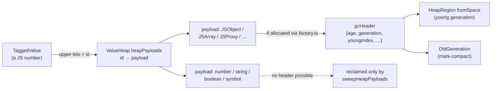

# 31. Two heaps, two collectors   ⟨I · B · J⟩

A program that allocates has to give memory back. tera gives it back twice, through two
mechanisms that share no code, no trigger and no data structure. One is a textbook
generational collector — semispaces, tenuring, a remembered set, a mark-compacting old
generation — living in `src/gc/`. The other is nine lines inside the interpreter that walk
a side table of integer ids and null out the entries nobody can name any more. The first
one is the one with a directory, a test suite and a trace category. The second one is the
one that runs.

This chapter is about why that split exists, why it is not an accident, and why the
collector that keeps a numeric loop bounded is the one nobody would think to look for. The
short version is that tera has two representations for "a thing the program holds" — a
payload object that can carry a header, and a slot in a handle table that cannot — and a
runtime with two representations ends up with two collectors whether or not anyone
designed it that way.

`docs/example/stats.tera` cannot reach either collector's interesting behaviour, and this
chapter says so at the top rather than pretending otherwise. The spine program allocates
fifteen managed objects in its entire life: `node dist/cli.js --stats
docs/example/stats.tera` reports `"totalAllocated": 15` and `"minorGCCount": 0`. Nothing
is ever scavenged, promoted, remembered or swept. Per [Conventions § 2] the chapter reaches
for two purpose-built `-e` probes instead of contriving a ninth spine file, and names them
plainly: **probe A**, a loop that allocates a million-and-a-half boxed doubles and no
objects, and **probe B**, a loop that allocates a quarter of a million objects and never
triggers a collection.

**What arrived.** From [Ch 30 § what-leaves]: two structures holding references that exist
nowhere else on any stack. `interpreter.suspendedFrames: Map<RegisterFrame, ResumeOwner>`
holds every register of every half-finished async function — frames that have left the
dispatch loop and will be re-entered later. `microtaskQueue.pendingRejections:
Map<PromiseHandle, TaggedValue>`, together with the queue's array of not-yet-run
`Microtask`s, holds values that are scheduled but not yet running. Chapter 30 handed these
over with an explicit question attached: *how do these survive a collection*. Every value
inside them is a `TaggedValue` — a JavaScript number whose upper bits are an index into
`ValueHeap.heapPayloads` ([Ch 22 § the-value-heap]).

> **New idea.** *Reachability.* A collector never asks whether a value will be used again;
> that question is undecidable and, worse, it is not the question. It asks whether the value
> **can be reached** from a root — a starting point the collector is told about. Anything
> reachable is kept, whether or not the program will ever touch it; anything unreachable is
> reclaimed, because the program has no way left to name it. Liveness is approximated by
> reachability everywhere in this book, and every bug in this chapter and the next is a
> place where the approximation was computed against the wrong set of starting points.

## Two heaps

Start with membership, before any algorithm.

A `TaggedValue` in tera is a JavaScript number carrying a four-bit type code in its low
nibble. For every code except Smi, the remaining bits are an integer id, and that id is
looked up in `ValueHeap.heapPayloads` — an array of `{ id, payload }` entries, declared at
`src/core/value/index.ts:299`. The payload is whatever the value actually is. It can be a
`JSObject`, a `JSArray`, a `RuntimeFunctionPayload`, a `PromisePayload`. It can equally be
a JavaScript `number`, a `string`, a `boolean` or a `symbol` — `HeapPrimitivePayload` at
`src/core/value/index.ts:116-122` is the first arm of the union.

That last fact is the whole chapter. A boxed double — the result of `i * 1.5` when the
result does not fit in a Smi — is a primitive JavaScript number sitting in
`heapPayloads[index].payload`. It occupies a handle slot exactly like an object does. It is
not an object, so it cannot carry a field, so it cannot carry a garbage-collection header.

The generational collector's entire world is objects that carry that header. Its
`ManagedObject` type is `Extract<HeapPayload, object>` widened with two optional members:

```ts
type ManagedObject = Extract<HeapPayload, object> & {
  gcHeader?: GCHeader;
  visitReferences?: (visitor: (ref: ManagedObject | null | undefined) => void) => void;
};
```

— src/gc/gc.ts:39-42

`Extract<..., object>` deletes every primitive arm of `HeapPayload` at the type level, and
`hasGCHeader` (`src/gc/gc.ts:56-60`) deletes the rest at run time: it is `return
!!obj?.gcHeader`. A boxed double fails both tests. It is invisible to the generational
collector, permanently, by construction.

So the two memberships are these. Every non-Smi value the program holds is in the handle
table. A proper subset of those — the ones that were allocated through `factory.ts` — is
*also* in the generational heap. Boxed doubles, strings, symbols and booleans are in the
handle table and nowhere else.



The two collectors therefore have disjoint responsibilities. `GenerationalGC` reclaims
object *graphs* and knows nothing about handle ids except at two points where it explicitly
reaches across. `ValueHeap.sweepHeapPayloads` reclaims handle *slots* and knows nothing
about object graphs at all — it is handed a set of live ids and nulls out everything else.
They have no shared trigger, no shared threshold and no shared root walk. The rest of this
chapter is what each one does; the question of what "a root" means to each is deferred
entirely to [Ch 32 § three-walkers], because the two of them do not agree on that either.

## The registration funnel

Membership in the generational heap is not a property of a type. It is a property of a call
site.

`src/objects/heap/factory.ts` is a hundred and twenty-seven lines and nine constructor
wrappers, and every one has the same shape:

```ts
export function createJSObject(
  hiddenClass?: HiddenClass | null,
  pretenure = false,
): JSObject {
  const obj = new JSObject(hiddenClass);
  if (_gc) {
    _gc.allocate(obj, pretenure);
  }
  return obj;
}
```

— src/objects/heap/factory.ts:50-59

`createJSArray`, `createJSMap`, `createJSSet`, `createJSWeakMap`, `createJSPrimitiveWrapper`
and `createJSProxy` are the same two statements with a different constructor.
`allocateInstance` (`:66-76`) delegates to `createJSObject`. The `_gc` in the condition is a
module-level variable (`factory.ts:33`), set by `bindGC` (`:35-38`) and, more importantly,
scoped dynamically by `withGC` (`:40-48`), which saves the previous binding, installs a new
one, and restores it in a `finally`.

`Engine.runInRuntime` wraps every entry into the engine in that scope —
`withGC(this.gc, () => withHostAsync(hostBinding, run))` at `src/api/engine.ts:829`, nested
inside five other dynamic scopes. The consequence is worth stating plainly: the same
constructor produces a managed object when called inside the engine and an unmanaged one
when called outside it. Nothing about `JSObject` decides this. The ambient binding does.

`GenerationalGC.allocate` is where a header first exists:

```ts
  allocate<T extends ManagedObject>(obj: T, pretenure = false): T {
    if (!obj.gcHeader) {
      obj.gcHeader = {
        age: 0,
        marked: false,
        forwarding: null,
        generation: "young",
        youngIndex: -1,
        oldGenIndex: -1,
        color: COLOR_WHITE,
      };
    }
```

— src/gc/gc.ts:134-145

Three of those seven fields are never used again anywhere in the tree.

> **Dead.** `GCHeader.forwarding` (`src/gc/gc.ts:32`) is declared, initialised to `null`
> here, and never read or assigned anywhere in `src/` or `tests/` —
> `grep -rn "forwarding" src/ tests/ --include=*.ts` finds the declaration, this
> initialiser, two test fixtures that copy the shape, and four unrelated symbols. It is a
> fossil of Cheney's algorithm, which this scavenger does not implement and does not need;
> § the-scavenge says why. Cost of removing: one field and one initialiser.

> **Dead.** `GCHeader.marked` is written exactly once in the whole tree —
> `obj.gcHeader.marked = false` at `src/gc/old-generation.ts:102` — and never set to `true`,
> and never read. Liveness during a major collection lives in the caller's `markSet`, not
> on the object. Cost of removing: one field and two lines.

> **Dead.** `PRETENURE_SIZE_THRESHOLD = 512` (`src/gc/gc.ts:22`) has no use.
> `allocate`'s `pretenure` argument is a caller-supplied boolean; no size is ever consulted
> to derive it. Cost of removing: one line. Cost of *implementing* the intent: a size
> estimate per payload kind, which does not exist.

There is an escape from the funnel. `JSArray.map`, `filter`, `concat` and `slice`
(`src/objects/heap/js-array.ts:312, 322, 370, 391`) each end in `return new JSArray(result)`
— the constructor directly, with no `_gc.allocate`. An array produced that way has
`gcHeader === null`, which means it is never placed in a semispace, never scavenged, and
never seen by `storeBarrier`, whose very first line returns early on `!holder.gcHeader`.

Today that is harmless, for a reason that is entirely accidental. Of those four methods,
only `slice` has any caller in `src/` at all, and that caller immediately copies the result
into a registered array: `return mkArray(createJSArray(sliced.elements))` at
`src/runtime/intrinsics/array-methods.ts:318`. The `map`, `filter` and `concat` methods on
the class have no `src/` callers whatsoever — the array intrinsics build their own element
arrays and hand them to `createJSArray`. So the unregistered arrays either never exist or
never escape.

> **Unenforced.** Nothing requires a heap payload to be created through `factory.ts`.
> `new JSArray(...)` is reachable from anywhere and produces an array with no `gcHeader`,
> invisible to the scavenger and silently defeating the store barrier. The four sites in
> `src/objects/heap/js-array.ts` are safe only because of what happens to their return
> values, and no test pins that. Cost of enforcing: make the constructors private to
> `factory.ts`, or assert a header at the points that consume an array.

## Semispaces that are arrays

The young generation is `HeapRegion`, and `HeapRegion` is sixty-one lines. It is a
JavaScript `Array` of `size` slots — `YOUNG_GEN_SEMI_SPACE_SIZE = 1 << 19` by default
(`src/gc/heap-region.ts:3`), so 524,288 objects per semispace — plus two integers.

> **New idea.** *Bump allocation.* The cheapest possible allocator keeps one pointer into a
> contiguous region. To allocate, hand back the pointer and add the size to it; there is no
> free list, no search, no header to write. It only works if you can reclaim the whole
> region at once, which is exactly what a copying collector arranges: everything still live
> is moved somewhere else, and then the pointer resets to zero. `HeapRegion.allocate`
> (`:18-26`) is that idea with the size fixed at one slot — `this.allocPointer++`, store,
> return the index, or `null` if the region is full.

The second integer is the one worth explaining:

```ts
  reset(): void {
    this.storage.fill(undefined, 0, this.highWater);
    this.allocPointer = 0;
    this.highWater = 0;
  }

  isFull(): boolean {
    return this.allocPointer >= this.size;
  }

  usedSlots(): number {
    return this.allocPointer;
  }
```

— src/gc/heap-region.ts:37-49

`highWater` exists because `reset` has to clear more than `allocPointer` reaches. Consider
the second scavenge in a program's life. The first scavenge filled a semispace to slot
40,000 and then copied three survivors into the other one; `allocPointer` in the surviving
region is now 3. If `reset` cleared only `[0, allocPointer)`, slots 3 through 39,999 would
still hold live JavaScript references to objects the collector has already decided are
dead. The host's own collector would then keep them — and everything they point at — alive
for the life of the process. `highWater` records the furthest the pointer has ever reached
since the last reset, and `reset` clears up to *that*.
[t: tests/gc/heap-region.test.ts > "reset clears stale slots left above a shrunken allocPointer"]

The invariant is: **after `reset`, no slot in `storage` holds a reference.** It is enforced
by `highWater` being updated in both writers — `allocate` (`:24`) and `set` (`:34`) — and
pinned by the test above and by
[t: tests/gc/heap-region.test.ts > "reset clears all slots and allows reallocation from 0"].

`usedSlots()` returns `allocPointer`, which is a watermark and not a census: it counts slots
handed out, including slots holding objects the last scavenge decided were dead but has not
yet reset. `GenerationalGC.getStats` reports it as `youngGenUsed` (`src/gc/gc.ts:451`), so
`--stats`'s `youngGenUsed` never counts live objects. Probe B's `"youngGenUsed": 250009`
is a count of allocations, not of survivors.

## The scavenge

> **New idea.** *Semispace copying.* Divide the young generation in two. Allocate only in
> one half (from-space). When it fills, walk the roots, and *copy* every object you can
> reach into the other half (to-space). Then swap the names. Everything you did not copy is
> garbage, and you reclaim it by doing nothing at all — the whole region resets to empty.
> The cost is proportional to what survives, not to what died, which is why it suits a heap
> where most objects die young. The classic implementation is *Cheney's algorithm*, which
> avoids recursion by using to-space itself as the worklist: a scan pointer chases the
> allocation pointer, and each copied object leaves a *forwarding pointer* in its old
> location so a second reference to it finds the copy instead of making another.

`GenerationalGC.minorGC` (`src/gc/gc.ts:185-276`) is that shape, and then departs from it in
one important way.

It opens by swapping the two regions and resetting the new from-space (`:192-195`), then
takes the roots (`:197`) and walks:

```ts
    const processRef = (obj: ManagedObject | null | undefined): void => {
      if (!obj || !obj.gcHeader || visited.has(obj)) return;
      if (obj.gcHeader.generation !== "young") return;
      visited.add(obj);

      obj.gcHeader.age++;

      if (obj.gcHeader.age >= TENURE_THRESHOLD) {
        this._promote(obj);
        promoted++;
      } else {
        const newIndex = this.fromSpace.allocate(obj);
        if (newIndex === null) {
          this._promote(obj);
          promoted++;
        } else {
          obj.gcHeader.youngIndex = newIndex;
          copied++;
        }
      }
```

— src/gc/gc.ts:202-221

and then recurses into `obj.visitReferences(processRef)` (`:223-225`).

The departure is this: **there is no forwarding pointer and no scan pointer, because
nothing moves.** "Copying" an object here means writing a JavaScript reference to it into a
different slot of a different array and updating `youngIndex`. The object's address — its
JavaScript identity — is unchanged, and cannot be changed, because a JavaScript reference is
not a value the program can rewrite. Every other holder of that object still holds it and
still sees it. So the two mechanisms Cheney's algorithm needs in order to be correct are
both unnecessary. The "have I already copied this?" test becomes a plain
`visited: Set<ManagedObject>` (`gc.ts:200`), and `GCHeader.forwarding` is the fossil the
previous section flagged.

The recursion is real recursion, not a worklist — `processRef` calls itself through
`visitReferences`. Nothing bounds it, and a sufficiently deep object chain would overflow
the JavaScript stack. `majorGC` uses an explicit worklist for the same traversal; the
scavenger does not. Nothing in this tree reaches a depth where it matters.
[t: tests/gc/gc.test.ts > "follows references to keep transitive objects alive"]

After the roots and the remembered set have been walked, `minorGC` does the one thing that
links the two heaps:

```ts
    this.toSpace.forEach((obj) => {
      if (obj && !visited.has(obj)) {
        this.valueHeap.freeHeapObjectSlot(obj);
      }
    });
```

— src/gc/gc.ts:242-246

`toSpace` at this point is the region that *was* from-space — every object that existed
before the collection. Anything in it that was not visited is unreachable, and its handle
slot is released so the id can be reused. This is the only place in the scavenger that
touches the handle table, and it is precise in one direction only: it frees handles for
dead *objects*, and says nothing about the boxed doubles and strings those objects were
pointing at.
[t: tests/gc/gc.test.ts > "frees heap-payload slots of dead young objects during minorGC"],
[t: tests/gc/gc.test.ts > "keeps slots of young objects still reachable from roots"]

## Tenuring

> **New idea.** *The generational hypothesis.* Most objects die very young; the ones that
> survive their first few collections tend to survive many more. If that holds, it is
> wasteful to keep copying the same long-lived objects back and forth between semispaces.
> *Tenuring* (or *promotion*) moves an object that has survived enough collections into a
> separate old generation, which is collected rarely and by a different algorithm.

tera's threshold is `TENURE_THRESHOLD = 2` (`src/gc/gc.ts:18`), and `processRef` increments
`age` *before* testing it, so an object promotes on its second scavenge.
[t: tests/gc/gc.test.ts > "promotes objects after surviving enough GC cycles"]

There are three ways into the old generation, and only the first is about age.

The second is to-space overflow. If `fromSpace.allocate` returns `null` in the middle of a
copy — the surviving set does not fit — the survivor is promoted instead
(`gc.ts:213-220`). A young generation that is entirely live therefore degrades into
wholesale tenuring rather than failing.
[t: tests/gc/gc.test.ts > "overflows to old gen when young gen is full"]

The third is pretenuring: `allocate(obj, true)` routes straight to `_allocateOld`
(`gc.ts:466-471`), which sets `generation = "old"` and *also* stamps
`age = TENURE_THRESHOLD`, so a pretenured object can never be re-aged if it somehow finds
its way back into a scavenge.
[t: tests/gc/gc.test.ts > "pretenure allocates directly to old generation"]

The bookkeeping around those three paths does not agree with itself.

> **Broken.** `GenerationalGC.allocate` increments its two counters inconsistently across
> its three exits. The normal path (`src/gc/gc.ts:167-168`) increments both
> `stats.totalAllocated` and `_allocationsSinceGC`. The pretenure path (`:147-151`)
> increments `totalAllocated` and returns without touching `_allocationsSinceGC`. The
> young-generation-overflow path (`:157-160`) returns without incrementing either.
> `--stats` therefore under-reports allocations exactly when the heap is under pressure,
> and `needsCollection()` — which reads `_allocationsSinceGC` — under-counts in the same
> conditions. Cost of a fix: two lines. No test pins the counters on any of the three
> paths. [unpinned]

## The adaptive budget

There is a feedback loop in this file that tunes the collection interval against measured
pause time. It is correct, it is tested, and nothing ever reaches it.

The entry point is a two-line predicate and a three-line poll:

```ts
  needsCollection(): boolean {
    return this._allocationsSinceGC >= this._allocationBudget || this.fromSpace.isFull();
  }

  checkSafepoint(): void {
    if (this._incrementalMajorGCActive) {
      this.incrementalMarkingStep();
    }
    if (this.needsCollection()) {
      this.minorGC();
    }
  }
```

— src/gc/gc.ts:172-183

[t: tests/gc/gc.test.ts > "returns true when allocation budget exceeded"],
[t: tests/gc/gc.test.ts > "returns true when fromSpace is full"]

The budget starts at `DEFAULT_ALLOCATION_BUDGET = 4096` and is re-tuned at the end of every
scavenge:

```ts
    if (elapsedMs > this._targetPauseMs) {
      this._allocationBudget = Math.max(
        MIN_ALLOCATION_BUDGET,
        this._allocationBudget >>> 1,
      );
    } else if (elapsedMs < this._targetPauseMs / 2) {
      this._allocationBudget = Math.min(
        MAX_ALLOCATION_BUDGET,
        (this._allocationBudget * 3) >>> 1,
      );
    }
```

— src/gc/gc.ts:263-273

A pause longer than `DEFAULT_TARGET_PAUSE_MS = 2` halves the budget so the next collection
comes sooner and has less to copy; a pause under half the target multiplies it by 1.5. Both
are clamped to `[1024, 65536]`.
[t: tests/gc/gc.test.ts > "budget adjusts after minor GC based on pause time"],
[t: tests/gc/gc.test.ts > "does not reduce budget below minimum (1024)"]

That is a reasonable controller. Its input is never sampled.

> **Dead.** `GenerationalGC.checkSafepoint` (`src/gc/gc.ts:176-183`) has no caller in
> `src/` or in `tests/`. `grep -rn "checkSafepoint" src/ tests/ --include=*.ts` returns
> exactly one line: the definition. It is the only reader of `needsCollection()` and the
> only driver of `incrementalMarkingStep()`, so with it dead, the allocation budget, the
> adaptive pause tuning and incremental marking are all unreachable in a normal run. Cost
> of fixing: one call from `RegisterInterpreter.onBackEdge`, next to the
> `_maybeSweepHeapPayloads` call that is already there — and then a measurement, because
> nothing in this tree has ever run with it enabled.

Probe B is what that costs, observably. Run a quarter of a million object allocations
through the interpreter with optimization off:

```
$ node dist/cli.js --stats --no-opt -e 'total = 0
i = 0
while i < 250000:
  o = {v: i}
  total = total + o.v
  i = i + 1' | tail -14
  "gc": {
    "minorGCCount": 0,
    "majorGCCount": 0,
    "totalPromoted": 0,
    "totalCollected": 0,
    "totalAllocated": 250009,
    "youngGenUsed": 250009,
    "oldGenLive": 0,
    "oldGenCapacity": 16384,
    "rememberedSetSize": 0,
    "allocationBudget": 4096,
    "allocationsSinceGC": 250009
  }
}
```

250,009 allocations against a budget of 4,096, and not one collection. The budget is real,
the predicate that reads it is real, and nothing calls the predicate. The only reason the
run does not grow without bound is that the semispace holds 524,288 slots — at 524,289 the
`allocate` retry path would have fired a scavenge from inside the allocator.

> **Never runs.** `GenerationalGC.minorGC` and `majorGC` are reachable only through
> `collectGarbage` (`src/gc/gc.ts:336-343`), whose callers are `Engine.collectGarbage`
> (`src/api/engine.ts:1959`) and the two CLI natives — `gc()` behind `--expose-gc` and
> `%CollectGarbage` behind `--allow-natives-syntax` (`src/cli/natives.ts:106-118` and
> `:80-86`) — plus the retry inside `allocate` when a semispace fills. A tera program that
> neither calls `gc()` nor allocates 524,288 managed objects never scavenges. Cost of
> fixing: the `checkSafepoint` call above.

## The store barrier

> **New idea.** *The old-to-young problem.* A scavenge only walks the young generation, and
> it starts from the roots. That is unsound the moment a tenured object points at a young
> one: the young object is reachable from the program, but not along any path the scavenge
> walks, so it gets collected and the old object is left holding a dangling reference. The
> two standard fixes are to scan the entire old generation on every scavenge — correct and
> defeats the point — or to have the mutator *tell* the collector whenever it writes a
> young reference into an old object. That notification is a **write barrier**, and the
> record it keeps is a **remembered set**.

tera's barrier is `storeBarrier`, eighteen lines:

```ts
export function storeBarrier(
  holder: GCObject | null | undefined,
  newRef: GCObject | null | undefined,
): void {
  if (!_gc || !holder || !holder.gcHeader) return;
  if (!newRef || !newRef.gcHeader) return;

  if (
    holder.gcHeader.generation === "old" &&
    newRef.gcHeader.generation === "young"
  ) {
    _gc.rememberedSet.record(holder);
  }

  if (_gc.isIncrementalMarkingActive()) {
    _gc.incrementalWriteBarrier(holder, newRef);
  }
}
```

— src/gc/write-barrier.ts:27-44

[t: tests/gc/write-barrier.test.ts > "records old→young reference in remembered set"],
[t: tests/gc/write-barrier.test.ts > "does not record young→young or young→old references"],
[t: tests/gc/write-barrier.test.ts > "skips everything when gc is not bound"]

`storeBarrierForTaggedValue` (`:46-53`) is the same thing for callers holding a tagged
value: it unwraps through `getPayload` first. The `_gc` here is a second ambient binding,
kept in step with `factory.ts`'s by `bindGC` calling `bindWriteBarrierGC` (`factory.ts:37`)
and by `withGC` nesting `withWriteBarrierGC` (`:44`).

Two design choices are visible in those eighteen lines.

**Granularity.** The barrier records `holder` — the object — not the field that was
written. `RememberedSet` is therefore a `Set<T>` of objects
(`src/gc/remembered-set.ts:3-8`), and re-scanning one entry means re-running that object's
entire `visitReferences`. The scavenge does exactly that (`gc.ts:233-240`), guarding with a
`processedHolders` set so an object recorded many times is walked once. Object granularity
costs a re-scan of every field; card or field granularity would cost more memory and more
barrier work per store. Which is better here is not measured.
[t: tests/gc/gc.test.ts > "processes remembered set — old→young references keep young objects alive"],
[t: tests/gc/remembered-set.test.ts > "record is idempotent"],
[t: tests/gc/remembered-set.test.ts > "iterateHolders visits all recorded holders"]

**Lifetime.** `minorGC` calls `rememberedSet.clear()` at `gc.ts:250` and does not rebuild
it. The only thing that rebuilds it is `_rebuildRememberedSetFromOldGen` (`:485-499`),
called from `majorGC` (`:319`) and `finishIncrementalMajorGC` (`:402`), which scans the
whole old generation for young references — the expensive operation the barrier exists to
avoid, run once per major collection.
[t: tests/gc/gc.test.ts > "minor GC clears remembered set but does not rebuild from old gen"],
[t: tests/gc/gc.test.ts > "major GC rebuilds remembered set from old gen"],
[t: tests/gc/gc.test.ts > "major GC leaves an old object with no young reference out of the rebuilt set"]

State the cost plainly: an old→young edge written *before* a scavenge is remembered during
that scavenge and then forgotten. Between that scavenge and the next major collection, the
edge is remembered only if the barrier fires on it again — that is, only if the program
writes it again. The design is sound only because a scavenge either copies or promotes
every young object it can reach, so a young object surviving a scavenge with an old
referrer has been promoted, and the edge is no longer old→young. That reasoning is
nowhere in the code and nothing checks it.

## Marking

> **New idea.** *Mark and sweep.* Where copying reclaims by moving survivors out, marking
> reclaims in place: walk the object graph from the roots, set a bit on everything you
> reach, then walk the heap linearly and free anything whose bit is clear. It costs time
> proportional to the whole heap rather than to the survivors, but it needs no second
> semispace and it does not move anything. Its weakness is **fragmentation** — the free
> space ends up scattered in small holes. *Evacuation* is the standard answer: pick the
> regions that are mostly dead, lift their few survivors out, and let those regions become
> contiguous free space.

`majorGC` (`src/gc/gc.ts:278-334`) is a stop-the-world mark, and it uses an explicit
`worklist: ManagedObject[]` rather than recursion (`:303-312`). Its seed set is the roots
*plus every object currently in from-space* (`:296-301`): during a major collection the
entire young generation is treated as conservatively reachable, so a major collection can
free old objects but never young ones. `collectGarbage("major")` calls `minorGC()` first
(`:338`) precisely so the young generation has already been thinned.
[t: tests/gc/gc.test.ts > "collects unreachable old-gen objects"],
[t: tests/gc/gc.test.ts > "keeps reachable old-gen objects alive through references"],
[t: tests/gc/gc.test.ts > "major/full type runs both scavenge and mark-compact"]

The mark set then goes to `OldGeneration.markCompact` (`src/gc/old-generation.ts:66-134`),
which runs in three phases over a storage array divided into pages of
`PAGE_SIZE = 1024` objects.

*Count.* One pass over `[0, allocPointer)` fills two `Uint32Array`s, `pageLive` and
`pageTotal` (`:73-81`).

*Choose.* A page whose live fraction is below `EVACUATION_THRESHOLD` becomes an evacuation
candidate:

```ts
    const evacuationCandidates = new Set<number>();
    for (let p = 0; p < pageCount; p++) {
      if (pageTotal[p] > 0 && pageLive[p] / pageTotal[p] < EVACUATION_THRESHOLD) {
        evacuationCandidates.add(p);
      }
    }
```

— src/gc/old-generation.ts:83-88

*Sweep and re-place.* A second pass clears every unmarked slot and counts it as swept, and
lifts every marked object on a candidate page into an `evacuees` array, clearing its slot
too (`:91-109`). `_rebuildFreeList` (`:177-184`) then scans for holes, and the evacuees are
handed back out of that free list, or bump-allocated if it runs dry (`:114-126`). A second
`_rebuildFreeList` runs if anything moved.
[t: tests/gc/old-generation.test.ts > "sweeps unmarked objects and returns sweep count"],
[t: tests/gc/old-generation.test.ts > "evacuates objects from sparse pages to denser locations"],
[t: tests/gc/old-generation.test.ts > "rebuilds free list after sweep"],
[t: tests/gc/old-generation.test.ts > "hands a swept slot back out to the next allocation"]

This is the marking fixpoint [Ch 26 § weakmaps-ephemeronhashtable-is-not-an-ephemeron-table] points at when it explains what an
ephemeron table would need and does not have.

`OldGeneration.allocate` (`:46-64`) reads the free list first and bump-allocates second, and
`_grow` (`:186-195`) doubles capacity by copying into a new array.
[t: tests/gc/old-generation.test.ts > "take returns null on empty, LIFO order otherwise"],
[t: tests/gc/old-generation.test.ts > "allocate reuses free list slots before bumping pointer"],
[t: tests/gc/old-generation.test.ts > "grows capacity when full"]

> **Never runs.** `OldGeneration.markSweep` (`src/gc/old-generation.ts:136-139`) is a
> one-line adapter over `markCompact` with no caller anywhere. `OldGeneration.compact`
> (`:141-162`) and `growthRate` (`:164-167`) have callers only in
> `tests/gc/old-generation.test.ts` — the defragmentation pass that `compact` implements is
> never triggered by the collector, which relies on evacuation instead.
> `RememberedSet.remove` (`src/gc/remembered-set.ts:14-16`) and `filterDead` (`:32-36`) are
> likewise reachable only from `tests/gc/remembered-set.test.ts`. Cost of deleting all
> five: five methods and the tests that exercise them.
> [t: tests/gc/old-generation.test.ts > "defragments when fragmentation exceeds 30%"]

The tail of `majorGC` does something that does not belong to the generational heap at all:

```ts
    const liveIds = collectLiveHeapIds(this.interpreter, this.globalCells, this.valueHeap);
    const heapFreed = this.valueHeap.sweepHeapPayloads(liveIds);
```

— src/gc/gc.ts:321-322

Two lines, repeated verbatim at `:404-405` inside `finishIncrementalMajorGC`. This is the
*other* collector, invoked as a side effect of this one — and invoked with the wrong root
walker.

> **Broken.** `collectLiveHeapIds` (`src/gc/roots.ts:285-334`) follows only
> `payload.source` from each root (`trackValue`, `:292-299`). It never walks an object's
> `slots`, an array's `elements`, `overflowProperties`, `properties`, `closure.cells` or
> `compiled.constants` — all of which `markReachableHeapIds` does walk. A major collection
> therefore frees the handle of any payload reachable only through a field, and the program
> then reads a dangling slot. `node dist/cli.js --expose-gc -e 'o = {s: "hi", n: 1.5}` /
> `gc(1)` / `print(o.n)'` prints `undefined`; the same program printing `o.s` prints an
> empty line. Exit code 0, no diagnostic. Cost of a fix: call
> `markReachableHeapIds(this.interpreter, this.globalCells, this.microtaskQueue,
> this.valueHeap)` at both sites — the deeper walker already exists and is already what the
> back-edge sweep uses. No test covers a major collection's handle sweep. [unpinned]

It is invisible in normal use only because two other things in this chapter are dead:
`majorGC` runs only under `--expose-gc` or `--allow-natives-syntax`, and the automatic path
that would otherwise reach `finishIncrementalMajorGC` cannot get there. The mechanism —
which walker, seeded from where, to what depth — is [Ch 32 § three-walkers].

## The collector that actually runs

Neither `minorGC` nor `majorGC` is on any automatic path. The mechanism that keeps a real
tera program's memory bounded is fourteen lines in the interpreter:

```ts
  _maybeSweepHeapPayloads(): void {
    if (heapPayloadLiveBytesEstimate() < this._heapSweepThreshold) return;
    const live = markReachableHeapIds(
      this,
      this.globalCells,
      this.microtaskQueue,
    );
    this.dropUnreachableSuspendedFrames(live);
    sweepHeapPayloads(live);
    this._heapSweepThreshold = Math.max(
      MIN_HEAP_SWEEP_BYTES,
      heapPayloadLiveBytesEstimate() * HEAP_SWEEP_GROWTH,
    );
  }
```

— src/bytecode/register/interpreter/index.ts:1343-1356

Four steps. Check a size estimate against a threshold and return if under it. Compute the
live id set with `markReachableHeapIds` — the deep walker, the one [Ch 32 § three-walkers]
takes apart. Drop suspended frames whose owner is not in that set
(`dropUnreachableSuspendedFrames`, `:1335-1342`), which is how an abandoned generator stops
retaining its registers. Sweep, and set the next threshold to the surviving size times
`HEAP_SWEEP_GROWTH = 4`, floored at `MIN_HEAP_SWEEP_BYTES = 1 << 18` (`:173-174`) — so the
sweep interval grows with the live set instead of firing constantly on a program that
legitimately holds a lot.

> **Unenforced.** `heapPayloadLiveBytesEstimate` (`src/core/value/index.ts:552-554`) returns
> `this.heapPayloads.length - this.heapFreeList.length` — a slot **count**, not a byte
> count — and it is compared against a constant named `MIN_HEAP_SWEEP_BYTES`. Both names
> say bytes; both values are entries. The behaviour is coherent (an entry-count threshold
> compared against an entry count) and only the names are wrong, but nothing checks the
> units and a future estimator that really returned bytes would silently change the
> interval by a large factor. Cost of fixing: rename two symbols.

> **New idea.** *Safepoint.* Generated code cannot be interrupted at an arbitrary
> instruction, because the collector has to be able to describe the machine state at the
> point where it stops. A *safepoint* is a place the compiler has agreed the state is
> describable, where it emits a poll: a cheap check that asks whether anything wants to run.
> Loop back edges are the classic location, because they are the only way a program can run
> for an unbounded time without making a call. The same back edge carries the tiering
> counter, which is [Ch 35 § why-a-back-edge]'s subject.

There are exactly two poll sites, and they poll at different rates.

The interpreter polls in `onBackEdge` (`src/bytecode/register/interpreter/index.ts:1358-1365`),
where the first statement is a sixteen-bit tick counter:

```ts
    if ((this._sweepTick = (this._sweepTick + 1) & 0xffff) === 0) {
      this._maybeSweepHeapPayloads();
    }
```

— src/bytecode/register/interpreter/index.ts:1364-1366

One sweep check every 65,536 back edges.

Baseline-compiled code polls in `BaselineRuntime.backEdge`
(`src/optimizing/baseline/runtime.ts:416-423`), whose first statement is
`this.interp._maybeSweepHeapPayloads()` — unconditionally, on every call. But the baseline
compiler does not emit a `backEdge` call on every back edge. It emits `safepointBefore`
(`src/optimizing/baseline/compiler.ts:44-52`), which increments a counter in the generated
JavaScript and calls out only when it reaches `BACK_EDGES_PER_SAFEPOINT = 1024`
(`src/runtime/tiering/defaults.ts:1`). So the effective baseline period is 1,024 back edges,
sixty-four times more often than the interpreter's.
[t: tests/e2e/gc/heap-payload-sweep.test.ts > "keeps the slab bounded once the loop runs in baseline-compiled code"],
[t: tests/e2e/gc/heap-payload-sweep.test.ts > "still reaches a safepoint when the back edge is a conditional jump"]

There is one escape hatch the sweep needs, because the sweep is only as good as the root
walk. `BaselineRuntime.c(idx)` (`runtime.ts:228-236`) memoises decoded constants in a plain
JavaScript array, which is not a field of anything the walker visits, and so calls
`pinHeapSlot(val)` — marking the slot permanently un-sweepable rather than making it
reachable. `sweepHeapPayloads` and `freeHeapObjectSlot` both consult `pinnedHeapIds` and
refuse to free a pinned entry (`src/core/value/index.ts:499`, `:518`). [Ch 32 §
case-the-baseline-accumulator] treats pinning as the third and bluntest of the three ways a
tier can pay the collector.

And there is a gap.

> **Unfinished.** The handle sweep has two poll sites and no third. Nothing in
> `src/optimizing/backends/wasm/` calls `_maybeSweepHeapPayloads`, so a loop that runs
> entirely inside JIT-compiled wasm performs no handle sweep of its own; it depends on
> eventually returning to a tier that does. Cost of finishing: a poll in the wasm back-edge
> path, plus a decision about what the wasm frame has to export first — the JIT's serialized
> object map is exported to the root walk through a different mechanism entirely
> ([Ch 32 § case-the-jit-serialized-objects]). [unpinned]

Probe A is what the mechanism buys. A loop of 1,500,000 iterations of
`s = s + (i * 1.5) - 0.25` allocates boxed doubles at a furious rate and allocates no
objects at all. The scavenger never fires, because nothing it owns is ever allocated —
`minorGCCount` stays at zero for the whole run. The handle sweep on the back edge is the
only thing keeping the slab bounded, and it does:
[t: tests/e2e/gc/heap-payload-sweep.test.ts > "keeps the boxed-primitive slab bounded under a double-heavy loop"]
asserts `heapPayloadLiveBytesEstimate() < 1 << 20` after that loop.

## Why the obvious design fails

Stage the design a reader would reach for first: **one collector, one heap, every value in
it.** Give every runtime value a header, put it in a semispace, let one traversal decide
what lives. That is what most of the textbooks describe, and it is what the `src/gc/`
directory looks like it is doing.

Probe A breaks it in one line.

`s + (i * 1.5)` produces a double that does not fit in a Smi. It is boxed — which in tera
means it becomes `heapPayloads[index].payload`, and the payload is a JavaScript `number`.
Now try to give it a header. `hasGCHeader` is `!!obj?.gcHeader`, and a `number` has no
properties to set; `obj.gcHeader = {...}` on a primitive is silently discarded in sloppy
mode and throws in strict mode. It has no `visitReferences`. It cannot be a key in a
`Set<ManagedObject>` distinct from another double of equal value, because `===` on numbers
compares values, not identities. The only way to give a boxed double a header is to box the
box — allocate an object *around* the number, which doubles the allocation the boxing was
already paying for and makes every arithmetic result an object graph node.

The type system already says this. `ManagedObject = Extract<HeapPayload, object> & {...}`
excludes `HeapPrimitivePayload` structurally; a design where one collector owns everything
would have to widen that type and then defend it at every use.

So the handle table gets its own collector, and it is a different shape in three ways.

It is keyed on **integer ids**, not on object identity, so two equal doubles occupying two
slots are two distinct collectable things. It is **mark-and-sweep**, not copying, because
there is nothing to copy — reclaiming means writing `null` into `heapPayloads[i]` and
pushing `i` onto a free list (`sweepHeapPayloads`, `src/core/value/index.ts:514-531`). And
it is **precise and linear**: it walks the payload array from index 1 to the end and asks
the live set about each entry, so its cost is the size of the table rather than the size of
the live set.

Land the general rule. When a runtime has two representations for "a thing the program
holds" — and it will, because boxing a primitive and allocating an object are different
operations with different costs — it will end up with two reclamation mechanisms, whatever
the design document says. The only real choice is whether both are written down. In this
tree one of them has a directory named after it and the other is a method on the
interpreter; the second is the one that runs, and until this chapter neither fact was
recorded anywhere.

## Incremental marking that never steps

The most complete single file in `src/gc/` is `incremental-marker.ts`, and it has never
finished a cycle.

> **New idea.** *Tri-colour marking.* Colour every object white. Grey the roots. Repeatedly
> take a grey object, blacken it, and grey everything it points at. When no grey objects
> remain, every white object is unreachable. The point of the colours is that the traversal
> can be *stopped and resumed* — the grey set is the complete worklist. The invariant that
> makes it safe is that **no black object may point at a white object**. If the program is
> allowed to run between steps, it can break that invariant by storing a white reference
> into a black object, so an incremental marker needs a write barrier too. The *Dijkstra*
> rule greys the newly stored reference; the *snapshot-at-the-beginning* (SATB) rule greys
> the reference that was overwritten, preserving the graph as it stood when marking began.

`IncrementalMarker` implements both rules:

```ts
    if (!this.marking || this.markingComplete) return;
    if (!holder || !holder.gcHeader) return;

    if (oldRef && oldRef.gcHeader && holder.gcHeader.color === COLOR_BLACK) {
      if (oldRef.gcHeader.color === COLOR_WHITE) {
        oldRef.gcHeader.color = COLOR_GREY;
        this.worklist.push(oldRef);
      }
    }

    if (newRef && newRef.gcHeader) {
      if (
        holder.gcHeader.color === COLOR_BLACK &&
        newRef.gcHeader.color === COLOR_WHITE
      ) {
        newRef.gcHeader.color = COLOR_GREY;
        this.worklist.push(newRef);
      }
    }
```

— src/gc/incremental-marker.ts:91-109

`startMarking` (`:37-50`) greys the roots. `step` (`:52-84`) blackens under a deadline of
`DEFAULT_TIME_BUDGET_MS = 1`, with a `processed > 0` guard that guarantees at least one
object per step so a slow clock cannot livelock it. `finishMarking` (`:112-118`) drains with
an infinite budget. All of it is tested.
[t: tests/gc/incremental-marker.test.ts > "marks reachable graph BLACK through transitive references"],
[t: tests/gc/incremental-marker.test.ts > "unreachable objects remain WHITE"],
[t: tests/gc/incremental-marker.test.ts > "handles cycles without infinite loop"],
[t: tests/gc/incremental-marker.test.ts > "step processes a subset and returns true while work remains"],
[t: tests/gc/incremental-marker.test.ts > "SATB: pushes old WHITE ref when holder is BLACK"],
[t: tests/gc/incremental-marker.test.ts > "skips barrier when not actively marking"]

What is missing is the wiring. `_checkMajorGCTrigger` (`src/gc/gc.ts:473-483`) runs at the
end of every scavenge and *starts* a cycle when the old generation exceeds its threshold
(`:479-481`). The only caller of `incrementalMarkingStep` is `checkSafepoint`, which the
adaptive-budget section showed is dead. So a cycle that starts never advances and never
finishes.

> **Unfinished.** Once `startIncrementalMajorGC` (`src/gc/gc.ts:345-367`) has run, three
> things become permanent for the life of the process. `_incrementalMajorGCActive` stays
> `true`, because only `finishIncrementalMajorGC` clears it (`:418`) and it is reachable
> only from `incrementalMarkingStep`. `isIncrementalMarkingActive()` therefore returns
> `true` forever, adding a branch and a call to every `storeBarrier`
> (`write-barrier.ts:41-43`). And `incrementalMarker.worklist` holds a strong JavaScript
> reference to every object in the old generation *and* every object that was in from-space
> at the trigger (`gc.ts:361-366`), with nothing left to drain it — so starting a cycle
> pins that entire snapshot. `majorGC` does not clear the flag either, so a stop-the-world
> collection cannot rescue a stuck cycle. Cost of finishing: one call to `checkSafepoint`
> from the same back edge that already calls `_maybeSweepHeapPayloads`, plus a decision
> about whether `majorGC` should abandon an in-flight incremental cycle rather than ignore
> it. [t: tests/gc/gc.test.ts > "full lifecycle: start → steps → finish sweeps old gen"]
> drives the whole cycle by hand, which is the only place it has ever completed.
> [t: tests/gc/gc.test.ts > "startIncrementalMajorGC is idempotent"]

One last small thing, visible whenever you run `--trace-gc`:

> **Dead.** The `gc` entry in `CATEGORY_STYLES` (`src/core/tracing/index.ts:28`) is never
> matched. All six GC trace sites pass the string `"GC"` (`gc.ts:187, 259, 280, 331, 348,
> 413`) and `--trace-gc` registers the category `"GC"` (`src/cli/spec.ts:119`), so
> `formatMessage` (`tracing/index.ts:104-114`) always falls through to its default branch.
> The output is identical only because that branch upper-cases the category and the default
> colour happens to match the entry's. Cost of fixing: one lower-cased string.

## What leaves

Two reclamation mechanisms, and the rule for which one owns a value.

`GenerationalGC` (`src/gc/gc.ts`) owns the *payload objects* that `factory.ts` registered:
two `HeapRegion` semispaces with a bump pointer and a high-water mark, an `OldGeneration`
that mark-compacts by page with evacuation, a `RememberedSet` of holder objects fed by
`storeBarrier`, and an `IncrementalMarker` that is complete and never stepped. It reclaims
`JSObject` and `JSArray` graphs. It runs only when a program calls `gc()` under
`--expose-gc`, calls `%CollectGarbage` under `--allow-natives-syntax`, or fills a 524,288-slot
semispace.

`ValueHeap.sweepHeapPayloads` (`src/core/value/index.ts:514-531`) owns the *handle table*:
every boxed double, string, symbol and payload slot, whether or not it carries a
`gcHeader`. It is polled from two back edges — the interpreter's every 65,536, baseline's
every 1,024 — and it is the one that runs.

Both take the same input: a set of **roots**. Neither computes it. `minorGC` and `majorGC`
call `_roots()`, which is `enumerateRoots`; `_maybeSweepHeapPayloads` calls
`markReachableHeapIds`; the two lines at the tail of `majorGC` call `collectLiveHeapIds`.
All three live in `src/gc/roots.ts`, all three are called "the roots", and they walk
different structures to different depths — which is why `gc(1)` can make `o.n` print
`undefined` while `o` itself survives. Producing that set, and the fact that none of the
three can see a JavaScript local, is the whole of [Ch 32 § a-root-is-a-field].

## Verify it yourself

```bash
# The spine program never collects: 15 allocations, zero scavenges.
node dist/cli.js --stats docs/example/stats.tera | tail -14

# Probe B: 250,009 allocations against a budget of 4,096, and no collection.
node dist/cli.js --stats --no-opt -e 'total = 0
i = 0
while i < 250000:
  o = {v: i}
  total = total + o.v
  i = i + 1' | tail -14

# The only way to see either collector run. gc(1) is minor-then-major.
node dist/cli.js --expose-gc --trace-gc -e 'a = [1, 2, 3]
gc(1)
print(a.length)'

# A minor collection does not touch the handle table: prints 1.5.
node dist/cli.js --expose-gc -e 'o = {s: "hi", n: 1.5}
gc()
print(o.n)'

# A major collection does, with the shallow walker: prints undefined.
node dist/cli.js --expose-gc -e 'o = {s: "hi", n: 1.5}
gc(1)
print(o.n)'

# One line: the definition, and no caller.
grep -rn "checkSafepoint" src/ tests/ --include=*.ts

npx vitest run --project unit tests/gc/
npx vitest run --project e2e tests/e2e/gc/heap-payload-sweep.test.ts
```

The third command is the only place both collectors are observable at once:

```
[GC] Scavenge start — young gen: 10 objects
[GC] Scavenge end — copied: 1, promoted: 0, time: 0.52ms
[GC] Mark-Compact start — old gen: 0 objects
[GC] Mark-Compact end — swept: 0, evacuated: 0, heapFreed: 185, time: 0.65ms
3
```

`heapFreed: 185` is the handle table; `swept: 0` is the generational heap. Ten objects
existed, one survived, nothing was ever promoted, and the old generation was empty — while
185 handle slots went away. That ratio is the chapter in four lines. The times vary run to
run and were taken one case per fresh process on a Windows 11 host; nothing else here is
timing-dependent.

The fourth and fifth commands are the same program with a minor and then a major
collection: `gc()` prints `1.5`, `gc(1)` prints `undefined`. The sixth returns a single
line. `npx vitest run --project unit tests/gc/` reports 8 files, 84 tests passing;
`heap-payload-sweep.test.ts` reports 7 passing.

## Tests that pin this

- `tests/gc/gc.test.ts > "allocates objects into young generation with gcHeader"` — that a header exists only after `allocate`.
- `tests/gc/gc.test.ts > "pretenure allocates directly to old generation"` — the third promotion path.
- `tests/gc/gc.test.ts > "overflows to old gen when young gen is full"` — the second.
- `tests/gc/gc.test.ts > "promotes objects after surviving enough GC cycles"` — the first, at `TENURE_THRESHOLD = 2`.
- `tests/gc/gc.test.ts > "returns true when allocation budget exceeded"` — `needsCollection`, which nothing calls.
- `tests/gc/gc.test.ts > "returns true when fromSpace is full"` — the other half of the same predicate.
- `tests/gc/gc.test.ts > "collects unreachable young objects (not copied to toSpace)"` — reclamation by omission.
- `tests/gc/gc.test.ts > "follows references to keep transitive objects alive"` — `processRef`'s recursion.
- `tests/gc/gc.test.ts > "processes remembered set — old→young references keep young objects alive"` — the barrier's payoff.
- `tests/gc/gc.test.ts > "collects unreachable old-gen objects"` — `majorGC` end to end.
- `tests/gc/gc.test.ts > "keeps reachable old-gen objects alive through references"` — the worklist traversal.
- `tests/gc/gc.test.ts > "major/full type runs both scavenge and mark-compact"` — why `gc(1)` prints two pairs of trace lines.
- `tests/gc/gc.test.ts > "full lifecycle: start → steps → finish sweeps old gen"` — the only place incremental marking completes.
- `tests/gc/gc.test.ts > "startIncrementalMajorGC is idempotent"` — the guard at `gc.ts:346`.
- `tests/gc/gc.test.ts > "budget adjusts after minor GC based on pause time"` — the unreachable controller.
- `tests/gc/gc.test.ts > "does not reduce budget below minimum (1024)"` — its lower clamp.
- `tests/gc/gc.test.ts > "minor GC clears remembered set but does not rebuild from old gen"` — the remembered set's lifetime.
- `tests/gc/gc.test.ts > "major GC rebuilds remembered set from old gen"` — the only rebuild.
- `tests/gc/gc.test.ts > "major GC leaves an old object with no young reference out of the rebuilt set"` — that the rebuild is filtered.
- `tests/gc/gc.test.ts > "frees heap-payload slots of dead young objects during minorGC"` — the scavenger's one reach into the handle table.
- `tests/gc/gc.test.ts > "keeps slots of young objects still reachable from roots"` — and that it is precise.
- `tests/gc/heap-region.test.ts > "returns null when full"` — bump allocation's failure signal.
- `tests/gc/heap-region.test.ts > "reset clears all slots and allows reallocation from 0"` — the semispace reset invariant.
- `tests/gc/heap-region.test.ts > "reset clears stale slots left above a shrunken allocPointer"` — why `highWater` exists.
- `tests/gc/heap-region.test.ts > "forEach visits only allocated non-undefined slots"` — the iteration `minorGC` sweeps with.
- `tests/gc/old-generation.test.ts > "take returns null on empty, LIFO order otherwise"` — `FreeList`.
- `tests/gc/old-generation.test.ts > "allocate reuses free list slots before bumping pointer"` — allocation order.
- `tests/gc/old-generation.test.ts > "grows capacity when full"` — `_grow`.
- `tests/gc/old-generation.test.ts > "sweeps unmarked objects and returns sweep count"` — phase three.
- `tests/gc/old-generation.test.ts > "evacuates objects from sparse pages to denser locations"` — `EVACUATION_THRESHOLD`.
- `tests/gc/old-generation.test.ts > "rebuilds free list after sweep"` — that holes become allocatable.
- `tests/gc/old-generation.test.ts > "hands a swept slot back out to the next allocation"` — end to end.
- `tests/gc/old-generation.test.ts > "defragments when fragmentation exceeds 30%"` — `compact`, which only tests call.
- `tests/gc/write-barrier.test.ts > "records old→young reference in remembered set"` — the barrier's only recording condition.
- `tests/gc/write-barrier.test.ts > "does not record young→young or young→old references"` — and its exclusions.
- `tests/gc/write-barrier.test.ts > "triggers incremental write barrier when marking is active"` — the second half of `storeBarrier`.
- `tests/gc/write-barrier.test.ts > "skips everything when gc is not bound"` — the ambient binding.
- `tests/gc/write-barrier.test.ts > "extracts payload and delegates to storeBarrier for old→young"` — `storeBarrierForTaggedValue`.
- `tests/gc/remembered-set.test.ts > "record is idempotent"` — object granularity.
- `tests/gc/remembered-set.test.ts > "iterateHolders visits all recorded holders"` — the re-scan.
- `tests/gc/incremental-marker.test.ts > "marks reachable graph BLACK through transitive references"` — tri-colour correctness.
- `tests/gc/incremental-marker.test.ts > "unreachable objects remain WHITE"` — the sweep condition.
- `tests/gc/incremental-marker.test.ts > "handles cycles without infinite loop"` — the colour test as a visited set.
- `tests/gc/incremental-marker.test.ts > "step processes a subset and returns true while work remains"` — the deadline loop.
- `tests/gc/incremental-marker.test.ts > "SATB: pushes old WHITE ref when holder is BLACK"` — the snapshot rule.
- `tests/gc/incremental-marker.test.ts > "skips barrier when not actively marking"` — the barrier's guard.
- `tests/e2e/gc/heap-payload-sweep.test.ts > "keeps the boxed-primitive slab bounded under a double-heavy loop"` — probe A, and the reason the second collector exists.
- `tests/e2e/gc/heap-payload-sweep.test.ts > "preserves live state (objects, arrays, closures, generators) across sweeps"` — that the sweep is not too aggressive.
- `tests/e2e/gc/heap-payload-sweep.test.ts > "keeps the slab bounded once the loop runs in baseline-compiled code"` — the second poll site.
- `tests/e2e/gc/heap-payload-sweep.test.ts > "still reaches a safepoint when the back edge is a conditional jump"` — that `safepointBefore` is emitted on every back edge shape.
