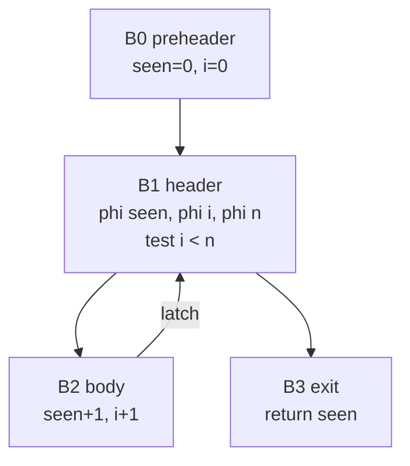
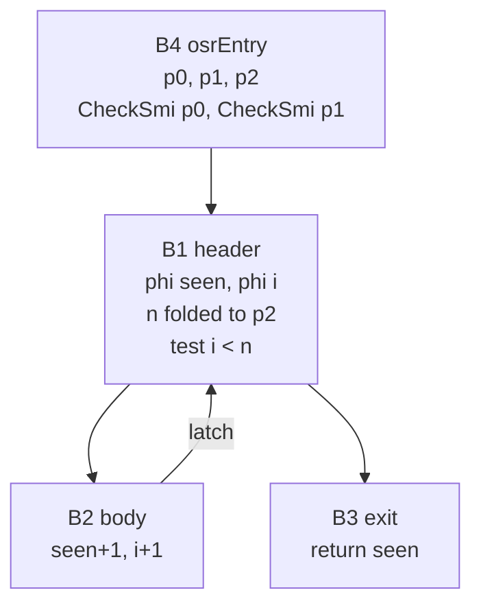

# 37. On-stack replacement   ⟨I · B · J⟩

Every tiering mechanism in the last two chapters triggers on *entering* a function. The
invocation count reaches `baselineThreshold`, the function is compiled, and the *next* call
gets the compiled version. That works for a program made of many small calls and is useless
for the one shape that most needs it: a program whose entire run is one call to one function
containing one very long loop. The counter says the function is cold. The machine says
otherwise.

Fixing that means tiering up a frame that has not returned and cannot be re-entered from the
top — re-entering would redo the hundred thousand iterations already done. So the compiled
code has to be able to start *in the middle*, at the loop, with the loop's carried values
supplied from outside. Which means it is not the same function any more. It is a function
whose entry block is the loop header, whose parameters are the loop's carried values, and
from which everything before the loop has been deleted.

That last sentence is the chapter. The run-time half is 61 lines
(`src/runtime/tiering/osr.ts`) and is the shortest complete mechanism in this book. The
compile-time half is a graph rewrite in `src/optimizing/passes/osr.ts` — the first thing in
the book that *changes* the SSA graph rather than reading it, which makes this chapter a
preview of Parts VI and VII as much as a tiering chapter. It is also, honestly, the place
where the engine gives something up: a repair pass runs afterwards that restores a compiler
invariant by replacing values it cannot place with `undefined`, and nothing reports how often
it fires.

`docs/example/stats.tera` cannot reach any of this. `Series.mean` runs a five-element loop and
a four-element loop once each; no threshold helps, because a five-iteration loop cannot be
entered mid-flight. This chapter therefore works from a nine-line program that is
deliberately *not* in the example set, for the reason [Ch 1 § two-answers-then-and-now] gives
about its own reproducer: a file whose whole purpose is to be entered mid-loop has no stable
printed output to pin. It lives in § verify-it-yourself and in
`tests/e2e/optimizing/baseline-osr.test.ts`, which does the same experiment from inside the
engine. A second twelve-line program, also outside the example set, appears once, in
§ two-readers-one-contract, where it is the shortest thing that makes a live miscompile
visible.

**What arrived.** From [Ch 36 § two-things-generated-code-must-do-by-hand]:
`compiledFn.baselineCode`, a JavaScript function with `_isBaseline` set, closed over one
`BaselineRuntime`, whose generated body already carries — before every backward jump and only
before backward ones — the line
`if(++sp>=1024){sp=0;osr=$.backEdge(target,r,tv,env,loopSpan);if(osr!==null)return osr;}`.
That one emitted line is this chapter's entry point, and its interpreter twin is `onBackEdge`
from [Ch 35 § one-hook-two-jobs]. Also: a `feedbackVector` carrying a `loopBudget` sized
`3000 × instructions.length` and an `osrUrgency` that is still `0`, and a `callMode` of
`CALL_BASELINE`.

## What a counter cannot see

Nine lines, one call:

```
fn work(n: int) -> int:
  seen = 0
  i = 0
  while i < n:
    seen = seen + 1
    i = i + 1
  return seen

print(work(200000))
```

Pin the call counter shut — `--opt-threshold 1000000`, which `work` can never reach with one
call — and open the baseline door at one call, and watch what happens:

```
$ node dist/cli.js --baseline-threshold 1 --opt-threshold 1000000 --trace-opt hotloop.tera
[JIT] Compiling "<script>": Baseline compiled: 12 bytecodes
[JIT] Compiling "work": Baseline compiled: 28 bytecodes
[JIT] Compiling "work": Starting speculative compilation
[JIT] Compiling "work": LICM: hoisted Constant v11 from B2 to pre-header B4
[JIT] Compiling "work": LICM: hoisted Constant v9 from B2 to pre-header B4
[JIT] Compiling "work": LICM: hoisted Constant v13 from B3 to pre-header B4
[JIT] Compiling "work": LICM: hoisted Constant v15 from B3 to pre-header B4
[JIT] Compiling "work": CFG built: 4 blocks, 0 frame states
[JIT] Compiling "work": Wasm module compiled: 606 bytes, 4 blocks
[JIT] Compiling "work": Runtime stubs lowered: 3
[JIT] OSR "work" at loop offset 4
200000
```

The second line is the tier-up a counter can produce: `work` was called once, one is enough
for `--baseline-threshold 1`, and it goes to baseline. Then the counter has nothing left to
say. Everything from the third line down happens because the loop asked, not because anybody
called anything.

Add `--no-osr` and the tail disappears entirely:

```
$ node dist/cli.js --baseline-threshold 1 --opt-threshold 1000000 --no-osr --trace-opt hotloop.tera
[JIT] Compiling "<script>": Baseline compiled: 12 bytecodes
[JIT] Compiling "work": Baseline compiled: 28 bytecodes
200000
```

Both runs answer `200000`. In both, `baselineCode` is set and `optimizedCode` is `null` — the
last trace line of the first run is `[JIT] OSR`, not `Wasm installed`, because the compiled
artifact goes into `osrCache` and never into `optimizedCode`. Only the first has a real entry
in that cache. That triple is asserted from inside the engine, on a 150,000-iteration loop
with `jitThreshold: Number.MAX_SAFE_INTEGER`
[t: `tests/e2e/optimizing/baseline-osr.test.ts > "tiers a hot loop up to optimized code after the function is already in baseline"`,
`> "leaves the loop in baseline when OSR is disabled"`].

> **New idea. On-stack replacement.** Normally a compiler's output is installed and takes
> effect on the *next* call. **On-stack replacement** is installing it for a call that is
> already running: the frame is on the stack, partway through a loop, and the runtime swaps
> the code underneath it. What makes it hard is that the two versions do not agree about
> anything except the loop's carried values — different register layout, different code,
> different notion of where "here" is — so the swap has to be at a program point where the
> old frame's state can be described exactly and the new code can be *entered* at exactly
> that description. The back edge is that point ([Ch 35 § why-a-back-edge]), and it is the
> only one.

## The poll

The question is asked in the same place [Ch 35] put the safepoint, and by two different
mechanisms that were built to charge the same budget at the same rate.

**Interpreter.** `ROP_JUMP`, `ROP_JUMP_IF_TRUE` and `ROP_JUMP_IF_FALSE` each test
`target < frame.pc` ([Ch 19 § absolute-targets-and-what-a-back-edge-is]) and call
`onBackEdge`, which charges the vector `Math.max(frame.pc - target, 1)` — the loop's span in
bytecodes — and calls `enterOsr` when the budget empties
(`src/bytecode/register/interpreter/index.ts:1358-1383`).

**Baseline.** `safepointBefore` emits the counter *at compile time*, and only where it is
needed: `if (typeof target !== "number" || target > from) return ""`
(`src/optimizing/baseline/compiler.ts:45`), so a forward jump gets an empty string and a
backward jump gets a counter. `BaselineRuntime.backEdge` then charges
`loopSpan * BACK_EDGES_PER_SAFEPOINT` once every 1,024 back edges
(`src/optimizing/baseline/runtime.ts:416-429`) and calls the same `enterOsr`.

For `work`, the numbers are all visible in the disassembly. Twenty-eight instructions, so the
budget is `3000 × 28 = 84 000`. The back edge is instruction 25, `Jump r4`; the pc is 26 when
the charge is computed and the target is 4, so each iteration costs 22. That is 3,819
iterations to the first exhaustion — and, because of the warm-up rule in the next section,
about 7,637 to the one that compiles. Against 200,000, comfortable.

Notice what the budget's shape does here: because `work`'s loop *is* most of `work`, the ratio
[Ch 35 § the-budget-is-not-a-counter] derived is close to one and the loop reaches the
question in roughly the 3,000 iterations the constant suggests. A short loop inside a long
function would wait far longer, and that is the intended behaviour, not an accident.

## `enterOsr` in full

Sixty-one lines, and worth reading whole because every one of them is a decision.

```ts
export function enterOsr(
  host: OsrHost,
  compiledFn: bytecode.RegisterCompiledFunction,
  target: number,
  readRegister: RegisterReader,
  thisValue: TaggedValue,
  closureEnv: Environment | null,
): TaggedValue | null {
  const feedback = compiledFn.feedbackVector;
  if (feedback && feedback.osrUrgency === 0) {
    feedback.incrementOsrUrgency();
    return null;
  }
```
— `src/runtime/tiering/osr.ts:21-33`

**The warm-up.** The *first* time a loop exhausts its budget, nothing happens except that a
counter leaves zero. The second exhaustion is the first that can compile. That buys one full
budget of running time — for `work`, another 3,819 iterations — during which the feedback
vector keeps filling in, so the speculation the optimizing compiler is about to make rests on
more than a cold loop's first pass. It is the same reasoning as `--always-opt`'s refusal to
use a threshold of 1 ([Ch 35 § why-not-one]), applied to a loop instead of a call.

```ts
  const engine = host.jitEngine;
  if (
    !engine ||
    !host.tieringPolicy ||
    engine.osrEnabled === false ||
    compiledFn.disableOptimization ||
    requiresInterpreterOnly(compiledFn) ||
    typeof engine.compileOsr !== "function"
  ) {
    return null;
  }
```
— `src/runtime/tiering/osr.ts:35-45`

**The capability check.** Six disqualifiers in one `if`: no engine, no tiering policy,
`osrEnabled === false` (which is what `--no-osr` sets, via `src/cli/spec.ts:231-234` and
`src/cli/main.ts:78`),
`disableOptimization` (set by a compile that failed with an internal error, or by
[Ch 54]'s give-up rule), `requiresInterpreterOnly` ([Ch 27 § eleven-opcodes-which-are-twelve]),
and no `compileOsr` method on the engine.

```ts
  let entry = compiledFn.osrCache.get(target);
  if (entry === undefined) {
    entry = engine.compileOsr(compiledFn, target);
  }
  if (feedback) feedback.resetLoopBudget();
  if (!entry) return null;
```
— `src/runtime/tiering/osr.ts:47-52`

**The cache, and the subtle line.** `osrCache` is a `Map<number, OsrEntry | null>` keyed by
bytecode offset (`src/bytecode/register/ops/bytecode.ts:407`). `undefined` means never asked,
so compile. `null` means asked and refused. The subtlety is `if (!entry) return null`: it
treats a *fresh* refusal and a *cached* one identically, so a loop that cannot be entered pays
exactly one compile attempt for the life of the program. The only thing that ever forgets a
refusal is `src/deopt/dependencies.ts:182` — `if (fn.osrCache) fn.osrCache.clear()` — when a
dependency the compiled entry relied on is invalidated ([Ch 54 § dependencies]).

`resetLoopBudget()` sits *before* the entry check, deliberately. A refused loop starts its next
budget from full rather than re-asking on the very next back edge, which is what would happen
if the reset were skipped: `decrementLoopBudget` refills the budget but leaves
`loopBudgetExhausted` set, and the flag is what `execute` reads later
([Ch 35 § sticky-and-two-strikes]).

```ts
  const args: TaggedValue[] = [];
  for (const slot of entry.slots) {
    const value = readRegister(slot);
    args.push(value === undefined ? mkUndefined() : value);
  }
  if (entry.code._declinesEntry?.(args)) return null;
  return entry.code(args, thisValue, host, closureEnv);
```
— `src/runtime/tiering/osr.ts:54-60`

**The argument vector.** The compiled entry names the register slots it needs, in order
(`entry.slots`), and the caller supplies a reader. This is the *only* coupling between the two
frame layouts of [Ch 36 § a-frame-the-interpreter-would-recognise], and it is by slot number,
which is why that unenforced invariant matters. The test that pins it runs 150,000 iterations
and asserts the answer is exactly `HOT_ITERATIONS * 2 + 1`
[t: `tests/e2e/optimizing/baseline-osr.test.ts > "keeps the accumulated loop state when the baseline frame is replaced mid-loop"`],
so a replacement that lost or duplicated the accumulator fails rather than merely differs.

**`_declinesEntry`.** A last refusal, at run time, on the values the compiler only speculated
about. `failingEntryGuard` walks the entry guards the transform created and checks each
against the argument actually being passed — `IR_CHECK_SMI` against `isSmi`, `IR_CHECK_NUMBER`
against `isNumber`, and `IR_CHECK_MAP` against the argument's hidden-class id
(`src/optimizing/backends/wasm/codegen.ts:4301-4319`) — and the property is installed only on
an OSR compilation (`:4853-4856`, gated on `isOsr: !!graph.osrParamSlots` at `:1535`). The
design rule it shares with [Ch 54 § deopt-triggers]: **decline the entry rather than enter and
immediately deoptimize**, because deoptimizing has to materialize a frame and declining is a
comparison per guard. Neither side of that is measured here
[t: `tests/e2e/optimizing/osr-objects.test.ts > "stays correct when a field value becomes a non-number mid-loop"`,
`> "stays correct when a guarded field value grows into a double"`].

## Making the header the entry

The goal, in one sentence: **produce a function whose entry block is the loop header and whose
parameters are the loop's carried values.**

The graph this operates on is built in [Ch 38] and [Ch 39], one chapter later than you are
reading. Two working definitions are enough to follow the transform, and both get their full
treatment there.

> **New idea. Blocks, phis, and the parts of a loop.** A **basic block** is a run of
> instructions with one entry and one exit; a function is a graph of them, and each block
> lists its `predecessors` and `successors`. A **phi** is the node at a block with more than
> one predecessor that says "this value is whichever one arrived" — its inputs are parallel to
> the predecessor list, one per incoming edge ([Ch 38 § canonical-phi-ssa]).
>
> A loop has four named parts. Its **header** is the block every path into the loop goes
> through. Its **latch** is the block whose jump goes back to the header — the back edge. Its
> **preheader** is the single block outside the loop that falls into the header. Its **exit
> blocks** are the blocks the loop leaves to. In a loop header's phis, input `entryIndex` came
> from the preheader and input `latchIndex` came from the latch, so a phi there reads exactly
> "the value on the first iteration, or the value the previous iteration produced". [Ch 42 §
> loops] builds the loop forest that computes all four.
>
> One special case earns its own name here. A **self-referential phi** is one whose latch
> input is the phi itself: `x = phi(initial, x)`. It says "carry the same value round every
> iteration", which means it is not a loop variable at all — it is a constant in disguise,
> and the transform folds it away.

The rewrite, in a picture. Before, `work` has a preheader that sets `seen` and `i` to zero, a
header that tests `i < n`, a body, and a block after the loop that returns:



After, the preheader is gone, the header's carried values arrive as parameters, and a new
entry block re-checks them before jumping in:



`n` was a self-referential phi — the loop never changes it — so it folded into the parameter
directly and left the header. `seen` and `i` really vary, so they stay as phis with their
*entry* input rewired. The preheader is not in the graph any more; nor is anything else before
the loop.

## The transform step by step

`applyOsrTransform` is 157 lines and one function
(`src/optimizing/passes/osr.ts:118-274`), called from exactly one place — the pipeline both
compiler roads share, wedged between the user IR-extension hook and the middle end:

```ts
    graph = this.runCompilerPasses("ir", graph);
    graph.rebuildUses();

    if (
      osrOffset !== null &&
      !applyOsrTransform(
        graph,
        osrOffset,
        compiledFn,
        this.frameStates,
        new LoopForest(graph, new DominatorTree(graph)),
      )
    ) {
      graph.bailout = `no osr entry at ${osrOffset}`;
      return this.resultFor(graph, compiledFn, osrOffset);
    }
```
— `src/optimizing/optimizer.ts:169-184`

It runs *before* the middle end, so every pass after it sees the rewritten graph and optimizes
the loop as if it were the whole function. That is the point: an OSR graph with the setup code
still attached would waste every pass's time on code that can never run.

**1. Find the candidate.** Every loop header in the graph gets an OSR candidate recorded at
build time, whether or not it is ever hot. The builder records it inside the loop-header branch
of the bytecode walk, keyed by the *bytecode index* of the header:

```ts
      if (nextBlock.isLoopHeader) {
        const phis = openLoopHeader(
          nextBlock,
          incomingStates,
          regs,
          compiledFn.localCount,
          hasFallthrough ? predecessorBlock : nextBlock,
        );
        const slots = [...phis.keys()];
        loopPhiMap.set(nextBlock.id, phis);
        graph.osrCandidates.set(i, {
          headerBlockId: nextBlock.id,
          slots,
          phiIds: slots.map((slot) => phis.get(slot)!.id),
        });
      }
```
— `src/optimizing/builder/ir-builder.ts:395-410`

`openLoopHeader` (`src/optimizing/builder/cfg-state.ts:91-113`) decides what those slots are:
one phi per *live* local slot, minus `ACC_SLOT`. That is the list `enterOsr` will read
registers by, and — see § the-three-bailouts — it is also the reason some loops cannot be
entered. The transform then confirms the block is still a loop header in the loop forest, that
the forest is reducible, and that `slots.length === phiIds.length` with no duplicates
(`osr.ts:125-135`).

**2. Find the single latch and the single external entry** (`osr.ts:137-147`). The entry is
`loop.preheader`, or, if there is none, the one predecessor outside the loop. Both must exist
and both must be findable in `header.predecessors`, because the transform works by *index*
into that array.

**3. Compute the region** (`osr.ts:148`, via `osrRegionBlocks` at `:86-96`). The region is the
loop's blocks **plus everything reachable from its exit blocks**. That "plus" is what makes
the post-loop code and the `return` survive; without it the compiled entry would run the loop
and have nowhere to go.

**4. Make one parameter per candidate phi**, in candidate order (`osr.ts:162-174`).

**5. Fold or rewire, per phi** (`osr.ts:181-202`). Four cases, and the table is the section:

| the phi | its latch input | what happens |
| --- | --- | --- |
| is a candidate | is itself | **fold**: replaced everywhere by the parameter (`n` in `work`) |
| is a candidate | is something else | **keep**: its *entry* input is replaced by the parameter |
| is not a candidate | is itself | **fold**: replaced by its entry value |
| is not a candidate | is something else | **keep** unchanged |

`substitute` (`:45-61`) then rewrites every input of every node *and* every frame state in one
pass (`:204`); the surviving phis are renumbered so their `props.index` matches their new
position (`:206-210`); and folded nodes are dropped from the header's node list (`:207`).

**6. Prove the region is closed** (`osr.ts:212-231`). Every input of every node in the region
must be defined in the region, be one of the new OSR parameters, or be a constant — and a
constant is simply re-homed into the header by `ir.homeInstruction`, because a constant has no
real definition point. Anything else returns `false`, and the compile is abandoned.

**7. Re-create the guards** (`osr.ts:233-256`). This is the step that is easy to miss and
impossible to skip. The loop body was compiled on the assumption that its phis had already
been checked — a `CheckSmi` on the induction variable, a `CheckMap` on a receiver — by guards
in blocks *above* the loop, and step 8 is about to delete those blocks. So `loopGuardSources`
(`:63-84`) scans the region for `IR_CHECK_SMI` and `IR_CHECK_NUMBER` nodes whose input is one
of the surviving phis, preferring `CHECK_SMI` when both exist (`:79`), and the new entry block
gets a fresh copy of each. `carriesNumber` (`:14-27`) adds one more: a phi whose latch value
produces a number gets a `CheckNumber` even when no guard was found for it, following the
phi chain with a memo so a cycle terminates. Each new guard is given a *cloned* frame state
with the phi→parameter substitution applied (`entryFrameState`, `:105-116`).

These are exactly the guards `_declinesEntry` re-checks. The compiler creates them so the
compiled code may assume them; the run-time check exists so the assumption is true on entry
[t: `tests/e2e/optimizing/baseline-osr.test.ts > "carries a smi accumulator that overflows to double through the replacement"`].

**8. Rewire and truncate** (`osr.ts:257-273`):

```ts
  entry.successors = entry.successors.filter((s) => s !== header);
  osrEntry.successors.push(header);
  header.predecessors[entryIndex] = osrEntry;

  graph.entry = osrEntry;
  graph.parameters = osrParams;
  graph.parameterCount = osrParams.length;
  graph.osrParamSlots = candidate.slots.slice();

  graph.blocks = [
    osrEntry,
    ...graph.blocks.filter((b) => b.id !== osrEntry.id && osrBlocks.has(b)),
  ];
  graph.rebuildUses();
  return true;
```
— `src/optimizing/passes/osr.ts:259-273`

The old entry edge is unlinked, the new block takes its predecessor index, and `graph.blocks`
is filtered down to the region. `graph.osrParamSlots` is the list `enterOsr` reads registers
by — the contract's other end.

The consequence is worth stating flatly: **the resulting graph is a valid function that cannot
be called normally.** Its parameters are register values from the middle of a loop, not the
caller's arguments. That is why it lives in `osrCache` keyed by bytecode offset and never in
`optimizedCode`, and it is why a function can reach optimized WebAssembly through this chapter
without ever having been optimized by call count.

## The three bailouts   *(Why the obvious design fails)*

There are thirteen `return false` sites in `applyOsrTransform`. Ten are about a malformed or
absent request — no candidate, not a header, mismatched slot and phi lists. Three are about
the *program*, and each one is a design a reader would reasonably have expected to work.

**More than one latch, or no single external entry** (`osr.ts:143`). A loop with two back
edges has no single "where we came from" edge — and the whole transform is
`header.predecessors[entryIndex] = osrEntry`, a substitution at one index. There is no place
to put the entry block. `forest.irreducible` (`:125`) is the same objection one level up: a
graph with an irreducible region has loops with no single header at all, and the loop forest
declines to describe them. The obvious fix — insert a synthetic merge block for the external
predecessors — is real and is what a production compiler does; it is not done here, and the
cost is that a loop reached from two places is never entered on stack.

**A self-recursive call inside the region** (`osr.ts:150-160`): any `IR_CALL_KNOWN_FUNCTION`
whose `props.target` is `selfFn`. This one is worth sitting with, because it looks like an
arbitrary restriction. The OSR graph *is* `selfFn` — same compiled function, same name — but
with a different entry block and a different parameter list. A self-call inside it would be
compiled as a call to the normal entry, and the normal entry no longer exists in this graph.
Nothing in the graph can express "call the version of me that has not been rewritten". The
cost of fixing it is a second compilation unit, not a condition.

**A value defined before the loop and used inside it**, which is neither a constant nor an OSR
parameter (`osr.ts:213-231`). The obvious fix is one line — make it a parameter too. It is not
one line, and the reason is upstream. The candidate's `slots` are fixed at IR-build time by
`openLoopHeader`, from the set of live *local slots* at the header. A value with no register
slot — a temporary, a hoisted load, a computed receiver — has no name the interpreter or the
baseline frame could supply, because the reader `enterOsr` is handed is
`(slot) => frame.getReg(slot)`. Adding it as a parameter would require the interpreter to be
able to *produce* it, and it cannot: it never had it. So the transform refuses, the optimizer
sets `graph.bailout = "no osr entry at N"`, `compileOsr` caches `null`, and the loop keeps
running in baseline forever.

## Resume precision is lost

After `runMiddleEnd` has moved and deleted code, a frame state may still name a value whose
definition no longer dominates the instruction carrying that state. That is meaningless: the
deopt machinery of [Ch 40] would have to read a value that has not been computed yet on the
path that reaches the bailout. `validateOptimizedGraph` would reject the graph.

The repair is thirty-one lines (`src/optimizing/passes/osr.ts:276-306`); its centre is these
twelve:

```ts
      visitFrameStateValues(node.frameState, (value, replace) => {
        if (!(value instanceof CFGInstruction)) return;
        if (value.type === ir.IR_PARAMETER || value.type === ir.IR_CONSTANT) {
          return;
        }
        if (sunkIds.has(value.id)) return;
        const defBlock = blockOf.get(value);
        if (defBlock && dominates(idom, defBlock, block)) return;
        if (!placeholder) placeholder = ir.irConstant(undefined);
        replace(placeholder as FrameValue);
        repaired++;
      });
```
— `src/optimizing/passes/osr.ts:290-301`

Compute dominators, walk every value in every frame state, skip parameters, constants and
sunk allocations ([Ch 45 § allocation-sinking]), and for anything whose defining block does not
dominate the use, **replace it with a single shared `irConstant(undefined)`**.

Be exact about what that costs. A frame state is the description the interpreter would resume
from. Substituting `undefined` for one of its values means that if a guard fails at that
instruction, the interpreter resumes with that register holding `undefined` rather than the
value the program computed. It is not a crash and it is not a verifier complaint; it is a
silent, deliberate loss of *resume precision*, traded for a graph the verifier will accept.

The general rule, which is why this is in the book rather than in a comment nobody wrote:
**a repair that makes the compiler's invariant true by changing the program's meaning is a bug
budget, not a fix.** It is a legitimate engineering choice — the alternative is refusing to
compile a great many loops — but it has to be spent knowingly, and knowing means measuring.

> **Unfinished.** `repairFrameStateDominance` (`src/optimizing/passes/osr.ts:276-306`) returns
> the number of substitutions it made, and `src/optimizing/optimizer.ts:192` discards the
> return value. So the engine knows exactly how much resume precision it just gave up, on
> every compilation, and reports it to nobody: not to `--stats`, not to `--trace-turbo`, not to
> `validateOptimizedGraph` seven lines later (`src/optimizing/optimizer.ts:199`). Note that this pass runs on **every**
> compilation, OSR or not — it is outside the `osrOffset !== null` guard — so the cost is not
> confined to this chapter. Cost of surfacing it: one `tracer` call on a non-zero count.

## The baseline side {#the-baseline-side}

Generated JavaScript cannot have its frame replaced. The host owns it; there is no way to
reach into a running `new Function` activation and change the code underneath it.

So the baseline does not try. `$.backEdge` returns either `null` or **the value the optimized
code returned**, and the emitted line is `if(osr!==null)return osr;` — the baseline function
returns the OSR result *as its own result*. The optimized entry ran the rest of the loop *and*
everything after it, up to and including the `return`, so its answer is the whole function's
answer. The interpreter's `ROP_JUMP` case does the identical thing:

```ts
            case bytecode.ROP_JUMP: {
              const target = operands[0];
              if (target < frame.pc) {
                loopCounter++;
                const osr = this.onBackEdge(compiledFn, frame, target, loopCounter);
                if (osr !== null) return osr;
              }
              frame.pc = target;
              continue;
            }
```
— `src/bytecode/register/interpreter/index.ts:1775-1784`

The invariant that makes this sound is step 3 of the transform: **the OSR region is closed
under the loop's exits.** If the region were only the loop's blocks, the compiled entry would
finish the loop and return whatever the loop's last expression left in the accumulator, and
the post-loop code would be silently skipped. Because `osrRegionBlocks` walks out from the
exit blocks to everything reachable, the compiled entry contains the `return`
[t: `tests/e2e/optimizing/osr.test.ts > "runs post-loop code and returns through the optimized entry"`,
`> "handles branches, nested loops, calls, and early returns"`,
`> "preserves global side effects performed inside the loop"` — the last asserts an exact
triangular number, so a partially replayed or partially skipped loop fails rather than merely
differing].

One corollary is worth naming because it looks like a defect and is not. `null` is doing
triple duty in `enterOsr`'s return: *not hot enough yet*, *refused at compile time*, and
*declined at entry*. The two callers cannot tell them apart. That is correct, because all three
mean the same thing to a caller — **keep interpreting** — and neither caller has anything
different to do in any of the three cases.

## Two readers, one contract

The register reader is where the two tiers' frame layouts finally touch, and they do not agree.

The interpreter passes `(slot) => frame.getReg(slot)`
(`src/bytecode/register/interpreter/index.ts:1380`). `getReg`
(`src/bytecode/register/interpreter/frame.ts:87-100`) redirects through open upvalue cells
when the slot has been captured, and *throws* `VMReferenceError` rather than hand out the TDZ
sentinel ([Ch 20 § tdz-is-a-value-not-a-flag]).

The baseline passes `(slot) => registers[slot]`
(`src/optimizing/baseline/runtime.ts:434`). A raw array index. No upvalue redirection, no TDZ
check.

One of the two differences is harmless today, for a reason that is an accident rather than an
enforced invariant. The other is not harmless.

> **Unenforced.** Nothing checks that the two `RegisterReader`s agree.
> `BaselineRuntime.backEdge`'s reader cannot produce `TDZ_UNINITIALIZED` — but only because
> the baseline prologue never writes the sentinel into `r` in the first place, which is
> [Ch 36 § a-frame-the-interpreter-would-recognise]'s `> **Broken.**` item and not a check.
> One tier's bug is the other tier's precondition, and neither file says so. The upvalue
> difference is not covered at all: `compile` accepts `ROP_MAKE_CLOSURE`, `ROP_LDA_UPVALUE`
> and `ROP_STA_UPVALUE` (`src/optimizing/baseline/compiler.ts:138-143`, `:188`, `:194`), and
> `requiresInterpreterOnly`'s `INTERPRETER_ONLY_OPS`
> (`src/bytecode/register/interpreter/helpers.ts:67-80`) does not
> list them, so a baseline frame *can* hold a captured slot whose live value is in `_ouv`
> rather than in `r`. Cost of enforcing: route the baseline reader through a shared helper,
> or assert in `enterOsr` that every element of `args` is a number. [unpinned]

> **Broken.** On-stack replacement over a function that has an **open upvalue on a local**
> answers `undefined`. Twelve lines reproduce it — an `outer(n)` that declares `total = 0`,
> defines an inner `bump()` that does `total = total + 1`, calls it in a `while` loop and
> returns `total`. Measured 2026-09-08 at `n = 300000`: plain `node dist/cli.js upv.tera`
> prints `undefined`; adding `--no-osr` prints `300000`, and so does every configuration that
> keeps OSR off — `--no-opt --no-osr`, and `--baseline-threshold 1 --opt-threshold 1000000
> --no-osr`. Turning OSR back on breaks it from either tier: `--no-opt --baseline-threshold
> 1000000` (interpreter, OSR only) prints `undefined`, and so does
> `--baseline-threshold 1 --opt-threshold 1000000`. At `n = 100` — below the loop budget —
> every configuration prints `100`, so the trigger is the replacement and not the closure.
> The entry read is correct: the interpreter passes `frame.getReg`, which redirects a captured
> slot through its open cell. Nothing after it is upvalue-aware — `openLoopHeader` builds the
> candidate slot list from live *local slots* (`src/optimizing/builder/cfg-state.ts:99-101`)
> and neither `applyOsrTransform` nor `enterOsr` mentions `openUpvalues`. Not localized
> further than that here. Cost of fixing: at minimum, refuse the transform when any candidate
> slot can be captured — one condition in `applyOsrTransform`, and one more loop that never
> tiers up. [unpinned]

`enterOsr` does normalise one thing, for exactly this reason: `value === undefined ? mkUndefined() : value` (`osr.ts:57`). A JavaScript `undefined` — which a raw array index can
produce for a slot past the end — becomes a real tagged undefined before it crosses into
compiled code. It is one guard against one of the several ways the two readers can differ, and
there is no second.

Two more items belong here, because they are the pieces of the mechanism that were built and
then not connected.

> **Broken.** `--no-opt` does not stop on-stack replacement, and therefore does not stop the
> program from running in optimized WebAssembly. `buildTiering` (`src/cli/main.ts:49-63`) sets
> both `jitThreshold` and `loopOsrThreshold` to `Number.MAX_SAFE_INTEGER` for
> `optMode === "none"` — but `onBackEdge`
> (`src/bytecode/register/interpreter/index.ts:1367-1373`) reads `loopOsrThreshold` **only**
> when `compiledFn.feedbackVector` is falsy, and the vector is installed at
> `src/bytecode/register/interpreter/index.ts:958` before any back edge executes. Measured on
> the worked example, 2026-09-08: `node dist/cli.js --no-opt --stats hotloop.tera` reports
> `"jit_osr": 1`, and `--trace-opt` prints the full speculative-compilation trace. Adding
> `--no-osr` removes it. The flag's own summary is `never tier up to the optimizing compiler`
> (`src/cli/spec.ts:199`). Cost of fixing: one line — have `enterOsr` treat
> `loopOsrThreshold === Number.MAX_SAFE_INTEGER` as `osrEnabled === false`, or make
> `onBackEdge` consult the policy before the budget.

> **Never runs.** `AdaptiveTieringPolicy.shouldOSR` (`src/runtime/tiering/adaptive.ts:172-187`)
> is a complete OSR admission policy — cooldown, compile-failure count, `hasOSRReadyFeedback`,
> the `loopOsrThreshold` comparison, and a graded `getOSRUrgency` — declared on the
> interpreter's policy interface (`src/bytecode/register/interpreter/index.ts:198`) so that it
> could be called, and called from nowhere in `src/`. The only callers are
> `tests/runtime/tiering/adaptive.test.ts`
> [t: `tests/runtime/tiering/adaptive.test.ts > "shouldOSR returns false without optimized OSR entry"`,
> `> "getOSRUrgency increases with loop count"`]. The real admission decision is
> `feedback.decrementLoopBudget(...)` plus the six-way check above, which consults none of
> those signals. So `loopOsrThreshold: 30` — the number `docs/README.md:66` describes as "loop
> iterations before entering a running loop" — governs only a fallback that fires when there is
> no feedback vector ([Ch 35 § the-thresholds-that-decide-nothing]) and a method nothing
> invokes. Cost of connecting: one call in `onBackEdge`; cost of deleting: 25 lines and two
> tests.

> **Unfinished.** `FeedbackVector.osrUrgency` (`src/feedback/vector/index.ts:787`, `:798`,
> `:809-811`) is only ever incremented, and only ever read as `feedback.osrUrgency === 0`
> (`src/runtime/tiering/osr.ts:30`). It is a boolean wearing a counter's clothes: *has this
> loop ever exhausted a budget*. Nothing decays it, nothing compares it to a threshold, and
> `AdaptiveTieringPolicy.getOSRUrgency` — which does compute a graded urgency, from the
> profile's exponential moving average of execution time — is a different function on a
> different object that never runs. Cost of finishing: pick one of the two.

> **Unenforced.** `enterOsr` calls `engine.compileOsr(compiledFn, target)` whenever
> `osrCache.get(target)` is `undefined` (`osr.ts:47-50`), and `compileOsrInRuntime` opens by
> reading the same cache again (`src/api/engine.ts:1711-1712`). The duplicate lookup is
> harmless, but it is also the only thing standing between "asked and refused" and an
> unbounded recompile loop: `enterOsr` itself never writes to `osrCache`, so a `compileOsr`
> implementation that forgot to cache its `null` would recompile the loop on every budget
> exhaustion for the life of the program. The contract *"compileOsr must cache its answer,
> including failures"* is stated nowhere; the current implementation honours it on all four
> exits (`engine.ts:1714-1717`, `:1719-1722`, the `catch` at `:1740-1752`, and the
> unconditional `:1754`). [unpinned]

## What leaves

The same `RegisterCompiledFunction`, now with `osrCache` populated: a
`Map<number, OsrEntry | null>` keyed by **bytecode offset**, where a real entry is
`{code, slots}` and `null` means *asked once, refused, never ask again*. That is the last of
the four fields Part V promised — `feedbackVector`, `baselineCode`, `callMode` and `osrCache`.

`optimizedCode` may still be `null`. A function can reach optimized WebAssembly through this
chapter without ever having been optimized by call count, and `work` in the worked example is
exactly that case.

[Ch 38 § what-a-register-cannot-tell-you] takes the `RegisterCompiledFunction` and builds the
control-flow graph everything from here on stands on. Read this chapter's § the-transform-step-by-step
alongside it: the OSR transform is the first graph rewrite in the book, and the four
questions it has to answer — which values are live, which block dominates which, what a phi's
inputs mean, and what happens to a frame state when a node moves — are the four questions
Parts VI and VII are about.

## Verify it yourself

Neither reproducer is in `docs/example/`. Save these nine lines as `hotloop.tera` somewhere
outside the repository — with your editor, not with a shell heredoc, which eats backslashes:

```
fn work(n: int) -> int:
  seen = 0
  i = 0
  while i < n:
    seen = seen + 1
    i = i + 1
  return seen

print(work(200000))
```

And these twelve as `upv.tera`, for the § two-readers-one-contract `> **Broken.**` item:

```
fn outer(n: int) -> int:
  total = 0
  fn bump() -> int:
    total = total + 1
    return total
  i = 0
  while i < n:
    bump()
    i = i + 1
  return total

print(outer(300000))
```

```bash
# 28 bytecodes, header at 4, back edge at 25: budget 84,000, span 22
node dist/cli.js --print-bytecode --filter work hotloop.tera

# one call, so the counter can never fire - and the loop tiers up anyway
node dist/cli.js --baseline-threshold 1 --opt-threshold 1000000 --trace-opt hotloop.tera

# identical but for --no-osr: two baseline lines, the answer, and no OSR
node dist/cli.js --baseline-threshold 1 --opt-threshold 1000000 --no-osr --trace-opt hotloop.tera

# the honesty item: OSR happens under a flag whose summary is
# "never tier up to the optimizing compiler"
node dist/cli.js --no-opt --stats hotloop.tera | grep jit_osr

# the other honesty item: 300000 with OSR off, undefined with it on
node dist/cli.js --no-osr upv.tera
node dist/cli.js upv.tera

# the same experiment from inside the engine, 150,000 iterations (7 tests)
npx vitest run --project e2e tests/e2e/optimizing/baseline-osr.test.ts

# the transform against loops with branches, nesting, calls and early returns (9 tests)
npx vitest run --project e2e tests/e2e/optimizing/osr.test.ts

# entry guards on maps rather than numbers, with three no-OSR controls (11 tests)
npx vitest run --project e2e tests/e2e/optimizing/osr-objects.test.ts
```

The fourth command prints `    "jit_osr": 1,`.

## Tests that pin this

- `tests/e2e/optimizing/baseline-osr.test.ts > "tiers a hot loop up to optimized code after the function is already in baseline"`
  — the worked example, asserted from inside the engine: `baselineCode` truthy,
  `optimizedCode` falsy, a non-`null` value in `osrCache`, with
  `jitThreshold: Number.MAX_SAFE_INTEGER`.
- `tests/e2e/optimizing/baseline-osr.test.ts > "leaves the loop in baseline when OSR is disabled"`
  — the `osrEnabled === false` arm of the capability check.
- `tests/e2e/optimizing/baseline-osr.test.ts > "keeps the accumulated loop state when the baseline frame is replaced mid-loop"`
  — 150,000 iterations, answer exactly `HOT_ITERATIONS * 2 + 1`. This is the test that pins the
  argument vector.
- `tests/e2e/optimizing/baseline-osr.test.ts > "carries a smi accumulator that overflows to double through the replacement"`
  — the entry guard's `CHECK_SMI` versus `CHECK_NUMBER` choice, from the other side.
- `tests/e2e/optimizing/baseline-osr.test.ts > "replaces a conditional back edge and honours an early return"`.
- `tests/e2e/optimizing/baseline-osr.test.ts > "replaces an outer loop that carries a nested loop and a call"`.
- `tests/e2e/optimizing/baseline-osr.test.ts > "preserves global side effects written by the loop it replaces"`
  — asserts an exact triangular number, so a partially replayed or partially skipped loop fails
  rather than merely differing.
- `tests/e2e/optimizing/osr.test.ts > "compiles and enters a hot loop on a single call"` — the
  thesis, in one title.
- `tests/e2e/optimizing/osr.test.ts > "preserves semantics for float loops"`.
- `tests/e2e/optimizing/osr.test.ts > "preserves global side effects performed inside the loop"`.
- `tests/e2e/optimizing/osr.test.ts > "runs post-loop code and returns through the optimized entry"`
  — § the-baseline-side stands on this one.
- `tests/e2e/optimizing/osr.test.ts > "deoptimizes correctly when an int loop value overflows to double"`.
- `tests/e2e/optimizing/osr.test.ts > "handles branches, nested loops, calls, and early returns"`.
- `tests/e2e/optimizing/osr.test.ts > "does not disturb loops that never reach the OSR budget"`
  — the negative control for § the-poll.
- `tests/e2e/optimizing/osr.test.ts > "rebuilds the caller frame when a deopt fires inside an inlined callee"`
  and `> "keeps a deep inline chain correct once the outer loop is replaced on stack"`
  — the interaction with [Ch 50 § inlining] and [Ch 40 § caller-chains].
- `tests/e2e/optimizing/osr-objects.test.ts > "compiles an object field read loop through OSR"`,
  `> "guards object fields flowing into float arithmetic"`,
  `> "compiles an object field mutation loop through OSR"`,
  `> "compiles an array push and read loop through OSR"`.
- `tests/e2e/optimizing/osr-objects.test.ts > "stays correct when a guarded field value grows into a double"`
  and `> "stays correct when a field value becomes a non-number mid-loop"`
  — the `_declinesEntry` / entry-guard pair, exercised on maps rather than numbers.
- `tests/e2e/optimizing/osr-objects.test.ts > "tiers up an object field mutation loop without OSR"`,
  `> "tiers up an object field read loop without OSR"`,
  `> "tiers up an array element read loop without OSR"`
  — the three controls that prove the OSR tests are testing OSR.
- `tests/runtime/tiering/adaptive.test.ts > "shouldOSR returns false without optimized OSR entry"`
  and `> "getOSRUrgency increases with loop count"` — the only two callers of the policy that
  never runs.
- The captured-local miscompile is `[unpinned]`. Every `fn` declaration in the three files
  above — `work`, `step`, `run`, `driver`, `hot`, `leaf`, `mid`, `small`, `checksum`, `f` — is
  top-level; none of the twenty-seven tests nests a function inside the one whose loop is
  replaced, and none of the three files contains the words *closure* or *upvalue*. A suite
  that passes twenty-seven times says nothing about it.
- There is **no unit test for `applyOsrTransform` or `repairFrameStateDominance`**. There is no
  `tests/optimizing/passes/osr.test.ts`, and grepping `tests/` for either symbol returns
  nothing: the 306-line file at the centre of this chapter is covered only end to end, which is
  why § the-three-bailouts and § resume-precision-is-lost are argued from source rather than
  from a pinned title. `[unpinned]`
