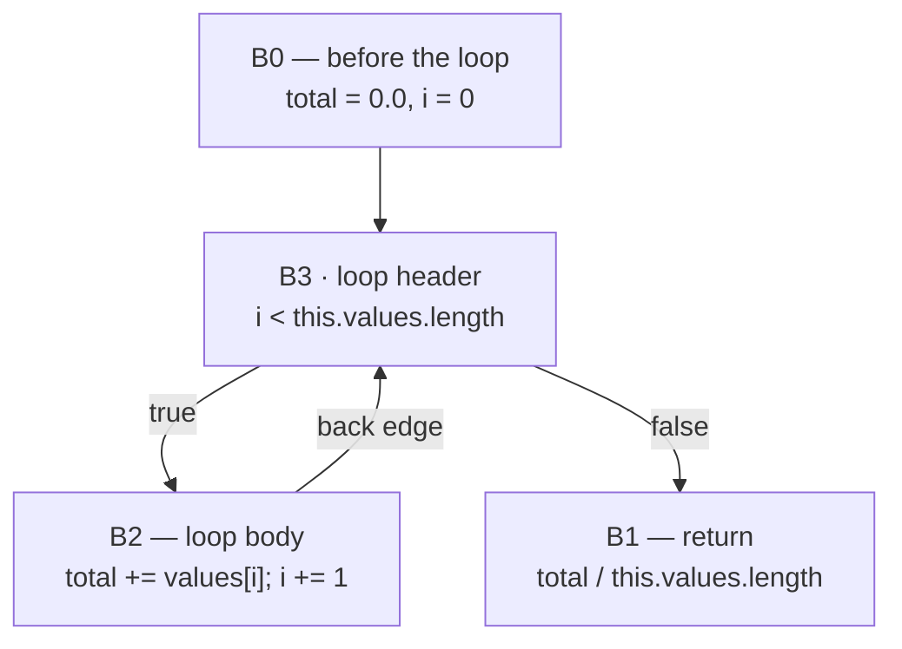

# 38. A control-flow graph, not a sea of nodes   ⟨· · J · N⟩

Register bytecode is a machine, and machines have storage. `r3` is a box. Within six
instructions of `Series.mean`'s loop test it holds two entirely different values, and
nothing in the encoding records which one a later instruction reads. The interpreter does
not care — it just looks in the box. Every compiler that comes after it cares about nothing
else.

This chapter is the data structure that answers the question once, so that no pass ever has
to ask it again. A value stops being "whatever is in register 3" and becomes a node with an
identity; an instruction that consumes it holds a pointer to that node rather than a slot
number; and the question "which definition does this read see?" is answered by following one
edge. That is all static single assignment is, and it is worth being unromantic about it: it
is a precomputed answer stored in the shape of the graph.

The second decision is the chapter's title. There is a well-known alternative — Turbofan's
*sea of nodes*, in which pure values float free and are placed into blocks only at the very
end. tera does not do that. Values are pinned to a block and to a position within that
block's node list; program order **is** the schedule; and there is no scheduling pass in the
middle end at all. That choice has a price, it is paid every time a pass wants to move
something, and this chapter names it rather than presenting the design as inevitable.

**What arrived.** A `RegisterCompiledFunction`, complete. From [Ch 18 § what-leaves] and
[Ch 19 § what-leaves]: an instruction array of opcode-plus-`number[]` records in which
nothing distinguishes a register index from a constant-pool index from a feedback slot from
a jump target, a constant pool, a source map with one entry per instruction, and
`localCount` / `paramCount` / `registerCount`. From [Ch 33]: a `feedbackVector` recording
what the interpreter actually saw at each site. From [Ch 35] and [Ch 37]: the tier-up
decision itself, and an `osrCache` mapping bytecode offsets to compiled loop entries or to
`null` for "asked once, refused, never ask again". What did *not* arrive is any notion of a
definition. The bytecode names storage; it does not name values.

## What a register cannot tell you

`Series.mean` is seven lines of tera and forty-three instructions of bytecode. Instructions 4
through 14 are the loop test, `i < this.values.length`; here is its middle:

```
     8  LdaNamedProperty r4 [1] (values) r0
     9  Star r3
    10  LdaNamedProperty r3 [2] (length) r1
    11  Star r3
    12  Ldar r2
    13  TestLessThan r3 r2
```
— output of `node dist/cli.js --print-bytecode --filter mean docs/example/stats.tera`

Instruction 9 puts the array `this.values` into `r3`. Instruction 10 reads `r3` to get that
array and loads its `length` into the accumulator. Instruction 11 puts the *length* into
`r3`, overwriting the array. Instruction 13 reads `r3` again — and by now it means something
else entirely. (The trailing operands here are feedback slots rendered as registers, a
consequence of the untyped `number[]` encoding of
[Ch 17 § an-opcode-and-an-untyped-number-array]; `TestLessThan r3 r2` is
`TestLessThan r3, fbSlot2`.)

So: `r3` is read at instruction 10 and at instruction 13, and those two reads see two
different values. There is nothing in the instruction stream that says so. To find out, you
have to walk backwards from each read looking for the nearest write, and "nearest" is only
well defined along a path — with a loop in the picture there are several paths, and the
answer can differ between them. Recovering that relation is called *reaching definitions*,
and doing it once is work that thirty-four optimization passes then never have to repeat.

> **New idea. A basic block, and a control-flow graph.** Take a program's instructions and
> cut them wherever control can enter or leave. What is left between two cuts is a **basic
> block**: a straight run of instructions with exactly one entry at the top and exactly one
> exit at the bottom. Once you are executing the first instruction of a block you will
> execute all of them, in order, and then leave. A block's last instruction — its
> **terminator** — says where control goes next: to one block (a jump), to one of two (a
> branch), or nowhere (a return). Draw the blocks as nodes and those destinations as edges
> and you have a **control-flow graph**. It is a graph, not a tree: two arms of an `if` merge
> back together, and a loop's body points back at its own header. Every structured
> construct — `if`, `while`, `for`, `try` — disappears into this one shape, which is why a
> compiler can have thirty-four passes and no special case for `while`.

`mean` becomes four blocks. `B0` is everything before the loop, `B3` is the loop test, `B2`
is the loop body, `B1` is the `return`:



That structure is the first thing `--print-ir` shows you, and the whole of it fits on a page:

```
fn mean params=0 {
  graph [declaredSignature={params: [], names: [], defaults: [], variadic: false, rest: null, returns: "float"}, osrCandidates=Map{4: {headerBlockId: 3, slots: [0, 1], phiIds: [3, 4]}}]
  B0 succs=B3 preds=:
    v0 = Constant [value=0]
    v1 = Constant [value=0]
    v14 = Constant [value=1]
    v10 = Constant [value=undefined, isThis=true]
    v5 = Constant [value=undefined, isThis=true]
    v2 = Jump [targetBlock=3]
  B1 succs= preds=B3:
    v23 = Constant [value=undefined, isThis=true]
    v24 = GenericGetProp v23 [propName="values"] !fs
    v25 = GenericGetProp v24 [propName="length"] !fs
    v26 = GenericDiv v3, v25
    v27 = Return v26
  B2 succs=B3 preds=B3:
    v11 = GenericGetProp v10 [propName="values"] !fs
    v12 = GenericGetIndex v11, v4 !fs
    v13 = GenericAdd v3, v12
    v15 = Float64Add v4, v14
    v22 = Jump [targetBlock=3]
  B3 loop-header succs=B2,B1 preds=B0,B2:
    v3 = Phi v0, v13 [index=0]
    v4 = Phi v1, v15 [index=1]
    v6 = GenericGetProp v5 [propName="values"] !fs
    v7 = GenericGetProp v6 [propName="length"] !fs
    v8 = GenericCompare v4, v7 [op="<"]
    v9 = Branch v8 [trueBlock=2, falseBlock=1]
}
```
— output of
`node dist/cli.js --print-ir --opt-threshold 1 --baseline-threshold 1 --filter mean docs/example/stats.tera`

Twenty-nine lines, four blocks, twenty-two values, two phis. This is the chapter's single
running listing; every section below reads a different part of it.

Look for `r3` in it. It is not there, and neither is any other register. Instruction 9's
value is `v6` in `B3` and `v11` in `B2` — two separate nodes, because the walk that built
this graph passed through that code twice on two different paths. Instruction 11's value is
`v7`. Instruction 13's comparison, `v8 = GenericCompare v4, v7`, names `v7` by identity. The
question "which definition does this read see?" is now answered by reading the operand.

> **New idea. Static single assignment.** SSA is one rule: **every value is written exactly
> once**. Not every *variable* — a program can still assign to `total` five times — but every
> value in the compiler's representation is produced by exactly one instruction, and that
> instruction is the value's name. `v13` is not a location that `GenericAdd` writes into;
> `v13` *is* the addition. A read is a pointer to the producing node.
>
> The payoff is that a fact about a value can be attached to the value. If you prove that
> `v7` is a small integer, that fact holds everywhere `v7` is used, forever, because there is
> no other place `v7` could have come from. Under registers, the same proof has to be
> re-established at every read, along every path. Almost every optimization in Parts VII
> through X is a fact about a value; SSA is what makes "a fact about a value" a coherent
> thing to say.
>
> The one thing the rule cannot express on its own is a merge — at the top of `B3`, `total`
> is `v0` if you came from `B0` and `v13` if you came from `B2`, and the single-assignment
> rule forbids two writers. That is what a phi is for, and § canonical-phi-ssa below is where
> it is dealt with.

SSA is not notation. It is reaching-definitions analysis, computed once by the walk in
[Ch 39], and then stored in the edges so that it never has to be computed again.

## Three classes and nothing else

The entire IR is three classes in one file, `src/optimizing/ir/index.ts`, which is 1,090
lines and holds ninety-two `ir*()` node factories as well.

The first is the value:

```ts
export class CFGInstruction {
  id: number;
  type: ops.Opcode;
  props: IRMetadata;
  inputs: CFGInstruction[];
  uses: CFGInstruction[];
  rep: IRMetadataValue | null;
  frameState: FrameState | null;
  block: CFGBlock | null;
  position: IRSourcePosition | null;
  _deadForSelfRecursion?: boolean;
  _speculativeType?: string;
  _constPtrIndex?: number;
  _inlineNumericStore?: boolean;
```
— `src/optimizing/ir/index.ts:126-139`

Note what is *not* here: there is no separate `Value` class. An instruction **is** an SSA
value. `v13` in the listing above is one `CFGInstruction` whose `type` is `"GenericAdd"`,
whose `inputs` are `[v3, v12]`, and whose `uses` contains whichever nodes read it. The
identity of the object is the identity of the value, and `id` exists to print it, not to
find it — a fresh id comes from an ambient counter in the constructor
(`activeIRNodeIdAllocator.next()`, `index.ts:142`), and the story of why there is exactly one
such counter is [Ch 39 § one-counter-over-one-id-space].

The ambient counter has a companion that nobody calls:

> **Never runs.** `getDefaultIRNodeIdAllocator` (`src/optimizing/ir/index.ts:57-59`) is
> exported and has zero call sites in `src/`, `tests/` or `tools/`. Its sibling
> `getCurrentIRNodeIdAllocator` (`:53-55`) is live, read by the text parser (`text.ts:363`)
> and by `reserveNodeIds` (`graph-edit.ts:94`). Handing out the *default* allocator rather
> than the *active* one would in fact be a bug in any scoped context, which is presumably why
> it is never used. Removing it costs three lines.

`CFGBlock` (`index.ts:202-245`) is a list: `nodes`, `phis`, `predecessors`, `successors`, a
cached `terminator`, and the single boolean `isLoopHeader`. `CFGFunction`
(`index.ts:247-357`) is a list of blocks plus an `entry`, the parameter nodes, the
`dependencies` registered against the runtime, and about twenty flat fields describing the
function as a whole — `isAsync`, `recoversThrows`, `declaredSignature`, `classes`,
`osrCandidates`. `addBlock`, `addParameter`, `addDependency` and `rebuildUses` are the only
methods.

The important sentence about `CFGBlock` is that **`block.nodes` is the schedule**. There is
no separate ordering structure and no scheduling pass. A node's position in that array is
where it will execute, and every pass that inserts, removes or moves a node is choosing an
execution order as it does so. `phis` is a parallel list of the block's phi nodes, which also
appear at the front of `nodes` — `addPhi` splices each one in at index `phis.length - 1`
(`cfg-edit.ts:99`) so the phi prefix stays contiguous.

There is a fourth list on `CFGBlock`, and it should not be there:

> **Dead.** `CFGBlock.instructions` (`src/optimizing/ir/index.ts:205`, assigned
> `this.instructions = this.nodes` at `:216`). Nothing in `src/` or `tests/` reads it. The
> `block.instructions` reads that a grep turns up in `src/optimizing/machine/` and in the
> backends' `assembly.ts` are on MachineIR blocks, a different type with a field of the same
> name, and `src/optimizing/ir/compiled-function.ts:10` is testing a
> `RegisterCompiledFunction`. It is also a hazard rather than mere waste: `retainNodes`
> (`graph-edit.ts:56-62`) and `removePhis` (`cfg-edit.ts:161-174`) *reassign* `block.nodes`,
> at which point the alias silently keeps pointing at the pre-deletion array. Removing it
> costs two lines.

That is also why a value cannot simply be created and left lying around. `homeInstruction`
is what places one:

```ts
export function homeInstruction(
  node: CFGInstruction,
  block: CFGBlock,
): CFGInstruction {
  if (node.block) {
    node.block.nodes = node.block.nodes.filter((n) => n !== node);
  }
  node.block = block;
  block.nodes.splice(block.phis.length, 0, node);
  return node;
}
```
— `src/optimizing/ir/index.ts:359-369`

It removes the node from wherever it was and inserts it immediately *after* the phis of its
new block — the earliest legal position in a block, since nothing may precede a phi. That is
the right default for a floating constant with no operands and the wrong one for anything
that reads a value defined later in the block, which is why `homeInstruction` is a fallback
rather than the normal path. The normal path is `GraphEditor`, sixty-five lines in
`src/optimizing/ir/editor.ts`, whose `insertBefore` and `insertAfter` splice relative to an
anchor node that is already correctly placed, and whose `removeIfDead` / `removeDeadChain` /
`remove` are the only sanctioned deletions.

Being able to say "the earliest legal position" requires a notion of legality, and there is
exactly one:

> **New idea. Dominance, and the dominator tree.** Block *A* **dominates** block *B* if every
> path from the function's entry to *B* passes through *A*. It is a statement about all
> possible executions, not about the order blocks happen to be printed in. In `mean`, `B0`
> dominates all four blocks (nothing runs without going through the entry), `B3` dominates
> `B2` and `B1` (you cannot reach the body or the return without testing the condition), and
> `B2` dominates nothing but itself — the return is reachable without ever entering the loop
> body.
>
> Dominance is a partial order with a single root, so it forms a tree: every block except the
> entry has exactly one **immediate dominator**, its closest strict dominator, and the
> **dominator tree** is the graph of those parent links. Whether *A* dominates *B* then
> reduces to an ancestor test. For `mean` the tree is three edges — and note that it is not
> the control-flow graph with the back edge deleted, because `B1` hangs off `B3` rather than
> off `B2` even though `B2` is `B3`'s other predecessor:
>
> ```mermaid
> flowchart TD
>     B0 --> B3
>     B3 --> B2
>     B3 --> B1
> ```
>
> The reason this matters here is the legality rule for the schedule: **a definition must
> dominate every use of it.** If `v12` is defined in `B2` and read in `B1`, the program has a
> path — enter the loop test, take the false arm, return — on which `v12` was never computed,
> and the "value" being read does not exist. SSA is only a valid representation of a program
> when that rule holds, and every pass that moves a node is obliged to preserve it.
> § what-actually-checks-any-of-this is the code that checks. The *computation* of the
> dominator tree — Cooper–Harvey–Kennedy iteration over reverse postorder, in
> `src/optimizing/analyses/dominance-core.ts` — belongs to the analyses of [Ch 42 §
> dominance], because it is a thing passes ask for rather than a thing the IR stores.

Phis are the deliberate exception, and the exception is exactly shaped: a phi's *i*th input
must dominate the *i*th **predecessor**, not the phi's own block. `v13` is defined in `B2`
and read by `v3` at the top of `B3`, which `B2` does not dominate — and that is correct,
because `v3` reads it only on the edge that comes from `B2`.

## Why the obvious design fails

*(Why the obvious design fails.)*

A reader who has met Turbofan will reach for the sea of nodes, and it is a genuinely better
idea in several respects, so it is worth staging properly.

In a sea of nodes there is no block list. A pure value — an addition, a comparison, a
constant — belongs to no block at all; it simply names its operands, and it is understood to
be computable wherever its operands are available. Operations that *do* care about order —
loads, stores, calls — are threaded onto an explicit *effect chain*, a linear sequence of
edges saying "this store happens after that load". Control flow is a third kind of edge.
Optimization then becomes wonderfully local: to hoist an addition out of a loop you do
nothing at all, because it was never in the loop; it was only ever a node with two operands.
At the very end, a **scheduling** pass decides where each floating value actually goes,
placing it as late as possible in the dominator tree while keeping it above its uses.

The costs are three, and this tree declines all three.

The first is the scheduler. A sea of nodes is not executable; the schedule has to be
recovered, and the recovery is a real algorithm with real judgement in it (early schedule,
late schedule, pick a block between them, hope the register allocator agrees). tera has
exactly one scheduler, `src/optimizing/machine/schedule.ts`, 218 lines, and it runs on
MachineIR after instruction selection, where it is a list scheduler for a concrete machine
rather than a semantic necessity [Ch 65 § why-schedule-at-all]. Nothing in the middle end
needs it, because there is nothing to schedule.

The second is the effect chain itself. It is an invariant, and every pass that deletes,
duplicates or reorders a memory operation must splice the chain correctly or the program
quietly changes meaning. With thirty-four middle-end passes that is thirty-four places to get
it wrong, and the failure mode is a load moved across a store — a miscompile, not a crash.
In this IR the equivalent constraint is carried by the block's node array, which every pass
already has to keep consistent for other reasons.

The third is that a sea of nodes has two traversal orders — the def-use graph and the
eventual schedule — and every backend needs both. tera has four backends' worth of emitters
(wasm, x64, riscv64, C) and one traversal: blocks in order, nodes in order.

What the CFG gives up is exactly what the sea gives away for free: nothing floats, so nothing
moves unless a pass moves it. The table pays some of that back per node rather than per
design. `isMovable` answers whether a node may be relocated at all —

```ts
export function isMovable(node: CFGInstruction): boolean {
  const spec = operationOf(node.type);
  if (spec.pinned || spec.terminator) return false;
  const current = effectsOf(node);
  return current.writes === MEMORY_NONE && !current.allocates;
}
```
— `src/optimizing/ir/operations.ts:1215-1220`

— and `isPinned` (`operations.ts:1027-1029`) is the harder half of it, the flag that says a
node's position is part of its meaning. Phis and parameters are pinned; ordinary arithmetic
is not. So loop-invariant code motion ([Ch 46]) can hoist a subtree out of a loop, and
if-conversion ([Ch 51 § if-conversion-under-a-budget]) can flatten a diamond, but each does so explicitly,
node by node, asking the table for permission. That is the recorded trade: no automatic code
motion, in exchange for no scheduler, no effect chain and one traversal order.

## The props bag

Ninety-eight opcodes is a small number for a language with classes, generators, promises,
regular expressions and four backends. It stays small because nearly all per-opcode data
lives in an untyped side channel:

```ts
export type IRMetadataValue =
  | IRPrimitive
  | RuntimeValue
  | CFGInstruction
  | CFGBlock
  | CFGFunction
  | FrameState
  | RegisterCompiledFunction
  | { readonly [key: string]: IRMetadataValue }
  | IRMetadataValue[]
  | Map<IRMetadataValue, IRMetadataValue>
  | Set<IRMetadataValue>;
export type IRMetadata = Record<string, IRMetadataValue>;
```
— `src/optimizing/ir/index.ts:87-99`

`Record<string, IRMetadataValue>` — any key, one of eleven value shapes. In the listing
above, `[value=0]`, `[propName="values"]`, `[op="<"]`, `[trueBlock=2, falseBlock=1]` and
`[index=0]` are all `props`. So is the map id a `CheckMap` guards against, the offset a
`LoadField` reads, the elements kind a `LoadElement` assumes, and the branch-bias hint of
[Ch 39 § branch-bias-steers-block-order].

Grepping `src/` for `props.<name>` finds **sixty-two distinct keys**, plus twenty-seven more
reached through a constant rather than a literal (`props[PENDING_THROW_PROP]` and friends).
None of them is declared anywhere. The counterweight is `src/optimizing/ir/metadata.ts`,
twenty-nine lines whose entire job is to narrow values back on the way out:

```ts
export function metadataNumber(value: ir.IRMetadataValue): number | null {
  return typeof value === "number" ? value : null;
}
```
— `src/optimizing/ir/metadata.ts:7-9`

Four functions of that shape — `metadataString`, `metadataNumber`, `metadataNumberArray`,
`metadataStringArray` — and each answers `null` rather than throwing when the shape is wrong.
That is a defensible reader-side discipline, and it protects nothing at all on the writer
side:

> **Unenforced.** Nothing checks that a `props` key a pass writes is a key any consumer
> reads, or that the value's type matches what the consumer expects. `OPERATIONS` constrains
> the opcode set exhaustively (§ what-the-table-cannot-be-wrong-about) and constrains `props`
> not at all. A pass that writes `node.props.elementKind` where every reader looks for
> `elementsKind` compiles, runs, passes the graph validator, and silently loses the
> information; `metadataNumber` on the reader's side sees `undefined`, answers `null`, and
> the consumer takes its conservative branch. Closing it costs a per-opcode key schema in the
> operation table and an audit of all eighty-nine keys and their read sites.

Pressure leaks the other way as well. The last four fields of `CFGInstruction` —
`_deadForSelfRecursion`, `_speculativeType`, `_constPtrIndex`, `_inlineNumericStore` — are
optional, *typed*, and belong to exactly one consumer: `src/optimizing/backends/wasm/codegen.ts`
sets or reads all four (`:630`, `:753`, `:1212`, `:1517` among others), and the builder sets
the first at `ir-builder.ts:1634`. They are `props` entries that someone wanted the type
checker's help with, promoted onto the class instead. Ninety-eight opcodes and an untyped bag
is a real trade; these four are the receipt for it.

## Two names for one representation

`CFGInstruction` has a field named `rep`. It is set in the constructor from `props._rep`
(`index.ts:147`), copied by the cloner (`clone.ts:36` and `:131`), propagated by
`ic-lowering.ts:134`, and restored by the text parser (`text.ts:387`). Five write sites for a
field that looks like it holds the machine representation a value will be held in.

It does not, in the sense that no decision reads it.

> **Dead.** `CFGInstruction.rep` (`src/optimizing/ir/index.ts:132`). Every consumer that
> actually decides something reads `props._rep` instead: representation selection writes it
> (`src/optimizing/passes/repr-selection.ts:627`), the wasm backend reads it
> (`src/optimizing/backends/wasm/graph-support.ts:307`), the graph validator reads it twice
> (`graph-validator.ts:67` and `:85`), and even `CFGInstruction.toString` reads `props._rep`
> rather than its own field (`index.ts:177`). `grep -rn "\.rep\b" src/` returns five hits: two
> that write the field from `props._rep` (`index.ts:147`, `text.ts:387`), and three that read
> it only to copy it into another copy of itself (`clone.ts:36`, `:131`,
> `ic-lowering.ts:134`). Removing it costs one field declaration and five assignment sites.
> [unpinned] — no test asserts that it is unread.

The rule the rest of the book follows, therefore: **representation is a `props` key.** When
[Ch 48] says a value "is `_rep` float64", it means `props._rep`, and the field of the same
name is a fossil. This is convention 4 in action — the code's name wins, the misleading
overlap is stated once, and both names keep appearing because both are in the tree.

## Canonical phi SSA

Now the merge problem. At the top of `B3`, `total` is `v0` when control arrives from `B0` and
`v13` when it arrives from `B2`. Single assignment forbids one value with two writers.

> **New idea. A phi.** A **phi** is a pseudo-instruction placed at the top of a block with
> more than one predecessor. It has one input per incoming edge, and it means: *this value is
> whichever of my inputs arrived*. `v3 = Phi v0, v13` says that `total` is `v0` on the way in
> from `B0` and `v13` on the way back from `B2`. It is not a copy and not a select; nothing
> is evaluated. A phi is a *notation for the merge itself*, and every phi in a block is
> understood to happen simultaneously, before any other instruction in that block. When code
> is finally generated, a phi becomes either nothing at all (if the register allocator gave
> all its inputs the same location) or a move placed in each predecessor — never an
> instruction in the phi's own block.

The word "whichever arrived" hides the whole engineering problem: *how does a phi know which
input goes with which edge?* Some compilers store the pairing explicitly, as a side table of
edge arguments. This one does not. The invariant is positional and it is the only source of
truth in the representation:

> **`phi.inputs[i]` is the value arriving from `block.predecessors[i]`.**

Read `B3`'s header again — `preds=B0,B2` — and then `v3 = Phi v0, v13`. `v0` is the entry
value because `B0` is predecessor 0; `v13` is the latch value because `B2` is predecessor 1.
There is no `edgeArgs` map, no label on the input, and no way to ask a phi which block an
input came from except by finding its index. That is why the printed form always emits
`preds=` even though predecessors are derivable from every other block's `succs=`: losing the
predecessor *order* silently rewires every phi in the block.

Because the pairing is positional, every structural edit has to touch both lists at once, and
all of them live in one file, `src/optimizing/ir/cfg-edit.ts`:

```ts
export function addPhi(
  block: CFGBlock,
  inputs: readonly CFGInstruction[] = [],
): CFGInstruction {
  const phi = new CFGInstruction(IR_PHI, { index: block.phis.length });
  for (const input of inputs) phi.addInput(input);
  phi.block = block;
  block.phis.push(phi);
  block.nodes.splice(block.phis.length - 1, 0, phi);
  return phi;
}

export function connect(
  pred: CFGBlock,
  succ: CFGBlock,
  phiArgs: readonly CFGInstruction[] = [],
): void {
  link(pred, succ);
  for (let i = 0; i < succ.phis.length; i++) succ.phis[i].addInput(phiArgs[i]);
}
```
— `src/optimizing/ir/cfg-edit.ts:91-110`

`connect` is the whole discipline in two lines: adding an edge appends one input to *every*
phi in the target, in the target's phi order, and the new input lands at the index the new
predecessor just took. `predecessorIndex` (`cfg-edit.ts:112-114`) and `phiInputFor` (`:116-124`) are the
read side. `disconnectAt` (`:126-136`) is the inverse — it splices the predecessor out and
splices the same index out of every phi's input list, dropping one use as it goes. The rest
of the file (`splitEdge`, `splitBlockAfter`, `splitBlockBefore`, `retargetTerminator`,
`rewriteBranchAsJump`, `removePhi`, `removePhis`) is built on those, and no pass in `src/`
manipulates `predecessors` directly.

The invariant is checked. `validatePhis` is sixteen lines:

```ts
function validatePhis(graph: ValidationGraph, errors: string[]): void {
  for (const block of graph.blocks) {
    for (const phi of block.phis) {
      if (phi.inputs.length !== block.predecessors.length) {
        errors.push(
          `B${block.id} v${phi.id} has ${phi.inputs.length} inputs for ${block.predecessors.length} predecessors`,
        );
      }
      for (let i = 0; i < phi.inputs.length; i++) {
        if (!phi.inputs[i]) {
          errors.push(`B${block.id} v${phi.id} input ${i} is empty`);
        }
      }
    }
  }
}
```
— `src/optimizing/validation/graph-validator.ts:335-350`

Invariant, enforcement, test:
`[t: tests/optimizing/validation/graph-validator.test.ts > "accepts a phi whose input count matches the predecessor count"]`,
`[t: tests/optimizing/validation/graph-validator.test.ts > "throws when a phi has fewer inputs than the block has predecessors"]`
and its `> "throws when a phi has more inputs than the block has predecessors"` sibling pin
the count in both directions;
`[t: tests/optimizing/builder/ir-builder.test.ts > "connect appends one phi input per predecessor"]`
pins `connect`; and
`[t: tests/optimizing/ir/text.test.ts > "keeps phi inputs aligned with the predecessor order"]`
pins the alignment across a print-and-parse round trip.

The obvious hole in `connect` turns out not to be one. It takes `phiArgs` as an ordinary
array and indexes it by phi position, so a caller that supplies fewer arguments than the block
has phis reads past the end — but the value it then passes to `addInput` is `undefined`, and
`addInput`'s first statement rejects anything that is not a `CFGInstruction`
(`index.ts:153-156`). Measured on this tree: a block with two phis and a `connect` given one
argument throws immediately, at the call,

```
IR input must be an instruction, got undefined
```

rather than leaving a hole for `validatePhis` to find later. The guard has been in `addInput`
since the first commit.

What that guard does *not* cover is the small number of passes that write `inputs` without
going through it. `allocation-sinking.ts:207` assigns `user.inputs[j] = replacement` in place,
and `:165` rebuilds a `Deoptimize` node's input list with `filter`. Both are correct today,
and both are outside the only mechanism that checks. `validatePhis`'s second error —
`B<n> v<id> input <i> is empty` — exists for exactly that class of mistake, and can only be
reached through it.

> **Unenforced.** Nothing prevents a pass from assigning `node.inputs[j]` or reassigning
> `node.inputs` directly, which bypasses both the type guard in `addInput`
> (`src/optimizing/ir/index.ts:153-156`) and the use-list bookkeeping in `replaceInput`.
> `src/optimizing/passes/allocation-sinking.ts:204-209` does the first and remembers to push
> the use by hand; `:165` does the second on a node whose use list is about to be discarded.
> Both are right, and nothing at the write site would say so if they were not: the mistake
> surfaces only when a validator next runs, which by default is once, at the end of
> `Optimizer.build`, with every pass since the last check a candidate. Closing it costs making
> `inputs` private behind `addInput` / `replaceInput`, and an audit of the direct writers.

## The def-use multiset

`inputs` points forwards. `uses` points backwards: every node keeps a list of the nodes that
read it, so a pass that replaces a value can find its consumers without walking the graph.

> **New idea. Def-use edges, and why they are a multiset.** For each value the compiler keeps
> a list of the instructions that consume it — its **use list**. The obvious implementation is
> a set: "who reads `v`?" But an instruction can read the same value twice. `v + v` is one
> `Int32Add` with `inputs === [v, v]`, which is *two* edges into one consumer. If the use list
> is a set, deleting one of those edges deletes the record of both, and the graph now claims
> that nobody reads `v` while `v` is still sitting in an operand slot. So the use list is a
> **multiset**: one entry per input edge, and `v.uses` for `irInt32Add(v, v)` is
> `[add, add]`.

`addInput` pushes one entry (`index.ts:157-158`). `replaceInput` must remove exactly one:

```ts
function dropOneUse(producer: CFGInstruction, user: CFGInstruction): void {
  const at = producer.uses.indexOf(user);
  if (at >= 0) producer.uses.splice(at, 1);
}
```
— `src/optimizing/ir/index.ts:121-124`

`indexOf` then `splice` — find the first entry, remove that one, leave any duplicates alone.
Four lines, and they exist because of a bug.

The original `replaceInput` did the obvious thing:

```ts
    const old = this.inputs[index];
-   old.uses = old.uses.filter((u) => u !== this);
+   dropOneUse(old, this);
```
— `src/optimizing/ir/index.ts`, commit `cdb2e00`

**Symptom.** None, for months. That is the interesting part of this story.

**Mechanism.** `filter` removes *every* entry naming the user, while `replaceInput` replaces
*one* edge. Given `add = irInt32Add(v, v)` and a rewrite of input 0 to `w`, the correct state
afterwards is `add.inputs === [w, v]`, `v.uses === [add]`, `w.uses === [add]`. The filter
version produced `v.uses === []` — an empty use list for a value that `add` still reads at
index 1. Every consumer of a use list was now working from a lie in the conservative-unsafe
direction: dead-code elimination asks `uses.length === 0` and would have deleted `v`; GVN and
escape analysis ask the same question by other names.

**Why nobody noticed.** `CFGFunction.rebuildUses()` (`index.ts:344-355`) throws the whole
use-list structure away and recomputes it from `inputs`, and it runs after most passes. The
corruption was therefore repaired before anything downstream looked at it. Only a pass that
reads a use list *between* its own mutation and the next rebuild could see it — which is a
description of a worklist algorithm, and therefore of exactly the passes where a wrong answer
is a miscompile rather than a missed opportunity.

**Fix.** Commit `cdb2e00` introduced `dropOneUse` and routed `replaceInput` through it. The
same shape existed in two more places and was fixed in the same commit: `disconnectAt` did
`removed.uses = removed.uses.filter((use) => use !== phi)` and now calls `dropUse`
(`graph-edit.ts:22-25`); `removePhi` did it in a loop and now delegates to `removePhis`, which
calls `detachUsesOfAll`.

**Regression test.** `tests/optimizing/ir/def-use.test.ts`, added in the same commit, and
every one of its titles is a sentence about counting:
`[t: tests/optimizing/ir/def-use.test.ts > "keeps one use entry per input edge when a value feeds a node twice"]`,
`[t: … > "removes only the replaced edge, leaving the surviving edge listed"]`,
`[t: … > "empties the use list only once every edge has been replaced"]`,
`[t: … > "drops a single use entry rather than every occurrence"]`,
`[t: … > "rewrites every edge of a repeated operand through replaceValueUses"]`,
`[t: … > "keeps the remaining phi edge listed when one predecessor is disconnected"]`,
`[t: … > "detaches a batch of nodes from a shared producer in one pass"]`.

**The general rule.** Use-list edits go through `src/optimizing/ir/graph-edit.ts`. Never
write `uses = uses.filter(...)` inline: it is this bug, and it is also O(n²), because a node
with a thousand uses rebuilds a thousand-element array per removal — which is why
`detachUsesOfAll` takes a *set* of dead nodes and filters each producer once
(`graph-edit.ts:33-44`) rather than being called in a loop. [Ch 47 § dead-code] is where the
rule is spent.

## The operation table

The graph is deliberately ignorant. `CFGInstruction` knows its opcode string and nothing
about what that opcode means. Everything structural is in one frozen table,
`src/optimizing/ir/operations.ts`, 1,273 lines, and every entry has the same thirteen fields:

```ts
export interface OperationSpec {
  readonly effects: OperationEffects | ((node: CFGInstruction) => OperationEffects);
  readonly terminator: boolean;
  readonly pinned: boolean;
  readonly removableWhenUnused: boolean;
  readonly forwardsPointerIdentity: boolean;
  readonly arity: Arity;
  readonly result: ResultClass;
  readonly operands: ResultClass;
  readonly overload: OverloadKind;
  readonly access: MemoryAccessKind;
  readonly opaqueMemory: boolean;
  readonly speculation: SpeculationRole;
  readonly transfer: Transfer;
}
```
— `src/optimizing/ir/operations.ts:233-247`

`effects` comes first because it is the field the middle end asks about most.

> **New idea. An effect.** An operation's **effect** is everything it does that is not
> producing its result. tera describes it with four facts: which memory it **reads**, which
> memory it **writes**, whether it **allocates**, and whether it can **deoptimize**. The two
> memory fields are not booleans but one of seven kinds — `none`, `immutable`, `heap`,
> `globals`, `context`, `frame`, `any` (`operations.ts:132-138`) — so that a pass can know
> that a global load and a field store cannot possibly interfere. Two more properties in the
> table are effect-adjacent and worth naming here: a **terminator** is an operation that ends
> a block by transferring control (`Jump`, `Branch`, `Return`, `Deoptimize`), and a **pinned**
> value is one whose position in the block is part of its meaning, so no pass may move it.
> `Phi` and `Parameter` are the pinned ones.

Effects are built by one four-argument helper and then reused as constants:

```ts
const PURE = effects(MEMORY_NONE, MEMORY_NONE, false, DEOPT_NEVER);
const PURE_OVERFLOWING = effects(MEMORY_NONE, MEMORY_NONE, false, DEOPT_ON_OVERFLOW);
const GUARD = effects(MEMORY_HEAP, MEMORY_NONE, false, DEOPT_ALWAYS);
const CONTROL_GUARD = effects(MEMORY_NONE, MEMORY_NONE, false, DEOPT_ALWAYS);
const READS_HEAP = effects(MEMORY_HEAP, MEMORY_NONE, false, DEOPT_NEVER);
```
— `src/optimizing/ir/operations.ts:258-262`

Twenty such constants cover ninety-eight opcodes. Above them sit eight spec constructors —
`pureValue` (`:604`), `guard` (`:634`), `load` (`:682`), `store` (`:691`), `call` (`:698`),
`allocation` (`:702`), `terminator` (`:706`) and `pinned` (`:727`) — each of which fills in
the fields that are the same for a whole class of operations and takes only the two or three
that differ:

```ts
function pureValue(arity: Arity, result: ResultClass, transfer: Transfer): OperationSpec {
  return {
    effects: PURE,
    terminator: false,
    pinned: false,
    removableWhenUnused: true,
    forwardsPointerIdentity: false,
    arity,
    result,
    operands: RESULT_NONE,
    overload: OVERLOAD_NONE,
    access: ACCESS_NONE,
    opaqueMemory: false,
    speculation: SPECULATION_NONE,
    transfer,
  };
}
```
— `src/optimizing/ir/operations.ts:604-620`

`pinned` is then one line — `{ ...pureValue(arity, result, transfer), pinned: true }`
(`operations.ts:727-729`) — and that is why `OPERATIONS` itself, ninety-eight entries at
`operations.ts:831-993`, reads like a list rather than like a spreadsheet:

```ts
  [IR_PARAMETER]: pinned(NO_INPUTS, RESULT_HANDLE, ANY),
  [IR_PHI]: pinned(variadic(0), RESULT_CONTEXTUAL, phiTransfer),
  [IR_CONSTANT]: pureValue(NO_INPUTS, RESULT_CONTEXTUAL, (node) =>
    typeFromConstant(node.props.value),
  ),
```
— `src/optimizing/ir/operations.ts:832-836`

The point of putting all of this in data is that no pass carries an opcode switch for
structural questions. Every predicate the middle end asks is derived from the table:
`isMovable`, `isEffectFree`, `isReadOnly`, `isGuard`, `isTrackedLoad`, `isTrackedStore`,
`isRematerializable`, `hasObservableEffect`, `clobbersAllMemory`, `canDeoptimize`,
`isTerminator`, `isPinned`, `alwaysProducesBoolean`, `resultClassOf`, `arityOf` — all of them
`operationOf(opcode).<field>` with a comparison. Grepping `src/` for those names finds them in
**twenty files** besides `operations.ts` itself: three analyses, thirteen passes, the
cloner, the wasm deopt-site collector, the graph validator and `ir/index.ts`. Adding an
opcode is one table entry; teaching every pass about it is nothing.

The tightest demonstration is that the table drives dead-code elimination on its own.
`[t: tests/optimizing/ir/operations.test.ts > "drives dead code elimination: stores survive, unused loads and arithmetic do not"]`
builds a block containing a `StoreField`, an unread `LoadField` and an unread `Int32Add`,
runs `deadCodeElimination`, and asserts the store and its object survive while the load and
the addition do not — with no opcode named anywhere in the pass. The store survives because
`removableWhenUnused` is false for stores; the load dies because it is `removableWhenUnused`
and unread. `[t: … > "keeps the effect classifications mutually exclusive"]` pins the
partition itself: no constructed node is ever more than one of effect-free, read-only and
guard.

## Effects that depend on the node

Look again at the type of `effects`: `OperationEffects | ((node: CFGInstruction) =>
OperationEffects)`. Five of the ninety-eight entries use the function form, through two
functions, because their effect is not a property of the opcode.

```ts
function declaredCallEffects(node: CFGInstruction): OperationEffects {
  return effectsForDeclaredEffects(node.props.declaredEffects);
}

function dispatchMapEffects(node: CFGInstruction): OperationEffects {
  return node.props.isStore === true ? WRITES_HEAP_DEOPTS : READS_HEAP_DEOPTS;
}
```
— `src/optimizing/ir/operations.ts:318-324`

A call's effects depend on what the callee declared, so `declaredCallEffects` is reached by
all four call opcodes at once — `GenericCall`, `CallKnownFunction`, `CallBuiltin` and
`CallIntrinsic` are built by the shared `call()` spec constructor (`operations.ts:698-700`),
which passes it in. `DECLARED_EFFECT_RESULTS`
(`operations.ts:280-291`) is an ordered list of ten declared-effect names mapped to effect
constants — `"io"` and `"unknown"` to `UNKNOWN_CALL`, `"write"` to `DECLARED_WRITE`,
`"immutable-read"` to `IMMUTABLE_READ`, `"pure"` to `PURE` — and the first name present in
the node's `props.declaredEffects` array wins, defaulting to `UNKNOWN_CALL` when the array is
absent. So `irCallBuiltin("string.length", [], { declaredEffects: ["immutable-read"] })` is
read-only and cannot deoptimize, while a bare `irCallBuiltin("whatever", [])` clobbers all
memory
`[t: tests/optimizing/ir/operations.test.ts > "derives call effects from the effects the caller declared"]`.
`DispatchMap` is simpler: it is one opcode used for both halves of a dynamic member access,
and `props.isStore` decides which
`[t: tests/optimizing/ir/operations.test.ts > "turns a dispatch-map store into a memory write and a load into a read"]`.

The consequence is a small piece of conservatism that is easy to miss. Some questions the
table answers are about the *opcode*, not about a node: `isTrackedLoad("LoadField")` takes a
string. For those, an opcode whose effects are a function has no answer, and the accessor
says so once rather than making each caller think about it:

```ts
function staticEffectsOf(spec: OperationSpec): OperationEffects | null {
  return typeof spec.effects === "function" ? null : spec.effects;
}

export function isTrackedLoad(opcode: string): boolean {
  const spec = operationOf(opcode);
  const current = staticEffectsOf(spec);
  return (
    current !== null && RESOLVABLE_ACCESS.has(spec.access) && current.reads !== MEMORY_NONE
  );
}
```
— `src/optimizing/ir/operations.ts:1097-1107`

`null` propagates to `false`. So `DispatchMap` is never a tracked load even when
`props.isStore` is absent and it really does only read, and a call is never
rematerializable even if it declared itself pure. Load elimination and dead-store elimination
([Ch 45]) therefore leave both alone. That is the right default — the alternative is each
caller inventing its own answer for the five node-dependent opcodes — and it is the reason the
tracked-memory set is exactly six opcodes
`[t: tests/optimizing/ir/operations.test.ts > "tracks the field, element and global accesses the alias analyses can resolve"]`.

## What the table cannot be wrong about

A table with ninety-eight entries and thirteen fields each is 1,274 opportunities to make a
typo. Three mechanisms take most of them away, and only one of them runs.

The first is a single line at the end of the literal:

```ts
} as const satisfies Record<Opcode, OperationSpec>;
```
— `src/optimizing/ir/operations.ts:993`

`satisfies` checks the literal against `Record<Opcode, OperationSpec>` without widening it, so
three classes of mistake become compile errors: an opcode in the `Opcode` union with no entry
in the table, a field misspelled or of the wrong type, and an entry keyed by a string that is
not an opcode. And because the literal keeps its own narrow type, `Object.keys(OPERATIONS)` is
still specific enough to be cast to `readonly Opcode[]` for `ALL_OPCODES`
(`operations.ts:996`). A plain type annotation would have bought the checking and lost the
literal types; `satisfies` buys both.

The second is two runtime completeness tests, which exist because `Opcode` is a union of
`typeof` constants and a constant can be exported without being added to the union.
`[t: tests/optimizing/ir/operations.test.ts > "declares an entry for every exported opcode constant"]`
enumerates the module's own exports for names starting with `IR_` and asserts every one of
them is a known opcode.
`[t: … > "exposes exactly the declared opcodes and nothing else"]` asserts the reverse
inclusion, so `ALL_OPCODES` and the exported constants are the same set in both directions.
`[t: … > "declares the arity each IR constructor actually builds"]` closes the third gap by
constructing forty-two nodes through the real `ir*()` factories and comparing each one's
input count against its declared arity.

The third mechanism is the most unusual, and it is worth reading slowly:

```ts
const ALWAYS_BOOLEAN: ReadonlySet<string> = new Set(
  ALL_OPCODES.filter(
    (opcode) =>
      transferOf(opcode)(probeOf(opcode), UNCONSTRAINED_CONTEXT).kind === TypeKind.Boolean,
  ),
);

export function alwaysProducesBoolean(opcode: string): boolean {
  return ALWAYS_BOOLEAN.has(opcode);
}
```
— `src/optimizing/ir/operations.ts:1080-1089`

At module load, every opcode's type transfer function is *called* with an empty probe node
(`{ type, props: {}, inputs: [], uses: [] }`) and a context that answers `Any` to every
question. Whichever transfers still say `Boolean` under those conditions produce a boolean no
matter what their operands are. There is no list of boolean opcodes anywhere; the list is
derived from the type rules, so it cannot drift away from them. Nine opcodes end up on it —
`Not`, `Int32Compare`, `Float64Compare`, `GenericCompare`, `GenericInstanceOf`, `GenericIn`,
`GenericDeleteProp`, `CheckCallTarget`, `IteratorDone` — and
`[t: tests/optimizing/ir/operations.test.ts > "derives the boolean-producing operations from their type transfers"]`
asserts exactly that set, which is the only place the nine names are ever written down.

One entry on that list makes a distinction the rest of the book depends on.
`alwaysProducesBoolean(IR_GENERIC_IN)` is `true`, and `resultClassOf(IR_GENERIC_IN)` is
`RESULT_CONTEXTUAL` rather than `RESULT_BOOL`
`[t: tests/optimizing/ir/operations.test.ts > "separates machine representation from lattice type for instanceof and in"]`.
Those are not contradictory. `result` is a *machine representation* question — how the value
is held, which for a generic `in` is whatever the surrounding code decided, not a raw i32.
The transfer is a *lattice type* question — what the value abstractly is, which is a boolean
regardless. Two axes, kept separate on purpose, and [Ch 48] is the chapter about the second
one becoming the first.

## Transfer functions

The last field of `OperationSpec` is `transfer`, and it is a function:

```ts
export type Transfer = (node: TransferNode, context: TypeContext) => LatticeType;
```
— `src/optimizing/ir/operations.ts:231`

> **New idea. A transfer function.** A compiler analysis works by attaching an abstract fact
> to every value and then pushing those facts through the program. The rule that says *given
> the facts about an operation's inputs, what is the fact about its output* is that
> operation's **transfer function**. It is where all the domain knowledge of a static analysis
> lives: "a small integer plus a small integer is a small integer" is a transfer function.
> The machinery that iterates them until they stop changing is separate, and general.

Four of them are enough to see the pattern. `phiTransfer` merges:

```ts
function phiTransfer(node: TransferNode, context: TypeContext): LatticeType {
  let merged: LatticeType | null = null;
  for (const input of node.inputs) merged = joinTypes(merged, context.typeOf(input));
  return merged ?? neverType();
}
```
— `src/optimizing/ir/operations.ts:418-422`

A phi's type is the *join* of its inputs' types — the least type that covers all of them — and
a phi with no inputs is `Never`, the bottom of the lattice, which is the correct answer for a
value that cannot arrive. `selectionTransfer` (`:414-416`) is the same join over inputs 1 and
2, skipping the condition. `additionTransfer` (`:395-400`) is the one rule everyone remembers
from JavaScript — if either side is a string the result is a string, otherwise fall through to
`arithmeticTransfer`, which answers `Smi` for two `Smi`s, `Number` for two numerics, and `Any`
otherwise. And guards narrow:

```ts
function guardTransfer(fact: (node: TransferNode) => LatticeType): Transfer {
  return (node, context) => narrowType(inputType(node, 0, context), fact(node));
}
```
— `src/optimizing/ir/operations.ts:383-385`

A guard's output is its input narrowed by whatever the guard proves. `CheckSmi` supplies
`smiType()`, `CheckArray` supplies `arrayType(null)`, `CheckMap` supplies
`objectType(node.props.expectedMapId)` — the fact is a parameter, and the narrowing is shared.

Two things about all of this are important and neither is obvious.

First, **the operation table contains the type rules and computes nothing**. `transferType` is
one line: `operationOf(node.type).transfer(node, context)` (`operations.ts:1067-1069`). There
is no fixpoint here, no worklist, no cache. The engine that runs these to a fixed point is
`src/optimizing/analyses/type-inference.ts` and it belongs to [Ch 42 § type-inference], along
with the lattice itself. Splitting them this way is what lets the same rules serve type
inference, SCCP ([Ch 43]) and the AOT scalar assignment without any of the three knowing about
the others.

Second, a fact a guard installed is **not a fact**. `guardTransfer` narrows because a
`CheckSmi` is standing there; on the JIT road that guard will be checked at run time and a
failure deoptimizes, so the narrowing is honest. On the AOT road there is no deoptimization,
guards are lowered differently, and a constant fold that relied on a guard's narrowing is a
miscompile. The book's rule for that is [Ch 49 § speculative-taint], and the reason it is
mentioned here is that the transfer functions are where the temptation is born.

## The textual form

Everything above is an object graph, which is a bad thing to write a test against. So the IR
has an exact textual form, and the whole printer is twelve lines:

```ts
export function printIR(graph: CFGFunction): string {
  const lines = [`fn ${graph.name} params=${graph.parameters.length} {`];
  const attributes = printGraphAttributes(graph);
  if (attributes !== null) lines.push(`${INDENT}${attributes}`);
  for (const parameter of graph.parameters) lines.push(`${INDENT}${printNode(parameter)}`);
  for (const block of graph.blocks) {
    lines.push(`${INDENT}${printBlockHeader(block)}`);
    for (const node of block.nodes) lines.push(`${INDENT}${INDENT}${printNode(node)}`);
  }
  lines.push("}");
  return `${lines.join("\n")}\n`;
}
```
— `src/optimizing/ir/text.ts:141-152`

The grammar is exactly that: `fn <name> params=<n> {`, an optional `graph [...]` line, one
line per parameter, then each block as a header line followed by its nodes. A node prints as
`v<id> = <Opcode> <inputs>[props] !fs`, where `!fs` marks a node carrying a frame state
([Ch 40]) and the props are omitted when empty. A block header prints as
`B<id> [loop-header] succs=… preds=…:` — `B3 loop-header succs=B2,B1 preds=B0,B2:` in the
listing above.

The contract is `printIR(parseIR(t)) === t`, byte for byte, and it is what makes every pass
fixture in Parts VII through X possible: a test is a string in and a string out. Two details
of that contract are worth having, because both were learned rather than designed.

The first is the `graph [...]` line. It was not in the original printer, so a graph with
`isAsync: true` printed identically to one without — and the round-trip test passed
*vacuously*, comparing two strings that had both lost the same information. The guard now is
not "the text is the same" but "every field of a declared field list is equal after a round
trip": `GRAPH_FIELDS` (`text.ts:100-119`) lists eighteen function-level fields, and
`[t: tests/optimizing/ir/text.test.ts > "keeps every field of the declared field list identical across a round trip"]`
walks it. Better, that assertion is also made against graphs the real optimizer produced, not
hand-built ones —
`[t: tests/e2e/optimizing/ir-text.test.ts > "keeps every function-level field of a counted loop"]`
compiles a `while` loop through a live `Engine` at a lowered JIT threshold and checks all
eighteen. A printer that silently drops state is a fixture that tests the wrong program, and
this is the only mechanism that catches it.

The second is `preds=`. Predecessors are fully derivable from the successors of every other
block — the parser will in fact derive them when they are absent
`[t: tests/optimizing/ir/text.test.ts > "derives predecessors from successors when they are left out"]`
— so printing them is redundant. It is printed anyway, because phi inputs are parallel to
`predecessors` and derivation would reconstruct the *set* rather than the *order*. Redundant
output that pins an ordering is not redundant.

## Opaque values as named loss

Some `props` values have no textual form at all. `CheckCallTarget.expectedTarget` holds a
whole `RegisterCompiledFunction`; a graph's `classes` field holds a `ClassTable`. Neither is
a string, a number, or a structure of them.

The printer does not drop them and does not invent a placeholder. It prints
`<opaque:RegisterCompiledFunction>`, and the parser turns that back into an `OpaqueValue`
carrying the label (`text.ts:21-23`, `:228`). The loss is *named*, it round-trips exactly, and
the resulting object supports no operations at all — so a pass that reaches into an opaque
property in a fixture fails loudly rather than proceeding on a default that would have made
the fixture test a path the real compiler never takes.

That the set of lossy properties is *known* is itself asserted, per program:
`[t: tests/e2e/optimizing/ir-text.test.ts > "names every property of a branching call it cannot represent"]`
scrapes every `<opaque:...>` label out of the printed graphs of a program containing a
non-inlined call and asserts the set is exactly `["RegisterCompiledFunction"]`; the same test
for a counted loop asserts the set is empty. So a newly-lossy property kind — a new
`props` value holding some new runtime object — fails a test on the day it is added, instead
of appearing as an unexplained `<opaque:Foo>` in someone's fixture six months later.
`[t: tests/optimizing/ir/text.test.ts > "names the type of a property it cannot represent, and keeps the name"]`
pins the mechanism itself, and `> "names an attribute it cannot represent instead of dropping it"`
pins the same rule at graph level.

## The fixture workflow

The point of an exact text form is this function:

```ts
export function afterPass(text: string, run: IRTransform): string {
  const graph = parseIR(text);
  const ids = new IRNodeIdAllocator(maxNodeId(graph) + 1);
  withIRNodeIdAllocator(ids, () => run(graph, analysesFor(graph)));
  graph.rebuildUses();
  return printIR(graph);
}
```
— `src/optimizing/drivers/text-driver.ts:45-51`

Parse a graph from text, install a fresh node-id allocator seeded above the highest id the
text mentions, run one pass under it, rebuild use lists, print. Six lines, and it is the
harness behind every pass fixture in the book:
`[t: tests/optimizing/ir/text-fixture.test.ts > "drops the value nothing consumes and keeps the rest"]`
is dead-code elimination expressed as two string literals. `afterNamedPass` (`:80-86`) adds a
lookup by pipeline name, so a fixture can say `"gvn"` and get the pipeline's real
configuration of it.

The seeded allocator is not incidental. `parseIR` reproduces the ids in the text, so the
ambient counter — which knows nothing about them — would otherwise hand a newly created node
an id the text already used, and two nodes would share a name. That failure and its
consequences are [Ch 39 § one-counter-over-one-id-space].

Because `--print-ir` and `printIR` are the *same* function, output from the CLI pastes
straight into a test. That is by design, and it cost a deletion: `CFGFunction.dump()` used to
be a second renderer, and it is gone. The unit test that once covered it is still named after
it and now calls `printIR`
(`tests/optimizing/builder/ir-builder.test.ts`, describe `"dump"` >
`"produces readable output with block and node info"`). The pass tracer routes through the
same function too — `cfgGraphProbe` (`src/optimizing/ir/probe.ts`) is fourteen lines whose
`dump` is `printIR(graph)`, and it is what `--print-after-all` prints
(`src/cli/compile.ts:44`). One renderer, three consumers.

The parser has a limit, and it is the reason a whole-program dump cannot be used as a fixture:

> **Unfinished.** `parseIR` (`src/optimizing/ir/text.ts:314-423`) reads exactly one function.
> It locates the end of the body with `body.lastIndexOf("}")` (`text.ts:336`), so a
> multi-function dump swallows every intermediate `}` as an instruction line. Verified on this
> tree: feeding `node dist/cli.js --print-ir --opt-threshold 1 --baseline-threshold 1
> docs/example/stats.tera` — which prints four `fn` blocks — to `parseIR` fails with
> `IRTextError: malformed instruction "}"`, while slicing out `fn mean … }` alone parses and
> round-trips byte-identically. A *truncated* one-function dump fails differently, with
> `IRTextError: unterminated property list in " [declaredSignature={params: [], …"`, because a
> graph attribute happens to end in `}`. Finishing it costs a top-level loop over `fn` blocks
> and a return type change from `CFGFunction` to a list of them.

## What actually checks any of this

Everything above is an invariant. `src/optimizing/validation/graph-validator.ts` is what turns
invariants into errors, and its structural core is fourteen lines:

```ts
function collectStructuralErrors(
  graph: ValidationGraph,
  dominators: Map<DominatorBlock, DominatorBlock>,
  locations: Map<ValidationNode, ValueLocation>,
  errors: string[],
): void {
  validateOpcodes(graph, errors);
  validateNodeIdentity(graph, errors);
  validateNodeOwnership(graph, errors);
  validatePhis(graph, errors);
  validateControlFlow(graph, errors);
  validateUseDefDominanceWith(graph, dominators, locations, errors);
  validateUseLists(graph, errors);
}
```
— `src/optimizing/validation/graph-validator.ts:94-107`

Seven checks, in order, each appending to a shared list so that one run reports every problem
rather than the first.

`validateOpcodes` (`:138-152`) rejects a node whose `type` is not in `OPERATIONS` —
`[t: tests/optimizing/validation/graph-validator.test.ts > "throws when a node carries an opcode the property table does not describe"]`.
`validateNodeIdentity` (`:153-174`) rejects two nodes sharing an id, reporting `v<id> names
both <A> and <B>`
`[t: … > "throws when two nodes in a block claim the same id"]`; the same node legitimately
listed in two blocks is allowed
`[t: … > "passes when the same node is listed once per block"]`. `validateNodeOwnership`
(`:175-197`) rejects a node whose `block` field disagrees with the block that lists it.
`validatePhis` is the sixteen lines quoted in § canonical-phi-ssa. `validateControlFlow`
(`:198-235`, with its three helpers at `:236-301`) checks that successor and predecessor
lists agree, that a branch names blocks that exist, and that nothing appears after a
terminator
`[t: … > "throws for successor/predecessor mismatch"]`,
`[t: … > "throws when nodes appear after terminator"]`.

`validateUseDefDominanceWith` (`:425-461`) is the one that makes
§ three-classes-and-nothing-else's dominance rule real. For an ordinary node it requires each
input's defining block to dominate the using block — or, within one block, to sit at a lower
index — and the message says so:

```
B<n> v<id> uses v<id> from B<n> which does not dominate B<n>
B<n> v<id> <Op> uses v<id> <Op> before its definition
```
— `src/optimizing/validation/graph-validator.ts:618-621` and `:610-613`

For a phi it applies the shifted rule instead: input *i* must be available at
`predecessors[i]`, reported with the same `B<n> v<id>` prefix as
`B<n> v<id> input <i> uses v<id> from B<n> which is unavailable at predecessor B<n>`
(`:647-650`).
`[t: tests/optimizing/validation/graph-validator.test.ts > "throws when use-def dominance is violated"]`
pins it. Parameters and constants are exempt (`:599`), which is the concession that lets a
constant float in the entry block and be read anywhere.

`validateUseLists` (`:352-390`) is the § the-def-use-multiset check, and it is the one that
had to be written carefully. It builds the expected use multiset by walking every node's
inputs and *counting* occurrences, then compares counts in both directions, reporting
`missing use by`, `stale use by` or `has mismatched use count for`. A set-based check would
have passed the `add(v, v)` bug.

Two things are worth being precise about.

**When it runs.** `validateGraphInvariants` (`:109-118`) is the entry point, and the pass
manager calls it after *every* pass only when `verifyEachPass` is on
(`src/optimizing/pipeline.ts:308`), which exactly one CLI flag sets:
`tera compile --verify` (`src/cli/compile.ts:43`). It also runs once before the first pass,
against the graph as the builder left it, and reports failures as `<fn> after it was built:
<message>` (`pipeline.ts:289` and `:297`, called at `:320-323`). There is no `--verify` on the
run path. What runs there — and on the AOT road too — is the richer `validateOptimizedGraph`
(`:120-135`), called unconditionally once at the end of the private `Optimizer.build`
(`src/optimizing/optimizer.ts:199`), which both `Optimizer.compile` (`:95`, the JIT entry) and
`Optimizer.compileStatic` (`:107`, the AOT entry) go through; and again inside the wasm code
generator (`backends/wasm/codegen.ts:3955`). So the structural checks always run at least
once per compilation; `--verify` is what runs them *between* passes, which is what names the
pass that broke the graph.

**What it does not check.** The difference between the two entry points is the whole of the
next chapter's subject but one. `validateGraphInvariants` does not look at frame states at
all; `validateOptimizedGraph` adds three checks that do — that every node which can
deoptimize carries one, that the values a frame state names are available where it sits, and
that they dominate it. Nor does the structural core check anything about types, representations
or the `props` bag; `validateRepresentations` (`:51-78`) is a separate entry point run by the
backends, and `props` is checked by nobody at all.

The frame states are the reason `uses.length === 0` is not the same thing as "dead", and that
is [Ch 40].

## What leaves

A `CFGFunction`: blocks of `CFGInstruction`s in canonical phi SSA. Each value names its
inputs by object identity rather than by register slot, so reaching definitions never has to
be computed again. Each block names its predecessors in a fixed order, and every phi's input
list is positionally parallel to that order — the sole source of truth about which value
arrives on which edge, with no side table anywhere. Each value carries a `uses` multiset with
one entry per input edge, maintained through `graph-edit.ts` and rebuildable from `inputs` at
any time. Values are pinned to a block and to an index in `block.nodes`, and that index is the
schedule; no scheduler will run before MachineIR.

Beside it, one frozen table. `OPERATIONS` answers effects, terminator-ness, pinning, arity,
result class, operand class, memory-access kind, opaque memory, speculation role, pointer
identity, removability and the type transfer function for all ninety-eight opcodes, and
twenty files in `src/` read it rather than switching on an opcode. Five entries compute their
effects from the node, through two functions; the accessors answer conservatively for those
rather than making each caller decide.

And an exact text form. `printIR` is what `--print-ir`, `--print-after-all` and every test
fixture render through, `parseIR` inverts it byte for byte on a single function, and what
cannot be represented is named as `<opaque:Type>` rather than dropped.

[Ch 39 § one-walk-no-dominators] is the single forward pass over `mean`'s bytecode that
produces all of it, and the one hard problem inside that pass: a loop header must place its
phis before the values on the back edge exist. [Ch 40 § the-second-use-graph] then takes the
frame states hanging off every node that can give up, and the rule they force on every pass in
Parts VII through X.

## Verify it yourself

```bash
# the chapter's running listing: four blocks, two phis, twenty-two values
node dist/cli.js --print-ir --opt-threshold 1 --baseline-threshold 1 \
  --filter mean docs/example/stats.tera

# where the phis came from: r3 holds this.values at bc:9 and its length at bc:11
node dist/cli.js --print-bytecode --filter mean docs/example/stats.tera

# the operation table: completeness, arity, effect partition, the derived boolean set
npx vitest run --project unit tests/optimizing/ir/operations.test.ts

# the def-use multiset, and the round trip that makes pass fixtures possible
npx vitest run --project unit tests/optimizing/ir/def-use.test.ts \
  tests/optimizing/ir/text.test.ts tests/optimizing/ir/text-fixture.test.ts

# the same round trip against graphs the real optimizer produced
npx vitest run --project e2e tests/e2e/optimizing/ir-text.test.ts

# the structural checks, and the only CLI switch that runs them after every pass
npx vitest run --project unit tests/optimizing/validation/graph-validator.test.ts
node dist/cli.js compile docs/example/stats.tera --verify -o stats.exe
```

The first command prints the twenty-nine-line dump above followed by the program's own two
lines of output; `--filter` is what keeps the other three functions out of it. The last
command prints `tera compile: wrote <path>` and exits 0 — the validator running after all
thirty-three AOT middle-end passes and finding nothing, which is what a passing verifier looks
like. Note that `--verify` and `--print-after-all` are `compile`-only flags; there is no
equivalent on the run path.

## Tests that pin this

- `tests/optimizing/ir/def-use.test.ts` > `"keeps one use entry per input edge when a value feeds a node twice"` — the multiset, stated directly.
- `tests/optimizing/ir/def-use.test.ts` > `"removes only the replaced edge, leaving the surviving edge listed"` — the `replaceInput` regression.
- `tests/optimizing/ir/def-use.test.ts` > `"empties the use list only once every edge has been replaced"` — the same bug from the other side.
- `tests/optimizing/ir/def-use.test.ts` > `"drops a single use entry rather than every occurrence"` — `dropUse` in `graph-edit.ts`.
- `tests/optimizing/ir/def-use.test.ts` > `"rewrites every edge of a repeated operand through replaceValueUses"` — the bulk rewrite path.
- `tests/optimizing/ir/def-use.test.ts` > `"keeps the remaining phi edge listed when one predecessor is disconnected"` — `disconnectAt`, which had the same shape of bug.
- `tests/optimizing/ir/def-use.test.ts` > `"detaches a batch of nodes from a shared producer in one pass"` — `detachUsesOfAll`, the O(n) form.
- `tests/optimizing/ir/def-use.test.ts` > `"records a dependency once no matter how often it is added"` — `addDependency`'s key set.
- `tests/optimizing/ir/operations.test.ts` > `"declares an entry for every exported opcode constant"` and > `"exposes exactly the declared opcodes and nothing else"` — table completeness in both directions.
- `tests/optimizing/ir/operations.test.ts` > `"declares the arity each IR constructor actually builds"` — forty-two factories against their declared arities.
- `tests/optimizing/ir/operations.test.ts` > `"keeps the effect classifications mutually exclusive"` — effect-free, read-only and guard partition the constructed nodes.
- `tests/optimizing/ir/operations.test.ts` > `"derives the boolean-producing operations from their type transfers"` — the nine opcodes nobody typed.
- `tests/optimizing/ir/operations.test.ts` > `"separates machine representation from lattice type for instanceof and in"` — `RESULT_CONTEXTUAL` and `Boolean` are different axes.
- `tests/optimizing/ir/operations.test.ts` > `"never classifies one operation as both a tracked load and a tracked store"` and > `"tracks the field, element and global accesses the alias analyses can resolve"` — the six tracked opcodes.
- `tests/optimizing/ir/operations.test.ts` > `"derives call effects from the effects the caller declared"` and > `"turns a dispatch-map store into a memory write and a load into a read"` — the two node-dependent effect functions.
- `tests/optimizing/ir/operations.test.ts` > `"drives dead code elimination: stores survive, unused loads and arithmetic do not"` — the table driving a pass with no opcode switch in it.
- `tests/optimizing/ir/text.test.ts` > `"round-trips a printed function unchanged"` — the contract.
- `tests/optimizing/ir/text.test.ts` > `"keeps phi inputs aligned with the predecessor order"` — why `preds=` is printed.
- `tests/optimizing/ir/text.test.ts` > `"derives predecessors from successors when they are left out"` — why it is redundant to print it.
- `tests/optimizing/ir/text.test.ts` > `"names the type of a property it cannot represent, and keeps the name"` and > `"names an attribute it cannot represent instead of dropping it"` — opaque values at node and graph level.
- `tests/optimizing/ir/text.test.ts` > `"keeps every field of the declared field list identical across a round trip"` — the guard that replaced the vacuous one.
- `tests/optimizing/ir/text-fixture.test.ts` > `"drops the value nothing consumes and keeps the rest"` — the fixture workflow, end to end.
- `tests/e2e/optimizing/ir-text.test.ts` > `"round-trips a counted loop through parse and print"`, > `"names every property of a branching call it cannot represent"` and > `"keeps every function-level field of a counted loop"` — the same three claims against graphs the optimizer really produced.
- `tests/optimizing/builder/ir-builder.test.ts` > `"connect appends one phi input per predecessor"` — the positional invariant at the edit site.
- `tests/optimizing/builder/ir-builder.test.ts` > `"reconstructs use lists from inputs"` — `rebuildUses`, the reason the multiset bug stayed hidden.
- `tests/optimizing/validation/graph-validator.test.ts` > `"throws when two nodes in a block claim the same id"`, > `"throws when a phi has fewer inputs than the block has predecessors"`, > `"throws when a phi has more inputs than the block has predecessors"`, > `"accepts a phi whose input count matches the predecessor count"`, > `"throws when a node carries an opcode the property table does not describe"` and > `"throws when use-def dominance is violated"` — the structural core.
- `CFGInstruction.rep` being dead is `[unpinned]`: no test asserts that it is unread.
- `CFGBlock.instructions` being dead is `[unpinned]` for the same reason: nothing asserts that no reader exists.
