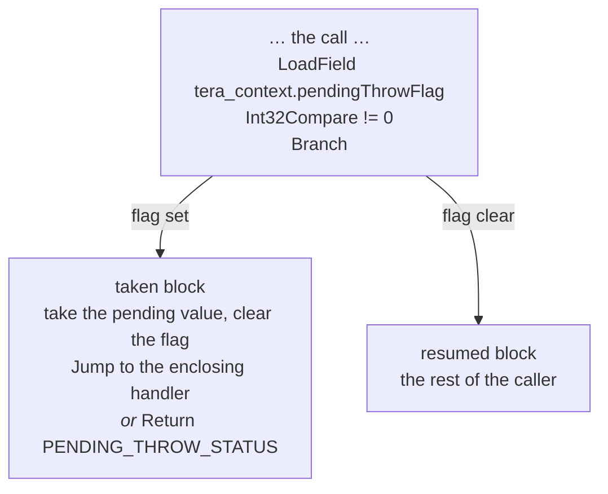

# 39. Building SSA from bytecode   ⟨· · J · N⟩

The bytecode of `Series.mean` is a flat array of forty-three instructions. The graph of
[Ch 38] is four blocks, two phis and twenty-two values. One function turns the first into the
second: `buildIR`, a single forward walk over the instruction array, with one accumulator and
one map from register slot to value node. It never goes backwards, it never computes a
dominator tree, and it produces valid SSA anyway.

That last claim is the chapter. Placing phis correctly is a named problem in compiler
literature, and the standard answer — Cytron's algorithm — begins by computing the dominator
tree and its iterated dominance frontiers, which is to say it begins by doing something a
single forward walk cannot do. The obstruction is concrete and it is visible in `mean`. When
the walk arrives at the loop header it has seen exactly one incoming edge. The values that
will arrive on the other one, `v13` and `v15`, do not exist yet; they will be produced by
instructions the walk has not read. Whatever the header decides at that moment is wrong for
at least one of its predecessors.

This builder's answer is to stop trying to be right. At a loop header it inserts a phi for
**every** live slot, whether or not anything will ever disagree about it, and lets a later
pass delete the ones that turned out to be unnecessary. The placement is correct by
construction and wasteful by construction, and the waste is somebody else's problem — three
lines in `eliminateTrivialPhis`, run four times in the pipeline for other reasons anyway. The
rest of the chapter is what else the walk does on the way: turning feedback into guards,
splicing callees in mid-walk, and — on the native tier only — a structural trick that gives
the whole compiler exception handling without any exception edges at all.

**What arrived.** From [Ch 37 § what-leaves]: a `RegisterCompiledFunction` with `osrCache`
populated — a `Map<number, OsrEntry | null>` keyed by bytecode offset, where a real entry is
`{code, slots}` and `null` means *asked once and refused, never ask again* — and with
`optimizedCode` possibly still `null`, because a function can reach compiled code through OSR
without ever having been optimized by call count. Underneath that: the instruction array,
constant pool and source map of [Ch 18] and [Ch 19], `localCount` / `paramCount` /
`registerCount`, and the feedback vector of [Ch 33]. From [Ch 38]: the `CFGFunction` /
`CFGBlock` / `CFGInstruction` shape, still empty — `Optimizer.build` has created the graph,
called `graph.addParameter(i)` once per parameter and `graph.addBlock()` once for the entry,
and hands both to `buildIR` (`src/optimizing/optimizer.ts:152-165`).

## One walk, no dominators

`buildIR` is `src/optimizing/builder/ir-builder.ts:304-455` — 152 lines — and its shape fits
in a paragraph. Two prepasses over the instruction array discover where the blocks are. Then
one loop from index 0 to the end. At each index: if a block starts here, finish the previous
one and merge whatever states were recorded for this target; then hand the instruction to
`compileInstruction`, which is a `switch` over the opcode; then, on the native tier and after
a call, splice in a pending-throw test. At the end, one sweep to pad any phi that is short.

Two pieces of mutable state ride through all of it, declared at `:315-316`:

```ts
  let acc: AnyNode = null;
  const regs: NodeMap = new Map();
```
— `src/optimizing/builder/ir-builder.ts:315-316`

`acc` is the accumulator's current value node; `regs` maps a register slot to the value node
that slot currently holds. That is the whole SSA construction state. There is no dominator
tree, no dominance frontier, no reaching-definitions solver and no second traversal. What
[Ch 42 § dominance] computes — Cooper–Harvey–Kennedy iteration, a dominator tree, the loop
forest — is computed *after* this, for the passes, and none of it exists while the graph is
being built.

The support cast is small and worth naming once, because everything below refers to it.
`src/optimizing/builder/cfg-state.ts` is 174 lines and holds the entire SSA construction
algorithm: `rememberIncomingState`, `mergeIncomingState`, `openLoopHeader`,
`addLoopBackedgeInputs`, and the helpers `definedValue`, `incomingValues` and `liveSlots`.
`src/optimizing/builder/register-liveness.ts` (154 lines) is a backward bitset dataflow over
the bytecode, used by the frame states of [Ch 40]. `src/optimizing/builder/throw-recovery.ts`
(215 lines) is § exceptions-with-no-exception-edges.
`src/optimizing/builder/inline.ts` (1,157 lines) is a nested copy of everything in this
chapter. And `compileInstruction` is `ir-builder.ts:475-2270` — one `switch`, about 1,800
lines. It is large because the bytecode is large; splitting it would move the same dispatch
somewhere else, so it carries no honesty marker, only this sentence.

## Finding the blocks

Two prepasses, eighteen lines between them, and no analysis in either.

```ts
  for (let i = 0; i < instructions.length; i++) {
    const instr = instructions[i];
    const target = jumpTargetOf(instr) ?? (recovers ? handlerTargetOf(instr) : null);
    if (target !== null) {
      if (!blockMap.has(target)) {
        blockMap.set(target, graph.addBlock());
      }
      if (i + 1 < instructions.length && !blockMap.has(i + 1)) {
        blockMap.set(i + 1, graph.addBlock());
      }
    }
  }

  for (let i = 0; i < instructions.length; i++) {
    const target = jumpTargetOf(instructions[i]);
    if (target !== null && target <= i && blockMap.has(target)) {
      blockMap.get(target)!.isLoopHeader = true;
    }
  }
```
— `src/optimizing/builder/ir-builder.ts:351-369`

The first pass says: every jump target begins a block, and so does the instruction
immediately after a jump. Those are the two ways control can enter or leave in the middle of
a straight run, which is exactly the definition of a basic block boundary
[Ch 38 § what-a-register-cannot-tell-you]. When `graph.recoversThrows` is set — the native
tier only — a handler target also begins a block, which is what
`?? (recovers ? handlerTargetOf(instr) : null)` adds.

The second pass is the one to slow down for. `target <= i` is the back-edge test of
[Ch 19 § absolute-targets-and-what-a-back-edge-is], reused here on a static instruction array
instead of on a running `pc`, and what it marks is a *loop header*.

> **New idea. A loop header.** The block a back edge points *at* is the **loop header**: the
> one block every iteration of the loop passes through, and the only block in the loop that
> can be entered from outside it. That gives it a property no other block has — it has at
> least two predecessors, and at least one of them comes from *later* in the program than the
> header itself. Everything hard about SSA construction lives in that sentence.
>
> The test for it here is purely syntactic: compare two integers. It is also the *whole* of
> the builder's loop analysis. It does not identify the loop's body, its exits, its nesting,
> or whether the loop is even reducible, because none of that is needed to place phis — the
> only question is "does control ever arrive here from later in the program?" The real loop
> analysis — natural loops, the loop forest, preheaders, exiting blocks — is
> [Ch 42 § loops], computed later and for the passes.

For `mean`, the only jump target at or before its own jump is bytecode offset 4, from the
`Jump r4` at offset 31. So `B3` is a loop header and nothing else is
`[t: tests/optimizing/builder/cfg-state.test.ts > "creates a phi for every local slot"]` is
the unit-level statement of what that flag then causes. In the printed graph the flag shows
up as the word `loop-header` in the block header:

```
  B3 loop-header succs=B2,B1 preds=B0,B2:
```
— one line of the output of
`node dist/cli.js --print-ir --opt-threshold 1 --baseline-threshold 1 --filter mean docs/example/stats.tera`

Note what the two prepasses do *not* do: they create blocks for targets, but they do not wire
any edges. Successors and predecessors are added by the main walk, as it emits each jump and
branch, which is what keeps predecessor order aligned with the order the walk discovered the
edges — and phi inputs are parallel to predecessor order
[Ch 38 § canonical-phi-ssa], so that alignment is load-bearing.

## The accumulator and the slot map

Register bytecode has one implicit value, the accumulator [Ch 18 § the-protocol-in-one-page],
and every `Star`/`Ldar` pair in the listing exists to park a value out of its way and bring it
back. `buildIR` models the accumulator as a plain local variable, `acc`, and models `Star r`
and `Ldar r` as map operations rather than as emitted nodes:

`Star r2` sets `regs.set(2, acc)`. `Ldar r2` sets `acc = regs.get(2)`. Nothing is emitted for
either. That is the refund [Ch 18 § what-a-plus-b-costs] promised: the four
shuffle instructions per binary operator that the interpreter and the baseline compiler both
execute cost the two compiling tiers nothing at all, because the shuffle is *interpreted at
build time* into a change of which slot points at which node.
`[t: tests/optimizing/builder/ir-builder.test.ts > "lowers MOV as source then destination"]`
pins the same treatment for `Mov`, which is the two-register form.

Across a block boundary `acc` cannot simply be a local variable, because control might arrive
from somewhere else. It is handed between blocks through a field on the block itself,
`CFGBlock._lastAcc` (`src/optimizing/ir/index.ts:211`), which `compileInstruction` writes and
the walk reads back at `ir-builder.ts:435`.

For merging, `cfg-state.ts` refuses to treat the accumulator as special at all. It folds it
into the same slot map under a reserved index:

```ts
const ACC_SLOT = -1;
```
— `src/optimizing/builder/cfg-state.ts:9`

`stateValue` (`:53-59`) reads `state.acc` when the slot is `ACC_SLOT` and `state.regs.get(slot)`
otherwise, and every other function in the file just iterates slots. So merging a join, placing
loop phis and filling a missing value are each **one** code path rather than two, and the
accumulator gets a phi at a merge point on exactly the same terms a register does
`[t: tests/optimizing/builder/cfg-state.test.ts > "fills undefined for an accumulator missing from one predecessor"]`.
`-1` sorts before every real slot, which is the only reason `liveSlots` returns it first.

Two things seed `regs` before the walk starts. Parameters:

```ts
  const receiverSlots = graph.receiver === true ? 1 : 0;
  for (let i = 0; i < compiledFn.paramCount; i++) {
    regs.set(i, graph.parameters[i + receiverSlots]);
  }
```
— `src/optimizing/builder/ir-builder.ts:321-324`

Parameter *i* of the source lives in register slot *i*, and the graph's parameter node for it
is at index `i + receiverSlots`, because a method's receiver occupies parameter 0 of the graph
without occupying a register slot. In `total_of` (`docs/example/stats-deopt.tera`) that is
`regs.set(0, v0)`, and `v0 = Parameter [index=0]` is the first thing the printed graph lists.
In `mean` it does nothing at all: `mean` is a method, but the JIT road builds it with
`classes === null`, so `graph.receiver` is false, `paramCount` is 0, and the dump says
`params=0` with `LdaThis` becoming `Constant [value=undefined, isThis=true]` — which is also
why the wasm backend refuses `mean` with `property access on this receiver`
[Ch 1 § the-instrument].

The second seed is closure-captured slots. `capturedLocalSlots` (`:246-255`) takes the slots
`closureCapturedSlots` reports and drops the ones erased by a class binding; for each, the
builder emits a `StoreContextSlot` in the entry block and points `regs` at the store
(`:330-345`). A captured local is not a register any more — it lives in a context object that
outlives the frame [Ch 20] — so the slot map has to point at the store rather than at the
value.

## Remembering what arrives

The builder never asks "what values reach this block?" It accumulates the answer as it goes,
and the accumulation is one function:

```ts
export function rememberIncomingState(
  states: IncomingStatesByTarget,
  target: number,
  predecessor: CfgBlock,
  regs: RegisterState,
  acc: CfgNode | null | undefined,
): void {
  let group = states.get(target);
  if (!group) {
    group = [];
    states.set(target, group);
  }
  group.push({ predecessor, regs: new Map(regs), acc });
}
```
— `src/optimizing/builder/cfg-state.ts:24-37`

Keyed by the **bytecode offset** of the target, not by block, and storing a *copy* of `regs`
— `new Map(regs)` — because the walk is about to keep mutating the original.

It is called on every edge the builder creates, and there are exactly five call sites:

| where | line | edge |
| --- | --- | --- |
| the main walk | `ir-builder.ts:383` | fallthrough into a discovered block |
| `ROP_JUMP` | `:1457` | an unconditional jump |
| `ROP_JUMP_IF_*` | `:1473` | the jump-taken arm |
| `ROP_JUMP_IF_*` | `:1475` | the fall-through arm |
| `ROP_THROW` | `:2169` | a throw landing in an enclosing handler |

and a sixth inside `recoverAfterCall` (`throw-recovery.ts:211`), for the native tier's
implicit throw edge. Every edge, no exceptions — which is what makes the target's job
mechanical when the walk finally arrives there.

`incomingValues` (`cfg-state.ts:61-73`) is the read side, and it does one thing worth noticing:
it iterates `block.predecessors`, not the recorded states, looking each predecessor up in a
map. So the order of the values it returns is the order of `block.predecessors`, and the phi
built from them is aligned by construction rather than by care.

A slot may be missing from one arm — assigned in the `if` branch and not the `else` — and a
phi may not have a hole in it. `definedValue` closes that:

```ts
export function definedValue(
  value: CfgNode | null | undefined,
  home: CfgBlock,
): CfgNode {
  if (value) return value;
  return homeInstruction(irConstant(undefined), home);
}
```
— `src/optimizing/builder/cfg-state.ts:39-45`

A `Constant undefined`, homed **in the predecessor that was missing it** rather than in the
merge block, which is what keeps the use-def dominance rule of [Ch 38 § three-classes-and-nothing-else]
true for the phi's *i*th input
`[t: tests/optimizing/builder/cfg-state.test.ts > "fills undefined for a register missing from one predecessor"]`.

## Merging a join

For an ordinary merge — the block after an `if`, the block after a `while` — the whole
algorithm is twenty-four lines. `mergeIncomingState(block, states, regs, acc)` takes the
target block, the states recorded for it, the walk's slot map to overwrite, and the incoming
accumulator; it returns the accumulator the merged block should start with. Its body:

```ts
  if (states.length === 0) return acc ?? null;

  const byPredecessor = indexByPredecessor(states);
  const slots = liveSlots(states, []);
  let nextAcc: CfgNode | null = null;
  regs.clear();

  for (const slot of slots) {
    const incoming = incomingValues(block, byPredecessor, slot, block);
    const first = incoming[0];
    const uniform = incoming.every((value) => value === first);
    const selected = uniform ? first : addPhi(block, incoming);
    if (slot === ACC_SLOT) nextAcc = selected;
    else regs.set(slot, selected);
  }

  return nextAcc;
}
```
— `src/optimizing/builder/cfg-state.ts:157-174`

Index the recorded states by predecessor. Take the union of every slot any predecessor
mentions — `liveSlots(states, [])`, with an empty seed, so a slot no arm defines is simply
absent afterwards
`[t: tests/optimizing/builder/cfg-state.test.ts > "drops registers that no predecessor defines"]`.
For each slot, collect one value per predecessor in predecessor order. If they are all the
same node, keep the node; otherwise build a phi.

That `uniform` test is the difference between this and a naive construction. A block with
four predecessors and thirty live slots, twenty-eight of which hold the same value on every
path, gets two phis and not thirty
`[t: tests/optimizing/builder/cfg-state.test.ts > "keeps a single value when every predecessor agrees"]`,
and a phi appears exactly where the predecessors disagree
`[t: tests/optimizing/builder/cfg-state.test.ts > "creates phis for registers that differ across predecessors"]`.
`regs.clear()` before the loop is what makes the merge authoritative: after it, the slot map
holds exactly what the union of the arms established and nothing left over from the arm the
walk happened to leave last.

This is complete and correct for every join in a program — except one.

## The problem a loop header has

Walk `mean` and stop the instant the builder reaches bytecode offset 4.

`B0` has been built: `total` is `v0`, `i` is `v1`, and the walk has recorded one incoming
state for target 4, from `B0`. Offset 4 is a loop header, because offset 31 jumps back to it.
So `B3` will have two predecessors. One of them is known. The other is `B2`, which does not
exist yet, and the values that will arrive along it — `v13`, the `GenericAdd` that computes
the next `total`, and `v15`, the `Float64Add` that computes the next `i` — do not exist yet
either, because they are produced by instructions 15 through 30, which the walk has not read.

The node ids in the finished dump are the proof, because ids come from one counter in
creation order [Ch 38 § three-classes-and-nothing-else]:

```
  B3 loop-header succs=B2,B1 preds=B0,B2:
    v3 = Phi v0, v13 [index=0]
    v4 = Phi v1, v15 [index=1]
```
— three lines of the output of
`node dist/cli.js --print-ir --opt-threshold 1 --baseline-threshold 1 --filter mean docs/example/stats.tera`

`v3` and `v4` were created *before* `v13` and `v15`. The phis are older than half their own
inputs.

> **New idea. SSA construction, and why a loop is the hard case.** Turning a program with
> mutable storage into SSA means, for every read, finding the writes that could reach it, and
> inserting a phi wherever more than one can. For straight-line code and for `if`/`else` that
> is easy: walk forwards, and at each merge compare what the arms produced — which is exactly
> `mergeIncomingState`.
>
> A loop breaks the method because it makes the program cyclic. The header's phi needs the
> value produced at the bottom of the body, and the bottom of the body needs the header's phi
> to compute it. Neither can be resolved first. Every SSA construction algorithm is an answer
> to this one obstruction, and the answers differ only in *when* they are allowed to be
> wrong: Cytron computes dominance frontiers up front so it never places a phi it does not
> need; Braun's algorithm places phis on demand and marks them incomplete; this builder
> places them eagerly and removes them afterwards. All three produce the same final graph.

The obstruction is not an implementation wart, and it is not avoidable by being cleverer
about the walk. It is why SSA construction has a literature.

## Why the obvious design fails

*(Why the obvious design fails.)*

Two designs present themselves, and both are real answers used by real compilers.

**Two passes.** Discover the loops first, then build. Walk the bytecode once to find the back
edges and, for each header, work out which slots the body writes; then walk again, and at the
header place a phi for exactly those slots. It is correct and it places nearly the minimum
number of phis. The cost is that the builder must now be traversable twice over the same
bytecode with two different behaviours, and that "which slots does the body write" is itself
a fixpoint once loops nest — the inner loop's writes are the outer loop's writes. The
prepasses in § finding-the-blocks are eighteen lines precisely because they answer a
question that needs no fixpoint; this would not be one of those.

**Cytron.** Compute the dominator tree, compute the iterated dominance frontier of every
definition, and insert a phi at exactly the blocks in it. This is the textbook algorithm and
it places the minimal number of phis, which is a genuinely valuable property. It also
requires the dominator tree *before* construction, in a builder whose entire shape is one
forward walk over an array — and the dominator tree requires the control-flow graph, which is
what the walk is building. The circularity is breakable (the prepasses could construct the
block graph first, then dominators, then values) at the cost of turning a 152-line function
into three phases.

What this tree does instead is `openLoopHeader(block, states, regs, localCount, entryHome)`,
which returns a map from slot to phi, and the interesting line is its second:

```ts
  const byPredecessor = indexByPredecessor(states);
  const slots = liveSlots(states, range(localCount)).filter(
    (slot) => slot !== ACC_SLOT,
  );
  const phis = new Map<Slot, CfgNode>();
  regs.clear();
  for (const slot of slots) {
    const phi = addPhi(
      block,
      incomingValues(block, byPredecessor, slot, entryHome),
    );
    phis.set(slot, phi);
    regs.set(slot, phi);
  }
  return phis;
}
```
— `src/optimizing/builder/cfg-state.ts:98-113`

`liveSlots(states, range(localCount))` seeds the slot set with **every local slot the function
has**, then adds every slot any recorded predecessor mentions. The accumulator is filtered out
— a loop header never needs an accumulator phi, because the accumulator is dead across a jump
in this bytecode. Then a phi for each, holding only the entry inputs, and `regs` is cleared
and re-seeded *entirely* from the phis.

> **New idea. Maximal phi placement.** Instead of working out which values actually differ
> around the loop, insert a phi for every slot that is live and let each one *stand in* for the
> slot for the rest of the loop. Every read inside the body now reads a phi, which is correct
> no matter which edge control arrived on, because the phi is defined to be "whichever
> arrived". Nothing downstream has to know the difference between a phi that was needed and
> one that was not.
>
> It is correct by construction: the header cannot get a slot wrong, because it committed to
> nothing about that slot's value. It is wasteful by construction: a slot whose value never
> changes in the loop gets a phi whose two inputs are the same thing. And the waste is
> local and mechanical — a phi with one distinct input is *trivially* foldable, by inspection,
> with no analysis — which is why it can safely be somebody else's problem.

That re-seeding of `regs` from the phis is the part that makes the rest of the walk work
without further thought. From the header onwards, "the value in slot 1" *is* the phi, so
`total += this.values[i]` in the body reads `v3` and `v4`, and the values it computes become
the latch inputs to those same phis. The cycle closes itself.

One detail is easy to get backwards and there is a test for it. The phis' entry inputs come
from the *recorded* incoming states, not from the `regs` the walk is currently carrying — the
walk's `regs` may have been mutated by instructions between the fallthrough and the header
`[t: tests/optimizing/builder/cfg-state.test.ts > "seeds header phis from the recorded entry state, not the walking state"]`.

Immediately after opening the header, the builder writes down what it did:

```ts
        graph.osrCandidates.set(i, {
          headerBlockId: nextBlock.id,
          slots,
          phiIds: slots.map((slot) => phis.get(slot)!.id),
        });
```
— `src/optimizing/builder/ir-builder.ts:405-409`

Every loop header gets an OSR candidate, hot or not, keyed by the header's bytecode offset —
which is why `mean`'s graph attribute line reads
`osrCandidates=Map{4: {headerBlockId: 3, slots: [0, 1], phiIds: [3, 4]}}`. [Ch 37] is what
consumes it.

## Closing the back edge

When the walk finally reaches offset 31 and emits the jump back to offset 4, it calls
`closeLoopEdge` (`ir-builder.ts:457-469`), which forwards to `addLoopBackedgeInputs`. That
function has three jobs, and the first line of it is the one that explains the other two:

```ts
  const expectedInputs = block.predecessors.length + 1;
```
— `src/optimizing/builder/cfg-state.ts:124`

One ahead of the predecessor count, because the latch edge is being added *right now* and has
not been linked yet. The `ROP_JUMP` case calls `rememberIncomingState` at `:1457`,
`closeLoopEdge` at `:1458`, and `link(block, targetBlock)` only at `:1461` — so while
`addLoopBackedgeInputs` runs, `B3.predecessors` is still `[B0]` and `expectedInputs` is 2.

The three jobs:

**Append the latch value.** For each slot the walk currently holds, if the header's phi for
that slot is short, append what `regs` says:
`if (phi.inputs.length < expectedInputs) phi.addInput(regs.get(slot) || phi)` (`:143`). For
`mean`'s slot 0 that appends `v13`; for slot 1, `v15`. The phis are now complete.

**Create a late phi.** A slot the header did *not* open — because it was not live on entry
and not among `range(localCount)` — may nonetheless be live at the latch. The header cannot
be reopened cheaply, but a phi can be added to it late, and then every recorded state that
names this block as its predecessor has to be told about it:

```ts
  const republish = (slot: Slot, phi: CfgNode): void => {
    for (const group of statesByTarget.values()) {
      for (const state of group) {
        if (state.predecessor === block) state.regs.set(slot, phi);
      }
    }
  };
```
— `src/optimizing/builder/cfg-state.ts:125-131`

Without `republish`, a block whose incoming state was snapshotted from the header before the
late phi existed would go on reading the pre-phi value — a value that is only correct on the
first iteration.

**Self-reference the rest.** A phi the header opened for a slot the latch does not define
gets itself as its latch input: `if (phi.inputs.length < expectedInputs) phi.addInput(phi)`
(`:147`). That is not a placeholder. A phi whose only non-self input is `x` *means* `x`, on
every path, which is exactly what "this slot was never written in the loop" says.

`docs/example/stats-deopt.tera` shows all of this landing. `total_of` has three locals —
`r0=values`, `r1=total`, `r2=i` — so `openLoopHeader` places three phis, and the builder's own
record says so: `slots: [0, 1, 2], phiIds: [4, 5, 6]`. Nothing in the body writes slot 0, so
`addLoopBackedgeInputs` gives `v4` itself as its latch input, and `v4` becomes
`Phi v0, v4`. Its only non-self input is `v0`.

## The padding sweep

The last thing `buildIR` does before returning is five lines:

```ts
  for (const block of graph.blocks) {
    const phis = loopPhiMap.get(block.id);
    if (!phis) continue;
    for (const phi of phis.values()) {
      while (phi.inputs.length < block.predecessors.length) phi.addInput(phi);
    }
  }
```
— `src/optimizing/builder/ir-builder.ts:448-454`

The invariant it exists to satisfy is [Ch 38 § canonical-phi-ssa]'s:
`phi.inputs.length === block.predecessors.length`, enforced by `validatePhis`
(`src/optimizing/validation/graph-validator.ts:335-350`) and pinned by
`[t: tests/optimizing/validation/graph-validator.test.ts > "accepts a phi whose input count matches the predecessor count"]`.
A loop header with two back edges — a `continue` as well as a natural latch — acquires a third
predecessor after `addLoopBackedgeInputs` has already run for the first one, and any phi
created in between is short.

The choice of filler is the deliberate part. It is the phi **itself**, and it could not be a
`Constant undefined`.

`trivialPhiInput` (`src/optimizing/ir/index.ts:183-196`) skips inputs equal to the phi when it
looks for a unique other input, and `eliminateTrivialPhis` does the same
(`src/optimizing/passes/dce.ts:84`: `if (!input || input === phi) continue;`). So a self-input
is invisible to the fold. Pad a two-input phi with a third self-input and it still folds to
its unique real input. Pad it with a `Constant undefined` and it now has two distinct inputs,
is no longer trivial, and is pinned in the graph forever — carrying a value that is not merely
useless but *wrong*, since the padded edge is one control can genuinely take. The filler had
to be the identity element of the fold, and self is it.

## Someone else deletes the excess

`eliminateTrivialPhis` is forty-seven lines in `src/optimizing/passes/dce.ts:61-107`, and it is
a worklist:

```ts
    let unique: DceNode | null = null;
    let trivial = true;
    for (const input of phi.inputs) {
      if (!input || input === phi) continue;
      if (unique === null) unique = input;
      else if (unique !== input) {
        trivial = false;
        break;
      }
    }
    if (!trivial || unique === null) continue;

    const phiUses = phi.uses.filter((use) => use.type === ir.IR_PHI && use !== phi);
    replaceValueUses(graph, phi, unique);
    folds.set(phi, unique);
    for (const use of phiUses) enqueue(use);
```
— `src/optimizing/passes/dce.ts:81-96`

Seed the worklist with every phi. Ignore self-inputs. If at most one distinct other input
remains, replace every use of the phi with that input and record the fold. Re-enqueue any phi
that used it, because collapsing one phi can make its consumers trivial in turn — that is what
makes a chain of over-placed phis collapse in one pass rather than needing the pass run again.
Then `removePhis` per block and one `rebuildUses`.

`total_of` is the whole story in one dump. Three phis placed, `phiIds: [4, 5, 6]`; `v4` is
`Phi v0, v4`, whose only non-self input is `v0`; the fold replaces its uses with `v0` and
deletes it. What is left:

```
  B3 loop-header succs=B2,B1 preds=B0,B2:
    v5 = Phi v1, v11 [index=0]
    v6 = Phi v2, v13 [index=1]
    v7 = GenericGetProp v0 [propName="length"] !fs
```
— four lines of the output of
`node dist/cli.js --print-ir --opt-threshold 1 --baseline-threshold 1 --filter total_of docs/example/stats-deopt.tera`

Two phis for the two slots that actually change, and `v7` reading `v0` — the parameter —
directly. `mean`, whose two locals both change, places two phis and keeps both. Place a phi
per slot, delete the excess.

A sibling pass, `eliminateDeadPhis` (`dce.ts:109-139`), removes phis nothing uses — with one
condition that is the first appearance of the next chapter's rule:

```ts
      const dead = new Set(
        block.phis.filter(
          (phi) => phi.uses.length === 0 && !frameStateReferenced.has(phi),
        ),
      );
```
— `src/optimizing/passes/dce.ts:125-129`

`uses.length === 0` is not enough. A phi named by a frame state is live even with an empty use
list, because a deoptimization will need its value to rebuild the interpreter frame. That is
[Ch 40 § the-second-use-graph] in one line.

The pipeline runs trivial-phi elimination **four** times —
`trivial-phi-elimination-early` (`src/optimizing/pipeline.ts:124`), `trivial-phi-elimination`
(`:239`), `trivial-phi-elimination-after-late-escape` (`:254`) and
`trivial-phi-elimination-after-unreachable` (`:272`) — not because once is insufficient for
the builder's phis, but because later passes make new trivial ones: unreachable-block
elimination removes a predecessor and leaves a phi with one real input; escape analysis
replaces an allocation with scalars and leaves phis over them. Cleaning up after the builder
adds no pipeline step of its own, since the pass had to be in the pipeline anyway.

> `eliminateTrivialPhis` has no test file of its own. It is called directly by one pair of
> tests about pipeline order —
> `[t: tests/optimizing/pipeline-order.test.ts > "cannot hoist a value carried through an untouched loop-header phi"]`
> builds a loop that carries an invariant through a header phi and asserts LICM will not hoist
> it, and
> `[t: tests/optimizing/pipeline-order.test.ts > "hoists that same value once trivial phis have been eliminated first"]`
> runs the fold and asserts the hoist then happens — which pins the fold by its consequence
> rather than by its output. Its effect on `total_of` specifically is `[unpinned]`, and is
> visible only by running `--print-ir` and comparing the header against `osrCandidates`.

That comparison is possible because nothing keeps the two in step, which is a defect as well
as a demonstration:

> **Unenforced.** `CFGFunction.osrCandidates` records `phiIds` at build time
> (`src/optimizing/builder/ir-builder.ts:405-409`) and no pass updates it when a phi is
> folded. `--print-ir` on `docs/example/stats-deopt.tera` shows a candidate naming
> `phiIds: [4, 5, 6]` for a header that holds only `v5` and `v6` — the record is stale the
> moment the first `trivial-phi-elimination-early` runs. `applyOsrTransform`
> (`src/optimizing/passes/osr.ts:167-169`) copes by giving up:
> `const phi = originalPhiById.get(phiId); if (!phi) return false;` — it declines OSR for that
> loop rather than repairing the record, and `Optimizer.build` then sets
> `graph.bailout = "no osr entry at ${osrOffset}"` (`src/optimizing/optimizer.ts:182`). This is
> live-safe in the shipped order, because the OSR transform runs *before* `runMiddleEnd`
> (`src/optimizing/optimizer.ts:172-188`) and so
> sees the untrimmed phis. What it costs is that a printed post-optimization graph cannot be
> used as an OSR fixture: parse it back and every candidate in it is unusable. Closing it
> costs `eliminateTrivialPhis` rewriting `osrCandidates` alongside the fold — it already knows
> the mapping, in `folds`.

## Feedback becomes speculation

The other half of `compileInstruction` is where [Ch 33]'s feedback vector turns into graph
structure. The pattern is the same at every site and it is worth stating before the
instances: **feedback never becomes a fact.** It becomes a guard node, which checks the guess
at run time, plus a dependency registered against the runtime, which promises to invalidate
the code if the world changes underneath it.

A monomorphic property load — the interpreter saw one hidden class at this site, every time:

```ts
          const check = ir.irCheckMap(obj, mapId, mapVersion);
          check.frameState = frameState;
          block.addNode(check);
          graph.addDependency(DEP_MAP, mapId, mapVersion);
          const load = ir.irLoadField(check, offset);
          block.addNode(load);
```
— `src/optimizing/builder/ir-builder.ts:1103-1108`

A `CheckMap` on the receiver, then a `LoadField` at a fixed byte offset — reading the *guard*,
not the original object, so that the guard cannot be scheduled away from the load — plus
`addDependency(DEP_MAP, mapId, mapVersion)`. The guard carries a frame state so that a failure
can deoptimize [Ch 40]; the dependency is what the runtime consults when that map changes
[Ch 54 § lazy-deopt].

A polymorphic one — two to four shapes seen — emits no map check at all:

```ts
          const load = ir.irPolymorphicLoad(obj, maps, offsets);
```
— `src/optimizing/builder/ir-builder.ts:1145`

`maps` and `offsets` are parallel arrays in `props`, and the lowering that turns them into a
comparison chain is [Ch 47]. An array element read is the longest chain:

```ts
        const chkArray = ir.irCheckArray(obj);
        chkArray.frameState = frameState;
        block.addNode(chkArray);
        const chkKind = ir.irCheckElementsKind(chkArray, elementsKind);
        chkKind.frameState = frameState;
        block.addNode(chkKind);
        graph.addDependency(DEP_ELEMENTS_KIND, elementsKind);

        const chkSmi = ir.irCheckSmi(index);
        chkSmi.frameState = frameState;
        block.addNode(chkSmi);

        const chkBounds = ir.irCheckBounds(chkSmi, chkKind);
        chkBounds.frameState = frameState;
        block.addNode(chkBounds);
```
— `src/optimizing/builder/ir-builder.ts:1330-1344`

Five nodes for `values[i]`: it is an array, its elements are packed the way we saw, the index
is a small integer, the index is in bounds, and only then the load. Every one of those guards
shares the *same* `frameState` object, because they all deoptimize to the same bytecode
offset. And `.length` on a receiver whose elements kind is known collapses to a single
`LoadArrayLength` behind the same two guards (`:1056-1064`).

The last property of this machinery is the one that keeps the builder honest: **every branch
has an `else` that emits the generic node**. `propertyHint` absent, or `protoDepth` non-zero,
or `mapVersion` null, and the code at `:1114-1125` emits a plain `GenericGetProp` with a frame
state and moves on. The builder degrades; it does not refuse. That is exactly what `mean`'s
graph shows — five `GenericGetProp`/`GenericGetIndex` nodes and not one `CheckMap`, because
this dump was taken at `--opt-threshold 1`, before the interpreter had run the function often
enough to have anything useful to say.

## Branch bias steers block order

One more feedback consumer, and it is thirteen lines wide:

```ts
function hotSuccessorOf(
  feedback: FeedbackLike,
  operands: readonly number[],
  op: number,
): "true" | "false" | null {
  const slot = operands.length > 1 ? operands[1] : -1;
  if (slot < 0) return null;
  const bias = feedback.branch(slot).bias;
  if (bias !== "likely-true" && bias !== "likely-false") return null;
  const jumpTaken = op === bytecode.ROP_JUMP_IF_FALSE ? "false" : "true";
  const notTaken = jumpTaken === "true" ? "false" : "true";
  return bias === "likely-true" ? jumpTaken : notTaken;
}
```
— `src/optimizing/builder/ir-builder.ts:232-244`

Operand 1 of a conditional jump is a feedback slot [Ch 19 § if-and-ifelse]. The
recorded bias says whether the *jump* was usually taken; the IR's `Branch` node has a
`trueBlock` and a `falseBlock` that do not correspond, because `JUMP_IF_FALSE` jumps when the
condition is false. Those four lines of inversion are the whole of the correction, and the
result is stamped onto the node as a `props` key:

```ts
        const hot = hotSuccessorOf(feedback, operands, op);
        if (hot !== null) branch.props.hotSuccessor = hot;
```
— `src/optimizing/builder/ir-builder.ts:1492-1493`

A hint in the props bag [Ch 38 § the-props-bag], with exactly one consumer in `src/`, and it
is not the one you would guess. `hotBlocks` (`src/optimizing/backends/wasm/graph-support.ts:774-786`)
reads `props.hotSuccessor` to work out which successor is hot, and
`hotBoxedReturnRejection` (`:788-803`) uses that to **decline** wasm compilation when a
boxed numeric return sits on a hot path — a cost-model refusal, not a block ordering
[Ch 48]. Nothing in the AOT block layout of [Ch 69] reads it today.

All three links of this were dead until 2026-08-18, and the failure was instructive because
each link looked fine on its own. No feedback slot was ever allocated for a conditional jump,
so `operands.length > 1` was false and `hotSuccessorOf` returned `null` at its second line.
Then, once slots were allocated, the interpreter's slot-initialisation pass had no case for
the jump opcodes, so `getSlot(n)` answered `null`. And `BaselineRuntime.branch` was typed
`taken: TaggedValue` while the baseline emitter passed a literal JavaScript `true`/`false`
through `toBool` — and `toBool(false)` returns `true`, because a JavaScript boolean is not a
tagged value — so every branch that did get recorded recorded "taken", and `getBranchBias()`
answered `likely-true` for everything. Three independent defects, each of which made the other
two unobservable. The regression test is
`[t: tests/optimizing/baseline/runtime.test.ts > "branch feedback" > "records a not-taken branch as not taken"]`,
which asserts on `getBranchBias()` rather than on any intermediate link and therefore fails if
the `toBool` coercion creeps back; its siblings `> "records a taken branch as taken"` and
`> "reports an evenly split branch as mixed"` cover the other two answers. The general rule: a
signal with three links and no test at the end of it is not a feature, and the way to find out
is to assert on the *last* link, not on each one.

There is still a hole, and [Ch 33 § two-writers-one-vector] owns it: the interpreter types a
branch slot but never writes one, so a function that reaches the JIT without ever running in
baseline has no bias at all.

## Exceptions with no exception edges

This is the chapter's best structural idea, and it belongs to one tier. `graph.recoversThrows`
defaults to `false` (`src/optimizing/optimizer.ts:128`) and is set only by
`compileAotFunctionsInRuntime` (`src/api/engine.ts:1063`), from:

```ts
function needsThrowRecovery(selected: readonly RegisterCompiledFunction[]): boolean {
  if (selected.some(catchesThrows)) return true;
  return selected.some((fn) => fn.isAsync === true) && selected.some(raisesThrows);
}
```
— `src/api/engine.ts:480-483`

The JIT never turns it on, because the JIT does not need to: a wasm module runs inside a host
that has exceptions, and a throw unwinds through it. A native binary has no host.

> **New idea. An exception edge, and a landing pad.** In most compiler IRs, a call that might
> throw is a special kind of terminator with *two* successors — the normal one and the handler
> — LLVM spells it `invoke`, and the handler block is a **landing pad**. It is an honest
> representation, and it is expensive in a different currency than you would expect: every
> analysis and every pass in the compiler now has to know that some edges are exception edges,
> that a landing pad has a distinguished first instruction, and that a value defined before a
> throwing call may or may not be available in the handler.

tera pays none of that, by making the exception edge an *ordinary* edge on an *ordinary*
branch.

`handlerStacksOf` (`src/optimizing/builder/throw-recovery.ts:169-196`) walks the bytecode once
with a worklist, giving every offset the stack of handlers covering it — pushing a handler at
`enter-handler`, popping at `leave-handler`, propagating along jumps and fallthroughs, and
stopping at `terminate`. Twelve of the file's tests pin its edge cases, from
`[t: tests/optimizing/builder/throw-recovery.test.ts > "covers the body between a try and its end with the handler it declares"]`
through
`[t: … > "nests an inner handler on top of the one already covering the body"]` to
`[t: … > "answers an empty stack for an instruction no path reaches"]`.

Then, after **every** call in `RECOVERABLE_CALLS` — `ROP_CALL`, `ROP_CALL_METHOD`,
`ROP_CALL_NAMED`, `ROP_CALL_METHOD_NAMED`, `ROP_AWAIT` (`ir-builder.ts:64-70`) — the walk
splices in a test (`ir-builder.ts:436-445`):



`branchOnPendingThrow` (`throw-recovery.ts:143-155`) loads a flag field out of the
`tera_context` runtime structure, compares it to zero, and emits an ordinary `Branch` into two
fresh blocks. `recoverAfterCall` (`:198-215`) then fills the taken block one of two ways:

```ts
  const { taken, resumed } = branchOnPendingThrow(graph, block);
  if (landing === null) {
    returnPendingThrow(taken);
    return resumed;
  }
  const thrown = takePendingThrow(taken);
  rememberIncomingState(savedBlockRegs, landing.target, taken, regs, thrown);
  taken.addNode(ir.irJump(landing.handler));
  link(taken, landing.handler);
  return resumed;
```
— `src/optimizing/builder/throw-recovery.ts:205-214`

Under no handler, the function returns a marked status node the caller's own test will notice
`[t: tests/optimizing/builder/throw-recovery.test.ts > "returns the pending throw when the call sits under no handler"]`.
Under a handler, it takes the pending value, records an incoming state for the handler's
bytecode offset with the thrown value riding in the accumulator slot, and jumps
`[t: … > "jumps to the handler and remembers the thrown value for it when one is in scope"]`.
That `rememberIncomingState` call is the join between the two mechanisms in this chapter: the
handler block gets its phis from the ordinary merge machinery, because the throw edge was
recorded exactly like every other edge
`[t: … > "carries the register state of the call site into the handler's incoming state"]`.
The split itself is pinned by
`[t: … > "splits the block into a taken and a resumed half, both linked from it"]`.

The payoff is what is *absent*. There is no exception edge kind, no `invoke` opcode, no
landing-pad concept, and no rule anywhere in `src/optimizing/passes/` about them. Every pass
in Parts VII through X sees ordinary blocks, ordinary branches and an ordinary field load, and
needs to know nothing about exceptions. The cost is a load, a compare and a branch after every
call in a native binary, which is a real cost paid in code size and in the optimizer's ability
to reason across calls — and which is exactly the cost a two-successor `invoke` avoids. The
trade is stated, not hidden.

## The two prose bail-outs

Not every opcode has a lowering. When `compileInstruction` meets one it cannot handle, it
calls `bailOut`:

```ts
function bailOut(
  graph: AnyGraph,
  compiledFn: AnyCompiledFunction,
  op: number,
  bytecodeIdx: number,
): void {
  const explained = UNSUPPORTED_REASONS.get(op);
  const reason =
    explained ??
    `unhandled opcode ${bytecode.rOpcodeName(op)} (0x${op.toString(16)}) at bc:${bytecodeIdx}`;
  graph.bailout ??= reason;
  tracer.jitCompile(functionName(compiledFn), `Bailout: ${reason}`);
}
```
— `src/optimizing/builder/ir-builder.ts:132-144`

`UNSUPPORTED_REASONS` has exactly two entries, and both are sentences written for the person
who wrote the tera rather than for a compiler engineer. Quoted verbatim (convention 5):

```ts
export const SUSPENDING_AWAIT_REASON =
  "await of a value that is not the call it came from suspends this function, " +
  "and the compiler has no coroutines yet; await each call where it is made, " +
  "or keep the suspending part interpreted";

const SPREAD_CALL_REASON =
  "a call spreads an array whose elements the compiler cannot see; spread an array " +
  "literal or a rest parameter, pass the arguments one by one, or keep this part " +
  "interpreted";
```
— `src/optimizing/builder/ir-builder.ts:95-103`

Each names the shape that failed, and then names the ways out. Every *other* unhandled opcode
gets the machine-shaped fallback — you can see it on `stats.tera`'s own top level, which
`--print-ir` reports as
`graph [bailout="unhandled opcode DefineClassMember (0xb) at bc:9"]`. That sentence is
accurate and useless to whoever wrote the class.

> **Unfinished.** `bailOut` (`src/optimizing/builder/ir-builder.ts:132-144`) has two written
> explanations for twelve call sites in `compileInstruction`. The other ten produce
> `unhandled opcode <name> (0x<hex>) at bc:<n>`, which names a bytecode offset the reader has
> no way to map back to a line of their own program. Finishing it costs one sentence per
> opcode added to `UNSUPPORTED_REASONS` — the mechanism is already there and already reached.

Two properties of `graph.bailout` matter more than the text. First, `??=`: the *first*
bail-out wins and every later one is discarded. Second, a bail-out is a **decline, not an
error**: `Optimizer.build` checks it immediately after `buildIR` returns and stops —
`if (graph.bailout) return this.resultFor(graph, compiledFn, osrOffset);`
(`src/optimizing/optimizer.ts:166`) — the function stays in the tier it was in, and nothing is
thrown. This is the same "refusal as specification" position the AOT compiler takes at a
larger grain in [Ch 56 § the-shape-of-a-refusal].

> **Unenforced.** `graph.bailout ??= reason` keeps the first bail-out and discards every later
> one, so a function that hits two unsupported opcodes reports only the earlier, and nothing
> records that a second existed. A user who fixes the reported one is then told about the
> next, one round trip at a time. Compare the AOT decline cascade of
> [Ch 56 § the-cascade], where both messages *are* shown. Closing it costs turning
> `bailout: string | null` into a list and deciding which one the tracer reports.

## Inlining happens during construction

Inlining is not a pass in this compiler. It happens inside the walk, while the caller is being
built.

`selectInlineTarget` (`src/optimizing/builder/inline.ts:211-255`) reads the call site's
feedback for a monomorphic callee; `canInlineTarget` (`:185-207`) applies the budget and size
rules; `tryInline` (`:266-276`) increments `graph.inlineDepth`, calls `inlineCallee`
(`:278-…`), and decrements it in a `finally`. `inlineCallee` then does everything this chapter
has described, again, at a nested scope: its own `inlineBlockMap` (`:308`), its own two
prepasses for jump targets and loop headers (`:310-336`), its own `inlineIncoming`
(`:345`) and `inlineLoopPhis` (`:346`), and its own `compileInlineInstruction`. The blocks it
creates come from `graph.addBlock()` — the *caller's* graph — so the result is one flat graph
with no call node in it at all.

Three constraints keep that from breaking things downstream.

**Frame states get a caller chain.** `captureFrameStateWithCaller` attaches the caller's frame
state as `callerFrameState` on each of the callee's, so a deoptimization from inlined code can
rebuild *two* interpreter frames [Ch 40 § caller-chains]. Without it, deoptimizing out of an
inlined callee would resume in a frame that never existed.

**A looping callee is refused past a size limit.** The second prepass declines the moment it
finds a back edge in a callee larger than the budget:
`if (instructions.length > graph.inlining.maxLoopingCalleeSize) return null;`
(`inline.ts:329`). A loop in an inlined callee is not incorrect — it is just the most reliable
way to make one graph enormous.

**A declared `int` return is re-guarded at the splice.** `answerDeclaredInt` (`:372-383`)
wraps the callee's returned value in a `CheckSmi` carrying a frame state when the callee
declared `int`. The callee's own return checked nothing, because a `RegisterCompiledFunction`
does not enforce its declared type; splicing its body into a caller that believes the
declaration is exactly where that has to be paid for.

[Ch 50] is a *different* program with the same name: the AOT road has a second inliner,
`src/optimizing/passes/inlining.ts`, which works on already-built graphs at module level and
bottom-up over the call graph, with a node-cost model and a per-caller budget rather than a
feedback hint. Two inliners, two levels, no shared code — and [Ch 50] is where the cost model
that governs both is derived.

## One counter over one id space

*(What was tried and rejected.)*

Every `CFGInstruction` takes its id from an ambient allocator in its constructor
[Ch 38 § three-classes-and-nothing-else]. There used to be a second source of ids, and a hard
rule requiring its use, and the rule was the bug.

**The rule.** "Any pass that creates nodes must stamp them with `nodeIdStamper(graph)`."
`nodeIdStamper` (`src/optimizing/ir/graph-edit.ts:99-105`) seeds itself at `maxNodeId(graph) + 1`
and hands out ids from there. Forty-seven sites in `src/` call it.

**Why it was exactly wrong.** `resetIRNodeIds()` runs before every compilation unit
(`src/api/engine.ts:1154`, `:1726`, `:1775`) and the builder numbers a graph densely from 0.
So at pipeline entry `maxNodeId(graph) + 1` and the ambient allocator's next id are *equal by
construction* — the gap is structurally zero, measured across every pass of a whole AOT
compile. The stamper's first id was therefore always the allocator's next id, and the next
bare `ir*()` call in that graph re-issued it. Stamping did not prevent collisions; stamping
manufactured them, and a pass that did *not* stamp was safe.

**Symptom, twice.** `examples/business.tera` and `examples/promises.tera` carried duplicate
ids in the shipped AOT pipeline — `v8` naming both a `Constant` and an `Await` — introduced by
`coroutines.withFreshNodeIds`, which installed a *third* counter at `maxNodeId + 1` and never
advanced the ambient one. Earlier and worse, `examples/control_flow.tera` refused to compile
with **"array has an unsupported element type"**. That message sent the investigation to
arrays for an hour, and arrays had nothing to do with it: `passes/sccp.ts` folded a constant
without stamping, two nodes shared an id, type inference kept its `types`, `seeded` and
`queued` collections keyed by `node.id`, `enqueue` skipped the second node because its id was
already queued, `typeOf` answered the bottom `Never`, `array-shapes.ts` saw `Never` where it
expected `Array` and refused to shape an eight-element literal, and legality rejected the raw
`NewArray`. Annotating the array's type did not help; deleting an unrelated top-level block
did — which is the signature of an id collision rather than of a typing gap.

**Fix.** One counter. `IRNodeIdAllocator.reserveAbove(id)` (`src/optimizing/ir/index.ts:31-33`)
and `reserveNodeIds(graph)` (`graph-edit.ts:93-97`) raise the ambient allocator above every id
in a graph, and they are called at the four places a graph can be re-entered carrying ids the
allocator does not know: `parseIR` per parsed node (`text.ts:363`), `runMiddleEnd` on entry
(`pipeline.ts:318`, which matters because the AOT driver re-runs the whole middle end on an
*earlier* unit's graph while the allocator sits wherever the last unit stopped),
`coroutines.withFreshNodeIds` (`passes/coroutines.ts:298-301`), and `nodeIdStamper` itself.
Type inference was re-keyed by node **identity** — `new Map<ir.CFGInstruction, LatticeType>()`
(`src/optimizing/analyses/type-inference.ts:51`) — so a future collision cannot silently drop a
node from a worklist.

**Regression test.** `validateNodeIdentity` (`src/optimizing/validation/graph-validator.ts:153-173`)
reports `v<id> names both <A> and <B>` and covers parameters and floating values as well as
block nodes, pinned by
`[t: tests/optimizing/validation/graph-validator.test.ts > "throws when two nodes in a block claim the same id"]`.
Run the feature matrix with `verifyEachPass` on and it names the offending pass in one run,
which is how the bug was found and how the next one will be.

**The general rule.** Do not add `nodeIdStamper` to a pass "for safety" — it buys nothing now.
Call `reserveNodeIds` once at any entry point that introduces foreign ids. And never key an
analysis by `node.id`: `points-to.ts` still does for allocation sites, and is safe only
because conflating two sites there is conservative.

> **Dead.** The *stamping* half of `nodeIdStamper` (`src/optimizing/ir/graph-edit.ts:99-105`).
> Since the ambient allocator became the single counter, a freshly constructed node already
> holds a fresh id and `node.id = allocator.next()` assigns it a second one for no reason.
> Only the `reserveNodeIds` call inside it is load-bearing. Removing the stamp costs an audit
> of forty-seven call sites, which is why it is still there.

The text driver's `afterPass` [Ch 38 § the-fixture-workflow] deliberately keeps a *scoped*
allocator seeded at `maxNodeId + 1`, which is safe because the graph is parsed, printed and
discarded inside the scope — and necessary, because without it `afterNamedPass(text, pass)`
was not a pure function: the same graph and pass gave `v4`/`v5` in a fresh process and
`v10`/`v11` on a second replay. That is how this whole story was found.

## What leaves

The `CFGFunction` of [Ch 38], populated. Blocks discovered by two prepasses over the
instruction array and wired by the walk, with predecessor order fixed by the order the edges
were emitted. Phis placed maximally at every loop header and by disagreement at every other
merge, closed on the back edge, padded with themselves where a later predecessor arrived, and
already trimmed once by the pipeline's first `trivial-phi-elimination-early`. Registers and
the accumulator gone: `Star` and `Ldar` were interpreted at build time into a slot map and
emitted nothing.

Feedback turned into structure rather than into assumptions: `CheckMap` + `LoadField`,
`PolymorphicLoad`, `CheckArray` + `CheckElementsKind` + `CheckSmi` + `CheckBounds` +
`LoadElement`, each with a generic fallback beside it, and each accompanied by a
`graph.addDependency` the runtime will honour. Inlined callees spliced flat into the caller's
graph with caller frame-state chains. On the native tier only, a pending-throw test after
every recoverable call, so that exceptions are ordinary branches.

And, on every node that can give up, a `FrameState` the walk captured as it went — describing
the interpreter frame the compiled code no longer has. Guards are not yet checked for
redundancy, generic nodes are not yet lowered, and the maximal phis are not yet fully trimmed;
Part VII does all of that. But the frame states have to be understood first, because they form
a second, invisible use graph that makes `uses.length === 0` an unsafe test for death —
[Ch 40 § the-second-use-graph].

## Verify it yourself

```bash
# the loop header, its two phis, and the builder's own osrCandidates record
node dist/cli.js --print-ir --opt-threshold 1 --baseline-threshold 1 \
  --filter mean docs/example/stats.tera

# the bytecode it was built from: registers, no definitions
node dist/cli.js --print-bytecode --filter mean docs/example/stats.tera

# maximal placement, then the fold: three slots recorded, two phis surviving
node dist/cli.js --print-ir --opt-threshold 1 --baseline-threshold 1 \
  --filter total_of docs/example/stats-deopt.tera

# ... and the three locals openLoopHeader placed one phi each for
node dist/cli.js --print-bytecode --filter total_of docs/example/stats-deopt.tera

# the SSA construction algorithm, and the liveness the frame states ride on
npx vitest run --project unit tests/optimizing/builder/cfg-state.test.ts \
  tests/optimizing/builder/register-liveness.test.ts

# exceptions as ordinary control flow
npx vitest run --project unit tests/optimizing/builder/throw-recovery.test.ts

# the invariants the walk must leave true
npx vitest run --project unit tests/optimizing/validation/graph-validator.test.ts
```

The third command is the chapter's thesis in one dump. Its graph attribute line says
`osrCandidates=Map{4: {headerBlockId: 3, slots: [0, 1, 2], phiIds: [4, 5, 6]}}` — three phis
placed — while block `B3` holds only `v5` and `v6`. `v4` was the phi for slot 0, the `values`
parameter, which nothing in the loop body writes; `addLoopBackedgeInputs` gave it itself as
its latch input, and `eliminateTrivialPhis` folded it away to `v0`. The fourth command shows
why there were three: `locals=3`, `r0=values, r1=total, r2=i`.

## Tests that pin this

- `tests/optimizing/builder/cfg-state.test.ts` > `"creates phis for registers that differ across predecessors"` — a phi appears where the arms disagree.
- `tests/optimizing/builder/cfg-state.test.ts` > `"keeps a single value when every predecessor agrees"` — and only where they disagree.
- `tests/optimizing/builder/cfg-state.test.ts` > `"fills undefined for a register missing from one predecessor"` and > `"fills undefined for an accumulator missing from one predecessor"` — `definedValue`, and the `ACC_SLOT` unification that makes it one code path.
- `tests/optimizing/builder/cfg-state.test.ts` > `"drops registers that no predecessor defines"` — `liveSlots` with an empty seed at an ordinary merge.
- `tests/optimizing/builder/cfg-state.test.ts` > `"creates a phi for every local slot"` — maximal placement, stated directly.
- `tests/optimizing/builder/cfg-state.test.ts` > `"seeds header phis from the recorded entry state, not the walking state"` — the mistake the snapshot in `rememberIncomingState` exists to prevent.
- `tests/optimizing/builder/ir-builder.test.ts` > `"lowers MOV as source then destination"` — a register shuffle becomes a map update, not a node.
- `tests/optimizing/builder/ir-builder.test.ts` > `"creates Phi and adds to phis and nodes"` and > `"multiple phis get sequential indices"` — `addPhi` maintains both lists and the `index` prop.
- `tests/optimizing/builder/ir-builder.test.ts` > `"connect appends one phi input per predecessor"` — the positional invariant the walk must not break.
- `tests/optimizing/builder/ir-builder.test.ts` > `"overflow-capable arithmetic requires frame state unless noOverflow"` — the guard/frame-state pairing this chapter emits and [Ch 40] explains.
- `tests/optimizing/builder/register-liveness.test.ts` > `"keeps a register the loop reads again after the backedge"` — the backward dataflow settling around a back edge.
- `tests/optimizing/builder/register-liveness.test.ts` > `"declines to analyze bytecode holding an opcode it cannot model"` — `analyze` returns `null` rather than guessing.
- `tests/optimizing/builder/register-liveness.test.ts` > `"settles on a loop whose live register sits in the top bit of a word"` — the `>>> 0` in the bitset union.
- `tests/optimizing/builder/throw-recovery.test.ts` > `"covers the body between a try and its end with the handler it declares"` and > `"nests an inner handler on top of the one already covering the body"` — `handlerStacksOf`.
- `tests/optimizing/builder/throw-recovery.test.ts` > `"splits the block into a taken and a resumed half, both linked from it"` — `branchOnPendingThrow`.
- `tests/optimizing/builder/throw-recovery.test.ts` > `"returns the pending throw when the call sits under no handler"` and > `"jumps to the handler and remembers the thrown value for it when one is in scope"` — the two shapes of `recoverAfterCall`.
- `tests/optimizing/builder/throw-recovery.test.ts` > `"carries the register state of the call site into the handler's incoming state"` — the throw edge going through the same merge machinery as every other edge.
- `tests/optimizing/builder/top-level-graph.test.ts` > `"builds a graph the backend accepts"` and > `"prints what the interpreter prints"` — the walk's output, end to end, against the oracle.
- `tests/optimizing/validation/graph-validator.test.ts` > `"accepts a phi whose input count matches the predecessor count"`, > `"throws when a phi has more inputs than the block has predecessors"` and > `"throws when use-def dominance is violated"` — the three invariants the walk must leave true.
- `tests/optimizing/validation/graph-validator.test.ts` > `"throws when two nodes in a block claim the same id"` — the regression test for § one-counter-over-one-id-space.
- `tests/optimizing/baseline/runtime.test.ts` > `"branch feedback"` > `"records a not-taken branch as not taken"` — the last link of the bias chain in § branch-bias-steers-block-order, asserted on `getBranchBias()` rather than on any intermediate step.
- `tests/optimizing/pipeline-order.test.ts` > `"cannot hoist a value carried through an untouched loop-header phi"` and > `"hoists that same value once trivial phis have been eliminated first"` — `eliminateTrivialPhis` pinned by its consequence: LICM cannot hoist through the phi until the fold has removed it.
- Trivial-phi elimination's effect on `total_of` specifically is `[unpinned]`: no test compares a loop header's surviving phis against the `osrCandidates` record the builder wrote.
