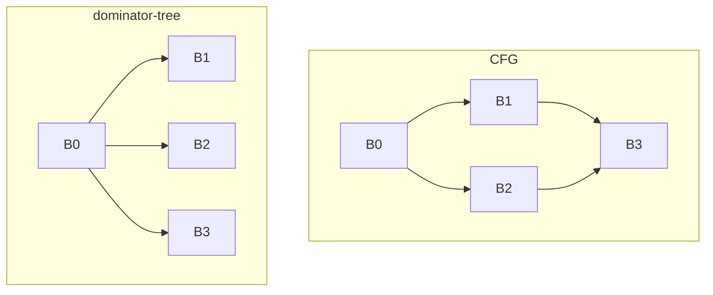

# 42. The analyses everything stands on   ⟨J · N⟩

Every pass in the next eight chapters begins by asking a question it cannot answer from the
node in front of it. Can this value be hoisted out of the loop — which requires knowing what
a loop *is*. Is this store dead — which requires knowing whether anything between here and
the end of the function might read the same memory. Can this addition be an integer one —
which requires knowing what its operands can hold on every path that reaches it.

Six analyses answer all of those, and one `AnalysisManager` caches them
([Ch 41 § analysis-manager]). This chapter is
about what each one actually computes, which is in every case narrower than its name
suggests. The dominator tree is Cooper–Harvey–Kennedy with an Euler numbering bolted on so
that "does A dominate B?" is two integer comparisons. The loop forest is LLVM's algorithm,
processed innermost-first with a hand-rolled union-find. Points-to is Andersen's
inclusion-based analysis with one Steensgaard rule deliberately put back. Mod-ref is a single
walk over the graph filling five maps. And underneath the three memory-facing ones there is a
single abstraction that turns out to be a **string**: `alloc:17|slot:0` is the whole memory
model, and the reason three passes in chapter 45 can share one chapter is that they share
that string.

The chapter closes on the other half of the picture, which is less flattering: a generic
monotone-dataflow framework, a lattice-combinator library, a `Worklist`, a `PriorityQueue`, a
`UnionFind` and an iterative dominator-tree walker all exist in `src/optimizing/infra/`, and
between the six of them the middle-end passes use two.

**What arrived.** One `CFGFunction`, mutated in place by whichever passes have already run,
and an `AnalysisManager` holding whatever the last pass did not invalidate — sometimes empty,
often not ([Ch 41 § the-pipeline]). A pass has just declared
`requires: [...]`, and the manager has already forced each named analysis to exist before the
pass's first line runs ([Ch 41 § step-order]).

## Dominance {#dominance}

Chapter 38 defined dominance and the dominator tree, and made the point that matters: a
definition must dominate every use of it, and every pass that moves a node is obliged to
preserve that ([Ch 38 § three-classes-and-nothing-else]). What it deferred was the
*computation*, because the tree is not something the IR stores. It is something passes ask
for.

The picture, from the fixture `tests/optimizing/analyses/dominance-core.test.ts` uses — four
blocks, a branch and a merge:



`B3` is reachable by two different paths, so neither `B1` nor `B2` is on *every* path to it.
Its immediate dominator is `B0`, and the tree is flat where the graph is a diamond
[t: tests/optimizing/analyses/dominance-core.test.ts > "in diamond, merge block is dominated by entry but not by branches"]
[t: tests/optimizing/analyses/dominance-core.test.ts > "diamond: entry is idom of both branches and merge"].

The algorithm is Cooper, Harvey and Kennedy's iterative one, in
`src/optimizing/analyses/dominance-core.ts:37-75`. It works over a **postorder** numbering of
the blocks — a depth-first walk that emits a block only after every successor it reaches has
been emitted, computed with an explicit stack rather than recursion so a long chain of blocks
cannot overflow (`:11-31`). It then keeps one map, `idom`, from each block to its current best
guess at its immediate dominator, seeds it with `idom.set(entry, entry)` (`:50`), and
iterates the postorder **in reverse** — which is to say roughly in execution order, so a
block's predecessors have usually been improved before the block itself is looked at — until
a full sweep changes nothing.

Each sweep recomputes one block's idom as the *intersection* of its predecessors' idoms, and
the intersection is the two-finger walk:

```ts
function intersect(
  b1: DominatorBlock,
  b2: DominatorBlock,
  idom: Map<DominatorBlock, DominatorBlock>,
  postNum: Map<DominatorBlock, number>,
): DominatorBlock {
  let f1 = b1;
  let f2 = b2;
  while (f1 !== f2) {
    while (postNum.get(f1)! < postNum.get(f2)!) f1 = idom.get(f1)!;
    while (postNum.get(f2)! < postNum.get(f1)!) f2 = idom.get(f2)!;
  }
  return f1;
}
```
— `src/optimizing/analyses/dominance-core.ts:84-97`

Two fingers walk up the partial `idom` map, and the one with the *smaller* postorder number
moves. Postorder numbers increase towards the entry, so the smaller number is the block
further from the entry, and moving it up is always the step that can close the gap. The loop
terminates because each move strictly increases a bounded number, and it lands on the
lowest block that dominates both. The map being consulted is the *partially computed* one —
that is the whole trick of the iterative formulation: it uses its own intermediate results
and converges anyway.

Then there is a final loop that looks like defensive noise and is not:

```ts
  for (const block of graph.blocks) {
    if (!idom.has(block)) idom.set(block, block);
  }
```
— `src/optimizing/analyses/dominance-core.ts:71-73`

`computePostorder` only visits blocks reachable from the entry, so a block nobody can reach
never gets an idom from the iteration. Left alone, it would be absent from the map and every
`dominates` query about it would walk off the end. Making it its own dominator gives it a
consistent, isolated position: it dominates itself and nothing else, and nothing dominates it
[t: tests/optimizing/analyses/dominance-core.test.ts > "treats a block unreachable from entry as dominated only by itself"].

This matters because of pipeline order. `unreachable-block-elimination` is pass **#30**, in
the `late-optimization` phase. Everything from `#0` to `#29` may be handed a graph with dead
blocks still in it — `sccp` in particular *creates* them, by folding a branch condition to a
constant. Without the fallback, every pass before `#30` that consults dominance on a graph
`sccp` just pruned would fault. The three lines buy the pipeline the freedom to put
unreachable-block removal wherever it belongs rather than first.

## Euler numbering makes dominates two comparisons

`dominance-core.ts` answers "does A dominate B?" by walking B's idom chain upward looking for
A (`:122-135`). That is O(depth of the dominator tree) per query, and passes ask it
constantly — `escape-analysis` calls `dominates` at eleven separate sites, `gvn` at two
(`passes/gvn.ts:193,278`), and the loop forest calls it once per edge in the graph.

`DominatorTree` answers the same question in two comparisons, by numbering the tree once in
its constructor:

```ts
  dominates(ancestor: CFGBlock, descendant: CFGBlock): boolean {
    const enterA = this.enter.get(ancestor);
    const exitA = this.exit.get(ancestor);
    const enterB = this.enter.get(descendant);
    const exitB = this.exit.get(descendant);
    if (enterA === undefined || exitA === undefined) return false;
    if (enterB === undefined || exitB === undefined) return false;
    return enterA <= enterB && exitB <= exitA;
  }
```
— `src/optimizing/analyses/dominance.ts:27-35`

`number` (`:78-94`) is an iterative preorder walk over the tree's `children` map with a single
counter. Each block gets an `enter` stamp on the way down and an `exit` stamp on the way back
up. A subtree therefore occupies one contiguous interval of clock values, and "A is an
ancestor of B" becomes "B's interval is nested inside A's" — the standard Euler-tour
containment test. Both stamps come from the same clock, so the numbers are unique and the
comparison needs no tie-breaking.

Both implementations survive, and it is worth naming why rather than calling one obsolete.
The `DominatorTree` version needs a constructed tree with a `children` map and an Euler
numbering, which means it needs the analysis. The raw `computeDominators` / `dominates` pair
needs only a `DominatorGraph` — a structural type of `{entry, blocks}` where blocks have
`successors` and `predecessors` (`dominance-core.ts:1-9`) — and no manager at all. Its three
callers are exactly the places with no `AnalysisManager` in hand:
`src/optimizing/validation/graph-validator.ts:114` and `:128` (the verifier, which runs on
graphs mid-pass and must not depend on a cache that a pass may have poisoned),
`src/optimizing/passes/osr.ts:277`, and
`src/optimizing/backends/wasm/graph-support.ts:793`. Each recomputes the idom map from
scratch. That is a real cost paid for independence, not an oversight.

> **Never runs.** `computeReversePostorder` (`src/optimizing/analyses/dominance-core.ts:33-35`)
> is exported and has **no caller anywhere** — not in `src/`, not in `tools/`, not in
> `tests/`. `DominatorTree` computes the same thing inline instead, by reversing the postorder
> the constructor already has: `Object.freeze([...postorder].reverse())`
> (`dominance.ts:23`). Cost to remove: delete three lines, or route `dominance.ts:23` through
> it.

## Dominance frontiers, computed lazily and used once

The **dominance frontier** of a block *X* is the set of blocks where *X*'s influence stops:
blocks that *X* does not dominate, but that have at least one predecessor *X* does dominate.
It is the classic answer to "where must a phi go if a value is defined in *X*?", from Cytron
and colleagues' SSA construction paper.

`computeFrontiers` (`src/optimizing/analyses/dominance.ts:54-76`) computes all of them in one
pass over reverse postorder: for every block with two or more predecessors, walk each
predecessor up the idom chain, recording that join block in the frontier of everything you
pass, stopping at the join's own immediate dominator. It is memoised on first ask —
`this.frontiers ??= this.computeFrontiers()` (`:50`) — so a compile that never needs a
frontier never builds one.

Most compiles never need one.

> **Unenforced.** `DominatorTree.frontierOf` has exactly one consumer in the whole tree:
> `src/optimizing/passes/global-promotion.ts:87`. SSA construction in this engine does *not*
> use dominance frontiers — chapter 39's builder places phis from a single forward walk over
> the bytecode with no dominator information at all
> ([Ch 39 § one-walk-no-dominators]) — so the classic Cytron placement algorithm is present
> without being present for the reason it was invented. Nothing checks that the frontier is
> correct beyond that one pass's behaviour, and there is no `frontierOf` test in
> `tests/optimizing/analyses/dominance.test.ts`. Cost to close: a unit test over the diamond
> fixture, which would take about ten lines.

## Loops: back edges and natural loops {#loops}

> **New idea. Back edge, latch, natural loop, header.** A CFG does not come with loops
> marked. What it has is edges, and one of them points backwards. A **back edge** is an edge
> from a block *L* to a block *H* where *H* **dominates** *L* — every path that reaches the
> jump had to pass through the target first, which is exactly what "going round again" means.
> *H* is the loop's **header**, *L* is a **latch**, and the **natural loop** of that back edge
> is *H* plus every block that can reach *L* without leaving through *H*. Defining loops by
> dominance rather than by syntax means the analysis works on a graph that has been rewritten
> by twenty passes, where the `while` that produced it is long gone.

The test is one line:

```ts
function isBackEdge(
  dominators: DominatorTree,
  latch: CFGBlock,
  header: CFGBlock,
): boolean {
  return dominators.dominates(header, latch);
}
```
— `src/optimizing/analyses/loops.ts:166-172`

`collectBackEdges` (`:147-164`) applies it to every edge in the graph and groups the results
by header, producing `Map<header, latch[]>`. Two latches on one header is one loop with two
back edges, not two loops — a `continue` inside an `if` produces exactly that shape
[t: tests/optimizing/analyses/loops.test.ts > "merges two latches into one loop"].

Take the loop from `docs/example/stats-deopt.tera`, printed by
`node dist/cli.js --print-ir --filter total_of docs/example/stats-deopt.tera`:

```
  B0 succs=B3 preds=:
  B1 succs= preds=B3:
  B2 succs=B3 preds=B3:
  B3 loop-header succs=B2,B1 preds=B0,B2:
```

`B2 -> B3` is a back edge, because `B3` dominates `B2` — the only way into the body is
through the test. `B3 -> B2` is not, because `B2` does not dominate `B3` (you can reach `B3`
from `B0` without ever entering `B2`). So there is one loop: header `B3`, latch `B2`,
blocks `{B3, B2}`.

The body of the loop is found by walking *backwards* from the latches
(`discoverNaturalLoops`, `loops.ts:241-260`): push the latches onto a worklist, and for each
block popped, if it is not already claimed by some loop, claim it and push its
**predecessors** — unless it is the header, which is where the walk stops. Backwards, because
"can reach the latch" is a question about predecessors; stopping at the header, because that
is what "without leaving through *H*" means.

## LLVM-shaped discovery: dominator-tree postorder plus union-find

Nested loops are where the algorithm earns its shape. Headers are not processed in program
order or in reverse postorder; they are processed in **dominator-tree postorder**, filtered
to the blocks that are headers:

```ts
    const headerPostorder = dominatorTreePostorder(graph, dominators)
      .filter((block) => headerLatches.has(block));
```
— `src/optimizing/analyses/loops.ts:93-94`

A dominator-tree postorder visits a node after all its descendants, and an inner loop's
header is always a descendant of the outer loop's header. So inner loops are discovered
first. By the time the outer loop's backward walk reaches a block belonging to an inner loop,
that inner loop already exists as a complete `LoopDraft` with all its blocks, and the outer
walk does not have to re-traverse it:

```ts
      const outer = find(subloop);
      if (outer === draft) continue;
      adopt(outer, draft);
      union(outer, draft);
      for (const predecessor of outer.header.predecessors) {
        worklist.push(predecessor);
      }
```
— `src/optimizing/analyses/loops.ts:253-259`

One `adopt` makes the whole subloop a child, one `union` records that it now belongs to the
outer set, and the walk resumes from the inner *header's* predecessors — skipping every block
inside it in a single step. Without this, discovering a three-deep nest would walk the
innermost body three times.

`find`, `union` and `adopt` are closures over a local `Map<LoopDraft, LoopDraft>`
(`loops.ts:202-225`). `find` does path compression on the way back up; `union` does not do
union-by-rank. They are a hand-rolled union-find, and they do **not** use
`src/optimizing/infra/union-find.ts`, which exists, is generic, does both path compression and
union by rank, and is used by two entirely different pieces of code
(§ the-generic-machinery). Two implementations of one data structure in one directory tree,
and the more careful one is not the one in the analysis.

Depths, parent links and block sets are assigned afterwards from the draft forest
(`assignTopology`, `assignBlocks`, `loops.ts:289-317`), and everything is sorted by reverse
postorder index with block id as a tiebreak (`compareBlocks`, `:384-392`) so the forest is
deterministic
[t: tests/optimizing/analyses/loops.test.ts > "maps nested loops to increasing depth"]
[t: tests/optimizing/analyses/loops.test.ts > "excludes unreachable blocks from loops"].

## Boundaries

`deriveBoundaries` (`loops.ts:319-352`) computes three things per loop, and the third is the
one that decides whether two later passes do anything at all.

An **exiting block** is a block *inside* the loop with a successor outside it. An **exit
block** is that successor. In `total_of`, `B3` is the exiting block and `B1` is the exit
block — the loop leaves through its own header, which is normal for a `while`.

A **preheader** is a block that sits immediately before the loop and leads only into it, and
the test for one is strict:

```ts
  const externalPredecessors = loop.header.predecessors.filter(
    (predecessor) => !loop.blocks.has(predecessor),
  );
  const preheader =
    externalPredecessors.length === 1 &&
    externalPredecessors[0]!.successors.length === 1 &&
    externalPredecessors[0]!.successors[0] === loop.header
      ? externalPredecessors[0]!
      : null;
```
— `src/optimizing/analyses/loops.ts:338-346`

Three conditions. Exactly one predecessor from outside the loop; that block has exactly one
successor; and that successor is the header. In `total_of` all three hold and `B0` is the
preheader
[t: tests/optimizing/analyses/loops.test.ts > "derives exiting blocks, exit blocks, and preheader"].

The reason the test is strict is that a preheader is a *place to put things*. Loop-invariant
code motion moves a computation out of the loop by putting it at the end of the preheader,
and that is only sound if the preheader runs exactly when the loop is about to be entered and
leads nowhere else. If a block leading to the header also branches somewhere else, hoisting
into it executes the computation on a path that never enters the loop — which is a
correctness problem if the computation can fault and a waste otherwise.

Nothing in this analysis *creates* a preheader. It reports whether one happens to exist. So
`preheader === null` is the most common single reason LICM and guard peeling decline to do
anything ([Ch 46](46-loops-and-the-optimization-that-cannot-fire.md)), and the fix — split
the header's incoming edges to manufacture one — is a graph transformation nobody wrote.

## Irreducible control flow, and who reads it

> **New idea. Irreducible control flow.** A loop is **reducible** when it has one entry: you
> can only get into the body by going through the header. Structured source produces nothing
> else — a `while` or a `for` has one entrance by construction. You get an **irreducible**
> region when two blocks jump into each other's territory so that neither dominates the
> other, which in practice comes from `goto`, from certain optimizations that duplicate
> blocks, or from a compiler generating control flow directly. Irreducible regions break the
> back-edge-by-dominance definition: there is a cycle, but no edge in it qualifies as a back
> edge, so `collectBackEdges` finds nothing and the loop forest is empty even though the
> program loops.

Detecting it costs one scan (`hasIrreducibleEdge`, `loops.ts:174-194`): look for an edge
whose target has a **lower or equal reverse-postorder index** than its source — a backward
edge in the linear ordering — that is *not* a back edge by dominance. That combination is
exactly a cycle whose entry the dominator tree does not agree about.

The flag is a single boolean on `LoopForest` (`:83`), and it has three readers, none of them
a middle-end pass. `src/optimizing/passes/osr.ts:125` returns `false` from the OSR transform,
declining to build an on-stack-replacement entry ([Ch 37](../part-05-getting-hot/37-on-stack-replacement.md)).
`src/optimizing/backends/wasm/codegen.ts:507` and `:1616` refuse to emit, because
WebAssembly's structured control flow cannot express an irreducible region without a
dispatch-loop rewrite that this backend does not do ([Ch 52](../part-08-wasm/52-emitting-webassembly-by-hand.md)).

tera's front end cannot produce an irreducible region from source: there is no `goto`, and
`break`/`continue` with labels compile to jumps that always leave a loop rather than entering
one sideways ([Ch 19 § breakjumps-continuejumps-save-swap-restore](../part-03-bytecode/19-the-jump-nobody-patched.md)).
So the flag never fires on any program in `docs/example/`. It is not dead code, though —
it is a guard against the compiler's *own* passes rebuilding control flow into a shape the
source language cannot express, which is what `loop-unswitching` and `if-conversion` are in
the business of doing
[t: tests/optimizing/analyses/loops.test.ts > "marks irreducible two-entry regions"].

## Alias analysis, Andersen and Steensgaard

> **New idea. Alias analysis, and may versus must.** "Can these two pointers name the same
> object?" is the question that gates every memory optimization. If a store to `a.x` and a
> load from `b.x` might touch the same object, the load cannot be forwarded past the store.
> The answer is almost never certain, so the analysis answers a *conservative* version: **may
> alias** means "I cannot prove they are different", and the safe answer is always yes. An
> analysis that says "no" when the truth is "yes" miscompiles; an analysis that says "yes"
> when the truth is "no" merely gives up an optimization. Everything in this section is built
> to fail in the second direction.

There are two classical shapes. **Andersen's** analysis is *inclusion-based*: `a = b` means
everything `b` can point to, `a` can also point to — a one-way flow, so `a` and `b` end up
with different (possibly overlapping) target sets. **Steensgaard's** is *unification-based*:
`a = b` merges `a` and `b` into one equivalence class forever, which makes the analysis
near-linear and much coarser.

tera's is Andersen. `propagate` (`points-to.ts:110-144`) unions target sets along copy edges
until a fixpoint, where a "copy edge" is a phi input or any opcode that
`forwardsPointerIdentity` (`copiedFrom`, `:83-87`). The sets grow monotonically and only
grow, so the worklist terminates
[t: tests/optimizing/analyses/points-to.test.ts > "proves two fresh allocations do not alias"].

*(What was tried and rejected.)* Pure Andersen turned out to be unsafe here, and the fix is
the last loop of `escapedSitesOf`:

```ts
  for (const value of values) {
    const held = sitesOf(flow, value);
    if (held.size === 1 && !held.has(UNKNOWN_SITE)) continue;
    mark(value);
  }
```
— `src/optimizing/analyses/points-to.ts:200-204`

Read plainly: **a value that may hold more than one allocation site escapes.** That is a
Steensgaard-flavoured rule — it treats "I am not sure which of these two objects this is" as
grounds to give up on both — deliberately restored inside an inclusion-based analysis. Without
it, a phi that merges two fresh allocations keeps a two-element target set, every downstream
query still gets a precise-looking answer, and scalar replacement will happily dismantle an
object whose identity a later use depends on
[t: tests/optimizing/analyses/points-to.test.ts > "marks an allocation escaping through a phi and call argument"].
The engine keeps Andersen's precision where a value holds exactly one site and falls back to
Steensgaard's pessimism the moment it holds two. Chapter 45 is the chapter that spends the
result ([Ch 45 § escape-analysis-and-scalar-replacement]).

## What points-to actually tracks

Per value, two sets:

```ts
interface Flow {
  readonly targets: Set<number>;
  readonly shapes: Set<number>;
}
```
— `src/optimizing/analyses/points-to.ts:69-72`

`targets` holds **allocation site ids** — which are just the node ids of allocating nodes
(`seed`, `:103`) — plus the sentinel `UNKNOWN_SITE = -1` for anything the analysis could not
account for. `shapes` holds **shape stamps**: the `expectedMapId` off a `CHECK_MAP` node, or
`ARRAY_MAP_ID = -1` off a `CHECK_ARRAY` (`shapeStampOf`, `:89-93`).

The shape set is what lets the analysis separate two pointers it knows nothing else about.
`shapedApart` (`:272-278`) says two values do not alias when each carries exactly one shape
stamp and the stamps differ: two objects guarded to different hidden classes cannot be the
same object, whatever their provenance
[t: tests/optimizing/analyses/points-to.test.ts > "proves different map-guarded pointers do not alias"].
Guards inserted for speculation ([Ch 34](../part-05-getting-hot/34-inline-caches.md)) are thus
doing double duty: they protect the speculation *and* they feed the alias analysis.

Escape has three routes, all in `escapedSitesOf` (`:174-198`). A value **returned** escapes.
A value passed as an input to a call that is neither effect-free nor read-only escapes —
`INPUT_ESCAPE_EFFECTS` is the five call opcodes plus `IR_GENERIC_DELETE_PROP` (`:11-17,50`).
And a value **stored into** something escapes, unless the container itself never escapes.
That last case is why `contains` exists: it records container-to-stored edges in a
`containment` map, and a final worklist walks it, so marking a container escaped
transitively marks everything ever stored into it
[t: tests/optimizing/analyses/points-to.test.ts > "marks an allocation stored into another object field as escaping"]
[t: tests/optimizing/analyses/points-to.test.ts > "propagates escape through returned array elements"].

`UNKNOWN_SITE` is the pessimism valve. A value that holds it aliases everything (`mayAlias`,
`:250-255`) and escapes unconditionally (`escapes`, `:263`). Everything the analysis cannot
model — a parameter, a load from an unknown object, a value produced by an opcode not in
`NON_POINTER_VALUES` and not an allocation — is seeded with it (`:104`).

## One string key {#one-string-key}

Three separate facts are needed to say *which memory* an instruction touches: which object
(or class of objects), which field, and — sometimes — which specific cell. The heap model
answers the first two with a pair of tagged unions and then flattens them into a string.

A `Partition` is `alloc` (one allocation site), `shape` (any object with this map id),
`global` (a named module variable), or `any`. A `Field` is `slot` (a fixed byte offset),
`index` (a constant array index), `anyIndex` (a computed array index), or `any`. And:

```ts
export function locationKey(partition: Partition, field: Field): string {
  return `${partitionKey(partition)}|${fieldKey(field)}`;
}
```
— `src/optimizing/analyses/heap-model.ts:29-31`

which produces keys like `alloc:17|slot:0`, `shape:3|anyIndex`, `global:counter|anyIndex` and
`any|any`. Set membership on strings is the whole memory abstraction. That is why the three
passes of chapter 45 — load elimination, dead-store elimination and scalar replacement — are
one chapter: they are three uses of one key ([Ch 45 § a-snapshot-dataflow]).

The subtlety is that the key alone is not the alias test, because two different keys can
still overlap. `fieldsOverlap` is deliberately asymmetric:

```ts
export function fieldsOverlap(left: Field, right: Field): boolean {
  if (left.kind === "any" || right.kind === "any") return true;
  if (left.kind === "slot" || right.kind === "slot") {
    return left.kind === "slot" && right.kind === "slot" && left.offset === right.offset;
  }
  if (left.kind === "anyIndex" || right.kind === "anyIndex") return true;
  return left.value === right.value;
}
```
— `src/optimizing/analyses/heap-model.ts:52-59`

`any` overlaps everything, because a generic property access could name any field. A `slot`
overlaps only the identical `slot`, and — crucially — a `slot` never overlaps an index: named
fields and array elements live in disjoint storage in this object model
([Ch 23](../part-04-execution/23-objects-hidden-classes-and-elements-kinds.md)). An
`anyIndex` overlaps every `index`, because a computed subscript could be any of them. Two
constant indices overlap only when equal.

`basesMayAlias` has one more special case worth naming. A global has no base node — there is
no pointer value to reason about — so `location.base` is `null`, and the function falls back
to comparing `baseKey` strings (`:151`). Two loads of `counter` alias; a load of `counter` and
a load of `total` do not. It is string equality standing in for a pointer analysis, and for
module-level variables that is exactly right, because the name *is* the identity.

## Mod-ref: the oracle three passes ask

`buildModRef` (`src/optimizing/analyses/mod-ref.ts:53-138`) makes a single pass over every
node in the graph and fills five structures: `locations` (node → `MemoryLocation`), `refs`
(node → the keys it reads), `mods` (node → the keys it writes), `writeLocations` (node → the
location it writes) and `kills` (the set of nodes that clobber everything).

A node lands in `kills` in three ways: `clobbersAllMemory`, `hasOpaqueMemoryEffect`, or —
the interesting one — it writes memory and does *not* declare which (`:86`). An unknown call
is a kill; a builtin that declares its writes is not
[t: tests/optimizing/analyses/mod-ref.test.ts > "marks a region containing an unknown call as clobbering everything"]
[t: tests/optimizing/analyses/mod-ref.test.ts > "does not treat a declared immutable-read builtin as a clobber"].

The two methods passes actually call are a matched pair. `writesOf(blocks)` summarises a whole
region — a loop body, typically — into a `RegionMemory` of
`{clobbersEverything, locations, keys}` (`:106-123`). `mayReadFrom(node, region)` asks whether
one load could see anything that region wrote (`:125-136`). Together they are the question
LICM asks once per candidate: *if I move this load above the loop, could the loop have
written what it reads?*
[t: tests/optimizing/analyses/mod-ref.test.ts > "reports the locations a region writes"]
[t: tests/optimizing/analyses/mod-ref.test.ts > "says a field load ignores a region that writes a different field"].

`mayReadFrom` short-circuits in a specific order, and the order is the analysis's honesty:
a node that does not read mutable memory is `false`; a region that clobbers everything is
`true`; an empty region is `false`; then the declared domains; then the location, and a node
whose location cannot be resolved at all returns **`true`** (`:133`). Unresolvable means
unknown means yes.

Those "declared domains" are a second memory universe sitting beside the heap model.
`props.intrinsicReads` and `props.intrinsicWrites` are arrays of *names* — plain strings —
carried on intrinsic call nodes and turned into sets by `domainSet` (`:140-147`). They never
resolve to a `MemoryLocation`; they are compared to each other by string equality, in the same
`keys` set as the heap locations. So `Math.sin` can declare that it reads nothing and writes
nothing, and `intrinsic-cse` can common two calls to it, without either the heap model or the
points-to analysis having any opinion about what `Math.sin` is
[t: tests/optimizing/analyses/mod-ref.test.ts > "says a global load depends on a write to the same global only"].

## Type inference as a Kildall worklist {#type-inference}

The last of the six is the one with no per-opcode `switch` in it.

```ts
  private evaluate(node: ir.CFGInstruction): LatticeType {
    if (node.type === ir.IR_PHI) return transferType(node, this);
    for (const input of node.inputs) {
      if (this.typeOf(input).kind === TypeKind.Never) return BOTTOM;
    }
    return transferType(node, this);
  }
```
— `src/optimizing/analyses/type-inference.ts:146-152`

`transferType(node, this)` is `operationOf(node.type).transfer(...)`: the transfer function
for every opcode lives on its entry in the operation table, beside its arity and its effects
([Ch 38 § transfer-functions], [Appendix B](../appendix/b-ir-operations.md)). Adding an
opcode adds its type rule in the same place as everything else about it, and the solver does
not change.

> **New idea. Bottom, top, and monotone.** Chapter 10 built the type lattice and defined
> join, meet and fixpoint for the checker ([Ch 10 § a-lattice]). A dataflow solver uses the
> same structure with two extra conventions. **Bottom** is the value every node starts at
> before anything is known — here `neverType()`, "no value can be here". **Top** is the value
> that means "anything" — `anyType()`. Each step *joins* the old answer with the newly
> computed one (`joinTypes(previous, this.evaluate(node))`, `:100`), so a node's answer only ever moves
> *upward*, from bottom towards top. That is what **monotone** means, and it is what
> guarantees termination: the lattice has finite height, so a value that only climbs must
> stop climbing.

`seedParameters` (`:75-83`) pins the parameters from `graph.declaredSignature` — the declared
types from the source, which is where facts enter the graph at all — and marks them `seeded`
so the worklist never overwrites them.

`solve` (`:91-106`) then enqueues every node, and drains: pop, evaluate, join, and if the
answer grew, wake everything that observes it. `observersOf` (`:108-118`) is where the
interesting choice is. The obvious answer is "the node's uses". This adds one more:

```ts
    for (const use of node.uses) {
      observers.push(use);
      const array = use.inputs[0];
      if (array !== undefined && storedElementValue(use, array) === node) {
        observers.push(array);
      }
    }
```
— `src/optimizing/analyses/type-inference.ts:110-116`

If a use is a store *of this node into an array*, the **array** is also an observer. Storing a
double into an array is new information about the array, not just about the store, and this is
what lets an array's elements kind be inferred from the values written into it rather than
from its declaration. Without those two lines an array literal would have to be typed from its
constructor alone.

Note that `solve` enqueues `block.nodes` only — not `block.phis` (`:92-94`). Phis enter the
worklist solely as observers of their inputs, which means a phi is never evaluated before at
least one of its inputs has a type.

## Bottom means two different things

`typeOf` returns `this.types.get(value) ?? BOTTOM` (`:62-64`). A node the worklist has never
reached and a node proved to hold nothing are the same value.

That is not sloppiness. It is the standard construction, and it is what makes the "bottom is
absorbing" loop in `evaluate` correct: if any input is still `Never`, the node's own answer is
`Never`, because you cannot compute a type from an operand whose type you do not have yet.
The worklist will come back when the input grows. Starting everything at bottom and only ever
climbing is exactly the monotone discipline that makes the fixpoint reachable from below.

`IR_PHI` is the deliberate exception, and it has to be. A loop-header phi's second input comes
from the latch, which the solver has not evaluated yet on the first visit — `v5 = Phi v1, v21`
in `total_of`, where `v21` is computed in the loop body. Poisoning `v5` because `v21` is still
`Never` would freeze the entire loop at bottom forever: `v21` depends on `v5`, `v5` waits for
`v21`, and nothing moves. So a phi is transferred immediately, over whatever inputs it has,
and climbs as its inputs climb.

The consequence for anyone debugging is worth stating flatly, because nothing in the API says
it: a `Never` answer from `typeOf` means *either* "this value cannot exist" *or* "the solver
never got here", and there is no way to tell which. A node in an unreachable block and a node
in a block the worklist has not yet drained give identical answers.

> **Unenforced.** `TypeInference` exposes `typeOf` and `isSpeculative` and nothing else. There
> is no `wasReached(node)` and no `isBottomBecauseUnreachable`. A pass that folds on
> `typeOf(v).kind === TypeKind.Never` — "this value can never exist, so this branch is dead" —
> is relying on a value that also means "not visited". No pass currently does this, and there
> is no test that would catch one that started. Cost to close: a `reached` set on the solver,
> already half-present as `queued`, exposed as a third method.

## The taint set, introduced here

Alongside the type map, the solver keeps a second answer per node, in the same worklist:

```ts
  private propagateSpeculation(node: ir.CFGInstruction): boolean {
    if (this.speculative.has(node)) return false;
    const tainted =
      SPECULATIVE_SOURCES.has(node.type) ||
      node.inputs.some((input) => this.speculative.has(input));
    if (!tainted) return false;
    this.speculative.add(node);
    return true;
  }
```
— `src/optimizing/analyses/type-inference.ts:120-128`

`SPECULATIVE_SOURCES` (`:30-38`) is seven opcodes, all of them checks: `CheckSmi`,
`CheckNumber`, `CheckMap`, `CheckArray`, `CheckElementsKind`, `CheckBounds`,
`CheckCallTarget`. A node is tainted if it is one of those, or if any input is tainted. The
set is a monotone one-way climb like the types, and the two travel together:

```ts
      if (!this.propagateSpeculation(node) && !grew) continue;
```
— `src/optimizing/analyses/type-inference.ts:103`

A node whose *type* did not grow still wakes its observers if its *taint* did. Without that
conjunction, taint would stop propagating the moment types converged, and a value would be
believed to be a proven fact on the strength of a guard that had not yet reached it.

In `total_of`'s printed IR, `v19 = CheckNumber v5` and `v20 = CheckNumber v18` are sources, so
`v21 = Float64Add v19, v20` is tainted: it is a float64 addition *because a guard says so*,
not because anything proved it. That distinction has one consumer and it is the hinge of the
book's whole argument — the JIT may act on a speculative type because a wrong guess can be
undone, and the native compiler may not ([Ch 49 § the-single-consumer]). The
answer is computed here; it is spent there.

## The generic machinery, and how little of it the middle end uses {#the-generic-machinery}

`src/optimizing/infra/` contains a small library of textbook components.

`solveMonotone` (`dataflow.ts:25-74`) is a complete monotone dataflow framework: a
`FlowGraph<N>` of nodes with successors and predecessors, a `MonotoneProblem<N,F>` with a
direction, a lattice, a boundary value and a transfer function. It initialises every node to
`lattice.bottom`, seeds the entry (forward) or every exit (backward) with the boundary, and
drains a `Worklist` until no output changes
[t: tests/optimizing/infra/dataflow.test.ts > "reaches a fixpoint over a back edge"]
[t: tests/optimizing/infra/dataflow.test.ts > "leaves an unreachable node at bottom"].

`lattice.ts` supplies the pieces to build `F`: `setLattice`, `flatLattice`, `productLattice`
and `mapLattice`. `worklist.ts` is a FIFO queue with a membership set and one nice detail —
`take()` advances a head pointer instead of shifting, and compacts the backing array only
when the head has passed 64 *and* is at least half the length (`:25-28`), so draining a large
worklist is linear rather than quadratic and does not hold the whole consumed prefix alive
[t: tests/optimizing/infra/worklist.test.ts > "preserves every distinct item across backing-buffer compaction"].
`union-find.ts` is path compression plus union by rank. `priority-queue.ts` is a binary heap
over a caller-supplied `Ordering<T>`. `dom-walk.ts` is twenty-one lines holding one interface
and one function: `walkDominatorTree` (`:6-21`) is an iterative dominator-tree walk — nine
lines of loop body — that forks the visitor's state for each child so siblings cannot see each
other's mutations
[t: tests/optimizing/infra/dom-walk.test.ts > "forks state down each branch so siblings never share mutations"].

Now the honest accounting. Of those six components, the middle-end passes call two, and both
of them meet in one pass. `Worklist` is imported directly by `passes/sccp.ts` and reached by
the three memory passes of chapter 45 underneath `runSnapshotDataflow`. `flatLattice` is
imported by `passes/sccp.ts:5` and instantiated at `:14`, which is the cell lattice
[Ch 43 § the-flat-lattice] is about — so `sccp` alone accounts for both.

`UnionFind` is not one of the two. It has exactly two call sites and neither is a middle-end
pass: `analyses/aot-legality.ts:481` is an *analysis*, and `passes/string-boxing.ts:175` —
despite living in `passes/` — runs from the target legalization pipeline
(`target/legalization.ts:406`) and again directly from the AOT driver
(`drivers/aot.ts:836`), never from `middleEndPhases`. `PriorityQueue` is used once, by the
register allocator (`src/optimizing/machine/linear-scan.ts:92`), which is chapter 66. The
rest:

> **Never runs.** `productLattice` and `mapLattice` (`src/optimizing/infra/lattice.ts:7,18`)
> have no caller anywhere in `src/` or `tools/`. Their only references are in
> `tests/optimizing/infra/lattice.test.ts`. They are correct, tested combinators that nothing
> composes. Cost of finishing: a consumer, or deletion.

> **Never runs.** `walkDominatorTree` and `ScopedVisitor` (`src/optimizing/infra/dom-walk.ts`)
> have no caller outside their own test. Three passes hand-roll exactly this walk instead:
> `Narrower.walk` (`passes/type-narrowing.ts:276-290`, recursive, with an explicit undo trail
> rather than a forked state), `walkDom` (`passes/escape-analysis.ts:314-325`, recursive,
> forking two `Map`s per child) and `walkBlock` (`passes/checks.ts:90-123`, recursive, forking
> one `Map` per child). Cost of finishing: reworking three passes onto one iterative walker,
> which would also remove the stack-depth risk in all three — a function with a dominator
> chain thousands deep would overflow today.

> **Unfinished.** `solveMonotone` has exactly one consumer in the tree, and it is not a
> middle-end pass: `src/optimizing/machine/verifier.ts:176` uses it for machine-IR liveness.
> Every memory pass in [Ch 45](45-memory-what-a-load-can-be-told.md) uses a *separate* driver,
> `runSnapshotDataflow` (`src/optimizing/infra/snapshot-dataflow.ts:16`), which
> `dead-stores.ts`, `intrinsic-cse.ts` and `load-elimination.ts` all import. Two dataflow
> frameworks in one directory, no shared abstraction, and the general one is used by the
> verifier rather than by any pass. Cost of finishing: expressing the snapshot passes as
> `MonotoneProblem`s, which requires `solveMonotone` to expose per-node state the snapshot
> driver currently keeps itself.

> **Unenforced.** `UnionFind.find` (`src/optimizing/infra/union-find.ts:11-18`) is recursive
> and has no unit test of its own. It is exercised only through
> `analyses/aot-legality.ts:481` and `passes/string-boxing.ts:175`, both of which build small
> forests, so the recursion depth has never been a problem in practice and nothing would
> notice if it became one. Cost to close: a test file, and an iterative `find`.

## What leaves {#what-leaves}

Five cached objects, each keyed by a branded symbol, each holding answers no single pass could
afford to recompute: a `DominatorTree` with an Euler numbering and possibly a frontier map, a
`LoopForest` with per-loop blocks, latches, boundaries and depth, a `PointsToResult` with
per-value target and shape sets plus an escaped-site set, a `ModRef` with five maps over the
whole graph, and a `TypeInference` with a type and a taint bit per node. A sixth,
`aotLegalityAnalysis`, is registered in the same registry and asked for only by the native
backend at emission time.

All five are thrown away the moment a pass declares `{kind:"none"}`, and all but the dominator
tree and the loop forest are thrown away whenever a pass declares `preservesControlFlow` —
which is twenty-seven of the thirty-four ([Ch 41 § preserves]). On `Series.mean`
that happens five times in thirty-three passes, and the trace shows each drop by name.

Chapter 43 is the first pass to spend them, and it is the one that solves two problems at
once: which values are constants, and which blocks are reachable — because on this lattice
those are the same fixpoint ([Ch 43 § the-flat-lattice]).

## Verify it yourself

```bash
# the six analyses: dominance, loops, points-to, mod-ref, types, aot-legality (167 tests)
npx vitest run --project unit tests/optimizing/analyses/

# the generic machinery, tested and mostly unused (16 tests)
npx vitest run --project unit tests/optimizing/infra/dataflow.test.ts \
  tests/optimizing/infra/lattice.test.ts

# a real loop: B3 is the header, B2 the latch, B0 the preheader, B1 the exit block
node dist/cli.js --print-ir --filter total_of docs/example/stats-deopt.tera

# the taint sources in that same graph: five of the seven check opcodes appear
node dist/cli.js --print-ir --filter total_of docs/example/stats-deopt.tera | grep Check

# two lattice combinators and one dominator walker with no caller outside their tests,
# and the dominance frontier, which has exactly one
grep -rn "walkDominatorTree\|productLattice\|mapLattice\|frontierOf" src/ tools/visualizer/src/

# two dataflow frameworks: the general one is used only by the machine-IR verifier,
# and the memory passes of ch 45 use the other one
grep -rn "solveMonotone" src/ --include=*.ts
grep -rn "runSnapshotDataflow" src/ --include=*.ts
```

## Tests that pin this

- `tests/optimizing/analyses/dominance-core.test.ts` > `"in diamond, merge block is dominated by entry but not by branches"` — the merge is dominated by the entry, not by either arm.
- `tests/optimizing/analyses/dominance-core.test.ts` > `"treats a block unreachable from entry as dominated only by itself"` — the fallback loop at `dominance-core.ts:71-73`.
- `tests/optimizing/analyses/dominance-core.test.ts` > `"resolves a loop with a back edge"` — the iteration terminates on a cyclic graph.
- `tests/optimizing/analyses/dominance-core.test.ts` > `"diamond: entry is idom of both branches and merge"` — the tree is flat where the graph is a diamond.
- `tests/optimizing/analyses/dominance.test.ts` > `"does not treat an arm of the diamond as dominating the merge"` — the Euler test agrees with the idom chain.
- `tests/optimizing/analyses/dominance.test.ts` > `"handles a loop back edge without diverging"` — `number` is iterative, not recursive.
- `tests/optimizing/analyses/dominance.test.ts` > `"is resolved and cached through the AnalysisManager"` — the analysis wrapper, not just the class.
- `tests/optimizing/analyses/loops.test.ts` > `"maps nested loops to increasing depth"` — dominator-tree postorder discovers inner loops first.
- `tests/optimizing/analyses/loops.test.ts` > `"merges two latches into one loop"` — two back edges to one header is one loop.
- `tests/optimizing/analyses/loops.test.ts` > `"derives exiting blocks, exit blocks, and preheader"` — the three-condition preheader test.
- `tests/optimizing/analyses/loops.test.ts` > `"excludes unreachable blocks from loops"` — loop membership follows reachable predecessors only.
- `tests/optimizing/analyses/loops.test.ts` > `"marks irreducible two-entry regions"` — the flag OSR and the wasm backend read.
- `tests/optimizing/analyses/points-to.test.ts` > `"proves two fresh allocations do not alias"` — Andersen precision where each value holds one site.
- `tests/optimizing/analyses/points-to.test.ts` > `"marks an allocation escaping through a phi and call argument"` — the restored Steensgaard rule.
- `tests/optimizing/analyses/points-to.test.ts` > `"proves different map-guarded pointers do not alias"` — shape stamps separate otherwise-unknown pointers.
- `tests/optimizing/analyses/points-to.test.ts` > `"marks an allocation stored into another object field as escaping"` — the third escape route.
- `tests/optimizing/analyses/points-to.test.ts` > `"propagates escape through returned array elements"` — the `containment` worklist.
- `tests/optimizing/analyses/points-to.test.ts` > `"keeps a loop-carried allocation in the same class"` — a phi over one site is still one site.
- `tests/optimizing/analyses/mod-ref.test.ts` > `"reports the locations a region writes"` — `writesOf` over a block set.
- `tests/optimizing/analyses/mod-ref.test.ts` > `"marks a region containing an unknown call as clobbering everything"` — the `kills` set.
- `tests/optimizing/analyses/mod-ref.test.ts` > `"does not treat a declared immutable-read builtin as a clobber"` — declared effects keep a call out of `kills`.
- `tests/optimizing/analyses/mod-ref.test.ts` > `"says a field load ignores a region that writes a different field"` — `fieldsOverlap` on two slots.
- `tests/optimizing/analyses/mod-ref.test.ts` > `"says a global load depends on a write to the same global only"` — `basesMayAlias` falling back to string equality.
- `tests/optimizing/analyses/type-inference-identity.test.ts` > `"keeps each colliding node's own type rather than the last one written"` — the solver keys on node identity, not node id.
- `tests/optimizing/infra/dataflow.test.ts` > `"reaches a fixpoint over a back edge"` — `solveMonotone` terminates on a cycle.
- `tests/optimizing/infra/dataflow.test.ts` > `"leaves an unreachable node at bottom"` — bottom is also "not reached".
- `tests/optimizing/infra/dataflow.test.ts` > `"computes live variables from uses back to definitions"` — the backward direction, which is what the machine-IR verifier uses.
- `tests/optimizing/infra/lattice.test.ts` > `"keeps equal constants and collapses conflicting ones to top"` — `flatLattice`, the one combinator a middle-end pass calls (`sccp`); `setLattice`'s only caller is the machine-IR verifier.
- `tests/optimizing/infra/worklist.test.ts` > `"preserves every distinct item across backing-buffer compaction"` — the head-pointer compaction at `worklist.ts:25-28`.
- `tests/optimizing/infra/dom-walk.test.ts` > `"forks state down each branch so siblings never share mutations"` — the walker three passes reimplement instead of calling.
