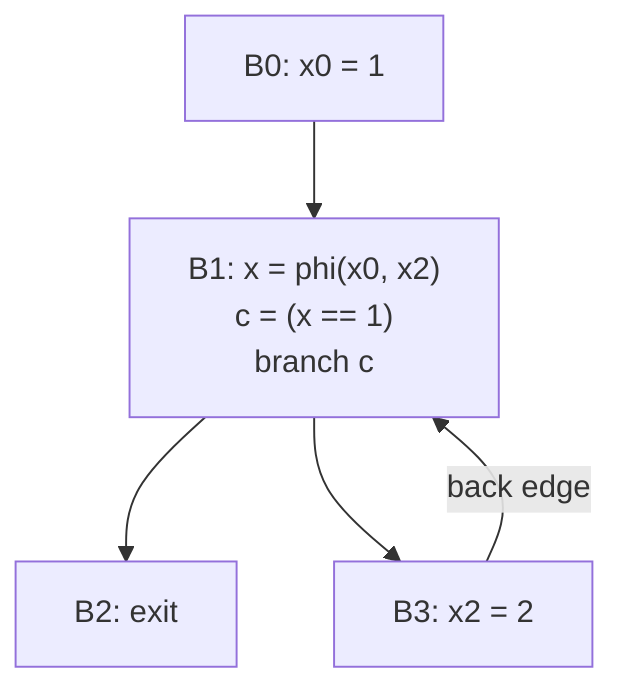

# 43. SCCP   ⟨J · N⟩

There are two questions a compiler can ask about a value: *is it always the same number?*
and *does this code ever run?* Asking them one at a time is the obvious design, and it is
weaker than asking them together — not by a small margin, and not only in contrived
programs. A value can be constant only because a branch is never taken; a branch can be
proved never taken only because a value is constant. Solve each separately and you get a
weaker answer than the program supports; iterate the two solvers by hand and you converge
somewhere, but not always at the best answer. **Sparse conditional constant propagation** is
Wegman and Zadeck's observation that both questions are one dataflow problem over one
lattice, and that solving them jointly, *optimistically*, reaches answers neither can reach
alone.

The second thing this chapter is about is smaller and more specific to this engine. The IR
has an opcode named `Int32Add`, and `Int32Add` **does not have int32 semantics**. It has
whatever semantics its `props` say it has. Fold `0x7FFFFFFF * 2` as an `Int32Mul` and the
answer is `4294967294`, the exact JavaScript product, unless some earlier pass wrote
`noOverflow: true` on that node — in which case the answer is `-2`, the wrapped one. The
opcode names the *shape* the specialiser chose; the semantics live in a property beside it.
Getting that backwards produces a silently wrong constant, which is the worst class of
compiler bug because nothing downstream can tell it apart from a right one.

`stats.tera` exercises the first paragraph almost not at all. Across a whole native compile
the pass runs forty-two times — twice per function, over twenty-one functions — and reports
`changed` exactly **once**, on a single unary negation inside a function the compiler
generated rather than one the user wrote. No branch in the running example folds; no phi in
it tightens. Per [CONVENTIONS § 2](../CONVENTIONS.md) this chapter says so rather than
inventing a ninth variation file: the phi and branch machinery is shown through the pass's
own unit-test graphs, which are real artifacts in `tests/`, and through one small probe
program that appears as a *command* under "Verify it yourself" and never as a listing.

**What arrived.** The graph as `type-narrowing` left it, together with the analysis cache
[Ch 42 § what-leaves] hands on. `Generic*` arithmetic has been specialised to `Int32*`
or `Float64*` wherever a guard or a declared type proved it, and `noOverflow` has been
stamped on the nodes whose results were proved to fit ([Ch 48 § settle-int32]). Frame states
are intact and, on the JIT road, will stay intact: everything in this chapter runs under
[Ch 40 § the-second-use-graph]'s rule. SCCP is the first pass of the `canonicalization`
phase, ordinal 9 of the thirty-three the native road runs.

## The flat lattice

[Ch 10 § a-lattice] built the vocabulary — partial order, join, top, bottom, fixpoint — on
the type checker's assignability order. SCCP is where that vocabulary starts paying, because
here the lattice is not a metaphor for a set of `if`s: it is a data structure with three
cases, and the whole solver is a loop that joins values in it until nothing moves.

> **New idea. The flat (constant-propagation) lattice.** A **flat lattice** over a set of
> values has exactly three kinds of element. **Bottom** means *no reachable definition has
> reached this yet* — not "unknown", but "I have not seen a value, and I am still hoping".
> A **constant** names one specific value. **Top** means *more than one value, or a value I
> cannot name*. Order them with bottom below every constant, every constant below top, and
> no two constants comparable with each other, and you have a lattice exactly three levels
> tall. Height three is the whole point: a cell can move upward at most twice, so an
> analysis that only ever moves cells upward must stop.
>
> The join is forced by that picture. Bottom is the identity — joining "nothing yet" with
> anything gives the anything. Top is absorbing. Two equal constants stay that constant; two
> different constants have no common name below top, so they become top.

In tera that is nine lines, generic in the value type, in a file of reusable lattices
alongside `productLattice`, `mapLattice` and `setLattice`:

```ts
export type FlatValue<T> =
  | { readonly kind: "bottom" }
  | { readonly kind: "constant"; readonly value: T }
  | { readonly kind: "top" };
```
— src/optimizing/infra/lattice.ts:59-62

```ts
    join(left, right) {
      if (left.kind === "bottom") return right;
      if (right.kind === "bottom") return left;
      if (left.kind === "top" || right.kind === "top") return top;
      return equals(left.value, right.value) ? left : top;
    },
```
— src/optimizing/infra/lattice.ts:71-76

`equals` defaults to `Object.is`, and that default is load-bearing rather than incidental.
`Object.is(-0, 0)` is `false`, so negative zero and positive zero occupy *different cells*.
A pass that used `===` would silently merge them, and a compiler that cannot tell `-0` from
`0` produces wrong answers for `1 / x`. The pass keeps them apart
`[t: tests/optimizing/passes/sccp.test.ts > "folds Int32Mul of opposite signs to negative zero"]`.

SCCP's cell type is `FlatValue<number | string | boolean>` — the three JavaScript primitives
an `IR_CONSTANT` node can carry that the folder knows how to compute with.

The analysis is **optimistic**. Every node starts at bottom, which is a claim: *this
computation has not been reached by any execution I believe in yet*. Facts only ever move
cells upward, and `update` is the only place a cell changes:

```ts
  private update(node: SccpNode, next: Cell): void {
    const previous = this.cellOf(node);
    const joined = cells.join(previous, next);
    if (cells.equals(previous, joined)) return;
    this.valueOf.set(node.id, joined);
    for (const use of node.uses) this.ssaWork.add(use);
  }
```
— src/optimizing/passes/sccp.ts:184-190

The early return is the termination argument and the work-bound argument at once. A node's
consumers are re-enqueued **only when the join actually moved the cell**, so a node that
re-evaluates to the same answer costs one evaluation and propagates nothing. Because cells
only move up and the lattice is three tall, the total number of re-enqueues is bounded by
three times the number of def-use edges, whatever the shape of the control flow.

## Why constants and reachability must be solved together

*(Why the obvious design fails.)*

Here is the design a reader reaches for first, and it is not a strawman — it is what most
compilers did before 1991, and it is what the phase ordering of this very pipeline still
looks like from the outside. Run constant folding. Then run unreachable-block elimination.
Then, because deleting blocks may have exposed new constants, run constant folding again.
Repeat until neither changes anything.

That loop converges, and on simple shapes it converges to the right answer. Take the
diamond the pass's own tests use: an entry block branching on a constant `false`, one arm
producing `1`, the other producing `2`, and a phi at the merge. Round one folds nothing
(the phi has two different constant inputs, so it is top) but rewrites the branch. Round two
deletes the unreachable arm, leaving the merge with one predecessor. Round three folds the
phi to `2`. Three rounds, right answer.

Now put the merge inside a loop.



Ask the separate-passes design what `x` is. A pessimistic constant propagation has to start
the phi at top, because a phi's job is to be whatever arrived and it cannot know which
predecessors are real. Top for `x` makes `c` top, so the branch does not fold, so `B3` is
not unreachable, so `x2 = 2` stands, so the phi has two different constants and is top. That
is a fixpoint. Running the two passes another thousand times changes nothing: the answer is
*self-consistent and wrong*.

Ask SCCP. Everything starts at bottom. `B0` is reachable, `x0` is `1`, and the edge `B0→B1`
is marked executable. The phi is evaluated over its *executable* predecessors only — one of
them — so `x` is `constant(1)`. `c` is `constant(true)`. The branch is therefore only ever
taken one way, so only the edge `B1→B2` is marked executable, and **`B3` is never marked
reachable at all**. `x2` is never evaluated; it stays at bottom; the phi never sees it. The
fixpoint is `x = 1`, `B3` dead.

The two solvers reach different answers because they start from different ends of the
lattice. The pessimistic one assumes everything is top and can only stay there — a fact once
lost is never recovered, because top is absorbing. The optimistic one assumes everything is
bottom and lets real evidence push cells up, which means an assumption is only abandoned
when some *reachable* execution refutes it. The price of optimism is that the intermediate
states are not sound — mid-solve, the solver believes things that are not yet justified —
so the answer may only be read out once the worklists are empty. That is the same shape as
[Ch 10 § why-the-obvious-design-fails-recursion]'s greatest-fixpoint seed, one stage later
in the compiler.

The diamond case is pinned in both directions
`[t: tests/optimizing/passes/sccp.test.ts > "resolves a phi whose other predecessor cannot be reached"]`
and its mirror
`[t: tests/optimizing/passes/sccp.test.ts > "resolves the same phi to the other constant when the condition flips"]`.
The loop case is **[unpinned]**: no test in the tree builds it.

## Two worklists, one loop

The word *sparse* in the name is about the second worklist. A dense dataflow analysis
recomputes a fact for every program point and iterates over the whole function; a sparse one
propagates along def-use edges, so a change to a value visits exactly its consumers.
`SccpSolver` holds two `Worklist`s and drains them in a fixed order:

```ts
  solve(): void {
    for (const parameter of this.graph.parameters) this.valueOf.set(parameter.id, TOP);
    const entry = this.graph.entry;
    if (entry === null) return;
    this.markReachable(entry);

    while (!this.flowWork.isEmpty || !this.ssaWork.isEmpty) {
      const block = this.flowWork.take();
      if (block !== undefined) {
        this.visitBlock(block);
        continue;
      }
      const node = this.ssaWork.take();
      if (node !== undefined && node.block !== null && this.reachable.has(node.block)) {
        this.visitNode(node);
      }
    }
  }
```
— src/optimizing/passes/sccp.ts:95-112

`flowWork` holds blocks newly proved reachable; `ssaWork` holds nodes whose input cell just
moved. Blocks drain first, and the `continue` makes that strict: the SSA worklist is only
touched when no block is pending. That ordering is not cosmetic. Visiting a block evaluates
every node in it once, which seeds cells that the SSA worklist would otherwise discover one
edge at a time.

The guard on the SSA side is the second half of "conditional": `node.block !== null &&
this.reachable.has(node.block)`. A node sitting in a block nothing has reached is *not
evaluated*, so its cell stays at bottom, so anything joining with it is unaffected. That is
how `x2 = 2` in the loop example above stays invisible.

Parameters are seeded to top before anything else. A function's arguments are whatever the
caller passed; there is no evidence about them inside the function, and top is the honest
statement of that. Every constant a run of SCCP finds is therefore grounded in an
`IR_CONSTANT` node the builder emitted.

Reachability is tracked twice, at two granularities, and both are needed:

```ts
  private markEdge(from: SccpBlock, to: SccpBlock): void {
    const key = edgeKey(from, to);
    const fresh = !this.executable.has(key);
    this.executable.add(key);
    if (fresh) for (const phi of to.phis) this.ssaWork.add(phi);
    this.markReachable(to);
  }
```
— src/optimizing/passes/sccp.ts:140-146

`reachable` is a set of blocks; `executable` is a set of *edges*, keyed by the string
`` `${from.id}->${to.id}` ``. A block is reachable if any edge into it is executable, and
`markReachable` enqueues it once. But a phi does not care whether the block is reachable —
it cares *which* edges into it are. So `markEdge` re-enqueues the block's phis whenever an
edge becomes executable for the first time, and only then.

## The executable-edge set is what makes a phi tighten

This is the mechanism that makes SCCP better than its parts, and it is fifteen lines:

```ts
  private evaluatePhi(phi: SccpNode): Cell {
    const block = phi.block;
    if (block === null) return TOP;
    let result: Cell = cells.bottom;
    for (let i = 0; i < block.predecessors.length; i++) {
      const predecessor = block.predecessors[i];
      if (predecessor === undefined) continue;
      if (!this.executable.has(edgeKey(predecessor, block))) continue;
      const input = phi.inputs[i];
      if (input === undefined) return TOP;
      result = cells.join(result, this.cellOf(input));
      if (result.kind === "top") return TOP;
    }
    return result;
  }
```
— src/optimizing/passes/sccp.ts:263-277

The loop walks `block.predecessors` **by index** and reads `phi.inputs[i]`. That parallelism
— input *i* of a phi is the value arriving from predecessor *i* — is the single source of
truth [Ch 38 § canonical-phi-ssa] establishes and every pass in this part depends on. Here
it is what makes "skip predecessor *k*" mean "skip input *k*", and getting the two lists out
of step would produce a constant attributed to the wrong edge.

Three details earn their place. The skip on line 270 is the whole idea: an input arriving
along an edge that has never been proved executable contributes *nothing*, not even bottom.
The early return on line 274 is a real short-circuit — once a phi is top no further input can
lower it, so the rest of the predecessors are not examined. And the accumulator starts at
`cells.bottom`, so a phi in a block reached by no executable edge answers bottom rather than
top: not yet reached, not unknown.

A phi whose reachable inputs happen to agree also folds, even when the branch above it is
opaque
`[t: tests/optimizing/passes/sccp.test.ts > "still folds a phi whose reachable inputs agree"]`,
and one whose condition is a parameter is correctly left alone
`[t: tests/optimizing/passes/sccp.test.ts > "leaves the phi alone when the condition is not a constant"]`.

## `visitBranch` is where reachability is decided

Every executable edge in the whole solve is marked either by a `Jump` — which marks all of
its block's successors unconditionally — or here:

```ts
  private visitBranch(node: SccpNode): void {
    const block = node.block;
    if (block === null) return;
    const targets = branchTargets(block, node, this.blockById);
    if (targets === null) {
      for (const successor of block.successors) this.markEdge(block, successor);
      return;
    }
    const condition = node.inputs[0];
    const cell = condition === undefined ? TOP : this.cellOf(condition);
    if (cell.kind === "bottom") return;
    if (cell.kind === "top") {
      this.markEdge(block, targets.taken);
      this.markEdge(block, targets.other);
      return;
    }
    this.markEdge(block, cell.value ? targets.taken : targets.other);
  }
```
— src/optimizing/passes/sccp.ts:165-182

Three cases, one per lattice cell, and each is the only defensible reading of that cell.

**Bottom marks nothing, and returns.** The condition has not been reached with a real value
yet. Marking either edge now would assert an execution the solver has no evidence for, and
because top is absorbing that assertion could never be withdrawn. The block will be
revisited when the condition's cell moves, because `update` enqueued this branch as a use.

**Top marks both.** The condition is unknown, so both successors are live.

**A constant marks exactly one.** Truthiness decides which: `cell.value ? taken : other`,
the same JavaScript coercion the interpreter would apply, so a folded `0` or `""` takes the
false edge.

`branchTargets` is the conservative escape hatch. It reads the `trueBlock` and `falseBlock`
props, looks each up in a map of block id to block, and requires both to actually be in
`block.successors`:

```ts
  const onTrue = blockById.get(Number(terminator.props.trueBlock));
  const onFalse = blockById.get(Number(terminator.props.falseBlock));
  if (onTrue === undefined || onFalse === undefined) return null;
  if (!block.successors.includes(onTrue) || !block.successors.includes(onFalse)) return null;
  return { taken: onTrue, other: onFalse };
```
— src/optimizing/passes/sccp.ts:76-80

`null` is not an error. It means the terminator's props and the CFG's successor lists
disagree — a state an earlier pass can leave behind — and the response is to mark *every*
successor executable, which is the answer that cannot be wrong. The same `null` makes
`takenSuccessor` decline, so a branch the solver does not understand is also a branch it will
not rewrite.

## What it folds

The folder is three tables and four special cases, not a switch, and the tables are the
specification. `ARITHMETIC` maps twelve opcodes to a JavaScript function of two numbers:
`IR_INT32_ADD`, `SUB`, `MUL`, `DIV`, `MOD`, `SHL`, `SHR` and `AND`, then `IR_FLOAT64_ADD`,
`SUB`, `MUL` and `DIV` (`sccp.ts:17-30`). `COMPARISONS` maps eight operator strings —
including `loose==` and `loose!=`, which use `==` where the others use `===` — to a function
of two numbers returning a boolean (`:43-52`). `FOLDABLE` is the set of seventeen opcodes the
rewrite loop is willing to replace: those twelve, the two compares, `IR_NOT`, `IR_NEG` and
`IR_GENERIC_ADD` (`:282-300`).

Each arithmetic and comparison case follows one shape: read both operands as numbers, ask
`anyBottom` whether any input is still unreached, and only then decide.

```ts
      const left = numberOf(this.cellOf(node.inputs[0]!));
      const right = numberOf(this.cellOf(node.inputs[1]!));
      if (this.anyBottom(node)) return cells.bottom;
      if (left === null || right === null) return TOP;
      return foldedArithmetic(node, arithmetic(left, right));
```
— src/optimizing/passes/sccp.ts:201-205

The `anyBottom` test is what keeps the analysis optimistic under evaluation order. A node
visited before its operands have been reached must answer *bottom*, not top; answering top
would be an irreversible loss.

The two guards are the exception, and the shape is different: what the solver answers for
them is their *input's* cell, not a computation of their own:

```ts
    if (node.type === ir.IR_CHECK_SMI || node.type === ir.IR_CHECK_NUMBER) {
      const input = this.cellOf(node.inputs[0]!);
      if (input.kind !== "constant" || typeof input.value !== "number") return TOP;
      if (node.type === ir.IR_CHECK_NUMBER) return input;
      return Number.isInteger(input.value) && input.value === (input.value | 0)
        ? input
        : TOP;
    }
```
— src/optimizing/passes/sccp.ts:229-236

A `CheckNumber` of a numeric constant *is* that constant — the guard would pass, so its
result equals its input. A `CheckSmi` forwards only when the value is both an integer and
survives `| 0`, which is the small-integer test spelled out: `Number.isInteger` rejects
`1.5`, and `v === (v | 0)` rejects anything outside the signed 32-bit range. It does *not*
reject `-0`: `(-0) | 0` is `0` and `-0 === 0` is `true`, so a `CheckSmi` of `-0` forwards
the `-0` cell unchanged.

> **Unfinished.** `SccpSolver.evaluate`'s guard case
> (`src/optimizing/passes/sccp.ts:229-236`) is the only one that does not test its input for
> bottom at all — every other case either calls `anyBottom` or, as `IR_NOT` does at
> `sccp.ts:219`, checks the input cell inline. An input the solver has not reached yet is
> `bottom`, fails the
> `kind !== "constant"` test, and drives the cell straight to `top` — irreversibly, since
> `update` joins and top is absorbing. A `CheckSmi` whose operand is a loop phi that later
> resolves to a constant therefore never forwards, even though every other opcode in the
> file recovers from exactly that ordering. Cost to finish: one line,
> `if (this.anyBottom(node)) return cells.bottom;`, in front of the existing test.

> **Unfinished.** The tables stop short of the opcodes beside them.
> `src/optimizing/ir/operations.ts:110-115` declares `IR_INT32_USHR`, `IR_INT32_OR`,
> `IR_INT32_XOR`, `IR_INT32_NOT` and `IR_FLOAT64_POW`; none appears in `ARITHMETIC`, and
> `OR`, `XOR` and `NOT` are absent from `FOLDABLE` even though `SHL`, `SHR` and `AND` are
> there. All five are foldable in principle. Cost to finish: five table rows, plus one
> decision about `IR_INT32_USHR`, whose result class is `RESULT_TAGGED_NUMBER` rather than
> `RESULT_INT32` (`operations.ts:902`) precisely because an unsigned shift can exceed the
> signed range — folding it needs an answer to what the constant's representation is
> ([Ch 48 § repr-selection]).

> **Unfinished.** `IR_GENERIC_ADD` folds only when *both* operands are string constants
> (`sccp.ts:242-249`). A string plus a numeric constant, which the interpreter concatenates
> without complaint, is left alone. This is deliberate rather than forgotten — the coercion
> rules live in `src/optimizing/passes/string-coercion.ts`, a legalization pass at ordinal 33
> that knows what a target can represent — but the omission reads as an oversight from
> inside this file, so it is named here. Cost to finish: a number-to-text spelling inside
> `sccp.ts` that agrees character for character with what `string-coercion.ts` emits per
> target, plus a decision about which of the two owns that rule — the decision, not the
> code, is the expensive half.
> `[t: tests/optimizing/passes/sccp.test.ts > "folds GenericAdd of two string constants"]`
> pins the case that does work.

## `FORWARDING` vs `FOLDABLE`: two different rewrites

The solve produces cells; the rest of the pass turns cells into edits. There are two edits,
and which one a node gets is decided by set membership:

```ts
    for (const { node, at, value } of replacements) {
      const folded = stamp(ir.irConstant(value) as unknown as ir.CFGInstruction);
      if (FORWARDING.has(node.type)) {
        replaceValueUses(graph, node, folded);
      } else {
        folded.block = block;
        block.nodes[at] = folded;
        replaceValueUses(graph, node, folded);
        detachInputs(node);
        node.block = null;
      }
      rewrites++;
    }
```
— src/optimizing/passes/sccp.ts:320-332

A `FOLDABLE` node is **replaced in its block slot**. The new `Constant` takes index `at` in
`block.nodes`, every use is redirected to it, the old node's inputs are detached — which
removes it from its operands' `uses` lists — and it is orphaned by setting `block = null`.
Its operands are left exactly where they are. SCCP deletes nothing but the folded node
itself; the two constants that fed it are now unused and will be collected by
`dead-code-elimination` twenty passes later. That is why the pass trace reports
`nodes 4 -> 4 (+0)` on a graph where a `20 + 22` became a `42`: one node out, one node in.

`FORWARDING` is `{ IR_PHI, IR_CHECK_SMI, IR_CHECK_NUMBER }` (`sccp.ts:280`), and for those
three the node **keeps its slot** and only its uses are redirected. Two independent reasons,
and both are structural rather than stylistic.

A guard must still run. `CheckSmi` and `CheckNumber` are built by `guard(...)`, which sets
`removableWhenUnused: false` (`src/optimizing/ir/operations.ts:634-645`), and that flag feeds
the only liveness question dead-code elimination asks:

```ts
export function hasObservableEffect(node: CFGInstruction): boolean {
  const spec = operationOf(node.type);
  if (spec.terminator || !spec.removableWhenUnused) return true;
  const current = effectsOf(node);
  return current.writes !== MEMORY_NONE || current.allocates;
}
```
— src/optimizing/ir/operations.ts:1208-1213

So a guard with zero uses is not dead. Overwriting its slot with a constant would delete a
check the speculating tier depends on, and the deletion would be invisible until a
mis-speculated value flowed past it at run time.

A phi lives in **two lists**. `addPhi` pushes it onto `block.phis` and splices it into
`block.nodes` (`src/optimizing/ir/cfg-edit.ts:98-99`), so writing `block.nodes[at] = folded`
would leave `block.phis` holding a node the block no longer contains — the two lists out of
step, which is exactly the corruption `validateGraphInvariants` exists to catch. Removing a
phi is a different operation with its own function, `removePhis`, and it is
`trivial-phi-elimination`'s and `dead-phi-elimination`'s job, not this pass's.

One line in the loop that collects the replacements is easy to miss and worth stating:
`if (FORWARDING.has(node.type) && node.uses.length === 0) continue;` (`sccp.ts:317`). A
forwarding node with no value uses is skipped entirely, because forwarding it would mint a
constant nobody reads. Note the shape of that test: `uses.length === 0` used as a *skip*, not
as a deletion. [Ch 40 § the-second-use-graph]'s rule forbids concluding death from that test;
concluding "no work to do here" from it is sound, because a frame state naming the phi is
satisfied by the phi, which is still there.

The forwarded constant is left with `block === null`. It becomes an input to nodes in real
blocks while living in none, and it is `maintainGraph`'s `homeFloatingValues` — the pass
manager's maintenance hook, run after any pass that reported a change — that attaches it to
the entry block ([Ch 41 § maintaingraph]). SCCP does not do it itself, and does not have to.

## An `Int32Add` is not int32

Everything above is textbook. This is the part that is specific to tera, and the part where
a reader who assumes the textbook gets a wrong constant.

```ts
function foldedArithmetic(node: ir.CFGInstruction, answer: number): Cell {
  const wraps = WRAPS_IN_INT32.has(node.type) && node.props.noOverflow === true;
  return constant(wraps ? answer | 0 : answer);
}
```
— src/optimizing/passes/sccp.ts:38-41

Two conditions, and both must hold. `WRAPS_IN_INT32` holds exactly three opcodes —
`IR_INT32_ADD`, `IR_INT32_SUB`, `IR_INT32_MUL` (`sccp.ts:32-36`) — and `props.noOverflow`
must be literally `true`.

`noOverflow` is not a declaration. It is a *proof obligation someone discharged*: range
analysis writes it when it can bound a node's result inside int32 and rule out negative zero
([Ch 46 § minus-zero-and-nooverflow]), and `settleInt32Arithmetic` writes it when narrowing can show the
same ([Ch 48 § settle-int32]). Until one of them has run and succeeded, an `Int32Mul` node is
a multiplication that the specialiser *guessed* would fit, not one that was proved to. And a
guess that does not fit does not wrap — it deoptimizes, which is why
`canDeoptimize` returns `true` for a `DEOPT_ON_OVERFLOW` node whose `noOverflow` is unset
([Ch 40 § who-must-own-one]). Folding such a node to the wrapped answer would bake in an
answer the running program would never have produced.

Three consequences, each with a test that names it:

- An unproven `Int32Mul` of `0x7FFFFFFF` and `2` folds to `4294967294`, the exact product,
  and the test asserts it is **not** `Math.imul(0x7FFFFFFF, 2)`
  `[t: tests/optimizing/passes/sccp.test.ts > "folds Int32Mul to the exact product, not wrapped imul semantics"]`.
  The same graph with `props.noOverflow = true` set by hand folds to `-2`
  `[t: tests/optimizing/passes/sccp.test.ts > "folds a multiply that was settled as wrapping the way int32 wraps"]`.
  One property, two different constants, same opcode.
- `Int32Div` is not in `WRAPS_IN_INT32` at all, so division by zero folds to `Infinity`
  `[t: tests/optimizing/passes/sccp.test.ts > "folds Int32Div by zero to Infinity (JS number semantics)"]`
  and `Int32Mod` by zero folds to `NaN`
  `[t: tests/optimizing/passes/sccp.test.ts > "folds Int32Mod by zero to NaN (JS number semantics)"]` —
  JavaScript number semantics, not the trap a machine integer divider would raise. Turning
  those into faults is `faultOnZeroDivisor`'s job, a legalization pass, later and per target.
- `Int32Mul` of `0` and `-3` folds to `-0`, and the `-0` survives, because the cell is
  compared with `Object.is` and because `(-0) | 0` would have flattened it to `0`. Both
  halves of that sentence are needed; either one alone loses the value.

Folding is also transitive within one solve, because `update` enqueues uses. `(2 + 3) * 0`
resolves the add to `5` on one visit, which enqueues the multiply, which resolves to `0`
`[t: tests/optimizing/passes/sccp.test.ts > "folds chain: (2+3) * 0 => first fold 2+3=5, then 5*0=0"]`.
Note that this happens entirely inside the solve, on cells, before any node is rewritten. The
rewrite loop then replaces both, and the intermediate add is simply never read.

## Why the opcode name lies on purpose

> **New idea. In this IR an opcode names a shape; the semantics live in `props`.** It is
> natural to read `Int32Mul` as "the machine's 32-bit multiply" and to expect the compiler to
> treat it that way everywhere. It does not, and the reason is that the IR has to describe
> two different situations with one node. Before anything is proved, `Int32Mul` means *the
> feedback said both operands were small integers, so lay this out as an integer multiply and
> arrange to bail out if the result does not fit*. After a proof, the same node means *this
> is a 32-bit multiply and wraps*. Inventing a second opcode for the second meaning would
> double the table and force every consumer to handle both; putting a boolean in `props`
> keeps one opcode and moves the distinction to the passes that care.
>
> The cost is that a pass reading only `node.type` is reading half the instruction. SCCP is
> the sharpest instance because it produces a *value*, so getting it wrong is a wrong answer
> rather than a missed optimization — but the pattern recurs.
> [Ch 47 § strength-reduction-and-the-flag-it-will-not-move-without] keys on the same `noOverflow` before it will rewrite a
> multiply into shifts, and [Ch 48 § repr-selection] does the same job on a different axis,
> where `_rep` decides how a value is *stored* without changing what opcode computed it.
>
> Per [CONVENTIONS § 4](../CONVENTIONS.md) the book says this once and then keeps using the
> code's names. `Int32Mul` is what the tree calls it and what `--print-after-all` prints.

## Folding a branch, and who cleans up

After the value rewrites, a second loop over the reachable blocks asks each one whether its
terminator has become unconditional:

```ts
  takenSuccessor(block: SccpBlock): SccpBlock | null {
    const terminator = block.getTerminator();
    if (!terminator || terminator.type !== ir.IR_BRANCH) return null;
    const targets = branchTargets(block, terminator, this.blockById);
    if (targets === null) return null;
    const condition = terminator.inputs[0];
    if (condition === undefined) return null;
    const cell = this.cellOf(condition);
    if (cell.kind !== "constant") return null;
    return cell.value ? targets.taken : targets.other;
  }
```
— src/optimizing/passes/sccp.ts:122-132

If it answers a block, the other successor is found and the rewrite is one call:

```ts
export function rewriteBranchAsJump(
  block: CFGBlock,
  taken: CFGBlock,
  dead: CFGBlock,
): boolean {
  const terminator = block.getTerminator();
  if (!terminator || terminator.type !== IR_BRANCH) return false;
  detachInputs(terminator);
  terminator.type = IR_JUMP;
  terminator.props = { targetBlock: taken.id };
  if (dead !== taken) disconnect(block, dead);
  return true;
}
```
— src/optimizing/ir/cfg-edit.ts:143-155

The terminator is mutated **in place** — same node, same id, new `type` and new `props` —
rather than replaced, so nothing that held a reference to it needs updating. `detachInputs`
drops the condition edge, which is what allows the now-unused compare to be collected later.
`disconnect(block, dead)` finds `block`'s index in the dead block's predecessor list and
calls `disconnectAt`, which splices that index out of the dead block's `predecessors` **and
out of every one of its phis' `inputs` at the same index** (`cfg-edit.ts:126-136`) — keeping
the parallelism the phi depends on, and dropping the use it held.

What `rewriteBranchAsJump` does *not* do is remove a block. The unreachable arm stays in
`graph.blocks`, still holding its nodes, still pointing at its own successors. The
diamond test asserts exactly that shape: after the rewrite `entry.successors` is `[skipped]`
and the abandoned `taken` block still has `[merge]` as its successors
`[t: tests/optimizing/passes/sccp.test.ts > "rewrites the constant branch to a jump and drops the dead edge"]`.
Collecting it belongs to `eliminateUnreachableBlocks`, which is `unreachable-block-elimination`
at ordinal 30 — twenty-one passes after SCCP. It walks forward from the entry, detaches the
uses held by every node in every unreached block, disconnects each edge from a dead block into
a live one, and filters `graph.blocks`
`[t: tests/optimizing/passes/dce.test.ts > "removes blocks not reachable from entry"]`,
[Ch 47 § the-other-two-sweepers].

There is one more thing the second loop cannot do, and it explains why the pipeline runs this
pass twice.

> **Unfinished.** `sparseConditionalConstantPropagation` cannot fold a branch in the same run
> that folds its condition. `takenSuccessor` asks `this.cellOf(terminator.inputs[0])`, and by
> the time it runs, a condition that was itself `FOLDABLE` — an `Int32Compare`, say — has been
> replaced by a freshly stamped `Constant` whose id is, by construction, larger than every id
> the solver recorded. `cellOf` falls through to `?? cells.bottom`, the `kind !== "constant"`
> test declines, and the `Branch` survives. It is folded on the *next* run of the pass:
> `sccp-after-escape` at ordinal 13 sees an ordinary `IR_CONSTANT` condition, gives it a cell,
> and rewrites the terminator. The gap is closed today only because the pipeline happens to
> schedule SCCP twice for an unrelated reason (escape analysis runs between them). Cost to
> finish: one line seeding the folded node's cell, `this.valueOf.set(folded.id, cell)`, at the
> point of replacement — or reading `takenSuccessor` off the pre-rewrite condition.
> **[unpinned]**: no test covers it. Reproduced by the probe command under "Verify it
> yourself", where `#9 sccp` leaves `v4 = Branch v12` and `#13 sccp-after-escape` turns the
> same node into `v4 = Jump [targetBlock=2]`.

> **Unenforced.** The pass returns a `rewrites` count that `step()`'s `changed()` adapter
> collapses to a boolean (`src/optimizing/pipeline.ts:75-79`). Nothing checks the converse:
> that a run reporting `0` left the graph untouched. Everything downstream of a pass —
> analysis invalidation, the `maintain` hook, per-pass verification — is gated on that
> boolean, so a pass that mutated and under-reported would leave a stale analysis cache and a
> stale frame-state index behind it. Cost to enforce: a graph fingerprint compared across a
> pass under `verifyEachPass`. See [Ch 41 § changed].

## Node-id stamping

Every constant this pass mints goes through `stamp`, which comes from
`nodeIdStamper(graph)` at the top of the function (`sccp.ts:307`). That single call is the
residue of the worst bug in this part of the tree, and the residue is not shaped the way the
bug's first fix was.

[Ch 39 § one-counter-over-one-id-space] tells the whole story, because the general rule
belongs to the builder chapter, and this book does not tell a story twice. The short version,
because SCCP is where it bit: this pass used to build `irConstant(value)` with no stamp at
all, the new node took an id another node in the same graph already held, and
`analyses/type-inference.ts` — which then keyed its `types`, `seeded` and `queued`
collections by `node.id` — skipped the second node because its id was already queued,
answered the lattice's bottom `Never` for it, and made `examples/control_flow.tera` refuse to
compile with *"array has an unsupported element type"*. The message named arrays. The cause
was an integer.

Two things about that are worth carrying into this chapter specifically.

**The tell was the edit sensitivity.** Annotating the array's type did not help; deleting an
unrelated top-level block did. A typing gap is stable under edits elsewhere in the file. An
id collision is not, because which two nodes collide depends on how many ids were handed out
before them.

**The rule the fix produced was itself wrong, and the current shape reflects that.** For a
while the rule was *any pass that creates nodes must stamp them* — and stamping was
manufacturing collisions, because `nodeIdStamper` used to seed a *second* counter at
`maxNodeId(graph) + 1` over the same id space as the ambient allocator, and at pipeline entry
those two numbers are equal by construction. Today it draws from the one ambient counter:

```ts
export function nodeIdStamper(graph: ir.CFGFunction): Stamp {
  const allocator = reserveNodeIds(graph);
  return (node) => {
    node.id = allocator.next();
    return node;
  };
}
```
— src/optimizing/ir/graph-edit.ts:99-105

`reserveNodeIds` raises the ambient allocator above every id in the graph
(`graph-edit.ts:93-97`, `src/optimizing/ir/index.ts:31-33`); the assignment on the next line
is the half [Ch 39] marks `> **Dead.**`. For SCCP the reserve is not even needed on a graph
the builder produced — but it is needed the moment the same pass runs on a graph `parseIR`
produced, whose ids are sparse, which is exactly what the text driver and the fixture
workflow do.

That invariant is what makes the rest of this pass legible. `cellOf` is keyed by `node.id`,
and so is `deadCodeElimination`'s live set (`src/optimizing/passes/dce.ts:13`). Both are safe
only because `validateNodeIdentity` (`src/optimizing/validation/graph-validator.ts:153-173`)
now guarantees no two nodes share an id, reporting `v<id> names both <A> and <B>` when they
do
`[t: tests/optimizing/validation/graph-validator.test.ts > "throws when two nodes in a block claim the same id"]`.
It is also what makes the `> **Unfinished.**` above exact rather than probable: a stamped
constant's id is *guaranteed* to be one the solver never recorded, so `takenSuccessor` on a
just-folded condition is guaranteed to see bottom.

**Regression tests.** `tests/optimizing/passes/sccp-identity.test.ts` folds a two-step
arithmetic graph and asserts every id is unique
`[t: tests/optimizing/passes/sccp-identity.test.ts > "gives every constant it folds an id no other node holds"]`
and that the result still validates
`[t: tests/optimizing/passes/sccp-identity.test.ts > "leaves a graph the verifier still accepts"]`.
`tests/optimizing/passes/node-ids.test.ts` covers the counter itself against a *parsed* graph
whose ids are sparse — the case the old stamper got wrong —
`[t: tests/optimizing/passes/node-ids.test.ts > "do not repeat an id the parsed graph already carries"]`,
`[t: tests/optimizing/passes/node-ids.test.ts > "do not repeat an id an earlier stamping pass handed out"]`
and
`[t: tests/optimizing/passes/node-ids.test.ts > "keep a stamper and the value constructors on one counter"]`.
The downstream half is pinned separately
`[t: tests/optimizing/analyses/type-inference-identity.test.ts > "types an array whose id a constant already took"]`.

**The rule for a pass author**, narrower than [Ch 39]'s and sufficient here: *anything you
put in the graph must be able to answer `cellOf` — or whatever index the pass will consult
about it later in the same run.* SCCP does not, and pays for it one pass later.
[Ch 44 § stamping-again] is the same discipline in a pass that creates three kinds of node
instead of one, and gets it right.

## What leaves

The same `CFGFunction`, in three specific conditions.

**Foldable nodes are gone, replaced in place.** Every node whose cell came out a constant and
whose opcode is in `FOLDABLE` now *is* a freshly stamped `Constant` occupying the same index
in the same block, with every value use and every frame-state slot redirected onto it by
`replaceValueUses`. The operands it no longer needs are still in the graph, unused, waiting
for `dead-code-elimination`. Node counts do not fall here; they fall later.

**Forwarding nodes are still present, and no longer read.** Phis, `CheckSmi`s and
`CheckNumber`s whose value was proved sit exactly where they were, with their uses pointing
at constants instead. The guards still execute, because `removableWhenUnused: false` says
they must. The phis are candidates for `trivial-phi-elimination` at ordinal 22.

**Branches on proved conditions are `Jump`s, and the dead edges are cut.** The blocks behind
those edges are still in `graph.blocks`, disconnected from the entry, with their phi inputs
already spliced out. `unreachable-block-elimination` at ordinal 30 collects them
([Ch 47 § the-other-two-sweepers]).

And the analysis cache is empty. SCCP declares `invalidatesAnalyses`, which is
`{kind:"none"}` — *preserves nothing* — at `src/optimizing/pipeline.ts:169` and again at
`:198`. One folded unary negation in `_FixedDigits.format` costs the whole cache: the trace
for that run reads `invalidated dominance loops`, and the unit-test miniature, which had more
analyses warm, reads `invalidated type-inference dominance loops points-to mod-ref`. That is
five cached objects thrown away for one constant. Whether that is the right declaration is
[Ch 41 § preserves]'s question; SCCP's answer is the blunt one, and it is defensible because
the pass really does rewrite terminators and cut edges, which invalidates dominance and the
loop forest for certain.

The next pass in the phase is `algebraic-simplification`, which is not this chapter's
subject. The next pass this part gives a chapter to is
[Ch 44] — global value numbering, which will ask a different question about
the same graph: not *what is this value*, but *is this value the same as that one*.

## Verify it yourself

```bash
# the whole pass, plus the identity regression: 33 tests
npx vitest run --project unit tests/optimizing/passes/sccp.test.ts \
  tests/optimizing/passes/sccp-identity.test.ts \
  tests/optimizing/passes/node-ids.test.ts

# forty-two SCCP runs over stats.tera's twenty-one functions...
node dist/cli.js compile docs/example/stats.tera --emit source --print-after-all -o /tmp/stats.c \
  | grep '^\*\*\* IR after' | grep -c ' sccp'

# ...and exactly one of them changes anything
node dist/cli.js compile docs/example/stats.tera --emit source --print-after-all -o /tmp/stats.c \
  | grep '^\*\*\* IR after' | grep ' sccp' | grep '\[changed'

# the one fold: Neg of a constant survives ten dumps, the folded constant appears in 65
node dist/cli.js compile docs/example/stats.tera --emit source --print-after-all -o /tmp/stats.c \
  | grep -c 'Neg v25'
node dist/cli.js compile docs/example/stats.tera --emit source --print-after-all -o /tmp/stats.c \
  | grep -c 'Constant \[value=-1.7976931348623157e+308\]'

# a branch is folded by the SECOND run, not the first
printf 'fn probe(n: int) -> int:\n  a: int = 2\n  b: int = 3\n  if a < b:\n    return n + 1\n  return n - 1\n\nprint(probe(7))\n' > /tmp/probe.tera
node dist/cli.js compile /tmp/probe.tera --emit source --print-after-all -o /tmp/probe.c \
  | grep -A 8 -E '^\*\*\* IR after #(9|13) sccp' | grep -E 'IR after|v4 = ' | head -4

# and every pass in the compile still leaves a graph the verifier accepts
node dist/cli.js compile docs/example/stats.tera --emit source --verify -o /tmp/statsv
```

The second command prints `42`; the third prints exactly one line,
`*** IR after #9 sccp [changed, nodes 206 -> 206 (+0), invalidated dominance loops] ***`,
and it is `_FixedDigits.format` — one of the functions the compiler generates for
`.to_fixed(2)` on line 15 of `stats.tera` ([Ch 60]). The fold is a single
`v26 = Neg v25` on `-1.7976931348623157e+308`, the literal the prelude writes for
`-Number.MAX_VALUE` (`src/optimizing/prelude/fixed-text.ts:214`), replaced by
`v322 = Constant [value=-1.7976931348623157e+308]`; the fourth and fifth commands print
`10` and `65`, the two halves of that graph's seventy-five dumps. The probe prints four
lines: `#9 sccp` leaves `v4 = Branch v12`, and `#13 sccp-after-escape` turns the same node
into `v4 = Jump [targetBlock=2]`.

## Tests that pin this

- `tests/optimizing/passes/sccp.test.ts` > `"folds Int32Mul to the exact product, not wrapped imul semantics"`
  and > `"folds a multiply that was settled as wrapping the way int32 wraps"` — the same
  opcode and the same operands, two different constants, decided by `props.noOverflow`.
- `tests/optimizing/passes/sccp.test.ts` > `"folds Int32Mul of opposite signs to negative zero"`
  — `Object.is` in the lattice, and `WRAPS_IN_INT32` not firing, together.
- `tests/optimizing/passes/sccp.test.ts` > `"folds Int32Div by zero to Infinity (JS number semantics)"`
  and > `"folds Int32Mod by zero to NaN (JS number semantics)"` — the folder computes
  JavaScript numbers, not machine integers.
- `tests/optimizing/passes/sccp.test.ts` > `"folds GenericAdd of two string constants"` — the
  one non-numeric fold, and the boundary of the `> **Unfinished.**` above it.
- `tests/optimizing/passes/sccp.test.ts` > `"folds chain: (2+3) * 0 => first fold 2+3=5, then 5*0=0"`
  — transitivity inside one solve, driven by `update` re-enqueueing uses.
- `tests/optimizing/passes/sccp.test.ts` > `"resolves a phi whose other predecessor cannot be reached"`
  and > `"resolves the same phi to the other constant when the condition flips"` — the
  executable-edge set doing the thing separate passes cannot do in one round.
- `tests/optimizing/passes/sccp.test.ts` > `"leaves the phi alone when the condition is not a constant"`
  and > `"still folds a phi whose reachable inputs agree"` — the two negative controls on
  `evaluatePhi`: a top condition marks both edges, and agreement folds without reachability
  help.
- `tests/optimizing/passes/sccp.test.ts` > `"rewrites the constant branch to a jump and drops the dead edge"`
  — and asserts the abandoned block keeps its own successors, which is the proof that SCCP
  removes no blocks.
- `tests/optimizing/passes/sccp-identity.test.ts` > `"gives every constant it folds an id no other node holds"`
  and > `"leaves a graph the verifier still accepts"` — the regression for the id collision.
- `tests/optimizing/passes/node-ids.test.ts` > `"do not repeat an id the parsed graph already carries"`,
  > `"do not repeat an id an earlier stamping pass handed out"` and
  > `"keep a stamper and the value constructors on one counter"` — the one-counter invariant,
  tested against a parsed graph with sparse ids.
- `tests/optimizing/analyses/type-inference-identity.test.ts` > `"types an array whose id a constant already took"`
  — the downstream half of the bug, pinned where it actually hurt.
- `tests/optimizing/passes/dce.test.ts` > `"removes blocks not reachable from entry"` — the
  pass that finishes what SCCP started, twenty-one ordinals later.
- `tests/optimizing/pipeline.test.ts` > `"attributes each change and invalidation to the pass that caused it"`
  — asserts the SCCP header verbatim, including
  `invalidated type-inference dominance loops points-to mod-ref`, and the later
  `dead-code-elimination-after-late-escape [changed, nodes 4 -> 2 (-2)]` that collects the
  operands SCCP left behind.
- `tests/optimizing/pipeline.test.ts` > `"dumps the graph body under every section header"` —
  the section for `sccp` contains `= Constant [value=42]`.
- The loop-shaped case in § why-constants-and-reachability-must-be-solved-together — the one
  where separate passes reach a self-consistent wrong answer — is **[unpinned]**. No test in
  the tree builds it.
- That a branch is folded only on the second SCCP run is **[unpinned]**; it is observed from
  `--print-after-all` on the probe, not from a test.
