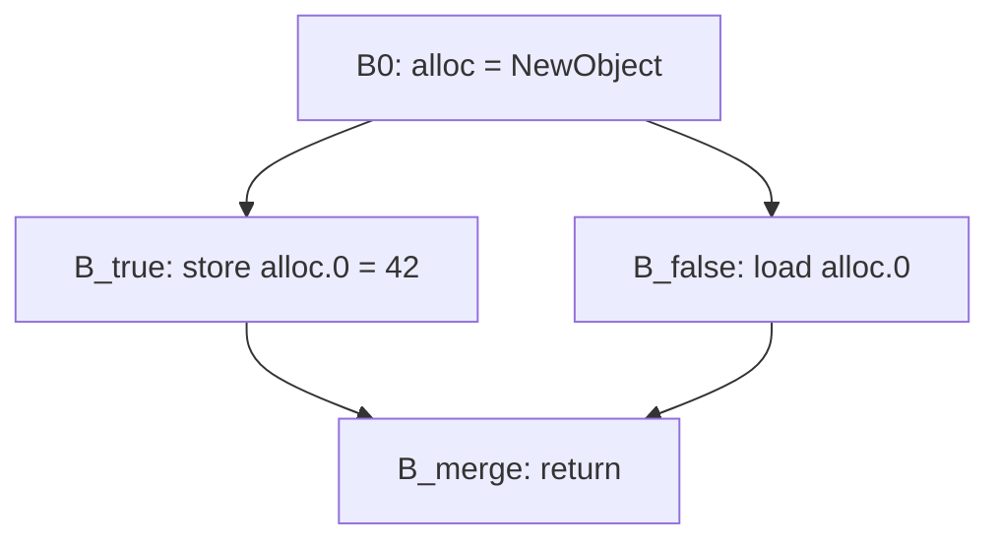

# 45. Memory: what a load can be told, and an object that stops existing   ⟨I · J · N⟩

A load reads a cell. If something earlier in the function already knows what is in that
cell, the load is work you can delete. That single idea — *this value is already available
here* — is the engine of three of the passes in this chapter, and the whole difficulty is
in the word "that". Two loads read the same cell only if you can prove they name the same
cell, and a heap model that is good at proving two accesses *might* collide is exactly the
wrong instrument for proving they *do*. This chapter's central bug is that confusion,
committed once, in one string.

The fourth pass in the chapter goes further. Instead of forwarding a value past an
allocation, it deletes the allocation: if an object's whole life fits inside one frame, each
of its fields can be an ordinary SSA value and the object need never be built. That is legal
only against a promise. The JIT can abandon compiled code at any guard and resume in the
interpreter, and the interpreter frame it resumes into expects a real object with real
properties. So an allocation may be deleted only if every frame state that could resume
carries enough information to rebuild it. Escape analysis writes that information down;
`ObjectMaterializer` reads it back on the bailout path. The tier badge on this chapter is
⟨I · J · N⟩ for that reason: the pass is shared middle end, but the object it promises to
rebuild is an *interpreter* object.

**The running example cannot reach scalar replacement, and the chapter says so up front.**
Every allocation in `docs/example/stats.tera` either escapes or is indexed by a loop
variable, and the pass says so in English. What `stats.tera` *does* reach is load
elimination, exactly once, on a shape small enough to print in full — so the chapter's first
half is walked on the spine and its second half is walked on the shapes in
`tests/optimizing/passes/escape-analysis.test.ts`, which is where the diamond and the
loop-carried field live ([CONVENTIONS § 1-2](../CONVENTIONS.md)).

**What arrived.** The graph after `algebraic-simplification` — ordinal #10 on the AOT road,
constants folded by `sccp` at #9 and identities collapsed at #10 — with a `PointsToResult`
and a `ModRef` sitting in the pass manager's analysis cache, and every heap access in the
graph resolvable to a `MemoryLocation` by `ModRef.locationOf` ([Ch 42 § one-string-key]).
Note that the book's chapter numbering and the pipeline's ordering part company here: `gvn`
is ordinal #16 and runs *after* everything in this chapter, so [Ch 44 § value-numbering]
describes a later pass than [Ch 45 § available-expressions] does. The handovers follow the
pipeline, not the chapter numbers.

## A snapshot dataflow

Three of this chapter's four passes are the same program with different states plugged into
it. That program is `runSnapshotDataflow`, and understanding it once buys you all three.

> **New idea.** *Dataflow analysis.* A basic block is a straight run of instructions with
> one way in and one way out ([Ch 38 § what-a-register-cannot-tell-you]). A dataflow
> analysis computes, for every block, a summary of what is true when control reaches it — "which values are already
> in registers", "which stores can still be observed" — by repeatedly pushing summaries along
> the edges of the control-flow graph until nothing changes. Two knobs decide everything:
> which direction you push (from predecessors, or from successors), and how you combine two
> summaries arriving at the same block. That combining function is called the **meet**.

`runSnapshotDataflow` takes a `SnapshotProblem<State>` — seven members: an optional
`direction`, and `empty`, `clone`, `meet`, `equals`, `transfer` and `rewrite` — and runs it
in two sweeps.

```typescript
  while (!worklist.isEmpty) {
    const block = worklist.take();
    if (!block) break;
    const input = mergeInputs(block, reachable, outputStates, boundarySet, forward, problem);
    if (!input) continue;
    inputStates.set(block, input);
    const output = problem.transfer(block, input);
    const previousOutput = outputStates.get(block) ?? null;
    if (previousOutput && problem.equals(output, previousOutput)) continue;
    outputStates.set(block, output);
    worklist.addAll(nextBlocks(block, reachable, forward));
  }

  let changed = 0;
  for (const block of reachable) {
    const input = inputStates.get(block) ?? null;
    if (!input) continue;
    changed += problem.rewrite(block, input);
  }
```
— `src/optimizing/infra/snapshot-dataflow.ts:34-52`

The first sweep is a worklist to a fixpoint: take a block, meet the outputs of its sources
into an input, transfer that input across the block's nodes to an output, and if the output
moved, wake the blocks downstream. `equals` is what stops it. The second sweep is a single
pass over every reachable block calling `rewrite` with the settled in-state.

The split is the point. `transfer` may run any number of times on the same block — it is
re-run every time a predecessor's output moves — so it must be pure: it computes a new state
from an old one and touches nothing else. If deletion happened inside `transfer`, a block
visited three times would delete three times. `rewrite` runs exactly once per block, and it
is the only place a node is removed. It re-derives the state as it walks, because after
forwarding a load it must record the *surviving* value, not the deleted one — which is why
`rewriteBlock` in every one of the three passes begins with `cloneState(input)` and repeats
the transfer logic inline rather than calling `transfer` and then editing.

Two configuration points do the rest. `direction` picks `forward` (predecessors → block) or
`"backward"` (successors → block), and the driver simply swaps which map is read and which
is written. The boundary set — the blocks that start from `empty()` rather than from a
merge — is `[entry]` forward, and backward it is every reachable block all of whose
successors are unreachable, computed by the local `boundaryBlocks`. If that set comes back
empty (a function whose only exit is an infinite loop), the driver seeds the worklist with
every reachable block instead, so the analysis still terminates instead of never starting.
`graph.rebuildUses()` runs once at the end, and only if something changed.

## Available expressions

Load elimination is the textbook forward *must* analysis, applied to memory.

> **New idea.** *Available expressions.* A fact is **available** at a program point if it
> holds no matter how control got there. That makes availability a **must** problem: at a
> merge, a fact survives only if *every* incoming path carries it. The meet is intersection.
> The mirror discipline — a fact survives if *any* path carries it, meet is union — is a
> **may** problem, and you will meet one two sections down.

The state maps a cell to the SSA value last known to be in it. `meetStates` intersects:

```typescript
function meetStates(left: MemoryState, right: MemoryState): MemoryState {
  const out = emptyState();
  for (const [key, entry] of left.byLocation) {
    const other = right.byLocation.get(key);
    if (!other || !sameEntry(entry, other)) continue;
    addEntry(out, entry);
  }
  return out;
}
```
— `src/optimizing/passes/load-elimination.ts:221-229`

Present in both, and `sameEntry` — which compares `value`, `base`, `key` **and** `visible`,
at `:240-242` — must agree on all four. Two branches that each leave a value in `o.x` do not
make `o.x` available unless it is the *same* SSA value; a phi would be needed otherwise, and
this pass does not build one. That is what
[t: tests/optimizing/passes/load-elimination.test.ts > "eliminates load available from every branch at a merge"]
pins, and its converse is why
[t: tests/optimizing/passes/load-elimination.test.ts > "does not replace a loop-carried field load with the preheader store"]
passes: at a loop header the back edge has not been solved yet on the first visit, and once
it has, the two inputs disagree.

The rewrite is sixteen lines and does the whole job:

```typescript
  for (const node of block.nodes) {
    if (ir.isTrackedLoad(node.type)) {
      const location = modRef.locationOf(node);
      const existing = location?.identity == null
        ? undefined
        : state.byLocation.get(location.identity);
      if (existing && existing.value !== node) {
        replaceValueUses(graph, node, existing.value);
        detachNode(node);
        removed.add(node);
        eliminated++;
        continue;
      }
      if (location) addLocation(state, location, node, pointsTo);
      continue;
    }
```
— `src/optimizing/passes/load-elimination.ts:60-75`

`replaceValueUses` is not a convenience. It rewrites every input edge that named the dead
load *and then calls* `replaceGraphFrameStateValue` (`src/optimizing/ir/graph-edit.ts:19`),
so any frame state that captured the deleted load now names the survivor. This is the
discipline [Ch 40 § who-must-own-one] sets: frame states are uses, `uses.length === 0` is
not death, and a pass that edits the value graph without editing the second use graph leaves
a bailout with a hole in it. Load elimination gets this right by going through the shared
helper. Escape analysis, further down this chapter, does not — see the callout there.

Here is the pass firing, on the spine. `stats.tera`'s module-level graph loads the global
`Series` three times — `v5`, `v8` and `v18`:

```
    v4 = Constant [value=<opaque:RegisterCompiledFunction>, classValue="Series"]
    v5 = LoadGlobal [name="Series", classValue="Series"]
    v6 = Constant [value=<opaque:RegisterCompiledFunction>]
    v7 = Constant [value=<opaque:RegisterCompiledFunction>]
    v8 = LoadGlobal [name="Series", classValue="Series"]
    v9 = Constant [value="latency"]
```

After `#11 load-elimination`, `v8` is gone and `v16 = GenericCall v5, v9, v15` names `v5`
instead. The header line reports the whole result: `*** IR after #11 load-elimination
[changed, nodes 56 -> 55 (-1), invalidated type-inference points-to mod-ref] ***`. One node,
one function, on a twenty-four-line program — that is the honest size of this pass on this
example, and the reason the chapter's second half is walked on unit-test shapes.

What is more interesting is the load it did *not* remove. `v18 = LoadGlobal [name="Series"]`
survives, even though nothing stored to `Series` in between. Between `v8` and `v18` sits
`v16 = GenericCall`, and a generic call clobbers all memory. A global's `MemoryLocation` has
`base === null`, which makes it unconditionally externally visible, so `killVisible` drops
it. The pass is not reasoning about `Series` in particular; it is reasoning about what a
call it cannot see inside might do to anything the outside world can reach.

## One key cannot answer two questions

This is the book's best closed bug, and it is worth the space because the mistake is one
almost every heap-aware optimizer is one line away from making.

**The symptom** was a wrong answer with no crash. A twenty-seven-line reduction of a decimal
bignum formatter — a `compare` that walks two `int[]` limb arrays backwards inside a `while`
and returns early, called fifty-four times with `halve` shrinking one array between calls —
printed `...,1,1,1,1,` under `--no-opt` and `...,1,0,0,0,0,0,` once the optimizing tier had
installed compiled code, from roughly the forty-ninth call. Same source, same engine, two
answers, and no diagnostic anywhere.

**The mechanism** was one string. `MemoryLocation.key` is built by `locationKey(partition,
field)` as `partitionKey|fieldKey` (`src/optimizing/analyses/heap-model.ts:29-31`). For two
`int[]` parameters, points-to gives both the same array shape stamp and neither a single
allocation site, so both partitions are `{kind: "shape", mapId: -1}`; a subscript that is not
a constant is `{kind: "anyIndex"}`. Both parameters therefore compute the same key:
`shape:-1|anyIndex`. That key is a perfectly correct answer to the question
`fieldsOverlap`/`basesMayAlias` are asking — *might these two accesses touch the same
memory?* — because it names a **class** of cells. Load elimination used it as the identity of
its available-value map, so the entry `a[i]` established on one line was found again by the
lookup for `b[i]` on the next, and `b[i]` was replaced by `a[i]`. `a[i] != b[i]` became
`a[i] != a[i]`, always false, `compare` fell out of its loop and returned `0`.
`dead-store-elimination` had the mirror-image bug in the mirror direction: a store killed the
liveness of every may-aliasing key, so a store to `b[0]` made an earlier store to `a[0]`
look dead and deleted it.

**The fix** was to stop asking one key two questions. `MemoryLocation` now carries a second
string beside the first:

```typescript
export type MemoryLocation = {
  readonly key: string;
  readonly baseKey: string;
  readonly identity: string | null;
  readonly base: ir.CFGInstruction | null;
  readonly partition: Partition;
  readonly field: Field;
};
```
— `src/optimizing/analyses/heap-model.ts:61-68`

`identity` is built at construction and is deliberately allowed to be absent:

```typescript
  const base = node.inputs[0];
  if (!base) return null;
  const cell = cellKey(node);
  return locationOf(
    base,
    partitions.partitionOf(base),
    field,
    cell === null ? null : `v${identityRootOf(base).id}|${cell}`,
  );
```
— `src/optimizing/analyses/heap-model.ts:127-136`

An identity is `v<root id>` — the SSA value the base actually is — joined to a cell name:
`slot:<offset>` for a field, `index:<const>` for a constant subscript, `index:v<root id>` for
a variable one, and for a global simply `global:<name>`, since a global's name *is* its
identity. Where no cell can be named, `cellKey` answers `null` and so does `identity`. Both
passes now key their dataflow state by `identity` — `load-elimination.ts:63-65` and `:161-165`,
`dead-stores.ts:141-150` — and go on using `key` and `mayAlias` for kills, which is the
question those were always right for.

The `identityRootOf` walk is what keeps the fix from throwing away the legitimate case. It
follows `forwardsPointerIdentity` (`src/optimizing/ir/operations.ts:1204-1206`) up through
any node that hands back the same pointer, so `CheckElementsKind(CheckArray(a))` appearing in
two different blocks still resolves to the one root `a`, and forwarding `a[i]` for `a[i]`
survives. `dead-stores` also lost its private copies of `memoryLocation` and
`isExternallyVisible` in the same change and now imports the heap model's.

**The regression tests** are the five shapes that miscompiled:
[t: tests/optimizing/passes/load-elimination.test.ts > "keeps a load of a second array that only shares the first array's shape"],
[t: tests/optimizing/passes/load-elimination.test.ts > "keeps a second load of one array taken at a different index"],
[t: tests/optimizing/passes/load-elimination.test.ts > "keeps a load of a second object that only shares the first object's shape"],
[t: tests/optimizing/passes/dead-stores.test.ts > "keeps a store that a second object of the same shape overwrites"] and
[t: tests/optimizing/passes/dead-stores.test.ts > "keeps a store that a different index of the same array overwrites"].

**The general rule** is the sentence to take out of this chapter: *a partition answers
whether two accesses may touch the same memory; it never answers whether they are the same
cell.* Redundancy elimination — forwarding a load, killing a store — needs the second
question. So it must key on identity, and where identity is `null` it must eliminate
nothing. Read `location?.identity == null ? undefined : …` in the excerpt above as a refusal,
not a null check: an unnameable cell buys no optimization at all, and that is the correct
price.

The closure of this entry is recorded in [Appendix D § Closed](../appendix/d-inventory.md),
including the four-configuration re-run that retired it. It is worth noting how it left the
inventory: the reproducer was rebuilt byte-for-byte and run under `--no-opt`, default
thresholds, `--always-opt` and `--opt-threshold 1`; all four printed the same fifty-four
marks and `diff` called the outputs identical, while `--trace-opt` confirmed `compare` really
was speculatively compiled and installed. An entry leaves the inventory when a command
reproduces nothing, not when a note says so.

## The state is three indices, not one map

`MemoryState` is three fields, and the two beyond the obvious one exist to make kills
affordable.

- `byLocation: Map<string, MemoryEntry>` — identity → the entry. This is the map that answers
  "what is in this cell". A `MemoryEntry` is a `MemoryLocation` plus `value` (the SSA node
  now in the cell) and `visible` (a cached `isExternallyVisible`).
- `byBase: Map<string, Set<string>>` — `baseKey` → the set of identities recorded under it.
  A kill is expressed in terms of a base: *something wrote through a pointer that may be this
  one*. Without `byBase` the kill would have to scan every entry in `byLocation` and re-ask
  `mayAlias` about each; with it, the scan is confined to the candidate bases.
- `visibleBaseKeys: Set<string>` — the subset of bases that the outside world can reach. This
  is what an opaque call has to clobber, and it is a set rather than a filter over `byBase`
  because `killVisible` is asked at every call node.

The three are maintained in step by exactly two functions. `addLocation` (`:155-173`) returns
immediately if `identity` is `null`, removes any prior entry for that identity, writes the
new entry, adds the identity to its base's set, and adds the base to `visibleBaseKeys` if the
entry is visible. `removeLocation` (`:181-193`) undoes all of it, and deletes the base's set
and its visible flag together when the set empties. Nothing else touches the three maps
directly; `killVisible`, `killAliases` and `killLocationKey` all funnel through
`removeLocation`. That is the whole invariant, and it is maintained by construction —

> **Unenforced.** Nothing checks that `byLocation`, `byBase` and `visibleBaseKeys` agree.
> `addEntry` (`load-elimination.ts:244-255`), used only by `meetStates`, is a second
> hand-written copy of `addLocation`'s three-map update with the `removeLocation` call
> dropped; the two are kept in step by hand. Cost to enforce: give `MemoryState` a class with
> `add`/`remove` methods and make `meetStates` call `add`, or assert set membership under a
> debug flag.

## The externally-visible distinction

The whole question of which entries a call destroys reduces to one predicate, and it is
shared by both passes:

```typescript
export function isExternallyVisible(
  location: Pick<MemoryLocation, "base" | "partition">,
  escapes: EscapeResolver,
): boolean {
  if (location.base === null) return true;
  return location.partition.kind !== "alloc" || escapes.escapes(location.base);
}
```
— `src/optimizing/analyses/heap-model.ts:138-144`

Three cases, in order. A global has no base node at all, and a global is by definition
reachable from outside the function, so it is always visible. An `alloc` partition — a
location whose base points to one identified allocation site — is visible only if points-to
says that allocation escapes. Everything else (a `shape` partition, an `any` partition) is
visible, because if the analysis could not tie the base to a site it cannot argue the object
is private.

That predicate then drives `candidateBaseKeys`, which decides how wide a store's kill is:

```typescript
function candidateBaseKeys(
  state: MemoryState,
  location: MemoryLocation,
  pointsTo: PointsToResult,
): Set<string> {
  if (location.base === null || !isExternallyVisible(location, pointsTo)) {
    return new Set([location.baseKey]);
  }
  return new Set([...state.visibleBaseKeys, location.baseKey]);
}
```
— `src/optimizing/passes/load-elimination.ts:143-152`

A store through a base nobody outside can name kills only entries under that base. A store
through a visible base has to consider every visible base, because two visible bases might be
the same object arriving by two routes. (The global case takes the narrow branch by name, not
by visibility: a store to `counter` cannot be a store to `total`.)

The payoff of the fresh-allocation case is
[t: tests/optimizing/passes/load-elimination.test.ts > "preserves state for fresh non-escaped allocation after call"]:
an object allocated in this function and never leaked keeps its known field values across an
opaque call, because a callee that was never handed the pointer cannot have written to it.
Its converse is
[t: tests/optimizing/passes/load-elimination.test.ts > "invalidates state after call for escaped objects"],
and the corresponding no-alias fact between two separate `NewObject`s is
[t: tests/optimizing/passes/load-elimination.test.ts > "two fresh allocations are no-alias"].
`killsEverything` is asked before any of this: a node the `ModRef` marked as clobbering
everything skips straight to `killVisible` and returns.

## Liveness, backwards

Dead store elimination asks the opposite question — *can anyone observe this store?* — and it
is the same driver with three settings changed.

```typescript
export function deadStoreElimination(
  graph: StoreGraph,
  pointsTo: PointsToResult,
  modRef: ModRef,
): number {
  const universe = buildUniverse(graph, pointsTo);
  return runSnapshotDataflow(graph, {
    direction: "backward",
    empty: () => ({ live: new Set(universe.visibleKeys) }),
    clone: cloneState,
    meet: meetStates,
    equals: stateEquals,
    transfer: (block, output) => transferBlock(block, output, universe, pointsTo, modRef),
    rewrite: (block, output) => rewriteBlock(block, output, universe, pointsTo, modRef),
  });
}
```
— `src/optimizing/passes/dead-stores.ts:28-43`

> **New idea.** *Liveness.* A cell is **live** at a point if some path from that point reads
> it before overwriting it. Liveness runs backwards — what happens *after* a point decides
> whether the point matters — and it is a **may** problem: a store is dead only if it is dead
> on *every* path, so the analysis must keep a cell live if *any* successor might read it.
> The meet is therefore union, which is exactly what `meetStates` at `dead-stores.ts:242-244`
> is: `new Set([...left.live, ...right.live])`.

Getting the direction of the conservatism right is the difference between a missed
optimization and a wrong answer. Load elimination's meet is intersection because forgetting an available value
only costs you an optimization. Dead-store elimination's meet is union because forgetting a
live cell deletes an observable write. The two passes are duals, and their meets are
opposites for the same reason.

`empty()` is the second setting: at every function exit the live set is seeded with
`universe.visibleKeys` — every location the outside world can reach. A store to a global, or
to an object that escaped, is live at return by default, and only an unambiguous later
overwrite on every path can kill it.

The third is `buildUniverse`, the pre-pass at `:130-154`. A backward analysis needs the set
of things it is tracking before it starts, because the exit state is defined in terms of all
of them — you cannot discover the universe by walking forward from entry when you begin at
the exits. So one linear scan over every block collects every tracked load and store,
resolves each to a `MemoryLocation`, and files it under `byKey` (by identity), `byBase`, and
`visibleKeys`. Locations whose identity is `null` are skipped entirely at `:142`, which is
the same refusal as load elimination's, applied to the universe rather than the state.

## IR_RETURN re-livens everything reachable

`transferNode` has one case that is dramatically blunter than the others, and it is blunt on
purpose:

```typescript
function addBaseAliases(
  state: LiveState,
  base: StoreNode,
  universe: LocationUniverse,
  pointsTo: PointsToResult,
): void {
  const partition = pointsTo.partitionOf(base);
  const location: MemoryLocation = {
    key: "",
    baseKey: partitionKey(partition),
    identity: null,
    base,
    partition,
    field: { kind: "anyIndex" },
  };
  addAliases(state, location, universe, pointsTo, false);
}
```
— `src/optimizing/passes/dead-stores.ts:166-182`

At an `IR_RETURN`, every input is passed to this, and it synthesises a location with field
`anyIndex` and calls `addAliases` with `matchField: false`. The `matchField` flag is read at
`aliasKeys:213` — with it false, the `fieldsOverlap` test is skipped altogether. So *every*
field of anything the returned value may alias becomes live again.

That is the smallest correct rule available without more machinery. The caller can reach the
returned object, and through it anything the object holds, and this pass has no reachability
walk to bound how far that goes. It therefore assumes the whole may-alias class is
observable. A more precise rule would need a transitive reachability analysis over the
points-to graph, which does not exist here.

Its consequences are visible in the two cross-block tests.
[t: tests/optimizing/passes/dead-stores.test.ts > "eliminates store when all successors overwrite same key"]
deletes a store when both arms of a branch write the same cell before anything reads it —
union of two "not live" sets is still "not live".
[t: tests/optimizing/passes/dead-stores.test.ts > "does NOT eliminate when a successor reads before overwriting"]
keeps the store when one arm reads first, because union is union.
[t: tests/optimizing/passes/dead-stores.test.ts > "eliminates a store overwritten through multiple blocks on every path"]
shows the same thing surviving several blocks of distance, which is the whole point of doing
this as a dataflow problem rather than a peephole.

The three within-block cases are the ones a reader will recognise:
[t: tests/optimizing/passes/dead-stores.test.ts > "eliminates store overwritten by later store to same object:offset"],
[t: tests/optimizing/passes/dead-stores.test.ts > "keeps store when a load of same key appears between stores"], and
[t: tests/optimizing/passes/dead-stores.test.ts > "invalidates tracking after a call (store before call is not dead)"],
which is `killsEverything` re-livening the entire visible universe at `:120-123`.

## Intrinsic CSE keys on declared effect domains, not the heap

The third snapshot-dataflow pass, `commonSubexpressionIntrinsicReads`, does not use the heap
model at all. It works on a second, parallel memory universe made of *names*.

An `IR_CALL_INTRINSIC` node can carry two metadata arrays, `props.intrinsicReads` and
`props.intrinsicWrites`, each a list of domain strings. The pass treats those as the
partition: a read is invalidated by a write that names one of the domains the read declared.
Two reads of the same intrinsic with the same arguments and the same declared read-domains
are the same value, and the second can be deleted.

The key is built by hand, and the interesting part is the argument tokens:

```typescript
function inputKey(input: IntrinsicNode): string {
  if (input.type === ir.IR_LOAD_GLOBAL) return `global:${String(input.props.name)}`;
  if (input.type === ir.IR_CONSTANT && isPrimitiveKey(input.props.value)) {
    return `const:${typeof input.props.value}:${String(input.props.value)}`;
  }
  return `node:${input.id}`;
}
```
— `src/optimizing/passes/intrinsic-cse.ts:148-154`

A `LOAD_GLOBAL` input is keyed by the *global's name*, not by node identity, so two
separately-built loads of the same global canonicalize and the reads on top of them become
congruent —
[t: tests/optimizing/passes/intrinsic-cse.test.ts > "canonicalizes repeated global loads feeding the same reactive read"].
A primitive `Constant` is keyed by its type and value, for the same reason. Everything else
falls back to `node:<id>`, which is exact and unhelpful; making it better is what
[Ch 44 § value-numbering] is for.

The barrier is where the second universe shows its shape:

```typescript
function applyBarrier(state: AvailableState, node: IntrinsicNode): void {
  if (ir.clobbersAllMemory(node)) {
    clearState(state);
    return;
  }
  if (!ir.writesMemory(node)) return;
  const writes = intrinsicWriteDomains(node);
  if (!writes) {
    clearState(state);
    return;
  }
  invalidateUnknown(state);
  for (const domain of writes) invalidateDomain(state, domain);
}
```
— `src/optimizing/passes/intrinsic-cse.ts:127-140`

Four outcomes, in a strict order of conservatism. A node that clobbers all memory clears
everything. A node that writes nothing does nothing. A node that writes memory but declares
no domains clears everything, because an undeclared write could be anywhere. Only a node that
declares its domains gets the precise treatment — and even then, `invalidateUnknown` first
drops every *read* that declared no domains, because a read that did not say what it depends
on must be assumed to depend on this. `state.unknownKeys` exists exactly to make that
one-line, and `domainIndex` maps a domain to the keys that declared it so
`invalidateDomain` does not scan.

This is the integration point for the `reactive` sibling repository. `isReactiveReadIntrinsic`
(`:117-121`) recognises a node whose `declaredEffects` is exactly `["reactive-read"]` and
admits it to the pass even though it is not otherwise read-only, so a reactive signal read
can be CSE'd between write barriers but never across one. Per
[CONVENTIONS § 19](../CONVENTIONS.md), that is all this book says about `reactive`: what
crosses the boundary is a pair of metadata arrays and one effect name, and the internals
belong to the other repository.
[t: tests/optimizing/passes/intrinsic-cse.test.ts > "does not eliminate reactive reads across write barriers"] and
[t: tests/optimizing/passes/intrinsic-cse.test.ts > "does not reuse branch-local reactive reads at a merge block"]
pin the two ways it declines, and
[t: tests/optimizing/passes/intrinsic-cse.test.ts > "keeps domain-qualified intrinsic reads across non-aliasing writes"],
[t: tests/optimizing/passes/intrinsic-cse.test.ts > "invalidates domain-qualified intrinsic reads across aliasing writes"] and
[t: tests/optimizing/passes/intrinsic-cse.test.ts > "keeps unknown-domain intrinsic reads conservative across domain writes"]
pin the three domain outcomes.
[t: tests/optimizing/passes/intrinsic-cse.test.ts > "reaches a fixed point for loops with intrinsic write barriers"]
pins the thing every dataflow pass has to be asked at least once.

> **Dead.** `meetPredecessors` (`src/optimizing/passes/intrinsic-cse.ts:70-87`) is a complete,
> correct predecessor-merge function with `sawKnown` bookkeeping and no caller anywhere in
> `src/`, `tests/` or `tools/` — a tree-wide grep returns exactly one hit, its own
> definition. `runSnapshotDataflow`'s `mergeInputs` does the merging now; this is what the
> pass used before it moved onto the shared driver. Cost to finish: delete eighteen lines, or
> say why the shared `mergeInputs` is not enough for this problem.

## Escape analysis and scalar replacement

Everything above rewrites accesses to an object. This pass deletes the object.

> **New idea.** *Escape analysis and scalar replacement.* An object **escapes** if a
> reference to it can outlive the frame that made it — it is returned, stored into something
> reachable from outside, or handed to a call the compiler cannot see inside. If it does not
> escape, nothing outside this function can ever observe that it existed, so its identity is
> unobservable and its fields can be replaced by ordinary SSA values. Deleting the object
> outright is **scalar replacement**: `o.x` stops being a memory access and becomes a value.

The pass is `escapeAnalysisAndScalarReplacement`, and it runs twice on both roads — ordinal
#12 `escape-analysis` and ordinal #24 `escape-analysis-late`, the second after the phi and
dead-code cleanups have had a chance to remove the uses that were blocking it.

The gate is two steps. First, `pointsTo.escapes(alloc)` — if the allocation escapes, stop.
Second, build the alias set: every value in the graph (parameters plus every node in every
block, via `collectValues`) whose `pointsTo.allocClassOf` is this allocation's id. That set
is the object as the graph sees it: the `NewObject` itself, every `CheckMap`/`CheckArray`
that forwards it, and every phi that merges it with itself.

`safeReceiverUses` (`:389-403`) then partitions the uses. A use is *safe* if it is an
identity guard or one of the eight `RECEIVER_ACCESSES` opcodes **and the alias is its input
zero** — that is, the object is being used as the thing being read from or written to, not as
a value being passed around. Anything else is not safe, and the first refusal below catches
it.

## The nine refusals, read as a specification

The pass asks nine questions in a fixed order, and each has a `remarks.missed` sentence
attached. Read together they are the most precise definition in the tree of what "this object
is local" actually means. In order, with the message each prints:

1. **`pointsTo.escapes(alloc)`** — *"the allocation escapes: points-to found a use that lets
   the object outlive this frame, so its fields cannot become plain values"* (`:79-82`).
2. **`unsupportedAliasUse`** — *"v`N` (`type`) uses the object as something other than a
   receiver, so scalar replacement cannot rewrite it"* (`:92-95`). Note the one exemption at
   `:412`: a use that is itself an alias *and* a phi is allowed through, because merging the
   object with itself is not a use of it as a value.
3. **`undominatedAliasPhi`** — *"phi v`N` merges the object on a path the allocation does not
   dominate, so there is no single set of fields to replace"* (`:100-103`).
4. **`unresolvedElementIndex`** — *"v`N` indexes the array with a value that is not a
   constant in range, so the element it reads is not known statically"* (`:108-111`). This
   covers three distinct failures at `:770-781`: no constant index, a `slotOf` that cannot be
   normalised, and `slotBeyondTheArray` — a constant index past the array's last element,
   which is [t: tests/optimizing/passes/escape-analysis.test.ts > "does NOT replace an array read past its last element"].
5. **`hasUntrackedLoopStore`** — *"a store inside a loop writes a field this pass cannot
   track across the back edge"* (`:117-120`).
6. **`callerFrameStatesReferenceAliases`** — *"an inlined caller frame state still holds the
   object, so a deopt would have to materialize it"* (`:124-127`). This is the frame-state
   obligation showing up as a refusal: the pass will record a snapshot into *its own* frame
   states, but it declines to reason about a caller's, so an inlined body that leaked the
   object up the chain blocks the whole transform —
   [t: tests/optimizing/passes/escape-analysis.test.ts > "does not scalar replace allocations referenced by caller frame states"].
7. **The inline `allDominated` loop** (`:131-147`) — *"v`N` reads the object in a block the
   allocation does not dominate, so the field may not have been written yet"*.
8. **`requiresUnsupportedMergeState`** — *"a control-flow merge needs a field state this pass
   cannot express as a phi"* (`:151-154`) —
   [t: tests/optimizing/passes/escape-analysis.test.ts > "does not scalar replace when a field load needs unsupported merge state"].
9. **`createPhiFieldStates` returning `null`** — *"the loop header needs a phi per field and
   one of them could not be built"* (`:167-170`).

Only past all nine does the rewrite begin, and it announces itself:
*"the object never escapes, so its fields became plain values and `N` nodes went away"*
(`:339-342`). The two remark shapes are pinned by
[t: tests/optimizing/infra/pass-remarks-from-passes.test.ts > "names the allocation it refused to scalar replace and why it escapes"] and
[t: tests/optimizing/infra/pass-remarks-from-passes.test.ts > "reports a success rather than an escape when the object stays put"].

On `docs/example/stats.tera` the pass prints four distinct misses and no applications — each
one twice over, because the pass is registered twice, at #12 and at #24. Deduplicated, in
node order:

```
remark missed v5: the allocation escapes: points-to found a use that lets the object outlive this frame, so its fields cannot become plain values
remark missed v6: v33 indexes the array with a value that is not a constant in range, so the element it reads is not known statically
remark missed v15: the allocation escapes: points-to found a use that lets the object outlive this frame, so its fields cannot become plain values
remark missed v24: the allocation escapes: points-to found a use that lets the object outlive this frame, so its fields cannot become plain values
```

Three escapes and one unresolved index: the two `Series` objects and their two `float[]`
literals are stored into module globals, and `Series.mean` walks its array with a loop
variable. Refusals one and four, on the book's own spine.

> No performance claim is made here, and none of the five honesty markers applies: the pass
> is complete and correct, it simply finds nothing on this program. There is no benchmark
> harness in this tree ([CONVENTIONS § 9](../CONVENTIONS.md)), so nothing here says scalar
> replacement beats allocating. What the tree does say is what the remarks say: on the
> running example the pass fires zero times.

## The dominator walk carries per-field state

Once the nine questions are past, the rewrite is a recursive walk of the dominator tree
carrying two maps:

```typescript
    const walkDom = (
      block: EscapeBlock,
      propState: ValueState,
      offsetState: ValueState,
    ): void => {
      const localProp = new Map(propState);
      const localOffset = new Map(offsetState);
      processBlock(block, localProp, localOffset);
      for (const child of dominance.childrenOf(block) as readonly EscapeBlock[]) {
        walkDom(child, localProp, localOffset);
      }
    };
```
— `src/optimizing/passes/escape-analysis.ts:314-325`

`propState` is keyed by property name, `offsetState` by slot — a number for a field, the
string `"elem_i<N>"` for an array element. Each child gets a **copy**, which is the entire
correctness argument for this walk. Facts flow down the dominator tree and never sideways.



The dominator tree of that diamond is `B0` with three children — `B_true`, `B_false` and
`B_merge` — because `B_merge` is reachable two ways and neither arm dominates it. `B_true`
writes `42` into `offsetState[0]` *in its own copy*. `B_false` is a sibling, gets `B0`'s copy,
and finds nothing at offset 0, so `processBlock` inserts a fresh `undefined` constant and
replaces the load with it. It does not see `42`, which is what
[t: tests/optimizing/passes/escape-analysis.test.ts > "does not leak store from sibling block in diamond CFG"]
asserts, in three expectations: no `42` in `B_false`, the store not moved, and an `undefined`
constant present. Its positive twin is
[t: tests/optimizing/passes/escape-analysis.test.ts > "propagates store to dominated block correctly"],
where the load *is* in a dominated block and does get the stored value.

`processBlock` (`:210-312`) is a dispatch over the safe uses of the object. `CheckMap`,
`CheckArray` and phi aliases are simply added to `toDelete`. `StoreField` writes
`offsetState[offset]`, and also `propState[propName]` when the store carries one.
`LoadField` reads `offsetState[offset]` and, if nothing is there, inserts an `undefined`
constant at the current position and increments the loop index so the walk does not
re-examine the node it just inserted. `GENERIC_SET_PROP`/`GET_PROP` do the same on
`propState`, with one special case: a `length` read on a scalar-replaced array becomes a
constant, computed at `:176-190` as the larger of the allocation's input count and one past
the highest constant index ever stored. Element accesses use `"elem_" + elementKey(node)`.
Each rewritten node joins `toDelete`, and `removeNodes` at `:817-833` detaches and drops them
all at the end, renumbering the surviving phis' `props.index` so the parallel-inputs
invariant of [Ch 38 § canonical-phi-ssa] survives.

> **Unenforced.** `replaceValue` (`escape-analysis.ts:801-815`) takes a `graph` parameter and
> never uses it. It rewrites input edges directly rather than going through
> `replaceValueUses`, so it does **not** call `replaceGraphFrameStateValue` — a frame state
> naming the replaced load would keep naming a node that is about to be detached. The three
> call sites compensate by calling `replaceGraphFrameStateValue` themselves on the very next
> line (`:253-254`, `:280-281`, `:307-308`). Nothing enforces that pairing, and the unused
> `graph` parameter is the shape of the fix half-made. Cost to enforce: delete the local
> helper and call `replaceValueUses`, which does both.

## createPhiFieldStates: one phi per field, at loop headers and object merges

A loop that mutates a field of a non-escaping object is the case worth having this pass for,
and it is the case that needs new phis. If `o.count` is stored in the body and read in the
header, then after scalar replacement the value of `o.count` at the header is "the initial
value on the entry edge, the updated value on the back edge" — which is precisely a phi.

`createPhiFieldStates` (`:511-595`) builds them in two loops over the same helper. The first
walks the alias phis: for each phi that merges the object, `fieldKeysForAlias` collects every
field key touched through it, and each gets a `createFieldPhi`. The second walks
`carryingHeaders` — the loop headers the allocation dominates — and does the same for the
keys `fieldKeysForLoopHeader` says are written across a back edge.

`createFieldPhi` builds one input per predecessor by asking three questions in order:
`latestStoreForField(predecessor, key, aliases)` — the last value stored to this field in
that predecessor block; failing that, the phi itself if this predecessor is the back edge;
failing that, `initialOffset.get(key)`, the value the allocation was born with. Every input
that is a real node is checked for dominance over its predecessor before being accepted.

The rollback is the part to notice:

```typescript
    if (inputs.length !== block.predecessors.length) {
      removePhi(block, phi);
      incomplete = true;
      return;
    }
```
— `src/optimizing/passes/escape-analysis.ts:551-555`

One missing or undominated input sets `incomplete`, and at `:587-593` *every* phi created so
far — for this allocation, across all blocks — is removed and the function returns `null`,
which becomes the ninth refusal. It is all or nothing, because a half-built set of field phis
is a graph with a phi whose inputs mean nothing.

The positive case is
[t: tests/optimizing/passes/escape-analysis.test.ts > "scalar replaces a loop-carried object field with a phi"]:
a `NewObject` stored with `0` before the loop, loaded and incremented in the header, stored
back in the body. Afterwards there is no `NewObject`, no `LoadField` and no `StoreField` in
the whole graph; the header carries exactly one phi, whose inputs are the initial constant
and the incremented value, and the return names that phi. The object was replaced by an
induction variable.
[t: tests/optimizing/passes/escape-analysis.test.ts > "scalar replaces an object the loop body allocates fresh each iteration"]
is the other shape that works, and
[t: tests/optimizing/passes/escape-analysis.test.ts > "does NOT replace an object a loop phi carries in from the iteration before"]
is the one that does not: an object that arrives from the previous iteration is a different
object each time round, and no per-field phi describes it.

## The promise: recordVirtualState

Now the obligation. The JIT may bail out at any deoptimizing node and continue in the
interpreter, and the interpreter frame it lands in was written expecting a real object. If
the object is gone, something must rebuild it. Escape analysis pays for the deletion in
advance:

```typescript
    const recordVirtualState = (
      node: EscapeNode,
      propState: ValueState,
      offsetState: ValueState,
    ): void => {
      const frameState = node.frameState;
      if (!frameState) return;
      for (let state: FrameState | null = frameState; state; state = state.callerFrameState) {
        if (!frameStateOwnValuesReferenceAliases(state, aliases)) continue;
        const sunk = state.sunkAllocations ?? new Map();
        sunk.set(alloc.id, {
          fields: new Map(offsetState) as Map<number, FrameValue>,
          props: new Map(propState) as Map<string, FrameValue>,
        });
        state.setSunkAllocations(sunk);
      }
    };
```
— `src/optimizing/passes/escape-analysis.ts:192-208`

It walks the node's own frame state and every caller frame state above it, and for each one
whose locals, stack or `this` still name an alias of the allocation, it writes a snapshot —
the two maps, copied — into `state.sunkAllocations`, keyed by the allocation's id.

The placement is the invariant. `processBlock` calls `recordVirtualState(node, propState,
offsetState)` at `:221` as the **first** thing it does with each node, before the `node ===
alloc` skip and before any rewrite. So the snapshot describes the object as of that exact
program point: the fields as they were when execution reached this node, not as they end up.
A frame state is a description of a point in time, and the object it describes has to be
described at the same point.

The rule, stated plainly, is the one this whole half of the chapter exists for: **you may
delete an allocation only if every frame state that could resume can rebuild it.**

> **Unenforced.** Nothing checks that. The invariant "every frame state that names an alias
> got a `sunkAllocations` entry" is maintained by construction inside `recordVirtualState`
> and verified by no verifier — `validateOptimizedGraph` checks frame-state *value
> dominance*, not sunk-allocation coverage, so an allocation deleted without a snapshot would
> be found only by a program that bailed out and read `undefined`. Cost to enforce: one walk
> over every frame state after the pass, asking whether any deleted id is still named without
> a matching `sunkAllocations` entry.

## Redeeming the promise: ObjectMaterializer

On the bailout path, `withMaterializedAllocations(frameState, runtimeValues)` is the entry
point. It returns `runtimeValues` unchanged when there is nothing sunk, and otherwise builds
the objects and merges them into a copy of the map. Its two callers are the deoptimizer
(`src/deopt/deoptimizer.ts:240`) and the frame materializer
(`src/deopt/frame-materializer.ts:409`) — see [Ch 54 § materialization] for where those sit.

`ObjectMaterializer.materialize` walks the sunk allocations and builds a real `JSObject` for
each: properties by name through `obj.setProperty`, and fields by offset by growing the slot
array first.

```typescript
      if (virtualState.fields) {
        for (const [offset, valueNode] of virtualState.fields) {
          const val = this._resolveValue(
            valueNode,
            runtimeValues,
            materialized,
          );
          while (obj.slots.length <= offset) {
            obj.slots.push(undefined);
          }
          obj.slots[offset] = val;
        }
      }
```
— `src/deopt/materializer.ts:56-68`

`_resolveValue` (`:77-109`) is a three-step lookup on anything that looks like an IR node:
already-materialized (so one sunk object may hold another), then the live runtime value
recovered from the compiled frame, then — for a `Constant` — the constant's own value. A raw
number passes straight through, since that is already a `TaggedValue`.

> **Unfinished.** `_resolveValue` returns `mkUndefined()` for anything it cannot resolve.
> `materialize` iterates `sunkAllocations` in insertion order with no topological sort, so a
> sunk object whose field names a *later* sunk object silently gets `undefined` for that
> field rather than an error, and a cycle between two sunk objects cannot be built at all.
> Cost to finish: sort the map by dependency before the loop, or two passes — allocate every
> object first, then fill fields.

> **Broken.** Escape analysis writes array elements into the same `fields` map under string
> keys — `initialOffsetState` (`escape-analysis.ts:501-509`) seeds `"elem_i0"`, `"elem_i1"`
> and so on for an `IR_NEW_ARRAY`, and `offsetStateKey` (`:723-739`) keeps using them — but
> `VirtualAllocation.fields` is declared `Map<number, FrameValue>`
> (`src/deopt/frame-state.ts:16-19`) and `recordVirtualState` gets past that with an
> `as Map<number, FrameValue>` cast. The materializer then treats every key as a slot index:
> `obj.slots.length <= "elem_i0"` is a NaN comparison and is false, so the growth loop never
> runs and the value is assigned as a *string property of the slots array*. It also always
> builds a `JSObject`, never a `JSArray`. A scalar-replaced array that has to be materialized
> at a bailout therefore comes back as a plain object with no elements. **[unpinned]** — the
> seven tests in `tests/deopt/materializer.test.ts` all use numeric offsets or props, and no
> test materializes an array. Cost to fix: a separate element map on `VirtualAllocation`, a
> `JSArray` branch in `materialize`, and deleting the cast that hid the mismatch.

## Allocation sinking is the deopt-only sibling

`allocationSinking` is the same idea one notch weaker. Escape analysis deletes objects that
*never* escape. Allocation sinking deletes objects whose **only** escape point is an
`IR_DEOPTIMIZE` — objects that exist solely so that a bailout would have something to hand
the interpreter.

`analyzeEscape` (`:95-150`) builds a much narrower picture than points-to does. It looks only
at the direct uses of the allocation, and recognises four safe shapes: `GENERIC_SET_PROP`
and `GENERIC_GET_PROP` on the allocation, `CHECK_MAP` on it, and — through that `CheckMap` —
`STORE_FIELD` and `LOAD_FIELD`. `IR_DEOPTIMIZE` and `IR_RETURN` are recorded as escape
points; anything else sets `fullyEscapes` and stops the loop immediately. The decision is
then one filter: if every escape point is an `IR_DEOPTIMIZE`, sink.

`sinkToDeoptOnly` (`:152-169`) differs from escape analysis in *where* it writes the promise.
It does not touch a `FrameState`; it writes the virtual state onto **the deopt node's own
props** via `getSunkAllocations(deoptNode)`, and then removes the allocation from that node's
inputs. Two remarks record the declines: *"not sunk: the object escapes for real, not just
into a deopt frame"* and *"not sunk: v`N` (`type`) needs the object on the fast path, not
only on deopt"*. There is a third message that is neither, an `analysis` remark rather than a
`missed` one — *"nothing to sink: the object has no escape point at all, so escape analysis
should have removed it outright"* (`:62-67`) — which is the pass noticing that the pass
before it left work on the table.

Four tests pin it:
[t: tests/optimizing/passes/allocation-sinking.test.ts > "sinks allocation that only escapes through deopt, attaches virtual state"],
[t: tests/optimizing/passes/allocation-sinking.test.ts > "sinks allocation with field stores via CheckMap, captures field virtual state"],
[t: tests/optimizing/passes/allocation-sinking.test.ts > "does NOT sink when allocation escapes through return (not deopt-only)"], and
[t: tests/optimizing/passes/allocation-sinking.test.ts > "replaces loads with stored values after sinking"].

> **Unfinished.** `allocationSinking` recognises only `IR_NEW_OBJECT`
> (`allocation-sinking.ts:47`). An array whose only escape is a deopt is never sunk, even
> though `escapeAnalysisAndScalarReplacement` handles `IR_NEW_ARRAY` fully. Cost to finish:
> element state in `buildVirtualState`, a matching branch in `ObjectMaterializer` — which,
> per the `> **Broken.**` above, that branch does not have yet either.

And then the one line that deletes the whole pass for the native road:

```typescript
export function staticCompilerOptions(
  base: CompilerOptions = compilerOptions("speed"),
): CompilerOptions {
  return { ...base, sinkAllocations: false, deoptimizes: false };
}
```
— `src/optimizing/optimizer.ts:36-40`

read by `...enabledPasses(options.sinkAllocations, [step("allocation-sinking", …)])` at
`src/optimizing/pipeline.ts:195-197`. This is one of the two options that make the AOT
pipeline differ from the JIT pipeline at all, and the reason is not a policy preference: a
native binary has no `IR_DEOPTIMIZE` node, so there is no deopt frame for an allocation to be
sunk *into*, and a pass whose entire trigger condition is "every escape point is a deopt"
would find nothing on every graph. Dropping it is bookkeeping, not a decision. The other
option, `deoptimizes`, is the business of
[Ch 46 § unswitching-and-the-line-that-turns-it-off], and what it means to have nothing
underneath you at all is [Ch 55 § three-fields-wide]'s.

You can see the consequence in the pass ordinals. On the AOT road,
`--print-after-all` numbers `#11 load-elimination`, `#12 escape-analysis`, `#13
sccp-after-escape`; `allocation-sinking` is simply not there. On the JIT road it sits between
`escape-analysis` and `sccp-after-escape`, and everything after it shifts by one.

## What leaves

The same `CFGFunction`, with four kinds of work removed and one obligation recorded.

Loads whose value was already available at that program point are gone, replaced by the value
already in the cell — and *only* where the cell could be named by an `identity`, never merely
by a may-alias partition. Stores nothing downstream can observe are gone. Duplicate read-only
and reactive intrinsic reads are collapsed onto one node per key, with the key canonicalised
across separately-built global loads. And where all nine conditions held, an allocation and
every load, store and identity guard against it are gone entirely, its fields living on as
plain SSA values and, at loop headers, as new phis.

The obligation goes with it. Every frame state that named the deleted object now carries a
`sunkAllocations` entry describing its fields and properties as of that program point, and
`withMaterializedAllocations` on the bailout path will rebuild a real `JSObject` from it. On
the JIT road that promise is load-bearing; on the native road, `staticCompilerOptions` set
`deoptimizes: false`, `frame-state-elision` will null out every frame state during
legalization, and the promise is never called in.

The next pass to touch this graph is `sccp-after-escape` and then, at ordinal #16, global
value numbering — which asks a related question about *computations* rather than memory: not
"what is already in this cell" but "which of these two nodes compute the same thing".
[Ch 44 § value-numbering] takes the graph from here.

## Verify it yourself

```bash
# the two available-expression passes, and the five may-alias regressions among them (30 tests)
npx vitest run --project unit tests/optimizing/passes/load-elimination.test.ts tests/optimizing/passes/dead-stores.test.ts

# escape analysis, its nine refusals, and allocation sinking (29 tests)
npx vitest run --project unit tests/optimizing/passes/escape-analysis.test.ts tests/optimizing/passes/allocation-sinking.test.ts

# the second, name-based memory universe (14 tests)
npx vitest run --project unit tests/optimizing/passes/intrinsic-cse.test.ts

# every allocation on the spine, and why the pass refused it
node dist/cli.js compile docs/example/stats.tera --emit source --print-after-all -o /tmp/stats-c 2>&1 \
  | grep '^remark missed v' | sort -u

# the memory passes' own report lines: load-elimination fires once, on tera_program
node dist/cli.js compile docs/example/stats.tera --emit source --print-after-all -o /tmp/stats-c 2>&1 \
  | grep '^\*\*\* IR after' | grep -E ' escape-analysis| load-elimination| dead-store-elimination' \
  | grep '\[changed'

# the one line that removes allocation-sinking from the AOT pipeline
grep -rn "sinkAllocations" src/optimizing/optimizer.ts src/optimizing/pipeline.ts

# the dead predecessor-merge: one hit, its own definition
grep -rn "meetPredecessors" src/ tests/ tools/
```

Run on 2026-09-08, the fourth command prints exactly four lines — `v15`, `v24`, `v5` and
`v6`, in `sort`'s lexicographic order — and the fifth prints exactly one:
`*** IR after #11 load-elimination [changed, nodes 56 -> 55 (-1), invalidated type-inference points-to mod-ref] ***`.
The bracket in `grep '\[changed'` is load-bearing: a plain `grep changed` also matches
`[unchanged`, and would print all eighty-four lines. Note too that `-o` names a **directory**
under `--emit source`, and that `--print-after-all` is a `compile`-only flag: it does nothing
on the run path.

## Tests that pin this

- `tests/optimizing/passes/load-elimination.test.ts` > `"eliminates load after store to same object and offset"` — the base case: a store makes the value available to the next load.
- `tests/optimizing/passes/load-elimination.test.ts` > `"eliminates load available from every branch at a merge"` — the must-analysis meet.
- `tests/optimizing/passes/load-elimination.test.ts` > `"does not replace a loop-carried field load with the preheader store"` — and where the meet has to refuse.
- `tests/optimizing/passes/load-elimination.test.ts` > `"preserves state for fresh non-escaped allocation after call"` — `isExternallyVisible` on an `alloc` partition.
- `tests/optimizing/passes/load-elimination.test.ts` > `"invalidates state after call for escaped objects"` — the converse.
- `tests/optimizing/passes/load-elimination.test.ts` > `"invalidates local field state across generic property write"` — an opaque property access kills aliases.
- `tests/optimizing/passes/load-elimination.test.ts` > `"preserves load state across pure call"` — and a call the `ModRef` can see through does not.
- `tests/optimizing/passes/load-elimination.test.ts` > `"two fresh allocations are no-alias"` — two `NewObject`s never collide.
- `tests/optimizing/passes/load-elimination.test.ts` > `"keeps a load of a second array that only shares the first array's shape"` — regression: `shape:-1|anyIndex` is not an identity.
- `tests/optimizing/passes/load-elimination.test.ts` > `"keeps a second load of one array taken at a different index"` — regression: two subscripts of one array.
- `tests/optimizing/passes/load-elimination.test.ts` > `"keeps a load of a second object that only shares the first object's shape"` — regression: the object form of the same bug.
- `tests/optimizing/passes/dead-stores.test.ts` > `"eliminates store overwritten by later store to same object:offset"` — the base case.
- `tests/optimizing/passes/dead-stores.test.ts` > `"keeps store when a load of same key appears between stores"` — a read between two writes.
- `tests/optimizing/passes/dead-stores.test.ts` > `"invalidates tracking after a call (store before call is not dead)"` — `killsEverything` re-livens the visible universe.
- `tests/optimizing/passes/dead-stores.test.ts` > `"eliminates store when all successors overwrite same key"` — the backward meet as union, both arms dead.
- `tests/optimizing/passes/dead-stores.test.ts` > `"does NOT eliminate when a successor reads before overwriting"` — one live arm is enough.
- `tests/optimizing/passes/dead-stores.test.ts` > `"eliminates a store overwritten through multiple blocks on every path"` — why this is a dataflow problem.
- `tests/optimizing/passes/dead-stores.test.ts` > `"keeps a store that a second object of the same shape overwrites"` — regression, mirror of the load bug.
- `tests/optimizing/passes/dead-stores.test.ts` > `"keeps a store that a different index of the same array overwrites"` — regression, the index form.
- `tests/optimizing/passes/intrinsic-cse.test.ts` > `"does not eliminate reactive reads across write barriers"` — `applyBarrier`'s clobber case.
- `tests/optimizing/passes/intrinsic-cse.test.ts` > `"does not reuse branch-local reactive reads at a merge block"` — the intersection meet.
- `tests/optimizing/passes/intrinsic-cse.test.ts` > `"canonicalizes repeated global loads feeding the same reactive read"` — `inputKey`'s `global:` token.
- `tests/optimizing/passes/intrinsic-cse.test.ts` > `"keeps domain-qualified intrinsic reads across non-aliasing writes"` — the precise case.
- `tests/optimizing/passes/intrinsic-cse.test.ts` > `"invalidates domain-qualified intrinsic reads across aliasing writes"` — `invalidateDomain`.
- `tests/optimizing/passes/intrinsic-cse.test.ts` > `"keeps unknown-domain intrinsic reads conservative across domain writes"` — `invalidateUnknown`.
- `tests/optimizing/passes/intrinsic-cse.test.ts` > `"reaches a fixed point for loops with intrinsic write barriers"` — termination.
- `tests/optimizing/passes/escape-analysis.test.ts` > `"scalar replaces non-escaping object with field access"` — the transform.
- `tests/optimizing/passes/escape-analysis.test.ts` > `"does NOT replace when object escapes through call"` — refusal 1.
- `tests/optimizing/passes/escape-analysis.test.ts` > `"does NOT replace when an allocation has an unsupported alias use"` — refusal 2.
- `tests/optimizing/passes/escape-analysis.test.ts` > `"does NOT replace an array read past its last element"` — refusal 4, via `slotBeyondTheArray`.
- `tests/optimizing/passes/escape-analysis.test.ts` > `"does not scalar replace allocations referenced by caller frame states"` — refusal 6.
- `tests/optimizing/passes/escape-analysis.test.ts` > `"does not scalar replace when a field load needs unsupported merge state"` — refusal 8.
- `tests/optimizing/passes/escape-analysis.test.ts` > `"does not leak store from sibling block in diamond CFG"` — the dominator walk's per-child copy.
- `tests/optimizing/passes/escape-analysis.test.ts` > `"propagates store to dominated block correctly"` — and what it does forward.
- `tests/optimizing/passes/escape-analysis.test.ts` > `"scalar replaces a loop-carried object field with a phi"` — `createPhiFieldStates` succeeding.
- `tests/optimizing/passes/escape-analysis.test.ts` > `"scalar replaces an object the loop body allocates fresh each iteration"` — the other loop shape that works.
- `tests/optimizing/passes/escape-analysis.test.ts` > `"does NOT replace an object a loop phi carries in from the iteration before"` — the one that does not.
- `tests/optimizing/passes/allocation-sinking.test.ts` > `"sinks allocation that only escapes through deopt, attaches virtual state"` — the whole point of the pass.
- `tests/optimizing/passes/allocation-sinking.test.ts` > `"sinks allocation with field stores via CheckMap, captures field virtual state"` — the `CheckMap` indirection.
- `tests/optimizing/passes/allocation-sinking.test.ts` > `"does NOT sink when allocation escapes through return (not deopt-only)"` — the filter.
- `tests/optimizing/passes/allocation-sinking.test.ts` > `"replaces loads with stored values after sinking"` — `findStoredValue`.
- `tests/optimizing/infra/pass-remarks-from-passes.test.ts` > `"names the allocation it refused to scalar replace and why it escapes"` — the remark text this chapter quotes.
- `tests/optimizing/infra/pass-remarks-from-passes.test.ts` > `"reports a success rather than an escape when the object stays put"` — its positive form.
