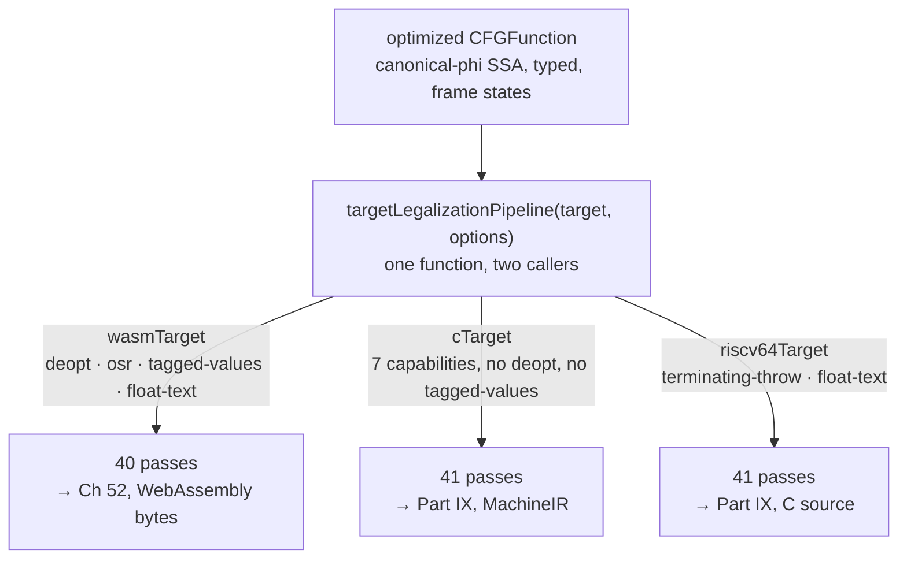

# 51. Legalizing for a target   ⟨ J · N ⟩

Part VII ended with a graph that had been made better. This chapter is about a second
pass list, run immediately afterwards by the same machinery, most of whose members are
not trying to make anything better at all. They are trying to make the program
*expressible*. A `GenericGetProp` is a perfectly good IR node and no target has an
instruction for it. `Math.sign` is a perfectly good builtin and no backend has a case for
it. Forty-one passes later — forty on the JIT road — every node in the graph is one the
chosen code generator has a case for, or the compilation has stopped and said why.

That is also where a dynamic language stops being dynamic. The middle end could afford to
leave `GenericAdd` standing, because `GenericAdd` has a meaning: whatever `+` means in
tera. A code generator cannot afford that, because "whatever `+` means" is not an
instruction. Every pass in this list takes a node that means something in the language and
replaces it with nodes that mean something on a machine, and each one gets to consult a
different fact about which machine.

The consultation is the interesting part. There is exactly one pipeline function, and both
the JIT and the ahead-of-time driver call it. What differs is a set of ten strings.

**What arrived.** From [Ch 50 § what-leaves](../part-07-optimization/50-inlining-and-tail-calls.md):
one optimized `CFGFunction` in canonical-phi SSA, typed by the analysis cached under
`typeInferenceAnalysisId`, with `frameState` edges hanging off every node that can bail
out ([Ch 40 § what-a-frame-state-holds](../part-06-ssa/40-frame-states-describing-a-frame-you-no.md)),
its generic arithmetic specialized where a proof allowed it, and — on the AOT road — whole
callee bodies spliced in. It has no idea which of four code generators is about to read
it.

## The second pipeline

`middleEndPhases(options)` (Part VII) is target-neutral: it takes `CompilerOptions` and
nothing else. `targetLegalizationPipeline(target, options)` takes a `TargetModel` first.
Both return arrays of `TransformPass<CFGFunction>` and both are run by the same
`PassManager` ([Ch 41 § the-pass-manager](../part-07-optimization/41-the-pass-manager.md)).
That is the whole structural difference.

> **New idea. A target model.** A `TargetModel` is not a code generator. It is a small
> record of *what the code generator can be asked to do* — a name, a set of capability
> strings, a speculation strategy, an ABI or `null`, and a function mapping
> representations to machine kinds. Passes read it; nothing in it emits a byte. The point
> of separating them is that the same pass can be written once and behave differently on
> four machines without knowing that any of them exist.

Legalization itself was introduced in
[Ch 3 § forms-11-and-12-two-legalizations](../part-00-the-program/03-one-program-fourteen-forms.md):
rewriting an operation a target cannot emit into ones it can, and then *checking that
nothing unemittable is left*. This chapter is the first half of that sentence in detail
and the last pass in the array is the second half.

The JIT's entry point is four lines:

```ts
  loweringPipeline() {
    return targetLegalizationPipeline(this.target);
  }
```
— `src/optimizing/backends/wasm/backend.ts:25-27`

and the AOT driver's is one, in the middle of the per-function lowering loop:

```ts
      graph.calleeSignatures = signatures;
      graph.emits = backend.emits;
      graph.capabilities = backend.target.capabilities;
      graph.textBufferBytes = opts.textBufferBytes;
      cfgPassManager(analyses, opts).run(graph, backend.loweringPipeline(opts));
```
— `src/optimizing/drivers/aot.ts:768-772`

Same function, same `PassManager`, same graph type. Three of those four assignments above
the `run` call are facts the pipeline will read out of the graph rather than out of the
target, and one of them — `graph.emits` — is why two of this chapter's passes are inert on
the JIT road. § neither-fires-on-wasm.



The ordinals restart at `#0` here, because the AOT driver builds a *second* `PassManager`
per function while carrying the same `AnalysisManager` across
([Ch 41 § ordinals](../part-07-optimization/41-the-pass-manager.md)). So a
`--print-after-all` dump of `stats.tera` shows two passes numbered `#9`: `sccp` in the
middle end and `math-surface` here.

## Capabilities decide which passes exist

The file that decides the shape of the pipeline is seventeen lines long, and eleven of
them are a union of strings:

```ts
export type Capability =
  | "deopt"
  | "osr"
  | "tagged-values"
  | "terminating-throw"
  | "float-text"
  | "select-integer"
  | "select-float"
  | "generational-heap"
  | "utf16-text"
  | "timers";
```
— `src/optimizing/target/capabilities.ts:1-11`

A target's answer is a `ReadonlySet<Capability>` built by `capabilitySet(...caps)`. Two of
them, in full:

```ts
export const wasmTarget: TargetModel = {
  name: "wasm32",
  capabilities: capabilitySet("deopt", "osr", "tagged-values", "float-text"),
  speculation: deoptToInterpreter,
  abi: null,
  machineReprOf: defaultMachineReprOf,
};
```
— `src/optimizing/backends/wasm/target.ts:5-11`

```ts
  capabilities: capabilitySet(
    "terminating-throw",
    "float-text",
    "select-integer",
    "select-float",
    "generational-heap",
    "utf16-text",
    "timers",
  ),
  speculation: proveOrGeneric,
```
— `src/optimizing/backends/c/target.ts:7-16`

Four names against seven, and the two sets overlap in exactly one: `float-text`. This is
the hinge of [Ch 49 § this-is-the-hinge-in-miniature](../part-07-optimization/49-speculative-types-are-not-facts.md)
written out as data. `cTarget` does not have `deopt` because there is no interpreter under
a native binary to bail out into, and it does not have `tagged-values` because there is no
runtime to ask what a tag means.

A capability is consulted in three different places and does three genuinely different
things.

**It splices passes in and out of the array.** `tagged` is read once, at the top of
`targetLegalizationPipeline`, and used four times. Three of the uses look like this:

```ts
    ...(tagged
      ? []
      : [
          {
            name: "zero-divisor",
            preserves: { kind: "none" },
            run: (graph: CFGFunction) => ({ changed: faultOnZeroDivisor(graph) > 0 }),
          } as TransformPass<CFGFunction>,
        ]),
```
— `src/optimizing/target/legalization.ts:154-162`

The other two splice in `parse-number-surface` (`:206-214`) and `builtin-domains`
(`:344-354`). All three exist only for a target *without* tagged values, because each one
is a job a runtime would otherwise do: fault on a whole-number division by zero, read a
number out of text, refuse an argument outside a builtin's domain. The fourth use goes the
other way:

```ts
    ...(tagged ? [representationSelectionPass, representationCheckPass] : []),
```
— `src/optimizing/target/legalization.ts:400`

so a tagged target gains two passes and an untagged one gains three. **Forty-one passes
for a target without tagged values, forty for `wasmTarget`.**
`[t: tests/optimizing/pipeline-order.test.ts > "selects representations only for targets that have tagged values"]`
pins both halves of that in one assertion, and
`[t: tests/optimizing/pipeline-order.test.ts > "leaves no boxing ceremony for an untagged target to strip"]`
pins the consequence: run the same graph through both and the wasm one ends holding `Box`
and `Unbox` nodes while the C one ends with none, and with no `_rep` on any node.

**It turns one pass into a no-op or a scythe.** `deopt` is read exactly once in a pass
body, and § frame-state-elision is that pass.

**And it is asked per *value*, not per target.** `select-integer` and `select-float` are
not questions about the target alone; they are questions about a target *and* the scalar
kind of one particular merged value. § select-twice-illegal is that mechanism.

Two of the ten names are read by nothing this chapter covers. `osr` belongs to
[Ch 54 § three-ways-to-stop]. `utf16-text` and `timers` belong to Part IX;
`generational-heap` is declared by two targets and read by no pass at all
([Appendix D](../appendix/d-inventory.md), raised by Ch 62 and Ch 72).

## Surface lowering tour

The first two-thirds of the array is one idea repeated nineteen times. Each pass finds a
node that names something in the *language*, asks `TypeInference` what the operands
actually are, and replaces the node with ones the backend has a case for. In pipeline
order, with the exported function each entry calls:

`callee-returns` (`answerCallSignatures`) and `spread-calls` (`expandSpreadCalls`) run
first because everything after them wants to know what a call answers.
`iterator-lowering` (`lowerIterators`) turns `for x in ...` machinery into explicit index
arithmetic; `float-remainder` (`lowerFloatRemainder`) hands a fractional `%` to a prelude
function; `string-split-lowering` (`lowerStringSplit`) replaces a `split` call with a scan
over the text; `collection-surface` (`lowerCollectionSurface`) names each `Map`/`Set` by
the key and value types its methods use, so the prelude's generated classes can implement
it; `math-surface` (`lowerMathSurface`) rewrites `Math.*`; `global-builtin-lowering`
(`lowerGlobalBuiltins`) does the same for the eight global builtins.

Then `element-types` (`stampElementTypes`), `object-literal-shapes`
(`shapeObjectLiterals`), `object-surface` (`lowerObjectSurface`) and `generator-iteration`
(`lowerGeneratorIteration`), followed by a second `type-narrowing` — the pipeline settles
types again once it knows what a generator yields
`[t: tests/optimizing/pipeline-order.test.ts > "settles types again after it learns what a generator yields"]`.
Then `callee-signatures` (`resolveCalleeSignatures`), `array-allocation-shapes`
(`shapeArrayAllocations`), `global-variable-lowering` (`lowerGlobalVariables`),
`class-member-lowering` (`lowerClassMembers`), `json-surface` (`lowerJsonSurface`),
`element-member-lowering` (`lowerElementMembers`), `text-method-calls`
(`lowerTextMethodCalls`), `array-method-lowering` (`lowerArrayMethods`),
`builtin-method-lowering` (`lowerBuiltinMethods`) and `array-access-lowering`
(`lowerArrayAccess`). The tail is about text: `print-expansion`
(`expandAggregatePrints`) walks an object's fields so a `print` of a record becomes field
reads; `printed-text` (`lowerPrintedText`); `text-concatenation`
(`joinTextConcatenations`); `string-coercion` (`coerceStringOperands`); and
`named-argument-lowering` (`lowerNamedArguments`).

The shared acceptance test each of these passes is written against is not "did it get
faster". It is "is there anything left that a backend would have to refuse":
`[t: tests/optimizing/passes/math-surface.test.ts > "leaves no generic Math call for a backend to refuse"]`,
`[t: tests/optimizing/passes/string-split.test.ts > "leaves no generic call for a backend to refuse"]`,
`[t: tests/optimizing/passes/collection-surface.test.ts > "leaves no iterator reading the collection itself"]`.
Three files, three passes, one sentence.

Two of them are worth a line each for what they reveal.
`[t: tests/optimizing/passes/print-expansion.test.ts > "tests the reference before reading any field off it"]`
— printing an object whose declared type admits absence emits a test *first*, because on a
target with no runtime, reading a field off nothing is not an exception, it is a fault.
And `[t: tests/optimizing/passes/iterator-lowering.test.ts > "drops every operand of the range call it removed, not only the callee"]`
is a def-use hygiene test: a lowering that removes a node must detach all of its inputs, or
the operands stay artificially live
([Ch 38 § the-def-use-multiset](../part-06-ssa/38-a-control-flow-graph-not-a-sea.md)).

On `Series.mean`, exactly four of the forty-one report `changed`: `#12 element-types`,
`#21 class-member-lowering`, `#29 array-access-lowering` and `#36 frame-state-elision`.
Only one of them grows the graph, and it grows it a lot:

```
*** IR after #29 array-access-lowering [changed, nodes 20 -> 36 (+16), invalidated type-inference] ***
```

Twenty nodes in, thirty-six out. The middle end had taken `Series.mean` from twenty-six
nodes to twenty ([Ch 41 § thirty-three-passes-over-seriesmean](../part-07-optimization/41-the-pass-manager.md));
legalization puts sixteen back. That number is the chapter's thesis as arithmetic. This
pass list is not an optimizer.

## Lowering to tera, not to C   ⟨ N ⟩

The recurring answer to "where does the implementation live?" is the one a reader least
expects. `lowerFloatRemainder` does not emit a sequence of machine operations for a
fractional `%`. It emits a call to a tera function named `_float_mod`, and that function is
tera source the compiler wrote and appended to the program before parsing it.

```ts
const SOURCE_PRELUDES: readonly SourcePrelude[] = [
  { emit: fixedTextPrelude, adopt: rewriteFixedTexts },
  { emit: textMethodPrelude, adopt: rewriteTextMethods },
  { emit: mathTranscendentalPrelude, adopt: rewriteMathTranscendentals },
  { emit: floatModPrelude, lowered: [FLOAT_MOD_FN] },
];

export const LOWERED_PRELUDE_FUNCTIONS: ReadonlySet<string> = new Set<string>(
  SOURCE_PRELUDES.flatMap((prelude) => prelude.lowered ?? []),
);
```
— `src/optimizing/prelude/index.ts:16-25`

Four entries. `emit` produces tera source text; `adopt` rewrites the user's AST to call
into it; `lowered` names the functions a *legalization pass* will call rather than the AST.
The pieces are assembled by `sourcePreludes` and stitched into the module by
`preludeText`, alongside three larger preludes with the same shape — number parsing,
collections, and JSON.

Then the limit, immediately, because it is the single most consequential line in the
chapter:

```ts
    const prelude = aot ? preludeFor(built) : "";
```
— `src/api/engine.ts:1407`

The prelude is an **ahead-of-time** mechanism. On the JIT road that expression is the empty
string, the module is not rebuilt, and none of the prelude functions exist. The same
legalization passes still run on `wasmTarget` — `float-remainder` is `#6` on the native road
and `#5` on the JIT road, which has one fewer pass before it (`zero-divisor`) —
but the callee they would rewrite a node into is not in the program, so the work stays a
generic node and [Ch 53 § runtime-stubs] turns it into a call back into the interpreter at
run time.

This is the cleanest statement in the book of why the two backends diverge in *cost*
rather than in *meaning*. Both roads answer the same thing for `12.5 % 4.0`. One answers it
by calling compiled tera; the other answers it by leaving wasm and asking the interpreter.
Neither is a different semantics, and no pass had to be written twice.

It has a visible consequence in the running example, and it is the reason `stats.tera`
reaches material this chapter would otherwise have needed a probe for. Line 15 of
`docs/example/stats.tera` calls `.to_fixed(2)`. That drags in `fixedTextPrelude`, which is
~300 lines of generated tera implementing exact decimal formatting, and the AOT compile of
a twenty-four-line program therefore contains **twenty-one functions**. Two of them,
`_FixedDigits.render` and `_FixedDigits.format`, are the only two functions in that compile
that if-conversion touches at all.

## `untilStable`

Thirty-nine of the forty-one entries run their lowering once. Two run it until it stops
moving:

```ts
function untilStable(
  graph: CFGFunction,
  analyses: AnalysisManager<CFGFunction>,
  lowerings: readonly TypedLowering[],
): boolean {
  let changed = false;
  for (;;) {
    let moved = 0;
    for (const lowering of lowerings) {
      const count = lowering(graph, analyses.get(typeInferenceAnalysisId));
      if (count > 0) analyses.invalidate(typeInferenceAnalysisId);
      moved += count;
    }
    if (moved === 0) return changed;
    changed = true;
  }
}
```
— `src/optimizing/target/legalization.ts:67-83`

Note the invalidation *inside* the loop, not after it. Each lowering reads the types; each
lowering that changes anything makes the types it just read stale for the next lowering in
the same round. `analyses.get` will rebuild on demand
([Ch 41 § analysis-manager](../part-07-optimization/41-the-pass-manager.md)), so the
next call sees the new graph.

The two members:

```ts
const SPLIT_LOWERINGS: readonly TypedLowering[] = [lowerStringSplit];

const HEAP_ITERATION_LOWERINGS: readonly TypedLowering[] = [
  stampElementTypes,
  lowerStringSplit,
  lowerIterators,
];
```
— `src/optimizing/target/legalization.ts:85-91`

`SPLIT_LOWERINGS` has one element, which looks pointless until you notice that a split can
produce a split: lowering `a.split(",")` introduces a scan whose own text reads can
themselves be splits when the source nested them. `HEAP_ITERATION_LOWERINGS` has three that
feed each other in a cycle — stamping element types tells the split lowering what a text
array holds, the split lowering produces arrays that need stamping, and iterator lowering
consumes both.

> **New idea. A fixpoint over rewrites.** [Ch 14 § new-idea-a-worklist-reaching-a-fixpoint](../part-02-meaning/14-async-and-the-await-you-never-wrote.md)
> introduced a fixpoint over an *analysis*: iterate until no fact changes, safe because
> facts only ever grow within a bounded lattice. A fixpoint over *rewrites* is a different
> promise and needs a different argument. Nothing bounds the graph, so "run until nothing
> changes" terminates only if every rewrite strictly consumes something that cannot be
> reintroduced. Here each lowering removes a generic node and puts back concrete ones, and
> no concrete node can become a `split` call again, so the supply is finite and the loop
> ends. If any of the three ever produced a node another one lowered *back*, `untilStable`
> would spin forever with no iteration bound to stop it — there is no counter in those
> seventeen lines.
> `[t: tests/optimizing/pipeline-order.test.ts > "runs the split lowering to a fixpoint rather than once"]`
> pins the stopping half of that, by running the pass twice and asserting the node count
> did not move the second time.

## Speculation lowering: three strategies

Legalization ordinal `#13` is where everything the middle end proved gets cashed, and where
the two roads first physically differ. The dispatch is a three-entry map:

```ts
const STRATEGIES = new Map<SpeculationKind, Strategy>([
  ["deopt-to-interpreter", () => 0],
  ["guard-with-slowpath", (graph, editor, types) => proveOrGeneric(graph, editor, types, false)],
  ["prove-or-generic", (graph, editor, types) => proveOrGeneric(graph, editor, types, true)],
]);
```
— `src/optimizing/passes/speculation-lowering.ts:172-176`

The key is `target.speculation.kind`, a property of the target model. It is not a flag, not
an optimization level, and not reachable from the command line.

`"deopt-to-interpreter"` is `() => 0`: literally nothing, zero changes. The wasm target
selects it, and it keeps every guard it was given, because a guard on the JIT road is a
real wasm instruction with a real failure edge into [Ch 54 § three-ways-to-stop].

`"prove-or-generic"` is what the C, x64 and riscv64 targets select. It does three things at
once. It **deletes** guards — seven of the eight guard opcodes, redirecting every use to
the guard's own input. It **de-specializes** an `Int32Add` the middle end could not prove
into a `Float64Add`, so what the guard was protecting against cannot happen silently. And
it **resolves** an `IR_GENERIC_CALL` whose callee is known into an
`irCallKnownFunction`. The classification is one pass over the blocks; the decision for the
middle branch is one field read:

```ts
function isProven(node: CFGInstruction): boolean {
  return node.props.noOverflow === true;
}
```
— `src/optimizing/passes/speculation-lowering.ts:102-104`

That is the whole cash-out. Every `noOverflow` stamp
[Ch 48 § settle-int32](../part-07-optimization/48-types-and-representations-in-the-middle-end.md)
managed to place survives as native integer arithmetic; every one it declined to place
becomes a double here. `NUMERIC_OR_UNKNOWN` (`:50-57`) is the six lattice kinds a generic
arithmetic node's operands may have for the third rewrite to fire — `Smi`, `Double`,
`Number`, `Boolean`, `Any`, `Never` — and `Any` being in that list is the pass admitting
that it will lower an operation it cannot type, because a target with no tags has nothing
better to do with it.

`"guard-with-slowpath"` — the third answer, in which a native compiler neither proves nor
refuses but branches — is selected by no target in the tree. It has an entry in
[Appendix D](../appendix/d-inventory.md) already, raised by Ch 49.

## Frame-state elision   ⟨ N ⟩

Eighteen lines delete the entire deoptimization machinery from a graph:

```ts
export function elideFrameStates(
  graph: CFGFunction,
  target: TargetModel,
): number {
  if (target.capabilities.has("deopt")) return 0;
  let elided = 0;
  for (const block of graph.blocks) {
    for (const node of block.nodes) {
      if (!node.frameState) continue;
      node.frameState = null;
      elided++;
    }
  }
  return elided;
}
```
— `src/optimizing/passes/frame-state-elision.ts:4-18`

One capability read, then a walk. On `wasmTarget` it returns on line 8 having done nothing.
On every native target it nulls every frame-state edge in the function, and this is the pass
that makes [Ch 49](../part-07-optimization/49-speculative-types-are-not-facts.md)'s rule
load-bearing rather than theoretical: after `#36`, a value whose type was narrowed by a
guard has no snapshot to bail out with, because there is no snapshot left anywhere in the
graph. A fold that read that narrowed type back at middle-end `#8` is now a claim about a
value nothing tests.

Two things about the entry deserve naming. It is registered with
`preserves: { kind: "all" }` (`legalization.ts:411`), which is true of control flow and of
dominance and of the loop forest, and is a considerably stronger claim about liveness than
the pass has any business making — a frame state is a *use*
([Ch 40 § the-second-use-graph](../part-06-ssa/40-frame-states-describing-a-frame-you-no.md)),
so nulling every one of them changes which values are live. Nothing downstream in this
pipeline reads a liveness analysis, so it does not currently matter.

And it is `#36` of `#40`. The check that catches what it missed is four passes later.

> **Unenforced.** Nothing verifies that a graph compiled for a target without `deopt`
> contains no `frameState` when it reaches the backend. `elideFrameStates`
> (`src/optimizing/passes/frame-state-elision.ts:4-18`) nulls them and `capabilityCheck`
> (`src/optimizing/passes/capability-check.ts:35-55`) refuses the *nodes* that would have
> needed one — but the check runs at `#40`, four passes after the elision at `#36`, and
> `if-conversion`, `operation-legalization` and `dead-code-elimination` all create nodes in
> between. `speculatable` in if-conversion happens to test `node.frameState === null`, which
> catches the case by accident rather than by design. Cost to enforce: one loop in
> `validateOptimizedGraph` gated on the target's capability set, which would require
> threading the target into a validator that currently takes only a graph.

## If-conversion under a budget

`if-conversion` at `#37` is the one pass in this list that is an optimization, and it is
the one that most needs to be told when to stop. It turns a diamond — a branch whose two
arms rejoin — into straight-line code with an `IR_SELECT` in place of the join's phi. Both
arms then run *unconditionally*, and their results are thrown away on one side.

`diamondAt` recognises the shape, including the triangle case where one arm is the join
itself. `armOf` then walks each arm's nodes and refuses the whole diamond if any of them is
not speculatable:

```ts
function speculatable(node: CFGInstruction): boolean {
  return (
    isMovable(node) &&
    isEffectFree(node) &&
    !canDeoptimize(node) &&
    node.frameState === null
  );
}
```
— `src/optimizing/passes/if-conversion.ts:78-85`

Four conditions, and each names a way that running a node on a path the program did not take
would be observable: it moved, it wrote something, it bailed out, or it recorded a frame it
was never in.
`[t: tests/optimizing/passes/if-conversion.test.ts > "refuses an arm that reads memory, which the untaken path never would"]`
and `[t: … > "refuses an arm whose arithmetic can still overflow into a deopt"]` are the
second and third clauses; `[t: … > "refuses an arm that calls, because the call may not be safe to run"]`
is the first two together.

> **New idea. A cost model.** A pass that can only make code better needs a rule. A pass
> that can make code *worse* needs a number. If-conversion is the second kind: replacing a
> predictable branch with unconditional work is a loss, and there is no rule that says which
> way it will go — it depends on how much work the arms do and how well the branch predicts,
> and the second of those is not knowable at compile time. So the pass charges a price per
> node and compares it against a ceiling. This is the same shape as the tiering budget of
> [Ch 35 § the-budget-is-not-a-counter](../part-05-getting-hot/35-back-edges-safepoints-budgets-and-the-tiering.md),
> pointed at a different question: there the cost was bytecodes executed and the budget said
> "how hot is this loop"; here the cost is instructions added and the budget says "how much
> am I willing to lose if the branch was predictable".

The price list is two constants and a four-element set:

```ts
const STEP_COST = 1;

const ROUTINE_COST = 16;

const THROUGH_A_ROUTINE: ReadonlySet<string> = new Set<string>([
  IR_INT32_DIV,
  IR_INT32_MOD,
  IR_FLOAT64_DIV,
  IR_FLOAT64_POW,
]);
```
— `src/optimizing/passes/if-conversion.ts:44-53`

Division, remainder and exponentiation cost sixteen; everything else costs one. The ceiling
is `options.ifConversionBudget`, which is `0` at `none` and `baseline`, `2` at `speed` (the
default) and `4` at `max` (`src/optimizing/options.ts:61,75,89,103`). A budget of zero
switches the pass off entirely and says so
`[t: tests/optimizing/passes/if-conversion.test.ts > "does nothing when the budget is zero"]`
— which means `ROUTINE_COST` is unreachable at every configured optimization level: sixteen
is already over the ceiling at `max`, so the four-element set exists to make a division
*impossible* to if-convert rather than to price it.

`stats.tera` compiled ahead of time hits both outcomes, in the same prelude function, ten
generated lines apart. `_FixedDigits.format` begins:

```
    if digits < 0 or digits > 100:
      throw "toFixed() digits argument must be between 0 and 100"
```
— generated tera, from `src/optimizing/prelude/fixed-text.ts:208-209`

and ten lines later:

```
    if x < 0.0:
      sign = "-"
      x = 0.0 - x
```
— generated tera, from `src/optimizing/prelude/fixed-text.ts:218-220`

The first is a short-circuit `or`, which the graph builder made a diamond: `B0` branches on
`Int32Compare v2, 0 [op="<"]`, the arm `B2` holds two nodes (`Constant 100` and
`Int32Compare v2, v6 [op=">"]`), and `B1` merges them in one phi. Cost 2 against a budget
of 2. The second is a triangle whose arm `B12` holds three nodes — `Constant "-"`,
`Constant 0`, `Float64Sub v36, v1` — merged by two phis at `B11`. Cost 3.

The pass says so, in English, on stdout:

```
remark applied: turned the branch at B0 into selects: both arms are cheap enough to run unconditionally, so the branch is gone
remark missed: left the branch at B9 alone: one arm costs 3 against a budget of 2, and running both arms unconditionally would be slower than predicting the branch
```

Both lines come out of one `node dist/cli.js compile docs/example/stats.tera --print-after-all`
run. Neither is a log line. `[t: tests/optimizing/passes/if-conversion.test.ts > "refuses an arm that costs more than the budget"]`
pins the second; `[t: … > "replaces a diamond's phi with one select in the head"]` and
`[t: … > "leaves the function with one block and no branch"]` pin the first from both ends.

## Select, twice illegal

*(Why the obvious design fails.)*

The obvious design is one legality question, asked once: *can this target emit
`IR_SELECT`?* If yes, if-convert; if no, do not. It is a property of the target, the target
knows it, and one boolean would carry it.

The code asks it twice, in two different passes, against two different sources of truth, and
the reason is that "can the target emit a select" is not actually a yes-or-no question about
a target.

The first question is asked per *value*:

```ts
const SELECTED_BY: ReadonlyMap<AotScalar, Capability> = new Map<AotScalar, Capability>([
  [SCALAR_INT32, "select-integer"],
  [SCALAR_FLOAT64, "select-float"],
]);

export function valuesTargetSelects(
  target: TargetModel,
  types: TypeInference,
): SelectsValue {
  return (merged) => {
    const scalar = aotScalarOf(types.typeOf(merged));
    const capability = scalar === null ? undefined : SELECTED_BY.get(scalar);
    return capability !== undefined && target.capabilities.has(capability);
  };
}
```
— `src/optimizing/passes/if-conversion.ts:28-42`

The merged value's lattice type is reduced to an `AotScalar`, the scalar is mapped to a
capability name, and the target is asked for that one name. This is not pedantry: `x64Target`
declares `select-integer` and **not** `select-float`
(`src/optimizing/backends/x64/target.ts:75-84`), because x64 has `cmov` for general-purpose
registers and no unconditional equivalent for the floating-point ones. So the same function,
compiled for x64, if-converts a diamond merging an integer and leaves alone the one merging a
double. A per-target boolean cannot express that.
`[t: tests/optimizing/target/legalization.test.ts > "expands a float select on a target that selects only integers"]`
and `[t: … > "keeps an integer select on that same target"]` are the same graph shape with
the arms changed from `[2, 1]` to `[2.5, 1.5]`, against a target model built with exactly
x64's select capabilities.

The second question is asked per *opcode*, in a different pass, against a different set:

```ts
export function legalizeOperations(
  graph: CFGFunction,
  admissible: ValueLegality,
): number {
  const legal = graph.emits;
  if (legal === null) return 0;
  const stamp = nodeIdStamper(graph);
  const pending: CFGBlock[] = [...graph.blocks];
  let rewritten = 0;
  while (pending.length > 0) {
    const block = pending.pop()!;
    const node = illegalIn(block, legal, admissible);
    if (node === null) continue;
    pending.push(block, ...EXPANSIONS.get(node.type)!(graph, node, stamp));
    rewritten++;
  }
  if (rewritten > 0) graph.rebuildUses();
  return rewritten;
}
```
— `src/optimizing/passes/operation-legalization.ts:71-89`

`graph.emits` is the set of opcode names the *chosen backend* implements — a different fact
from the target's capabilities, and one the target model does not carry. `illegalIn`
(`:58-69`) asks both: is the opcode in `emits` at all, and does `admissible` — the same
`valuesTargetSelects` closure, handed in as a one-entry map keyed by `IR_SELECT`
(`legalization.ts:435`) — accept this particular node. Either answer being no makes the node
illegal, and `expandSelect` rewrites it back into the branch it came from: split the block at
the select, add two blocks each jumping to the join, and give the join a fresh phi. The
diamond that if-conversion collapsed is reconstituted.
`[t: tests/optimizing/passes/operation-legalization.test.ts > "rewrites a select the target cannot emit into a branch over a phi"]`.

The worklist is what makes it total: after an expansion the *same block* is pushed back
along with the new join block, so a select feeding another select is handled without a
second pass
`[t: tests/optimizing/passes/operation-legalization.test.ts > "rewrites every select in the block, including one feeding another"]`,
and `[t: … > "keeps the graph well formed and every node id its own"]` checks that the
rewrite did not duplicate an id ([Ch 39 § one-counter-over-one-id-space](../part-06-ssa/39-building-ssa-from-bytecode.md)).

Two reasons, two mechanisms, one opcode. And they are asked in that order for a reason: if
`legalizeOperations` ran first, it would find no selects, because if-conversion had not made
any yet.

`riscv64Target` declares `capabilitySet("terminating-throw", "float-text")` and neither
select name (`src/optimizing/backends/riscv64/target.ts:42`), which makes the whole thing
observable on the running example without a probe. Compile `stats.tera` for x64 and for
riscv64 and read the remarks:

```
x64      remark applied: turned the branch at B4 into selects: ...
         remark applied: turned the branch at B0 into selects: ...
         remark missed: left the branch at B9 alone: one arm costs 3 against a budget of 2, ...

riscv64  remark missed v35: left the branch at B4 alone: this phi merges values the target cannot express as a select
         remark missed v9: left the branch at B0 alone: this phi merges values the target cannot express as a select
         remark missed: left the branch at B9 alone: one arm costs 3 against a budget of 2, ...
```

Same source, same three diamonds, three different reasons across two targets. `B9` is refused
on cost by both, because `ifConversion` tests the budget (`:215-222`) before it tests
selectability (`:223-230`), so the more expensive question is never asked when the cheaper one
already said no.

## Neither fires on wasm   ⟨ J ⟩

Everything in the two previous sections is inert on the JIT road, and it is worth saying so
plainly rather than leaving the reader to assume the tidy story generalizes.

`wasmTarget` holds neither `select-integer` nor `select-float`, so `valuesTargetSelects`
returns false for every phi it is handed and `ifConversion` takes the `unselectable` branch
every time. And `graph.emits` is assigned in exactly one place in `src/` —
`src/optimizing/drivers/aot.ts:769` — so on the JIT path it is `null` and
`legalizeOperations` returns on its second line. `emits` is declared on `AotBackend`
(`src/optimizing/target/backend.ts:37`), not on `CodeBackend`; `WasmBackend` does not have
the field to assign.

There is a second, smaller drop in the same area. `CodeBackend.loweringPipeline` takes
`CompilerOptions`; the C and machine backends thread it through
(`src/optimizing/backends/c/backend.ts:76`, `src/optimizing/machine/backend.ts:315`) and
`WasmBackend.loweringPipeline()` takes no parameter at all, so the JIT always builds its
pipeline with `compilerOptions()` defaults. The only thing in the whole pipeline that reads
`options` is `ifConversionBudget` at `legalization.ts:423`, and if-conversion is inert here,
so today it costs nothing. It becomes a real bug the moment wasm gains a select capability.

Meanwhile `lowerMathSurface` still *produces* selects. `Math.sign` lowers to two of them:

```ts
  const below = inserted(irSelect(negative, inserted(irConstant(MINUS_ONE)), value));
  const signed = inserted(irSelect(positive, inserted(irConstant(ONE)), below));
```
— `src/optimizing/passes/math-surface.ts:106-107`

`IR_SELECT` is not in `SUPPORTED_GRAPH_NODES`
(`src/optimizing/backends/wasm/graph-support.ts:213-226`), and neither Select-shaped pass is
in a position to remove it, so the graph reaches the backend carrying a node the backend has
no case for:

```
[JIT] Compiling "s": Wasm: graph not compilable: block 0 instruction 16 Select is not supported by wasm backend
```

A function that calls `Math.sign` is therefore permanently untierable, while compiling
cleanly ahead of time. It is not a wrong answer — the interpreter keeps running it — but it
is a silent hole in a builtin, and it is the same fix three times over.

> **Never runs.** `legalizeOperations`
> (`src/optimizing/passes/operation-legalization.ts:71-89`) is a member of
> `targetLegalizationPipeline` for every target, but its second line is
> `if (legal === null) return 0;` and `graph.emits` is assigned only at
> `src/optimizing/drivers/aot.ts:769`. On the JIT path it is `null`, so the pass and its only
> expansion, `expandSelect`, never execute for `wasmTarget`. Cost to finish: an `emits` set on
> `WasmBackend` — the field is on `AotBackend`, not `CodeBackend`, so this is an interface
> change — plus assigning it in `jitCompile`.

> **Never runs.** `ifConversion` (`src/optimizing/passes/if-conversion.ts:195-244`) is `#36`
> of the forty-entry wasm pipeline — `#37` of the forty-one-entry untagged one — and cannot
> convert anything there, because `wasmTarget`
> (`src/optimizing/backends/wasm/target.ts:7`) holds neither `select-integer` nor
> `select-float`, so every candidate phi hits the `unselectable` branch at `:223`. Cost:
> the `OP_SELECT` fix below, plus re-reading the remarks it would then start emitting.

> **Dead.** `OP_SELECT = 0x1b` (`src/optimizing/backends/wasm/wasm-format.ts:87`). The wasm
> select opcode is defined and referenced nowhere in `src/`, `tests/` or `tools/`. Cost to
> use it: add `IR_SELECT` to `SUPPORTED_GRAPH_NODES` and one case to `emitNode`, which would
> also make `ifConversion` worth enabling on wasm and close the `Math.sign` hole. See
> [Ch 52 § five-sections](52-emitting-webassembly-by-hand.md) for the other constants in that
> table that are carried and never used.

> **Unfinished.** `lowerMathSurface` (`src/optimizing/passes/math-surface.ts:106-107`) emits
> two `irSelect` nodes for `Math.sign`, and `IR_SELECT` is not in `SUPPORTED_GRAPH_NODES`
> (`src/optimizing/backends/wasm/graph-support.ts:213-226`). Any function calling `Math.sign`
> is refused by the JIT with `Wasm: graph not compilable: block 0 instruction 16 Select is not
> supported by wasm backend` and falls back to the interpreter forever, while compiling
> cleanly ahead of time. Measured 2026-09-08 on a probe under `--opt-threshold 1`. Cost:
> identical to the `OP_SELECT` item; it is the same fix three times.

> **Unfinished.** `EXPANSIONS` (`src/optimizing/passes/operation-legalization.ts:51-54`) has
> exactly one entry. The pass is written as a general opcode-expansion framework — an
> `OperationExpansion` type, a worklist over blocks, a block re-queued after every rewrite —
> carrying one rewrite. Nothing is missing; the generality is simply unpaid for, and a second
> entry is the only thing that would justify it.

## The final check

`capability-check` is `#40`, the last entry in the array, and the only one that can stop the
compilation. Three predicates, three refusals, all `BackendLoweringError`:

```ts
export function capabilityCheck(graph: CFGFunction, target: TargetModel): void {
  const deoptimizes = target.capabilities.has("deopt");
  const terminates = target.capabilities.has("terminating-throw");
  const renders = target.capabilities.has("float-text");
  if (deoptimizes && terminates && renders) return;
  for (const block of graph.blocks) {
    for (const node of block.nodes) {
      if (!deoptimizes && deoptimizesOnItsOwn(node)) {
        throw new UnsupportedSpeculationError(target.name, node.type);
      }
      if (!terminates && throwsOutOfTheProgram(node)) {
        throw new BackendLoweringError(`target ${target.name} cannot lower ${THROW_BUILTIN}`);
      }
```
— `src/optimizing/passes/capability-check.ts:35-47`

`deoptimizesOnItsOwn` is `isGuard(node) || node.type === IR_DEOPTIMIZE || (canDeoptimize(node)
&& isEffectFree(node))` (`:22-25`) — a node that would bail out and has no other reason to
exist. Its message is built by `UnsupportedSpeculationError` and reads
`target native64 cannot deoptimize but CheckSmi requires a frame state`. The other two are
literal template strings: `target wasm32 cannot lower throw`, and
`target <name> cannot lower float.to_string` (`AOT_FLOAT_TO_STRING` is
`qualifiedMethodName("float", "to_string")`, `src/optimizing/analyses/aot-legality.ts:209`).

Line 39 is worth reading twice. A target holding all three capabilities returns before
touching the graph, so the pass costs nothing — except that **no target in the tree holds all
three**. `wasmTarget` has `deopt` and `float-text` and lacks `terminating-throw`; every native
target has `terminating-throw` and `float-text` and lacks `deopt`. The early return is
unreachable as the tree stands, and every compilation walks every node of every function
looking for a refusal that, for the example set, is never found.

> **Unfinished.** None of the three refusals in
> `src/optimizing/passes/capability-check.ts:35-55` is reachable from the command line on any
> program in `docs/example/`, and probing for them did not reach them either. The native
> refusal cannot fire because `speculationLowering` deletes seven of the eight guard opcodes
> first and the eighth, `IR_CHECK_MAP`, never enters an AOT graph
> ([Ch 49 § where-the-guards-go](../part-07-optimization/49-speculative-types-are-not-facts.md)).
> The wasm `throw` refusal was probed three ways on 2026-09-08 — a throwing callee, a
> throwing top-level loop, and both under `--opt-threshold 1 --no-osr` — and in every case the
> function containing the `throw` was declined for optimization before it reached the
> pipeline, silently, with no trace line. So the pass is a backstop behind an earlier gate,
> and the earlier gate does not explain itself. Cost to make it observable: a trace line on
> whatever sets `disableOptimization` for these functions
> (`src/api/engine.ts:1743`, `:1847`). **[unpinned]** — no test under `tests/` references
> `capabilityCheck`, `UnsupportedSpeculationError` or either message string.

## Order as an executable claim {#order-as-executable-claim}

The array in `targetLegalizationPipeline` has roughly a dozen real ordering dependencies and
records none of them. There is no `after:` field on `TransformPass`, no topological sort in
`PassManager`, and — because the engine has a hard no-comment rule — no comment saying why
`string-split-lowering` sits at `#7` and `collection-surface` at `#8`.

What exists instead is a test file whose assertions *are* the documentation:

```ts
  it("splits strings before it shapes the collections a split fills", () => {
    expect(at("string-split-lowering")).toBeGreaterThanOrEqual(0);
    expect(at("string-split-lowering")).toBeLessThan(at("collection-surface"));
  });
```
— `tests/optimizing/pipeline-order.test.ts:251-254`

where `at` is `(name) => passNamesFor(cTarget).indexOf(name)`. Five constraints are written
this way, and each title says the *reason* rather than the ordering:

- `"splits strings before it shapes the collections a split fills"` — a split produces the
  arrays that collection shaping then names.
- `"settles types again after it learns what a generator yields"` — `#17` exists because
  `#16` changed what the types are.
- `"hands a fractional remainder over only after types say which one it is"` — you cannot
  know a `%` is fractional until inference has run.
- `"leaves a whole remainder by zero to fault before it rewrites any remainder"` —
  `zero-divisor` at `#4` must see the integer remainder that `float-remainder` at `#6` would
  otherwise have rewritten.
- `"runs the split lowering to a fixpoint rather than once"` — not an ordering, a
  termination property, asserted by running the pass twice.

The general rule this produces is worth stating on its own: **an ordering constraint that is
only a comment is not a constraint.** Four of these five would be silently satisfiable by
accident for years and then break in a commit that reordered the array for an unrelated
reason. Written as assertions, they break in CI.

> **Unenforced.** Five orderings are asserted; the array has forty-one entries and roughly a
> dozen real dependencies. Nothing in `src/` checks that `speculation-lowering` precedes
> `class-member-lowering`, or that `frame-state-elision` precedes `capability-check`, or that
> `if-conversion` precedes `operation-legalization` — the last of which is a correctness
> requirement, since the second pass exists to clean up after the first. Cost: a declared
> `after: [...]` field on `TransformPass` plus a topological check in `PassManager`. That is a
> design change, not a patch, and it is the same change [Ch 55 § seventeen-module-stages] asks for on the
> module pipeline.

One property of the pass list is enforced, and it comes from the type system rather than a
test. `TransformPass.optional` is `?: boolean`, and the bisect gate in `PassManager` skips a
pass only when it is `true`
([Ch 41 § opt-bisect](../part-07-optimization/41-the-pass-manager.md)).
`grep -c optional src/optimizing/target/legalization.ts` returns `0`. **Not one legalization
pass is optional**, so no bisect run can skip any of them, whatever limit it is given
`[t: tests/optimizing/infra/pass-manager.test.ts > "never skips a pass the pipeline needs, whatever the bisect limit"]`.
That is the safety property, and the reason for it is this chapter's thesis: skipping a
middle-end pass produces a slower binary, and skipping a legalization pass produces no binary
at all.

## Refusal is an outcome

The refusal object has three kinds:

```ts
export type RejectionKind = "unsupported" | "speculation" | "malformed";

export interface CompileRejection {
  readonly kind: RejectionKind;
  readonly reason: string;
}
```
— `src/optimizing/target/jit.ts:8-13`

They are not severities. `malformed` means the graph is wrong — a missing return, an input
count that does not match the opcode — and is a compiler bug. `speculation` means the graph
is fine and the guess it encodes is one this backend cannot honour. `unsupported` means the
graph is fine and this backend simply does not do that. Three different people should read
them: a compiler engineer, a tiering heuristic, and a user.

The same `BackendLoweringError` reaches two of those readers by two different routes.
`WasmBackend.legalize` catches it and turns it into a rejection:

```ts
    } catch (error) {
      if (!isBackendLoweringError(error)) throw error;
      return { kind: "unsupported", reason: error.message };
    }
```
— `src/optimizing/backends/wasm/backend.ts:57-60`

which the JIT swallows into a trace line and a fallback to whatever tier was already running.
No user sees it unless they passed `--trace`. The AOT driver catches the identical object in
its per-function `lower` and pushes it onto `skipped`
(`src/optimizing/drivers/aot.ts:776-779`), where it becomes
`tera compile: warning: skipped '<name>' (<message>)` on the user's terminal, and — if the
skipped function was needed — an exit code.

Same error object, same sentence, two audiences, and the difference between them is the
difference between the two roads out of the middle end. The JIT can afford to say nothing
because there is a tier underneath it. The native compiler cannot, because there is not. That
is the subject of [Ch 56 § refusing-well].

## What leaves

The same `CFGFunction` object, mutated in place, now **legal for one named `TargetModel`**:
every surface construct rewritten into nodes the target admits; every guard either kept (wasm)
or deleted and its dependents rewritten (native); every frame state either intact (wasm) or
nulled (native); a representation stamped on every node (wasm) or on none (native); every
`IR_SELECT` either admitted, or expanded back into a branch, or — on wasm — still standing
and about to be refused. And `capabilityCheck` has either passed silently or thrown a
`BackendLoweringError` whose message is the refusal sentence a user will read.

`stats.tera`'s twenty-one functions all pass. Of the forty-one passes, four changed
`Series.mean`, and it left legalization with thirty-six nodes where the middle end had handed
over twenty.

The graph is handed to a code generator. Which one is now the only remaining question, and
this chapter has answered it: `wasmTarget` means [Ch 52 § no-toolchain](52-emitting-webassembly-by-hand.md),
which takes this graph and writes WebAssembly module bytes by hand — no library, no
toolchain, `block`/`loop`/`br` instead of the arbitrary control-flow edges the graph still
holds. `cTarget`, `x64Target` and `riscv64Target` mean
[Ch 55 § a-target-describes-itself](../part-09-ahead-of-time/55-the-same-graph-with-no-way-out.md), and Part IX.

## Verify it yourself

```bash
# the pipeline's ordering constraints and the tagged/untagged split, as assertions
npx vitest run --project unit tests/optimizing/pipeline-order.test.ts

# the per-value select question, four target shapes
npx vitest run --project unit tests/optimizing/target/legalization.test.ts

# which targets exist and what this machine defaults to
node dist/cli.js targets

# 41 legalization passes on an untagged target: #0 callee-returns .. #40 capability-check
node dist/cli.js compile docs/example/stats.tera --emit source --target c --print-after-all -o /tmp/statsc 2>&1 \
  | grep '^\*\*\* IR after' | sed 's/ \[.*//' | awk '!seen[$0]++' | tail -41

# the same three diamonds, two targets, three different reasons
node dist/cli.js compile docs/example/stats.tera --emit obj --target x64 --print-after-all -o /tmp/statsx.obj 2>&1 \
  | grep 'branch at'
node dist/cli.js compile docs/example/stats.tera --emit source --target riscv64 --platform linux \
  --print-after-all -o /tmp/statsrv 2>&1 | grep 'branch at'

# Math.sign reaches wasm as an IR_SELECT the backend has no case for
printf 'fn s(x):\n  return Math.sign(x) + 1\n\nfn driver(n):\n  t = 0\n  k = 0\n  while k < n:\n    t = s(k - 5)\n    k += 1\n  return t\n\nprint(driver(50))\n' > /tmp/sign.tera
node dist/cli.js --trace --opt-threshold 1 --baseline-threshold 1 /tmp/sign.tera 2>&1 | grep -i Select

# not one legalization pass is optional, so no bisect limit can skip any of them
grep -c optional src/optimizing/target/legalization.ts

# the whole road, end to end
node dist/cli.js compile docs/example/stats.tera -o /tmp/stats.exe && /tmp/stats.exe
```

The x64 run prints two `applied` remarks and one `missed`; the riscv64 run prints three
`missed`, two of them naming the phi. The `grep -c` prints `0`. The last line prints
`latency mean=15.70` and `throughput mean=898.19`.

## Tests that pin this

- `tests/optimizing/pipeline-order.test.ts` > `"splits strings before it shapes the collections a split fills"` — `#7` before `#8`, because a split fills the collections the next pass shapes.
- `tests/optimizing/pipeline-order.test.ts` > `"settles types again after it learns what a generator yields"` — why `type-narrowing-after-generators` exists at all.
- `tests/optimizing/pipeline-order.test.ts` > `"hands a fractional remainder over only after types say which one it is"` — `float-remainder` after `type-narrowing`.
- `tests/optimizing/pipeline-order.test.ts` > `"leaves a whole remainder by zero to fault before it rewrites any remainder"` — `zero-divisor` at `#4` before `float-remainder` at `#6`.
- `tests/optimizing/pipeline-order.test.ts` > `"runs the split lowering to a fixpoint rather than once"` — `untilStable` reaches a fixpoint: a second run moves no nodes.
- `tests/optimizing/pipeline-order.test.ts` > `"selects representations only for targets that have tagged values"` — the tagged splice, both directions in one test.
- `tests/optimizing/pipeline-order.test.ts` > `"leaves no boxing ceremony for an untagged target to strip"` — the same graph lowered twice: `Box`/`Unbox` on wasm, none and no `_rep` on C.
- `tests/optimizing/pipeline-order.test.ts` > `"gives every surviving node a representation once wasm lowering finishes"` — what `representation-check` — `#33` of the wasm pipeline — is enforcing.
- `tests/optimizing/pipeline-order.test.ts` > `"never grows the graph after representation selection"` — nothing after `representation-selection` may add a node a representation was never chosen for.
- `tests/optimizing/target/legalization.test.ts` > `"expands a float select on a target that selects only integers"` — x64's shape, and the reason the question is per-value.
- `tests/optimizing/target/legalization.test.ts` > `"keeps an integer select on that same target"` — the other half of the same target.
- `tests/optimizing/target/legalization.test.ts` > `"keeps a float select on a target that selects floats too"` — cTarget's shape.
- `tests/optimizing/target/legalization.test.ts` > `"expands an integer select on a target that selects neither"` — riscv64's shape.
- `tests/optimizing/passes/operation-legalization.test.ts` > `"rewrites a select the target cannot emit into a branch over a phi"` — `expandSelect`, the one entry in `EXPANSIONS`.
- `tests/optimizing/passes/operation-legalization.test.ts` > `"does nothing when no target has named its opcodes"` — `graph.emits === null`, which is the JIT road every time.
- `tests/optimizing/passes/operation-legalization.test.ts` > `"rewrites every select in the block, including one feeding another"` — why the block is re-queued.
- `tests/optimizing/passes/operation-legalization.test.ts` > `"keeps the graph well formed and every node id its own"` — the rewrite stamps fresh ids.
- `tests/optimizing/passes/if-conversion.test.ts` > `"replaces a diamond's phi with one select in the head"` — the conversion.
- `tests/optimizing/passes/if-conversion.test.ts` > `"converts a triangle whose else arm is the join itself"` — `diamondAt`'s second shape.
- `tests/optimizing/passes/if-conversion.test.ts` > `"refuses a merged value the target cannot select"` — the `unselectable` branch, which is the only branch wasm ever takes.
- `tests/optimizing/passes/if-conversion.test.ts` > `"refuses an arm that costs more than the budget"` — the cost model.
- `tests/optimizing/passes/if-conversion.test.ts` > `"refuses an arm that reads memory, which the untaken path never would"` — `isEffectFree`.
- `tests/optimizing/passes/if-conversion.test.ts` > `"refuses an arm whose arithmetic can still overflow into a deopt"` — `!canDeoptimize`.
- `tests/optimizing/passes/if-conversion.test.ts` > `"does nothing when the budget is zero"` — `none` and `baseline` switch the pass off entirely.
- `tests/optimizing/passes/math-surface.test.ts` > `"leaves no generic Math call for a backend to refuse"` — the shared acceptance test of every surface pass.
- `tests/optimizing/passes/math-surface.test.ts` > `"answers one, minus one, or the value itself so zero and NaN survive"` — why `Math.sign` needs two selects rather than one.
- `tests/optimizing/passes/string-split.test.ts` > `"leaves no generic call for a backend to refuse"` — the same sentence, a different pass.
- `tests/optimizing/passes/collection-surface.test.ts` > `"leaves no iterator reading the collection itself"` — and again.
- `tests/optimizing/passes/print-expansion.test.ts` > `"tests the reference before reading any field off it"` — absence is a fault, not an exception, on a target with no runtime.
- `tests/optimizing/passes/iterator-lowering.test.ts` > `"drops every operand of the range call it removed, not only the callee"` — def-use hygiene in a lowering.
- `tests/optimizing/infra/pass-manager.test.ts` > `"never skips a pass the pipeline needs, whatever the bisect limit"` — the safety property that makes zero `optional` markers in this file meaningful.
- `speculationLowering`, `elideFrameStates` and `capabilityCheck` — **[unpinned]**. No file under `tests/` references any of the three by name, or either of `capabilityCheck`'s message strings. They are exercised only transitively, through `lower(graph, target)` in `pipeline-order.test.ts` and through the e2e AOT suites.
