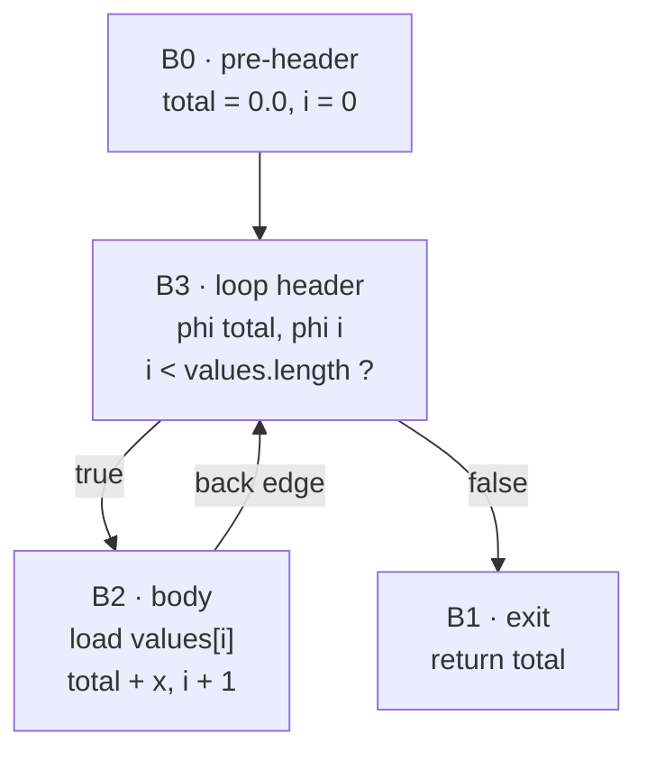

# 52. Emitting WebAssembly by hand   ⟨ J ⟩

There is no assembler in this chapter, and no library either. `package.json` lists six
runtime dependencies and none of them is `wabt`, `binaryen`, or anything else that knows
what a WebAssembly module is. The bytes are produced by 309 lines of TypeScript that push
numbers onto an array, and the first thing that array has to know is that WebAssembly
writes its integers seven bits at a time.

The second thing is harder. A control-flow graph has arbitrary edges: any block may jump to
any other block, and the graph the middle end handed over is full of them. WebAssembly has
no `goto`. It has `block`, `loop`, `if` and `br <depth>`, where the depth counts *outward*
through enclosing scopes and a branch can only ever leave a scope, never enter one. So the
last thing the encoder does before writing an instruction is rebuild the graph's edges as a
nesting of scopes — and where it cannot, it says so and the JIT falls back to a tier that
can.

`docs/example/stats.tera` cannot be the worked example here. Its `Series.mean` is the
counted loop this chapter is about, and the wasm backend refuses it outright:

```
[JIT] Compiling "mean": CFG built: 4 blocks, 6 frame states
[JIT] Compiling "mean": Wasm: graph not compilable: property access on this receiver
```

Four blocks were built and none of them was emitted, for a reason § what-is-refused
explains and which has nothing to do with the loop. The only function in `stats.tera` that
reaches wasm at all is `report`, at **419 bytes and one block** — which is genuinely useful,
because one block is the encoder's fast path and everything else in this chapter is what
happens when there is more than one. For the loop, the chapter uses `total_of` from
`docs/example/stats-deopt.tera`: the same counted loop in free-function form, called two
hundred times, and therefore actually compiled. It is a book listing, not a probe
([Conventions § 1](../CONVENTIONS.md)).

**What arrived.** From [Ch 51 § what-leaves](51-legalizing-for-a-target.md): one
`CFGFunction` legalized for `wasmTarget`. Every node in it is in `SUPPORTED_GRAPH_NODES` or
the backend is about to refuse the function; every value carries a `_rep` stamped by
`representation-selection`; and every `frameState` edge is still intact, because
`wasmTarget` has the `deopt` capability and `elideFrameStates` returned zero without
touching the graph.

## No toolchain

`src/optimizing/backends/wasm/wasm-format.ts` is the whole format layer. Five encoders, two
magic constants, five section ids, five type bytes, three import/export kind bytes, about
eighty opcode constants, and one class.

The class holds six fields and no logic:

```ts
export class WasmModuleBuilder {
  types: WasmType[];
  imports: WasmImport[];
  functions: number[];
  exports: WasmExport[];
  codes: WasmCode[];
  memoryImport: WasmMemoryImport | null;
```
— `src/optimizing/backends/wasm/wasm-format.ts:190-196`

`addType`, `addFuncImport`, `addMemoryImport`, `addFunction`, `addExport` and `setCode` each
push onto one of those arrays and return an index. `toBytes()` walks them in section order.
That is the entire module writer.

> **New idea. LEB128.** WebAssembly is a byte format, and it needs to store integers whose
> values are usually tiny and occasionally large. Spending four bytes on every one would
> waste most of a module; spending one would cap it. LEB128 — "Little-Endian Base 128" —
> encodes an integer seven bits at a time, low group first, setting the high bit of each
> byte to mean *another group follows*. A value under 128 is one byte; the encoding grows
> only when the value does.
>
> Unsigned is the easy half: take seven bits, shift, repeat while anything is left.
>
> ```ts
> export function encodeU32(n: number): number[] {
>   const bytes: number[] = [];
>   do {
>     let byte = n & 0x7f;
>     n >>>= 7;
>     if (n !== 0) byte |= 0x80;
>     bytes.push(byte);
>   } while (n !== 0);
>   return bytes;
> }
> ```
> — `src/optimizing/backends/wasm/wasm-format.ts:1-10`
>
> Signed is where the extra dance in `encodeS32` comes from. The last byte's *top payload
> bit* — `byte & 0x40` — is the sign bit of the whole number, because the decoder
> sign-extends from there. So the loop cannot stop when the shifted value reaches zero; it
> has to stop when the value reaches zero **and** the byte it just produced would decode as
> positive, or reaches −1 and the byte would decode as negative:
>
> ```ts
>     if ((n === 0 && !(byte & 0x40)) || (n === -1 && byte & 0x40)) {
> ```
> — `src/optimizing/backends/wasm/wasm-format.ts:19`
>
> The consequence is that the two encoders disagree about small numbers, which is not a bug
> but the reason there are two of them:
>
> ```
> value    encodeU32        encodeS32
> -------  ---------------  ---------------
>       0  0x00             0x00
>      63  0x3f             0x3f
>      64  0x40             0xc0 0x00
>     127  0x7f             0xff 0x00
>     128  0x80 0x01        0x80 0x01
>      -1  (unsigned only)  0x7f
>     -64  (unsigned only)  0x40
>     -65  (unsigned only)  0xbf 0x7f
> ```
>
> `64` costs one byte unsigned and two signed, because a lone `0x40` decodes as `−64`.
> Getting this wrong does not produce a wrong answer; it produces a module
> `new WebAssembly.Module` refuses, which is why the encoder is one of the few things here
> that can be checked by running anything at all.

The encoders are used for two different jobs and the choice between them is positional.
Every *index* in the module — a type index, a function index, a local index, a branch depth
— is `encodeU32`, because an index is never negative. Every *immediate operand* of an
`i32.const` is `encodeS32`, because a constant can be. `encodeF64` is not LEB at all: it
writes the eight raw IEEE-754 bytes through a `Float64Array`, little-endian by definition of
the format. `encodeString` is a `TextEncoder` result with a `encodeU32` length in front.

> **Unfinished.** `encodeS64` (`src/optimizing/backends/wasm/wasm-format.ts:29-43`) is the
> only encoder written through `BigInt` — `Number(BigInt(n) & 0x7fn)` on every seven-bit
> group, and `Number(BigInt(n) >> 7n)` to advance. `OP_I64_CONST` is emitted from three
> places and every one of them passes a value inside the double-safe range: `2147483647`,
> `-2147483648` and `0` (`codegen.ts:2338`, `:2341`, `:3294`, `:3304`, `:3315`). So the
> `BigInt` round-trip has never had to be right for a true 64-bit value, which is the only
> case it exists for. Cost to finish: pass and accept `bigint` rather than `number`, or
> delete the generality. **[unpinned]** — no test in `tests/` references `encodeS64`, or any
> of the other four encoders, by name.

## Five sections

> **New idea. A section.** A wasm module is not a stream of instructions. It is a sequence
> of *sections*, each one a numbered, length-prefixed blob with a fixed meaning: here are
> the function signatures, here is what I import, here is which signature each of my
> functions has, here is what I export, here are the bodies. The length prefix is what lets
> a decoder skip a section it does not care about, and the fixed numbering is what lets it
> know which is which. Sections must appear in increasing id order, and a section that has
> nothing in it is simply absent.

`toBytes()` is that rule as a straight-line function: magic, version, then five `if`s.

```ts
    if (this.types.length > 0) {
      const sec: number[] = [];
      sec.push(...encodeU32(this.types.length));
      for (const t of this.types) {
        sec.push(TYPE_FUNC);
        sec.push(...encodeU32(t.params.length), ...t.params);
        sec.push(...encodeU32(t.results.length), ...t.results);
      }
      out.push(SEC_TYPE, ...encodeU32(sec.length), ...sec);
    }
```
— `src/optimizing/backends/wasm/wasm-format.ts:241-250`

Each of the five follows that shape exactly: build the body into a local array, then push
the id, then the body's byte length, then the body. The module a compiled tera function
becomes is this:

```
offset  bytes                     what
------  ------------------------  ---------------------------------------------
0       00 61 73 6d               WASM_MAGIC  ("\0asm")
4       01 00 00 00               WASM_VERSION (1)
8       01 <len> <count> ...      SEC_TYPE      = 1   one 0x60 per signature
+       02 <len> <count> ...      SEC_IMPORT    = 2   env.deopt / runtimeStub /
                                                      allocObj / memory
+       03 <len> <count> ...      SEC_FUNCTION  = 3   one type index: this function
+       07 <len> <count> ...      SEC_EXPORT    = 7   the name "opt"
+       0a <len> <count> ...      SEC_CODE      = 10  locals, then body, then 0x0b
```

Five sections, ids 1, 2, 3, 7 and 10, in that order because those numbers are increasing.
And now the omission, which is the whole point of the next two sections: **there is no Data
section and no Memory section.** Id 5 (Memory) and id 11 (Data) do not appear in
`wasm-format.ts` at all. The module does not define its memory, it *imports* it —
`addMemoryImport("env", "memory")` — and there is no mechanism anywhere in this backend for
initialising a single byte of it before the function runs.

A wasm module that cannot write anything into its own memory cannot hold a string, an
object, a `null`, or a compiled function as a constant. Everything the code needs to know
about such a value must arrive some other way.

## Constants arrive as pointers

The other way is an integer, and the integer is an address in a region the JavaScript side
fills in.

`analyzeGraph` collects every constant whose value is not a number or a boolean into
`_nonPrimitiveConstants`, counts them, and hands the count to the memory layout. Then it
walks the list and stamps each node with an address:

```ts
    _nonPrimitiveConstants.forEach((constNode, index) => {
      constNode._constPtrIndex = slotAddress(memoryLayout.constPointers, index);
    });
```
— `src/optimizing/backends/wasm/codegen.ts:1516-1518`

`generateBody` then emits, at the very top of the function before any block is opened, one
two-instruction preamble per constant: push the address as an `i32.const`, store it in the
constant's local.

```ts
          bytes.push(
            wasmFormat.OP_I32_CONST,
            ...wasmFormat.encodeS32(synNode._constPtrIndex),
          );
          bytes.push(wasmFormat.OP_LOCAL_SET, ...wasmFormat.encodeU32(loc));
```
— `src/optimizing/backends/wasm/codegen.ts:1584-1588`

So what the compiled code holds for the string `" mean="` is the number `64`, or whatever
its slot address turned out to be. The *value* is put at that address by JavaScript, before
the call, in the wrapper's loop over `analysis._nonPrimitiveConstants`. **The wasm sees an
integer; the JavaScript knows what it means.** Every heap value in a JIT-compiled tera
function works this way, which is why [Ch 53 § objptrs-is-a-gc-root](53-the-boundary-is-the-wall.md)
is a chapter about a `Map` and not about a pointer.

Note that `CONST_POINTER_BYTES` is **64**, not 8. A constant slot is sixty-four bytes wide
where a global cell is eight, because the slot is not just a pointer — it is where a small
serialized value can live in place.

## The memory map

`wasmMemoryLayout(counts)` stacks three fixed regions upward from address 8 with no gaps and
calls whatever is left the arena:

```ts
export function wasmMemoryLayout(counts: WasmMemoryCounts): WasmMemoryLayout {
  const deoptSnapshot = region(
    DEOPT_SNAPSHOT_BASE,
    counts.deoptSnapshotSlots,
    DEOPT_SNAPSHOT_SLOT_BYTES,
  );
  const globalCells = region(deoptSnapshot.end, counts.globalCells, GLOBAL_CELL_BYTES);
  const constPointers = region(globalCells.end, counts.constPointers, CONST_POINTER_BYTES);
  return {
    deoptSnapshot,
    globalCells,
    constPointers,
    arenaBase: constPointers.end,
    initialPages: Math.max(1, Math.ceil(constPointers.end / WASM_PAGE_BYTES)),
  };
}
```
— `src/optimizing/backends/wasm/memory-layout.ts:45-60`

Each region is `{base, stride, count, end}` and each one's `base` is the previous one's
`end`, so the layout is completely determined by three counts. Here it is as a table, with
the concrete addresses for a function needing four snapshot slots, three global cells and
two constant pointers — the case
`[t: tests/optimizing/backends/wasm/memory-layout.test.ts > "stacks every region above the deopt snapshot without gaps"]`
builds:

```
offset  size       region            stride  written by            read by
------  ---------  ----------------  ------  --------------------  ------------------
0       4          arena top         -       wasm (bump) and JS    both
8       8 * n      deoptSnapshot     8       wasm f64.store        JS, on a bailout
  8-40    4 slots
40      8 * g      globalCells       8       JS on entry, wasm     both
  40-64   3 cells
64      64 * c     constPointers     64      JS wrapper only       wasm
  64-192  2 slots
192     ...        arena             -       JS copies objects in  both
```

`DEOPT_SNAPSHOT_BASE = 8` is why the first region starts at 8 rather than 0: address 0 is
the shared top-of-arena word that wasm's inline allocator and the JavaScript side bump
through the same four bytes ([Ch 53 § arena-and-capacity](53-the-boundary-is-the-wall.md)).
Nothing enforces that four-byte reservation; it is `DEOPT_SNAPSHOT_BASE`'s value and the
fact that nothing else is placed below it.

`slotAddress(area, index)` is the only way an address is computed, and it range-checks:

```ts
export function slotAddress(area: WasmMemoryRegion, index: number): number {
  if (index < 0 || index >= area.count) {
    throw new RangeError(
      `slot ${index} outside region [${area.base}, ${area.end}) of ${area.count} entries`,
    );
  }
  return area.base + index * area.stride;
}
```
— `src/optimizing/backends/wasm/memory-layout.ts:36-43`

That throw is what turns "region overrun" from a silent write into the next region's first
entry into a compile-time exception
`[t: tests/optimizing/backends/wasm/memory-layout.test.ts > "rejects a slot index past the end of its region instead of writing into the next one"]`.
The ceiling is `exceedsAddressSpace`, a single comparison of `initialPages` against
`WASM_MEMORY_MAX_PAGES = 256` — sixteen megabytes — checked once in `analyzeGraph`, which
records `fixed memory regions need N pages, over the 256-page budget` and declines the
function
`[t: … > "refuses a layout whose fixed regions overflow the maximum memory"]`.

> **Broken.** `WasmModuleBuilder.toBytes` writes the imported memory as
> `IMPORT_MEMORY, 0x00, ...encodeU32(1)` — flags byte `0` (no maximum) and a hard-coded
> minimum of **one page** — regardless of what `wasmMemoryLayout` computed
> (`src/optimizing/backends/wasm/wasm-format.ts:264`). A function whose fixed regions span
> three pages declares that it needs one. It works only because `WasmCodegen.compile`
> supplies the instance a `WebAssembly.Memory` whose `initial` *is*
> `analysis.memoryLayout.initialPages` (`codegen.ts:4094-4097`), so the declared minimum is
> satisfied by the host always over-supplying. The same module bytes instantiated against a
> one-page memory would validate, link, and fault on the first `constPointers` access with
> no diagnostic. Cost to fix: thread the layout into `WasmModuleBuilder` and write
> `encodeU32(layout.initialPages)`; `exceedsAddressSpace` already computes the number.

> **Unenforced.** Nothing checks that the memory `WasmCodegen.compile` creates and the
> memory `wasmMemoryLayout` describes agree. `exceedsAddressSpace`
> (`src/optimizing/backends/wasm/memory-layout.ts:66-68`) is a *ceiling* test —
> `initialPages > 256` — not an equality test against the declared import, and there is no
> third party that reads both. Cost to enforce: one assertion in `compile`, once the item
> above has made the two numbers the same number.

## Three imports

Everything a compiled function cannot do by itself is an import, and there are exactly four
— three functions and one memory. All are declared conditionally, from booleans
`analyzeGraph` set while walking the graph:

| import | type | declared when | what it is for |
| --- | --- | --- | --- |
| `env.deopt` | `(i32, i32) -> ()` | `needsDeoptImport` | leave, with a reason id and a frame-state id ([Ch 54 § the-signal]) |
| `env.runtimeStub` | `(i32, i32, f64 × 8) -> f64` | `needsRuntimeStubImport` | ask the interpreter to perform one node ([Ch 53 § runtime-stubs](53-the-boundary-is-the-wall.md)) |
| `env.allocObj` | `(i32) -> i32` | `needsAllocObjImport` | ask for an object of *n* slots ([Ch 53 § allocatetagged](53-the-boundary-is-the-wall.md)) |
| `env.memory` | memory | `needsMemory` | the linear memory itself |

Read the three function imports together and they say something the code never states:
**they are the three ways compiled code admits it cannot finish the job alone.** Bail out.
Ask the interpreter. Ask for memory it is not allowed to allocate. `total_of` needs all
four — its trace line says `Runtime stubs lowered: 6`, and `GenericGetIndex` on an untyped
parameter is why.

The import count is load-bearing arithmetic, not bookkeeping. Wasm gives imported functions
and defined functions one shared index space, imports first, so the index of *this* module's
one function is exactly the number of function imports that were declared:

```ts
    builder.addExport("opt", importFuncCount);
```
— `src/optimizing/backends/wasm/codegen.ts:4052`

`importFuncCount` is incremented once per `addFuncImport` and never per memory import,
because a memory import is not in the function index space. Get that wrong by one and the
module exports whichever import happens to sit at that index. The same number is reused for
self-recursion two lines later (`analysis.selfCallFuncIdx = importFuncCount`), which is a
function calling itself by naming its own index.

## Locals

`analyzeGraph`'s second job, after deciding each node's wasm type, is to give every value a
local. It is one counter:

```ts
    let nextLocal = graph.parameterCount;
    for (const id of localNodesI32) {
      nodeLocal.set(id, nextLocal++);
    }
    for (const id of localNodesF64) {
      nodeLocal.set(id, nextLocal++);
    }
```
— `src/optimizing/backends/wasm/codegen.ts:1318-1324`

Parameters occupy the first `graph.parameterCount` indices — wasm makes a function's
parameters its first locals — then the i32-typed values, then the f64-typed ones, then four
kinds of scratch, in a fixed order: `overflowTempLocal` (one i64, only when some node needs
an overflow check), `toInt32ScratchLocal` (one f64, **always**), `_allocTempLocal` (one i32,
only when the function allocates inline), and one `phiUpdateTempLocal` per phi, i32s first
then f64s. `additionalLocals` then re-states all of that as runs of `{count, type}`, which is
the form the Code section wants, and the grouping is why the two type passes have to happen
in that order rather than interleaved.

Not every node gets an index. A pass-through node — a check that narrows a type without
changing a value — is given an *alias* to its input instead:

```ts
        if (node.type === ir.IR_CHECK_SMI || node.type === ir.IR_CHECK_NUMBER) {
          const inputType = nodeWasmType.get(node.inputs[0]?.id);
          nodeWasmType.set(node.id, inputType || wasmFormat.TYPE_I32);
          if (node.inputs[0]) localAlias.set(node.id, node.inputs[0].id);
          entryGuards.push(node);
```
— `src/optimizing/backends/wasm/codegen.ts:1111-1115`

`CheckMap`, `CheckArray`, `CheckElementsKind` and `CheckBounds` get the same treatment
(`:1116-1128`), and `resolveNodeLocal` (`:191-195`) follows the alias chain recursively. So a
guard costs a test, and it does not cost a copy.

> **New idea. Register allocation is not needed here.** A machine has a fixed, small number
> of registers, so deciding which value lives in which one — and what to do when there are
> more values than registers — is a real optimization problem
> ([Ch 66 § the-scan](../part-10-bytes/66-linear-scan-register-allocation.md)). WebAssembly
> has no such limit: a function may declare as many locals as it likes, and the engine that
> runs the module solves the register problem itself. So the code above is *naming*, not
> allocating. There is no spilling, no live-range analysis, no interference graph and no
> choice to get wrong. It is worth noticing how much of a compiler backend disappears when
> the target is a virtual machine that has its own backend.

One small unpaid cost falls out of that freedom: `toInt32ScratchLocal` is allocated and
declared on **every** function (`codegen.ts:1348-1349`, `:1409`), whether or not any
conversion is emitted, because it is cheaper to always have it than to discover after the
body is written that it was needed. `report`'s 419 bytes include one f64 local nothing ever
touches.

## No goto

Here is the central problem, stated plainly.

A control-flow graph has arbitrary edges. `total_of` from `docs/example/stats-deopt.tera` is
the smallest interesting case:

```
fn total_of(values) -> float:
  total = 0.0
  i = 0
  while i < values.length:
    total += values[i]
    i += 1
  return total
```
— `docs/example/stats-deopt.tera:1-7`

which the optimizer builds as four blocks:



Four blocks, four edges, one of them a cycle. WebAssembly can express none of that
directly.

> **New idea. Structured control flow.** WebAssembly has no jump-to-a-label instruction. It
> has three scope-opening instructions — `block`, `loop` and `if` — each closed by an `end`,
> and one branch instruction, `br <depth>`, plus its conditional form `br_if <depth>`. The
> depth is not an address. It counts *outward* through the scopes currently enclosing the
> branch: `br 0` targets the innermost, `br 1` the one outside that, and so on.
>
> What the branch *does* depends on which kind of scope it targets:
>
> - `br` to a **`block`** label jumps to that block's **end** — forward, out of the scope.
> - `br` to a **`loop`** label jumps to that loop's **start** — backward, to the top.
>
> Those are the only two motions available. A branch can leave a scope; it can never enter
> one. So an edge is expressible only if its target is either the top of a loop the branch
> is already inside, or the end of a block the branch is already inside. Every edge in the
> graph has to be made to look like one of those two, by choosing where the scopes open.

For `total_of` the answer that works is a `block` wrapped around a `loop`: the loop's start
is the header B3, so the back edge from B2 becomes `br` to the loop; the block's end is where
B1 begins, so the exit edge from B3 becomes a branch out of the block. Every edge is now
either "top of an enclosing loop" or "end of an enclosing block", and the graph is
expressible.

## Order and labels

Two mechanisms produce that nesting. The first decides what order blocks are emitted in.

```ts
export function computeBlockOrder(graph: AnyGraph) {
  const visited = new Set<number>();
  const order: AnyBlock[] = [];

  function dfs(block: AnyBlock) {
    if (visited.has(block.id)) return;
    visited.add(block.id);
    for (const succ of block.successors) {
      if (!visited.has(succ.id)) {
        dfs(succ);
      }
    }
    order.push(block);
  }
```
— `src/optimizing/backends/wasm/graph-support.ts:650-663`

A block is pushed *after* all of its successors — that is a post-order depth-first search —
and then `order.reverse()` at the end, plus a sweep over `graph.blocks` first to catch
anything unreachable from the entry.

> **New idea. Reverse postorder.** Walk the graph depth-first and record each block when you
> *finish* it rather than when you reach it; then reverse the list. The result has one
> property that a linear code emitter needs and no cheaper order guarantees: **every block
> appears after at least one of its predecessors, except a loop header.** Forward edges
> therefore always point forwards in the emitted text, and the only edges that point
> backwards are the ones that are genuinely loops. It is the same order the middle end's
> `DominanceInfo` computes and hands out through `reversePostorder()`
> ([Ch 42 § dominance](../part-07-optimization/42-the-analyses-everything-stands-on.md)),
> for a related reason — you want to have seen where a value came from before you reach
> where it is used.

For `total_of` the DFS visits B0, then B3, then B3's first successor B2 (which loops back to
the already-visited B3 and finishes), then B1. The post-order is `[B2, B1, B3, B0]` and the
reverse is `[B0, B3, B1, B2]`. Notice that the exit block B1 comes *before* the body B2 —
which is fine, because the loop-emitting code does not walk `order` blindly.

The second mechanism is the label stack. `labelStack: StructuredLabel[]` is pushed as a
scope opens and popped as it closes, each entry `{type, targetId}` recording what kind of
scope it is and which block it stands for. Converting a target block into a branch depth is
twelve lines:

```ts
export function findLabelDepth(
  labelStack: readonly StructuredLabel[],
  type: string,
  targetId: number | null,
): number {
  for (let i = labelStack.length - 1; i >= 0; i--) {
    if (labelStack[i].type === type && labelStack[i].targetId === targetId) {
      return labelStack.length - 1 - i;
    }
  }
  return -1;
}
```
— `src/optimizing/backends/wasm/structured-control-flow.ts:11-22`

It walks the stack **backwards** — from the innermost scope outwards — and returns
`labelStack.length - 1 - i`, which converts an array index into a wasm branch depth. That
direction is the whole content of the function, and it is what makes a repeated target
resolve to the nearest enclosing one
`[t: tests/optimizing/backends/wasm/structured-control-flow.test.ts > "matches the innermost label when a target repeats"]`.
The count itself is
`[t: … > "counts depth from the innermost label outwards"]`, and the missing case is
`[t: … > "reports a missing label rather than guessing a depth"]` — it returns `-1`, and
every caller in `generateBody` treats `-1` as a reason to stop rather than as a depth.

## Loop versus block

`emitRegion` is what opens scopes, and it has exactly two shapes.

For a block that is not a loop header, it emits the block's nodes and nothing else. For a
loop header, it does five things in order: copy each phi's first incoming value into the
phi's local (the loop's initial values); open one `block` per exit block, outermost exit
first, pushing a `"block"` label for each; open one `loop`, pushing a `"loop"` label for the
header; emit the header's nodes and then every remaining block belonging to the loop; and
then close the loop and each exit block in turn, emitting each exit block's own region as its
scope ends.

```ts
        for (let k = exitBlockIds.length - 1; k >= 0; k--) {
          labelStack.push({ type: "block", targetId: exitBlockIds[k] });
          bytes.push(wasmFormat.OP_BLOCK, wasmFormat.TYPE_VOID);
        }

        labelStack.push({ type: "loop", targetId: block.id });
        bytes.push(wasmFormat.OP_LOOP, wasmFormat.TYPE_VOID);
```
— `src/optimizing/backends/wasm/codegen.ts:2102-2108`

`loopInfoMap` is what tells it where to close: built from `forest.loops()`
([Ch 42 § loops](../part-07-optimization/42-the-analyses-everything-stands-on.md)), one
entry per loop header carrying `loopBlocks` and `exitBlockIds`, and the exits are **sorted by
`orderIndex`** so that the scopes nest in emission order rather than in whatever order the
loop forest happened to list them.

Inside a block, `emitBlockNodes` resolves each terminator in a fixed sequence of attempts. For
a `Jump`:

```ts
          if (loopHeaders.has(targetId)) {
            const loopLabelIdx = findLabelDepth(
              labelStack,
              "loop",
              targetId,
            );
            if (loopLabelIdx >= 0) {
              emitPhiUpdates(targetId, block);
              bytes.push(
                wasmFormat.OP_BR,
                ...wasmFormat.encodeU32(loopLabelIdx),
              );
              return;
            }
          }
```
— `src/optimizing/backends/wasm/codegen.ts:1738-1752`

First: is the target a loop header with a `"loop"` label on the stack? Then this is a back
edge — update the phis and `br` to that depth. Otherwise: is there a `"block"` label for it?
Then this is a forward edge out of a scope. Otherwise: has the target not been emitted yet?
Then emit it inline, right here. Otherwise `failEmit`, and the whole function is declined.

Reading that sequence, `total_of`'s body comes out as this shape — derived from the emitter,
since there is no disassembler in this tree, and validated by the fact that
`new WebAssembly.Module` accepted the 1159 bytes it produced:

```
<B0: constants into locals; phi initial values>
block                     ;; label for the exit block B1
  loop                    ;; label for the header B3
    <B3: values.length, i < length>
    block                 ;; anonymous, one-shot
      local.get $cond
      br_if 0             ;; condition true: stay in the loop
      <phi updates for B1>
      br 2                ;; condition false: leave to B1's label
    end
    <B2: values[i], total + x, i + 1>
    <phi updates for B3>
    br 0                  ;; the back edge
  end
end
<B1: return total>
unreachable
```

The anonymous inner `block` is how a two-way `Branch` becomes a one-way `br_if`: it is opened
with `targetId: null`, used once to skip the exit path, and popped immediately
(`codegen.ts:1885-1912`). And the trailing `unreachable` is emitted unconditionally when
`order.length > 1` (`:2143`) — every path out of the nest has already returned, so the
instruction is never executed; it is there because wasm requires a function body to be
type-correct at its end and `unreachable` is the byte that satisfies any expectation.

The single-block case skips all of it:

```ts
    if (order.length === 1) {
      const block = order[0];
      for (const node of block.nodes) {
        this.emitNode(
```
— `src/optimizing/backends/wasm/codegen.ts:1625-1628`

No scopes, no labels, no merge resolver, no phi updates. That is the path `report` takes in
`stats.tera` — `CFG built: 1 blocks, 2 frame states`, then `Wasm module compiled: 419 bytes,
1 blocks` — and it is why the only function in the running example that reaches wasm is also
the one that exercises none of this chapter's control-flow machinery.

## Finding the merge

A `Branch` whose two arms rejoin needs a scope that *contains* the join, and the emitter has
to know where the join is before it can open one. `buildMergeResolver(order, orderIndex)`
answers `find(trueBlockId, falseBlockId)`.

The construction has four steps. Reverse the CFG — walk every block's `predecessors` list
and record it as a successor edge, so the arrows point from exits back towards the entry. Add
a synthetic node at index `blockCount` with an edge to every block that has no successors, so
that a graph with several returns still has one end. Run Lengauer–Tarjan from that synthetic
node, producing an immediate-dominator array *of the reversed graph*. Then the merge of two
arms is their lowest common ancestor in that tree.

> **New idea. A post-dominator.** [Ch 42 § dominance](../part-07-optimization/42-the-analyses-everything-stands-on.md)
> established dominance: *A* dominates *B* when every path from the entry to *B* goes through
> *A* — "you cannot get here without having been there". A **post-dominator** is the mirror
> image: *A* post-dominates *B* when every path from *B* to the end goes through *A* — "you
> cannot leave from here without going through there". It is not a new algorithm. Reverse
> every edge in the graph, add a single exit node so the reversed graph has one entry, and
> run the ordinary dominator algorithm; what comes out is the post-dominator tree.
>
> It is exactly the question a branch asks. "Where do my two arms rejoin" is "what is the
> nearest thing both arms must pass through on the way out", and the nearest common
> post-dominator is that thing by definition.

`computePostDominators` is file-local and is a textbook Lengauer–Tarjan: `semi`, `vertex`,
`parent`, `ancestor`, `label`, `bucket`, with `compress`/`evalNode` for the path-compressed
union-find and a final pass that resolves the deferred immediate dominators
(`structured-control-flow.ts:113-183`). It is the only place in the wasm backend with an
algorithm in it.

What makes the answer *usable* rather than merely correct is the four lines after the lookup:

```ts
      if (
        mergeBlockId === trueBlockId ||
        mergeBlockId === falseBlockId ||
        mergeIndex <= minMergeIndex
      ) {
        return null;
      }
```
— `src/optimizing/backends/wasm/structured-control-flow.ts:100-106`

Three refusals, and each one is a shape that is a real merge and still cannot be given a
scope. The merge may not be one of the arms itself — a triangle where one side falls straight
into the other has no scope that contains both and nothing else
`[t: tests/optimizing/backends/wasm/structured-control-flow.test.ts > "refuses a merge that is one of the arms itself"]`.
It may not be the synthetic exit, which is checked earlier at `:92` and means the arms never
rejoin inside the function at all
`[t: … > "refuses arms that never rejoin"]`. And it must sit *later in emission order* than
both arms, because a scope that closes before one of its arms has been emitted is not a
scope. Blocks outside the emitted order answer `null` rather than a wrong number
`[t: … > "reports nothing for blocks outside the emitted order"]`, and the ordinary case is
`[t: … > "finds the join point of a diamond"]`.

A refusal here is not a failure. It means `find` returned `null`, the branch could not be
given a merge scope, and `generateBody` will `failEmit` and hand the function back to the
tier below.

## Parallel copy

A phi is not an instruction. It is an assignment that happens *on an edge*: "when control
arrives here from that predecessor, this value is the one that predecessor computed"
([Ch 38 § canonical-phi-ssa](../part-06-ssa/38-a-control-flow-graph-not-a-sea.md)). Wasm has
no edges to hang anything on, so the assignment has to be emitted as real instructions, in
the predecessor, immediately before the branch.

`emitPhiUpdates(targetBlockId, predecessor)` finds the predecessor's index in
`targetBlock.predecessors`, collects one `pending` entry per phi in the target — phi local,
temp local, input local, and both wasm types — and then emits **two loops over the same
list**. The first reads every input into that phi's temp; the second writes every temp into
that phi's local (`codegen.ts:1686-1712`).

> **New idea. A parallel copy.** The phis at the top of a block all take effect *at once*, on
> the edge. `a, b = b, a` written as two sequential assignments is wrong: `a = b` destroys
> the `a` that `b = a` needed. In a loop this is not a contrived case at all — a rotation of
> loop variables produces exactly it. The general fix is to find the cycles in the copy
> graph and break each one with a single temporary. The fix here is blunter and total:
> **give every phi its own temporary, always.** Read all the sources first, write all the
> destinations second, and no write can ever destroy a source, because every source was
> already read. It costs one extra local and two extra instructions per phi in the cases
> where a cycle-aware algorithm would have needed neither. It cannot be wrong.

Folded into the first loop is a representation fix-up, because a phi's wasm type and an
incoming value's wasm type need not agree:

```ts
        if (
          update.phiType === wasmFormat.TYPE_F64 &&
          update.inputType === wasmFormat.TYPE_I32
        ) {
          bytes.push(wasmFormat.OP_F64_CONVERT_I32_S);
        } else if (
          update.phiType === wasmFormat.TYPE_I32 &&
          update.inputType === wasmFormat.TYPE_F64
        ) {
          this.emitToInt32FromF64(bytes, analysis);
        }
```
— `src/optimizing/backends/wasm/codegen.ts:1695-1705`

Widening an i32 to an f64 is one instruction. Narrowing an f64 to an i32 is thirty, and it is
the subject of the last section. That asymmetry is the entire difference between the two
directions of a numeric tower, and it appears here, in a phi update, because a loop carrying
a value that started as an integer and became a double is the ordinary case rather than the
exotic one.

## What is refused

*(Why the obvious design fails.)*

The obvious design for "a CFG has arbitrary edges and wasm does not" is a **relooper**: an
algorithm that takes any reducible graph, duplicating blocks and introducing dispatch
variables where it must, and produces structured control flow for all of it. Emscripten has
one. It is a real algorithm, it is well documented, and it always succeeds.

This backend does not have one. It has a merge resolver that answers `null`, a label lookup
that answers `-1`, and a `failEmit` that throws the whole function away. And the reason that
is a defensible design rather than an unfinished one is that **a code generator is allowed
to have a domain, as long as saying "no" is cheap and total.** The JIT has a tier underneath
it. A refused function is not a failed compilation; it is a function that keeps running in
the baseline compiler while the twenty next to it get faster. What would be unacceptable is
a refusal that is expensive to discover, or one that is *wrong* — a graph accepted and then
emitted incorrectly.

So the refusals are all up front, in one function, before a single byte is written.
`WasmCodegen.compileRejection` (`codegen.ts:417-506`) walks every block and every node once
and returns a `CompileRejection` or `null`. Two of its refusals are about shape:

```ts
      const preds = block.predecessors || [];
      if (preds.length > 2) {
        for (const pred of preds) {
          const last = pred.nodes[pred.nodes.length - 1];
          if (last && last.type === ir.IR_BRANCH) {
            return unsupported("short-circuit edge into multi-way merge");
          }
        }
      }
```
— `src/optimizing/backends/wasm/codegen.ts:496-504`

A block with more than two predecessors, at least one of which ends in a `Branch`, is
refused — `a && b || c` produces exactly that, and `buildMergeResolver`'s two-argument `find`
has no way to describe a three-way join. And `forest.irreducible` is refused with
`unsupported("irreducible control flow")` (`:507-509`), because a loop with two entries has
no single `loop` scope it could be
([Ch 42 § irreducible-control-flow-and-who-reads-it](../part-07-optimization/42-the-analyses-everything-stands-on.md)).

The rest of `compileRejection` is the same move applied to nodes rather than to edges, and it
is where the three `RejectionKind`s earn their separation
([Ch 51 § refusal-is-an-outcome](51-legalizing-for-a-target.md)):

- `malformed` — the graph is *wrong*, and this is a compiler bug: no `Return` anywhere
  `[t: tests/optimizing/backends/wasm/rejection.test.ts > "reports a missing return as a malformed graph, not an unsupported one"]`,
  an input count that disagrees with `FIXED_INPUT_COUNTS`
  `[t: … > "reports a wrong input count as malformed"]`, an empty input slot, a negative
  field offset, an inconsistent polymorphic map table.
- `unsupported` — the graph is fine and this backend does not do that: an opcode outside
  `SUPPORTED_GRAPH_NODES`
  `[t: … > "reports an opcode the backend cannot emit as unsupported"]`, a closure constant
  carrying upvalues, a phi whose incoming values disagree about ABI representation.
- `speculation` — the graph is fine and the *guess* it encodes is one this backend cannot
  honour: a receiver that is guarded monomorphically in one place and polymorphically in
  another with a map the mono site never saw, or a numeric return boxed into a handle on a
  path a hot block dominates
  `[t: … > "separates a supported-but-unprofitable shape from a malformed one"]`.

And then there is the one that decides the running example. `READS_A_RECEIVER` is five
opcodes and `holdsTheReceiver` is one line:

```ts
function holdsTheReceiver(value: ir.CFGInstruction | undefined): boolean {
  return value?.type === ir.IR_CONSTANT && value.props.isThis === true;
}
```
— `src/optimizing/backends/wasm/codegen.ts:108-110`

A `GenericGetProp` whose object is the constant `this` is refused with
`property access on this receiver`; a `Return` of that same constant is refused with
`handing back this receiver`
`[t: … > "declines a function whose answer is the receiver"]`. `Series.mean` is
`this.values.length` and `this.values[i]`, so it is refused twice over on its first two
nodes — and `Series.label`, which is `this.name + …`, with it. The companion test
`[t: … > "keeps compiling a function that only mentions the receiver"]` is what keeps the
rule from being a blanket ban on methods: mentioning `this` is fine, reading through it is
not.

> **Unenforced.** Both `computeBlockOrder`'s `dfs`
> (`src/optimizing/backends/wasm/graph-support.ts:654-663`) and
> `computePostDominators`' `dfs` and `compress`
> (`src/optimizing/backends/wasm/structured-control-flow.ts:127-146`), plus `depthOf`
> (`:53-62`), are recursive over graph structure with nothing bounding the recursion against
> the host's JavaScript stack. A graph deeper than that stack throws a `RangeError` out of
> `analyzeGraph` rather than producing a `CompileRejection`, so it is not a refusal, it is an
> exception escaping a component whose contract is that it answers with one.
> `MAX_WASM_CALL_DEPTH = 1000` (`codegen.ts:183`) sounds like the guard for this and is not:
> it bounds wasm *activation* nesting at run time (`codegen.ts:4715`), a different quantity
> entirely. Cost to fix: an explicit stack in the two searches, or a depth counter that
> returns a rejection. **[unpinned]**

> **Never runs.** `OP_SELECT` (`wasm-format.ts:87`), `OP_NOP` (`:76`), `OP_I64_LOAD`
> (`:92`), `OP_I64_STORE` (`:95`) and `OP_F64_NEAREST` (`:154`) are exported and referenced
> nowhere in `src/`, `tests/` or `tools/`. Four of them are simply table completeness — the
> opcode list was written from the spec, not from what `emitNode` happened to need. The
> fifth is not: `OP_SELECT`'s absence is a functional hole that costs `Math.sign` its ability
> to be compiled at all, and [Ch 51 § neither-fires-on-wasm](51-legalizing-for-a-target.md)
> is where that is priced.

> **Unpinned.** `compileRejection` returns `unsupported("irreducible control flow")` on
> `forest.irreducible` (`codegen.ts:507-509`) and `generateBody` calls `failEmit` on the
> identical condition twenty lines into itself (`:1616-1619`), but no test in
> `tests/optimizing/backends/wasm/rejection.test.ts` constructs an irreducible graph — and
> tera's own front end cannot produce one, since the language has no `goto`
> ([Ch 42 § irreducible-control-flow-and-who-reads-it](../part-07-optimization/42-the-analyses-everything-stands-on.md)).
> The two checks are insurance against a *pass* creating one. **[unpinned]**

## `toInteger`

The last section is one function, and it is the chapter's argument in miniature.

WebAssembly has an instruction for converting a double to a 32-bit integer:
`i32.trunc_f64_s`, opcode `0xaa`, declared in the table as `OP_I32_TRUNC_F64_S`. The encoder
never emits it. Instead, `emitToInt32FromF64` pushes about thirty instructions
(`codegen.ts:2512-2554`), and reading them in order is reading a specification:

1. `local.tee` the value into `toInt32ScratchLocal`, then `drop` — a way to save the operand
   off the stack without consuming the expression that produced it.
2. Test `x == x`. A NaN is the only value for which that is false.
3. Test `|x| != Infinity`.
4. `i32.and` the two, and open an `if` with an `i32` result. On the false arm — NaN or
   infinite — push `0` and stop. That is the answer JavaScript's `ToInt32` gives for both.
5. On the true arm, test `|x| >= 2^63` (`INT64_TRUNC_LIMIT`, `codegen.ts:185`). If so, reduce
   the value modulo 2^32 by hand, in doubles: `trunc`, divide by `2^32`, `trunc` again,
   multiply back by `2^32`, subtract. After that the value is inside i64 range.
6. `i64.trunc_sat_f64_s` — the *saturating* conversion, reached through the `0xfc` misc
   prefix — then `i32.wrap_i64`.

Step 5 exists to make step 6 correct, and step 6 exists because of the instruction that was
not used. `i32.trunc_f64_s` **traps** on NaN, on an infinity, and on anything outside i32
range. A trap inside JIT-compiled wasm is a `RuntimeError` thrown out of the instance; there
is no frame state at the trap site, nothing to reconstruct an interpreter frame from, and no
way to resume. It would turn a value the language has a defined answer for into an
unrecoverable failure of the whole call.

So the encoder pays thirty instructions to guarantee an answer — the same answer the
interpreter gives, which is the only thing that matters
([Ch 83 § the-answer-first]). The saturating conversion is used precisely because it *cannot* trap,
and the modular reduction in step 5 is there because saturating is not the same as wrapping:
without it a value above 2^63 would come back as `i64::MAX` rather than as its low 32 bits.

Now contrast `emitCheckedInt64FromF64` (`codegen.ts:2556-2600`), which faces the same
question in a place where a different answer is available. It performs the same range test —
`trunc(x) == x`, `x <= 2147483647`, `x >= -2147483648` — and when the test fails it does not
compute anything:

```ts
    bytes.push(wasmFormat.OP_I32_EQZ);
    bytes.push(wasmFormat.OP_IF, wasmFormat.TYPE_VOID);
    this.emitDeoptSnapshot(frameState, analysis, bytes);
    bytes.push(
      wasmFormat.OP_I32_CONST,
      ...wasmFormat.encodeS32(deoptReasonId(DEOPT_OVERFLOW)),
    );
    bytes.push(wasmFormat.OP_I32_CONST, ...wasmFormat.encodeS32(fsId));
    bytes.push(wasmFormat.OP_CALL, ...wasmFormat.encodeU32(deoptImportIdx));
    bytes.push(wasmFormat.OP_UNREACHABLE);
```
— `src/optimizing/backends/wasm/codegen.ts:2578-2587`

It writes the frame-state snapshot into linear memory, calls `env.deopt` with a reason and a
frame-state id, and then `unreachable`, because control does not come back. That is the
`deopt` capability of [Ch 51 § capabilities-decide-which-passes-exist](51-legalizing-for-a-target.md)
spent, and it is [Ch 54](54-deoptimizing-out-of-wasm-and-when-the.md)'s entire subject.

Two conversions, two answers to the same problem, and neither of them is the one-instruction
version. The rule they share is the one worth carrying forward: **a wrong-but-total answer
is a silent miscompile; a slow-but-total answer is a design.** Where the compiler can leave —
because a frame state is standing behind it — leaving is cheaper than being total. Where it
cannot, it pays.

## What leaves

A `Uint8Array` of wasm module bytes: magic, version, and up to five length-prefixed sections
whose contents are entirely determined by what `analyzeGraph` found. `total_of` is 1159 bytes
across 4 blocks; `report` is 419 bytes across 1. The bytes are handed to
`new WebAssembly.Module` — which is where a mistake in any of this chapter's encodings
surfaces, as a validation error the compiler turns into `Wasm validation failed: <message>`
and a decline — and then to `new WebAssembly.Instance`, whose single export is a function
named `opt`.

The bytes do not leave alone. Everything the wrapper needs to *call* that function travels
beside them, in the `analyzeGraph` result: `nodeValueRep`, which says what representation
each value has; `runtimeStubTable`, which says which nodes could not be compiled at all;
`globalCellOffsets` and `memoryLayout`, which say where things are in linear memory; and
three booleans the wrapper reads on every single call — `needsMemory`, `mutatesHeapObjects`
and `hasInlineAlloc`.

That is the handover to [Ch 53 § two-heaps](53-the-boundary-is-the-wall.md), which is about
what the module *cannot* do and what has to happen either side of the call because of it:
the module imports its memory, cannot initialise a byte of it, holds every heap value as an
integer, and asks `env.runtimeStub` whenever it meets a node the backend had no case for.
Chapter 53 is the price of all four.

## Verify it yourself

```bash
# the four blocks the chapter rebuilds as nested scopes
node dist/cli.js --print-ir --filter total_of --opt-threshold 1 docs/example/stats-deopt.tera

# 1159 bytes, 4 blocks, 6 runtime stubs — the module this chapter produces
node dist/cli.js --trace --opt-threshold 1 --baseline-threshold 1 docs/example/stats-deopt.tera 2>&1 \
  | grep -i "wasm\|CFG built\|stub"

# the running example: report is 419 bytes and one block; mean and label are refused
node dist/cli.js --trace --opt-threshold 1 --baseline-threshold 1 docs/example/stats.tera 2>&1 \
  | grep -i "wasm\|receiver"

# label depths, and the three merges the resolver refuses
npx vitest run --project unit tests/optimizing/backends/wasm/structured-control-flow.test.ts

# the memory map, and the classification of every refusal
npx vitest run --project unit tests/optimizing/backends/wasm/memory-layout.test.ts \
  tests/optimizing/backends/wasm/rejection.test.ts tests/optimizing/backends/wasm/result-abi.test.ts

# no toolchain: nothing in the dependency list knows what a wasm module is
node -e "console.log(Object.keys(require('./package.json').dependencies).join(' '))"

# the two LEB128 encoders disagree about 64, which is why there are two of them
node -e "
function u32(n){const b=[];do{let x=n&0x7f;n>>>=7;if(n!==0)x|=0x80;b.push(x);}while(n!==0);return b;}
function s32(n){n|=0;const b=[];let m=true;while(m){let x=n&0x7f;n>>=7;if((n===0&&!(x&0x40))||(n===-1&&x&0x40))m=false;else x|=0x80;b.push(x);}return b;}
for (const n of [63,64,127,128]) console.log(n, u32(n), s32(n));"
```

The last command prints `64 [ 64 ] [ 192, 0 ]`: one byte unsigned, two bytes signed.

## Tests that pin this

- `tests/optimizing/backends/wasm/structured-control-flow.test.ts` > `"counts depth from the innermost label outwards"` — `labelStack.length - 1 - i` is a branch depth.
- `tests/optimizing/backends/wasm/structured-control-flow.test.ts` > `"reports a missing label rather than guessing a depth"` — `-1`, which every caller treats as a reason to decline.
- `tests/optimizing/backends/wasm/structured-control-flow.test.ts` > `"matches the innermost label when a target repeats"` — why the scan runs backwards.
- `tests/optimizing/backends/wasm/structured-control-flow.test.ts` > `"finds the join point of a diamond"` — the post-dominator LCA, ordinary case.
- `tests/optimizing/backends/wasm/structured-control-flow.test.ts` > `"refuses a merge that is one of the arms itself"` — a correct answer that cannot be given a scope.
- `tests/optimizing/backends/wasm/structured-control-flow.test.ts` > `"refuses arms that never rejoin"` — the synthetic exit is not a merge.
- `tests/optimizing/backends/wasm/structured-control-flow.test.ts` > `"reports nothing for blocks outside the emitted order"` — `null`, not a wrong index.
- `tests/optimizing/backends/wasm/memory-layout.test.ts` > `"stacks every region above the deopt snapshot without gaps"` — each region's base is the previous one's end.
- `tests/optimizing/backends/wasm/memory-layout.test.ts` > `"keeps the arena clear of the fixed regions no matter how many entries they hold"` — the arena starts where the fixed regions stop, at any size.
- `tests/optimizing/backends/wasm/memory-layout.test.ts` > `"reserves enough initial pages to hold the fixed regions"` — `initialPages` is a ceiling division, not a guess.
- `tests/optimizing/backends/wasm/memory-layout.test.ts` > `"always reserves at least one page for an empty program"` — the `Math.max(1, …)`.
- `tests/optimizing/backends/wasm/memory-layout.test.ts` > `"refuses a layout whose fixed regions overflow the maximum memory"` — `exceedsAddressSpace`, the 256-page ceiling.
- `tests/optimizing/backends/wasm/memory-layout.test.ts` > `"addresses each slot inside its own region"` — `slotAddress` arithmetic.
- `tests/optimizing/backends/wasm/memory-layout.test.ts` > `"rejects a slot index past the end of its region instead of writing into the next one"` — the `RangeError` that makes an overrun a compile error.
- `tests/optimizing/backends/wasm/memory-layout.test.ts` > `"grows by whole pages covering the shortfall"` — `pagesToGrow`.
- `tests/optimizing/backends/wasm/rejection.test.ts` > `"accepts a graph the backend can lower"` — the control: `compileRejection` returns `null`.
- `tests/optimizing/backends/wasm/rejection.test.ts` > `"reports a missing return as a malformed graph, not an unsupported one"` — the kinds are audiences, not severities.
- `tests/optimizing/backends/wasm/rejection.test.ts` > `"reports a wrong input count as malformed"` — `FIXED_INPUT_COUNTS`.
- `tests/optimizing/backends/wasm/rejection.test.ts` > `"reports an opcode the backend cannot emit as unsupported"` — `SUPPORTED_GRAPH_NODES`.
- `tests/optimizing/backends/wasm/rejection.test.ts` > `"separates a supported-but-unprofitable shape from a malformed one"` — the `speculation` kind.
- `tests/optimizing/backends/wasm/rejection.test.ts` > `"keeps a regex node supported so the classification is not a catch-all"` — the refusal set is a list, not a default.
- `tests/optimizing/backends/wasm/rejection.test.ts` > `"declines a function whose answer is the receiver"` — `holdsTheReceiver` on a `Return`.
- `tests/optimizing/backends/wasm/rejection.test.ts` > `"keeps compiling a function that only mentions the receiver"` — the rule is about reading through `this`, not about naming it.
- `tests/optimizing/backends/wasm/result-abi.test.ts` > `"answers a raw number when the return is a raw number, whatever the graph declares"` — the result type is read off the returns, not off the signature.
- `tests/optimizing/backends/wasm/result-abi.test.ts` > `"answers a handle when the return really is one"` — the other half.
- `tests/optimizing/pipeline-order.test.ts` > `"gives every surviving node a representation once wasm lowering finishes"` — the precondition `analyzeGraph` relies on, established in [Ch 51](51-legalizing-for-a-target.md).
- `encodeU32`, `encodeS32`, `encodeS64`, `encodeF64` and `encodeString` — **[unpinned]**. No test under `tests/` names any of the five. They are covered only transitively, by whole-module instantiation in the e2e suites, which means a bug that still produces a *valid* module would not be caught.
- Irreducible control flow — **[unpinned]**. Two independent checks, no test that builds an irreducible graph.
