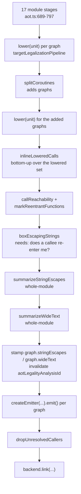

# 55. The same graph, with no way out   ⟨ J · N ⟩

There is no second compiler. The ahead-of-time road out of the middle end is not a
parallel implementation that happens to share a few utilities with the JIT — it is the
*same method on the same class*, reached by a different public entry point, with one
options object built differently. `Optimizer.build` takes a `FeedbackVector | null`.
`compile()` refuses to pass `null`. `compileStatic()` passes `null` deliberately. Every
line after that is shared.

What separates the two roads is three fields wide, and reading it is this chapter's whole
method. `staticCompilerOptions` returns `{ ...base, sinkAllocations: false,
deoptimizes: false }`. Turning `sinkAllocations` off deletes a pass. Turning `deoptimizes`
off does something that reads backwards the first time you see it: it turns **loop
unswitching on**. And then, further downstream, a second and entirely separate switch — the
target's own capability set — throws away every frame state and every guard, and refuses
the graph if any survived. That is the no-way-out the chapter title names: not a mode, not
a flag on a code generator, but the absence of one string in one `Set`.

The rest follows from that absence. A target with no `deopt` capability cannot keep a
guard, so [Ch 49](../part-07-optimization/49-speculative-types-are-not-facts.md)'s
`prove-or-generic` deletes them. A target with no `tagged-values` capability has no
representations to select between, so two passes vanish from its pipeline and a value's
storage class must be decided once, at compile time, and never converted. That decision is
an `AotScalar`, and where the JIT's six `Representation`s collapse into three at every
function boundary, the seven scalars collapse into nothing — two of them do not even have
a machine location. Chapter 56 is what happens when a value cannot be given one.

**What arrived.** From [Ch 51 § the-second-pipeline]: `targetLegalizationPipeline(target,
options)` — one function returning one array of `TransformPass<CFGFunction>`, run by both
drivers, 41 entries on a native target and 43 on wasm, which alone adds
`representation-selection` and `representation-check`. And from Part VII, a `CFGFunction`
in canonical-phi SSA, typed by `typeInferenceAnalysisId`, with a `frameState` edge on every
node that can bail out, and no idea yet which of four code generators is about to read it.
This chapter is the frame that graph is compiled inside — the driver above it, the target
model beside it, and the options object that decided which compiler it is in.

## One build, two callers

`Optimizer` has two public compile methods and one private one. The public pair is eleven
lines apart and the difference between them is a single argument:

```ts
  compile(
    compiledFn: CompiledFunctionLike,
    osrOffset: number | null = null,
    options: CompilerOptions = compilerOptions(),
  ): SpeculativeCompileResult {
    const feedback = compiledFn.feedbackVector;
    if (!feedback) {
      throw new Error("Cannot optimize without feedback");
    }
    return this.build(compiledFn, feedback, osrOffset, options);
  }
```
— `src/optimizing/optimizer.ts:95-105`

```ts
  compileStatic(
    compiledFn: CompiledFunctionLike,
    request: StaticCompileRequest = {},
  ): SpeculativeCompileResult {
    return this.build(
      compiledFn,
      null,
      null,
      staticCompilerOptions(request.options),
      request.classes ?? null,
      request.recoversThrows ?? false,
      request.gatheredArguments ?? null,
    );
  }
```
— `src/optimizing/optimizer.ts:107-120`

`compile()` treats a missing feedback vector as a programming error and throws. There is
nothing to speculate *on* without one: the JIT's whole reason for existing is that the
interpreter has been watching this function run and has recorded what it saw
([Ch 33 § the-feedback-vector]). `compileStatic()` passes `null` because there is nothing
to watch. The program has not run.

Everything downstream is the same code. `build` (`:122-202`) constructs one `IRGraph`, adds
its parameters, calls `buildIR`, runs the user extension hook `runCompilerPasses("ir", …)`
at `:169`, optionally applies the OSR transform, builds the frame-state index, calls
`runMiddleEnd(graph, options)` at `:188`, clears the index, repairs frame-state dominance,
and calls `validateOptimizedGraph`. There is no `if (feedback === null)` anywhere in it.
The passes that need feedback find none and do nothing; the passes that do not, run.

State the consequence up front, because the rest of Part IX is easier to read holding it:
**the AOT compiler is not a second compiler. It is the same compiler with one field
flipped.** Where the two roads genuinely diverge — and they do, sharply — the divergence is
always a value read out of `CompilerOptions` or out of `TargetModel.capabilities`, never a
fork in the control flow of the compiler itself.

> **New idea. Whole-program compilation.** The JIT's unit of work is one function. It picks
> the function that got hot, compiles that, installs it, and leaves everything else to the
> interpreter — which is always there to take the rest. An ahead-of-time compiler has no
> such partner. When the binary runs there is no interpreter in it, so every function the
> program can reach has to be in the file. The unit of work is therefore the whole module
> graph, and the compiler's job changes shape: it is no longer "compile this function well",
> it is "compile all of these, and account for every one you could not".

That is why `compileStatic` is called once per function from a loop, and why the thing
above that loop is a *driver*. `Engine.compileAotUnit` (`src/api/engine.ts:1147-1165`) is
`compileStatic`'s only caller in the tree; it hands back a `CompilationUnit`, and the units
together are a `ModuleIR`. Some whole-program questions cannot be answered from inside one
function at all, and § then-per-function-then-again is where that forces the driver's
shape.

## Three fields wide

Here is the entire difference between the two compilers:

```ts
export function staticCompilerOptions(
  base: CompilerOptions = compilerOptions("speed"),
): CompilerOptions {
  return { ...base, sinkAllocations: false, deoptimizes: false };
}
```
— `src/optimizing/optimizer.ts:36-40`

`CompilerOptions` is eighteen fields (`src/optimizing/options.ts:19-38`). The defaults that
matter here are set in one place — `deoptimizes: true`, `splitLiveRanges: false`,
`scalarReplaceAggregates: true`, `sinkAllocations: true` (`:121-124`) — and four `OptLevel`
presets fill in the budgets on top. `unswitchBudget` runs `0 / 0 / 48 / 96` across
`none` / `baseline` / `speed` / `max`, and `staticCompilerOptions` defaults its base to
`compilerOptions("speed")`, so the AOT road arrives carrying a budget of 48.

**`sinkAllocations: false`** removes a pass. `middleEndPhases` splices it in conditionally:

```ts
      ...enabledPasses(options.sinkAllocations, [
        step("allocation-sinking", preservesControlFlow, (g) => allocationSinking(g)),
```
— `src/optimizing/pipeline.ts:195-196`

Allocation sinking moves an object's construction past the point where it might not be
needed. What makes it delicate is that the deoptimizer has to be able to *materialize* the
object that was never allocated, from the frame state, if a guard fails between the sink
point and the use ([Ch 54 § materialization]). On a road with no deopt point to sink past,
the pass has nothing to buy and one fewer obligation is worth more than the code motion.
This is the whole of what the flag does; `options.sinkAllocations` has exactly one reader
in `src/`.

**`deoptimizes: false`** has exactly one reader too, and it is not the one a reader expects:

```
$ grep -rn "options.deoptimizes\|\.deoptimizes" src/ | grep -v options.ts | grep -v optimizer.ts
src/optimizing/pipeline.ts:110:  const unswitchBudget = options.deoptimizes ? 0 : options.unswitchBudget;
```

One line. The field named after deoptimization does not strip a single frame state, does
not remove a single guard, and is not consulted by any backend. It gates a loop transform,
and it gates it *inverted*: the budget is the configured one only when the compiler is
**not** allowed to deoptimize.

That inversion is deliberate and § why-unswitching-needs-no-deopt is what it means. Note
the polarity carefully all the same, because it is the single most misreadable line in the
options layer.

The work a reader expects `deoptimizes: false` to do is done, but somewhere else, by a
different switch. `elideFrameStates` asks the *target*, not the options:

```ts
export function elideFrameStates(
  graph: CFGFunction,
  target: TargetModel,
): number {
  if (target.capabilities.has("deopt")) return 0;
  let elided = 0;
  for (const block of graph.blocks) {
    for (const node of block.nodes) {
      if (!node.frameState) continue;
      node.frameState = null;
      elided++;
    }
  }
  return elided;
}
```
— `src/optimizing/passes/frame-state-elision.ts:4-18`

And so does `capabilityCheck` (`src/optimizing/passes/capability-check.ts:35-39`), whose
first three lines read `deopt`, `terminating-throw` and `float-text` off
`target.capabilities` and return immediately if all three are present.

So there are **two independent switches that must agree**: a `CompilerOptions` flag that
decides one middle-end budget, and a `CapabilitySet` on the target model that decides
whether guards and frame states survive legalization. Nothing in the tree checks that a
caller who sets one has set the other. In practice they cannot disagree, because the only
constructor of the AOT options is `staticCompilerOptions` and the only native targets all
omit `deopt` — but the invariant is carried by that coincidence, not by a mechanism.

You can watch the second switch fire on the running example. Compiling `stats.tera` to C
with `--print-after-all` dumps every graph after every pass; count the `!fs` frame-state
markers on either side of legalization pass `#36`:

```
$ for p in 35 36; do printf "after #%s: " "$p"; awk -v P="*** IR after #$p " \
    'index($0,P)==1{on=1;next} index($0,"*** IR after")==1{on=0} on' \
    /tmp/stats-passes.txt | grep -c '!fs'; done
after #35: 206
after #36: 0
```

Two hundred and six frame states across twenty-one graphs, and then none. Nothing after
`#36 frame-state-elision` in this program carries a way back to the interpreter, because
the interpreter is not going to be there.

## Why unswitching needs no deopt

*(Why the obvious design fails.)*

The obvious reading of `options.deoptimizes ? 0 : options.unswitchBudget` is that
unswitching is switched off on the JIT because it is expensive — a code-size optimization
the JIT cannot afford under a compile-time budget. That reading is wrong, and the pass says
so itself. `loopUnswitching`'s zero-budget path does not return silently; it files a remark
naming both reasons:

```ts
  if (budget <= 0) {
    remarks.analysis(
      null,
      "unswitching is switched off here: the budget is zero, either because this optimisation level does not pay for loop duplication or because the target can deoptimize instead",
    );
    return 0;
  }
```
— `src/optimizing/passes/unswitching.ts:155-161`

*Because the target can deoptimize instead.* Loop unswitching hoists a loop-invariant test
out of a loop and clones the body once per outcome, so neither copy tests it again
`[t: tests/optimizing/passes/unswitching.test.ts > "clones the loop and tests the invariant condition once, in the preheader"]`.
That is a way of specializing a loop on a fact the compiler cannot fold. A speculating
compiler already has a cheaper way to specialize on a fact: guard it once and let the guard
fail into the interpreter if it turns out to be wrong. One `CheckSmi` costs one instruction
and one edge. A cloned loop costs a second copy of the loop body — for the counting loop in
the unit test, three extra blocks
`[t: tests/optimizing/passes/unswitching.test.ts > "drops the arm each copy of the loop no longer reaches"]`.

So the two transforms are substitutes, and each road takes the one it can afford. The JIT
buys specialization with a guard. The native compiler cannot buy a guard at any price, so
it buys specialization with duplication, and the flag that spends the budget is named after
the currency the other road uses.

The general rule this produces is worth carrying into the rest of Part IX: **a transform
that duplicates control flow is cheap in a compiler with no way back and expensive in one
that must be able to reconstruct an interpreter frame.** Not impossible — the pass rewires
frame-state values through the merge phis it creates
(`src/optimizing/passes/unswitching.ts:82-84`), so a cloned loop's snapshots are not left
dangling — but every cloned node is a second machine body for one bytecode offset, and the
deopt site table's disambiguation degrades accordingly: `DeoptSiteTable` buckets sites by
`frameStateId` and falls back to matching on the deopt *reason* when a bucket holds more
than one (`src/optimizing/backends/wasm/deopt-sites.ts:34-42`). A road that never resolves
a site never pays that.

The budget is honoured in both directions and the boundary is pinned:
`[t: tests/optimizing/passes/unswitching.test.ts > "does nothing when the budget is zero"]`
is the JIT's case, and
`[t: tests/optimizing/passes/unswitching.test.ts > "refuses a loop larger than the budget it was given"]`
is the cost model's. Cloning keeps SSA intact
`[t: tests/optimizing/passes/unswitching.test.ts > "keeps the graph in SSA form"]`, and the
result is the same answer through a linked binary
`[t: tests/e2e/optimizing/aot/unswitching.test.ts > "answers what the guarded loop answered, through C"]`
— with the duplication itself observable in the emitted assembly, which carries two back
edges where the source had one
`[t: tests/e2e/optimizing/aot/unswitching.test.ts > "leaves the guarded loop with one copy per answer"]`.

## A target describes itself

`TargetModel` is five fields, and it is the entire self-description a code generator gives
the pipeline above it:

```ts
export interface TargetModel {
  readonly name: string;
  readonly capabilities: CapabilitySet;
  readonly speculation: SpeculationStrategy;
  readonly abi: RuntimeAbi | null;
  machineReprOf(rep: Representation): MachineRepr;
}
```
— `src/optimizing/target/model.ts:36-42`

`MachineTargetModel` (`:49-55`) extends it with `registers`, `integerClass`, `floatClass`
and `locationOf(scalar)`, and `isMachineTarget` distinguishes them by asking whether `abi`
is non-null and `registers` is present. The C backend is a `TargetModel` and not a machine
target: it has no registers because it emits C, and the host compiler allocates them.

`Capability` is a ten-name union — `deopt`, `osr`, `tagged-values`, `terminating-throw`,
`float-text`, `select-integer`, `select-float`, `generational-heap`, `utf16-text`, `timers`
(`src/optimizing/target/capabilities.ts:1-11`) — and the four targets answer it very
differently:

| target | `name` | capabilities | speculation |
| --- | --- | --- | --- |
| wasm | `wasm32` | `deopt osr tagged-values float-text` (4) | `deoptToInterpreter` |
| C | `native64` | `terminating-throw float-text select-integer select-float generational-heap utf16-text timers` (7) | `proveOrGeneric` |
| x64 | `x86-64-win64` / `-sysv` | the same, minus `select-float`, and `timers` only when the platform has both a clock and a blocking wait (6 or 5) | `proveOrGeneric` |
| riscv64 | `riscv64-lp64d` | `terminating-throw float-text` (2) | `proveOrGeneric` |

— `backends/wasm/target.ts:5-11`, `backends/c/target.ts:5-19`,
`backends/x64/target.ts:75-88`, `backends/riscv64/target.ts:40-42`

The x64 row's conditional is the nicest small thing in the table. `timers` is spliced in
from a ternary over the platform's I/O record — `io.now === undefined || io.wait ===
undefined ? [] : (["timers"] as const)` — and `PLATFORM_IO` is keyed by object format, so
whether a Linux ELF build can `await sleep(ms)` is decided by whether `sysvIo` was handed a
syscall table with those two entries. A capability here is not a claim about an
architecture. It is a claim about a *build*.

Two absences in this table carry the whole of Part IX.

The absence of **`deopt`** on all three native targets is what makes chapter 56 necessary.
It is what makes `elideFrameStates` a scythe instead of a no-op, what makes
`capabilityCheck` throw on any surviving guard, and what makes `proveOrGeneric` — rather
than `deoptToInterpreter` — the speculation strategy, which is where the guards actually go
([Ch 49 § where-the-guards-go]). With no deopt there are only two answers to a fact the
compiler cannot fold: prove it, or refuse the function.

The absence of **`tagged-values`** is what makes the four chapters after this one
necessary. It does not merely change how a pass behaves; it removes two passes from the
pipeline outright:

```ts
    ...(tagged ? [representationSelectionPass, representationCheckPass] : []),
```
— `src/optimizing/target/legalization.ts:400`

Representation selection is the machinery that decides, per value and per use, whether a
number currently lives as an `int32`, a `float64` or a tagged word, and inserts the
conversions ([Ch 48 § representations]). A target with no tagged values has nothing for it
to select between. So on the native road the question it answers has to be answered
somewhere else, once, permanently — and that answer is the `AotScalar` of
§ seven-scalars-against-six-representations.

> **Unfinished.** `TargetModel.machineReprOf` is a member of the interface and all four
> targets assign the identical `defaultMachineReprOf`
> (`src/optimizing/target/model.ts:32-34`). No target overrides it. Its one call site in
> `src/` is `src/optimizing/backends/wasm/graph-support.ts:311`, which does not even go
> through the interface — it names the module-level `wasmTarget` constant directly. So the
> indirection is currently paid for by nobody: an interface member exists, four
> implementations of it exist, and the single consumer bypasses all of it. Cost to finish:
> nothing is missing, and removing it would be a five-line change; the chapter's obligation
> is only to say once that the polymorphism is unexercised rather than to imply a target
> might answer differently.

> **Never runs.** `CompilerOptions.splitLiveRanges` defaults to `false`
> (`src/optimizing/options.ts:122`) and `staticCompilerOptions` does not change it, so the
> live-range splitter is off on every AOT build. Its one reader is
> `src/optimizing/machine/pipeline.ts:53`. This is deliberate and it was measured; the
> numbers belong to [Ch 67 § live-range-splitting], and all this chapter owes is the fact
> that the AOT path does not turn it on and there is no flag that would.

## `emits` is derived, not declared   ⟨ N ⟩

An `AotBackend` extends `CodeBackend` with five members, and one of them is the nicest
small idea in the target layer:

```ts
export interface AotBackend extends CodeBackend {
  readonly mode: "aot";
  readonly outputs: readonly AotOutputFormat[];
  readonly platform: TargetPlatform | null;
  readonly emits: ReadonlySet<string>;
  symbolOf(name: string): string;
```
— `src/optimizing/target/backend.ts:33-38`

`emits` is the set of IR opcodes this backend actually has code for. The legalizer needs it
in order to rewrite anything the backend cannot emit into something it can — that is
`legalizeOperations`, and its first two lines are the whole contract:

```ts
export function legalizeOperations(
  graph: CFGFunction,
  admissible: ValueLegality,
): number {
  const legal = graph.emits;
  if (legal === null) return 0;
```
— `src/optimizing/passes/operation-legalization.ts:70-75`

`[t: tests/optimizing/passes/operation-legalization.test.ts > "does nothing when no target has named its opcodes"]`
pins the null case; the rewrite it performs when the set *is* present is
`[t: … > "rewrites a select the target cannot emit into a branch over a phi"]`.

The invariant is obvious once stated: **the legalizer's idea of what a backend emits must
not disagree with the backend.** A hand-written set is the ordinary way to get that wrong —
someone adds a handler and forgets the list, or removes one and leaves the entry. Neither
backend writes the set by hand. The C backend builds it by constructing an object that is
nothing but a prototype and reading its own dispatch table off it:

```ts
export function cEmittedOpcodes(): ReadonlySet<string> {
  const probe = Object.create(CFunctionEmitter.prototype) as CFunctionEmitter;
  return new Set(probe.handlers().map(([opcode]) => opcode));
}
```
— `src/optimizing/backends/c/emit.ts:2588-2591`

`Object.create(CFunctionEmitter.prototype)` makes an instance with no constructor run and
no fields set, which is safe precisely because `handlers()` only builds an array of
`[opcode, closure]` pairs and never touches `this` state. `handlers()` (`:2106-2171`) is
twenty-six explicit `entries.push` calls followed by three loops over `INT32_HELPERS`,
`INT32_OPERATORS` and `FLOAT_OPERATORS` — forty-one opcodes in total, and the same array
that `buildDispatch` turns into the emitter's runtime jump table at `:1897`. The machine
backends do the same thing one line shorter:

```ts
export function emittedOpcodesOf(lowering: MachineLowering): ReadonlySet<string> {
  return new Set([...lowering.rules()].map(([opcode]) => opcode));
}
```
— `src/optimizing/machine/select.ts:414-416`

The emits set is *literally the key set of the selection rules*. Invariant, enforcement,
test: the invariant is agreement between the legalizer and the backend; the enforcement is
that the set is derived from the dispatch table, so disagreement is not expressible; the
test is the pass that consumes it, above.

The set reaches the graph at exactly one place. `graph.emits` is a field on `CFGFunction`
(`src/optimizing/ir/index.ts:266`, initialized to `null` at `:301`), and the AOT driver
stamps it, along with the capability set and the text-buffer size, immediately before
running the legalization pipeline:

```ts
      graph.calleeSignatures = signatures;
      graph.emits = backend.emits;
      graph.capabilities = backend.target.capabilities;
      graph.textBufferBytes = opts.textBufferBytes;
      cfgPassManager(analyses, opts).run(graph, backend.loweringPipeline(opts));
```
— `src/optimizing/drivers/aot.ts:768-772`

That is the seam [Ch 51 § the-second-pipeline] met from the other side: a pass reads the
target's opcode set off the *graph*, not off a target passed in, and the one assignment in
`src/` that puts it there is this line. It is also visible from the outside — every graph
header in a `--print-after-all` dump carries `emits=Set{CallBuiltin, GenericAdd, …}` with
all forty-one names.

> **Unfinished.** `AotBackend.emits` is a `ReadonlySet<string>` of raw opcode names with no
> relation to the `OPERATIONS` table that defines them
> (`src/optimizing/target/backend.ts:37`). A backend can claim to emit an opcode that does
> not exist and nothing anywhere notices; `legalizeOperations` would simply never match it.
> Cost to close: type the field as `ReadonlySet<IrOpcode>` and make `OPERATIONS`' key type
> the source of truth — a one-file change that the `Object.create(...prototype)` trick in
> `cEmittedOpcodes` would survive unchanged, since it derives strings from the same
> constants.

## Seven scalars against six representations

This is the type system the backends actually implement, and the cleanest way to see it is
beside the one it replaces.

```ts
export const SCALAR_INT32 = "int32";
export const SCALAR_FLOAT64 = "float64";
export const SCALAR_STRING = "string";
export const SCALAR_TEXT = "text";
export const SCALAR_POINTER = "pointer";
export const SCALAR_CODE = "code";
export const SCALAR_VOID = "void";
```
— `src/optimizing/types/scalar.ts:10-16`

```ts
export const REP_INT32 = "int32";
export const REP_FLOAT64 = "float64";
export const REP_TAGGED_NUMBER = "tagged-number";
export const REP_HANDLE = "handle";
export const REP_TAGGED = "tagged";
export const REP_BOOL = "bool";
```
— `src/optimizing/types/representation.ts:1-6`

They share two names and nothing else, and the three real differences are each a design
decision the rest of Part IX pays for.

**There is no `tagged` and no `bool`.** A boolean is an `int32`: `SCALAR_BY_KIND` maps both
`TypeKind.Smi` and `TypeKind.Boolean` to `SCALAR_INT32`
(`src/optimizing/types/scalar.ts:44-45`). And there is no scalar meaning "whatever this
turns out to be at run time", because there is no run time to ask. `TypeKind.Any`,
`TypeKind.Never` and `TypeKind.Tagged` all map to `SCALAR_FLOAT64` (`:48-50`) — a value the
compiler knows nothing about is a double, and the two NaN payloads of
[Ch 56 § two-absence-values] are how absence rides inside it.

**There are two string kinds.** `SCALAR_STRING` is an eight-byte pointer to code units.
`SCALAR_TEXT` is 1,024 bytes of storage — `TEXT_STORAGE_BYTES` at `:31` — and it is the
only scalar whose width is not a machine word:

```ts
const SCALAR_WIDTHS = new Map<AotScalar, number>([
  [SCALAR_INT32, 4],
  [SCALAR_FLOAT64, 8],
  [SCALAR_STRING, 8],
  [SCALAR_TEXT, TEXT_STORAGE_BYTES],
  [SCALAR_POINTER, 8],
  [SCALAR_CODE, 8],
]);
```
— `src/optimizing/types/scalar.ts:56-63`

Six entries for seven scalars. `SCALAR_VOID` is absent, so `scalarWidth(SCALAR_VOID)`
throws `no storage width for void` (`:101-105`) — which is correct, a void has nothing to
store, but it is enforced by an `Error` reaching the user rather than by the type system.
`isStorableScalar` (`:79-81`) exists precisely to filter void out beforehand, and every
caller has to remember to call it; chapter 56 raises that as an honesty item, because it is
that chapter's analysis which does the remembering.

**There is `SCALAR_CODE`.** A pointer-sized value that is not a reference:
`isReferenceScalar` answers true for `SCALAR_STRING` and `SCALAR_POINTER` and false for
`SCALAR_CODE` (`:91-93`), which is exactly the distinction the collector needs — a function
address is eight bytes in a register that must not be traced or updated. It exists because
higher-order functions in a language with no code pointers at run time still need
*something* to pass, and [Ch 58 § function-values-need-a-code-scalar] is what that
something is.

> **New idea. Scalar versus representation.** A **representation** is a form a value
> *currently has*, and the compiler may convert it to another form at any point: unbox the
> tagged word into a float64, box it again before a call, narrow to int32 where a use
> truncates. Conversions are instructions, and the JIT emits them freely because the JIT is
> compiling for a machine that will be running with a whole runtime underneath it. A
> **scalar** is a storage class fixed at compile time. It is not a form the value has; it
> is the only form it will ever have. There is no `Box`, there is no conversion node, and
> there is no runtime question a value can be asked. The JIT converts; the native compiler
> decides once, and if it cannot decide, [Ch 56 § when-the-join-conflicts] is where it says
> so in a sentence.

The mapping from the middle end's lattice to a scalar is `aotScalarOf` (`:65-70`), which is
two lines: an object type answers `SCALAR_POINTER` if it has a map and `null` if it does
not, and everything else goes through `SCALAR_BY_KIND` after `heldNumericType` has had its
say. That `null` is the first refusal in Part IX — an object whose shape the compiler never
learned has no layout, so it has no scalar, so there is nothing to emit.

## The three-way collapse

The JIT's six representations do not survive a function boundary either, and the function
that flattens them is three lines long:

```ts
export function abiRepresentationOf(rep: Representation): AbiRepresentation {
  if (rep === REP_HANDLE) return REP_HANDLE;
  if (rep === REP_BOOL) return REP_BOOL;
  return REP_TAGGED_NUMBER;
}
```
— `src/optimizing/types/representation.ts:36-40`

Six kinds into three. `handle` stays a handle, `bool` stays a bool, and `int32`, `float64`,
`tagged-number` and `tagged` all become `tagged-number` at any function or block boundary.
That is the wasm ABI [Ch 52 § the-result-abi] describes, and it is deliberately lossy: the
caller does not need to know which of four internal forms a callee's number was in, only
that it is a number, because the receiving side can re-narrow it from the type lattice.
`[t: tests/optimizing/backends/wasm/result-abi.test.ts > "answers a raw number when the return is a raw number, whatever the graph declares"]`
asserts exactly that, over `REP_INT32` and `REP_FLOAT64` both.

The native ABI collapses nothing. `MachineTargetModel.locationOf(scalar)` answers a
`{ classId, width }` per scalar, and both machine targets carry the identical five-entry
map:

```ts
const LOCATIONS = new Map<AotScalar, ScalarLocation>([
  [SCALAR_INT32, { classId: X64_GPR, width: 4 }],
  [SCALAR_FLOAT64, { classId: X64_FPR, width: 8 }],
  [SCALAR_STRING, { classId: X64_GPR, width: 8 }],
  [SCALAR_POINTER, { classId: X64_GPR, width: 8 }],
  [SCALAR_CODE, { classId: X64_GPR, width: 8 }],
]);
```
— `src/optimizing/backends/x64/target.ts:29-35`

`src/optimizing/backends/riscv64/target.ts:20-26` is the same five entries against
`RISCV_GPR` and `RISCV_FPR`. Five entries, seven scalars: **`SCALAR_TEXT` and `SCALAR_VOID`
are absent from both**, and the lookup throws rather than defaulting —
`no x64 location for text`, `no riscv64 location for text`. The C type table is missing a
different one:

```ts
const C_BY_SCALAR = new Map<AotScalar, CScalarType>([
  [SCALAR_INT32, C_INT32],
  [SCALAR_FLOAT64, C_DOUBLE],
  [SCALAR_STRING, C_STRING],
  [SCALAR_POINTER, C_POINTER],
  [SCALAR_CODE, C_CODE],
  [SCALAR_VOID, C_VOID],
]);
```
— `src/optimizing/target/c-types.ts:45-52`

Six entries. `SCALAR_VOID` is here, because C has a `void` and a function can return it;
`SCALAR_TEXT` is not, and `cTypeOf(SCALAR_TEXT)` throws `no C type for scalar text`
(`:59-63`).

So `SCALAR_TEXT` is the one scalar with no machine location on any target and no C type.
A value of that scalar can live in an object field and in a static buffer and nowhere else
— never in a register, never in a parameter, never in a return. That is not an oversight;
it is the definition of what text *is* on this road, and [Ch 59 § three-storage-classes] is
where a thousand-byte inline value earns its keep. The asymmetry between the two tables is
worth noticing too: the C backend can name a void because it hands the concept to a C
compiler, and the machine backends cannot because a register file has no register that
holds nothing.

## The driver resolves a backend   ⟨ N ⟩

Before any of this runs, `tera compile` has to decide which backend it is talking to, and
it decides in a fixed order in `src/cli/compile.ts`.

**Architecture.** `resolveBackend` (`:186-208`) takes `config.target ?? hostArchitecture()`
and filters `aotBackends()` by `architectureOf`, which is a two-line definition worth
reading: `backend.platform === null ? backend.id : backend.platform.arch`
(`src/cli/targets.ts:26-28`). A portable backend *is* its own architecture. That is why the
C backend appears under the name `c` in a column headed "target" beside `x64` and
`riscv64`, which is at first sight a category error and on reflection exactly right: `c` is
a compilation target in the same sense the others are, and it has no arch because it
delegates the question.

**Fallback.** If no backend matches the requested architecture *and* the user named no
`--target`, the portable ones are tried (`:189-190`). If the list is still empty the
refusal names what does exist: `unknown target 'arm64' (known: c, x64, riscv64; see 'tera
targets')`.

**Platform.** A portable backend takes no `--platform` at all — `target 'c' is portable, so
--platform does not apply to it` (`:199-203`). Otherwise `choosePlatform` (`:153-174`)
prefers the named one, then the host's OS, then the only candidate, and refuses with the
list it does have.

**Toolchain.** `usesToolchain` (`:221-239`) asks whether this build needs a C compiler. For
`--emit exe`, a backend whose `outputs` include `executable` writes the file itself and
needs none; otherwise the C toolchain links it, and `requireHostToolchain` (`:210-219`)
refuses a cross build in a sentence that names the way out:

```
$ node dist/cli.js compile docs/example/stats.tera --target riscv64 -o /tmp/rv.exe
tera compile: linux-riscv64 is not this machine (windows-x64), so the C compiler here cannot link the result; emit source and link with a cross toolchain instead
$ echo $?
1
```

That last clause is generated, not hard-coded: `emit ${emitsOf(backend).join(" or ")}`
reads the backend's own `outputs` back through the `EMITS` table
(`src/cli/targets.ts:7-11, 45-47`). A target that could emit objects would be told to emit
`obj or source`. This is `--emit source` as the honest escape hatch — the compiler cannot
finish here, so it hands you the stage it *can* reach and names it correctly.

`targetsReport()` is the same three facts printed as a table, and it is worth reading
against the three backends:

```
$ node dist/cli.js targets
target   platforms      emits           exe
c        any            source          needs a C compiler
x64      linux windows  exe obj source  written directly
riscv64  linux          source          needs a C compiler

This machine is windows-x64: that is what --target and
--platform default to. Pass --platform to build for another one.
```

`c` has platform `any` because `backend.platform` is `null`. `x64` has two rows collapsed
into one architecture, and "written directly" because `linksItself` finds `executable` in
its outputs — it writes ELF and PE bytes itself, with no `cc` anywhere.

## Seventeen module stages   ⟨ N ⟩

`compileModule` (`src/optimizing/drivers/aot.ts:661-903`) is the driver, and before any
function is lowered it runs seventeen named stages over the whole module, in this order:

| # | stage | what it is |
| --- | --- | --- |
| 1 | `uniquify-graph-names` | two functions of the same name get one symbol each |
| 2 | `name-callee-constants` | a constant that refers to a function is stamped with its name |
| 3 | `module-captures` | a closure over a module-level variable becomes a global access |
| 4 | `drop-function-bindings` | a global whose value is a function is not a variable |
| 5 | `error-surface` | `Error` and its subclasses become the text they report |
| 6 | `module-start` | the entry calls each imported module's initializer |
| 7 | `promote-run-once-globals` | a global mentioned in one graph becomes a local |
| 8 | `closure-conversion` | captures become an explicit environment object |
| 9 | `promise-surface` | `Promise.*` becomes synthetic async functions |
| 10 | `argument-specialization` | one copy per function argument |
| 11 | `name-function-values` | a value that names a function is stamped `codeTarget` |
| 12 | `adopt-inferred-types` | a parameter's type is taken from its call sites |
| 13 | `module-signatures` | every callee's declared signature is carried to its callers |
| 14 | `declare-global-variables` | globals get class-table entries (needs a class table) |
| 15 | `split-generators` | `fn*` becomes a frame plus a `$step` (needs a class table) |
| 16 | `number-text-bytes` | number rendering is marked bytewise where it can be |
| 17 | `module-inlining` | bottom-up cross-function inlining, then the middle end again |

— `src/optimizing/drivers/aot.ts:689-797`

Each of those is a chapter or a section later in this part; the table is the map, not the
content. Two things about it are worth establishing here.

`stage()` is **only a tracing wrapper**. It is nine lines, and with no `moduleTracer`
configured it is `run()` and nothing else:

```ts
  const stage = <T>(name: string, run: () => T): T => {
    if (tracer === null) return run();
    remarks.open(name);
    try {
      const value = run();
      tracer({ ordinal: traced++, stage: name, remarks: remarks.close(), module });
      return value;
    } catch (error) {
      remarks.close();
      throw error;
    }
  };
```
— `src/optimizing/drivers/aot.ts:676-687`

So these are names, not phases with a manager. There is no `ModuleStage` type, no
`preserves` field, no `requires` list, and no analysis invalidation — the module level has
none of the machinery [Ch 41 § the-pass-manager] built for the function level. Each stage
mutates `module` in place, or rebinds the local `module` variable to a new object with more
units in it, and the next line runs.

And one call in that run is *not* a stage: `requireDeclaredParameters(module)` at `:715`,
sitting between `adopt-inferred-types` and `module-signatures`, throws
`AotUndeclaredParameterError` before any lowering begins. It is placed exactly there
because stage 12 is the last chance to learn a parameter's type from somewhere other than
the source. [Ch 56 § warning-note-and-error] is what that throw means.

> **Unenforced.** Nothing checks the order of these seventeen names, and at least one of
> the dependencies is real: `closure-conversion` (stage 8) stamps `CLOSURE_CAPTURE_PROP`
> (`src/optimizing/metadata/closure-conversion.ts:48`), and `argument-specialization`
> (stage 10) reads it through `carriesCapture` at
> `src/optimizing/passes/function-argument-specialization.ts:166` to decide whether an
> argument is a closure. `module-captures` (stage 3) rewrites captures into global accesses
> and so changes which graphs mention which globals, which is precisely the count
> `promoteRunOnceGlobals` (stage 7) filters on
> (`src/optimizing/metadata/global-variables.ts:80-84`). Swap either pair and the compiler
> silently produces different, worse code — not an error, just a missed specialization.
> Unlike `targetLegalizationPipeline`, which has `tests/optimizing/pipeline-order.test.ts`
> beside it, `tests/optimizing/drivers/` contains `aot.test.ts`, `module-trace.test.ts`,
> `text-driver.test.ts` and `write.test.ts` and no order test at all. Cost to close: the
> `after: [...]` field on a stage descriptor that [Ch 51 § order-as-executable-claim] costs
> for passes, or — far cheaper — a `tests/optimizing/drivers/module-order.test.ts`
> mirroring the pipeline one.

## Then per function, then again   ⟨ N ⟩

The rest of `compileModule` is not a straight line, and the shape is forced by a single
fact: three of the things the backend needs to know are **whole-program properties**, and a
per-function compiler cannot answer them.



`lower(unit)` (`:762-782`) is where `targetLegalizationPipeline` runs, once per graph, and
where a `BackendLoweringError` is caught and turned into an `AotSkippedFunction` rather
than allowed to kill the build (`:776-780`). Then `splitCoroutines` (`:809-812`) *adds*
graphs — a suspending function becomes a frame plus a resume function — and those are
lowered afterwards at `:821`, which is why `lower` is a closure and not a loop body.
`inlineLoweredCalls` (`:823`) runs bottom-up over the already-lowered set.

Then the whole-module questions, in the order they can be answered:

**Does a callee re-enter me?** `callReachability(graphs)` builds the reachability relation
and `markReentrantFunctions` stamps it (`:829-830`); the per-graph `reentering` predicate
at `:832-835` asks whether a callee can reach back to this function. `boxEscapingStrings`
needs that, because a string built into a shared buffer survives a call only if nothing the
call reaches writes the same buffer ([Ch 59 § the-lifetime-proof]).

**Does any function let a produced string outlive the call that made it?**
`summarizeStringEscapes` (`:843-849`) takes every emitting graph *and* the reachability
relation and answers once, for the module.

**Does any function let wide text escape?** `summarizeWideText` (`:850-859`) takes the same
list plus `backend.target.capabilities.has("utf16-text")` — a whole-program answer that
also depends on the target.

Both summaries are then stamped back onto every graph, and the legality analysis is
invalidated because its answers depended on them:

```ts
  for (const { graph, analyses } of emitting) {
    graph.stringEscapes = escapes;
    graph.wideText = wide;
    analyses.invalidate(aotLegalityAnalysisId);
  }
```
— `src/optimizing/drivers/aot.ts:860-864`

Only after that does `createEmitter(...).emit()` run (`:866-881`). The order is not
aesthetic. A per-function compiler asked "can this string live in `sb0`?" would have to
answer conservatively — assume every call clobbers every buffer — and would refuse most of
the programs chapter 59 accepts. Asking the question once, over the whole module, is what
whole-program compilation buys, and paying for it is why the emitter is the last thing to
run rather than the natural next step after legalization.

## Dropping the callers of what was dropped   ⟨ N ⟩

Every function that failed to lower is now an `AotSkippedFunction` in a list, and the
functions that called it are still compiled — holding a reference to a symbol that no
longer exists. `dropUnresolvedCallers` (`:148-194`) is a worklist that closes that:

```ts
  for (const fn of compiled) {
    for (const reference of fn.emitted.references) {
      if (!defined.has(reference)) drop(fn, reference);
    }
  }
  while (worklist.length > 0) {
    const fn = worklist.pop()!;
    for (const caller of callers.get(fn.emitted.symbol) ?? []) drop(caller, fn.emitted.symbol);
  }
```
— `src/optimizing/drivers/aot.ts:183-191`

Seed the list with every compiled function referencing an undefined symbol; then drop every
caller of a dropped function, to a fixpoint. `drop` (`:171-181`) is idempotent on
`fn.emitted.symbol`, so the loop terminates in one pass over each function.

This is why a single refusal cascades, and the cascade's message is a *different sentence*
from the original:

```ts
    skipped.push({
      name: fn.name,
      reason: `calls unavailable function ${missing ?? symbol}`,
      ...(missing === undefined ? {} : { missing }),
    });
```
— `src/optimizing/drivers/aot.ts:175-179`

`calls unavailable function describe` names the missing callee. It does not name why
`describe` was missing. A user reading the two lines in order gets the cause first and the
consequence second, which is the right order, but the second line does not link back to the
first and the compiler is holding the information that would let it. That is exactly the
recurring pattern `docs/CONVENTIONS.md` rule 5 exists for — quote both messages — and
[Ch 56 § the-cascade] is where the pair is read together, with `stats-refused.tera` in
front of it.

## What leaves

A `ModuleIR` — many graphs, not one — that has been through seventeen named module-level
stages and then, per graph, through the same `targetLegalizationPipeline` the JIT road
runs, resolved against a named `AotBackend`. Every `frameState` is nulled, every guard is
removed, `graph.emits` and `graph.capabilities` are stamped, and the whole-module
`stringEscapes` and `wideText` summaries are stamped back onto every graph with
`aotLegalityAnalysisId` invalidated so the next analysis reads them. On `stats.tera` that
is twenty-one graphs, two hundred and six frame states deleted at legalization pass `#36`,
and zero guard nodes surviving pass `#40`.

What has *not* happened yet is the assignment. Every value in those graphs still needs
exactly one `AotScalar` — a storage class fixed forever, with no `Box` and no conversion
node to fall back on — plus a root-slot number if it is a pointer, a static buffer if it is
a string, and a parameter and return list the emitter can build a signature from. Some
values cannot be given one. [Ch 56 § an-analysis-that-writes-prose] is where that is
decided, and where the decision, when it goes the other way, comes back as an English
sentence a programmer can act on rather than a status code.

## Verify it yourself

```bash
# the three backends, their platforms, and which one links itself
node dist/cli.js targets

# on the JIT road a CheckSmi survives, with its frame state
node dist/cli.js --print-ir --filter total_of docs/example/stats-deopt.tera 2>&1 | grep "Check"

# the AOT road, every pass dumped (writes a DIRECTORY at /tmp/stats-c)
node dist/cli.js compile docs/example/stats.tera --emit source --target c \
  -o /tmp/stats-c --print-after-all > /tmp/stats-passes.txt 2>&1

# 72 distinct pass names: ir-builder + 33 middle end + 38 more from legalization
grep -o '\*\*\* IR after #[0-9-]* [a-z0-9-]*' /tmp/stats-passes.txt | sed 's/.* //' | sort -u | wc -l

# the last pass whose dump still holds a CheckSmi: #12, one before speculation-lowering
awk '/^\*\*\* IR after/{pass=$0} /= CheckSmi/{last=pass} END{print last}' /tmp/stats-passes.txt

# 206 frame states, then none, at #36 frame-state-elision
for p in 35 36; do printf "after #%s: " "$p"; awk -v P="*** IR after #$p " \
  'index($0,P)==1{on=1;next} index($0,"*** IR after")==1{on=0} on' \
  /tmp/stats-passes.txt | grep -c '!fs'; done

# the backend's opcode set, derived from its own dispatch table, printed on every graph
grep -o 'emits=Set{[^}]*}' /tmp/stats-passes.txt | head -1 | tr ',' '\n' | wc -l

# options.deoptimizes has exactly one reader in src/
grep -rn "options.deoptimizes" src/

# --emit source is the escape hatch; asking for an exe names the way out
node dist/cli.js compile docs/example/stats.tera --emit source --target riscv64 -o /tmp/stats-rv
node dist/cli.js compile docs/example/stats.tera --target riscv64 -o /tmp/rv.exe; echo "exit=$?"

# the same program, three ways, one answer
node dist/cli.js docs/example/stats.tera
node dist/cli.js compile docs/example/stats.tera -o /tmp/stats.exe && /tmp/stats.exe
node dist/cli.js compile docs/example/stats.tera --target x64 --platform linux -o /tmp/stats-linux
file /tmp/stats-linux

npx vitest run --project unit tests/optimizing/passes/unswitching.test.ts \
  tests/optimizing/passes/operation-legalization.test.ts \
  tests/optimizing/backends/c/emit.test.ts
```

The riscv64 refusal is the sentence quoted in § the-driver-resolves-a-backend, verbatim; on
a Linux x64 host it will name a different machine. `file /tmp/stats-linux` answers
`ELF 64-bit LSB executable, x86-64, version 1 (SYSV), statically linked, no section header`
from a Windows host, which is the cross build that needs no toolchain because the x64
backend writes the bytes itself.

## Tests that pin this

- `tests/optimizing/passes/unswitching.test.ts` > `"clones the loop and tests the invariant condition once, in the preheader"`
  — what unswitching buys: one test in the preheader, two loop headers after.
- `tests/optimizing/passes/unswitching.test.ts` > `"drops the arm each copy of the loop no longer reaches"`
  — the cost, in blocks: three more than the loop started with.
- `tests/optimizing/passes/unswitching.test.ts` > `"does nothing when the budget is zero"`
  — the JIT's case, and the line `pipeline.ts:110` produces.
- `tests/optimizing/passes/unswitching.test.ts` > `"refuses a loop larger than the budget it was given"`
  — the cost model, separately from the switch.
- `tests/optimizing/passes/unswitching.test.ts` > `"keeps the graph in SSA form"`
  — cloning a loop does not break the invariant Part VI established.
- `tests/e2e/optimizing/aot/unswitching.test.ts` > `"answers what the guarded loop answered, through C"`
  — the transform survives to a linked binary and the answer is unchanged.
- `tests/e2e/optimizing/aot/unswitching.test.ts` > `"leaves the guarded loop with one copy per answer"`
  — two back edges in the emitted assembly where the source had one.
- `tests/optimizing/passes/operation-legalization.test.ts` > `"does nothing when no target has named its opcodes"`
  — `graph.emits === null` is the ungated case, and the pass is a no-op then.
- `tests/optimizing/passes/operation-legalization.test.ts` > `"rewrites a select the target cannot emit into a branch over a phi"`
  — what the derived `emits` set is actually consumed for.
- `tests/optimizing/backends/c/emit.test.ts` > `"bails on speculative guards that lowering must remove first"`
  — the backend's own refusal if a guard reaches it, behind `capabilityCheck`.
- `tests/optimizing/backends/c/emit.test.ts` > `"takes the parameter types from the declared signature"`
  and > `"takes the return scalar from the declared return type"`
  — the scalar assignment reaching the emitter, chapter 56's subject seen from this side.
- `tests/optimizing/backends/c/emit.test.ts` > `"reports one scalar per declared parameter, in order"`
  — one `AotScalar` per parameter, no collapse.
- `tests/optimizing/backends/c/emit.test.ts` > `"names the symbol after the graph"`
  — `symbolOf` on the backend, the thing `dropUnresolvedCallers` matches on.
- `tests/optimizing/backends/wasm/result-abi.test.ts` > `"answers a raw number when the return is a raw number, whatever the graph declares"`
  — `abiRepresentationOf(REP_INT32) === REP_TAGGED_NUMBER`: the three-way collapse, asserted.
- `staticCompilerOptions` — **[unpinned]**. The symbol is named by no test under `tests/`;
  it is exercised only transitively, through every AOT compile.
