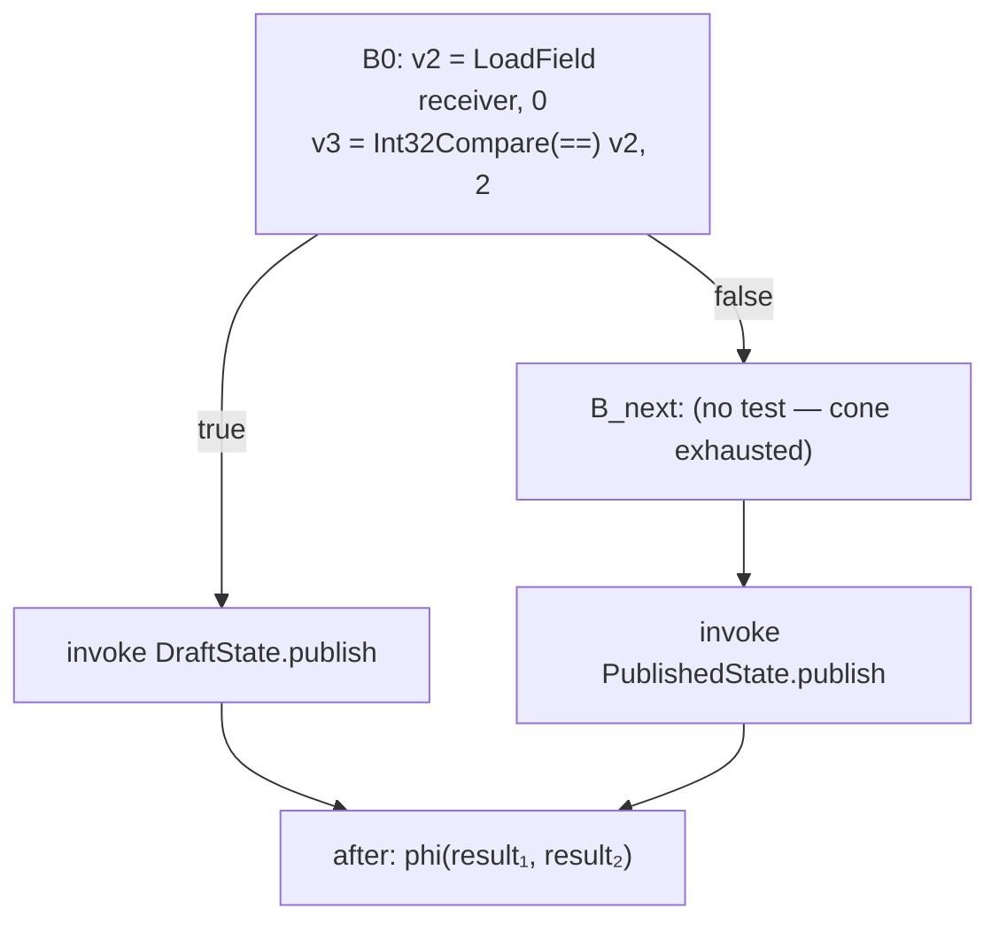

# 57. Objects without a runtime type   ⟨ N ⟩

Everything Parts IV and V built to answer the question *what is this object?* is a runtime
service. A hidden class is allocated while the program runs; the transition tree grows as
properties are added; an inline cache remembers the map it saw last time and checks against
it on every hit. A native binary has none of that. There is no allocator that can mint a
map, no cache to hold one, and — this is the part that decides everything else — no
deoptimization to fall into when the guess is wrong.

So the whole question moves to compile time. Every shape a program will ever have is known
before the program starts, which means the shapes can be a constant array in the binary's
read-only data and the per-object cost is one `u32` index into it. That array is the
`ClassTable`, and it is the only description of memory a compiled tera program has.

The hard part is not the layout. The hard part is *which classes are related to which*.
tera's checker assigns object types **structurally** — `objectAssignable`
(`src/frontend/checker/type-system.ts:1015-1040`) accepts any object carrying the required
surface, with no reference to declaration or inheritance ([Ch 12 § the-open-field]). A
compiler that builds its class hierarchy out of `parent` links is therefore building a
different relation from the one its type checker uses, and this chapter contains the wrong
answer that fact produced, in a twenty-one-line program in the tree.

`docs/example/stats.tera` supplies the layout half of the chapter — its `Series` instances,
its `float[]` and its inline text field are all visible in the emitted C. It cannot supply
the dispatch half: it has one class, so its cones are all one member wide, and
`docs/example/stats-poly.tera`, which `docs/example/README.md` nominates as the
polymorphism example, is refused before the class table is consulted (see
§ honesty-items). The dispatch sections use `examples/design-pattern/20_state.tera`, a
twenty-one-line program already in the tree, and one probe program that appears only as a
command under "Verify it yourself" ([Conventions § 2](../CONVENTIONS.md)).

**What arrived.** An `AotLegality` — or an `AotSkippedFunction` — from
[Ch 56 § what-it-actually-computes], and with it a debt. `analyzeAotLegality` assigns a
scalar to a field access by reading `FIELD_SCALAR_PROP`, `ARRAY_ELEMENT_SCALAR_PROP` and
`CLASS_ID_PROP` straight off the node ([Ch 56 § where-a-scalar-comes-from]). Chapter 56
named those props and did not say who writes them. This chapter is who stamps them, and
what they are stamped from.

## What a transition tree cannot become

In the interpreter an object is an address plus a pointer to a `Map`, and the map is a node
in a tree grown by transition: add a property, walk to the child map that has it, or create
one ([Ch 23 § the-transition-tree]). That design buys two things. Objects built the same way
share a descriptor, so the descriptor is not per-object; and a site that saw one map last
time can check for that same map with a pointer compare and then use a fixed offset
([Ch 24 § lda-prop-the-sequence-in-order]).

Both halves depend on a running system. Growing the tree is allocation. Caching the map is
a mutable side table. And the pointer compare is only useful because there is a slow path
to take when it fails — in the JIT, a `CheckMap` whose failure edge goes to a
deoptimization stub ([Ch 49 § where-the-guards-go-speculationlowering]). Remove the ability to bail out and a
map check is not a check any more; it is either a proof obligation or a refusal
([Ch 55 § no-way-out]).

What replaces it is smaller than what it replaces. The compiler already knows every class
the program declares, because the checker had to resolve them to type-check anything. It
knows the declared type of every field, because tera requires class members to be declared
([Ch 12 § visibility-is-required-not-defaulted]). From that it can compute, once, a
complete layout for every class, number those layouts, and put the numbering in the file.

> **New idea. Object header.** The fixed bytes at the front of every heap block, before its
> first field. Code that holds only an address can read the header and learn what the block
> is, how big it is, and what the collector has done with it. In a dynamic runtime the
> header is a pointer to a descriptor that was built at run time; here it is an index into a
> table that was built at compile time. The difference is eight bytes versus a graph.

The other reader of that table is the collector. When [Ch 61 § marking] walks a block
looking for outgoing pointers, the shape id in the header is how it knows which of the
block's bytes are pointers and which are floats. That is not a secondary use — it is the
reason the table has to describe *reference fields* specifically rather than fields in
general, which is what § the-table-in-the-binary is about.

## Eight bytes and three spare bits

```
 offset  0        4        8
        +--------+--------+------------------------------------------+
        | shape  | size   | first field ...                          |
        | u32    | u32    |                                          |
        +--------+--------+------------------------------------------+
          ^        ^  ^^^
          |        |  |||
          |        |  ||+-- bit 0  TERA_MARK_FLAG        = 1
          |        |  |+--- bit 1  TERA_OLD_FLAG         = 2
          |        |  +---- bit 2  TERA_REMEMBERED_FLAG  = 4
          |        +------- bits 3..31: the block's own size in bytes
          +---------------- index into tera_classes[]
```

Two words. Offset 0 is `CLASS_SHAPE_ID_OFFSET`, an index into the shape table. Offset 4 is
`CLASS_FLAGS_OFFSET`, and it holds two things at once: the block's own size in bytes, and
the collector's three flag bits in the low three bits of that size.

The overlap is sound rather than clever, and the reason is one constant.
`CLASS_ALIGNMENT_BYTES = 8` (`src/optimizing/metadata/class-table.ts:53`), and every size
that reaches the header has been through `alignUp(cursor, CLASS_ALIGNMENT_BYTES)` — at the
end of `Table.define` for a class, in `syntheticShape` for everything minted, and in
`arrayBufferBytes` for a buffer. A multiple of eight has bits 0, 1 and 2 clear. And
`TERA_BLOCK_FLAGS = TERA_MARK_FLAG | TERA_OLD_FLAG | TERA_REMEMBERED_FLAG` is `7`
(`src/optimizing/target/runtime-layout.ts:254-257`), which is exactly the three bits the
alignment guarantees are free.

> **New idea. Tag bits stolen from an aligned value.** When a number is known to be a
> multiple of 2ⁿ, its low n bits are always zero, so they can carry unrelated information
> for free. Reading the number back means masking them off; here that is
> `CLEAR_BLOCK_FLAGS = -1 - TERA_BLOCK_FLAGS` (`class-table.ts:81`), and in the emitted C,
> `& ~(uint32_t)7u`. The trick costs one AND on every size read and saves a word on every
> heap object in the program. It is only safe as long as *nothing* can put an unaligned
> size in that word, which is why the alignment is a constant and not a convention.

Both words are written at the tail of the allocator:

```c
  for (size_t at = 0; at < size; at++) object[at] = 0;
  *(uint32_t *)object = (uint32_t)shape_id;
  *(uint32_t *)(object + 4) = (uint32_t)size;
```
— `stats.c:490-492`, from `tera compile --emit source --target c`

**Invariant.** Every producer of a heap block writes the shape id at offset 0 and the block
size at offset 4, and the low three bits of that size are zero.

**Enforcement.** None. There are four independent producers of that two-word prologue —
`tera_alloc` in the C backend (`src/optimizing/backends/c/emit.ts:1683-1684`), the x64
`tera_alloc` machine routine (`src/optimizing/backends/x64/heap.ts:845-846`), the x64
*inline* bump-allocation fast path, which does not call `tera_alloc` at all
(`src/optimizing/backends/x64/lowering.ts:1219-1229`), and the riscv64 routine
(`src/optimizing/backends/riscv64/heap.ts:462-463`). Nothing checks that the four agree.
See § honesty-items.

Shape id `0` is reserved: `TERA_FREE_SHAPE_ID = 0`
(`src/optimizing/target/runtime-layout.ts:253`) is the shape a swept block is relabelled
with, and `FREE_BLOCK_BYTES = CLASS_HEADER_BYTES + TERA_LINK_BYTES` (`class-table.ts:79`) is
the smallest block that can carry a free-list link after its header. That is why the C
backend hardcodes row zero of the table (§ the-table-in-the-binary) and why the first real
class gets id `1` (`FIRST_CLASS_ID`, `class-table.ts:443`).

## Laying a class out

`Table.define` (`class-table.ts:782-855`) is the whole layout algorithm, and it is short
enough to read as one idea: walk a cursor forward through the instance, aligning as you go.

The cursor does not start at the header. It starts at the parent's *size*:

```ts
    let cursor = parent === null ? CLASS_HEADER_BYTES : parent.size;
```
— `src/optimizing/metadata/class-table.ts:790`

Then, for each declared data member, ask `fieldScalarOf` for an `AotScalar`, align, record
the offset, advance:

```ts
      if (fields.has(member.name)) continue;
      if (scalar === null) {
        unsupported.push(member.name);
        continue;
      }
      cursor = alignUp(cursor, scalarAlignment(scalar));
      fields.set(member.name, {
        name: member.name,
        declaredType: member.declaredType,
        offset: cursor,
        scalar,
        owner: member.owner,
      });
      cursor += scalarWidth(scalar);
    }
```
— `src/optimizing/metadata/class-table.ts:812-826`

and round the whole instance up to eight at the end (`size: alignUp(cursor,
CLASS_ALIGNMENT_BYTES)`, `:844`).

> **New idea. Field offset, alignment and padding.** A field's *offset* is its fixed
> distance in bytes from the start of the object, so a read becomes `base + constant`
> instead of a name lookup. Its *alignment* is the multiple its address must be — most
> machines load an 8-byte double fastest, or only correctly, from an address divisible by
> eight. `alignUp` rounds the cursor forward to satisfy that, and the bytes it skips are
> *padding*: real, allocated, never read. This is why an `int` (4 bytes) followed by a
> `float` (8 bytes) puts the float at offset 16 and not 12 — the four bytes at 12..15 are
> padding. It is also why field order in the source is not free: the same two fields
> declared the other way round produce a smaller object.

The widths come from `SCALAR_WIDTHS` (`src/optimizing/types/scalar.ts:56-63`): `int32` 4,
`float64` 8, `string` 8, `pointer` 8, `code` 8, and `text` — a string stored *inside* the
object — 1024. That last one would be a disaster for alignment if width and alignment were
the same thing, so they are not:

```ts
export function scalarAlignment(scalar: AotScalar): number {
  return scalar === SCALAR_TEXT ? scalarWidth(SCALAR_POINTER) : scalarWidth(scalar);
}
```
— `src/optimizing/types/scalar.ts:107-109`

`SCALAR_TEXT` is 1024 bytes wide and 8 bytes aligned. [Ch 59 § storage-an-object-owns-privately]
is why an object owns its characters inline at all.

Run the algorithm on `Series` and every number in the binary falls out. `name: string`
becomes `SCALAR_TEXT`: cursor starts at 8, aligns to 8, offset **8**, cursor advances to
1032. `values: float[]` becomes `SCALAR_POINTER`: 1032 is already aligned, offset **1032**,
cursor advances to 1040. The size rounds to **1040**. The emitted C agrees exactly —
`tera_alloc(1040, 1)` at `stats.c:3254`, and the shape's one reference field is at 1032.

Two consequences carry the rest of the chapter.

**A subclass's instance is a byte-exact prefix of its parent's.** Because the cursor starts
at `parent.size` and inherited fields are copied into the child's map with the offsets they
already had, a parent's field offset is valid on any descendant with no check at all. That
is what makes a fixed offset legal on a receiver whose exact class is unknown — which is
half of why the dispatch ladder in § the-dispatch-ladder can call methods without ever
loading a field indirectly.

**A parent must be laid out before its children, and source order does not guarantee it.**
`orderedByInheritance` (`class-table.ts:533-551`) is a small topological sort over `parent`
links, run once in the constructor before any `define` call. Without it, a class declared
above its own parent would start its cursor at `CLASS_HEADER_BYTES` — the `parent === null`
branch of line 790, because the parent is not in `byName` yet — and every inherited field
would land at the wrong byte.

`[t: tests/optimizing/metadata/class-table.test.ts > "places the first field directly after the object header"]`
`[t: tests/optimizing/metadata/class-table.test.ts > "aligns a float field that follows an int field"]`
`[t: tests/optimizing/metadata/class-table.test.ts > "aligns text storage on the pointer width instead of its full size"]`
`[t: tests/optimizing/metadata/class-table.test.ts > "rounds the instance size up to the object alignment"]`
`[t: tests/optimizing/metadata/class-table.test.ts > "gives an inherited field the exact offset it has in the parent"]`
`[t: tests/optimizing/metadata/class-table.test.ts > "starts a subclass's own fields after the whole parent instance"]`
`[t: tests/optimizing/metadata/class-table.test.ts > "keeps the prefix property across a three-level chain declared out of order"]`

## A field the table cannot lay out

`fieldScalarOf` (`class-table.ts:474-485`) answers `null` for a field whose declared type
has no native representation — an `any`, an unresolvable name, a union of a class with a
number. The interesting decision is what happens next, and it is not a refusal:

```ts
      if (scalar === null) {
        unsupported.push(member.name);
        continue;
      }
```
— `src/optimizing/metadata/class-table.ts:813-816`

The class is still defined. It still gets an id, a layout for its other fields, and a row in
the table. Only the un-layoutable member is missing, recorded by name in `shape.unsupported`.
The refusal is deferred to whoever actually touches it: a function that reads that field
finds no `ClassField` for it, keeps a `GenericGetProp` the backend cannot emit, and is
refused by [Ch 56 § refusing-well] with its own name attached. A program that never touches
it compiles. This is the same policy as the per-function refusal that runs the whole part —
compile what you can prove, and be specific about what you could not.

The opposite error needs its own cross-check, because it cannot be caught by looking at
declarations alone. A tera constructor may assign a field the class body never declared
([Ch 12 § the-open-field]), so the bytecode compiler's list of assigned fields and the
declared surface can disagree. `constructorFieldDisagreement` (`class-table.ts:1018-1034`)
compares them and produces one sentence:

```
class X has fields the compiler cannot agree on: constructor assigns …; declared shape has …
```

`missing` names what the constructor assigns and the shape never saw; `extra` names what the
shape declares that the constructor never assigns. The comparison is only sound because
`declaredFieldsOf` (`:1010-1016`) concatenates `shape.unsupported` onto the list of laid-out
fields — a field the table could not lay out is still *declared*, and counting it as absent
would report a disagreement that is not one. It also filters to `field.owner === shape.name`,
so an inherited field assigned by the parent's constructor is not reported as missing from
the child's.

`[t: tests/optimizing/metadata/class-table.test.ts > "records a field whose declared type is not an AOT scalar instead of laying it out"]`
`[t: tests/optimizing/metadata/class-table.test.ts > "names a field the constructor assigns but the shape never saw"]`
`[t: tests/optimizing/metadata/class-table.test.ts > "names a field the shape declares that the constructor never assigns"]`
`[t: tests/optimizing/metadata/class-table.test.ts > "counts a field with an unsupported type as declared rather than missing"]`
`[t: tests/optimizing/metadata/class-table.test.ts > "compares only the class's own fields, not inherited ones"]`

## The table in the binary

What reaches the file is much less than the `ClassShape`. Field names, declared types,
method symbols, static fields — none of it survives. One consumer is left at run time, the
collector, and it asks exactly one question: *given this block's address, where are its
outgoing pointers?*

The row is declared once, in the one file that both machine backends and the C backend read:

```ts
export const TERA_CLASS_RECORD = declareRecord("tera_classes", [
  { name: "tailReferences", bytes: COUNT_BYTES },
  { name: "fieldStart", bytes: COUNT_BYTES },
  { name: "fieldCount", bytes: COUNT_BYTES },
  { name: "reserved", bytes: COUNT_BYTES },
]);
```
— `src/optimizing/target/runtime-layout.ts:201-206`

The machine backends lay that out as a flat record indexed by `TERA_CLASS_RECORD_SHIFT`
(`:250`), with the offsets themselves in a separate table,
`TERA_CLASS_FIELDS = declareTable("tera_class_fields", COUNT_BYTES)` (`:218`) — one array of
`u32` offsets for the whole program, and each row saying where its slice starts and how long
it is. The C backend emits the same information in C's own idiom, a struct holding a
*pointer* to a per-shape array:

```c
typedef struct {
  uint32_t tail;
  uint32_t fields;
  const uint32_t *offsets;
} tera_class;
static const uint32_t tera_fields_1[] = { 1032 };
static const uint32_t tera_fields_3[] = { 8 };
static const uint32_t tera_fields_5[] = { 16 };
static const uint32_t tera_fields_8[] = { 16 };
static const tera_class tera_classes[] = {
  { 0, 0, 0 },
  { 0, 1, tera_fields_1 },
  { 0, 0, 0 },
  { 0, 1, tera_fields_3 },
  { 0, 0, 0 },
  { 0, 1, tera_fields_5 },
  { 0, 0, 0 },
  { 0, 0, 0 },
  { 0, 1, tera_fields_8 },
```
— `stats.c:114-132`

Nine rows for twenty-four lines of source. Row 0 is the hardcoded `{ 0, 0, 0 }` of
`cClassTable` (`src/optimizing/backends/c/emit.ts:1327`) — the free block. Row 1 is
`Series`, whose single pointer is at 1032. Rows 5 and 8 are array headers, whose single
pointer is at 16. Rows 2, 4, 6 and 7 hold no pointers at all: the float64 element buffer, the
int32 element buffer, and two string boxes ([Ch 59 § boxing-a-whole-phi-web]).

This pair — one declaration, two independent emissions — is the part opener's rule about
`tera_context` in its clearest form. Nothing in the tree diffs the two implementations
against each other. What keeps them honest is that neither of them names an offset: both
read `TERA_CLASS_RECORD` and `referenceFieldOffsets`, so a change to the row's shape breaks
both at compile time rather than silently in one.

The row describes **pointers**, not fields:

```ts
export function referenceFieldOffsets(shape: ClassShape): readonly number[] {
  const offsets: number[] = [];
  for (const field of shape.fields.values()) {
    if (field.scalar === SCALAR_POINTER) offsets.push(field.offset);
  }
  return offsets.sort((left, right) => left - right);
}
```
— `src/optimizing/metadata/class-table.ts:1002-1008`

`Series.name` is invisible to this table. It is a thousand and twenty-four bytes of
characters living inside the object, and the collector must not trace it, because it is not
a pointer. `SCALAR_STRING` is likewise absent from the test — a borrowed string address is
not a block the collector owns ([Ch 59 § who-owns-and-who-borrows]).

`tailReferences` is the escape hatch for a shape whose *size* is not fixed. Only
`arrayBufferShape` (`class-table.ts:171-176`) ever sets it, and only when the element scalar
is `SCALAR_POINTER`: a buffer of object references has no declared fields, so its pointers
cannot be enumerated by offset — everything past the header is one. The whole meaning of the
flag is six lines of the emitted runtime:

```c
static uint32_t tera_reference_count(const unsigned char *block) {
  const tera_class *shape = &tera_classes[*(const uint32_t *)block];
  if (shape->tail == 0u) return shape->fields;
  return (tera_block_size(block) - 8u) / 8u;
}

static unsigned char *tera_reference_at(const unsigned char *block, uint32_t at) {
  const tera_class *shape = &tera_classes[*(const uint32_t *)block];
  uint32_t offset = shape->tail == 0u
    ? shape->offsets[at]
    : 8u + at * 8u;
  return *(unsigned char **)(block + offset);
}
```
— `stats.c:211-223`

Two branches. Either the shape enumerates its pointers, or the block *is* a vector of them
and its own size word says how many.

## An array is two objects

*(Why the obvious design fails.)*

The obvious design is one heap block per array: header, then the elements inline, sized at
allocation. It is the smallest thing that works, it costs one allocation, and reading
`xs[i]` is a single indexed load off the array's own address.

Then the program calls `xs.push(v)` and the array is full. Growing means allocating a
bigger block and copying. Every name already bound to the old block — a local, a field of
some object, a parameter already pushed on a callee's stack — is now looking at a stranded
copy that will never see another element. In a runtime with a moving collector this is the
problem forwarding pointers exist to solve. The native collector does not move anything, on
purpose ([Ch 61 § nothing-moves]): root slots mirror pointers rather than naming them, so
there is nowhere to write a forwarding address and nothing that would read it.

The fix is one indirection, and `defineArray` (`class-table.ts:596-609`) mints **two**
shapes for every array type:

```
  tera_array$<declaredType>                       tera_array_buffer$<scalar>
  +--------+--------+--------+--------+---------+  +--------+--------+-----------------+
  | shape  | size   | length | capac. | elements|  | shape  | size   | element 0 ...   |
  | u32  0 | u32  4 | i32  8 | i32 12 | ptr  16 |  | u32  0 | u32  4 |          8 ...  |
  +--------+--------+--------+--------+---------+  +--------+--------+-----------------+
                      24 bytes, fixed              8 + capacity * stride, reallocated
```

The header is exactly 24 bytes and never moves. Growth reallocates the *buffer* and rewrites
one field of the header (`tera_array_reserve`, `stats.c:498-518`), so every alias still
reads the same header and sees the new elements. `tera_fields_5 = { 16 }` above is that one
pointer: the header's single traceable field is the buffer.

The buffer shape carries no declared fields at all — its `tailReferences` is set when the
element is a pointer, and that is the entire description. `ARRAY_INITIAL_CAPACITY = 1` and
`ARRAY_GROWTH_FACTOR = 2` (`class-table.ts:76-77`) are the growth policy; the emitted C
doubles and copies.

The naming scheme is a **hard invariant**, not a convenience: *an array shape's name must
determine its element scalar.* `mint` (`:615-621`) returns an existing shape when the name is
already known, and `defineArray` then unconditionally overwrites the layout record —
`this.arrays.set(shape.name, { element: scalar, ... })`. Two different element scalars
arriving under one name means the second one wins for every site that already resolved the
first.

This is told as a closed bug because it was one. Naming with `declaredTypeOf` — which
answers the *present* type name and drops nullability — made `int` and `int | null` collide.
`fieldScalarOf` maps a nullable numeric to `float64` (the absence payload lives in a NaN,
[Ch 56 § two-absence-values-one-payload-each]), so the second `defineArray` rewrote the
`int` array's layout to a float64 one and every `int[]` in the program silently became a
double array. The fix is `heldTypeOf` (`class-table.ts:115-120`), which appends `| null`
when the type accepts it, so the two get separate names and separate shapes. The general
rule: **when a name is used as a cache key, the name must be injective over everything the
cache entry decides** — and the cheapest way to break that is to normalize the name for
readability.

`[t: tests/optimizing/metadata/class-table.test.ts > "keeps the absence an element admits in the name it lays the array out under"]`
`[t: tests/optimizing/metadata/class-table.test.ts > "gives an element that admits an absence a shape apart from the one that does not"]`
`[t: tests/optimizing/passes/array-shapes.test.ts > "keeps an element that admits an absence apart from the one that does not"]`
`[t: tests/optimizing/passes/array-shapes.test.ts > "lays a nullable numeric element out as a double, leaving the plain one an int"]`
`[t: tests/e2e/optimizing/aot/heap-arrays.test.ts > "grows an array past the length it was created with"]`
`[t: tests/e2e/optimizing/aot/heap-arrays.test.ts > "grows an array reachable through a field without losing the holder"]`

## Naming what an array holds

Knowing the two shapes is not the same as knowing which array a given IR value is. That is
`arrayModelOf` (`src/optimizing/passes/array-shapes.ts:641-654`), and it is four sources
tried in order, first answer wins:

```ts
  return (
    shapedArray(array, classes) ??
    receivedArray(array, graph, classes, types) ??
    answeredArray(array, graph, classes, types) ??
    mergedArray(array, graph, classes, types)
  );
```
— `src/optimizing/passes/array-shapes.ts:648-653`

`shapedArray` (`:466`) reads a `VALUE_CLASS_PROP` some earlier pass already stamped — an
allocation the pass itself shaped. `receivedArray` (`:583`) reads the declared parameter
type, which is why [Ch 56 § refusing-well] insists every parameter be declared.
`answeredArray` (`:595`) reads a callee's declared return. And `mergedArray` (`:619-639`) is
the phi case, which needed a mechanism of its own.

The problem with a phi is that a loop-carried array variable is its own input. `xs` at the
top of a `while` is a phi whose inputs are the array from before the loop and the array from
the back edge — which is the phi itself, or something derived from it. Asking each input for
its element name recurses forever.

```ts
const merging = new Set<CFGInstruction>();
```
— `src/optimizing/passes/array-shapes.ts:617`

`mergedArray` adds the phi to `merging` on entry, removes it in a `finally`, and *skips*
any input already in the set. That is not the same as giving up on such an input: the walk
still refuses any *other* arm it cannot resolve, and still refuses arms that disagree. The
back edge is skipped as a back edge; a genuinely unresolvable second arm still answers
`null`. The same idiom appears twice in the file — `merging` at `:617` and `naming` at
`:667` — which is worth naming as a pattern rather than reading twice: **a recursive query
over a cyclic graph needs an in-progress set, and the set must mean "already being asked",
never "answered".**

There is a third refusal in the same loop, and it is the subtle one: `held.guessed`. An arm
whose element type was only *inferred* from a store, rather than declared, is treated as no
evidence at all, so a merge is never named from a guess on one side and a fact on the other.

`[t: tests/optimizing/passes/array-shapes.test.ts > "carries the element through a merge whose arms allocate the same array"]`
`[t: tests/optimizing/passes/array-shapes.test.ts > "answers nothing for a merge whose arms hold elements that disagree"]`
`[t: tests/optimizing/passes/array-shapes.test.ts > "answers the seeded arm rather than recursing on a phi that feeds itself"]`
`[t: tests/optimizing/passes/array-shapes.test.ts > "takes an element an arm only guessed as no evidence at all"]`

## Structural, not nominal

*(Bug as engineering.)*

**Symptom.** `examples/design-pattern/20_state.tera` is twenty-one lines: a `Document` whose
`state` field is assigned `DraftState()` in the constructor, and two state classes that both
implement `publish(document: Document) -> string`. `DraftState.publish` replaces the
document's state with a `PublishedState` and answers `"published"`; `PublishedState.publish`
answers `"already published"`. The interpreter prints:

```
state: published | already published
```

The compiled binary printed `state: published | published`. No warning, no diagnostic, exit
code 0 on both.

**Mechanism.** `Document.state` has no declared type, so its declared type is the one the
constructor's assignment gives it: `DraftState`. The dispatch cone for a receiver of type
`DraftState` was computed by walking `parent` links downward — every class whose ancestry
reaches `DraftState`. `PublishedState` has no parent, and is not a subclass of anything. So
the cone was `[DraftState]`, a cone with one member devirtualizes to a direct call, and
`this.state.publish(this)` became an unconditional call to `DraftState.publish` — which is
correct on the first call and wrong on every one after.

**The checker had always disagreed.** `objectAssignable`
(`src/frontend/checker/type-system.ts:1015-1040`) compares surfaces: it walks the expected
shape's fields, checks the actual shape carries each one assignably, and never once consults
a `parent` link. So `document.state = PublishedState()` is legal tera, and the checker is
right that it is.

> **New idea. Structural vs nominal subtyping.** A *nominal* type system says `B` is a `A`
> when `B`'s declaration says so — `class B extends A`. A *structural* one says `B` is an
> `A` when `B` has everything `A` requires, whatever `B`'s declaration says. Java and C# are
> nominal; TypeScript and tera are structural. The difference is invisible until a compiler
> needs to enumerate "everything that could be here at run time", because the two systems
> give different answers and only one of them is the one the program's assignments obey.

**Fix.** `dispatchConeOf` (`class-table.ts:669-677`, renamed from `subclassesOf`) answers
every *concrete* shape that conforms to the required one, and `conformsTo` is the whole
relation:

```ts
function conformsTo(candidate: ClassShape, required: ClassShape): boolean {
  for (const field of required.fields.values()) {
    const carried = candidate.fields.get(field.name);
    if (carried === undefined) return false;
    if (carried.offset !== field.offset || carried.scalar !== field.scalar) return false;
  }
  for (const kind of CLASS_CALLABLE_KINDS) {
    const members = required.callables.get(kind);
    if (members === undefined) continue;
    const carried = candidate.callables.get(kind);
    for (const [name, method] of members) {
      const found = carried?.get(name);
      if (found === undefined) return false;
      if (found.signature.params.length !== method.signature.params.length) return false;
    }
  }
  return true;
}
```
— `src/optimizing/metadata/class-table.ts:908-925`

Same name, **same offset and same scalar** for every required field; same name and same
arity for every required callable. Nothing about ancestry appears.

**The general rule this produced:** *a compiler's class hierarchy must be built from the
same relation its type checker uses, or devirtualization is unsound.* Devirtualization is
only ever justified by "nothing else can be here", and "nothing else" is a claim about the
assignability relation — so a hierarchy computed from a different relation is not a weaker
approximation of the right answer, it is an answer to a different question.

**Regression test.**
`[t: tests/optimizing/metadata/class-table.test.ts > "covers an unrelated class that carries the same surface"]`
builds `Shape`/`Circle`/`Square`/`Unit` plus an unrelated `Blob` carrying the same `area()`,
and asserts the cone of **`Circle`** is `["Blob", "Circle", "Square", "Unit"]` — a sibling
and a stranger, both in it. The pair test is sharper still:

```ts
  it("parts company with the structural dispatch cone", () => {
    expect(table.dispatchConeOf("Shape").map((shape) => shape.name)).toContain("Blob");
    expect(descends("Blob", "Shape")).toBe(false);
  });
```
— `tests/optimizing/metadata/class-table.test.ts:319-322`

Both relations still exist. `descendsFrom` is nominal and is used where ancestry is the
question; `dispatchConeOf` is structural and is used where "what can be here" is the
question. The bug was using the first to answer the second.

> **New idea. Class hierarchy analysis, and a dispatch cone.** Given a call
> `receiver.m()` where the receiver's static type is `T`, the *cone* is the set of concrete
> classes the receiver could actually be. If the cone has one member, the call is a direct
> call. If it has several, the compiler must branch. If the compiler cannot compute it, it
> needs a runtime mechanism — a vtable, an inline cache, a hash lookup — and a native tera
> binary has none of those. So the cone is not an optimization here; it is the *only*
> dispatch mechanism, which is why getting its membership wrong is a wrong answer rather
> than a slow one.

Computing cones pairwise over all classes would be quadratic. `conformingShapes`
(`:888-897`) instead seeds from a member-name index: for each member the required shape
needs, look up `byMember` — every concrete shape carrying that name — and keep the
**smallest** such list as the candidate set, then filter it with `conformsTo`. Seeding from
the rarest required member is what keeps the filter short. Results are cached in `cones`,
and both `defineSynthetic` (`:586-594`) and `mint` (`:615-621`) clear that cache, which is
the only reason a class minted later in the pipeline — a closure frame, a coroutine frame,
an object literal — cannot be missed by a cone computed earlier.

And the free consequence, which is what makes the whole design pay: **field offsets agree by
construction inside a cone.** `conformsTo` compares offsets, so every member of a cone puts
the required fields at the same bytes. `applyFieldAccess` can therefore emit a load at a
constant offset with **no receiver check whatsoever**, even when the receiver's exact class
is unknown.

`[t: tests/optimizing/metadata/class-table.test.ts > "includes every concrete subclass of an abstract base in its cone"]`
`[t: tests/optimizing/metadata/class-table.test.ts > "leaves the abstract base itself out of its own cone"]`
`[t: tests/optimizing/metadata/class-table.test.ts > "leaves out a class that is missing part of the surface"]`
`[t: tests/optimizing/metadata/class-table.test.ts > "leaves out a class whose member of the same name takes a different arity"]`
`[t: tests/optimizing/metadata/class-table.test.ts > "leaves out a class that puts a shared field in a different slot"]`
`[t: tests/optimizing/metadata/class-table.test.ts > "separates a class that merely carries the same surface"]`

## Interfaces are shapes too

An `interface` is not a separate concept in the class table. `interfaceSurfaceOf`
(`src/frontend/modules/interface.ts:123-140`) turns one into an ordinary `ClassSurface` with
`abstract: true`: a member whose declared type parses as a function signature becomes an
abstract `method`, and **everything else stays a `CLASS_DATA_MEMBER`**.

So an interface goes through the same `Table.define` as a class. Parent `null`, so its
cursor starts at `CLASS_HEADER_BYTES`, and its data members acquire concrete offsets of
their own. That is sharp and it is not obvious: `conformsTo` compares offsets, so an
implementing class is in the interface's cone only if it happens to place the interface's
fields at the same bytes. **Declaration order is layout**, and for a data field on an
interface, declaration order is therefore part of the contract. See § honesty-items for what
that costs today.

Abstract shapes are indexed separately, in `abstractByMember` rather than `byMember`
(`class-table.ts:864`). Two things follow. An abstract shape is never a *candidate* in
`conformingShapes`, which is precisely why an abstract base is absent from its own cone —
not a special case, a consequence of which index it went into. And the abstract index drives
the inverse question:

```ts
  standInsFor(shape: ClassShape): readonly ClassShape[] {
```
— `src/optimizing/metadata/class-table.ts:872`

*Which declared surfaces does this concrete class stand in for?* `commonStandInOf`
(`:349-362`) uses it to find a common type for a merge whose arms have no common ancestor —
intersect the stand-ins of every arm, then `narrowestOf` (`:337-347`) picks the one whose
own cone covers the fewest shapes, because the narrowest common surface is the most
informative one. `commonShapeOf` (`:364-369`) tries the nominal common ancestor first and
falls back to this.

`[t: tests/optimizing/metadata/class-table.test.ts > "reports every implementation reachable from the receiver type"]`
`[t: tests/optimizing/metadata/class-table.test.ts > "attributes an inherited method to the class that defines it"]`
`[t: tests/optimizing/metadata/class-table.test.ts > "omits an abstract declaration from the implementations of its own cone"]`
`[t: tests/e2e/optimizing/aot/interface-dispatch.test.ts > "calls a method on what another interface call answered"]`
`[t: tests/e2e/optimizing/aot/interface-dispatch.test.ts > "keeps a shared base class as the element type when there is one"]`

## Spending the table

The table is built once, in `buildClassTable`. It is *spent* by `class-member-lowering`,
legalization pass ordinal at `src/optimizing/target/legalization.ts:291`, after
`object-literal-shapes` (`:233`), `callee-signatures` (`:270`) and `array-allocation-shapes`
(`:278`) have stamped everything they can. Four rewrites, and every one of them ends in a
constant.

**Construction.** `applyConstruction` (`class-member-lowering.ts:540-566`) splits `Foo(x)`
into two nodes — an allocation and a call:

```ts
  const allocation = stamp(irNewObject());
  allocation.props[CLASS_ID_PROP] = shape.id;
  allocation.props[INSTANCE_SIZE_PROP] = shape.size;
  allocation.props[VALUE_CLASS_PROP] = shape.id;
  allocation.frameState = node.frameState;
  editor.insertBefore(node, allocation);
```
— `src/optimizing/passes/class-member-lowering.ts:546-551`

then a direct `CallKnownFunction` on `shape.constructorSymbol` with the allocation prepended
as argument zero. `INSTANCE_SIZE_PROP` is the constant the backend passes to `tera_alloc`;
`CLASS_ID_PROP` is the shape id it writes to offset 0. `VALUE_CLASS_PROP` is the one that
travels: it tells every later pass that *this value* is a `Foo`.

**Field access.** `applyFieldAccess` (`:349-370`) turns `GenericGetProp`/`GenericSetProp`
into `irLoadField(receiver, field.offset)` / `irStoreField`, stamped with `FIELD_TYPE_PROP`
and `FIELD_SCALAR_PROP`. Those are the two props chapter 56 read off the node without
saying where they came from. A `SCALAR_TEXT` field takes `irLoadText`/`irStoreText` instead,
which carry the capacity as well ([Ch 59 § three-storage-classes]).

**A call with one target** becomes a direct `CallKnownFunction` on
`classMemberSymbol`'s name — `Owner.method`, or `Owner.get.name` for a getter,
`Owner.static.name` for a static (`src/optimizing/metadata/class-symbols.ts:40-51`). The
receiver becomes parameter zero, named `this`, by `memberSignature` (`:75-86`): a method is
a plain function whose first parameter is the object.

**A call with several** becomes the ladder below. The decision is one line:

```ts
function polymorphicShapeOf(call: MemberCall): ClassShape | null {
  return call.targets.length > 1 ? call.dispatchOn : null;
}
```
— `src/optimizing/passes/class-member-lowering.ts:526-528`

One target, direct call. More than one, ladder.

There is a devirtualization shortcut worth stating separately, because it is what keeps
ordinary code out of the ladder entirely. `constructedShape` (`:530-538`) recognizes a
receiver the pass can *see being allocated* — a `CallKnownFunction` on a constructor
symbol. Such a receiver has exactly that class, not merely something in its cone, so
`Foo().bar()` is a direct call even when `Foo`'s cone is wide. Dispatch is paid for only
where the receiver's class genuinely arrived from somewhere else.

## The dispatch ladder

`applyDispatchLadder` (`class-member-lowering.ts:596-652`) is the one place a native tera
program branches on a runtime type. It is worth reading in full because of what is *not* in
it.

> **New idea. Virtual dispatch, and a branch ladder.** *Virtual dispatch* is choosing which
> function body to run based on the receiver's actual class rather than its declared one.
> The usual implementation is a *vtable*: each class carries a pointer to an array of
> function pointers, and a call loads the pointer and jumps through it — one indirect call,
> constant time, and opaque to every later optimization because the target is a value rather
> than a name. A *branch ladder* is the other end of the trade: compare the receiver's class
> id against each candidate in turn and make a direct call in each arm. It is linear in the
> number of candidates and it keeps every call site a named call, which is what lets an
> inliner, a call-graph walk and a linker all still see it.

`shapeIdOfReceiver` (`:568-578`) is the only load: `irLoadField(receiver,
CLASS_SHAPE_ID_OFFSET)` — the `u32` at offset 0 — stamped with `FIELD_SCALAR_PROP =
SCALAR_INT32` so the rest of the pipeline treats it as an ordinary integer. Then, per arm:

```ts
    if (index === arms.length - 1) {
      current.addNode(stamp(irJump(invoke)));
      link(current, invoke);
    } else {
      const expected = stamp(irConstant(arm.classId));
      current.addNode(expected);
      const test = stamp(irInt32Compare("==", shapeId, expected));
      current.addNode(test);
      const next = graph.addBlock();
      current.addNode(stamp(irBranch(test, invoke, next)));
      link(current, invoke);
      link(current, next);
      current = next;
    }
    connect(invoke, after, merged === null ? [] : [result]);
  }
```
— `src/optimizing/passes/class-member-lowering.ts:636-651`

Two things are worth noticing.

**The last arm carries no test.** The cone is exhaustive by construction — it is every
concrete shape that could be here — so once every other arm has been ruled out, the final
`else` is an unconditional jump. That is not an optimization applied afterwards; it is the
shape of the loop.

**There is no vtable and no indirect call.** Every arm is `irCallKnownFunction` on a symbol.
The value merges through one phi in the block `splitBlockAfter` created, and the phi carries
the original node's `VALUE_CLASS_PROP` forward so a chained `x.a().b()` still knows what
`a()` answered. Chapter 58 finishes collecting this property for closures, higher-order
calls and coroutines; when it is done, a native tera binary contains exactly one indirect
call in the whole program.



That is `Document.publish` from `20_state.tera`, and here it is in the emitted C:

```c
  unsigned char *v1 = (*(unsigned char * *)(p0 + 8));
  tera_context.roots_base[roots + 2] = (unsigned char *)v1;
  const int32_t v2 = (*(int32_t *)(v1 + 0));
  const int32_t v3 = v2 == v0;
  if (v3 != 0) {
  goto L2;
  } else {
  goto L3;
  }
L3:;
  goto L4;
L4:;
  const tera_char *v6 = PublishedState_publish(v1, p0);
```
— `20_state.c:1268-1280`

`v1` is `this.state`, loaded at the constant offset 8. `v2` is the shape id at offset 0.
`v0` is the constant `2`, `DraftState`'s id, hoisted to the top of the function by the C
backend's declaration ordering. `L3` is the ladder's second arm and it carries no test: it
falls straight into `L4` and calls `PublishedState_publish` directly. Two named calls, one
comparison, no function pointer anywhere.

The cost is worth stating honestly and without adjectives: the ladder is **linear in the
size of the cone**, and nothing in the tree measures where that stops being the right shape.
There is no cone-size threshold, no fallback to a jump table, and no benchmark that would
tell you what the threshold should be.

The ladder's generated CFG is **[unpinned]** — no unit test asserts its block structure. It
is covered only end to end, through `tests/e2e/optimizing/aot/interface-dispatch.test.ts`.

## A record is a lookup table

The other use of a shape is the one where the *key* is a runtime value. A tera record
literal — `rates = { "usd": 1.0, "eur": 1.08, "gbp": 1.27 }`, the tree's own fixture at
`tests/e2e/optimizing/aot/record-lookup.test.ts:70` — is minted as a synthetic class
(§ minting-into-the-same-table), so `code in rates` and `rates[code]` are questions about a
class's fields asked with a string nobody knows at compile time.

Membership becomes an OR-chain with **no control flow at all**. `keyedMembershipFor`
(`:843-872`) walks the shape's fields, builds a `GenericCompare("==", key, "<field>")` per
field (`matchesKey`, `:828-841`), and folds them together with `irInt32Or`. Three fields,
three comparisons, two ORs, one answer.

The lookup is the interesting one:

```ts
  const present = provenPresent(node, key, receiver, search);
  const chosen = present ? fields.slice(0, -1) : fields;

  let answer = present
    ? fieldValueAt(editor, node, receiver, fields[fields.length - 1]!, classes, stamp)
    : absentValueAt(editor, node, stamp);
  for (const field of chosen) {
    const same = matchesKey(editor, node, key, field, stamp);
    const held = fieldValueAt(editor, node, receiver, field, classes, stamp);
    answer = stamp(irSelect(same, held, answer));
    editor.insertBefore(node, answer);
  }
  return answer;
```
— `src/optimizing/passes/class-member-lowering.ts:978-990`

A chain of `irSelect(key == "<field>", thisField, whateverWeHadBefore)`, seeded with an
absence constant, over **unconditional** field loads. Every field is loaded whether or not
the key names it.

> **New idea. Select — choosing a value without branching.** `select(c, a, b)` answers `a`
> when `c` holds and `b` otherwise, as a *value* rather than as control flow. It compiles to
> a conditional move on x64 ([Ch 51 § if-conversion-under-a-budget]) and to `select` in wasm, and it costs
> nothing on a branch predictor because there is no branch. The price is that **both** arms
> are evaluated. That is only safe when evaluating the unused arm cannot fault and cannot
> have an effect — which is exactly the case here, because every field of a record literal
> exists at a known offset in a block that certainly exists. It would not be safe for an
> array index, where the unused arm might be out of bounds.

The rewrite is gated by `lookupFieldsOf` (`:768-773`): no `unsupported` members, at least
one field, and **every field numeric** — `isNumericScalar`, which admits `int32` and
`float64` together. Admitting the mix matters more than it looks. Requiring one shared
scalar refused ordinary rate tables, because `{ "usd": 1.0, "eur": 1.08 }` folds `1.0` to an
int and leaves the rest doubles. A record with a string field is left alone entirely, and
the resulting `GenericGetIndex` is refused by name
`[t: tests/e2e/optimizing/aot/record-lookup.test.ts > "leaves a record whose fields do not share one scalar alone"]`.

There is a fast path before all of that: a key that is a *constant string* the record does
not carry answers with the absence outright (`:972-975`), and a constant string it does
carry is left for the ordinary field-access path to handle.

`[t: tests/optimizing/passes/class-member-lowering.test.ts > "asks the key against every name the record carries"]`
`[t: tests/optimizing/passes/class-member-lowering.test.ts > "answers true when any one of those matches"]`
`[t: tests/optimizing/passes/class-member-lowering.test.ts > "reads whichever field the key names"]`
`[t: tests/optimizing/passes/class-member-lowering.test.ts > "falls back to an absence when the key names none of them"]`
`[t: tests/optimizing/passes/class-member-lowering.test.ts > "leaves a record holding something that is not a number alone"]`

## A dominating `in` removes an arm

The seed of that chain is a problem. A lookup seeded with `undefined` is a value that admits
an absence, so a function declared `-> int` cannot return it —
[Ch 56 § when-the-join-conflicts] refuses it with *"no way to say absent"*. Which means the
most natural way to write the code:

```
fn stock(sku: string) -> int:
  if not (sku in table):
    return -1
  return table[sku]
```
— the `GUARDED_LOOKUP` fixture, `tests/e2e/optimizing/aot/record-lookup.test.ts:18-28`

would be refused, even though the programmer has just *proved* the key is carried.

`provenPresent` (`:911-928`) is how that proof is recovered. The pass records every
membership chain it builds in `search.memberships` — the key, the receiver, and the blocks
that a branch on that chain leads to (`armsProving`, `:902-909`). When a lookup on the same
key and the same receiver comes along, it asks whether any of those arms **dominates** the
lookup:

```ts
  const reached = node.block;
  if (reached === null || search.memberships.length === 0) return false;
  let dominance: DominatorTree | null = null;
  for (const held of search.memberships) {
    if (held.key !== key || held.receiver !== receiver) continue;
    dominance ??= search.dominance();
    for (const arm of held.arms) {
      if (dominance.dominates(arm, reached)) return true;
    }
  }
  return false;
```
— `src/optimizing/passes/class-member-lowering.ts:917-928`

When it does, `chosen` drops the last field and the chain is seeded with that field's
*value* instead of the absence constant. The result is not nullable, the `-> int` return is
legal, and one comparison disappears with the absence.

> **New idea. Dominance as a proof carrier.** [Ch 42 § dominance] introduced dominance as a
> structural fact: block `A` dominates block `B` when every path from entry to `B` goes
> through `A`. Read the other way, it is a proof rule. If the *only* way to arrive here was
> through a block that a test led to, then that test's answer is a fact here — not a
> speculation, not something a guard is holding up, but a property of the control-flow graph
> that survives every pass that preserves the CFG. This is the sound counterpart to the
> unsound reasoning of [Ch 49 § provenance-two-ways-to-know-the-same-thing]: a guard's narrowing is only true while the
> guard exists, and a dominating branch is true because the *alternative path is not here*.
> The native compiler may use the second and may not use the first.

Two traps are worth stating because both were errors waiting to happen. The guard's
condition may be written either way round — `if not (k in t)` produces `Not(orChain)`, and
some paths produce `Int32Compare(==, orChain, 0)` — so `negatedOperandOf` (`:885-891`)
recognizes both spellings and `armsProving` collects the *false* arm of a negated test as
well as the true arm of a plain one. And the membership must be recorded *before* the lookup
is visited, which block order happens to guarantee and nothing asserts.

`[t: tests/optimizing/passes/class-member-lowering.test.ts > "spends no test on the last field, since one of them must hold"]`
`[t: tests/optimizing/passes/class-member-lowering.test.ts > "reads the same proof out of a guard written the other way round"]`
`[t: tests/optimizing/passes/class-member-lowering.test.ts > "keeps the absence when nothing proved the key is carried"]`
`[t: tests/e2e/optimizing/aot/record-lookup.test.ts > "looks up a record of floats the way the interpreter does"]`
`[t: tests/e2e/optimizing/aot/record-lookup.test.ts > "refuses an unguarded lookup answered as a whole number"]`

## Minting into the same table

The table is not closed after `buildClassTable`. `defineSynthetic` (`:586-594`) takes a
`ClassSurface` and defines it exactly as a user class is defined — same `Table.define`, same
cursor, same alignment, same id counter, same indexing into `byMember`, same cache
invalidation. `syntheticSurface` (`src/optimizing/metadata/coroutines.ts:67-80`) is the
convenience that builds such a surface from a list of `[name, declaredType]` pairs.

The census of who uses that door is the census of everything in the language that is not a
class but has to live on the heap anyway:

| minted by | what it is |
| --- | --- |
| `object-literal-shapes.ts:120` | an object or record literal, via `literalShapeSurface` |
| `joinedLiteralShape` (`class-table.ts:400-422`) | two literals merged into one layout |
| `mintStructural` (`class-table.ts:637-648`) | a declared object *type* used as a value shape |
| `defineArray` (`class-table.ts:596-609`) | an array header and its element buffer |
| `closure-conversion.ts:195` | a closure's captured-variable frame |
| `coroutines.ts:83-106` | the coroutine frame, promise and timer base shapes |
| `coroutines.ts:118, 137` | a per-function promise and a per-function coroutine frame |
| `generators.ts:26` | a generator's suspended frame |
| `string-boxing.ts:32` | a one-field box holding a string across a call |

**The design claim is that a synthetic class is indistinguishable from a user class.** Not
approximately — it goes through the same function. So a closure frame gets a layout, an id,
a `tera_classes` row, a `referenceFieldOffsets` list and therefore precise collection, all
for free, and none of the collector's code has a case for it. That is why the closure frames
of chapter 58 need no new runtime support: they are objects, and the object model already
existed.

`syntheticShape` (`class-table.ts:123-144`) is the one difference, and it is small. It sizes
itself from the **maximum** `offset + width` over the fields it is handed, rather than
walking a cursor, because its callers assign their own offsets — an array header needs
`length` at 8 and `elements` at 16 whatever the cursor would have said.

`[t: tests/optimizing/metadata/class-table.test.ts > "gives a shape minted inside an outer one an id of its own"]`
`[t: tests/optimizing/metadata/class-table.test.ts > "answers each nested shape by the id it was minted under"]`
`[t: tests/optimizing/metadata/class-table.test.ts > "accepts a literal that lays its fields out like the class it stands in for"]`
`[t: tests/optimizing/metadata/class-table.test.ts > "stores the widened field as a float64 so either literal reads back"]`
`[t: tests/optimizing/metadata/class-table.test.ts > "refuses a named class, which is nominal rather than structural"]`

## Honesty items

> **Unenforced.** The header contract. Every producer of a heap block must write the shape
> id at offset 0 and the block size at offset 4, and the low three bits of that size must be
> zero. There are four independent producers —
> `tera_alloc` in C (`src/optimizing/backends/c/emit.ts:1683-1684`), the x64 `tera_alloc`
> routine (`src/optimizing/backends/x64/heap.ts:845-846`), the x64 **inline** bump-allocation
> fast path, which bypasses `tera_alloc` entirely
> (`src/optimizing/backends/x64/lowering.ts:1219-1229`), and riscv64
> (`src/optimizing/backends/riscv64/heap.ts:462-463`) — and nothing checks that they agree.
> Getting it wrong is not a crash: it is a collector that reads `tera_classes[garbage]` and
> walks whatever that row describes. Cost to close: a size assertion in a debug build, or a
> single shared emitter for the two-word prologue. The second is a real refactor across
> three backends.

> **Unfinished.** `TERA_CLASS_RECORD` declares a fourth field, `reserved`
> (`src/optimizing/target/runtime-layout.ts:205`), that nothing reads or writes. It is the
> slot freed when per-block `size` moved into the flags word and `tailReferences` took its
> place. Cost to remove: it is padding to a power-of-two record size, and
> `TERA_CLASS_RECORD_SHIFT = Math.log2(TERA_CLASS_RECORD.bytes)` (`:250`) requires that, so
> removing the field means giving the shift a different definition — a multiply instead of a
> shift, or a different row width.

> **Unfinished.** An array's buffer never shrinks. `pushElement`
> (`src/optimizing/passes/array-shapes.ts:968-992`) and the emitted `tera_array_reserve`
> amortised-double and copy; there is no counterpart for `pop`, `shift` or `splice`, which
> return an element and lower the length while the capacity stays where it was. Capacity is
> written in exactly two places in the pass — `allocate` (`:848`) and `emptyArray` (`:959`)
> — and neither ever lowers it. Named in the file only by absence. Cost: a shrink policy is
> a policy question, not a patch, and nothing in the tree measures allocation behaviour.

> **Unenforced.** `conformsTo` (`src/optimizing/metadata/class-table.ts:908-925`) compares
> callables by **arity only**. Parameter and return types are not checked. Two classes whose
> `render()` answers a `string` and an `int` are therefore in one cone, and the dispatch
> ladder will call both through one call site's signature. No test covers a cone member
> whose member *types* disagree. Cost: comparing declared signatures needs a subtyping
> relation the class table does not hold — it holds names, offsets and arities, and the
> checker's relation lives in `src/frontend/checker/type-system.ts` on the other side of the
> pipeline. **[unpinned]**

> **Broken.** `docs/example/stats-poly.tera` is listed in `docs/example/README.md` as this
> chapter's polymorphism example and does not reach it. `fn report(s)` has no declared
> parameter type, so `requireDeclaredParameters` throws `AotUndeclaredParameterError` before
> the class table is consulted at all:
>
> ```
> $ node dist/cli.js compile docs/example/stats-poly.tera -o /tmp/poly.exe
> tera compile: compiling ahead of time needs every parameter to have a declared type
>   report: parameter 's' has no declared type; declare it (for example 's: int'), or keep this part interpreted
> (exit 1)
> ```
>
> The chapter uses `examples/design-pattern/20_state.tera` instead. See
> [Ch 56 § honesty-items] for the full accounting. Cost: one type annotation in the example
> file, plus a decision about whether the book wants an example that is refused for a
> *different* reason than the one chapter 56 uses it to illustrate.

> **Broken.** An interface that declares a **data field** silently miscompiles when two
> implementing classes lay that field out at different offsets. `interfaceSurfaceOf`
> (`src/frontend/modules/interface.ts:126-128`) keeps the field as a `CLASS_DATA_MEMBER`,
> `Table.define` gives the interface its own offset for it, and `conformsTo`
> (`class-table.ts:909-913`) drops any class that put another field first — so the cone
> collapses to one member and `applyMemberCall` devirtualizes to it. Reproduced on this tree
> 2026-09-08 with `interface Named: label: string; describe() -> string` and two
> implementors, one declaring `label` first and one declaring an `n: int` first:
>
> ```
> $ node dist/cli.js /tmp/iface-field.tera
> a b
> $ node dist/cli.js compile /tmp/iface-field.tera -o /tmp/ifacefield.exe && /tmp/ifacefield.exe
> a
> ```
>
> The binary prints `a`, a space, and nothing — the second call went to `First.describe`,
> which read `Second`'s bytes at `First`'s `label` offset and found the zeroed `n` field.
> Reordering the two fields so both classes agree makes the binary print `a b`. No file in
> `docs/example/` covers this; writing one is the fix to the *book*.
>
> This is § structural-not-nominal one level down. The cone now matches the checker on
> *surface* and still does not match it on *layout*, and the checker does not care about
> layout — `objectAssignable` compares names and types, never offsets. Cost to make it a
> refusal rather than a wrong answer: `conformsTo` would have to report *why* it rejected a
> candidate, and `dispatchConeOf` refuse a cone that the member-name index says should be
> wider than the layout comparison made it — roughly one extra index lookup per cone, plus a
> new refusal sentence. Cost to make it *work*: interface fields would need an indirection
> the object model does not have. **[unpinned]** — no test covers an interface with a data
> field.

## What leaves

A graph in which every object and array access is a `LoadField` / `StoreField` at a
**constant byte offset**, every member call is either a direct `CallKnownFunction` on a
symbol or an explicit branch ladder over a `u32` read from offset 0, every record membership
test is an OR-chain and every record lookup a `Select` chain — and not one runtime type
question anywhere in it.

Beside the graph goes the `ClassTable` itself: a numbered set of layouts, each with a size,
a field map, a reference-offset list and a `tailReferences` flag; the array layouts keyed by
shape name; the statics region; and the cone cache. Two consumers are waiting for it. Part X
emits it twice — as `tera_classes[]` in C and as a `TERA_CLASS_RECORD`-shaped machine data
section — and [Ch 61 § marking] reads it at run time, once per block, as the only thing
standing between the collector and a heap of undifferentiated bytes.

The door that stays open is `defineSynthetic`. It is the reason
[Ch 58 § otherwise-a-frame-class] does not need a second object model: chapter
58's closure frames, coroutine frames, promises and generator frames are new rows in this
same table, laid out by this same function, collected by this same two-branch loop. Chapter
58 is the biggest customer of that door, and its subject is everything a dynamic program
does that a table of layouts cannot yet describe — a function that captures a variable, a
function passed as an argument, and an `await`.

## Verify it yourself

```bash
# the interpreter and the binary agree on structural dispatch
node dist/cli.js examples/design-pattern/20_state.tera
node dist/cli.js compile examples/design-pattern/20_state.tera -o /tmp/state.exe && /tmp/state.exe

# the shape table, the reference-offset arrays, and the sizes those rows describe
node dist/cli.js compile docs/example/stats.tera --emit source --target c -o /tmp/stats-c
sed -n '114,132p' /tmp/stats-c/stats.c
grep -n 'tera_alloc(' /tmp/stats-c/stats.c

# the two header writes, and the collector's two-branch reference walk
sed -n '490,492p' /tmp/stats-c/stats.c
sed -n '211,223p' /tmp/stats-c/stats.c

# the dispatch ladder in emitted C: one comparison, two named calls, no function pointer
node dist/cli.js compile examples/design-pattern/20_state.tera --emit source --target c -o /tmp/state-c
sed -n '1260,1300p' /tmp/state-c/20_state.c

# the interface-data-field miscompile: 'a b' interpreted, 'a' from the binary
printf 'interface Named:\n  label: string\n  describe() -> string\n\nclass First implements Named:\n  public label: string = "a"\n  public n: int = 1\n  public describe() -> string:\n    return this.label\n\nclass Second implements Named:\n  public n: int = 2\n  public label: string = "b"\n  public describe() -> string:\n    return this.label\n\nfn show(x: Named) -> string:\n  return x.describe()\n\nprint(show(First()), show(Second()))\n' > /tmp/iface-field.tera
node dist/cli.js /tmp/iface-field.tera
node dist/cli.js compile /tmp/iface-field.tera -o /tmp/ifacefield.exe && /tmp/ifacefield.exe

# stats-poly.tera is refused before the class table is consulted
node dist/cli.js compile docs/example/stats-poly.tera -o /tmp/poly.exe; echo "exit=$?"

npx vitest run --project unit tests/optimizing/metadata/class-table.test.ts
npx vitest run --project unit tests/optimizing/passes/class-member-lowering.test.ts tests/optimizing/passes/array-shapes.test.ts
```

Real output, one command per fresh process, 2026-09-08. The two `20_state` runs print
`state: published | already published` and nothing else. `stats.c` lines 114-132 are the
nineteen lines quoted in § the-table-in-the-binary. `grep tera_alloc` reports two lines from
the runtime itself (the definition at `:473` and the reallocation inside
`tera_array_reserve` at `:506`) and then fifteen allocation sites, whose sizes in order are
`24`, `8`, `24`, `1032`, `8`, `24`, `40`, `24`, `1032`, `48`, `24`, `1040`, `40`, `24` and
`1040`: array headers at 24, an empty element buffer at 8, grown float64 buffers at 40 and
48, string boxes at 1032, and the two `Series` instances at **1040** each — the number
§ laying-a-class-out derives by hand. The
interface probe prints `a b` interpreted and `a` from the binary. The `stats-poly` compile
exits 1 with the two-line refusal quoted in § honesty-items. The three unit files report
**74**, **19** and **57** tests passing — 150 in total, all green.

## Tests that pin this

- `tests/optimizing/metadata/class-table.test.ts` > `"places the first field directly after the object header"` — the cursor starts at `CLASS_HEADER_BYTES`.
- `tests/optimizing/metadata/class-table.test.ts` > `"packs an int field at its own width rather than the pointer width"` — `SCALAR_WIDTHS`, not a uniform word.
- `tests/optimizing/metadata/class-table.test.ts` > `"aligns a float field that follows an int field"` — `alignUp`, and the four bytes of padding it inserts.
- `tests/optimizing/metadata/class-table.test.ts` > `"gives a declared string field storage of its own rather than a pointer"` — `fieldScalarOf` maps `string` to `SCALAR_TEXT`.
- `tests/optimizing/metadata/class-table.test.ts` > `"aligns text storage on the pointer width instead of its full size"` — `scalarAlignment`'s one special case.
- `tests/optimizing/metadata/class-table.test.ts` > `"rounds the instance size up to the object alignment"` — what makes the low three bits of the size word free.
- `tests/optimizing/metadata/class-table.test.ts` > `"gives an inherited field the exact offset it has in the parent"` — the prefix property.
- `tests/optimizing/metadata/class-table.test.ts` > `"starts a subclass's own fields after the whole parent instance"` — the cursor starting at `parent.size`.
- `tests/optimizing/metadata/class-table.test.ts` > `"keeps the prefix property across a three-level chain declared out of order"` — `orderedByInheritance`.
- `tests/optimizing/metadata/class-table.test.ts` > `"records a field whose declared type is not an AOT scalar instead of laying it out"` — `shape.unsupported`, not a refusal.
- `tests/optimizing/metadata/class-table.test.ts` > `"lays out a field whose type is another class as a pointer"` — a class-typed field is one word.
- `tests/optimizing/metadata/class-table.test.ts` > `"includes every concrete subclass of an abstract base in its cone"` — nominal descendants are in the cone too.
- `tests/optimizing/metadata/class-table.test.ts` > `"leaves the abstract base itself out of its own cone"` — a consequence of `abstractByMember`.
- `tests/optimizing/metadata/class-table.test.ts` > `"covers an unrelated class that carries the same surface"` — the regression test for the `20_state.tera` miscompile.
- `tests/optimizing/metadata/class-table.test.ts` > `"leaves out a class that is missing part of the surface"` — `conformsTo`'s field loop.
- `tests/optimizing/metadata/class-table.test.ts` > `"leaves out a class whose member of the same name takes a different arity"` — `conformsTo`'s callable loop.
- `tests/optimizing/metadata/class-table.test.ts` > `"leaves out a class that puts a shared field in a different slot"` — offsets are part of conformance, and § honesty-items is what that costs.
- `tests/optimizing/metadata/class-table.test.ts` > `"reports every implementation reachable from the receiver type"` — `implementationsOf`.
- `tests/optimizing/metadata/class-table.test.ts` > `"attributes an inherited method to the class that defines it"` — the symbol names the owner, not the receiver.
- `tests/optimizing/metadata/class-table.test.ts` > `"omits an abstract declaration from the implementations of its own cone"` — an abstract method is not a call target.
- `tests/optimizing/metadata/class-table.test.ts` > `"separates a class that merely carries the same surface"` — `descendsFrom` stays nominal.
- `tests/optimizing/metadata/class-table.test.ts` > `"parts company with the structural dispatch cone"` — both relations, side by side, in three lines.
- `tests/optimizing/metadata/class-table.test.ts` > `"accepts a bytecode field list that matches the declared shape"` — `constructorFieldDisagreement` answering `null`.
- `tests/optimizing/metadata/class-table.test.ts` > `"names a field the constructor assigns but the shape never saw"` — the `missing` half of the sentence.
- `tests/optimizing/metadata/class-table.test.ts` > `"names a field the shape declares that the constructor never assigns"` — the `extra` half.
- `tests/optimizing/metadata/class-table.test.ts` > `"counts a field with an unsupported type as declared rather than missing"` — why `declaredFieldsOf` concatenates `unsupported`.
- `tests/optimizing/metadata/class-table.test.ts` > `"compares only the class's own fields, not inherited ones"` — the `field.owner` filter.
- `tests/optimizing/metadata/class-table.test.ts` > `"resolves a class name to a pointer rather than a float"` — `fieldScalarOf` on a nominal type.
- `tests/optimizing/metadata/class-table.test.ts` > `"gives a shape minted inside an outer one an id of its own"` — `mintStructural` nesting.
- `tests/optimizing/metadata/class-table.test.ts` > `"answers each nested shape by the id it was minted under"` — ids are stable across nesting.
- `tests/optimizing/metadata/class-table.test.ts` > `"accepts a literal that lays its fields out like the class it stands in for"` — `sameFieldLayout`.
- `tests/optimizing/metadata/class-table.test.ts` > `"refuses a literal that holds the same field as a different scalar"` — same name, different scalar, not the same shape.
- `tests/optimizing/metadata/class-table.test.ts` > `"stores the widened field as a float64 so either literal reads back"` — `joinedLiteralShape` widening.
- `tests/optimizing/metadata/class-table.test.ts` > `"refuses a named class, which is nominal rather than structural"` — literals join with literals only.
- `tests/optimizing/metadata/class-table.test.ts` > `"keeps the absence an element admits in the name it lays the array out under"` — the closed `heldTypeOf` bug.
- `tests/optimizing/metadata/class-table.test.ts` > `"gives an element that admits an absence a shape apart from the one that does not"` — two names, two shapes.
- `tests/optimizing/metadata/class-table.test.ts` > `"finds a member the shape spells as a field"` — `carriesMember` does not distinguish field from method.
- `tests/optimizing/metadata/class-table.test.ts` > `"holds for a shape whose iterator method answers with the shape itself"` — `stepsItself`, which lets `heap-iteration` (legalization pass `:307`) drop the redundant iterator store.
- `tests/optimizing/passes/array-shapes.test.ts` > `"carries an int array's element as a scalar with no element shape"` — a scalar element needs no nested shape.
- `tests/optimizing/passes/array-shapes.test.ts` > `"gives a nested array an element shape that is itself an array"` — `int[][]`.
- `tests/optimizing/passes/array-shapes.test.ts` > `"keeps an element that admits an absence apart from the one that does not"` — the naming invariant, from the pass side.
- `tests/optimizing/passes/array-shapes.test.ts` > `"lays a nullable numeric element out as a double, leaving the plain one an int"` — the two layouts the collided name conflated.
- `tests/optimizing/passes/array-shapes.test.ts` > `"shapes a numeric literal one of whose elements is absent"` — an absence in a literal.
- `tests/optimizing/passes/array-shapes.test.ts` > `"stores every element as a double, which is what carries the absence"` — the NaN payload needs the whole array widened.
- `tests/optimizing/passes/array-shapes.test.ts` > `"leaves a literal of plain ints packed as ints"` — the control for the previous one.
- `tests/optimizing/passes/array-shapes.test.ts` > `"moves both records onto one shape so the array holds a single layout"` — an array of literals gets one element shape.
- `tests/optimizing/passes/array-shapes.test.ts` > `"keeps each record's instance size in step with the shape it adopted"` — and the allocations are resized to match.
- `tests/optimizing/passes/array-shapes.test.ts` > `"carries the element through a merge whose arms allocate the same array"` — `mergedArray`'s success case.
- `tests/optimizing/passes/array-shapes.test.ts` > `"answers nothing for a merge whose arms hold elements that disagree"` — and its refusal.
- `tests/optimizing/passes/array-shapes.test.ts` > `"answers the seeded arm rather than recursing on a phi that feeds itself"` — the `merging` re-entrancy set.
- `tests/optimizing/passes/array-shapes.test.ts` > `"takes an element an arm only guessed as no evidence at all"` — `held.guessed`.
- `tests/optimizing/passes/array-shapes.test.ts` > `"answers rather than recursing when an array is filled from itself"` — the same idiom in `naming`.
- `tests/optimizing/passes/class-member-lowering.test.ts` > `"asks the key against every name the record carries"` — the OR-chain's comparisons.
- `tests/optimizing/passes/class-member-lowering.test.ts` > `"answers true when any one of those matches"` — `irInt32Or`.
- `tests/optimizing/passes/class-member-lowering.test.ts` > `"answers the last of those tests, so no membership survives the pass"` — no `GenericIn` reaches the backend.
- `tests/optimizing/passes/class-member-lowering.test.ts` > `"leaves a record holding something that is not a number alone"` — `lookupFieldsOf`'s gate.
- `tests/optimizing/passes/class-member-lowering.test.ts` > `"reads whichever field the key names"` — the `Select` chain.
- `tests/optimizing/passes/class-member-lowering.test.ts` > `"falls back to an absence when the key names none of them"` — the seed.
- `tests/optimizing/passes/class-member-lowering.test.ts` > `"answers a spelled-out key the record does not carry with an absence outright"` — the constant-key fast path.
- `tests/optimizing/passes/class-member-lowering.test.ts` > `"spends no test on the last field, since one of them must hold"` — `provenPresent` removing an arm.
- `tests/optimizing/passes/class-member-lowering.test.ts` > `"reads the same proof out of a guard written the other way round"` — `negatedOperandOf`'s two spellings.
- `tests/optimizing/passes/class-member-lowering.test.ts` > `"keeps the absence when nothing proved the key is carried"` — the control.
- `tests/optimizing/passes/class-member-lowering.test.ts` > `"drops the store when the receiver steps itself"` — `storesUnusedIteratorHook`.
- `tests/e2e/optimizing/aot/interface-dispatch.test.ts` > `"calls a method on what another interface call answered"` — `VALUE_CLASS_PROP` surviving the ladder's phi.
- `tests/e2e/optimizing/aot/interface-dispatch.test.ts` > `"calls its own abstract method from a base class"` — dispatch from inside the cone.
- `tests/e2e/optimizing/aot/interface-dispatch.test.ts` > `"dispatches over an array literal of unrelated implementations"` — structural membership, end to end.
- `tests/e2e/optimizing/aot/interface-dispatch.test.ts` > `"keeps a shared base class as the element type when there is one"` — `commonShapeOf` preferring the ancestor.
- `tests/e2e/optimizing/aot/heap-arrays.test.ts` > `"passes an array to a function that walks it"` — the header travels, not the buffer.
- `tests/e2e/optimizing/aot/heap-arrays.test.ts` > `"keeps an array in a field across calls"` — one pointer at one offset.
- `tests/e2e/optimizing/aot/heap-arrays.test.ts` > `"allocates the array on the heap rather than in the frame"` — two blocks, both collected.
- `tests/e2e/optimizing/aot/heap-arrays.test.ts` > `"grows an array past the length it was created with"` — the indirection's whole point.
- `tests/e2e/optimizing/aot/heap-arrays.test.ts` > `"grows an array reachable through a field without losing the holder"` — the alias the obvious design strands.
- `tests/e2e/optimizing/aot/heap-arrays.test.ts` > `"dispatches per element over an array it was handed"` — the ladder inside a loop.
- `tests/e2e/optimizing/aot/record-lookup.test.ts` > `"looks up a record of floats the way the interpreter does"` — generated from the `LOOKUPS` table at `:69-80`.
- `tests/e2e/optimizing/aot/record-lookup.test.ts` > `"answers a constant key the record does not carry the way the interpreter does"` — the constant-key path, end to end.
- `tests/e2e/optimizing/aot/record-lookup.test.ts` > `"refuses an unguarded lookup answered as a whole number"` — the refusal `provenPresent` exists to avoid.
- `tests/e2e/optimizing/aot/record-lookup.test.ts` > `"leaves a record whose fields do not share one scalar alone"` — refused by opcode name, `GenericGetIndex`.
- `tests/e2e/optimizing/aot/record-lookup.test.ts` > `"looks up with a key an array handed back"` — a runtime key from `shift()`.
- The dispatch **ladder's generated CFG** — **[unpinned]**. No unit test asserts the block
  structure `applyDispatchLadder` builds; it is covered only end to end through
  `tests/e2e/optimizing/aot/interface-dispatch.test.ts`.
