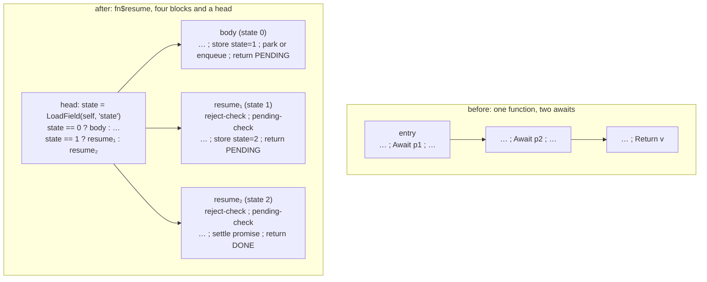

# 58. Making the program static   ⟨ N ⟩

A native backend can call a function whose name it knows. That is the whole of its calling
vocabulary. It cannot create an environment object at will, cannot call a value, cannot
suspend a C-level stack frame in the middle of a function and resume it later, and has no
interpreter to hand the hard case back to.

tera has closures, higher-order functions, `async`/`await` and generators anyway. This
chapter is the four payments. Each one turns a dynamic construct into something the class
table of [Ch 57 § minting-into-the-same-table] and a direct call already express: a captured
variable becomes a global or a field of a synthetic class; a function passed as an argument
becomes a *clone of the receiving function* with the argument deleted; and an `await`
becomes a heap frame, a state number, and a resume function called by name. When all four
are done, a compiled tera program contains exactly one indirect call in it — and that one is
required, for a reason worth waiting for.

`docs/example/stats-closure.tera` supplies the closure half and only the closure half. Its
`scaler`/`scale` pair compiles; its second line, `values.map(double)`, does not, because no
backend implements `map` (see § honesty-items). So monomorphisation cannot be shown from the
example set at all. It appears here as a probe under "Verify it yourself" and never as a
listing beside the running example ([Conventions § 2](../CONVENTIONS.md)).
`docs/example/stats-async.tera` supplies the coroutine half, and compiles clean.

**What arrived.** From [Ch 57 § minting-into-the-same-table]: a `ClassTable` built once from
checker types, with `defineSynthetic` still open, and the knowledge that a synthetic class is
indistinguishable from a user class — it gets a layout, an id, a `tera_classes` row,
a reference-offset list and therefore precise collection, for free. This chapter is the
biggest customer of that door: every frame it invents is a row in that table.

> **A note on order.** Chapters 57 and 58 are told in the order that makes them readable, not
> the order they run. `buildClassTable` happens first, in `src/api/engine.ts`. Everything in
> *this* chapter is a **module-level** stage in `src/optimizing/drivers/aot.ts:689-830`.
> Chapter 57's `class-member-lowering` and `array-allocation-shapes` are **per-function**
> passes inside `targetLegalizationPipeline`, and run *after* all of it. The class table is
> what lets the two halves be told apart: it is built before either, and both spend it.

## Four things a native target cannot do

Here are the four debts, and the one-line shape of each payment.

**No environment object it can create at will.** A closure needs somewhere to keep the
variables it captured, alive for as long as the closure is. The interpreter allocates a
context ([Ch 20 § open-cells-alias-the-frame]). A native backend can allocate — but only a
*shape the class table already knows*. **Payment:** mint the environment as a synthetic
class before compilation begins, and pass it as an ordinary parameter.

**No way to call a value.** A `CallKnownFunction` names a symbol the linker resolves. A
`GenericCall` on a value needs a function pointer, a signature agreed at run time, and a
compiler that has given up on knowing the callee. **Payment:** clone the function that takes
the callback, once per callback it is actually handed, and turn the call into a named one.

**No way to suspend a stack frame.** `await` means *stop here, let other code run, continue
later at this point with these values*. A C stack frame that returns is gone. **Payment:**
move the locals to the heap, cut the function at its suspend points, and re-enter at the top
with a state number.

**No interpreter underneath.** Every one of the above must be *decided at compile time*.
Where the JIT could keep a `CheckCallTarget` and deoptimize when the callee turned out to be
someone else ([Ch 49 § speculative-taint]), the native compiler must resolve the callee or
leave the function to the interpreter ([Ch 56 § refusing-well]).

The four payments are fifteen named stages in one function. `src/optimizing/drivers/aot.ts`
runs them in order — `uniquify-graph-names`, `name-callee-constants`, `module-captures`,
`drop-function-bindings`, `error-surface`, `module-start`, `promote-run-once-globals`,
`closure-conversion`, `promise-surface`, `argument-specialization`, `name-function-values`,
`adopt-inferred-types`, then `requireDeclaredParameters`, `module-signatures`,
`declare-global-variables` (`:689-717`) — and finally the two splitters, `splitGenerators`
(`aot.ts:473-539`, called at `:752`) and `splitCoroutines` (`aot.ts:541-570`, called at
`:812`). This chapter walks four of those fifteen and both splitters.

## A top-level variable is not a capture

The first stage is the cheapest win and it is run first, at `aot.ts:691`.

> **New idea. Free variable and capture.** A *free variable* of a function is a name the
> function uses but does not declare and does not take as a parameter — it must come from an
> enclosing scope. When a function value outlives that enclosing scope, the variable has to
> come with it; that is a *capture*, and it is why a closure is more than a code address.

`lowerModuleCaptures` rests on one observation: **a module's top level is a scope, and a
function that captures a top-level variable is not really closing over anything.** There is
exactly one of it, for the whole program's life. It does not need a per-closure environment;
it needs a global.

So the read becomes `LoadGlobal` and the write `StoreGlobal`, keyed so that two modules
cannot collide:

```ts
function scopedVariable(
  scope: RegisterCompiledFunction,
  slot: number,
  fallback: string | null,
  isVariable: NameFilter,
): ModuleVariable | null {
  const held = isVariable(scope.localNames[slot] ?? fallback);
  if (held === null) return null;
  return { name: cellKey(scope.moduleSpec, held), declaredType: scope.localTypes[slot] ?? null };
}
```
— `src/optimizing/metadata/module-captures.ts:53-62`

`cellKey(scope.moduleSpec, held)` is the key: an imported module's `total` and the entry
module's `total` are different globals, and the name says which
`[t: tests/optimizing/metadata/module-captures.test.ts > "keys the imported variable by its module so it cannot collide with the entry's"]`.

`moduleVariableOf` (`:64-81`) is the same question asked from further away. A function nested
three deep does not see the module scope directly; it sees an upvalue of its creator, which
is an upvalue of *its* creator, and so on. So the resolution recurses through the chain,
following `UPVALUE_CAPTURE` links up until it reaches a `LOCAL_CAPTURE` — and then checks
that the creator holding that local is a *scope* rather than a maker.

The definition of "scope" is worth reading carefully, because it is what distinguishes a
module from a closure factory:

```ts
  const scopes = new Set<RegisterCompiledFunction>();
  for (const unit of module.units) {
    const compiled = unit.compiledFunction;
    if (compiled !== null && !creators.has(compiled)) scopes.add(compiled);
  }
  scopes.add(entry);
```
— `src/optimizing/metadata/module-captures.ts:167-172`

**Every compiled function that nothing creates**, plus the entry. `creators` is built by
`creatorsIn` (`:35-44`), which walks each function's constant pool for nested
`RegisterCompiledFunction`s. A function that appears in nobody's constants is not a nested
function; it is a top level. A `scaler` that returns an inner `scale` *is* in nobody's
constants either — but `scale` is in `scaler`'s, so `scale` is not a scope, and its capture
of `factor` is left alone for the next stage
`[t: tests/optimizing/metadata/module-captures.test.ts > "leaves a capture of something that is not a module scope alone"]`.

Then the payoff. Once **every** upvalue of a nested function has become a global, the
function has no environment left, so the `MakeClosure` that built it is pointless.
`unwrapClosures` (`:121-146`) replaces it with a plain `Constant` holding the compiled
function, copying every prop except the three that made it a closure
(`CLOSURE_PROPS = new Set(["constIdx", "compiled", "captures"])`, `:119`). The gate is
strict — `compiled.upvalues.every((_, index) => variableOf(index) !== null)` (`:195`) — one
unresolved upvalue and the closure stays a closure.

One correctness detail is easy to miss and is exactly right. The bytecode compiler emits a
store of `undefined` into a context slot to *declare* it. A global needs no declaring, so the
store is deleted rather than spelled out:

```ts
      if (node.type === IR_STORE_CONTEXT_SLOT && isUndefinedConstant(node.inputs[0])) {
        editor.remove(node);
        rewritten += 1;
        continue;
      }
```
— `src/optimizing/metadata/module-captures.ts:95-99`

Spelling it would write `undefined` into a global whose declared type may not admit an
absence, and [Ch 56 § when-the-join-conflicts] would then refuse the whole function for a
value the program never had
`[t: tests/optimizing/metadata/module-captures.test.ts > "drops a write of undefined rather than spelling it as a global store"]`.

## What a closure actually is

What survives the previous stage is a real closure: a function that captures something with
a lifetime shorter than the program's.

> **New idea. A closure is code plus an environment.** The code is fixed at compile time —
> one body, however many closures are made from it. The environment is per-closure: the
> particular `factor` this `scale` was made with. tera's interpreter represents the
> environment as a *context*, an object of slots, and the bytecode reads it with
> `LoadContextSlot(source, slot)` and writes it with `StoreContextSlot`. The `source` prop is
> either `"local"` — a slot in the *maker's* own context, which the maker also uses directly
> — or `"upvalue"` — a slot the closure inherited from its creator ([Ch 20 § close-upvalues]).
> Two names for the same storage, seen from the two ends.

That representation is exactly what a native backend cannot have, because *creating* a
context is creating an object of a shape nobody declared, and *reading* a slot is reading an
offset nobody computed.

> **New idea. Closure conversion, or lambda lifting.** The transformation that removes
> closures from a language: make the environment an explicit **parameter** of the function,
> and rewrite every free-variable reference into an access through that parameter. What is
> left is a plain top-level function, and the closure *value* is whatever the environment
> turns out to be. The name "lambda lifting" is for the variant that lifts the body to the
> top level; the name "closure conversion" is for the variant that keeps the environment as a
> record. tera's pass does both at once, which is why it is called
> `src/optimizing/metadata/closure-conversion.ts` and its entry point is `convertClosures`
> (`:423-426`).

The rest of this half is about which of the two forms the environment takes, and the answer
is that there are two and the cheap one is common.

## The fast path nobody explains

`capturedOf` (`closure-conversion.ts:153-188`) makes one decision, and the whole of it is in
these eleven lines:

```ts
  if (!mutates && held.length === SINGLE_CAPTURE) {
    const only = held[CAPTURE_SLOT]!;
    return {
      unit,
      creator,
      held,
      captured: only.value,
      capturedType: only.declaredType,
      frame: null,
    };
  }
```
— `src/optimizing/metadata/closure-conversion.ts:172-182`

**One capture, never written: there is no environment, only a value.** The closure *is* the
captured value. So three things happen and none of them allocates:

`retireCreator` (`:275-297`) replaces the maker's `MakeClosure` with the captured value
itself — `editor.replaceAllUses(made, closure.captured)` — and rewrites the maker's own
`local` slot reads into direct uses of that value.

`liftBody` (`:217-250`) prepends a parameter to the closure's body and replaces every
`upvalue` slot read with it (`:229-232`), then rewrites the declared signature to put the
captured type at the front.

`answersClosure` (`:299-309`) checks that *every* `Return` in the maker answers the captured
value, and if so retypes the maker's return to the captured type. A maker with two returns,
one of which answers something else, does not qualify — the loop returns `false` on the first
mismatch.

That is what `stats-closure.tera` prints, and it is why `scaler` compiles to a one-liner:

```c
double scaler(double p0) {
  return (double)p0;
}

double scale(double p0, double p1) {
  const double v0 = (double)p1 * (double)p0;
  return (double)v0;
}
```
— `stats-closure.c:1223-1230`, from `tera compile --emit source --target c`

`scale` gained a parameter *at the front* — `p0` is `factor`, `p1` is `x`, and the
multiplication reads `p1 * p0`. `scaler` collapsed to `return factor`, because the closure
value now **is** the captured value. No allocation, no frame, no context slot left for a
backend to refuse.

The condition has two clauses and both are load-bearing. Drop `held.length ===
SINGLE_CAPTURE` and you would need to pass several values, which is a record, which is the
slow path. Drop `!mutates` and you have a real bug: a *written* capture is shared mutable
state between the maker and the closure — the maker's `local` slot and the closure's
`upvalue` slot are the same storage — and a copied value cannot be shared. Two closures made
from one maker would then disagree about a counter they are both supposed to be incrementing.

`[t: tests/optimizing/metadata/closure-conversion.test.ts > "takes what it captured as its own first parameter"]`
`[t: tests/optimizing/metadata/closure-conversion.test.ts > "hands the captured value over without building a frame for it"]`
`[t: tests/optimizing/metadata/closure-conversion.test.ts > "leaves an unwritten lone capture unboxed"]`
`[t: tests/optimizing/metadata/closure-conversion.test.ts > "leaves no context slot for a backend to refuse"]`

## Otherwise a frame class

Several captures, or one that is written, and the environment becomes an object. This is the
first use of chapter 57's door:

```ts
function closureFrameShape(
  classes: ClassTable,
  fn: string,
  held: readonly Held[],
): ClassShape {
  return classes.defineSynthetic(
    syntheticSurface(
      `${CLOSURE_FRAME_PREFIX}$${fn}`,
      null,
      held.map((one) => [capturedFieldName(one.slot), one.declaredType] as const),
    ),
  );
}
```
— `src/optimizing/metadata/closure-conversion.ts:190-202`

One class named `tera_closure$<fn>`, with one field `captured<slot>` per captured slot, each
typed by **what the maker actually stored** rather than by what the slot was declared as.
That is `heldValuesOf` (`:132-151`) walking to `storedInSlot` (`:91-104`), which skips
`undefined` stores — the declaration — and refuses outright if two different values reach one
slot:

```ts
      const stored = node.inputs[0] ?? null;
      if (stored === null || isUndefinedConstant(stored)) continue;
      if (value !== null) return null;
      value = stored;
```
— `src/optimizing/metadata/closure-conversion.ts:97-100`

`buildFrame` (`:204-215`) allocates the frame in the **maker's entry block**, before the
first instruction, so it exists before the closure does and before any branch could skip it.
The allocation is an ordinary `irNewObject` stamped with `CLASS_ID_PROP`,
`INSTANCE_SIZE_PROP` and `VALUE_CLASS_PROP` — the same three props
[Ch 57 § spending-the-table] stamps on `Foo()`.

Then `rewriteAgainstFrame` (`:252-273`) rewrites **both sides against that one allocation**.
The closure's `upvalue` slot reads become `LoadField` on its new parameter; the maker's own
`local` slot reads and writes become `LoadField`/`StoreField` on the allocation. Both ends
now name the same heap field — and *that* is what makes a written capture shared, rather than
copied. It is the same object, at the same address, at the same offset.

The layout consequence is [Ch 57] paying off within one pass of being established. A closure
frame is a class, so it has a size, an id, a `tera_classes` row and a
`referenceFieldOffsets` list. A captured object is a `SCALAR_POINTER` field, so the collector
traces it exactly, with no code anywhere that knows what a closure is
([Ch 61 § marking]). Nothing was added to the runtime to support closures. The object model
already existed and closures were made to fit it.

`[t: tests/optimizing/metadata/closure-conversion.test.ts > "takes one frame carrying every value it captured"]`
`[t: tests/optimizing/metadata/closure-conversion.test.ts > "names one field of that frame for every slot the closure reads"]`
`[t: tests/optimizing/metadata/closure-conversion.test.ts > "builds the frame in the maker and stores every captured value into it"]`
`[t: tests/optimizing/metadata/closure-conversion.test.ts > "reads each captured value back off the frame inside the closure"]`
`[t: tests/optimizing/metadata/closure-conversion.test.ts > "boxes a lone capture into a frame instead of handing over its value"]`
`[t: tests/optimizing/metadata/closure-conversion.test.ts > "writes the capture back into that frame"]`
`[t: tests/optimizing/metadata/closure-conversion.test.ts > "reads the maker's own view of the capture back off the frame"]`
`[t: tests/optimizing/metadata/closure-conversion.test.ts > "carries the values in the order the slots were captured, not merged into one"]`

## What closure conversion refuses

It does not refuse. It **declines**, silently, by answering `null` and leaving the closure
exactly as it was for someone else to reject. There are four ways out, and none of them
writes a sentence:

| where | what it means |
| --- | --- |
| `closure-conversion.ts:160` | the closure has `local` context slots of its own — it is a maker as well as a closure |
| `:141` (in `heldValuesOf`) | an upvalue that is not a `local` of the creator — the chain goes further than one hop |
| `:143` | no single value reaches the slot: none stored, or two different ones |
| `:147` | the captured value's type cannot be named, so a frame field could not be typed |
| `:169-171` | a slot the closure reads that no held value covers |

The design difference from [Ch 56 § the-shape-of-a-refusal] is worth naming, because chapter
56 spends its whole length arguing that a refusal must be a sentence a programmer can act on.
This pass produces no sentence at all. What the user eventually sees comes from
`analyzeAotLegality`, naming the surviving `LoadContextSlot` — a downstream symptom, not the
cause. That is the exact pattern [Conventions § 5](../CONVENTIONS.md) exists for, and it is
raised as an honesty item below.

The distinction is real, though, and it is why the pass declines rather than refuses: a
closure it cannot convert may still be compiled another way. `lowerModuleCaptures` may
already have removed the capture; `promote-run-once-globals` may have hoisted the maker;
the inliner may make the whole question moot. A refusal here would foreclose all of that.

`[t: tests/optimizing/metadata/closure-conversion.test.ts > "leaves a closure whose captured value it cannot name"]`
`[t: tests/optimizing/metadata/closure-conversion.test.ts > "types the frame off the real store, not the empty declaration before it"]`
`[t: tests/optimizing/metadata/closure-conversion.test.ts > "finds the captured value when the maker's slot is not the upvalue index"]`

## A parameter that is only ever called

The second payment. The eligibility test is six lines, and the surprise is what it does
*not* say:

```ts
function calledParametersOf(graph: CFGFunction): readonly number[] {
  const called: number[] = [];
  graph.parameters.forEach((parameter, index) => {
    if (parameter.uses.length === 0) return;
    const alwaysTheTarget = parameter.uses.every(
      (use) => use.type === IR_GENERIC_CALL && use.inputs[0] === parameter,
    );
    if (alwaysTheTarget) called.push(index);
  });
  return called;
}
```
— `src/optimizing/passes/function-argument-specialization.ts:38-48`

Not "a parameter of function type". **A parameter every one of whose uses is a call with the
parameter as the callee.** The stricter rule is the right one and the reason is the whole
point of the pass: a function value that is *stored* in a field, *compared*, or *returned*
would still need a representation at run time — a code pointer, a scalar, a field width. One
that is only ever called never has to exist at all. The rule is not "which parameters are
functions", it is "which parameters can be made to disappear".

> **New idea. Monomorphisation.** One function that works for many callees is *polymorphic*
> in its callee. Monomorphisation replaces it with one copy per callee actually used, each
> copy having the callee baked in. It is how Rust compiles generics and how a C++ template is
> instantiated, and the trade is always the same: code size for indirection. Here the
> indirection is not merely slow, it is *unrepresentable*, so the trade is not a tuning
> decision — it is compile or refuse.

The algorithm is `Specializer.specialize` (`:191-244`):

1. Find the called parameters. If none, stop.
2. Find every call site of this function anywhere in the module, including in clones added
   earlier (`callSitesOf`, `:174-189`).
3. For each site, resolve every called-parameter argument to a *named function*
   (`handoffAt`, `:162-172`). **If any one site fails, abandon the whole function** — line
   203 is `return`, not `continue`.
4. Adopt written types: if the taker declared the parameter as `(float) -> float`, push those
   types onto the handed function's own signature (`adoptWrittenTypes`, `:50-70`). This is
   how an untyped callback gets a type
   `[t: tests/e2e/optimizing/aot/higher-order.test.ts > "gives an untyped callback the types of the parameter it fills"]`.
5. Clone the taker once per distinct combination, named by `nameFor` (`:72-74`) as
   `owner$callee$callee…`; inside the clone, rewrite the calls through the parameter into
   direct calls (`bindCallees`, `:92-101`); delete the parameter (`withoutParameters`,
   `:120-135`); redirect each site to its clone (`redirect`, `:137-142`).

Step 3's `return` is a real design decision, not an oversight, and it is expensive — see
§ honesty-items.

The measured result on a three-function probe (its text is the `printf` under "Verify it
yourself"; `apply` takes `f: (float) -> float`, `double` doubles, and `scaled` calls
`apply(double, v)`) is one line of the emitted header:

```c
double apply_double(double p0);
```
— `mono.h`, from `tera compile --emit source --target c`

`apply$double` — one parameter, not two. The function argument was **deleted**, not passed
and ignored. The interpreter prints `31.40` and so does the binary.

`[t: tests/optimizing/passes/function-argument-specialization.test.ts > "clones the taker once for the function it was handed"]`
`[t: tests/optimizing/passes/function-argument-specialization.test.ts > "calls the handed function by name inside the clone"]`
`[t: tests/optimizing/passes/function-argument-specialization.test.ts > "drops the parameter the function arrived in, since the name says it all"]`
`[t: tests/e2e/optimizing/aot/higher-order.test.ts > "keeps two callbacks apart at two call sites"]`
`[t: tests/e2e/optimizing/aot/higher-order.test.ts > "shares one copy when the same callback is handed over twice"]`
`[t: tests/e2e/optimizing/aot/higher-order.test.ts > "takes a named function as a value"]`

## When the callback is a closure

The two halves meet here, and the meeting is the reason `dropped` is a computed set rather
than "all of them":

```ts
    const dropped = new Set(
      indices.filter((index) =>
        handoffsByIndex.every((chosen) => !chosen.get(index)!.captured),
      ),
    );
```
— `src/optimizing/passes/function-argument-specialization.ts:223-227`

A parameter is dropped only when **every** site handed it a plain function. If any site
handed it a *closure* — a value carrying `CLOSURE_CAPTURE_PROP`, stamped by
`Conversion.markClosureValues` (`closure-conversion.ts:356`) — the parameter is **kept**,
because after § the-fast-path-nobody-explains that value is no longer a function. It is the
closure's frame, or its single captured value, and the clone still needs it.

Two small pieces follow from that. `retypeCaptures` (`:105-118`) retypes the surviving
parameter as the callee's *first* parameter type — the one `liftBody` prepended — so the
clone's signature says `tera_closure$scale` or `float` rather than a function type. And
`bindCallees` passes it through as argument zero instead of dropping it:

```ts
      const args = handoff.captured ? use.inputs.slice() : use.inputs.slice(1);
```
— `src/optimizing/passes/function-argument-specialization.ts:97`

`slice(1)` drops the callee from the argument list, because the callee has become the call's
*name*. `slice()` keeps it, because the "callee" is now the environment and the environment
is argument zero of the lifted body.

**The general rule:** monomorphisation removes the *code* half of a closure and leaves the
*environment* half. That is exactly the split § what-a-closure-actually-is set up — code is
fixed at compile time and can be baked into a name; the environment is per-value and must
still travel. Two passes, written independently, that agree on where the seam is.

`[t: tests/optimizing/passes/function-argument-specialization.test.ts > "clones the taker for the closure the caller built"]`
`[t: tests/optimizing/passes/function-argument-specialization.test.ts > "keeps the parameter, because the frame it carries is still needed"]`
`[t: tests/optimizing/passes/function-argument-specialization.test.ts > "retypes that parameter as the frame the closure body reads"]`
`[t: tests/optimizing/passes/function-argument-specialization.test.ts > "hands the frame over as the first argument of the closure body"]`
`[t: tests/e2e/optimizing/aot/higher-order.test.ts > "declines a callback the compiler cannot pin down"]`

That last test is the boundary, and it is worth seeing what falls off it: a callback selected
out of an array — `fs = [v => v * 2, v => v + 1]` then `apply(fs[n], 3)` — cannot be resolved
to a name, so the whole function is abandoned and the refusal names `unsupported generic
call`. The compiler is not being conservative about a hard case. It genuinely does not know
which function that is.

## What a suspend costs

The third payment, and the largest. An `await` in the middle of a function means: **stop
here, let other code run, and later continue at this point, with these values.**

The interpreter has a frame object it can park — locals, an offset, a resumption record
([Ch 30 § runasyncwithsuspension]). A native binary has a C stack it does not control: when
a function returns, its locals are gone, and there is no mechanism to return from the middle
of a function and come back to that middle later.

> **New idea. A coroutine as a state machine.** Cut the function at each suspend point. Move
> every value that must survive a cut into a heap object. Give the object a number saying
> where execution had got to. Then re-entering is: call an ordinary function with the object
> as its argument, read the number, and jump to the right piece. The function never suspends —
> it *returns*, and is *called again*. Nothing on the C stack has to survive anything.

The shape of the answer is three objects, all declared in
`src/optimizing/metadata/coroutines.ts` and all minted through `defineSynthetic`
(`coroutineBaseShapes`, `:82-106`):

A **frame**, `<fn>$frame`, extending `tera_frame`. The base carries three fields — `coroutine`
(the resume routine, declared `"(tera_frame) -> int"`), `state` (an `int`), and `next` (the
queue link, a `tera_frame`) — and the per-function subclass adds `result` (its promise), one
`param<n>` per parameter, and one `slot<n>` per spilled value. Because every frame extends the
same base, the scheduler can walk a queue of frames belonging to different coroutines and read
the same three fields off each
`[t: tests/optimizing/metadata/coroutines.test.ts > "gives every frame the same header so the queue can walk any of them"]`.

A **promise**, `<fn>$promise`, extending `tera_promise`: `state`, `waiting`, `waiter`,
`unreported`, `nextRejected`, `error`, `errorValue`, plus a `value` field typed by the
function's declared return.

A **resume function**, `<fn>$resume`, with signature `(tera_frame) -> int`. It is an ordinary
compiled function. Its `internal` and `resumable` flags are set, and nothing else about it is
special.

All three are class-table rows, which is why the collector traces a suspended coroutine
correctly without knowing what one is
`[t: tests/optimizing/metadata/coroutines.test.ts > "traces the queue link and the promise a frame is holding"]`
`[t: tests/optimizing/metadata/coroutines.test.ts > "lays every synthetic shape out after the object header"]`
`[t: tests/optimizing/metadata/coroutines.test.ts > "gives each synthetic shape a distinct id the class table can emit"]`.

## No await, no machine

Before any of that machinery runs, `splitInPlace` asks whether it is needed:

```ts
  const points = suspendPointsOf(graph, classes, promiseOf);
  if (points.length === 0) return settleInPlace(graph, classes, promise);
```
— `src/optimizing/passes/coroutines.ts:920-921`

`settleInPlace` (`:876-903`) keeps the function's body exactly as it is. It allocates the
promise in the entry block, marks it resolved and unwaited, and rewrites every `Return` into
"store the value into the promise, record the settlement, return the promise". No frame, no
resume function, no state field, and `CoroutineSplit.resume` is `null`.

That is `load` in `stats-async.tera`. It is `async`, so it must answer a promise; it contains
no `await`, so it never suspends. The emitted header says so in one line:

```c
unsigned char * load(const tera_char *p0);
unsigned char * mean_of(const tera_char *p0);
unsigned char * tera_main(void);
```
— `stats-async.h`

Three functions, three promise-returning signatures. But grep the `.c` for `_resume` and only
two appear: `mean_of_resume` and `main_resume`. `load` has none.

**The rule: `async` alone costs a promise; `await` costs a state machine.** It is worth
stating because the cost difference is large and the syntax difference is one word. A
function that is `async` only so that its callers may `await` it pays for one allocation and
three stores. A function that actually suspends pays for a second allocation, a spill of every
live value, a rewritten control-flow graph and a dispatch chain on every entry.

## Cutting the blocks

`suspendPointsOf` (`:470-509`) walks the blocks looking for `IR_AWAIT`. For each one it calls
`severAfter`, which is the surgical primitive the whole transformation rests on:

```ts
export function severAfter(graph: CFGFunction, block: CFGBlock, at: number): CFGBlock {
  const tail = graph.addBlock();
  for (const node of block.nodes.splice(at + 1)) {
    node.block = tail;
    tail.nodes.push(node);
  }
  tail.terminator = block.terminator;
  tail.successors = block.successors;
  block.successors = [];
  block.terminator = null;
  for (const successor of tail.successors) {
    successor.predecessors[successor.predecessors.indexOf(block)] = tail;
  }
  block.addNode(irJump(tail));
  link(block, tail);
  return tail;
}
```
— `src/optimizing/passes/coroutines.ts:332-348`

Everything after the `Await` moves into a new block, the terminator and successors move with
it, every successor's predecessor list is repointed, and the original block is given a jump
to the tail. The tail is the **resume block** for state *n*, and it is a perfectly ordinary
block — which is the point. The graph is still a valid CFG after every cut, so every
downstream pass and the SSA verifier of [Ch 38 § validategraphinvariants] still apply.

The `Await` node itself is then unlinked and the value it produced is replaced by a
`LoadField` of the awaited promise's `value` field (`deliverSettled`, `:273-296`), and two
guards go into the resume block: `raiseWhenRejected` (`:416`) re-raises a rejection into the
resuming function, and `stopWhenPending` (`:444`) returns instead of reading the value of a
promise that has not settled
`[t: tests/optimizing/passes/coroutines.test.ts > "stops instead of reading the value of a promise that is still pending"]`.



One refusal is written at this stage, and it is the whole-module answer showing through:

> `<fn> awaits a promise the compiler cannot trace back to the function that settles it;
> await the call directly, or keep this part interpreted`

— `src/optimizing/passes/coroutines.ts:491-494`

`promiseOf` maps a call node to the `<fn>$promise` shape of the function it calls, using the
module-wide `plan.promises` built before splitting. Awaiting is compilable only when the
compiler can name *which* promise shape the awaited value has, because it has to emit a
`LoadField` at that shape's `value` offset. `await someVariable` where the variable came from
a branch, or an array, or a parameter, has no single shape — hence the message's advice,
which is not a platitude but the literal fix: `await load(name)` names the callee, and
`p = load(name)` then `await p` does not.

## Deciding what the frame must hold

`FrameSpills` (`:587-674`) is the analysis at the centre of the split, and it answers one
question: which values must survive a suspend?

> **New idea. Live-in at a program point.** A value is *live* at a point if it has already
> been defined and will still be used later. The *live-in* set of a block is every value live
> on entry to it. It is the standard dataflow answer to "what does this piece of code need
> handed to it", computed backwards from uses, and [Ch 42 § dominance] built the CFG
> machinery it runs on. Here it has an unusually direct meaning: a value live at a resume
> block is a value the coroutine must still have when it comes back, which is to say, a value
> that must be in the frame.

> **New idea. Spilling.** Moving a value out of a register (or, here, out of SSA) into
> memory, because it cannot stay where it is across some event. In a register allocator the
> event is running out of registers ([Ch 66 § spilling]); here it is a function return.

The constructor is twenty lines and the shape of it is the argument:

```ts
    graph.parameters.forEach((parameter, index) => {
      declare(parameter, coroutineParameterName(index));
    });
    const liveness = computeValueLiveness(graph);
    const carried = new Set<CFGInstruction>();
    for (const point of points) {
      for (const value of liveness.liveIn(point.resume)) carried.add(value);
    }
    let spilled = 0;
    for (const block of graph.blocks) {
      for (const node of block.nodes) {
        if (!carried.has(node) || node.type === IR_CONSTANT || this.names.has(node)) continue;
        declare(node, coroutineSlotName(spilled++));
      }
    }
```
— `src/optimizing/passes/coroutines.ts:616-630`

Every parameter gets a slot unconditionally, because the frame is built before the body runs
and the body reads its parameters from it. Everything else is the **union of `liveIn` over
every resume block**, minus two exclusions that make this a real analysis rather than "save
everything":

**A value consumed before the suspend never appears.** It is not live at the resume block, so
it is not in the union, so it costs no field, no store and no load
`[t: tests/optimizing/passes/coroutines.test.ts > "leaves a value consumed before the suspend out of the frame"]`.

**A constant is never spilled.** `node.type === IR_CONSTANT` is skipped, because a constant
can simply be re-emitted where it is needed.

Naming the slot's type is where this can fail, and the fallback chain is three deep:
`slotTypeOf` (`:570-575`) reads the lattice type, mapping an object to its class-table shape
name; `loadedElementType` (`:577-585`) recovers `string` for a read out of an all-string
constant array; `heldTypeNameOf` is the general declared-name recovery. If all three answer
nothing, the split refuses with a sentence naming the lattice kind it could not place:

> `<fn> keeps a <kind> value across a suspend, and the compiler has no frame slot for that
> type; annotate it, or keep this part interpreted`

— `src/optimizing/passes/coroutines.ts:608-609`

`[t: tests/optimizing/passes/coroutines.test.ts > "gives a frame slot to the values that outlive a suspend and to nothing else"]`
`[t: tests/optimizing/passes/coroutines.test.ts > "gives the array a frame slot rather than refusing to split"]`
`[t: tests/optimizing/passes/coroutines.test.ts > "names that slot by the shape the array has, not by a number"]`
`[t: tests/optimizing/passes/coroutines.test.ts > "names a slot holding an array of text the same way"]`

## Two passes that shrink the frame

*(Why the obvious design fails.)*

The obvious frame holds every live value, and it is correct. It is also bigger than it needs
to be in a way that is easy to fix, and two rewrites run **immediately before** `FrameSpills`
specifically to shrink the live set:

```ts
  localizeRuntimeBases(graph);
  localizeConstantArrays(graph);
  const spills = new FrameSpills(graph, classes, points);
```
— `src/optimizing/passes/coroutines.ts:922-924`

> **New idea. Rematerialization.** Instead of keeping a value alive across a region — in a
> register, or here in a heap frame — recompute it where it is used. It pays when the value
> is cheap to rebuild and the storage is expensive, and it is only *legal* when rebuilding
> produces something indistinguishable from the original. That last condition is the whole
> subtlety, and it is a question about identity, not about cost.

Both rewrites are the same function with a different predicate — `localizeInto` (`:511-541`)
copies a selected node into every block that uses it, and repoints those uses at the copy.

`localizeRuntimeBases` (`:543-549`) selects `IR_RUNTIME_BASE`, the address of a runtime table
such as `tera_statics`. A table's address is a link-time constant; keeping it in a frame field
would be storing a compile-time answer in a heap object.

`localizeConstantArrays` (`:562-568`) selects all-constant `NewArray` nodes — but only when
`rematerializable` proves every use is a read:

```ts
function rematerializable(node: CFGInstruction): boolean {
  if (node.type !== IR_NEW_ARRAY) return false;
  if (!node.inputs.every((input) => input.type === IR_CONSTANT)) return false;
  return node.uses.every((use) => readsOnly(use, node));
}
```
— `src/optimizing/passes/coroutines.ts:556-560`

Three conditions, and the third is the one that matters. An array a later block **writes**, or
hands to a call that might keep it, has *identity*: two copies would be two arrays, and the
program would see the difference. An array only ever read from is a value, and a value may be
duplicated freely.

The trade is worth stating without adjectives, because there is no measurement of it anywhere
in this tree. A frame field costs eight bytes of heap plus a store at the definition and a
load at every reading block; a rematerialized array costs an allocation per reading block.
Neither is obviously smaller, and which wins depends on how many blocks read it and how many
suspends it crosses. The rule the tree chose is not "whichever is cheaper" — it is
**duplicate only what has no identity**, which is a correctness rule that happens to also be
a size heuristic.

`[t: tests/optimizing/passes/coroutines.test.ts > "copies the array into the block that only reads an element of it"]`
`[t: tests/optimizing/passes/coroutines.test.ts > "copies it into a block that only asks how long it is"]`
`[t: tests/optimizing/passes/coroutines.test.ts > "leaves an array a later block writes into where it was built"]`
`[t: tests/optimizing/passes/coroutines.test.ts > "leaves an array handed to a call where it was built, since the call may keep it"]`

## Spill, store, reload

Deciding what goes in the frame is half of it. The other half is rewriting the graph so that
the frame is actually how values travel — and doing it without breaking SSA.

`spillInto` (`:633-642`) inserts a `StoreField` immediately after each spilled value's
definition. "Immediately after" needs care for a phi, which is not in the block's node list at
all:

```ts
  private definitionEnd(value: CFGInstruction): number {
    const block = value.block!;
    return value.type === IR_PHI ? block.phis.length : block.nodes.indexOf(value) + 1;
  }
```
— `src/optimizing/passes/coroutines.ts:644-647`

A phi's store goes at the very top of the block, after the phis and before the first
instruction, because a phi is conceptually evaluated on entry.

Then `reloadUses` (`:649-660`) redirects every use in *another* block to a `LoadField`
inserted at the top of the using block. The one trap is the phi case, and it is handled:

```ts
        const where = use.type === IR_PHI ? owner.predecessors[index]! : owner;
```
— `src/optimizing/passes/coroutines.ts:655`

A phi input is not used *in* the phi's block; it is used *on the edge* from the corresponding
predecessor ([Ch 39 § phi-inputs-are-parallel-to-predecessors]). Inserting the reload at the
top of the phi's own block would mean loading before all the predecessors had run, and worse,
would load one value where the graph needs one per edge. So the reload goes at the top of
`predecessors[index]`, and the index-to-predecessor correspondence is what makes that
well-defined.

Reloads are memoized per `name@block` (`valueAt`, `:662-673`), so a block reading the same
slot four times pays for one load.

**The invariant this establishes:** after `spillInto`, no spilled value crosses a block
boundary except through the frame. That is precisely what makes re-entering the function at
the dispatch head legal — the head has no incoming values to supply, because nothing needs
any
`[t: tests/optimizing/passes/coroutines.test.ts > "leaves the lowered graph in SSA form"]`.

## The state dispatch chain

```ts
export function dispatchStates(
  resume: CFGFunction,
  classes: ClassTable,
  frame: ClassShape,
  self: CFGInstruction,
  targets: readonly CFGBlock[],
): CFGBlock {
  const head = resume.addBlock();
  const out = new Emitter(classes, head);
  const state = out.load(self, frame, CORO_STATE_FIELD);
  let block = head;
  for (let index = 0; index < targets.length - 1; index++) {
    const test = new Emitter(classes, block);
    const matches = test.add(irInt32Compare("==", state, test.constant(index)));
    const next = resume.addBlock();
    block.addNode(irBranch(matches, targets[index]!, next));
    link(block, targets[index]!);
    link(block, next);
    block = next;
  }
  const last = targets[targets.length - 1]!;
  block.addNode(irJump(last));
  link(block, last);
  return head;
}
```
— `src/optimizing/passes/coroutines.ts:850-874`

A new head block loads `state` off the frame and tests it against `0, 1, 2, …`, jumping to
the original body for `0` and to `points[n-1].resume` otherwise. The loop stops one short of
the end and the **last target is unconditional** — the same move as chapter 57's dispatch
ladder ([Ch 57 § the-dispatch-ladder]), for the same reason: the state can only be one of
these, so once the others are ruled out no test is needed. Two structurally identical
constructs, arrived at independently, both exhaustive by construction.

The head is then moved to the front with `takeBlocks` (`:945`), because a function's entry
block is whichever one is first.

What happens to the *original* function is the whole transformation in seventeen lines:

```ts
  graph.blocks = [];
  graph.entry = null;
  const opening = new Emitter(classes, graph.addBlock());
  const held = opening.allocate(promise);
  const created = opening.allocate(frame);
  opening.store(created, frame, CORO_RESULT_FIELD, held);
  opening.store(created, frame, CORO_ROUTINE_FIELD, opening.code(resume.name));
  opening.store(created, frame, CORO_STATE_FIELD, opening.constant(CORO_ENTRY_STATE));
  opening.store(held, promise, CORO_STATE_FIELD, opening.constant(CORO_STATE_PENDING));
  opening.store(held, promise, CORO_WAITING_FIELD, opening.constant(CORO_NOBODY_WAITING));
  opening.store(held, promise, CORO_UNREPORTED_FIELD, opening.constant(CORO_UNREPORTED));
  parameters.forEach((parameter, index) => {
    opening.store(created, frame, coroutineParameterName(index), parameter);
  });
  opening.add(irCallKnownFunction({ name: resume.name } as never, [created]));
  opening.add(irReturn(held));
```
— `src/optimizing/passes/coroutines.ts:948-963`

Empty its blocks. Allocate the promise and the frame. Wire the frame to the promise, the
resume routine and the entry state; wire the promise to pending, unwaited and unreported.
Store every parameter into its `param<n>`. Call `<fn>$resume(frame)` **by name** — once — and
return the promise.

That is what `mean_of` compiles to. The generated C is the same seventeen steps with the
offsets filled in:

```c
unsigned char * mean_of(const tera_char *p0) {
  tera_fn v0 = (tera_fn)mean_of_resume;
  ...
  unsigned char *v5 = tera_alloc(2096, 6);
  ...
  unsigned char *v8 = tera_alloc(1072, 13);
  ...
  (*(tera_fn *)(v8 + 8)) = v0;
  (*(int32_t *)(v8 + 16)) = v1;
  ...
  tera_str_set((tera_char *)(v8 + 40), 512, p0);
  mean_of_resume(v8);
  tera_context.root_count = roots;
  return v5;
}
```
— `stats-async.c:1298-1332`, elided

`v5` is the 2,096-byte `mean_of$promise` (shape 6), `v8` the 1,072-byte `mean_of$frame`
(shape 13). `v8 + 8` is `coroutine`, holding the address of `mean_of_resume` as a `tera_fn`.
`v8 + 16` is `state`, set to 0. `v8 + 40` is `param0`, and because that parameter is a string
the store is a `tera_str_set` into the frame's own inline text
([Ch 59 § storage-an-object-owns-privately]). Then a direct call, and a return of the promise.

`[t: tests/optimizing/passes/coroutines.test.ts > "resumes at one label per suspend and keeps the entry state"]`
`[t: tests/optimizing/passes/coroutines.test.ts > "hands the collector a frame whose references are all set before the next allocation"]`
`[t: tests/optimizing/passes/coroutines.test.ts > "re-points the queue link at every frame it enqueues"]`
`[t: tests/optimizing/passes/coroutines.test.ts > "copies a string result into the promise instead of pointing at the buffer"]`
`[t: tests/optimizing/passes/coroutines.test.ts > "copies a thrown value into the promise and marks it rejected"]`

## Generators are the simpler sibling

`src/optimizing/passes/generators.ts` is 260 lines against `coroutines.ts`'s 1,378, and the
difference is almost entirely reuse. Its import list names ten symbols from `coroutines.ts` —
`Emitter`, `FrameSpills`, `dispatchStates`, `localizeConstantArrays`, `localizeRuntimeBases`,
`returnsOf`, `severAfter`, `unlink`, `withFreshNodeIds` and `CoroutineSplitError`
(`generators.ts:18-29`). Put the two `splitInPlace` functions side by side and they are the
same eleven steps.

That reuse is the section's claim, stated plainly: **a generator is a coroutine with no
promise, no queue and no rejection path.** Its frame is three fields plus slots — `state`,
`status`, `yielded` (`src/optimizing/metadata/generators.ts:20-33`) — where a coroutine frame
carries a routine, a queue link and a result promise. A yield stores the value and the next
state and returns `GEN_RUNNING` (`yieldAt`, `:160-172`); a return stores the terminal state
and returns `GEN_FINISHED` (`finishAt`, `:186-196`). And the machine has one extra state,
`done = points.length + 1` (`:210`), with its own block appended to the dispatch targets
(`:224-230`), so that a finished generator called again keeps answering finished rather than
falling into the body.

The original function becomes four lines: allocate the frame, store the entry state and
`GEN_RUNNING`, store the parameters, return the frame. There is no promise to allocate and no
resume call — a generator does not start until something asks it to step.

The part with no coroutine counterpart is the type of the `yielded` field. The frame has
**one** such field, so the compiler must name **one** type for the whole generator.
`generatorYieldType` (`:118-143`) walks every yielded value through `namedYield` (`:95-116`),
which reads a lattice kind, then a field's declared type, then treats `/` as always `float`,
then walks arithmetic operands recursively joining their names, and finally falls back to
`heldTypeNameOf`. Two refusals come out of it, both verbatim:

> `<fn> yields a value the compiler has no generator slot for; annotate what it yields, or
> keep this part interpreted`

> `<fn> yields both <a> and <b>, and a compiled generator yields one type; yield one type, or
> keep this part interpreted`

— `src/optimizing/passes/generators.ts:127-129` and `:135-138`

The second one names both types it could not join, which is the difference between a
diagnostic and an error code
`[t: tests/optimizing/passes/generators.test.ts > "names both types it could not join in the reason it gives"]`.

The joining rule is a design smell and is worth naming as one:

```ts
function joinedNames(carried: string, found: string): string | null {
  if (carried === found) return carried;
  const numeric = NUMERIC_YIELDS.has(carried) && NUMERIC_YIELDS.has(found);
  return numeric ? "float" : null;
}
```
— `src/optimizing/passes/generators.ts:89-93`

Identical names join; `int` and `float` widen to `float`; everything else refuses. There is no
lattice here, and there are two real join implementations elsewhere in the same directory
tree. See § honesty-items.

`[t: tests/optimizing/passes/generators.test.ts > "names a generator yielding whole numbers"]`
`[t: tests/optimizing/passes/generators.test.ts > "widens a generator yielding whole and fractional numbers to the wider one"]`
`[t: tests/optimizing/passes/generators.test.ts > "names a generator that yields whole arrays by the shape those arrays have"]`
`[t: tests/optimizing/passes/generators.test.ts > "names a generator that yields nothing at all"]`
`[t: tests/optimizing/passes/generators.test.ts > "refuses one that yields both a number and text"]`
`[t: tests/optimizing/passes/generators.test.ts > "widens a sum of a whole and a fractional number"]`
`[t: tests/optimizing/passes/generators.test.ts > "refuses a sum the compiler cannot read as a number"]`

## The one code pointer

Count what has been removed. Module captures removed the closure object. Closure conversion
removed the environment, or turned it into a parameter. Monomorphisation removed the callee
argument. Coroutine splitting turned a suspend into a direct call to a named `$resume`. Every
one of those was an indirect call, and every one of them is gone.

Exactly one is left, and it is *required*:

```ts
  const routine = step.load(head, base, CORO_ROUTINE_FIELD);
  const resumed = irGenericCall(routine, [head]);
```
— `src/optimizing/passes/coroutines.ts:1322-1323`

`buildDrain` (`:1270-1332`) is the scheduler. It pops a frame off the runtime queue and calls
it. It cannot know which coroutine that frame belongs to, because the queue holds frames from
every coroutine in the program and the whole purpose of the queue is that the order is decided
at run time. **A scheduler is the one place a program genuinely does not know what it is
calling** — not because the compiler failed to work it out, but because the answer is data.

> **New idea. A code pointer, and why one is enough.** A *code pointer* is a value holding the
> address of a function, and calling through it is an *indirect call*: the machine loads a
> word and jumps to it. Every dynamic-dispatch mechanism a language offers — vtables, function
> values, callbacks, virtual methods — bottoms out in one. They are not expensive so much as
> *opaque*: the compiler after the call site cannot say who runs, so it cannot inline, cannot
> propagate types through, and cannot prove anything about the callee's effects. Removing them
> is why the four transformations in this chapter exist. Keeping exactly one, at the one place
> where the target is genuinely runtime data, is the honest floor.

Three things make that one legal.

**It has a scalar.** `CORO_ROUTINE_FIELD` is declared `"(tera_frame) -> int"`
(`CORO_RESUME_TYPE`, `src/optimizing/metadata/coroutines.ts:7`), and `fieldScalarOf` answers
`SCALAR_CODE` for any declared type that parses as a function signature
(`class-table.ts:475`). `SCALAR_CODE` is pointer-sized and is **not** a reference scalar —
`isReferenceScalar` admits only `SCALAR_STRING` and `SCALAR_POINTER`
(`src/optimizing/types/scalar.ts:90-92`), and `referenceFieldOffsets` collects only
`SCALAR_POINTER` — so the collector walks straight past it
([Ch 61 § roots-and-safepoints]). A code address is not a heap object and must not be traced
as one.

**It is checked.** `checkCallThrough` (`src/optimizing/analyses/aot-legality.ts:1459-1482`)
verifies that the callee's scalar really is `SCALAR_CODE`, that the field's declared signature
is readable, that the argument count matches the signature's parameter count, and that the
return type has a scalar. Each failure is its own sentence — *"call through a function value
passes 2 of 1 arguments"*, and so on. It is the only call in the language that gets a
signature check at compile time, because it is the only one where the callee is not a name.

**It is written down.** The value stored into the field is not a raw address the pass invented;
it is `opening.code(resume.name)`, an `irConstant` stamped with `CODE_TARGET_PROP` and
`VALUE_SCALAR_PROP = SCALAR_CODE` (`coroutines.ts:182-187`). The C backend turns that stamp
into a cast of a symbol, and the call into a cast of a function-pointer type:

```c
  tera_fn v0 = (tera_fn)mean_of_resume;
  ...
  const tera_fn v16 = (*(tera_fn *)(v10 + 8));
  ((int32_t (*)(unsigned char *))v16)(v10);
```
— `stats-async.c:1299`, and `:4628-4629` inside `tera_drain`

The count is checkable, and it is the chapter's central claim in one command. `stats-async.c`
is 4,721 lines of emitted C, containing three user functions, two resume functions, a
scheduler, a collector and a runtime. `grep -c '((int32_t (\*)(unsigned char \*))'` answers
**1**.

`buildDrain`'s indirect call is **[unpinned]**: no unit test asserts that `tera_drain` calls
through `CORO_ROUTINE_FIELD`. It is covered only by the async end-to-end suites agreeing with
the interpreter.

## Honesty items

> **Unfinished.** `values.map(f)` does not compile on any backend, which is why
> `docs/example/stats-closure.tera` cannot be this chapter's monomorphisation example even
> though `docs/example/README.md:35` lists it as one. Measured 2026-09-08:
>
> ```
> $ node dist/cli.js compile docs/example/stats-closure.tera --emit source --target c -o /tmp/closure-c
> tera compile: note: 'tera_program' is not in the binary, and nothing the program runs calls it (C backend cannot emit: unsupported property map)
> tera compile: wrote /tmp/closure-c
> ```
>
> That is a `note`, not a `warning` — the whole entry point is left out, so nothing in the
> program runs ([Ch 56 § warning-note-and-error]). Its `scaler`/`scale` half *does* compile,
> and is § the-fast-path-nobody-explains's listing. Cost: `map` would have to lower to an
> allocate-and-loop in `src/optimizing/passes/array-methods.ts` the way `push` does, over a
> monomorphised callee. The specialization machinery already exists; the array-method lowering
> does not.

> **Unfinished.** Closure conversion **declines silently**. `capturedOf` and `heldValuesOf`
> have five `return null` paths between them
> (`src/optimizing/metadata/closure-conversion.ts:141`, `:143`, `:147`, `:160`, `:169-171`)
> and not one of them writes a sentence. What the user sees is whatever `analyzeAotLegality`
> says about the surviving `LoadContextSlot` — a downstream symptom naming a bytecode opcode,
> for a cause that is "this closure writes the variable it captured". This is the pattern
> [Ch 56 § the-cascade] names as the worst thing about the diagnostics. Cost: a
> `DeclineReason` returned alongside `null` and threaded to the skipped-function list —
> mechanical, five sites — but it must stay a *decline* rather than becoming a *refusal*,
> since a later stage may compile the closure another way.

> **Unfinished.** `specializeFunctionArguments` abandons a whole function when **any** one
> call site hands it something it cannot resolve: line 203 of
> `src/optimizing/passes/function-argument-specialization.ts` is `return`, inside the loop
> over sites, not `continue`. A program with nine monomorphisable sites and one dynamic one
> gets zero clones. Cost: specializing the resolvable sites and leaving a generic copy for the
> rest — which requires the generic copy to be compilable, and it is not, because a callable
> parameter is exactly what the backends refuse. So this is honestly *blocked* rather than
> merely unfinished: the fix needs a representation for a called function value first, which
> is the thing the whole chapter exists to avoid needing.

> **Unenforced.** `nameFor` (`src/optimizing/passes/function-argument-specialization.ts:72-74`)
> builds `owner$callee$callee…` by string join, and `clones` is a `Map` keyed by that string.
> Two different handoff combinations that produce the same string would silently share one
> clone. `uniquify-graph-names` runs at `aot.ts:689`, *before* specialization, so it does not
> cover the names specialization invents. Cost: key `clones` by the handoff tuple rather than
> by a name derived from it, and derive the name second — about five lines. No test covers a
> name collision. **[unpinned]**

> **Unfinished.** `joinedNames` (`src/optimizing/passes/generators.ts:89-93`) is a two-case
> special: identical names join, `int`/`float` widen to `float`, everything else refuses.
> Meanwhile `src/optimizing/types/lattice.ts` has a real `joinTypes` over lattice elements and
> `src/optimizing/metadata/class-table.ts:375` has `joinedTypeName` over declared names — the
> one `joinedLiteralShape` uses to merge two record literals into one layout. A generator
> yielding two record shapes that `joinedLiteralShape` could merge is refused with
> *"yields both … and …"*. Cost: replacing the two cases with
> `joinedTypeName(classes, [...])`, plus a decision about what a `null`-admitting yield means
> for the `yielded` field's scalar — which is [Ch 56 § two-absence-values-one-payload-each]'s
> question, not a generator question.

> **Unenforced.** The code-pointer contract. `CORO_RESUME_TYPE` is the string
> `"(tera_frame) -> int"` (`src/optimizing/metadata/coroutines.ts:7`), and `<fn>$resume`'s
> `declaredSignature` is built independently as `{ params: [frame.name], returns: DECLARED_INT }`
> (`src/optimizing/passes/coroutines.ts:933` and `src/optimizing/passes/generators.ts:216`).
> They agree by inspection and by nothing else: `params: [frame.name]` is `mean_of$frame`
> while the field says `tera_frame`, which is sound only because every frame extends
> `tera_frame` and [Ch 57 § laying-a-class-out]'s prefix property makes the layouts compatible.
> `checkCallThrough` compares the *call site* against the field's declared type; nothing
> compares the field's declared type against the resume function actually stored there. Cost:
> `coroutineFrameShape` could take the resume signature and assert compatibility, roughly five
> lines.

## What leaves

A module of ordinary functions. No `MakeClosure`, no `LoadContextSlot` or `StoreContextSlot`,
no `Await`, no `Yield`, and no parameter that holds a function. Every call is a
`CallKnownFunction` on a name the linker will resolve — with exactly one exception, in
`tera_drain`, which reads a `SCALAR_CODE` field off a frame it popped from a queue and calls
through it.

Beside the module goes a class table that has grown while this chapter ran. Every closure
frame, every coroutine frame, every promise, every generator frame is a row in it now, minted
through the same `defineSynthetic` a user class goes through, with a layout, an id and a
reference-offset list. Nothing downstream distinguishes them from classes the programmer
wrote, which is why [Ch 61 § marking] needs no case for a suspended coroutine and
[Ch 62 § the-write-barrier] needs no case for a captured variable.

One question is left about this module, and it is the one thing in it that is still not an
ordinary struct field: where the *characters* live. `Series.name` is a thousand and
twenty-four bytes inside the object; `mean_of$frame.param0` is another; the string a promise
resolves with has to be copied somewhere before the frame that produced it is collected.
[Ch 59 § a-string-is-an-address-and-nothing-else] takes the module from here and answers it.

## Verify it yourself

```bash
# closure conversion: the maker collapses to its capture, the body gains a parameter
node dist/cli.js docs/example/stats-closure.tera
node dist/cli.js compile docs/example/stats-closure.tera --emit source --target c -o /tmp/closure-c
sed -n '1223,1230p' /tmp/closure-c/stats-closure.c

# monomorphisation: apply$double, with the function parameter deleted
printf 'fn apply(f: (float) -> float, x: float) -> float:\n  return f(x)\n\nfn double(x: float) -> float:\n  return x * 2.0\n\nfn scaled(v: float) -> float:\n  return apply(double, v)\n\nprint(scaled(15.7).to_fixed(2))\n' > /tmp/mono.tera
node dist/cli.js /tmp/mono.tera
node dist/cli.js compile /tmp/mono.tera --emit source --target c -o /tmp/mono-c && grep -n 'apply_double' /tmp/mono-c/mono.h

# async: three functions, two resume functions - load has none
node dist/cli.js docs/example/stats-async.tera
node dist/cli.js compile docs/example/stats-async.tera -o /tmp/async.exe && /tmp/async.exe
node dist/cli.js compile docs/example/stats-async.tera --emit source --target c -o /tmp/async-c
grep -n '_resume\|(tera_fn)' /tmp/async-c/stats-async.c

# the whole chapter's claim, as one number: exactly one indirect call
grep -c '((int32_t (\*)(unsigned char \*))' /tmp/async-c/stats-async.c

npx vitest run --project unit tests/optimizing/metadata/closure-conversion.test.ts tests/optimizing/metadata/module-captures.test.ts tests/optimizing/passes/function-argument-specialization.test.ts tests/optimizing/passes/coroutines.test.ts tests/optimizing/passes/generators.test.ts tests/optimizing/metadata/coroutines.test.ts
```

Real output, one command per fresh process, 2026-09-08. `stats-closure.tera` prints
`scaled mean=31.40` interpreted; compiling it to C emits the `note` quoted in
§ honesty-items and still writes the directory, and lines 1223-1230 are the eight lines
quoted in § the-fast-path-nobody-explains. `/tmp/mono.tera` prints `31.40` and its header
declares `double apply_double(double p0);`. `stats-async.tera` prints
`latency mean=15.70` / `throughput mean=898.19` from both the interpreter and the linked
binary. The `_resume` grep finds `mean_of_resume` and `main_resume` and no `load_resume`, plus
the two `(tera_fn)` address-taking lines and the one load in `tera_drain`. The final `grep -c`
answers **1** against 4,721 lines of emitted C. The six unit files report **84** tests
passing, all green.

## Tests that pin this

- `tests/optimizing/metadata/module-captures.test.ts` > `"turns the entry's own context slot into a bare global"` — the pass's whole point, in one case.
- `tests/optimizing/metadata/module-captures.test.ts` > `"drops a write of undefined rather than spelling it as a global store"` — the declaration store that must not survive.
- `tests/optimizing/metadata/module-captures.test.ts` > `"answers nothing when no unit carries the entry's name"` — the early return at `:159`.
- `tests/optimizing/metadata/module-captures.test.ts` > `"lowers the imported module's own top-level variable too"` — every module's top level is a scope, not just the entry's.
- `tests/optimizing/metadata/module-captures.test.ts` > `"keys the imported variable by its module so it cannot collide with the entry's"` — `cellKey(moduleSpec, name)`.
- `tests/optimizing/metadata/module-captures.test.ts` > `"names an entry-level capture as the bare global it lowered to"` — the upvalue side agrees with the local side.
- `tests/optimizing/metadata/module-captures.test.ts` > `"names a capture of an imported module's variable by that module"` — `moduleVariableOf` recursing through the chain.
- `tests/optimizing/metadata/module-captures.test.ts` > `"leaves a capture of something that is not a module scope alone"` — the `scopes.has(creator)` gate at `:79`.
- `tests/optimizing/metadata/module-captures.test.ts` > `"carries the declared type of the entry's own slot onto the global store"` — `DECLARED_TYPE_PROP` survives the rewrite.
- `tests/optimizing/metadata/module-captures.test.ts` > `"carries it onto a store from a function that captured the variable"` — and from the far end of the chain.
- `tests/optimizing/metadata/module-captures.test.ts` > `"leaves the store bare when the variable was written with no type"` — no invented type.
- `tests/optimizing/metadata/closure-conversion.test.ts` > `"takes what it captured as its own first parameter"` — `liftBody` prepending.
- `tests/optimizing/metadata/closure-conversion.test.ts` > `"leaves no context slot for a backend to refuse"` — the acceptance test for the whole pass.
- `tests/optimizing/metadata/closure-conversion.test.ts` > `"hands the captured value over without building a frame for it"` — the fast path.
- `tests/optimizing/metadata/closure-conversion.test.ts` > `"leaves an unwritten lone capture unboxed"` — the `!mutates && length === 1` condition, stated positively.
- `tests/optimizing/metadata/closure-conversion.test.ts` > `"boxes a lone capture into a frame instead of handing over its value"` — and the same capture once it is written.
- `tests/optimizing/metadata/closure-conversion.test.ts` > `"takes one frame carrying every value it captured"` — the general case.
- `tests/optimizing/metadata/closure-conversion.test.ts` > `"names one field of that frame for every slot the closure reads"` — `captured<slot>`.
- `tests/optimizing/metadata/closure-conversion.test.ts` > `"builds the frame in the maker and stores every captured value into it"` — `buildFrame` in the maker's entry block.
- `tests/optimizing/metadata/closure-conversion.test.ts` > `"reads each captured value back off the frame inside the closure"` — the closure end of `rewriteAgainstFrame`.
- `tests/optimizing/metadata/closure-conversion.test.ts` > `"writes the capture back into that frame"` — a written capture becomes a `StoreField`.
- `tests/optimizing/metadata/closure-conversion.test.ts` > `"reads the maker's own view of the capture back off the frame"` — the maker end, which is what makes it shared.
- `tests/optimizing/metadata/closure-conversion.test.ts` > `"stores the initial value where the maker stored it, not into the allocation"` — the frame is allocated early, the store stays where it was.
- `tests/optimizing/metadata/closure-conversion.test.ts` > `"carries the values in the order the slots were captured, not merged into one"` — one field per slot.
- `tests/optimizing/metadata/closure-conversion.test.ts` > `"keeps a frame with three captures just as wide"` — the frame does not collapse.
- `tests/optimizing/metadata/closure-conversion.test.ts` > `"gives the maker its own frame type as what it answers"` — `answersClosure` retyping the return.
- `tests/optimizing/metadata/closure-conversion.test.ts` > `"hands over a maker-local capture nothing writes without a frame"` — the fast path from the maker's side.
- `tests/optimizing/metadata/closure-conversion.test.ts` > `"finds the captured value when the maker's slot is not the upvalue index"` — `outerSlot` is not the slot number.
- `tests/optimizing/metadata/closure-conversion.test.ts` > `"types the frame off the real store, not the empty declaration before it"` — `storedInSlot` skipping `undefined`.
- `tests/optimizing/metadata/closure-conversion.test.ts` > `"leaves a closure whose captured value it cannot name"` — the silent decline.
- `tests/optimizing/metadata/closure-conversion.test.ts` > `"leaves everything alone when the module carries no class table"` — `convertClosures` returning 0.
- `tests/optimizing/passes/function-argument-specialization.test.ts` > `"clones the taker once for the function it was handed"` — monomorphisation in one case.
- `tests/optimizing/passes/function-argument-specialization.test.ts` > `"calls the handed function by name inside the clone"` — `bindCallees`.
- `tests/optimizing/passes/function-argument-specialization.test.ts` > `"drops the parameter the function arrived in, since the name says it all"` — `withoutParameters`.
- `tests/optimizing/passes/function-argument-specialization.test.ts` > `"clones the taker for the closure the caller built"` — the closure interaction.
- `tests/optimizing/passes/function-argument-specialization.test.ts` > `"calls the closure body by name inside the clone"` — the lifted body's symbol.
- `tests/optimizing/passes/function-argument-specialization.test.ts` > `"keeps the parameter, because the frame it carries is still needed"` — the `dropped` computation.
- `tests/optimizing/passes/function-argument-specialization.test.ts` > `"retypes that parameter as the frame the closure body reads"` — `retypeCaptures`.
- `tests/optimizing/passes/function-argument-specialization.test.ts` > `"hands the frame over as the first argument of the closure body"` — `slice()` rather than `slice(1)`.
- `tests/optimizing/metadata/coroutines.test.ts` > `"gives every frame the same header so the queue can walk any of them"` — why `tera_frame` is a base class.
- `tests/optimizing/metadata/coroutines.test.ts` > `"traces the queue link and the promise a frame is holding"` — `referenceFieldOffsets` on a synthetic shape.
- `tests/optimizing/metadata/coroutines.test.ts` > `"traces the parked waiter and the rejected link but not a scalar result"` — a numeric `value` is not a pointer.
- `tests/optimizing/metadata/coroutines.test.ts` > `"keeps a rejection the collector can still reach on the unreported list"` — [Ch 63 § unhandled-rejections].
- `tests/optimizing/metadata/coroutines.test.ts` > `"gives a string result storage of its own that the collector never follows"` — `SCALAR_TEXT`, not a reference.
- `tests/optimizing/metadata/coroutines.test.ts` > `"reaches a parked frame through the promise it is waiting on"` — the waiter edge keeps a suspended coroutine alive.
- `tests/optimizing/metadata/coroutines.test.ts` > `"lays every synthetic shape out after the object header"` — synthetic shapes obey [Ch 57 § eight-bytes-and-three-spare-bits].
- `tests/optimizing/metadata/coroutines.test.ts` > `"gives each synthetic shape a distinct id the class table can emit"` — ids come from the one counter.
- `tests/optimizing/passes/coroutines.test.ts` > `"gives a frame slot to the values that outlive a suspend and to nothing else"` — the live-in union.
- `tests/optimizing/passes/coroutines.test.ts` > `"leaves a value consumed before the suspend out of the frame"` — and what it excludes.
- `tests/optimizing/passes/coroutines.test.ts` > `"gives the array a frame slot rather than refusing to split"` — `slotTypeOf` on an object type.
- `tests/optimizing/passes/coroutines.test.ts` > `"names that slot by the shape the array has, not by a number"` — the slot's declared type is a shape name.
- `tests/optimizing/passes/coroutines.test.ts` > `"names a slot holding an array of text the same way"` — `loadedElementType`.
- `tests/optimizing/passes/coroutines.test.ts` > `"copies the array into the block that only reads an element of it"` — `localizeConstantArrays`.
- `tests/optimizing/passes/coroutines.test.ts` > `"copies it into a block that only asks how long it is"` — `LoadArrayLength` counts as a read.
- `tests/optimizing/passes/coroutines.test.ts` > `"leaves an array a later block writes into where it was built"` — identity forbids duplication.
- `tests/optimizing/passes/coroutines.test.ts` > `"leaves an array handed to a call where it was built, since the call may keep it"` — and so does escaping.
- `tests/optimizing/passes/coroutines.test.ts` > `"leaves the lowered graph in SSA form"` — the invariant `spillInto`/`reloadUses` must preserve.
- `tests/optimizing/passes/coroutines.test.ts` > `"resumes at one label per suspend and keeps the entry state"` — `dispatchStates`.
- `tests/optimizing/passes/coroutines.test.ts` > `"stops instead of reading the value of a promise that is still pending"` — `stopWhenPending`.
- `tests/optimizing/passes/coroutines.test.ts` > `"hands the collector a frame whose references are all set before the next allocation"` — the store ordering in the opening block.
- `tests/optimizing/passes/coroutines.test.ts` > `"re-points the queue link at every frame it enqueues"` — `enqueue`.
- `tests/optimizing/passes/coroutines.test.ts` > `"copies a string result into the promise instead of pointing at the buffer"` — [Ch 59 § who-owns-and-who-borrows].
- `tests/optimizing/passes/coroutines.test.ts` > `"copies a thrown value into the promise and marks it rejected"` — the rejection path.
- `tests/optimizing/passes/coroutines.test.ts` > `"carries the raised error itself when the module declares what it throws"` — `errorValue` is typed by `classes.thrownType()`.
- `tests/optimizing/passes/coroutines.test.ts` > `"carries no error value when the module declares nothing it throws"` — and is absent otherwise.
- `tests/optimizing/passes/coroutines.test.ts` > `"reports a rejection by the text the raised error names itself with"` — [Ch 63 § unhandled-rejections].
- `tests/optimizing/passes/generators.test.ts` > `"names a generator yielding whole numbers"` — the `yielded` field's type.
- `tests/optimizing/passes/generators.test.ts` > `"names a generator yielding text"` — and for strings.
- `tests/optimizing/passes/generators.test.ts` > `"widens a generator yielding whole and fractional numbers to the wider one"` — `joinedNames`' one widening case.
- `tests/optimizing/passes/generators.test.ts` > `"names a generator that yields whole arrays by the shape those arrays have"` — a shape name as a slot type.
- `tests/optimizing/passes/generators.test.ts` > `"names a generator that yields nothing at all"` — `DEFAULT_YIELD`.
- `tests/optimizing/passes/generators.test.ts` > `"refuses one that yields both a number and text"` — the second refusal sentence.
- `tests/optimizing/passes/generators.test.ts` > `"refuses one that yields both an array and a number"` — and across kinds.
- `tests/optimizing/passes/generators.test.ts` > `"refuses one that yields arrays holding different things"` — and between two arrays.
- `tests/optimizing/passes/generators.test.ts` > `"names both types it could not join in the reason it gives"` — the message names `<a>` and `<b>`.
- `tests/optimizing/passes/generators.test.ts` > `"widens a sum of a whole and a fractional number"` — `namedYield` walking arithmetic.
- `tests/optimizing/passes/generators.test.ts` > `"refuses a sum the compiler cannot read as a number"` — and refusing where it cannot.
- `tests/e2e/optimizing/aot/higher-order.test.ts` > `"calls the callback it was handed"` — monomorphisation end to end.
- `tests/e2e/optimizing/aot/higher-order.test.ts` > `"keeps two callbacks apart at two call sites"` — two clones.
- `tests/e2e/optimizing/aot/higher-order.test.ts` > `"shares one copy when the same callback is handed over twice"` — one clone, keyed by `nameFor`.
- `tests/e2e/optimizing/aot/higher-order.test.ts` > `"takes a named function as a value"` — `handoffAt`'s `referenced` branch.
- `tests/e2e/optimizing/aot/higher-order.test.ts` > `"gives an untyped callback the types of the parameter it fills"` — `adoptWrittenTypes`.
- `tests/e2e/optimizing/aot/higher-order.test.ts` > `"declines a callback the compiler cannot pin down"` — a callback out of an array; refused as `unsupported generic call`.
- `tests/e2e/optimizing/aot/higher-order.test.ts` > `"refuses a callback used at two different written types"` — `adoptWrittenTypes` answering `false`.
- `tests/e2e/optimizing/aot/higher-order.test.ts` > `"answers a different function from each branch"` — a function value that is returned, not called.
- `tests/e2e/optimizing/aot/higher-order.test.ts` > `"keeps answering the closure a call built"` — the closure-value path through `functionTargetOf`.
- `tests/e2e/optimizing/aot/closures.test.ts` > `"calls a closure the maker returned"` — the `stats-closure.tera` shape, end to end.
- `tests/e2e/optimizing/aot/closures.test.ts` > `"keeps two closures from one maker apart"` — two captured values, one body.
- `tests/e2e/optimizing/aot/closures.test.ts` > `"captures a float the same way"` — and for the scalar `stats-closure.tera` uses.
- `tests/e2e/optimizing/aot/closures.test.ts` > `"calls a closure inside the function that made it"` — the maker-side rewrite.
- `tests/e2e/optimizing/aot/parameter-specialization.test.ts` > `"leaves a function that is also handed to another function alone"` — the interaction between two specializing passes.
- `buildDrain`'s indirect call — **[unpinned]**. No unit test asserts that `tera_drain` calls
  through `CORO_ROUTINE_FIELD`; it is covered only by the async e2e suites agreeing with the
  interpreter.
